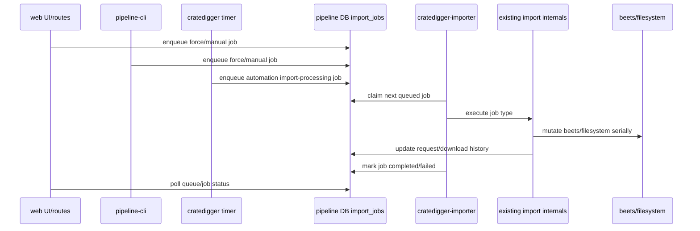
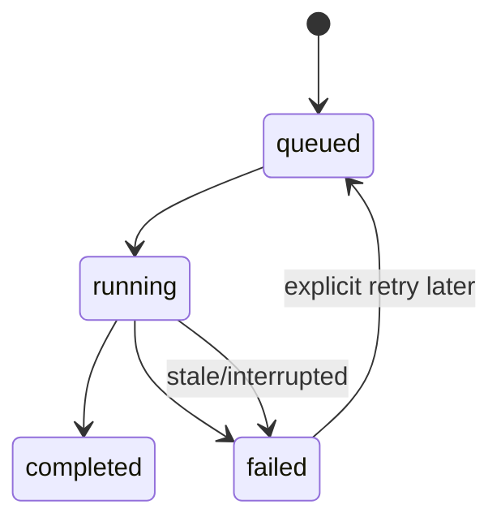
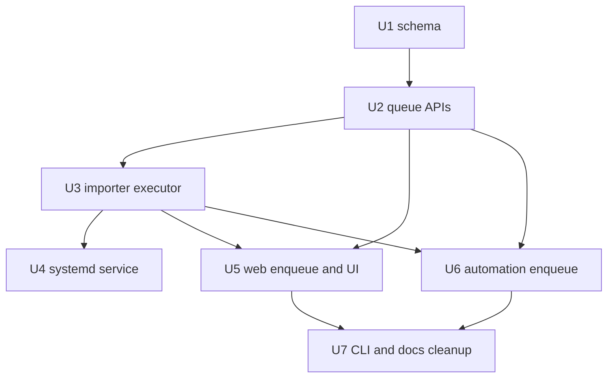

# refactor: Centralize imports behind a shared importer queue

## Overview

Replace scattered beets-mutating import ownership with a shared, DB-backed
import queue and a single importer worker. Web force-import/manual-import,
automation import processing, and CLI force/manual import should submit jobs to
the same durable queue. The importer service should execute beets-mutating work
serially.

This fixes issue #147 as an architectural consequence: web handlers stop running
long imports inline, the UI can show queued/running/completed/failed state, and
the automation pipeline no longer competes with web imports through separate
import entry points.

---

## Problem Frame

The current code has multiple paths into beets-mutating import work:
`web/routes/pipeline.py`, `web/routes/imports.py`,
`scripts/pipeline_cli.py`, and the automation path in `lib/download.py`.
Coordination is spread across `dispatch_import_from_db`,
`dispatch_import_core`, release/request advisory locks, deferred outcomes, and
download-state recovery. That model has become hard to understand and expensive
to change.

The requirements document sets a new target: one importer owner, visible queue
state, and serial beets mutation (see origin:
`docs/brainstorms/importer-queue-requirements.md`).

---

## Requirements Trace

- R1. All beets-mutating import work flows through one importer owner.
- R2. Web force-import and manual-import enqueue work and return quickly.
- R3. Import job state is visible as queued, running, completed, or failed.
- R4. Automation submits ready-to-import work to the shared importer path.
- R5. Wrong Matches shows visible queued/running import feedback.
- R6. Completed jobs continue updating request status and download/import
  history.
- R7. Import failures are visible as job results with useful detail.
- R8. Beets-mutating execution runs serially.
- R9. Parallel preflight/spectral work is deferred until after the serialized
  beets lane exists.
- R10. Advisory-lock and import-state complexity is reviewed for deletion or
  simplification after migration.
- R11. Queue semantics prevent duplicate web submissions for the same source or
  request.

**Origin actors:** A1 Operator, A2 Automation pipeline, A3 Importer, A4 Web UI,
A5 Planner/implementer

**Origin flows:** F1 Web force-import queueing, F2 Automation import queueing,
F3 Import execution, F4 Queue visibility

**Origin acceptance examples:** AE1 long force-import stays responsive, AE2 web
and automation share one beets lane, AE3 batch queue progress and failure
visibility, AE4 lock simplification after migration

---

## Scope Boundaries

- This plan does not try to prove beets parallel write safety. The design
  assumes beets mutation must be serialized.
- This plan does not remove search/download/request lifecycle state.
- This plan does not introduce parallel spectral or preflight workers in the
  first architecture pass.
- This plan does not turn the web UI into a full queue administration product.
  It needs enough feedback for operators to trust that queued work is active.
- This plan does not require deleting every existing advisory lock in the same
  PR that moves work onto the queue. Lock removal should happen only after the
  relevant entry points are queue-owned and covered by tests.

### Deferred to Follow-Up Work

- Parallel preflight/spectral workers: implement after the serialized importer
  lane is proven and all entry points enqueue work.
- Full lock deletion: remove redundant advisory-lock paths only after web,
  automation, and CLI imports no longer invoke beets mutation directly.

---

## Context & Research

### Relevant Code and Patterns

- `lib/pipeline_db.py` owns PostgreSQL access. Schema changes belong in
  `migrations/*.sql`; `PipelineDB` assumes an already-migrated schema.
- `tests/conftest.py` applies migrations to an ephemeral PostgreSQL database
  for DB tests.
- `tests/fakes.py` mirrors `PipelineDB` for orchestration tests and has a
  signature/parity guard in `tests/test_fakes.py`.
- `web/server.py` uses stdlib `HTTPServer`. This plan does not need to make the
  web server threaded because import requests will become short enqueue calls.
- `web/routes/pipeline.py::post_pipeline_force_import` and
  `web/routes/imports.py::post_manual_import` currently call
  `dispatch_import_from_db` inline.
- `web/js/wrong-matches.js` and `web/js/manual.js` currently wait for the
  synchronous response and toast request failure when `fetch()` fails.
- `lib/download.py::poll_active_downloads` currently calls
  `process_completed_album`, which can reach `_handle_valid_result` and
  `dispatch_import_core`.
- `nix/module.nix` already defines wrappers and systemd services for
  `cratedigger`, `cratedigger-web`, and `cratedigger-db-migrate`.
- `tests/test_nix_module.py` protects PYTHONPATH wrapper invariants that matter
  for beets subprocesses.
- `CLAUDE.md` was updated on 2026-04-25 to keep pure quality decisions while
  explicitly not preserving the old scattered import orchestration boundary as
  a design goal.

### Institutional Learnings

- No `docs/solutions/` learnings were present in this checkout.
- Existing docs show the current advisory-lock model is heavily documented
  because it carries real correctness risk. The importer queue should reduce
  that reasoning load rather than add another parallel mechanism forever.

### External References

- None. Local code and requirements are sufficient for this plan.

---

## Key Technical Decisions

- Use a DB-backed queue from day one: web and automation run in different
  processes, so an in-memory web queue cannot satisfy shared ownership.
- Add a long-running importer service: the timer-driven `cratedigger` cycle is
  oneshot and should submit work, not sit around draining beets imports.
- Keep existing import internals behind the queue during migration:
  `dispatch_import_from_db`, `dispatch_import_core`, and
  `process_completed_album` can initially remain the execution machinery, but
  only the importer should call beets-mutating paths once migration completes.
- Serialize importer execution with one worker: additional workers would mostly
  recreate the concurrency question this architecture is meant to remove.
- Make dedupe explicit in queue semantics: request/release locks should not be
  the mechanism that keeps duplicate web clicks from producing duplicate queued
  jobs.
- Surface queue status through web API and UI polling: the operator needs to see
  progress for large Wrong Matches batches.
- Treat advisory-lock cleanup as a later simplification pass: do not remove
  locks before all direct entry points are migrated and tested.

---

## Open Questions

### Resolved During Planning

- Queue persistence: DB-backed from the first implementation because the queue
  must be shared by web, CLI, importer service, and timer-driven automation.
- Initial queue visibility: Wrong Matches gets first-class per-row state and a
  summary; the backend API should still expose queue state generally enough for
  later global indicators.
- Initial execution lane: single worker for beets-mutating jobs.

### Deferred to Implementation

- Exact job payload structs and field names: choose while touching the existing
  force/manual/auto payload shapes, but keep JSONB payloads typed at the
  boundary.
- Exact stale-running timeout and recovery policy: choose a conservative value
  based on existing import timeouts and operational expectations. Beets-mutating
  jobs should not be blindly retried after an interrupted run unless the
  executor can prove the mutation had not started or the job is idempotent.
- Exact UI placement for an eventual global queue indicator: not needed for the
  first Wrong Matches feedback.
- Exact advisory locks to remove: inventory after web, automation, and CLI
  entry points have migrated.

---

## Output Structure

Expected new or substantially changed files:

```text
migrations/003_import_jobs.sql
lib/import_queue.py
scripts/importer.py
tests/test_import_queue.py
docs/plans/2026-04-25-001-refactor-importer-queue-architecture-plan.md
```

Existing files expected to change include:

```text
lib/pipeline_db.py
tests/fakes.py
tests/test_fakes.py
tests/test_pipeline_db.py
web/routes/pipeline.py
web/routes/imports.py
web/server.py
web/js/wrong-matches.js
web/js/manual.js
tests/test_web_server.py
lib/download.py
tests/test_download.py
scripts/pipeline_cli.py
tests/test_pipeline_cli.py
nix/module.nix
tests/test_nix_module.py
docs/advisory-locks.md
docs/pipeline-db-schema.md
docs/webui-primer.md
```

---

## High-Level Technical Design

> *This illustrates the intended approach and is directional guidance for
> review, not implementation specification. The implementing agent should treat
> it as context, not code to reproduce.*



Job lifecycle:



Plan dependency graph:



---

## Implementation Units

- U1. **Add persistent import job schema**

**Goal:** Add a durable queue table for import jobs so web, CLI, automation,
and the importer service can coordinate through PostgreSQL.

**Requirements:** R1, R3, R4, R6, R7, R8, R11; F1, F2, F3; AE1, AE2

**Dependencies:** None

**Files:**
- Create: `migrations/003_import_jobs.sql`
- Modify: `tests/test_migrator.py`
- Test: `tests/test_pipeline_db.py`

**Approach:**
- Create an `import_jobs` table with job type, status, request id, dedupe key,
  JSONB payload, JSONB result, error/message detail, attempt count, run/claim
  timestamps, and created/updated timestamps.
- Include queue-oriented indexes for finding queued work and listing recent jobs.
- Include a uniqueness rule for active dedupe keys so duplicate web clicks or
  repeated automation polls reuse or reject existing nonterminal work instead of
  creating duplicates.
- Use status values that map cleanly to the UI vocabulary: queued, running,
  completed, failed.
- Keep migration history immutable: add a new numbered migration rather than
  editing `001_initial.sql`.

**Execution note:** Start with DB tests that fail because the table and
constraints do not exist.

**Patterns to follow:**
- `migrations/001_initial.sql` for idempotent schema style.
- `tests/conftest.py` and `tests/test_pipeline_db.py` for ephemeral PostgreSQL
  coverage.

**Test scenarios:**
- Happy path: applying migrations creates `import_jobs` with expected core
  columns, status constraints, and indexes.
- Edge case: inserting two active jobs with the same dedupe key is rejected or
  resolved by the later queue API, while completed jobs no longer block a new
  job for the same key.
- Error path: invalid status or job type cannot be inserted.
- Integration: applying all migrations twice remains idempotent.

**Verification:**
- Ephemeral PostgreSQL tests can insert and query import job rows.
- The migration is discoverable as version 3 and does not modify shipped
  migrations.

---

- U2. **Add PipelineDB queue API and fake parity**

**Goal:** Provide a typed, tested DB API for enqueueing, claiming, listing,
completing, and failing import jobs.

**Requirements:** R1, R3, R6, R7, R8, R11; F1, F2, F3, F4; AE1, AE2, AE3

**Dependencies:** U1

**Files:**
- Create: `lib/import_queue.py`
- Modify: `lib/pipeline_db.py`
- Modify: `tests/fakes.py`
- Modify: `tests/test_fakes.py`
- Test: `tests/test_pipeline_db.py`
- Test: `tests/test_import_queue.py`

**Approach:**
- Put boundary structs and payload/result helpers in `lib/import_queue.py` so
  JSONB job data has one vocabulary.
- Add `PipelineDB` methods for enqueue, lookup, recent/list, claim-next,
  heartbeat or mark-running, mark-completed, mark-failed, and stale-running
  recovery.
- Claiming should be atomic and safe if a second importer is accidentally
  started; prefer database-level row claiming rather than Python process state.
- Enqueue should return the existing active job for a dedupe key or clearly
  indicate that the job was deduped, so routes and CLI can present stable job
  feedback.
- Mirror the public API in `FakePipelineDB` so orchestration tests can stay
  fake-backed.

**Execution note:** Implement the queue API test-first because this is the
contract all later units depend on.

**Patterns to follow:**
- `PipelineDB.set_downloading` for guarded state transitions.
- `PipelineDB.advisory_lock` tests for cross-session behavior where real
  PostgreSQL semantics matter.
- `tests/fakes.py` parity conventions and signature guard.

**Test scenarios:**
- Happy path: enqueue a force-import job, fetch it by id, list it in recent
  jobs, claim it, mark it completed, and observe result payload/message.
- Happy path: enqueue returns an existing queued/running job for the same
  dedupe key instead of creating a duplicate.
- Edge case: a completed job with the same dedupe key does not block a later new
  job.
- Error path: marking a non-existent job completed/failed is reported cleanly.
- Error path: malformed payloads are rejected before insertion or preserved as a
  typed validation failure.
- Integration: two DB sessions cannot claim the same queued job.
- Integration: stale running jobs are surfaced for conservative recovery without
  touching completed/failed jobs. Automatic requeue is allowed only for jobs the
  executor can prove did not enter beets-mutating work.

**Verification:**
- Real DB tests prove dedupe and claim semantics.
- Fake parity tests pass with the new queue methods.

---

- U3. **Build the single-lane importer executor**

**Goal:** Add an importer worker that claims one job at a time and executes
existing import internals behind the queue.

**Requirements:** R1, R3, R6, R7, R8, R9, R11; F2, F3; AE2

**Dependencies:** U2

**Files:**
- Create: `scripts/importer.py`
- Modify: `lib/import_queue.py`
- Modify: `lib/import_dispatch.py`
- Modify: `lib/download.py`
- Test: `tests/test_import_queue.py`
- Test: `tests/test_dispatch_from_db.py`
- Test: `tests/test_download.py`

**Approach:**
- Add a long-running worker loop that reads runtime config, opens its own
  `PipelineDB` connection, claims the next queued job, executes it, records the
  result, and repeats.
- Start with one worker and no in-process parallel beets mutation.
- Implement job executors for force-import and manual-import by calling the
  existing `dispatch_import_from_db` path from the importer process.
- Add an automation import-processing executor that reconstructs the completed
  download state and reuses existing post-download processing/import internals.
  The first pass can keep the heavy import logic intact; ownership changes
  before internals are simplified.
- Record job-level success/failure separately from existing durable import state.
  Existing `download_log` and request transitions remain authoritative for
  import results.
- Make worker exceptions fail the job with enough detail for UI/logs, without
  crashing the loop for the next job.

**Execution note:** Characterize current force/manual dispatch outcomes before
moving them behind the worker.

**Patterns to follow:**
- `cratedigger.py` runtime config parsing.
- `dispatch_import_from_db` result handling.
- `poll_active_downloads` reconstruction of `ActiveDownloadState`.

**Test scenarios:**
- Happy path: a queued force-import job calls the existing dispatch path with
  request id, resolved failed path, force flag, outcome label, and source user,
  then marks the job completed.
- Happy path: a queued manual-import job calls the existing dispatch path with
  force false and marks the job completed.
- Happy path: jobs are executed one at a time in claim order by a single worker.
- Error path: dispatch returns `success=False`; the job finishes with failed
  status and the dispatch message is visible.
- Error path: executor raises; the job is marked failed and the worker loop can
  claim the next job.
- Integration: an automation import-processing job reconstructs the active
  download state and calls the same processing path that currently runs from
  `poll_active_downloads`.
- Covers AE2. Integration: when a web job and an auto job are queued, the worker
  processes them through one lane rather than two independent beets paths.

**Verification:**
- Worker tests prove dispatch is no longer tied to web request lifetime.
- Auto-import tests prove the queue can execute completed-download processing
  without the poller directly mutating beets.

---

- U4. **Package and run the importer service**

**Goal:** Add deployment wiring for `cratedigger-importer` as the process that
drains the shared queue.

**Requirements:** R1, R3, R6, R7, R8; F3

**Dependencies:** U3

**Files:**
- Modify: `nix/module.nix`
- Modify: `tests/test_nix_module.py`
- Test: `tests/test_nix_module.py`

**Approach:**
- Add a wrapper for the importer script using the same Python environment and
  PYTHONPATH discipline as the existing wrappers.
- Add a `cratedigger-importer` systemd service that starts after
  `cratedigger-db-migrate.service`, restarts on failure, and uses the same
  runtime config/state directory and broad filesystem permissions as the current
  beets-touching services.
- Add or document a service option for enabling the importer. The default should
  support the new architecture without requiring downstream Nix users to invent
  the service wiring.
- Keep `cratedigger` as a timer-driven producer of download/search work, not as
  the long-running import worker.

**Patterns to follow:**
- `cratedigger-web` service wrapper and environment in `nix/module.nix`.
- `tests/test_nix_module.py` grep-style wrapper contracts.

**Test scenarios:**
- Happy path: `nix/module.nix` contains a `cratedigger-importer` wrapper and
  service that depends on `cratedigger-db-migrate.service`.
- Error path: wrapper PYTHONPATH does not include `${src}/lib` or `${src}/web`.
- Integration: service environment includes the configured pipeline DSN and
  starts from the configured state directory.

**Verification:**
- Nix module text contracts prove the new wrapper follows the subprocess
  environment rules.
- The service can be reasoned about as the only importer queue consumer.

---

- U5. **Move web force/manual import to enqueue and poll**

**Goal:** Make the web UI enqueue force/manual imports and display queue status
instead of blocking request handlers.

**Requirements:** R1, R2, R3, R5, R6, R7, R8, R11; F1, F4; AE1, AE3

**Dependencies:** U2, U3

**Files:**
- Modify: `web/routes/pipeline.py`
- Modify: `web/routes/imports.py`
- Modify: `web/server.py`
- Modify: `web/js/wrong-matches.js`
- Modify: `web/js/manual.js`
- Test: `tests/test_web_server.py`
- Optional test: `tests/test_js_wrong_matches.mjs`

**Approach:**
- Keep existing cheap validation in the POST handlers: missing ids, missing
  request rows, missing failed paths, and path resolution should still fail
  synchronously with useful messages.
- Replace inline `dispatch_import_from_db` calls with queue submission.
- Return `202 Accepted` with job id/status and enough request metadata for the
  UI to display immediate feedback.
- Add job status routes for polling a single job and listing active/recent jobs.
- Update Wrong Matches to show per-row queued/running/completed/failed state,
  disable duplicate submissions for active jobs, and refresh wrong matches after
  a job completes.
- Update manual import UI to handle queued/running/completed/failed instead of
  only a synchronous imported/failed response.
- Preserve existing delete and refresh behavior for rows not involved in queued
  imports.

**Execution note:** Start with route contract tests for `202` enqueue behavior
before changing frontend polling.

**Patterns to follow:**
- Existing route contract tests in `tests/test_web_server.py`.
- Existing `_refreshWrongMatches` guard in `web/js/wrong-matches.js`.
- Existing route classification audit in `tests/test_web_server.py`.

**Test scenarios:**
- Covers AE1. Happy path: `POST /api/pipeline/force-import` with a valid
  download log returns `202` and a job id without calling
  `dispatch_import_from_db`.
- Happy path: `POST /api/manual-import/import` returns `202` and a job id
  without calling `dispatch_import_from_db`.
- Happy path: `GET` job status returns queued/running/completed/failed payloads
  with required fields for the UI.
- Edge case: duplicate force-import submission for the same download log returns
  the existing active job rather than creating another.
- Error path: existing validation errors still return 400/404 before enqueue.
- Covers AE3. Integration: a mixed queue state can be serialized for the UI with
  counts and per-job messages.
- UI behavior: a force-import button moves from queued to running to imported
  and refreshes wrong matches on completion.
- UI behavior: a failed job shows the job failure message rather than the false
  "request failed" toast.

**Verification:**
- Web tests prove force/manual imports are no longer executed inline.
- Manual UI inspection or JS tests prove visible queued/running feedback exists.

---

- U6. **Move automation import processing to enqueue**

**Goal:** Make completed-download processing submit automation
import-processing jobs to the shared importer instead of mutating beets directly
from the timer cycle.

**Requirements:** R1, R4, R6, R7, R8, R10, R11; F2, F3; AE2

**Dependencies:** U2, U3

**Files:**
- Modify: `lib/download.py`
- Modify: `cratedigger.py`
- Test: `tests/test_download.py`
- Test: `tests/test_integration_slices.py`

**Approach:**
- Change the completed-download path so detecting an album as complete enqueues
  an automation import-processing job keyed by request id rather than calling
  `process_completed_album` inline from `poll_active_downloads`. The executor
  must preserve existing source rules: request downloads may auto-import when
  validation passes; redownload/manual-review paths still stage for review
  rather than importing into beets.
- Keep `status='downloading'` and `active_download_state` as the durable
  handoff until the importer completes or fails the job.
- Ensure repeated poll cycles for an already queued/running automation
  import-processing job do not create duplicates and do not time out the
  download just because it is waiting for the importer lane.
- Move or wrap the current `_run_completed_processing` behavior so the importer
  can execute it from the queued job.
- Preserve crash recovery: stale queued/running jobs and
  `active_download_state.processing_started_at` must lead to retry or manual
  recovery behavior at least as safe as today.

**Execution note:** Add characterization tests around existing
`poll_active_downloads` completion behavior before changing it to enqueue.

**Patterns to follow:**
- Existing `poll_active_downloads` tests in `tests/test_download.py`.
- Existing deferred/contention tests in `tests/test_integration_slices.py`.
- `ActiveDownloadState` reconstruction patterns in `lib/download.py`.

**Test scenarios:**
- Covers AE2. Happy path: a completed active download enqueues one automation
  import-processing job and does not call `process_completed_album` inline.
- Happy path: a queued automation import-processing job is deduped on the next
  poll cycle.
- Edge case: a request with an active automation import-processing job is not
  reset to wanted by download timeout logic while waiting for the importer.
- Error path: missing or corrupt active download state still follows existing
  crash recovery behavior and does not enqueue unusable jobs.
- Integration: importer execution of an automation import-processing job
  produces the same request/download-log transitions as the old inline path.
- Integration: stale running automation jobs are recoverable without creating
  duplicate beets imports.

**Verification:**
- The timer cycle becomes a producer of automation import-processing jobs, not
  an importer.
- Existing download lifecycle state remains meaningful after the change.

---

- U7. **Migrate CLI entry points and document simplification**

**Goal:** Close the remaining direct force/manual import entry points and update
docs to reflect the new importer ownership model.

**Requirements:** R1, R3, R6, R7, R10, R11; A5; AE4

**Dependencies:** U5, U6

**Files:**
- Modify: `scripts/pipeline_cli.py`
- Modify: `tests/test_pipeline_cli.py`
- Modify: `docs/advisory-locks.md`
- Modify: `docs/pipeline-db-schema.md`
- Modify: `docs/webui-primer.md`
- Modify: `CLAUDE.md`
- Test: `tests/test_pipeline_cli.py`

**Approach:**
- Change CLI force-import/manual-import to enqueue jobs by default and print the
  job id/status rather than running `dispatch_import_from_db` directly.
- Add enough CLI visibility to inspect import jobs, or clearly point operators
  at an existing status route if CLI job inspection is deferred.
- Update docs so they describe the importer queue as the beets-mutating owner.
- Review `docs/advisory-locks.md` and code comments for locks whose rationale is
  now transitional. Do not delete locks in this unit unless the implementation
  has already made their old direct-call protection unreachable and tests prove
  the queue covers the invariant.
- Keep `CLAUDE.md` aligned with the new guidance: pure quality decisions remain
  valuable; the old scattered import orchestration boundary is not a design
  goal.

**Patterns to follow:**
- Existing pipeline CLI command tests.
- Updated `CLAUDE.md` decision architecture guidance.
- Issue #147 scope update comment.

**Test scenarios:**
- Happy path: `pipeline-cli force-import <download_log_id>` enqueues a
  force-import job with the expected dedupe key and source username.
- Happy path: `pipeline-cli manual-import <id> <path>` enqueues a manual-import
  job with the expected path payload.
- Error path: existing CLI validation failures still avoid enqueueing unusable
  jobs.
- Integration: no remaining CLI force/manual path calls
  `dispatch_import_from_db` directly.
- Covers AE4. Documentation review: docs name importer queue ownership and mark
  remaining advisory-lock complexity as transitional or still justified.

**Verification:**
- Web, automation, and CLI import entry points enqueue jobs.
- Documentation no longer teaches the old multi-owner import boundary as the
  desired architecture.

---

## System-Wide Impact

- **Interaction graph:** Web routes, JS UI, CLI, timer poller, importer worker,
  PostgreSQL queue state, `download_log`, and request transitions all interact.
- **Failure propagation:** Import execution failures should become failed jobs
  with operator-visible messages while preserving existing `download_log` semantics
  where the import internals already record durable failures.
- **State lifecycle risks:** The largest risk is a job stuck in running state
  after process death. The queue API needs stale-running recovery, and the
  automation path must avoid resetting completed downloads to wanted while an
  import job is active.
- **API surface parity:** Web, CLI, and automation all need enqueue semantics.
  Leaving CLI direct import in place would violate the single-owner goal.
- **Integration coverage:** Unit tests alone will not prove shared ownership.
  Include cross-layer tests showing web/automation jobs share one queue and the
  importer performs serial execution.
- **Unchanged invariants:** Existing request status and `download_log` remain
  durable import result surfaces. Quality decisions in `lib/quality.py` remain
  pure where practical.

---

## Risks & Dependencies

| Risk | Mitigation |
|------|------------|
| Queue table exists but no worker drains it | Add the importer service in the same delivery sequence as web enqueue, and make route/UI behavior expose queued state clearly. |
| Automation import-processing jobs get stuck running after process death | Add stale-running recovery that fails/intervenes conservatively by default; retry only when the executor can prove beets mutation had not started or the job is idempotent. |
| Completed downloads time out while waiting in the import queue | Teach `poll_active_downloads` that a nonterminal automation import-processing job owns processing for that request. |
| Job payloads drift between producers and worker | Centralize payload/result structs in `lib/import_queue.py` and test JSONB round trips. |
| Existing locks mask whether the queue truly owns imports | Treat locks as defensive during migration, then add a final inventory and docs update to identify what can be removed. |
| Operator loses confidence during large batches | Show per-row state and aggregate queue counts in Wrong Matches. |
| Nix wrapper reintroduces PYTHONPATH subprocess breakage | Extend `tests/test_nix_module.py` to cover the new importer wrapper. |

---

## Documentation / Operational Notes

- Update `docs/pipeline-db-schema.md` with the import job table and CLI/web
  enqueue flow.
- Update `docs/webui-primer.md` with queued force-import behavior.
- Update `docs/advisory-locks.md` after migration to distinguish still-needed
  locks from transitional locks.
- Deployment must apply migrations before starting `cratedigger-importer`,
  `cratedigger-web`, or the timer producer.
- Operational checks should include queue backlog, stale running jobs, and recent
  failed jobs.

---

## Alternative Approaches Considered

- Web-only in-memory job registry: rejected because it fixes the HTTP timeout
  but leaves automation and web as separate import owners.
- Four parallel import workers: rejected for the first pass because beets
  parallel write safety is not proven and parallel workers would reintroduce the
  concurrency model this redesign is meant to eliminate.
- Global beets advisory lock: rejected as the primary design because it would
  add another lock around a multi-owner model instead of reducing the number of
  owners.
- Keep CLI direct import: rejected because it would preserve a direct
  beets-mutating path outside the importer owner.

---

## Phased Delivery

### Phase 1: Queue Foundation

- U1 and U2. Land persistent job storage, API methods, fake parity, and DB claim
  semantics.

### Phase 2: Importer and Web Responsiveness

- U3, U4, and U5. Add the worker, package it, and move web force/manual import
  onto enqueue/poll behavior. This phase directly resolves the visible issue
  #147 symptoms.

### Phase 3: Automation Ownership

- U6. Move completed-download import processing from inline execution to queued
  importer execution.

### Phase 4: Interface Parity and Simplification

- U7. Migrate CLI force/manual import and update docs/lock guidance.

---

## Sources & References

- **Origin document:** `docs/brainstorms/importer-queue-requirements.md`
- Related issue: #147
- Related code: `web/routes/pipeline.py`
- Related code: `web/routes/imports.py`
- Related code: `lib/download.py`
- Related code: `lib/import_dispatch.py`
- Related code: `lib/pipeline_db.py`
- Related docs: `docs/advisory-locks.md`
- Related docs: `docs/pipeline-db-schema.md`
