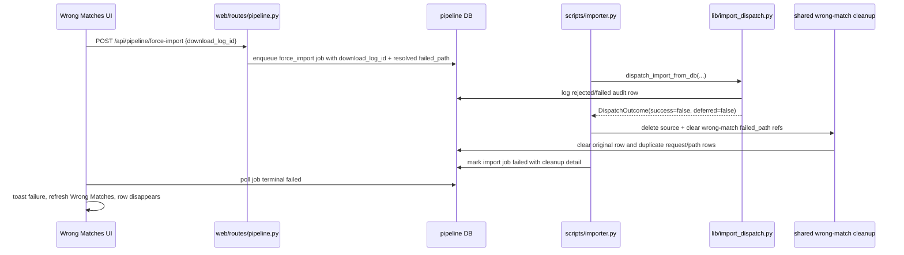

# fix: Clean rejected force imports from Wrong Matches

## Overview

When an operator force-imports a Wrong Matches entry and the importer pipeline
rejects it, the source directory should be removed from disk and the actionable
wrong-match row should disappear. The failure should still remain visible in
`import_jobs` and `download_log` as audit history, but it should no longer sit
in the manual review queue as something to retry.

The key boundary is the queued `force_import` job, not
`dispatch_import_from_db()` itself. Existing dispatch behavior intentionally
preserves `failed_imports/` on force/manual rejection so standalone/manual paths
do not destroy a user's only source copy. This fix should add cleanup only after
a non-deferred failed force-import job that originated from Wrong Matches.

---

## Problem Frame

Wrong Matches entries are rejected downloads that still have an on-disk
`failed_path`. Force-importing one of those entries is an explicit operator
decision to try that candidate despite the beets distance check. If the shared
pipeline then rejects the candidate for nested layout, corrupt audio, spectral
failure, downgrade, or another non-deferred validation/import decision, keeping
the same files and row around creates a retry loop.

The current code already has most of the pieces: `web/routes/pipeline.py`
enqueues force-import jobs with the original `download_log_id`,
`scripts/importer.py` executes them, `lib/pipeline_db.py` can clear a
wrong-match row's `failed_path`, and `web/routes/imports.py` has a web-only
delete helper. The missing piece is a shared cleanup path used by the importer
worker when a force-import job fails.

---

## Requirements Trace

- R1. A non-deferred failed `force_import` job should delete the candidate's
  `failed_imports/` source directory when it still exists.
- R2. The original Wrong Matches `download_log` row should have
  `validation_result.failed_path` cleared so the row no longer appears as
  actionable.
- R3. Any duplicate rejected rows for the same `(request_id, failed_path)` that
  were created by the failed force-import attempt should also be cleared so the
  row cannot reappear through `get_wrong_matches()` path deduplication.
- R4. The failure audit should remain intact in `download_log` and
  `import_jobs`; only the actionable `failed_path` pointer is removed.
- R5. Manual imports, automation imports, release-lock deferrals, and unexpected
  worker crashes should keep existing preservation behavior.
- R6. The Wrong Matches UI should refresh after a failed force-import job so the
  cleaned row disappears without requiring a tab reload.

---

## Scope Boundaries

- This does not change beets matching, distance thresholds, pre-import gates, or
  quality-rank decisions.
- This does not call `beet remove -d` or delete anything from the beets library.
- This does not move cleanup into `dispatch_import_from_db()`; dispatch-level
  force/manual rejection should still preserve source files.
- This does not apply failed-job cleanup to manual imports or automation imports
  in this change.
- This does not change successful force/manual import cleanup, which already
  removes the now-empty source folder after beets moves the files.
- This does not add a new import job status or retry model.

---

## Context & Research

### Relevant Code and Patterns

- `web/routes/pipeline.py::post_pipeline_force_import` validates the original
  wrong-match row and enqueues `IMPORT_JOB_FORCE` with `download_log_id`,
  `failed_path`, and optional `source_username`.
- `lib/import_queue.py::force_import_payload` already carries the original
  `download_log_id`; no payload contract expansion is required for the normal
  web/CLI force-import path.
- `scripts/importer.py::process_claimed_job` is the right place to observe the
  terminal `DispatchOutcome` and update the import job result.
- `lib/import_dispatch.py::dispatch_import_from_db` and
  `dispatch_import_core` intentionally preserve force/manual source directories
  on non-terminal rejection. `tests/test_dispatch_from_db.py` pins that
  boundary.
- `lib/pipeline_db.py::get_wrong_matches` collapses rejected rows by
  `(request_id, failed_path)`, so cleanup needs to handle both the original row
  and any newer rejected row with the same path.
- `lib/pipeline_db.py::clear_wrong_match_path` clears one row by
  `download_log.id`; `tests/fakes.py` mirrors this for web and worker tests.
- `web/routes/imports.py::_delete_wrong_match_row` has the current web endpoint
  behavior but lives in the web layer, so the worker should use a shared library
  helper rather than importing route code.
- `web/js/wrong-matches.js::_pollImportJob` refreshes on completed jobs but
  leaves the row stale on failed jobs.

### Institutional Learnings

- No `docs/solutions/` learnings are present in this checkout.
- `CLAUDE.md` records the key deletion invariant: never delete beets-library
  duplicates and never use `beet remove -d`. This fix only deletes rejected
  source folders under `failed_imports/`.

### External References

- None. Local queue, DB, and Wrong Matches patterns are sufficient.

---

## Key Technical Decisions

- Put cleanup at the force-import job boundary: the worker knows the job type,
  original `download_log_id`, resolved path, and terminal outcome.
- Keep `dispatch_import_from_db()` preservation intact: this avoids regressing
  manual import behavior and the existing issue #89 protections.
- Add a shared cleanup helper under `lib/`, not `web/routes/`: both the web
  delete endpoint and importer worker need the same domain behavior without a
  web-to-worker dependency.
- Clear by row id and every observed `(request_id, failed_path)` string: the
  original row may store an old relative path, while the failed force-import
  attempt usually logs the resolved absolute path.
- Treat cleanup as a failure-side effect, not a success signal: the job remains
  `failed`, with cleanup details in the job result where useful.
- Refresh Wrong Matches after failed job polling: backend cleanup alone is not
  enough if the current DOM still shows the removed row.

---

## Open Questions

### Resolved During Planning

- Should this apply to manual imports? No. The user named force-import from
  Wrong Matches, and manual import uses the same source-preservation invariant
  for a different operator workflow.
- Should the failed job become `completed` after cleanup succeeds? No. The
  import failed; cleanup is a follow-up side effect.
- Should dispatch-level tests that assert no cleanup on force downgrade be
  rewritten? No. They should remain and the new behavior should be tested at
  the importer job layer.

### Deferred to Implementation

- Exact helper names and return shape: choose while editing, but keep the helper
  small and testable.
- Exact handling for filesystem deletion errors: implementation should avoid
  hiding a cleanup failure. A reasonable default is to keep the job failed and
  include cleanup error detail in `result`.

---

## High-Level Technical Design

> *This illustrates the intended approach and is directional guidance for
> review, not implementation specification. The implementing agent should treat
> it as context, not code to reproduce.*

---

## Implementation Units

- U1. **Create Shared Wrong-Match Cleanup Primitive**

**Goal:** Provide a reusable library path that deletes a wrong-match source
directory and clears the DB pointers that make it actionable.

**Requirements:** R1, R2, R3, R4

**Dependencies:** None

**Files:**
- Create: `lib/wrong_matches.py`
- Create: `tests/test_wrong_matches_cleanup.py`
- Modify: `lib/pipeline_db.py`
- Modify: `tests/test_pipeline_db.py`
- Modify: `tests/fakes.py`
- Modify: `tests/test_fakes.py`

**Approach:**
- Add a small shared helper that accepts the DB, original `download_log_id`, and
  an optional failed-path hint from the force-import job payload.
- Resolve the path using existing `lib.util.resolve_failed_path` behavior so
  legacy relative `failed_path` rows still work.
- Delete the resolved source directory when it exists.
- Clear the original row with `clear_wrong_match_path(download_log_id)`.
- Add a DB/fake method to clear all rejected rows for the same
  `(request_id, failed_path)` so a newly logged rejection with the same path
  cannot become the next visible wrong-match entry. Call it for every path
  representation the helper can observe: the raw path from the original row,
  the job payload hint, and the resolved absolute path when available.
- Preserve audit fields other than `validation_result.failed_path`; do not
  delete `download_log` rows.

**Execution note:** Add characterization coverage around the current
`clear_wrong_match_path`/duplicate-path behavior before broadening it.

**Patterns to follow:**
- `web/routes/imports.py::_delete_wrong_match_row` for the current delete
  semantics.
- `lib/pipeline_db.py::clear_wrong_match_path` for JSONB update style.
- `tests/fakes.py::clear_wrong_match_path` for fake parity.

**Test scenarios:**
- Happy path: given an original wrong-match row and an on-disk directory, the
  helper deletes the directory and clears `failed_path` from the original row.
- Integration: given a newer rejected row for the same request and resolved
  path, the helper clears both the original row and the duplicate request/path
  row.
- Edge case: given an old relative `failed_path` on the original row and an
  absolute path hint from the job payload, the original row is cleared and
  duplicate rows using either the relative or absolute path are cleared.
- Edge case: given a missing directory, the helper still clears the stale
  original wrong-match pointer without raising.
- Error path: given a filesystem deletion error, the helper reports the error
  and does not silently claim cleanup success.
- Fake parity: `FakePipelineDB` implements the same clear-by-request/path
  behavior for dict and JSON-string `validation_result` payloads.

**Verification:**
- Wrong-match cleanup can be exercised without importing web route modules.
- `get_wrong_matches()` no longer returns rows whose `failed_path` was cleared
  by the helper.

---

- U2. **Run Cleanup After Failed Force-Import Jobs**

**Goal:** Wire the shared cleanup helper into the importer worker after a
non-deferred failed force-import job.

**Requirements:** R1, R2, R3, R4, R5

**Dependencies:** U1

**Files:**
- Modify: `scripts/importer.py`
- Modify: `tests/test_import_queue.py`

**Approach:**
- In `process_claimed_job`, after `execute_import_job()` returns a failed
  `DispatchOutcome`, check for `job.job_type == IMPORT_JOB_FORCE`,
  `outcome.deferred is False`, and an integer `payload.download_log_id`.
- Call the shared cleanup helper before marking the job failed, then include
  cleanup details in the failed job `result`.
- Do not run this cleanup for manual jobs, automation jobs, release-lock
  deferrals, invalid payload failures without a trustworthy log id, or worker
  crashes caught by the outer exception handler.
- Keep the job terminal status as `failed`; the operator still needs to know
  that import did not happen.

**Patterns to follow:**
- `scripts/importer.py::_job_result` for job result JSON shape.
- `scripts/importer.py::process_claimed_job` for terminal status updates.
- Existing `tests/test_import_queue.py` worker tests that patch
  `dispatch_import_from_db`.

**Test scenarios:**
- Happy path: a force-import job whose dispatch returns
  `DispatchOutcome(False, "Pre-import gate rejected")` deletes the source,
  clears the original wrong-match row, and marks the job `failed`.
- Integration: if dispatch logs a newer rejected row with the same
  `failed_path`, the worker cleanup clears that row as well as the original
  row.
- Edge case: a force-import job that fails because the path is already missing
  clears the original stale wrong-match pointer and records cleanup as
  path-absent/no-delete.
- Error path: cleanup failure leaves the job `failed` and records cleanup error
  detail instead of crashing the worker.
- Non-goal guard: manual-import failure does not delete or clear a wrong-match
  row.
- Non-goal guard: `DispatchOutcome(deferred=True)` from release-lock contention
  does not delete source files or clear the row.

**Verification:**
- Failed force-import jobs remove their source from the actionable Wrong Matches
  set while keeping the failed job/audit visible.
- Existing dispatch-level preservation tests still pass unchanged.

---

- U3. **Refresh Wrong Matches UI and Update Docs**

**Goal:** Make the browser reflect backend cleanup after a failed force-import
job and document the new failed-job cleanup rule.

**Requirements:** R4, R6

**Dependencies:** U2

**Files:**
- Modify: `web/js/wrong-matches.js`
- Create or modify: `tests/test_js_wrong_matches.mjs`
- Modify: `docs/pipeline-db-schema.md`
- Modify: `docs/webui-primer.md`

**Approach:**
- In `_pollImportJob`, refresh Wrong Matches after `job.status === 'failed'`
  just as the completed branch already refreshes after successful import.
- Preserve the failed toast so the operator sees why import did not happen
  before the row disappears.
- Document that failed queued force-imports clean up their source candidate and
  clear the actionable wrong-match pointer, while still leaving audit rows.

**Patterns to follow:**
- `web/js/wrong-matches.js` completed-job refresh path.
- Existing Node-style JS tests such as `tests/test_js_util.mjs` if a small
  browserless test harness is practical.
- `docs/pipeline-db-schema.md` Force-Import section for operator-facing
  behavior.

**Test scenarios:**
- Happy path: when polling observes a failed job, the UI invalidates and
  refreshes Wrong Matches after showing the failure toast.
- Regression: completed-job refresh behavior remains unchanged.
- Edge case: transient polling errors still continue polling and do not
  prematurely refresh.

**Verification:**
- After a failed force-import job, the visible Wrong Matches row disappears
  without a manual page reload when backend cleanup succeeds.
- Documentation matches the new queue-owned force-import behavior.

---

## System-Wide Impact

- **Interaction graph:** `web/routes/pipeline.py` continues to enqueue jobs;
  `scripts/importer.py` adds a post-dispatch cleanup side effect for failed
  force jobs; `lib/pipeline_db.py` gains a small JSONB cleanup method; the
  Wrong Matches UI refreshes after failed job polling.
- **Error propagation:** Import failure remains the job's terminal error.
  Cleanup failures should be recorded in job result detail rather than
  converting the failed import into a success or crashing the worker.
- **State lifecycle risks:** Clear DB pointers only after deletion succeeds or
  the path is already absent, otherwise files could be orphaned outside the UI.
- **API surface parity:** The force-import payload already includes
  `download_log_id`; manual import has no equivalent wrong-match row id and is
  intentionally outside this change.
- **Integration coverage:** Worker tests need to prove the end-to-end behavior
  because dispatch tests alone should still assert source preservation.
- **Unchanged invariants:** No beets-library deletion, no direct import outside
  the queue, no manual-import cleanup on failure, and no change to request
  status transitions.

---

## Risks & Dependencies

| Risk | Mitigation |
|------|------------|
| Deleting source files in manual or standalone dispatch paths | Gate cleanup on `IMPORT_JOB_FORCE` at the worker layer and keep existing dispatch tests unchanged. |
| Clearing DB pointers while files remain on disk | Have the helper report deletion errors and avoid claiming cleanup success when `rmtree` fails. |
| Duplicate rejected rows make the entry reappear | Clear the original row id and every observed `(request_id, failed_path)` representation. |
| Relative legacy paths are not cleared | Resolve paths through `lib.util.resolve_failed_path`, always clear the original `download_log_id`, and clear both raw and resolved path strings. |
| UI still shows a stale failed row | Refresh Wrong Matches after failed job polling. |
| Audit trail is lost | Remove only `validation_result.failed_path`; preserve `download_log`, `import_jobs`, scenarios, details, and errors. |

---

## Documentation / Operational Notes

- Update `docs/pipeline-db-schema.md` to state that queued force-import failures
  clean up the reviewed source candidate and clear the actionable wrong-match
  pointer.
- Update `docs/webui-primer.md` if its Wrong Matches section describes failed
  force-import behavior or row persistence.
- No migration is required.
- No deployment workflow changes are required beyond the normal Nix rollout.

---

## Sources & References

- Related requirements: `docs/brainstorms/importer-queue-requirements.md`
- Related completed plan:
  `docs/plans/2026-04-25-001-refactor-importer-queue-architecture-plan.md`
- Queue worker: `scripts/importer.py`
- Queue payloads: `lib/import_queue.py`
- Force-import route: `web/routes/pipeline.py`
- Wrong Matches route/delete behavior: `web/routes/imports.py`
- Pipeline DB wrong-match query/clear behavior: `lib/pipeline_db.py`
- Dispatch preservation boundary: `lib/import_dispatch.py`
- Worker tests: `tests/test_import_queue.py`
- Dispatch preservation tests: `tests/test_dispatch_from_db.py`
- DB wrong-match tests: `tests/test_pipeline_db.py`, `tests/test_fakes.py`
- UI polling: `web/js/wrong-matches.js`
