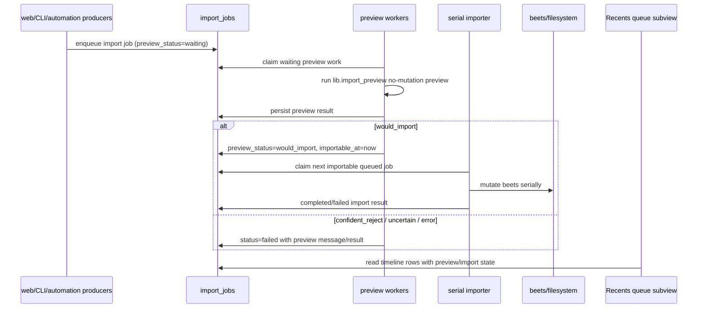
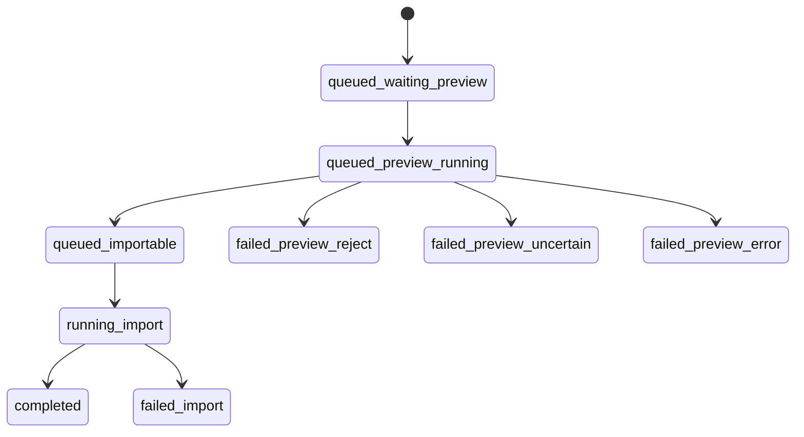
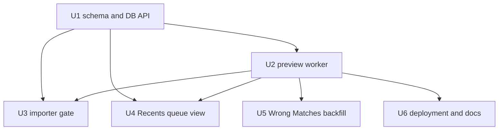

# feat: Add async preview gate to importer queue

## Overview

Add a durable async preview stage in front of the existing shared importer
queue. Preview workers should claim queued import jobs, run the no-mutation
preview path, persist audit values and verdicts, and make only `would_import`
jobs eligible for the serial beets importer.

The existing queue architecture and unified import-preview service are
prerequisites. This plan does not rebuild them. It extends them so CPU-heavy
validation, spectral analysis, measurement, and would-import decisions can run
in parallel while beets mutation remains a single lane.

---

## Problem Frame

The current implementation already moved web, CLI, and automation imports into
`import_jobs`, drained by `scripts/importer.py`, and exposed basic queue state.
It also already has a synchronous preview seam in `lib/import_preview.py` and
preview-driven Wrong Matches triage.

The updated requirements push the architecture one stage further: queue jobs
should not enter the beets lane until preview has completed and said the job is
importable. Non-importable preview results should become visible operator
messages and durable audit state, not late surprises inside the serial
importer. Recents should expose the queue timeline as a subview, and historical
Wrong Matches previewing should be an explicit one-shot operation (see origin:
`docs/brainstorms/importer-queue-requirements.md`).

---

## Requirements Trace

- R1. Preserve one importer owner for all beets-mutating import work.
- R2. Preserve fast-return web force/manual import enqueue behavior.
- R3. Extend job state so the UI can distinguish queued, previewing,
  importable, running, completed, and failed work.
- R4. Preserve automation submission through the same importer path.
- R5. Keep Wrong Matches feedback for queued/running import work.
- R6. Preserve existing durable request status and download/import history.
- R7. Surface import and preview failures as job results with useful detail.
- R8. Keep beets-mutating execution serial.
- R9. Move preflight, spectral, measurement, and preview-decision work outside
  the serial beets lane.
- R10. Continue treating old advisory-lock and import-state complexity as
  cleanup candidates after shared ownership is stable.
- R11. Preserve duplicate-submission protection for the same source/request.
- R12. Add preview/decision state for waiting, running, would-import,
  confident-reject, uncertain, and error outcomes.
- R13. Persist validation, spectral, measurement, and decision values before a
  job becomes importable.
- R14. Make the beets importer claim only jobs whose preview is complete and
  importable.
- R15. Convert confident-reject, uncertain, and error preview outcomes into
  clear terminal job outcomes, preserve audit detail, and denylist source-owned
  failures when attribution exists.
- R16. Put queue visualization under Recents rather than a separate dashboard.
- R17. Show a single beets import timeline sorted by importable order, with
  preview values and row colors/statuses filling in as preview completes.
- R18. Add an explicit one-shot Wrong Matches preview backfill path for
  resolvable files.
- R19. Continuously rediscover queued import jobs needing preview so restarts do
  not lose readiness work.
- R20. Make async preview worker concurrency deployment-tunable, with a default
  of two workers for doc2.

**Origin actors:** A1 Operator, A2 Automation pipeline, A3 Importer, A4 Web UI,
A5 Planner/implementer, A6 Async preview worker, A7 Deployer/operator

**Origin flows:** F1 Web force-import queueing, F2 Automation import queueing,
F3 Import execution, F4 Queue visibility, F5 Async preview readiness,
F6 Recents queue view, F7 Wrong Matches preview backfill

**Origin acceptance examples:** AE1 long force-import stays responsive, AE2 web
and automation share one beets lane, AE3 batch progress and failure visibility,
AE4 lock simplification candidates after migration, AE5 preview makes a job
importable, AE6 uncertain/error preview stays out of the beets lane, AE7 Recents
queue timeline, AE8 doc2 backfill and preview worker operation

---

## Scope Boundaries

- Do not make beets writes parallel. The importer remains a single worker lane.
- Do not replace `lib/import_preview.py`; async workers should call that seam.
- Do not make web requests perform preview work inline.
- Do not add a standalone queue administration product. Recents gets a queue
  subview.
- Do not sweep all historical failed downloads continuously. Historical Wrong
  Matches previewing is an explicit operator command.
- Do not delete old advisory locks in the same pass unless the touched lock is
  proven redundant by this implementation and covered by tests.
- Do not make preview results silently clean or denylist sources without clear
  source attribution.

### Deferred to Follow-Up Work

- Broad advisory-lock deletion: do after preview-gated import ownership has
  landed and queue behavior has been observed.
- Highly live UI streaming: periodic refresh or manual reload is enough for the
  Recents queue subview.
- A full operator control surface for retries/cancellation: keep this plan to
  visibility, preview gating, and one-shot backfill.
- Prepared staging or durable converted preview artifacts: add only if measured
  conversion time remains a bottleneck after async previews are deployed.

Tracking issue: <https://github.com/abl030/cratedigger/issues/169>.

---

## Context & Research

### Relevant Code and Patterns

- `migrations/003_import_jobs.sql` defines the current shared queue table with
  `queued`, `running`, `completed`, and `failed` status.
- `lib/import_queue.py` contains `ImportJob`, job type constants, payload
  validation, and dedupe-key helpers.
- `lib/pipeline_db.py` owns queue persistence: enqueue, list, claim, complete,
  fail, stale recovery, and active dedupe handling.
- `scripts/importer.py` claims queued jobs and runs force/manual/automation
  import work through one beets-mutating lane under the importer advisory lock.
- `lib/import_preview.py` already answers `would_import`,
  `confident_reject`, and `uncertain` for values, request/path pairs, and
  download-log rows without mutating beets, source folders, DB state, queues, or
  denylists.
- `lib/wrong_match_triage.py` already persists preview-driven triage audit
  details on `download_log.validation_result`.
- `web/routes/pipeline.py` already exposes `/api/import-jobs` and
  `/api/import-jobs/<id>` for queue polling.
- `web/js/recents.js` is currently a simple history view over
  `/api/pipeline/log`; `web/index.html` has a single Recents pane without
  subviews.
- `nix/module.nix` already creates `cratedigger-importer` as a long-lived
  service, with wrapper/service assertions in `tests/test_nix_module.py`.
- Project memory requires TDD and running Python/tests through `nix-shell`.

### Institutional Learnings

- No `docs/solutions/` directory exists in this checkout.
- `.claude/memory/feedback_tdd.md` requires test-first work.
- `.claude/memory/feedback_use_nix_shell.md` requires Python commands and tests
  to run inside `nix-shell`.
- `.claude/memory/project_audio_quality_types.md` reinforces that quality
  decisions should be debuggable from structured measurements and audit fields.

### External References

- None. This work is driven by existing repo-local queue, preview, UI, and Nix
  patterns.

---

## Key Technical Decisions

- Store preview state on `import_jobs` rather than creating a separate preview
  queue. The preview stage is a readiness gate for an import job, not a second
  product queue.
- Keep import `status` and preview state separate. `status` remains the terminal
  job lifecycle (`queued`, `running`, `completed`, `failed`), while preview
  fields explain whether a queued job is waiting, previewing, importable, or
  rejected before beets mutation.
- Make new jobs default to `preview_status='waiting'`. The serial importer
  should claim only `status='queued'` and `preview_status='would_import'`.
- Persist the full preview result as JSONB and also store summary fields for
  filtering and UI sorting. The JSONB audit should include enough measurement
  and stage-chain detail to explain the decision.
- Treat non-importable preview results as terminal failed import jobs for now.
  The job never reaches beets, but the operator sees one clear failed queue row
  with preview detail.
- Order the beets timeline by importable readiness first: importable jobs sort
  by `importable_at`, then `created_at`, then `id`. Waiting/previewing jobs
  stay visible below with their preview state.
- Build the async preview worker as a long-lived producer of readiness state,
  separate from `scripts/importer.py`. This keeps CPU-heavy preview work outside
  the importer lock and lets deployment tune preview concurrency independently.
- Keep Wrong Matches backfill explicit and bounded. It should operate only on
  current resolvable Wrong Matches rows, skip rows already represented by active
  import jobs, and record audit results.

---

## Open Questions

### Resolved During Planning

- Preview state storage: on `import_jobs`, because readiness belongs to the
  queued import job and Recents needs one timeline.
- Importer claim rule: claim only queued jobs with complete `would_import`
  preview state.
- Recents placement: add a Recents subview, not a new top-level nav item.
- Historical preview sweep: one-shot CLI operation, not a daemon scanner.
- Initial worker concurrency: expose a deployment knob and use two workers as
  the doc2 default.

### Deferred to Implementation

- Exact column names for timestamps and worker identifiers. Prefer clear names
  like `preview_started_at`, `preview_completed_at`, `preview_worker_id`, and
  `importable_at`.
- Exact denylist helper to call for preview rejections with source attribution.
  Use the existing request/source denylist API that matches the rejection path
  once the implementation is in the relevant call site.
- Exact route spelling for the Recents queue API. Prefer a focused endpoint
  such as `/api/import-jobs/timeline` if it keeps the existing
  `/api/import-jobs` contract stable.
- Exact preview-worker process model. A single process with multiple worker
  loops is likely simplest, but separate systemd instances are acceptable if
  they fit the Nix module better.

---

## High-Level Technical Design

> *This illustrates the intended approach and is directional guidance for
> review, not implementation specification. The implementing agent should treat
> it as context, not code to reproduce.*

Lifecycle overlay:

Plan dependency graph:

---

## Implementation Units

- U1. **Add durable preview state to import jobs**

**Goal:** Extend `import_jobs` and queue APIs so every import job can carry
preview readiness, audit payloads, worker ownership, and UI-friendly summary
state.

**Requirements:** R3, R7, R11, R12, R13, R14, R15, R17, R19; F4, F5, F6; AE5,
AE6, AE7

**Dependencies:** None

**Files:**
- Create: `migrations/004_import_job_previews.sql`
- Modify: `lib/import_queue.py`
- Modify: `lib/pipeline_db.py`
- Modify: `tests/fakes.py`
- Modify: `tests/test_fakes.py`
- Test: `tests/test_pipeline_db.py`
- Test: `tests/test_import_queue.py`
- Test: `tests/test_migrator.py`

**Approach:**
- Add preview status values: `waiting`, `running`, `would_import`,
  `confident_reject`, `uncertain`, and `error`.
- Add columns for preview result JSONB, preview message/error, preview attempts,
  preview worker id, preview start/heartbeat/completion timestamps, and
  `importable_at`.
- Backfill existing nonterminal import jobs to `preview_status='would_import'`
  or choose a guarded migration behavior that avoids stranding jobs created
  before this feature. Completed/failed historical jobs can leave preview fields
  null or use a compatible default.
- Extend `ImportJob` serialization so API callers get preview fields without
  unpacking raw JSON.
- Add DB methods to claim waiting preview work atomically, heartbeat preview
  work, mark preview importable, fail a job from preview rejection/error, and
  list a timeline sorted for Recents.
- Preserve active dedupe behavior. A queued job waiting for preview is still an
  active job for dedupe purposes.

**Execution note:** Implement the migration and DB API test-first. These fields
are the contract for every later unit.

**Patterns to follow:**
- `migrations/003_import_jobs.sql` for idempotent migration style.
- `PipelineDB.claim_next_import_job` for `FOR UPDATE SKIP LOCKED` claiming.
- `ImportJob.to_json_dict()` for API serialization.
- `tests/fakes.py` and `tests/test_fakes.py` parity checks.

**Test scenarios:**
- Happy path: migrations create preview columns, constraints, and claim/list
  indexes, and reapplying migrations is idempotent.
- Happy path: a newly enqueued import job has `preview_status='waiting'` and is
  returned by the preview claim API.
- Happy path: marking preview `would_import` persists preview JSONB,
  `preview_completed_at`, and `importable_at`.
- Edge case: active dedupe still returns an existing queued job when it is
  waiting or running preview.
- Edge case: completed historical jobs serialize with preview fields absent or
  null without breaking existing API contract tests.
- Error path: invalid preview status cannot be inserted or passed through
  typed validation.
- Integration: two DB sessions cannot claim the same waiting preview job.
- Integration: stale preview-running jobs are rediscovered for retry or failure
  without touching already importable/completed/failed jobs.

**Verification:**
- Real PostgreSQL tests prove preview claim, persistence, dedupe, and timeline
  ordering.
- Fake parity tests pass with the new queue methods.

---

- U2. **Build async preview worker execution**

**Goal:** Add a long-lived preview worker that continuously finds queued import
jobs needing preview, runs the no-mutation preview seam, and persists the
result before the importer can see the job.

**Requirements:** R7, R8, R9, R12, R13, R15, R19, R20; F5; AE5, AE6, AE8

**Dependencies:** U1

**Files:**
- Create: `scripts/import_preview_worker.py`
- Modify: `lib/import_queue.py`
- Modify: `lib/pipeline_db.py`
- Test: `tests/test_import_queue.py`
- Test: `tests/test_import_preview.py`

**Approach:**
- Add worker code that opens DB connections, claims waiting preview work, runs
  the existing preview function for the job type, persists the preview result,
  and loops.
- Resolve preview input from each existing job type:
  - `force_import`: use payload `failed_path`, `request_id`,
    `download_log_id`, `source_username`, and force preview semantics.
  - `manual_import`: use payload `failed_path`, `request_id`, and non-force
    preview semantics.
  - `automation_import`: use `album_requests.active_download_state.current_path`
    as the source path with non-force preview semantics, preserving existing
    automation staging assumptions.
- On `would_import`, mark the job importable and leave `status='queued'`.
- On `confident_reject`, `uncertain`, or preview exception, mark the job
  `status='failed'`, store the preview payload in `result`, and write an
  operator-facing message that names the preview reason.
- For source-owned confident rejections with attribution, call the existing
  request/source denylist mechanism and record the denylist effect in the job
  result. Avoid denylisting path-missing or attribution-free errors.
- Do not clean source folders from the preview worker. Cleanup decisions remain
  owned by existing Wrong Matches helpers or import-dispatch failure handling.
- Support `--once`, `--poll-interval`, `--worker-id`, and a bounded concurrency
  option so tests and services can run deterministically.

**Execution note:** Start with unit tests around job-type-to-preview-input
mapping and terminal status transitions before wiring the loop.

**Patterns to follow:**
- `scripts/importer.py` for DB setup, loop shape, worker id, and `--once`.
- `lib.import_preview.preview_import_from_path` and
  `preview_import_from_download_log` for no-mutation preview behavior.
- `lib.download.reconstruct_grab_list_entry` and `ActiveDownloadState` parsing
  patterns for automation job state.

**Test scenarios:**
- Covers AE5. Happy path: a force-import job previews as `would_import`, stores
  preview measurements/stage chain, and becomes importable without changing
  import `status` from `queued`.
- Happy path: a manual-import job maps request id and failed path into
  `preview_import_from_path` without force semantics.
- Happy path: an automation job uses `active_download_state.current_path` and
  stores an importable non-force preview result.
- Error path: missing request, missing failed path, or missing automation
  current path fails the job with a clear preview message.
- Covers AE6. Error path: `uncertain` preview fails the job and never sets
  `importable_at`.
- Error path: preview exceptions fail the job while the worker can claim the
  next job.
- Integration: a restarted worker can claim jobs still waiting for preview and
  can recover stale preview-running jobs according to the DB API.
- Denylist path: source-attributed confident reject records denylist effect;
  attribution-free or path-missing failures do not denylist.

**Verification:**
- Preview worker tests prove no beets-mutating import function is called.
- Job results contain enough preview detail for API and logs to explain the
  outcome.

---

- U3. **Gate the serial importer on preview readiness**

**Goal:** Change the beets importer claim path so only preview-complete,
importable jobs enter the serial beets lane.

**Requirements:** R1, R3, R4, R6, R7, R8, R9, R14, R15; F2, F3, F5; AE2, AE5,
AE6

**Dependencies:** U1, U2

**Files:**
- Modify: `lib/pipeline_db.py`
- Modify: `scripts/importer.py`
- Modify: `tests/test_import_queue.py`
- Modify: `tests/test_download.py`
- Test: `tests/test_import_queue.py`
- Test: `tests/test_download.py`

**Approach:**
- Update `PipelineDB.claim_next_import_job` to filter for `status='queued'` and
  `preview_status='would_import'`.
- Sort importable jobs by `importable_at`, then `created_at`, then `id`, so the
  importer drains the same order Recents presents as the beets import timeline.
- Ensure the importer does not treat waiting/previewing jobs as "no work" in a
  misleading way. Logs can distinguish "no importable jobs" from "queue empty"
  if that helps operations.
- Preserve importer advisory-lock behavior. Preview workers must not take the
  beets importer lock.
- Preserve existing completion/failure writes from `scripts/importer.py`; final
  import results should augment, not erase, preview audit data.
- Make automation polling idempotent while a job is waiting for preview. Repeat
  polls should dedupe to the active job and avoid treating preview wait time as
  a download timeout.

**Execution note:** Add regression tests that a queued job without importable
preview is invisible to the importer before changing the claim query.

**Patterns to follow:**
- Existing `claim_next_import_job` atomic update pattern.
- Existing automation enqueue tests around duplicate poll cycles in
  `tests/test_download.py`.
- `scripts/importer.py.process_claimed_job` result persistence.

**Test scenarios:**
- Covers AE5. Happy path: a job marked preview `would_import` is claimed and
  executed by the importer.
- Covers AE6. Error path: jobs with preview `waiting`, `running`,
  `confident_reject`, `uncertain`, or `error` are not claimed by the importer.
- Integration: a web force job and automation job both become importable and
  are drained in `importable_at` order through one importer lane.
- Error path: import failure preserves preview result fields and writes final
  import error detail.
- Edge case: repeated automation polls while preview is waiting/running return
  the existing active job instead of enqueueing duplicates.
- Edge case: stale importer recovery does not reset preview status or make a
  never-previewed job importable.

**Verification:**
- Importer tests prove beets mutation can only begin after preview importable
  state exists.
- Existing web/automation queue contracts still pass with preview fields added.

---

- U4. **Add the Recents queue subview**

**Goal:** Show the queue under Recents as one import-order timeline with
preview and import status visible per row.

**Requirements:** R3, R5, R7, R12, R13, R16, R17; F4, F6; AE3, AE6, AE7

**Dependencies:** U1, U2

**Files:**
- Modify: `web/index.html`
- Modify: `web/js/recents.js`
- Modify: `web/js/main.js`
- Modify: `web/js/state.js`
- Modify: `web/routes/pipeline.py`
- Modify: `tests/test_web_server.py`
- Test: `tests/test_web_server.py`
- Test: `tests/test_web_recents.py`
- Optional test: `tests/test_js_recents.mjs`

**Approach:**
- Add a small Recents subnav with existing history and new queue timeline
  choices. Keep Recents as the top-level tab.
- Add or extend an API route that returns timeline rows with job id, job type,
  request identity, queue status, preview status, preview verdict, preview
  message, stage chain, import status, created/importable/run/completed times,
  and UI summary fields.
- Sort rows with importable queued jobs first by `importable_at`, then
  preview-running/waiting jobs, then terminal recent jobs. The first importable
  queued row is the next beets import.
- Use row color/status to distinguish waiting preview, preview running,
  importable queued, importing, completed, and failed preview/import outcomes.
- Include preview values and messages when present, but do not require live
  streaming. Reload on subview open and poll at a modest interval only while
  nonterminal jobs are visible.
- Preserve the existing Recents history behavior and counts.

**Execution note:** Start with route contract tests for the timeline payload,
then add focused JS rendering tests if the DOM behavior is non-trivial.

**Patterns to follow:**
- `web/js/recents.js` rendering and `state.recentsFilter`.
- Existing `/api/import-jobs` serialization in `web/routes/pipeline.py`.
- `tests/test_web_server.py` route contract style.
- Existing JS tests such as `tests/test_js_wrong_matches.mjs`.

**Test scenarios:**
- Covers AE7. Happy path: mixed preview states render in one timeline with the
  importable queued job at the top.
- Happy path: a `would_import` row displays preview measurements/verdict detail
  and an importable/next status.
- Covers AE6. Error path: an `uncertain` or preview error row displays the
  preview failure message and is not styled as importable.
- Integration: Recents history filter still loads from `/api/pipeline/log`
  unchanged.
- Edge case: empty queue subview renders a neutral empty state.
- Edge case: terminal failed import row can show both preview detail and final
  import error without overlapping text or hiding the key message.

**Verification:**
- Web contract tests prove API fields and sorting.
- UI inspection or JS tests prove Recents contains the queue subview and row
  statuses are readable.

---

- U5. **Add explicit Wrong Matches preview backfill**

**Goal:** Provide a one-shot operator path to preview current Wrong Matches rows
with resolvable files, record audit results, and skip historical rows that are
not safe to process.

**Requirements:** R12, R13, R15, R18, R19, R20; F7; AE8

**Dependencies:** U2

**Files:**
- Modify: `lib/wrong_match_triage.py`
- Modify: `scripts/pipeline_cli.py`
- Modify: `lib/pipeline_db.py`
- Modify: `tests/fakes.py`
- Test: `tests/test_wrong_match_triage.py`
- Test: `tests/test_pipeline_cli.py`
- Test: `tests/test_pipeline_db.py`
- Test: `tests/test_fakes.py`

**Approach:**
- Add an explicit CLI command for backfill, for example
  `pipeline-cli wrong-match-preview-backfill`, or a clearly named mode on the
  existing wrong-match triage command.
- Process only rows currently returned by `get_wrong_matches()` whose
  `failed_path` resolves on disk.
- Skip rows that already have an active force-import job for their
  `download_log_id` dedupe key.
- Persist preview audit for every processed row using the existing
  `record_wrong_match_triage` shape or a compatible extension that records
  `action='preview_backfilled'`.
- Keep cleanup conservative. The default should be audit-only; an explicit
  cleanup flag may reuse current cleanup-eligible reject behavior if the user
  wants the backfill to reduce the backlog.
- Report counts for previewed, skipped missing files, skipped active jobs,
  would-import, confident-reject, uncertain/error, cleaned, and cleanup-failed
  rows.
- Do not enqueue import jobs from this backfill. Normal queued imports continue
  through the async preview worker path.

**Execution note:** Add tests for skip rules and audit payloads before exposing
the CLI command.

**Patterns to follow:**
- `triage_wrong_match` and `triage_wrong_matches` in
  `lib/wrong_match_triage.py`.
- `pipeline-cli wrong-match-triage` command parsing and JSON output.
- `PipelineDB.get_import_job_by_dedupe_key` for active queued/running skip
  checks.

**Test scenarios:**
- Covers AE8. Happy path: a resolvable Wrong Matches row is previewed, audited,
  and reported in summary counts.
- Happy path: audit-only mode keeps a cleanup-eligible confident reject visible
  but records the preview verdict.
- Happy path: cleanup mode deletes/clears only cleanup-eligible confident
  rejects and reports cleanup counts.
- Edge case: missing files are skipped and counted without preview execution.
- Edge case: a row with an active queued/running force-import job is skipped and
  counted.
- Error path: preview exception records an uncertain/error audit result without
  aborting the entire backfill.
- Integration: JSON output is stable enough for deployment logs.

**Verification:**
- CLI tests prove the backfill is explicit, bounded, and auditable.
- DB/fake tests prove audit data survives clearing rows when cleanup mode is
  used.

---

- U6. **Wire deployment knobs and documentation**

**Goal:** Package the async preview workers, expose concurrency tuning, and
document the queue/preview operating model.

**Requirements:** R8, R9, R10, R12, R13, R14, R16, R17, R18, R19, R20; F5, F6,
F7; AE4, AE8

**Dependencies:** U2

**Files:**
- Modify: `nix/module.nix`
- Modify: `tests/test_nix_module.py`
- Modify: `docs/pipeline-db-schema.md`
- Modify: `docs/webui-primer.md`
- Modify: `docs/advisory-locks.md`
- Test: `tests/test_nix_module.py`

**Approach:**
- Add deployment wiring for the preview worker service using the same Python
  environment and state directory patterns as `cratedigger-importer`.
- Expose preview worker concurrency through Nix/module configuration and script
  flags. The doc2 default should be two workers, with docs explaining that CPU,
  swap pressure, and queue throughput should drive changes.
- Pass concurrency by service/script flag in the first pass. Avoid adding a
  config.ini field unless implementation finds a real non-Nix runtime need.
- Ensure preview workers start after DB migrations and do not require the
  importer advisory lock.
- Update schema docs with preview fields, lifecycle, and importable claim
  semantics.
- Update web docs to describe the Recents queue subview.
- Update advisory-lock docs to clarify that preview parallelism is outside the
  beets mutation lane and that remaining import locks are cleanup candidates,
  not the primary ownership model.

**Execution note:** Start with Nix module text-contract tests so wrapper and
service details stay consistent with existing deployment guarantees.

**Patterns to follow:**
- `cratedigger-importer` wrapper/service in `nix/module.nix`.
- Existing `tests/test_nix_module.py` assertions for wrappers and service
  dependencies.
- `docs/pipeline-db-schema.md` import_jobs section.
- `docs/webui-primer.md` route and UI summaries.

**Test scenarios:**
- Happy path: Nix module defines a preview worker wrapper and systemd service
  that starts after `cratedigger-db-migrate.service`.
- Happy path: preview worker service receives the configured worker count or
  process count and defaults to two in the module.
- Error path: invalid worker count is rejected by module or CLI parser tests.
- Integration: preview worker service environment includes `PIPELINE_DB_DSN`
  and uses the same state directory/PYTHONPATH wrapper discipline as importer.
- Documentation expectation: docs describe preview state, Recents queue view,
  backfill command, and tuning guidance.

**Verification:**
- Nix and config tests prove deployment knobs render correctly.
- Docs give the deployer enough information to tune doc2 without reading source
  code first.

---

## Risk Analysis & Mitigation

- **Persistent migration risk:** Preview fields change the meaning of a queued
  job. Mitigate by explicitly handling pre-existing nonterminal jobs in the
  migration and adding real PostgreSQL tests for claim behavior before and
  after preview fields are set.
- **Preview failures blocking imports:** If preview worker deployment is broken,
  new jobs will remain waiting and never import. Mitigate with clear Recents
  waiting status, worker service tests, and logs that distinguish queue empty
  from no importable jobs.
- **False confident rejects:** Preview will prevent beets import before the
  serial lane sees the job. Mitigate by preserving full preview audit detail,
  treating uncertain as failed-visible rather than cleanup, and making cleanup
  opt-in for backfill.
- **Duplicate work during restarts:** Preview and importer workers both need
  atomic claim semantics. Mitigate with `FOR UPDATE SKIP LOCKED`, stale-running
  recovery tests, and active dedupe preservation.
- **UI confusion from two lifecycles:** Import status and preview status can
  diverge. Mitigate by keeping Recents copy/status concise: waiting preview,
  previewing, importable, importing, completed, failed.
- **Operational overload:** Spectral/measurement work can consume CPU and swap.
  Mitigate with default two preview workers, deployment tuning docs, and a
  single configurable knob.

---

## System-Wide Impact

- **Interaction graph:** Web routes, CLI commands, automation polling, preview
  workers, the serial importer, Recents UI, and Wrong Matches triage all read or
  write `import_jobs`. The plan keeps `lib/pipeline_db.py` as the persistence
  boundary and `lib/import_queue.py` as the shared vocabulary so these surfaces
  do not invent separate job states.
- **Error propagation:** Preview failures should become terminal job failures
  with `preview_status` and preview JSONB detail. Import failures should remain
  final importer failures while preserving preview audit data. UI surfaces should
  render the highest-signal message without requiring operators to inspect logs.
- **State lifecycle risks:** A job can be queued but not importable, importable
  but not yet running, running after preview, or failed before import. Claim
  queries and stale recovery need to preserve these distinctions so restarts do
  not make unpreviewed work importable or erase audit detail.
- **API surface parity:** `/api/import-jobs`, the new Recents queue API, CLI
  JSON output, and Nix-managed worker commands should expose compatible
  vocabulary for status, preview status, verdict, message, timestamps, and job
  ids.
- **Integration coverage:** Unit tests alone will not prove the handoff. The
  plan calls for DB-backed claim tests, worker transition tests, automation
  dedupe tests, and web route/UI contract tests across preview and import
  boundaries.
- **Unchanged invariants:** Beets mutation remains single-lane; the synchronous
  no-mutation preview service remains the decision seam; existing request
  status and download history remain durable import history; active queue
  dedupe still prevents duplicate work.

---

## Alternative Approaches Considered

- **Separate `import_previews` queue table:** Rejected for the first pass because
  preview readiness is part of one import job lifecycle. A separate queue would
  make Recents join two product queues and increase state reconciliation risk.
- **Run preview inside `scripts/importer.py`:** Rejected because it would put
  CPU-heavy validation and spectral work back into the serial beets lane,
  undermining R9 and reducing the payoff of the async stage.
- **Let uncertain preview results remain queued for manual review:** Deferred.
  Failing the job with a clear preview message gives operators visible state
  now; retry/review controls can be a later queue-management feature.
- **Automatically sweep all historical failed downloads:** Rejected by the
  origin scope. The backfill should be explicit and limited to current Wrong
  Matches rows with resolvable files.

---

## Phased Delivery

1. Land U1 and U3 together or behind a compatibility migration path so existing
   jobs cannot be stranded by the new claim gate.
2. Land U2 with `--once` tests before enabling any long-lived deployment
   service.
3. Land U4 after preview and importer state are stable enough for a useful UI.
4. Land U5 as an operator command after audit persistence is proven.
5. Land U6 deployment wiring and docs when the worker command behavior is
   stable.

---

## Documentation Plan

- `docs/pipeline-db-schema.md`: add preview fields and lifecycle rules.
- `docs/webui-primer.md`: document Recents queue subview and preview/import
  states.
- `docs/advisory-locks.md`: clarify preview worker parallelism versus serial
  beets mutation.
- `docs/brainstorms/importer-queue-requirements.md`: leave as origin input; do
  not rewrite it as implementation progress.

---

## Sources & References

- Origin document: `docs/brainstorms/importer-queue-requirements.md`
- Completed queue prerequisite:
  `docs/plans/2026-04-25-001-refactor-importer-queue-architecture-plan.md`
- Completed preview prerequisite:
  `docs/plans/2026-04-25-004-unified-import-preview-plan.md`
- Existing queue implementation: `migrations/003_import_jobs.sql`,
  `lib/import_queue.py`, `lib/pipeline_db.py`, `scripts/importer.py`
- Existing preview implementation: `lib/import_preview.py`,
  `lib/wrong_match_triage.py`, `scripts/pipeline_cli.py`
