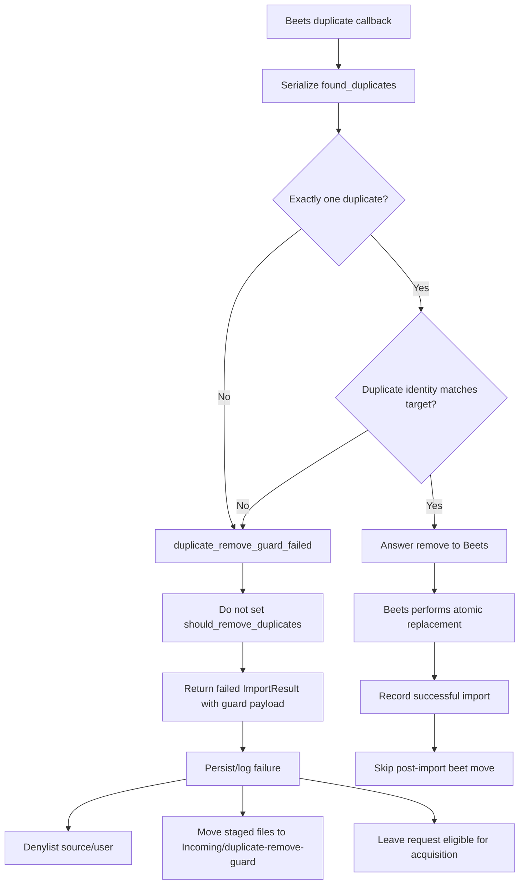

# refactor: Restore guarded Beets replacement

Outcome update: after a live Beets-owned move/import round completed cleanly,
the follow-up cleanup removed the old Cratedigger-owned replacement state
machine. Historical implementation notes below still describe the temporary
one-release overlap that has now ended.

## Overview

Restore Beets as the owner of duplicate album replacement while keeping
Cratedigger as the guardrail that validates Beets' exact would-remove set.
The importer should answer `remove` only when Beets reports exactly one
duplicate album and that album matches the target release identity. Unsafe
duplicate sets fail before library mutation, denylist the source/user, move
the staged candidate into a separate guard quarantine under Incoming, and leave
the request eligible for normal acquisition.

This plan deliberately keeps the old Cratedigger stale-row cleanup and sibling
canonicalization state machine for one release as temporary fallback code, but
successful guarded replacement must skip the post-import `beet move` path.

---

## Problem Frame

The Palo Santo incident was caused by an unsafe Beets duplicate configuration:
`duplicate_keys` was outside `import:`, so Beets matched duplicates too broadly.
Cratedigger responded by always avoiding Beets' destructive duplicate remove
path and implementing its own delete-later and move-later replacement state
machine.

That overcorrection is now the source of path drift. Album upgrades can create
new folders while old Plex-visible folders remain as missing albums. The desired
product behavior is Beets' original atomic delete-and-replace flow, with
Cratedigger validating the exact delete set before allowing the operation
(see origin: `docs/brainstorms/guarded-beets-replacement-requirements.md`).

The implementation hinge is Beets' duplicate-resolution callback. The harness
already receives `found_duplicates` immediately before deciding whether to set
`task.should_remove_duplicates = True`; that callback is the right place to ask
"what would Beets remove?" without introducing a separate dry-run command.

---

## Requirements Trace

- R1. Restore Beets-owned duplicate replacement for safe same-release upgrades.
- R2. Inspect the exact Beets `found_duplicates` set before answering `remove`.
- R3. Answer `remove` only when the would-remove set contains exactly one album.
- R4. Answer `remove` only when that album matches the target release identity.
- R5. Keep the startup/config guard that requires
  `import.duplicate_keys.album` to include `mb_albumid`.
- R6. Stop before destructive replacement on guard failure.
- R7. Fail the import attempt/job with `duplicate_remove_guard_failed`.
- R8. Do not change the request type, status, or long-lived intent to manual or
  another permanent shape on guard failure.
- R9. Denylist the source/user that produced the risky staged candidate.
- R10. Move staged files to a separate Incoming quarantine folder, distinct
  from Wrong Matches.
- R11. Persist and log the Beets would-remove set: album ids, release ids where
  available, album paths, and item counts.
- R12. On successful guarded replacement, do not run post-import `beet move`
  disambiguation or sibling canonicalization.
- R13. Keep old stale-row cleanup and sibling canonicalization for one release
  only, marked loudly as temporary in code, docs, tests, and commit messaging.
- R14. After one deployed release with a successful guarded upgrade and no
  unresolved fallback need, remove the old Cratedigger replacement state
  machine.

**Origin actors:** A1 Operator, A2 Cratedigger importer, A3 Beets harness,
A4 Acquisition pipeline, A5 Plex/Meelo downstream scanners.

**Origin flows:** F1 Guarded same-release replacement, F2 Unsafe duplicate set,
F3 One-release transition.

**Origin acceptance examples:** AE1 safe same-release replacement, AE2 multiple
duplicates fail closed, AE3 mismatched duplicate fails closed, AE4 request is
not converted to manual, AE5 temporary state machine is removed after one
successful release.

---

## Scope Boundaries

- This does not remove or weaken the Beets duplicate-key startup/config guard.
- This does not change quality policy, matching thresholds, source selection,
  or upgrade/downgrade ranking.
- This does not add a new UI surface for guard failure quarantine in v1.
- This does not convert requests to manual on guard failure.
- This does not reuse Wrong Matches storage or Wrong Matches cleanup helpers for
  duplicate-remove guard failures.
- This does not run whole-library path repair as part of the code change.
- This does not immediately delete the old Cratedigger replacement state
  machine before the one-release overlap has been tested.

### Deferred to Follow-Up Work

- Remove the old stale-row cleanup, disambiguation, sibling move propagation,
  and associated temporary tests after one deployed release proves guarded
  Beets replacement through at least one successful upgrade.
- Run the operator whole-library path repair outside this code change: preview
  `beet move -p -a`, inspect paths, then run the real `beet move -a` only when
  the preview is accepted.

---

## Context & Research

### Relevant Code and Patterns

- `harness/beets_harness.py` already asserts
  `config["import"]["duplicate_keys"]["album"]` includes `mb_albumid`. Keep
  this guard and its existing tests in `tests/test_harness_config_guard.py`.
- `harness/beets_harness.py::resolve_duplicate` receives Beets'
  `found_duplicates`, emits duplicate metadata, and currently sets
  `task.should_remove_duplicates = True` only when the controller answers
  `remove`.
- `harness/import_one.py::run_import` currently answers `keep` for duplicate
  callbacks and records the old `kept_duplicate` path. This is the central
  behavior to replace with guard evaluation.
- `harness/import_one.py` also owns the post-import stale-row cleanup and
  sibling canonicalization path. Those helpers should remain temporarily but
  should not run after successful guarded Beets-owned replacement.
- `lib/release_identity.py::ReleaseIdentity` is the existing normalization
  helper for MusicBrainz UUIDs and Discogs numeric ids. Use it for target and
  duplicate release matching instead of introducing a new identity model.
- `lib/quality.py::ImportResult` and `PostflightInfo` are the typed JSON
  boundary from the harness to dispatch and `download_log`. New guard payloads
  should be typed `msgspec.Struct`s and preserve legacy-row decoding behavior.
- `lib/quality.py::dispatch_action` currently maps unknown failures to
  `record_rejection=True` without denylisting. `duplicate_remove_guard_failed`
  needs an explicit action path because it is a source failure that also needs
  denylisting and quarantine.
- `lib/import_dispatch.py::dispatch_import_core` owns result persistence,
  denylisting, requeue/cleanup behavior, media server notification, and moved
  sibling propagation. Guard failure handling belongs here, not in a web-only
  path.
- `lib/processing_paths.py` contains staging path helpers and constants such as
  `AUTO_IMPORT_STAGING_SUBDIR`. Add a separate guard quarantine helper here or
  in a small adjacent library module.
- `lib/wrong_matches.py`, `scripts/importer.py`, and related tests provide a
  useful pattern for moving failure-side cleanup into a shared domain helper,
  but duplicate-remove guard quarantine must remain a separate domain path.
- `tests/test_disambiguation.py`, `tests/test_preflight_stale_removal.py`,
  `tests/test_import_result.py`, `tests/test_import_dispatch.py`, and
  `tests/fakes.py` cover the current replacement, result, dispatch, and fake DB
  contracts that this plan changes.

### Institutional Learnings

- No `docs/solutions/` learnings are present in this checkout.
- Existing project guidance treats destructive Beets operations as high-risk
  and keeps raw `beet remove`/`beet move` shelling concentrated in
  `lib/beets_album_op.py`. This plan does not add new raw Beets operations; it
  lets Beets perform its own importer duplicate replacement after guard
  validation.

### External References

- None. The behavior is governed by local Beets callback behavior and existing
  Cratedigger importer contracts. Local source inspection confirms Beets'
  `found_duplicates` set is the album set used by `remove_duplicates()` when
  `task.should_remove_duplicates = True`.

---

## Key Technical Decisions

- Guard at `resolve_duplicate`: this is the last safe decision point before
  Beets can remove duplicates, and it carries the exact album set Beets would
  remove.
- Fail closed on identity ambiguity: if the target release identity cannot be
  normalized, if the duplicate row has no comparable identity, or if the source
  types differ, do not answer `remove`.
- Use `ReleaseIdentity` for matching: MusicBrainz rows match on normalized
  `mb_albumid`; Discogs rows match on normalized non-zero `discogs_albumid`.
- Represent guard failures as source failures, not request-shape changes:
  dispatch should denylist the source/user and clear the active staged
  candidate without converting the request to manual.
- Add a separate guard quarantine: use `Incoming/duplicate-remove-guard/` under
  the configured Incoming/staging root so the files are preserved, out of active
  staging, and visibly distinct from Wrong Matches.
- Persist a structured guard payload: logs and Recents should be able to show
  the would-remove set without parsing ad hoc strings.
- Skip post-import `beet move` after guarded replacement: Beets' atomic import
  path should own final folder placement for this flow.
- Mark the old state machine as temporary, not fallback architecture: the code
  remains for one release only and should carry explicit removal text that
  references this plan and R14.

---

## Open Questions

### Resolved During Planning

- Where should Cratedigger inspect what Beets would remove? Use
  `harness/beets_harness.py::resolve_duplicate` and the `found_duplicates`
  argument, not a separate Beets dry run.
- How should release identity matching handle MusicBrainz and Discogs? Use
  `lib/release_identity.py::ReleaseIdentity`; fail closed when either side
  cannot produce a comparable exact-release identity.
- Should guard failure become a manual request? No. It is a bad source/attempt,
  not a permanent request classification.
- Should guard quarantine reuse Wrong Matches? No. The user explicitly chose a
  separate folder under Incoming.
- Should successful guarded replacement still run Cratedigger's post-import
  `beet move`? No. That is the path creating avoidable folder churn.

### Deferred to Implementation

- Exact helper names and struct names: choose while editing, but keep the data
  model small, typed, and local to duplicate-remove guard behavior.
- Exact guard quarantine target naming: use request id, attempt/job/log id when
  available, sanitized source/folder basename, and collision suffixing. Final
  naming can be chosen while wiring the dispatch context.
- Exact Recents presentation: v1 should rely on existing import result and
  failure detail surfaces, with no new UI. If the existing API drops the
  structured payload, add the smallest API mapping needed to make the failure
  loud.
- Exact active-download terminalization: dispatch may need to release transient
  active download state so acquisition can continue, but it must not convert
  the request to manual or otherwise change the request's long-lived intent.

---

## High-Level Technical Design

> *This illustrates the intended approach and is directional guidance for
> review, not implementation specification. The implementing agent should treat
> it as context, not code to reproduce.*

---

## Implementation Units

- U1. **Serialize Beets Duplicate Candidates**

**Goal:** Make the harness emit a structured, complete-enough representation of
the exact albums Beets says it would remove.

**Requirements:** R2, R5, R11; supports F1, F2, AE1, AE2, AE3

**Dependencies:** None

**Files:**
- Modify: `harness/beets_harness.py`
- Modify: `tests/test_harness_config_guard.py`
- Test: `tests/test_duplicate_remove_guard.py`

**Approach:**
- Keep `_assert_duplicate_keys_include_mb_albumid` unchanged in spirit and
  maintain the current tests that fail loud when `mb_albumid` is missing.
- Add duplicate candidate serialization inside or immediately beside
  `resolve_duplicate`. Capture at least Beets album id, MusicBrainz release id,
  Discogs release id when present, album path, item count, album artist, and
  album title.
- Avoid serializing whole item lists by default. If item paths are useful for
  logs, cap them in the structured payload and rely on logs for full detail.
- Preserve the existing controller protocol shape enough that older action
  handling remains understandable, but add the guard payload to the
  `resolve_duplicate` event.

**Execution note:** Add characterization coverage for the existing duplicate
event shape before changing the event payload.

**Patterns to follow:**
- `harness/beets_harness.py::resolve_duplicate` existing duplicate event.
- `tests/test_harness_config_guard.py` for focused harness-level behavior.

**Test scenarios:**
- Happy path: a duplicate album with MB and Discogs fields is serialized with
  id, release ids, path, item count, artist, and title.
- Edge case: an album missing optional Discogs fields still serializes with an
  empty or absent Discogs identity and does not crash the callback.
- Edge case: a duplicate with zero items serializes `item_count=0` so the guard
  payload remains diagnosable.
- Error path: the config guard still raises when
  `import.duplicate_keys.album` omits `mb_albumid`.
- Integration: the `resolve_duplicate` event sent to the controller includes
  the same duplicate count as the serialized candidate list length.

**Verification:**
- The harness can show, before any `remove` decision, the exact album set Beets
  reported for duplicate removal.
- Existing config-guard behavior remains intact.

---

- U2. **Add Guarded Remove Decision in Import Controller**

**Goal:** Replace the current always-`keep` duplicate callback answer with
guarded `remove` for safe same-release replacements and a structured failure
for unsafe sets.

**Requirements:** R1, R2, R3, R4, R6, R7, R12; covers F1, F2, AE1, AE2, AE3

**Dependencies:** U1

**Files:**
- Modify: `harness/import_one.py`
- Test: `tests/test_disambiguation.py`
- Test: `tests/test_duplicate_remove_guard.py`

**Approach:**
- Build the target identity from the requested release id using
  `ReleaseIdentity`. For Beets duplicate candidates, build identities from
  candidate `mb_albumid` and `discogs_albumid`.
- Allow `{"action": "remove"}` only when the candidate list length is exactly
  one and the candidate identity key equals the target identity key.
- Fail closed for zero duplicates, multiple duplicates, mismatched identity,
  unknown target identity, unknown duplicate identity, or mixed source types.
- On guard failure, stop the import before Beets can mutate the library and
  produce an `ImportResult` decision of `duplicate_remove_guard_failed` with
  the guard payload.
- On guarded success, do not set the old `kept_duplicate` path that later
  triggers stale cleanup and sibling moves.

**Execution note:** Implement the guard behavior test-first because the current
tests assert the opposite policy: never answer `remove`.

**Patterns to follow:**
- `lib/release_identity.py::ReleaseIdentity.from_id` and
  `ReleaseIdentity.from_fields`.
- Existing controller-event tests in `tests/test_disambiguation.py`.

**Test scenarios:**
- Covers AE1. Happy path: one duplicate with `mb_albumid` equal to the target
  MusicBrainz id makes the controller answer `remove`.
- Covers AE1. Happy path: one duplicate with matching non-zero Discogs identity
  makes the controller answer `remove` for a Discogs target.
- Covers AE2. Error path: two duplicate candidates produce
  `duplicate_remove_guard_failed` and never answer `remove`.
- Covers AE3. Error path: one duplicate with a different release identity
  produces `duplicate_remove_guard_failed` and records the mismatched candidate.
- Error path: missing target identity or missing duplicate identity fails
  closed and records enough payload to diagnose the missing field.
- Integration: successful guarded replacement skips the old kept-duplicate
  bookkeeping that would later run post-import move/canonicalization.

**Verification:**
- The importer answers `remove` only for one exact-release duplicate.
- Unsafe duplicate sets stop before destructive replacement and produce a
  typed guard-failure result.

---

- U3. **Carry Guard Payload Through ImportResult**

**Goal:** Add a typed wire contract for duplicate-remove guard outcomes so the
harness, dispatch, logs, DB, and Recents all see the same failure reason and
would-remove details.

**Requirements:** R7, R11; supports F2, AE2, AE3

**Dependencies:** U1, U2

**Files:**
- Modify: `lib/quality.py`
- Modify: `tests/test_import_result.py`
- Test: `tests/test_duplicate_remove_guard.py`

**Approach:**
- Add small `msgspec.Struct` types for guard candidates and guard failure
  detail, likely attached to `PostflightInfo` or a similarly durable
  `ImportResult` field.
- Include the failure reason, target release identity, duplicate candidate
  list, candidate count, and a concise guard message.
- Keep legacy JSON decoding tolerant: old rows without the new field should
  default cleanly, and malformed optional guard payloads should not erase the
  rest of the import result.
- Make `duplicate_remove_guard_failed` a named decision with test coverage
  alongside existing `import_failed`, downgrade, and transcode decisions.

**Execution note:** Add serialization round-trip coverage before dispatch uses
the new field.

**Patterns to follow:**
- `lib/quality.py::MovedSibling`, `PostflightInfo`, and `ImportResult`.
- Existing backward-compatibility tests in `tests/test_import_result.py`.

**Test scenarios:**
- Happy path: a guard failure `ImportResult` round-trips through JSON with
  target identity and duplicate candidates intact.
- Edge case: a legacy row without guard fields decodes with empty/default guard
  detail.
- Edge case: an optional malformed guard candidate list falls back safely or
  raises consistently with the existing `msgspec` boundary policy.
- Integration: `parse_import_result` extracts
  `duplicate_remove_guard_failed` and its payload from mixed harness stdout.

**Verification:**
- Guard failures are durable across stdout, JSON, and DB storage boundaries.
- Existing production fixture decoding remains valid.

---

- U4. **Dispatch Guard Failure as Source Failure With Quarantine**

**Goal:** Wire `duplicate_remove_guard_failed` into dispatch so unsafe sources
are denylisted, staged files leave active staging, and the request is not
converted to manual.

**Requirements:** R6, R7, R8, R9, R10, R11; covers F2, AE2, AE4

**Dependencies:** U3

**Files:**
- Modify: `lib/quality.py`
- Modify: `lib/import_dispatch.py`
- Modify: `lib/processing_paths.py`
- Create: `lib/duplicate_remove_guard.py`
- Modify: `tests/fakes.py`
- Test: `tests/test_import_dispatch.py`
- Test: `tests/test_duplicate_remove_guard.py`

**Approach:**
- Add an explicit `dispatch_action` mapping or dispatch branch for
  `duplicate_remove_guard_failed`: record rejection/audit, denylist source,
  quarantine staged files, and avoid generic failure behavior that would skip
  denylisting.
- Thread source/user identity from the existing file list, payload, or
  `source_username` context. If a guard failure lacks source identity, log that
  loudly in the result because loop prevention depends on it.
- Add a small quarantine helper that moves the staged candidate under the
  configured Incoming/staging root, beneath `duplicate-remove-guard/`.
- Use a diagnosable target name based on request id plus attempt/job/log id when
  available, original folder basename, and collision suffixing.
- Keep this separate from `lib/wrong_matches.py`; the Wrong Matches code is a
  pattern for shared cleanup structure, not the domain owner for this failure.
- Ensure active staging cleanup does not delete the quarantined copy and does
  not retry the same staged path.

**Execution note:** Add dispatch characterization tests around current generic
failure handling before adding the guard-specific branch.

**Patterns to follow:**
- `lib/import_dispatch.py::dispatch_import_core` action dispatch and denylist
  flow.
- `lib/pipeline_db.py::add_denylist` and `tests/fakes.py::add_denylist`.
- `lib/processing_paths.py` staging path helpers.
- `lib/wrong_matches.py` only as a shape reference for shared cleanup results.

**Test scenarios:**
- Covers AE2. Integration: guard failure records a rejected/audit row,
  denylists the source, moves staged files to
  `Incoming/duplicate-remove-guard/`, and does not mutate the Beets library.
- Covers AE4. Integration: guard failure does not set request type/status to
  manual and does not alter the request's long-lived desired release.
- Error path: quarantine destination collision uses a suffix and preserves both
  candidates.
- Error path: filesystem move failure is logged and persisted without hiding
  the original guard failure.
- Edge case: missing source username is represented loudly in the result so the
  loop-prevention gap is visible.
- Integration: normal `import_failed` behavior is unchanged for non-guard
  failures.

**Verification:**
- A risky duplicate set cannot loop from the same active staged files or same
  source/user.
- The request remains eligible for normal acquisition from other sources.

---

- U5. **Skip Post-Import Move on Guarded Replacement**

**Goal:** Stop Cratedigger from running its old post-import `beet move`
disambiguation and sibling canonicalization after Beets has already performed
the guarded atomic replacement.

**Requirements:** R12, R13; covers F1, F3, AE1, AE5

**Dependencies:** U2, U3

**Files:**
- Modify: `harness/import_one.py`
- Modify: `lib/import_dispatch.py`
- Modify: `tests/test_disambiguation.py`
- Modify: `tests/test_preflight_stale_removal.py`
- Test: `tests/test_duplicate_remove_guard.py`

**Approach:**
- Introduce an explicit import outcome flag or derive from the successful
  duplicate callback path that Beets-owned replacement occurred.
- When that path is true, skip `_apply_disambiguation`,
  `_canonicalize_siblings`, and any post-import same-release stale removal that
  exists only to emulate Beets replacement.
- Leave the old helpers in place for one release, but mark the branch and tests
  with loud temporary text that references R13/R14 and this plan.
- Ensure `PostflightInfo.moved_siblings` is empty for guarded replacement so
  `_propagate_moved_siblings` is a no-op.

**Execution note:** Preserve current stale-cleanup tests while adding new tests
that prove the guarded path bypasses them.

**Patterns to follow:**
- Existing `kept_duplicate` and `moved_siblings` tests in
  `tests/test_disambiguation.py` and `tests/test_preflight_stale_removal.py`.
- `lib/import_dispatch.py::_propagate_moved_siblings` no-op behavior.

**Test scenarios:**
- Covers AE1. Integration: successful guarded replacement produces no
  `moved_siblings` and does not call the fake `beet move` operation.
- Happy path: old stale cleanup behavior remains reachable for the one-release
  temporary fallback path.
- Edge case: guarded replacement with no sibling albums still records a normal
  successful import.
- Error path: if postflight path lookup fails after guarded replacement, the
  result fails through existing import failure semantics without invoking
  sibling canonicalization.

**Verification:**
- Safe upgrades rely on Beets' final folder placement rather than Cratedigger
  move/canonicalization.
- Temporary fallback code remains present but explicitly marked for removal.

---

- U6. **Make Guard Failures Loud in Logs, DB, and Recents**

**Goal:** Ensure operators can diagnose guard failures from existing audit
surfaces without adding a new UI for quarantine management.

**Requirements:** R7, R10, R11, R13; covers F2, F3, AE2, AE3

**Dependencies:** U3, U4

**Files:**
- Modify: `lib/import_dispatch.py`
- Modify: `lib/quality.py`
- Modify: `web/classify.py`
- Modify: `web/js/recents.js`
- Modify: `docs/beets-primer.md`
- Test: `tests/test_import_dispatch.py`
- Test: `tests/test_import_result.py`
- Test: `tests/test_web_recents.py`
- Test: `tests/test_js_recents.mjs`

**Approach:**
- Store the structured guard payload in `download_log.import_result` and include
  concise fields in the rejection/audit detail that Recents already reads.
- Keep the Recents change minimal: show the specific
  `duplicate_remove_guard_failed` reason and enough candidate detail to
  understand why Cratedigger refused removal. Do not build quarantine browsing
  or retry UI.
- Emit log lines with the target identity, duplicate count, duplicate album ids,
  release ids, paths, item counts, quarantine destination, and denylisted
  source/user.
- Update docs to describe the one-release transition and the required follow-up
  removal of temporary state-machine code.

**Patterns to follow:**
- Existing Recents classification tests and history rendering for rejected
  import decisions.
- Existing `ImportResult` production fixture style in `tests/test_import_result.py`.

**Test scenarios:**
- Covers AE2. Integration: Recents/API classification exposes
  `duplicate_remove_guard_failed` and the duplicate count for a multi-duplicate
  failure.
- Covers AE3. Integration: mismatched single duplicate exposes both target and
  candidate release identity in persisted detail.
- Edge case: long album paths are persisted/logged without breaking JSON
  serialization or rendering.
- Documentation expectation: docs mention `Incoming/duplicate-remove-guard/`,
  the denylist behavior, and the one-release temporary removal trigger.

**Verification:**
- A guard failure is visible in logs, DB audit, and Recents from the same
  structured payload.
- Documentation makes the temporary state-machine overlap hard to miss.

---

- U7. **Prepare the One-Release State Machine Removal**

**Goal:** Make the follow-up deletion of Cratedigger-owned replacement behavior
small, obvious, and auditable after the first successful release.

**Requirements:** R13, R14; covers F3, AE5

**Dependencies:** U5, U6

**Files:**
- Modify: `harness/import_one.py`
- Modify: `lib/import_dispatch.py`
- Modify: `lib/quality.py`
- Modify: `docs/beets-primer.md`
- Test: `tests/test_preflight_stale_removal.py`
- Test: `tests/test_import_result.py`

**Approach:**
- Add explicit temporary markers around old stale-row cleanup, sibling
  canonicalization, moved-sibling propagation, and tests that exist solely for
  the one-release overlap.
- Keep the markers concrete: they should name guarded Beets replacement, this
  plan path, and the removal condition from R14.
- Avoid creating a feature flag whose default lets the old state machine remain
  permanent. If a branch/constant is needed to skip post-import move, name it
  as a temporary transition branch.
- Identify which structs or fields must remain for legacy row decoding even
  after the behavior is removed, so the follow-up deletion does not break old
  audit data.

**Patterns to follow:**
- Existing compatibility comments around `ImportResult` migrations.
- Existing tests that document old moved-sibling behavior.

**Test scenarios:**
- Covers AE5. Documentation/test text includes the one-release removal trigger.
- Edge case: legacy `moved_siblings` rows still decode even when new guarded
  replacement emits none.
- Integration: no new successful guarded replacement path depends on the
  temporary stale-row cleanup or sibling move code.

**Verification:**
- The follow-up PR can delete old behavior by following the temporary markers
  rather than rediscovering the replacement state machine.

---

## System-Wide Impact

- **Interaction graph:** Beets callback handling, harness controller decisions,
  typed import result serialization, dispatch action mapping, DB audit logging,
  source denylisting, staging cleanup, and Recents classification all participate
  in the same guard outcome.
- **Error propagation:** Guard failures originate in the harness, cross stdout
  as `ImportResult(decision="duplicate_remove_guard_failed")`, then dispatch
  persists, denylists, quarantines, and reports them without allowing Beets
  duplicate removal.
- **State lifecycle risks:** The staged candidate must move out of active
  staging exactly once; dispatch cleanup must not delete the quarantined copy;
  request lifecycle cleanup must not convert the request to manual.
- **API surface parity:** CLI/importer worker, DB-backed dispatch, and Recents
  should all recognize the same decision string and guard payload.
- **Integration coverage:** Unit tests are not enough. At least one dispatch
  test should prove the end-to-end failure branch from parsed import result to
  denylist, quarantine, audit row, and request-state assertion.
- **Unchanged invariants:** Quality ranking, matching thresholds, manual import
  behavior, Wrong Matches cleanup, and raw `beet remove`/`beet move` wrapper
  contracts should remain unchanged.

---

## Risks & Dependencies

| Risk | Mitigation |
|------|------------|
| Incorrect identity matching could allow Beets to remove the wrong album. | Use `ReleaseIdentity`, require exactly one duplicate, and fail closed on missing or mismatched identity. |
| Source denylisting might not happen if the import path lacks a username. | Thread source identity into the guard branch and make missing identity loud in logs/DB/tests. |
| Quarantine move could race with generic staging cleanup. | Centralize guard failure cleanup in dispatch and test that cleanup does not delete the quarantined target. |
| Temporary fallback code becomes permanent. | Mark code/docs/tests with R13/R14 removal text and keep the follow-up deletion explicitly out of the current release only. |
| Recents silently hides the structured guard payload. | Add focused Recents/API classification tests for `duplicate_remove_guard_failed`. |
| Legacy import result rows fail to decode after adding guard structs. | Add backward-compatibility tests in `tests/test_import_result.py` before using the new field in dispatch. |

---

## Documentation / Operational Notes

- Update `docs/beets-primer.md` to state that Beets owns duplicate replacement
  again when Cratedigger validates exactly one same-release duplicate.
- Document `Incoming/duplicate-remove-guard/` as preserved diagnostic staging,
  not a user-facing retry queue and not Wrong Matches.
- Document the one-release transition in code and docs with explicit removal
  language: after one deployed release proves guarded replacement through a
  successful upgrade, delete the old stale-row cleanup and sibling move state
  machine.
- Commit/PR messaging for the implementation should call out that the old state
  machine is temporary and must be removed after the release validation.

---

## Sources & References

- **Origin document:** `docs/brainstorms/guarded-beets-replacement-requirements.md`
- Related code: `harness/beets_harness.py`
- Related code: `harness/import_one.py`
- Related code: `lib/release_identity.py`
- Related code: `lib/quality.py`
- Related code: `lib/import_dispatch.py`
- Related code: `lib/processing_paths.py`
- Related code: `lib/wrong_matches.py`
- Related tests: `tests/test_disambiguation.py`
- Related tests: `tests/test_preflight_stale_removal.py`
- Related tests: `tests/test_import_result.py`
- Related tests: `tests/test_import_dispatch.py`
- Related tests: `tests/test_harness_config_guard.py`
