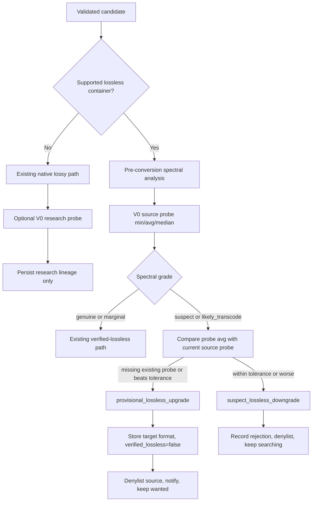

# feat: Add provisional lossless-source grind-up

## Overview

Add a distinct provisional path for spectrally suspect lossless-container
sources. The importer should still distrust the source as verified lossless,
but it should persist the source-lineage MP3 V0 probe, compare that probe's
average bitrate against the current comparable lossless-source probe, and
import only meaningful improvements inside the suspect lane (see origin:
`docs/brainstorms/provisional-lossless-grind-up-requirements.md`).

The final stored format remains a storage-policy decision. For provisional
lossless-source imports, use the existing configured lossless-source target
when present, but keep `verified_lossless` false and keep the request wanted so
acquisition continues.

---

## Problem Frame

Issue #178 exposed a mismatch between evidence and replacement policy. Today a
lossless-container source that spectral analysis marks `suspect` or
`likely_transcode` can be rejected because the final stored bitrate or generic
quality rank does not beat an existing lossy copy. That loses useful evidence:
the temporary MP3 V0 encode produced directly from the lossless source is the
stable comparison artifact for this lane, even when the source is not trusted
as verified lossless.

This plan preserves the broader quality-bucket model and adds only the missing
same-lane grind-up policy for suspect lossless-container sources. Broken or
unreadable audio can still fail before probing; `genuine` and `marginal`
lossless sources stay on the existing verified-lossless path.

---

## Requirements Trace

- R1. Persist V0 probe `min`, `avg`, and `median` metrics for supported
  lossless-container candidates before target conversion or cleanup can remove
  temporary V0 files.
- R2. Use V0 probe average as the v1 decision signal for suspect
  lossless-source grind-up; store min and median for audit/future analysis.
- R3. Reuse `QualityRankConfig.within_rank_tolerance_kbps` for meaningful
  source-probe improvement.
- R4. Persist native lossy V0 probes only as passive research evidence when
  collected; never let them affect v1 policy.
- R5. Distinguish lossless-source V0 probes from native-lossy or on-disk
  research probes.
- R6. Let supported lossless-container candidates with `suspect` or
  `likely_transcode` evidence reach source-probe comparison.
- R7. Reject suspect lossless-container candidates whose source-probe average
  is within tolerance of, or below, the current comparable source probe.
- R8. Import suspect lossless-container candidates whose source-probe average
  beats the current comparable source probe by more than tolerance.
- R9. Let a new suspect lossless-container candidate with a source probe win
  when the existing album lacks a comparable lossless-source probe.
- R10. Use one rejection label for equivalent-within-tolerance and worse
  suspect lossless-source candidates.
- R11. Keep provisional lossless-source upgrades distinct from
  `transcode_upgrade`.
- R12. Keep suspect lossless-source rejections distinct from
  `transcode_downgrade`, `quality_downgrade`, and `spectral_reject`.
- R13. A provisional lossless-source upgrade imports the candidate, stores it
  using the configured lossless-source target, marks it unverified, denylists
  the source, triggers normal post-import side effects, and leaves or requeues
  the request as wanted.
- R14. Apply to all supported lossless-container sources, including FLAC, ALAC,
  and WAV.
- R15. Keep `genuine` and `marginal` lossless-container candidates on the
  verified-lossless completion path.
- R16. Show accepted provisional imports with the operator-facing badge
  `Provisional`.
- R17. Explain provisional outcomes in download history with spectral grade,
  spectral floor, V0 probe average, existing comparable probe, stored format,
  source denylisting, and continued searching.
- R18. Keep validation failures before V0 probing when audio is broken,
  unreadable, corrupt, or structurally invalid.

**Origin actors:** A1 Import pipeline, A2 Evidence system, A3 Operator,
A4 Downstream media consumers.

**Origin flows:** F1 Provisional lossless-source upgrade, F2 Suspect
lossless-source no-op or downgrade, F3 Clean lossless-source import,
F4 Passive native-lossy probe collection.

**Origin acceptance examples:** AE1 first suspect lossless-source probe wins,
AE2 later meaningful probe improvement imports and equivalent probes reject,
AE3 tolerance prevents near-equal replacement, AE4 native lossy probes remain
research-only, AE5 clean lossless sources stay verified, AE6 ALAC/WAV follow
the same suspect-source policy.

---

## Scope Boundaries

- Do not redesign the broader quality-bucket system.
- Do not retune spectral thresholds, cliff detection, or suspect rollup rules.
- Do not promote native lossy V0 probes into decision policy in v1.
- Do not collapse provisional lossless-source outcomes into existing transcode
  outcomes.
- Do not change release identity matching, beets distance thresholds, or album
  completeness rules.
- Do not add a separate V0 probe tolerance knob.
- Do not treat suspect lossless-container sources as verified lossless.

---

## Context & Research

### Relevant Code and Patterns

- `harness/import_one.py` already performs pre-conversion spectral analysis,
  converts lossless sources through `V0_SPEC`, measures min/avg/median
  bitrates, then optionally converts verified lossless sources to the
  configured `verified_lossless_target`.
- `lib.quality.AudioQualityMeasurement`, `ConversionInfo`, `ImportResult`,
  and related nested types are `msgspec.Struct` wire-boundary types that cross
  the harness stdout and `download_log.import_result` JSONB boundary.
- `lib.quality.compare_quality()` already uses
  `QualityRankConfig.within_rank_tolerance_kbps` for same-rank bitrate
  movement. The new provisional comparison should reuse that config, but it
  must not route through generic rank comparison because source-probe average is
  a different evidence lane.
- `lib.preimport.run_preimport_gates()` rejects native lossy spectral
  downgrades before import dispatch, while lossless-container sources reach
  `harness/import_one.py` for V0 conversion. Keep validation and audio
  integrity gates ahead of probe work.
- `lib.import_dispatch.dispatch_action()` centralizes decision-to-side-effect
  mapping. New provisional outcomes belong there rather than as one-off
  branches in the dispatcher.
- `lib.pipeline_db.PipelineDB.log_download()` persists point-in-time evidence
  columns and `import_result`. New queryable probe columns should follow this
  pattern, with schema changes in a new migration.
- `web.classify.classify_log_entry()` and
  `web.download_history_view.DownloadHistoryViewRow` are the shared history
  presentation seam for Recents and detail views.
- `lib.quality.full_pipeline_decision()` and `get_decision_tree()` feed the
  Decisions tab and value-preview paths; policy changes need parity there.

### Institutional Learnings

- No `docs/solutions/` files are present in this checkout, so there are no
  stored institutional learnings to carry forward.
- `CLAUDE.md` requires Nix-shell based Python verification, frozen migrations,
  pure quality decisions, `msgspec.Struct` for wire-boundary data, and serial
  importer ownership for Beets-mutating work.

### External References

- External research is not needed for this plan. The work is repo-specific and
  the relevant patterns are already established in `docs/quality-verification.md`,
  `docs/quality-ranks.md`, `harness/import_one.py`, `lib.quality`, and the
  import dispatch flow.

---

## Key Technical Decisions

- Store source-probe state in two layers: per-attempt probe evidence for audit,
  plus current comparable lossless-source probe fields on `album_requests` for
  future decisions. `download_log.import_result` remains the detailed audit
  payload, but future imports should not need to mine historical JSONB to find
  the current comparison baseline.
- Model probe lineage explicitly. A `lossless_source_v0` probe is eligible for
  provisional comparison; `native_lossy_research_v0` and
  `on_disk_research_v0` are persisted for audit/research only and must never
  update the current comparable source-probe state.
- Add a pure provisional lossless-source decision before generic quality
  terminal decisions. The policy needs inputs that generic rank comparison does
  not express: source lineage, spectral grade, candidate probe average,
  existing source-probe average, and tolerance.
- Reuse `verified_lossless_target` as the configured lossless-source storage
  target for provisional imports, but do not set `verified_lossless=True` for
  suspect sources. The existing config name is narrower than this feature's
  product language; changing the config surface is outside v1.
- Honor explicit `target_format="lossless"` / `"flac"` storage intent, but
  still create a temporary V0 source probe before final storage. The V0 probe
  is evidence; keeping lossless on disk is storage. A suspect source kept on
  disk through explicit intent remains unverified.
- Use distinct decision/scenario names, for example
  `provisional_lossless_upgrade` and `suspect_lossless_downgrade`.
  Operationally they resemble transcode import/reject paths, but collapsing
  them would hide different future tuning needs.
- Keep passive native-lossy probe collection isolated from policy. If a native
  lossy research probe is expensive or unsafe in a path, the implementation may
  collect it only where a temp-copy probe is available, but any collected probe
  must be stored with research lineage and ignored by decisions.

---

## Open Questions

### Resolved During Planning

- Durable storage shape: use explicit probe lineage plus min/avg/median metrics
  in typed `ImportResult` evidence, mirror per-attempt probe fields to
  `download_log`, and mirror only current comparable `lossless_source_v0`
  metrics to `album_requests`.
- Gate placement: perform provisional lossless-source comparison in
  `harness/import_one.py` after V0 probe metrics exist and before generic
  quality comparison can turn the suspect source into a normal downgrade.
- Dispatch action: map accepted provisional imports through the same side-effect
  families as a transcode upgrade, but under distinct decision names: import,
  denylist, notify/rescan, persist probe state, and requeue/leave wanted.

### Deferred to Implementation

- Exact column and Struct field names: choose names that match local style, but
  preserve the storage split between per-attempt evidence and current
  comparable source-probe state.
- Whether passive native-lossy research probes run in every native lossy path
  or only where a temp-copy probe is already safe and cheap. The policy
  invariant is fixed: research probes must not influence v1 decisions.
- Whether existing historical provisional-like rows can be backfilled. The v1
  feature does not require a backfill; historical rows without comparable
  source-probe state should behave like R9 on the next suspect lossless source.

---

## High-Level Technical Design

> *This illustrates the intended approach and is directional guidance for
> review, not implementation specification. The implementing agent should
> treat it as context, not code to reproduce.*

---

## Implementation Units

- U1. **Add Durable Probe Evidence**

**Goal:** Add the persistent and typed evidence shape for lossless-source V0
probes and passive research probes.

**Requirements:** R1, R2, R4, R5, R17; supports F1, F2, F4 and AE4.

**Dependencies:** None.

**Files:**
- Create: `migrations/007_v0_probe_evidence.sql`
- Modify: `lib/quality.py`
- Modify: `lib/pipeline_db.py`
- Modify: `docs/pipeline-db-schema.md`
- Test: `tests/test_import_result.py`
- Test: `tests/test_pipeline_db.py`
- Test: `tests/test_migrator.py`

**Approach:**
- Add a typed probe evidence structure under `lib.quality` with lineage/kind
  plus `min`, `avg`, and `median` kbps fields. Keep it `msgspec.Struct` so
  old `ImportResult` rows decode with defaults.
- Add migration-backed per-attempt probe fields on `download_log` so history
  can render probe evidence without ad hoc JSONB queries.
- Add current comparable lossless-source V0 probe fields on `album_requests`.
  These fields are the future-decision baseline and should update only from
  accepted `lossless_source_v0` provisional or verified lossless-source imports.
- Extend `PipelineDB.log_download()` and request quality-state helpers to write
  and clear probe state coherently. `clear_on_disk_quality_fields()` should
  clear current comparable source-probe fields when the current album leaves
  the library, while per-attempt `download_log` evidence remains durable.
- Keep schema changes in the new migration only; do not edit shipped
  migrations or place DDL inside `PipelineDB` methods.

**Patterns to follow:**
- `lib.quality.ImportResult` nested `msgspec.Struct` defaults.
- `lib.pipeline_db.RequestSpectralStateUpdate` for paired state updates.
- Migration style in `migrations/004_import_job_previews.sql` and
  `migrations/006_normalize_legacy_terminal_preview_jobs.sql`.

**Test scenarios:**
- Happy path: applying migrations to a fresh test database creates all
  per-attempt and current comparable probe fields with nullable defaults.
- Happy path: logging a download with `lossless_source_v0` probe evidence
  persists kind, min, avg, and median and can be read back from
  `download_log`.
- Edge case: decoding a legacy `ImportResult` without probe evidence succeeds
  and exposes an empty/None probe field rather than raising.
- Edge case: clearing on-disk quality state for a request clears current
  comparable lossless-source probe fields but leaves historical `download_log`
  rows unchanged.
- Error path: invalid probe lineage values are rejected by the typed conversion
  or database constraint rather than silently stored as comparable state.

**Verification:**
- The database has explicit places for both audit probe evidence and current
  comparable source-probe state.
- Probe lineage is preserved through JSON serialization and DB reads.

- U2. **Capture Source and Research V0 Probes**

**Goal:** Produce and persist V0 probe metrics before temporary files can be
removed or target conversion can change the measured artifact.

**Requirements:** R1, R2, R4, R5, R14, R18; covers AE4 and AE6.

**Dependencies:** U1.

**Files:**
- Modify: `harness/import_one.py`
- Modify: `lib/preimport.py`
- Modify: `lib/quality.py`
- Test: `tests/test_import_one_stages.py`
- Test: `tests/test_conversion_e2e.py`
- Test: `tests/test_import_preview.py`

**Approach:**
- In `harness/import_one.py`, after the V0 conversion pass for supported
  lossless-container inputs and before target conversion or cleanup, compute
  min/avg/median over the V0 MP3 artifacts using the existing ext-filtered
  bitrate measurement pattern.
- When `target_format` asks to keep lossless on disk, introduce a temporary V0
  probe pass instead of skipping probe generation. That pass must preserve the
  lossless originals, remove only temporary probe artifacts when appropriate,
  and leave rejected candidates recoverable under the same source-preservation
  rules as existing terminal downgrade paths.
- Store those metrics as `lossless_source_v0` evidence for FLAC, ALAC, WAV,
  and ALAC-in-M4A sources that `convert_lossless()` already recognizes.
- Preserve the current validation order: path/audio failures and conversion
  failures can still terminate before a usable probe exists.
- For native lossy inputs, collect passive research probes only through a
  non-destructive temp-copy path. Persist them as research lineage and leave
  all existing import, rejection, ranking, requeue, and source-selection
  decisions unchanged.
- Ensure dry-run/import-preview executions return the same probe evidence shape
  without mutating request rows.

**Execution note:** Start with characterization tests around the current V0
measurement and target-conversion order before moving the measurement point.

**Patterns to follow:**
- `harness/import_one.py` use of `V0_SPEC`, `FLAC_SPEC`, `v0_ext_filter`, and
  `_get_folder_bitrates()`.
- `tests/test_conversion_e2e.py` fixture coverage for FLAC, ALAC, WAV, and
  verified-lossless target conversion.
- `lib.preimport.inspect_local_files()` temp-safe inspection posture.

**Test scenarios:**
- Happy path: a FLAC candidate converted to V0 records source-probe min, avg,
  and median before an `opus 128` target conversion removes V0 files.
- Happy path: ALAC and WAV candidates produce `lossless_source_v0` probe
  evidence with the same metrics shape as FLAC.
- Edge case: target format `lossless` keeps lossless on disk but still records
  the source V0 probe when the comparison path needed a V0 artifact.
- Error path: a corrupt lossless file that fails validation or conversion does
  not emit misleading probe evidence.
- Integration: import preview/dry-run returns probe evidence in the structured
  result but does not write `album_requests` current comparable probe fields.
- Research-only: a native MP3 temp-copy V0 research probe, when collected, is
  persisted as research lineage and does not change the preview/import
  decision.

**Verification:**
- Every supported lossless-container candidate that reaches V0 conversion has
  source-probe metrics available before final storage conversion.
- Native lossy research probes, if collected, are visibly non-comparable.

- U3. **Add the Pure Provisional Decision**

**Goal:** Add the source-probe comparison policy for suspect lossless-container
candidates as a pure, table-tested decision.

**Requirements:** R2, R3, R6, R7, R8, R9, R10, R11, R12, R14, R15; covers AE1,
AE2, AE3, AE5, and AE6.

**Dependencies:** U1, U2.

**Files:**
- Modify: `lib/quality.py`
- Test: `tests/test_quality_decisions.py`
- Test: `tests/test_simulator_scenarios.py`

**Approach:**
- Add a pure reducer that receives candidate probe evidence, existing current
  comparable source-probe evidence, spectral grade, lossless-source flag, and
  `QualityRankConfig`.
- Return no provisional decision for non-lossless candidates, missing candidate
  source probes, or `genuine`/`marginal` spectral grades. Those cases continue
  through existing policy.
- For `suspect` or `likely_transcode` lossless-source candidates, compare
  candidate `avg` against existing current source-probe `avg`.
- Treat a missing existing comparable source probe as an importable provisional
  upgrade.
- Treat `candidate_avg - existing_avg <= within_rank_tolerance_kbps` as
  `suspect_lossless_downgrade`; this includes exact equivalents and worse
  probes under one label.
- Treat deltas above tolerance as `provisional_lossless_upgrade`.
- Keep min and median out of v1 decisions, but ensure they are present on the
  reducer input/output for audit and future policy.

**Patterns to follow:**
- Table-driven tests in `tests/test_quality_decisions.py`.
- `MeasuredImportDecisionInput` and `MeasuredImportDecisionResult` as examples
  for pure reducer shape shared by harness, preview, and simulator.
- Existing `QualityRankConfig.within_rank_tolerance_kbps` parsing and tests.

**Test scenarios:**
- Covers AE1. Existing suspect native MP3 has no comparable source probe; new
  suspect FLAC source probe avg 250kbps returns
  `provisional_lossless_upgrade`.
- Covers AE2. Existing current source probe avg 171kbps and candidate avg
  228kbps returns `provisional_lossless_upgrade`.
- Covers AE2/AE3. Existing avg 171kbps, tolerance 5, and candidate avg 171kbps
  or 175kbps returns `suspect_lossless_downgrade`.
- Error path: candidate has `suspect` spectral grade but no candidate
  source-probe avg; reducer does not invent an upgrade and returns a terminal
  reject/unknown path that the caller can record clearly.
- Covers AE5. `genuine` and `marginal` lossless candidates return no
  provisional decision and continue through the verified-lossless path.
- Covers AE6. FLAC, ALAC, and WAV candidate identities all qualify as
  supported lossless sources when they carry source-probe evidence.
- Research-only: native lossy research probe evidence is ignored by the
  provisional reducer even when its avg is higher than current state.

**Verification:**
- The decision can be reasoned about without filesystem, database, or Beets
  dependencies.
- Existing transcode and generic downgrade decisions remain distinct.

- U4. **Wire Provisional Outcomes Through Import Dispatch**

**Goal:** Make accepted provisional upgrades import and requeue correctly, and
make suspect-lossless downgrades reject without loops.

**Requirements:** R6, R7, R8, R9, R10, R11, R12, R13, R17; covers F1, F2, AE1,
AE2, and AE3.

**Dependencies:** U1, U2, U3.

**Files:**
- Modify: `harness/import_one.py`
- Modify: `lib/import_dispatch.py`
- Modify: `lib/pipeline_db.py`
- Modify: `lib/transitions.py`
- Test: `tests/test_import_one_stages.py`
- Test: `tests/test_import_dispatch.py`
- Test: `tests/test_download.py`
- Test: `tests/test_import_service.py`

**Approach:**
- Invoke the pure provisional reducer after candidate source-probe metrics are
  available and before the generic `quality_decision_stage()` can terminalize a
  suspect lossless source as a normal downgrade.
- On `provisional_lossless_upgrade`, proceed to Beets import. Use the
  configured lossless-source storage target when present, but preserve
  `verified_lossless=False` on the final measurement and request row.
- If explicit request intent keeps lossless on disk, store that final format
  without converting the unverified truth marker into verified lossless. If no
  explicit storage intent exists, use `verified_lossless_target` when set and
  fall back to V0 otherwise.
- On `suspect_lossless_downgrade`, exit as a terminal rejected import with a
  distinct decision, leaving the staged source available/cleaned according to
  the same safety rules used by current auto-import downgrade paths.
- Extend `dispatch_action()` for the two new outcomes:
  `provisional_lossless_upgrade` imports, denylists, triggers notifiers, and
  requeues or leaves the request wanted; `suspect_lossless_downgrade` records a
  rejection, denylists, and keeps searching.
- Persist current comparable source-probe fields only after a successful
  provisional import, not after a rejected or previewed candidate.
- Keep the successful import, current source-probe update, and request requeue
  in one dispatch branch so a provisional import cannot leave the request
  looking complete while missing the comparison baseline for the next attempt.
- Ensure request state does not remain completed after a provisional import.
  Downstream consumers should see the new library file, while acquisition
  remains wanted.

**Patterns to follow:**
- `dispatch_action()` handling for `transcode_upgrade`, `transcode_first`, and
  `transcode_downgrade`.
- `_do_mark_done()` and `_record_rejection_and_maybe_requeue()` as the central
  DB/history write paths.
- Cleanup safeguards in `_should_cleanup_path()` and the preserve-source
  downgrade handling in `harness/import_one.py`.

**Test scenarios:**
- Covers AE1. Provisional upgrade imports, writes `verified_lossless=False`,
  stores the configured final format, updates current source-probe avg, records
  `Provisional` evidence, denylists the source, triggers notifier flags, and
  returns the request to wanted.
- Covers AE2. A later candidate with candidate avg 228kbps over existing
  171kbps imports provisionally and replaces current source-probe state.
- Covers AE2/AE3. Candidate avg equal to, lower than, or within tolerance of
  existing current source-probe avg records `suspect_lossless_downgrade`,
  denylists the source, and does not update current source-probe state.
- Error path: missing source username on a provisional rejection/import logs
  the missing denylist source without failing the history write.
- Integration: a provisional import triggers Meelo/Plex/Jellyfin notifier paths
  like normal imports, but does not run a verified-lossless completion path.
- Regression: `genuine` or `marginal` lossless candidates still mark verified
  and complete through the existing path.

**Verification:**
- Provisional decisions have their own history scenarios and dispatch flags.
- Request state, source denylisting, current probe state, and notifier behavior
  line up with the origin flow.

- U5. **Render Provisional History and Badges**

**Goal:** Show operators why a provisional source imported or rejected without
requiring direct JSONB inspection.

**Requirements:** R16, R17; covers A3, F1, F2, AE1, AE2, and AE3.

**Dependencies:** U1, U4.

**Files:**
- Modify: `web/classify.py`
- Modify: `web/download_history_view.py`
- Modify: `web/js/history.js`
- Modify: `web/js/recents.js`
- Modify: `web/index.html`
- Test: `tests/test_web_recents.py`
- Test: `tests/test_library_album_detail_service.py`
- Test: `tests/test_js_history.mjs`
- Test: `tests/test_js_recents.mjs`

**Approach:**
- Add a `Provisional` badge for successful
  `provisional_lossless_upgrade` history rows, with styling distinct from
  `Transcode`, `Imported`, and `Upgraded`.
- Add rejection verdict text for `suspect_lossless_downgrade` that names the
  candidate V0 probe average, existing comparable source-probe average when
  present, tolerance outcome, spectral grade/floor, and continued search.
- Extend the typed history row contract with probe kind and probe metrics so
  frontend renderers do not parse raw `import_result` JSON.
- Include stored final format and source denylisting/continued-search language
  in the classified verdict/summary where the data is available.
- Keep point-in-time display semantics: history rows must use the probe and
  measurement values from the row/import result, not current request state that
  may have changed after later attempts.

**Patterns to follow:**
- `web.classify._classify_transcode()` for distinct imported-but-searching
  outcomes.
- Point-in-time verdict tests in `tests/test_web_recents.py`.
- `DownloadHistoryViewRow` as the shared frontend contract.

**Test scenarios:**
- Happy path: a successful provisional history row renders badge
  `Provisional`, not `Imported`, `Upgraded`, or `Transcode`.
- Happy path: the provisional verdict includes spectral grade, candidate V0
  avg, stored final format, denylist/continued-search language, and existing
  comparable probe when present.
- Covers AE3. A `suspect_lossless_downgrade` row with tolerance 5 and
  candidate avg 175kbps over existing 171kbps explains that it was not
  meaningfully better.
- Edge case: first provisional upgrade with no existing comparable source probe
  renders the missing baseline as "no comparable source probe" rather than
  "unknown quality".
- Regression: existing transcode, quality downgrade, spectral reject, and
  verified-lossless rows keep their existing badges and verdict wording.
- Frontend safety: history and recents rendering escapes probe/verdict strings
  and does not overlap with existing warning chips.

**Verification:**
- Operators can explain Issue #178-style outcomes from the web UI history
  alone.

- U6. **Keep Preview, Simulator, and Docs in Sync**

**Goal:** Expose the provisional policy consistently across dry-run preview,
the Decisions tab, value simulator, and documentation.

**Requirements:** R4, R6, R13, R14, R15, R17; covers F1, F2, F3, F4, AE4,
AE5, and AE6.

**Dependencies:** U3, U4, U5.

**Files:**
- Modify: `lib/import_preview.py`
- Modify: `lib/quality.py`
- Modify: `web/routes/pipeline.py`
- Modify: `web/js/decisions.js`
- Modify: `docs/quality-verification.md`
- Modify: `docs/quality-ranks.md`
- Modify: `docs/pipeline-db-schema.md`
- Test: `tests/test_import_preview.py`
- Test: `tests/test_quality_decisions.py`
- Test: `tests/test_simulator_scenarios.py`
- Test: `tests/test_js_decisions.mjs`

**Approach:**
- Thread candidate source-probe avg and existing source-probe avg through the
  value-preview and simulator inputs where those systems model the import
  decision.
- Add provisional stages/outcomes to `get_decision_tree()` so the Decisions
  tab documents why suspect lossless sources can import provisionally without
  becoming verified.
- Ensure real-path preview gets probe evidence from the dry-run
  `ImportResult`, classifies provisional import as `would_import`, and
  classifies suspect-lossless downgrade as a confident reject/cleanup-eligible
  only when it mirrors the real auto-import safety rules.
- Document the storage split, the source-probe avg decision rule, and the
  research-only status of native lossy probes.
- Keep docs clear that no new tolerance knob exists and that final storage
  target is separate from verified-lossless truth.

**Patterns to follow:**
- Existing preview parity tests in `tests/test_import_preview.py`.
- `full_pipeline_decision()` contract tests and Decisions-tab stage tests in
  `tests/test_quality_decisions.py`.
- `docs/quality-ranks.md` treatment of rank policy and tolerance knobs.

**Test scenarios:**
- Happy path: value preview with suspect lossless candidate avg 250kbps and no
  existing source probe returns a provisional would-import outcome.
- Happy path: value preview with existing source probe avg 171kbps and
  candidate avg 228kbps returns provisional would-import.
- Covers AE3. Value preview with tolerance 5, existing avg 171kbps, and
  candidate avg 175kbps returns suspect-lossless downgrade.
- Covers AE4. Native lossy research-probe values in simulator inputs are shown
  as evidence but do not change the decision result.
- Covers AE5. Genuine/marginal lossless simulator cases continue to show the
  verified-lossless path.
- Covers AE6. ALAC/WAV inputs in simulator/preview follow the same provisional
  branch as FLAC when suspect.

**Verification:**
- The web Decisions tab, import preview, and docs explain the same provisional
  policy the real importer executes.

---

## System-Wide Impact

- **Interaction graph:** The feature touches validation/preimport, harness V0
  conversion, pure quality reducers, subprocess result typing, DB persistence,
  dispatch side effects, request status transitions, notifier triggering,
  preview/simulator adapters, and web history rendering.
- **Error propagation:** Validation, conversion, missing probe evidence, and
  Beets import failures must retain distinct failure scenarios. A missing
  source probe on a suspect lossless candidate should not silently become a
  normal quality downgrade.
- **State lifecycle risks:** Current comparable source-probe state must update
  only after successful imports and clear when on-disk quality state clears.
  Rejected, failed, previewed, and native lossy research probes must not poison
  future comparison baselines.
- **API surface parity:** Recents/history APIs, import preview APIs, simulator
  query inputs, and the Decisions tab all need the new outcomes or operators
  will see inconsistent explanations.
- **Integration coverage:** Unit tests alone will not prove request state,
  denylisting, notifiers, and current probe persistence work together. Include
  dispatch/import-service tests around accepted and rejected provisional paths.
- **Unchanged invariants:** Release matching, Beets distance thresholds,
  spectral classifier tuning, rank thresholds, and generic transcode semantics
  remain unchanged. Suspect lossless sources are still unverified.

---

## Alternative Approaches Considered

- Reuse `transcode_upgrade` and `transcode_downgrade`: rejected because the
  origin requires distinct future-tunable policy and operator language.
- Compare the final stored target bitrate: rejected because Opus/AAC/MP3 target
  bitrate is storage policy, not source-lineage evidence.
- Store probe evidence only in `download_log.import_result`: rejected because
  future decisions need a current comparable baseline without scanning
  historical JSONB rows.
- Add a new probe-specific tolerance: rejected because the origin explicitly
  reuses `within_rank_tolerance_kbps`.

---

## Success Metrics

- Suspect lossless-container candidates with meaningfully higher source V0
  probe averages import provisionally instead of freezing behind a suspect
  native lossy incumbent.
- Equivalent or worse suspect lossless-container candidates reject with
  `suspect_lossless_downgrade` and do not replace the current best provisional
  source.
- Operators can understand provisional imports and rejections from Recents or
  album history without hand-querying JSONB.
- Clean `genuine` and `marginal` lossless imports remain verified completion
  paths.
- Native lossy research probes, when present, produce data but no v1 policy
  changes.

---

## Risks & Dependencies

| Risk | Likelihood | Impact | Mitigation |
|------|------------|--------|------------|
| Migration adds current-state fields that drift from real on-disk state | Medium | High | Update only after successful import, clear with existing quality-state cleanup, and test failure/preview paths do not write current probe state. |
| Target conversion path marks provisional imports verified by accident | Medium | High | Preserve a separate "storage target applied" concept from `verified_lossless`; add dispatch/import tests asserting suspect provisional imports stay unverified. |
| Probe evidence is captured after V0 files are removed | Medium | High | Capture source-probe min/avg/median immediately after V0 conversion and before target conversion or cleanup. |
| Explicit keep-lossless storage path bypasses V0 probe generation | Medium | High | Add a temporary source-probe pass for `target_format="lossless"` / `"flac"` and test that suspect sources still get comparable probe evidence. |
| Native lossy research probe collection mutates candidate files or slows the gate path too much | Medium | Medium | Use temp-copy probing only; if unsafe in a path, store no research probe rather than touching source files. |
| UI uses current request state instead of point-in-time probe evidence | Medium | Medium | Extend history row contract and tests to read per-row probe fields/import result. |
| Provisional import completes the request instead of keeping acquisition wanted | Low | High | Encode new dispatch action flags and request transition tests distinct from verified-lossless imports. |

---

## Documentation / Operational Notes

- Update `docs/quality-verification.md` to explain source V0 probes as the
  suspect lossless-source comparison artifact.
- Update `docs/quality-ranks.md` to note that provisional source-probe
  comparison reuses `within_rank_tolerance_kbps` without changing rank policy.
- Update `docs/pipeline-db-schema.md` with new probe evidence fields and the
  distinction between per-attempt audit evidence and current comparable
  lossless-source probe state.
- No production backfill is required for v1. Requests without current
  comparable source-probe state follow the R9 first-provisional-import path.

---

## Sources & References

- **Origin document:** [docs/brainstorms/provisional-lossless-grind-up-requirements.md](docs/brainstorms/provisional-lossless-grind-up-requirements.md)
- Repo guidance: [CLAUDE.md](CLAUDE.md)
- Quality evidence model: [docs/quality-verification.md](docs/quality-verification.md)
- Rank/tolerance model: [docs/quality-ranks.md](docs/quality-ranks.md)
- Pipeline schema: [docs/pipeline-db-schema.md](docs/pipeline-db-schema.md)
- Conversion and import harness: [harness/import_one.py](harness/import_one.py)
- Pure decision layer: [lib/quality.py](lib/quality.py)
- Preimport gates: [lib/preimport.py](lib/preimport.py)
- Dispatch side effects: [lib/import_dispatch.py](lib/import_dispatch.py)
- Pipeline persistence: [lib/pipeline_db.py](lib/pipeline_db.py)
- History presentation: [web/classify.py](web/classify.py)
- History API contract: [web/download_history_view.py](web/download_history_view.py)
