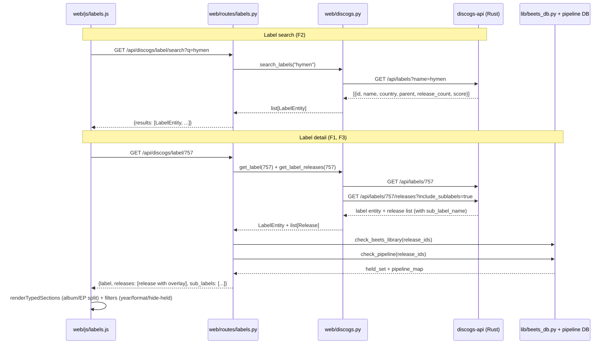

# feat: Label viewer Phase A (Discogs-first)

## Overview

Add a label viewer to the cratedigger web UI: search for record labels (e.g. "Hymen Records"), open a label-detail page that lists every release on that label split by primary type (album / EP / single), with the existing library overlay marking each release as `in library` / `in pipeline` / `not held`, and year + format filters layered over that overlay. Drill-in from release detail by making the label name a clickable link.

Phase A wires Discogs only. The data model, route shape, and rendering components are designed source-agnostic so Phase B (MusicBrainz labels) is a source adapter, not a redesign. We own the Discogs Rust mirror and extend its API; we do not own the MusicBrainz mirror and Phase B will consume whatever upstream MB returns.

This plan touches **two repositories**:

- **cratedigger** (this repo) — primary target. Python web layer, JS, tests.
- **discogs-api** (`~/discogs-api/`, GitHub: `abl030/discogs-api`) — Rust mirror. Two new endpoints + one schema migration. Implementation units that target this repo are tagged `[discogs-api]` in their headers; all other units are `[cratedigger]`.

---

## Problem Frame

The user finds a release they like — Gridlock on Hymen Records — and wants to see what else came out on that label, fast, with clear marking of what they already own. Today cratedigger surfaces labels only as plain-text fields on Discogs release payloads (`web/discogs.py:231`, `web/discogs.py:282`). There is no way to navigate from a release to the rest of its label, no label search, no library overlay. The workaround is leaving cratedigger for Discogs.com, which loses the library overlay that makes the local mirror valuable.

The discovery framing — "what I haven't heard but probably want to" — is what drives the filter priorities. Library overlay is the load-bearing filter; year and format are secondary refinements that compose on top.

Origin: GitHub issue #183. Brainstorm: `docs/brainstorms/label-viewer-requirements.md`.

---

## Requirements Trace

Carrying forward from origin:

- R1, R2. Release-detail label names become clickable links to deep-linkable label pages → covered by U7, U4.
- R3, R4. Browse tab offers label search returning disambiguated entities (release count, country, parent label) → covered by U1, U3, U4, U5.
- R5, R6, R7. Label page lists every release with title/artist/year/format, paginated, split by primary type → covered by U2, U4, U6.
- R8, R9. Library overlay marks each release as in-library / in-pipeline / not-held; one-click "hide held" toggle → covered by U4, U6 (reuses the existing `check_beets_library` / `check_pipeline` mechanism unchanged).
- R10, R11. Year and format filters layered with overlay; default sort year-desc → covered by U6.
- R12-R16. Source-agnostic plumbing: source-tagged label entity, source-qualified routes, source-agnostic release shape, Phase B = adapter wiring, normalization in our Python web layer (Discogs mirror is ours, MB mirror is upstream code we can't modify) → covered by U3, U4 (entity model + routes shaped to fit MB's stock API rather than our preference).

**Origin acceptance examples:** AE1 (Hymen drill-in with overlay), AE2 (Warp search disambiguation with sub-labels), AE3 (Warp 2001-2003 EP filter), AE4 (Phase B is wiring not redesign).

---

## Scope Boundaries

- **No labelmate-recommendation sort in v1.** Origin Approach D is rejected.
- **No MusicBrainz label support in v1.** Phase B is a separate plan.
- **No cover art on Discogs labels in v1.** CC0 dump has no images (#82).
- **No editorial label metadata** (bios, history prose, label profiles). Release index only.
- **No multi-axis search** ("releases on Hymen AND in genre X"). Year + format filters only.
- **No cross-label artist enrichment** ("what other labels has this artist been on?"). That's the artist view's job.

### Deferred to Follow-Up Work

- **Phase B: MusicBrainz label support.** Separate plan once the v1 source-agnostic shape lands. Will require a `web/mb.py` adapter and verification of the upstream MB API for label search and label-detail endpoints.
- **Phase B: source toggle on label search UI.** v1 has no toggle because Discogs is the only source; toggle UX comes with Phase B alongside the artist-view convention.

---

## Context & Research

### Relevant Code and Patterns

**Discogs Rust mirror (`~/discogs-api/`):**
- Axum router in `src/server.rs`; query functions in `src/db.rs`; types in `src/types.rs`; schema constants in `src/schema.rs`.
- `label` table exists (`id`, `name`, `parent_label_id`, `profile`, `data_quality`).
- `release_label` join exists (`release_id`, `label_id`, `label_name`, `catno`).
- Indexes on `release_label.label_id` and `label.parent_label_id` exist.
- **Missing**: GIN trigram/FTS index on `label.name` — needs to be added in U1.
- `/api/artists/{id}/releases` (`db.rs` lines 666-743) is the exact analog for `/api/labels/{id}/releases`. Mirror its query shape, pagination clamp (1-100), and `fetch_release_enrichments()` call for artists/labels/formats.
- `infer_primary_type()` (`db.rs` lines 990-1002) already classifies Album/EP/Single/Other from `release_format.descriptions`.
- FTS pattern: `to_tsvector('english', name) @@ plainto_tsquery('english', $1)` with `ts_rank()` scoring and exact-match prioritization. Mirror the existing `/api/artists` search (`db.rs` lines 745-783).

**Cratedigger web (`web/`):**
- Route registration: `web/routes/browse.py` registers `GET_ROUTES` (exact paths) and `GET_PATTERNS` (regex). Existing artist routes: `/api/artist/{uuid}` (MB), `/api/discogs/artist/{id}` (Discogs). Mirror this for labels.
- Discogs API helpers: `web/discogs.py` — `search_artists`, `search_releases`, `get_artist_releases`, `get_master_releases`, `get_release`. Add `search_labels`, `get_label`, `get_label_releases` here.
- Library overlay: `srv.check_beets_library(ids)` returns set of held IDs; `srv.check_pipeline(ids)` returns dict of `{id → pipeline_state}`. Both are single-batch queries. Reuse unchanged.
- Frontend rendering: `web/js/discography.js` `renderArtistDiscography` + `renderTypedSections` from `web/js/grouping.js` does the album/EP split. The release row component reads `in_library`, `library_format`, `library_min_bitrate`, `library_rank`, `pipeline_status`, `pipeline_id` fields from the payload — payload contract is already source-agnostic. Reuse the row renderer from labels view; only the page wrapper is new.
- Status badges: `web/js/badges.js` `renderStatusBadges()` reads the same overlay fields. Reuse unchanged.
- JS module conventions: `// @ts-check`, ES6 modules, JSDoc on exports, served at `/js/*.js`.

**Wire boundary (`msgspec.Struct`)**:
- `lib/quality.py` and `lib/beets_album_op.py` for examples of `msgspec.Struct` types crossing JSON. Define `DiscogsLabel`, `DiscogsLabelHit`, `DiscogsLabelRelease` as Structs decoded at the `web/discogs.py` boundary via `msgspec.convert(payload, type=...)`.

**Tests:**
- `tests/test_web_server.py::TestRouteContractAudit.CLASSIFIED_ROUTES` is the guard set every new route must be added to.
- `tests/test_web_server.py::_WebServerCase` provides `self._get(path)`; `_assert_required_fields(self, payload, REQUIRED_FIELDS, label)` is the contract-test helper.
- Existing `TestPipelineRouteContracts`, `TestBrowseRouteContracts` (lines ~661-805) are the patterns to mirror.

### Institutional Learnings

The repo has no `docs/solutions/` directory — research surfaced only the per-subsystem primer docs. Relevant constraints baked into rules:

- `.claude/rules/web.md` — vanilla JS, no build step, beets queries via `lib/beets_db.py`'s `BeetsDB` class only, contract tests for every route.
- `.claude/rules/code-quality.md` — wire-boundary types are `msgspec.Struct`, every API endpoint needs `REQUIRED_FIELDS` contract test + entry in `TestRouteContractAudit.CLASSIFIED_ROUTES`.
- `.claude/rules/nix-shell.md` — all Python including tests via `nix-shell --run`.
- `.claude/rules/pipeline-db.md` — schema migrations via `migrations/NNN_*.sql`. (Not applicable to this plan; cratedigger DB is untouched.)

### External References

None used — pattern is clearly modeled by the existing artist view; Discogs API extension is mirroring our own existing endpoints.

---

## Key Technical Decisions

- **Two routes per source, not a single multi-source route.** Phase A ships `/api/discogs/label/search` and `/api/discogs/label/{id}`. Phase B will add `/api/label/{mbid}` (UUID-routed to MB) parallel to the existing artist convention. R13's "source-qualified" is satisfied by the URL prefix, and consistency with the artist view matters more than collapsing into one route shape.
- **Source-agnostic label entity.** A `LabelEntity` shape exposed to the frontend has fields: `source` (`"discogs" | "musicbrainz"`), `id` (string), `name`, `country` (nullable), `profile` (nullable, plain-text excerpt only — no editorial metadata expansion in v1), `parent_label_id` (nullable), `parent_label_name` (nullable, denormalized for UI badge), `release_count` (int). Designed to fit what stock MB returns without forcing Discogs into a less-natural shape: nullable fields cover MB→empty, denormalization is acceptable because the entity is read-mostly. Normalization happens in our Python web layer per source adapter, never server-side on either mirror.
- **Source-agnostic release shape on the label page.** Reuse the existing release-row payload shape that `web/js/discography.js` already renders (id, title, primary_artist, date, format, primary_type, in_library, library_format, library_min_bitrate, library_rank, pipeline_status, pipeline_id). Avoids parallel rendering code; same row component handles artist-view and label-view rows.
- **Sub-label rollup on by default.** `/api/discogs/label/{id}/releases` returns parent + sub-label releases by default with a `sub_label_name` field on each row populated when the release belongs to a sub-label. `?include_sublabels=false` is the opt-out. The recursive CTE for the sub-label tree is bounded in practice (single-digit hierarchy depth on every label inspected); add an `EXPLAIN ANALYZE` check during U2 implementation on a worst-case label like "Universal Music Group" before declaring done.
- **Label search backend uses GIN FTS on `label.name` plus exact-match prioritization.** Mirrors the existing `/api/artists` search at `db.rs` lines 745-783 — ranks exact name matches first, then `ts_rank()` score. Add `release_count` to result rows via `LEFT JOIN release_label ... GROUP BY label.id` so disambiguation context (R4) is present in the same query.
- **`web/routes/labels.py` is a new file.** browse.py is already 22KB and labels are a coherent new domain. Same registration mechanism (`GET_ROUTES`, `GET_PATTERNS`); imported alongside browse from `web/routes/__init__.py` (or `web/server.py`, depending on where existing route modules are imported — confirm during U4).
- **Discogs adapter Structs decode at the `_get()` boundary.** New `DiscogsLabelHit`, `DiscogsLabelDetail`, `DiscogsLabelRelease` `msgspec.Struct`s in `web/discogs.py`, decoded via `msgspec.convert(payload, type=...)` immediately after the HTTP call. Downstream Python sees typed objects, not dicts.

---

## Open Questions

### Resolved During Planning

- Sub-label rollup default → include by default with badge; `?include_sublabels=false` opt-out (see Key Decisions).
- New file vs extending `browse.py` → new `web/routes/labels.py` (see Key Decisions).
- Route shape (single multi-source vs per-source) → per-source, mirroring artist convention (see Key Decisions).
- Year filter is server-side or client-side? → Client-side. The label-releases response carries every release; filter is a JS predicate. Pagination is the only server-side concern. (Acceptable up to ~10K releases per label; revisit if a label exceeds that.)

### Deferred to Implementation

- Exact pagination defaults (`per_page` default, lazy-load vs explicit pagination UI). Mirror artist-view convention discovered during U6.
- Sub-label badge text format ("via Warp Singles" vs "Warp Singles" vs label-id link). Settle when wiring U6.
- Whether Phase A also benefits from a "labels for this artist" tab on the artist view. Out of scope here; flag during U7 if it reveals itself.

---

## High-Level Technical Design

> *This illustrates the intended approach and is directional guidance for review, not implementation specification. The implementing agent should treat it as context, not code to reproduce.*

The drill-in flow (F1 trigger from a release-detail row) is just a click handler on the existing label name in the release row — it navigates to the label-detail URL above.

---

## Implementation Units

- U1. **[discogs-api] Add label FTS index and `/api/labels` search endpoint**

**Goal:** Enable label search by name on the Discogs mirror with disambiguation context (release count, country, parent label).

**Requirements:** R3, R4 (origin), and the "release_count in disambiguation" decision in Key Technical Decisions.

**Dependencies:** None.

**Files** *(target repo: discogs-api):*
- Modify: `src/schema.rs` (add `CREATE INDEX idx_label_name_fts ON label USING GIN (to_tsvector('english', name))`)
- Modify: `src/db.rs` (add `query_label_search` mirroring `query_artist_search` at lines 745-783)
- Modify: `src/server.rs` (register `GET /api/labels` route + handler)
- Modify: `src/types.rs` (add `LabelSearchParams`, `LabelHit`, `LabelSearchResponse`)
- Test: live integration check via `curl https://discogs.ablz.au/api/labels?name=hymen` after deploy. Rust handler unit testing is not the project convention (per discogs-api CLAUDE.md, only XML parsers are unit-tested).

**Approach:**
- The `release_count` per label hit is a `LEFT JOIN release_label ... GROUP BY label.id` aggregate inside the search query. Avoid fetching it in a second pass.
- Clamp `per_page` to 1-100 like the existing search endpoints.
- Order by exact-match-first (lowercase comparison), then `ts_rank()` desc, then `length(name)`, then `id` — mirrors `query_artist_search`.
- The new GIN index needs to be created on existing data — verify at deploy time that the index build completes in reasonable time on the production mirror (`label` table is in the millions of rows but not tens of millions; should be fast).

**Patterns to follow:**
- `query_artist_search` (`src/db.rs:745-783`) for FTS + scoring + exact-match.
- `SearchParams` and `Pagination` (`src/types.rs`) for query parameter shape.
- Existing `serde::Serialize` rename conventions on response types.

**Test scenarios:**
- Happy path: search "hymen" returns `Hymen Records` as top hit with non-zero `release_count` and `country == "Germany"` (or whatever Discogs has).
- Happy path: search "warp" returns `Warp Records (UK)` and at least one sub-label (e.g. "Warp Singles") with `parent_label_id` set on the sub-label hit.
- Edge case: empty `name` parameter returns 400 (or matches existing search-endpoint behavior — verify).
- Edge case: search with only stop-words ("the") returns empty results without 500.
- Edge case: `per_page=200` clamps to 100 like existing endpoints.
- Performance: search "hymen" responds in <100ms after the GIN index is built (`EXPLAIN ANALYZE` during dev).

**Verification:**
- `curl 'https://discogs.ablz.au/api/labels?name=hymen'` returns Hymen Records with non-zero release_count after deploy.
- `EXPLAIN` on the search query shows the GIN index is used (`Bitmap Index Scan on idx_label_name_fts`).

---

- U2. **[discogs-api] Add `/api/labels/{id}` and `/api/labels/{id}/releases` endpoints**

**Goal:** Serve full label detail and the release list (with sub-label rollup) needed by the label-detail page.

**Requirements:** R5, R6, R7 (origin), Key Decision sub-label rollup.

**Dependencies:** None on U1 directly (different endpoints), but typically ships in the same discogs-api PR.

**Files** *(target repo: discogs-api):*
- Modify: `src/db.rs` (add `query_label`, `query_label_releases`)
- Modify: `src/server.rs` (register routes + handlers)
- Modify: `src/types.rs` (add `LabelDetail`, `LabelReleasesResponse`)
- Test: live integration via `curl` after deploy.

**Approach:**
- `query_label_releases` mirrors `query_artist_releases` (`db.rs:666-743`): validate label exists, count releases, fetch with pagination, enrich via `fetch_release_enrichments`, infer `primary_type` via `infer_primary_type`.
- Sub-label rollup: when `include_sublabels=true` (default), the WHERE clause uses a recursive CTE to expand `parent_label_id` → label tree, and the SELECT adds `sub_label_id`/`sub_label_name` from `release_label` for each release row (NULL when the release is on the parent label itself).
- Label detail (`/api/labels/{id}`) returns: id, name, country (derived from majority country of releases — or NULL if Discogs has no first-class country field on `label`; verify the schema during implementation), profile, parent_label_id, parent_label_name (denormalized via JOIN), total_releases, sub_labels (list of `{id, name, release_count}` for direct children).
- Order by `r.released ASC, r.id` to match the artist endpoint convention; the cratedigger UI re-sorts to year-desc client-side per R11.

**Execution note:** Run `EXPLAIN ANALYZE` on `/api/labels/{id}/releases?include_sublabels=true` for a wide-tree label (e.g. "Universal Music Group" or "Sony Music Entertainment") before declaring done — recursive CTE perf is the one real risk on the Rust side and the only thing that warrants looking at query plans here.

**Patterns to follow:**
- `query_artist_releases` (`src/db.rs:666-743`).
- `fetch_release_enrichments` (`src/db.rs:1290-1308`) for batched artist/label/format joins.
- `infer_primary_type` (`src/db.rs:990-1002`) for type classification.

**Test scenarios:**
- Happy path: `GET /api/labels/{hymen_id}/releases` returns Hymen catalogue with `primary_type` populated and `sub_label_name` NULL on direct-Hymen releases.
- Happy path with rollup: `GET /api/labels/{warp_id}/releases?include_sublabels=true` includes Warp Singles releases with `sub_label_name == "Warp Singles"`.
- Edge case: `?include_sublabels=false` on Warp returns ONLY direct Warp Records releases.
- Edge case: invalid label id returns 404 (mirror artist-endpoint behavior).
- Edge case: label with zero releases returns empty `results` and `pagination.items == 0`.
- Performance: recursive CTE plan on a worst-case label (>5K releases, multiple sub-label depths) completes in <500ms; if not, add a `LIMIT` on the CTE depth or denormalize.

**Verification:**
- `curl 'https://discogs.ablz.au/api/labels/{hymen_id}/releases'` returns Hymen catalogue with `primary_type` populated.
- `?include_sublabels=true` vs `=false` produce different result counts on Warp.

---

- U3. **[cratedigger] Discogs label adapter and source-agnostic label entity**

**Goal:** Type-safe Python helpers to fetch from the new Discogs label endpoints, plus the source-agnostic `LabelEntity` shape consumed by route handlers.

**Requirements:** R12, R14, R15, R16 (source-agnostic plumbing carried into v1).

**Dependencies:** U1, U2 (Discogs endpoints must exist for the adapter to call).

**Files:**
- Modify: `web/discogs.py` (add `search_labels(query)`, `get_label(label_id)`, `get_label_releases(label_id, include_sublabels=True)`; add `DiscogsLabelHit`, `DiscogsLabelDetail`, `DiscogsLabelRelease` `msgspec.Struct` types)
- Modify: `tests/test_discogs_api.py` (extend with label-adapter coverage; this is the existing test file for `web/discogs.py`)

**Approach:**
- Wire-boundary Structs: `DiscogsLabelHit` (search result), `DiscogsLabelDetail` (full label entity), `DiscogsLabelRelease` (release row from label-releases endpoint). All decoded via `msgspec.convert(payload, type=...)` at the `_get()` boundary, not as `dict`.
- Output Python types: a `LabelEntity` (`msgspec.Struct`, source-tagged) returned to the route layer. Fields per Key Technical Decisions: `source`, `id`, `name`, `country`, `profile`, `parent_label_id`, `parent_label_name`, `release_count`. Discogs adapter populates `source="discogs"`; future MB adapter populates `source="musicbrainz"`. **This is the load-bearing source-agnostic shape — get it right here, not in U4.**
- The release row returned to routes uses the same shape as the existing artist-view release row (the route layer overlays library/pipeline state in U4). Adapter just normalizes Discogs fields to that shape: `id, title, primary_artist, date, format, primary_type, sub_label_name`.
- Sub-label denormalization: the adapter passes `sub_label_name` straight through. Route layer overlays it as a UI badge (U6).
- Cache memoization: use the same `_cache.memoize_meta` pattern as `search_releases` / `search_artists` for label search; label-detail endpoints can also be cached (label data is monthly-stable).

**Execution note:** Add the strict-boundary regression test from `.claude/rules/code-quality.md` Wire-boundary section — feed a malformed payload (e.g. `release_count` as string) and assert `msgspec.ValidationError`.

**Patterns to follow:**
- `search_artists`, `search_releases`, `get_artist_releases` in `web/discogs.py` for memoization, error handling, and `_get()` wrapper usage.
- `HarnessItem`, `ChooseMatchMessage`, `ImportResult` in `lib/quality.py` for `msgspec.Struct` decode-at-boundary patterns.

**Test scenarios:**
- Happy path: `search_labels("hymen")` mocks `_get` to return `[{id, name, country, parent_label_id, release_count, score}]` and asserts `LabelEntity` list with correct `source="discogs"`.
- Happy path: `get_label(123)` returns a `LabelEntity` with all fields populated; profile and country may be NULL.
- Happy path: `get_label_releases(123)` returns release rows with `primary_type` and `sub_label_name` populated where applicable.
- Wire boundary regression: feed a payload with `release_count` as a string and assert `msgspec.ValidationError`.
- Edge case: `search_labels` returns empty list when mirror returns empty results (no exception).
- Edge case: `get_label_releases(invalid_id)` raises (or returns empty — mirror artist-endpoint behavior; verify).
- Edge case: `parent_label_id` is `None` on top-level labels and a populated string on sub-labels.

**Verification:**
- `LabelEntity.source` is always `"discogs"` from this adapter; field set is exactly the source-agnostic shape declared in Key Decisions.
- Route layer (U4) consumes only `LabelEntity` and the existing release-row shape — no Discogs-specific fields leak past `web/discogs.py`.

---

- U4. **[cratedigger] Label routes in new `web/routes/labels.py` with contract tests**

**Goal:** HTTP routes for label search and label detail, with library + pipeline overlay and contract coverage.

**Requirements:** R1, R2, R3, R4, R5, R8, R9, R12, R13.

**Dependencies:** U3 (adapter + entity shape).

**Files:**
- Create: `web/routes/labels.py`
- Modify: `web/server.py` or `web/routes/__init__.py` (whichever currently imports `web/routes/browse.py` — register the new module's `GET_ROUTES` / `GET_PATTERNS`; verify the import site during implementation)
- Modify: `tests/test_web_server.py` (add `TestLabelRouteContracts(_WebServerCase)`; add new route patterns to `TestRouteContractAudit.CLASSIFIED_ROUTES`)

**Approach:**
- Register two routes:
  - `GET /api/discogs/label/search?q=...` (exact route; handler `get_discogs_label_search`)
  - `GET /api/discogs/label/{id}` (pattern `^/api/discogs/label/(\d+)$`; handler `get_discogs_label_detail`)
- `get_discogs_label_search`: call `search_labels(q)`, return `{results: [LabelEntity, ...]}`. No library overlay needed at search time (search hits are label entities, not releases).
- `get_discogs_label_detail`:
  1. Call `get_label(label_id)` → `LabelEntity`.
  2. Call `get_label_releases(label_id, include_sublabels=...)` → list of release rows. Read `include_sublabels` from query param; default `true`.
  3. Collect all `release_id`s into a single list.
  4. Call `srv.check_beets_library(release_ids)` (single batch query).
  5. Call `srv.check_pipeline(release_ids)` (single batch query).
  6. Overlay each release row with `in_library`, `library_format`, `library_min_bitrate`, `library_rank`, `pipeline_status`, `pipeline_id` — same fields the artist view uses, populated identically.
  7. Return `{label: LabelEntity, releases: [...], sub_labels: [...]}`.
- **Reuse** `srv.check_beets_library`, `srv.check_pipeline`, and the artist view's release-row overlay logic. If the artist view has a helper that does steps 4-6 in one shot (likely `annotate_in_library` or a sibling), reuse it directly. If it's currently inlined in `web/routes/browse.py`, extract to a shared helper in this unit (clean-as-you-go per `scope.md`).
- **Contract test additions:**
  - `LABEL_HIT_REQUIRED_FIELDS = {source, id, name, country, profile, parent_label_id, parent_label_name, release_count}`
  - `LABEL_RELEASE_REQUIRED_FIELDS = {id, title, primary_artist, date, format, primary_type, sub_label_name, in_library, library_format, library_min_bitrate, library_rank, pipeline_status, pipeline_id}`
  - `LABEL_DETAIL_RESPONSE_REQUIRED_FIELDS = {label, releases, sub_labels}`
  - Add `/api/discogs/label/search` and `^/api/discogs/label/(\d+)$` to `TestRouteContractAudit.CLASSIFIED_ROUTES` — without this the existing audit fails on the new routes.

**Execution note:** Add the contract tests + `CLASSIFIED_ROUTES` entries first (RED), then wire the route to make them pass (GREEN). Per `.claude/rules/code-quality.md` API Contract Tests.

**Patterns to follow:**
- `web/routes/browse.py::get_discogs_artist` (lines 303-320) for fetch + overlay pattern.
- `tests/test_web_server.py::TestPipelineRouteContracts` (lines 661-805) for `_WebServerCase` contract test layout.
- `tests/test_web_server.py::TestRouteContractAudit` (lines 599-659) for the audit registration pattern.

**Test scenarios:**
- Covers AE2. Happy path: `GET /api/discogs/label/search?q=hymen` returns `{results: [LabelEntity, ...]}`; first hit is Hymen Records with `release_count > 0`; all required fields present.
- Covers AE1. Happy path: `GET /api/discogs/label/{hymen_id}` returns `{label, releases, sub_labels}`; releases have `in_library` populated; held releases have `library_format` and `library_min_bitrate` set; in-pipeline releases have `pipeline_status` set.
- Happy path: `GET /api/discogs/label/{warp_id}?include_sublabels=true` returns releases including those with `sub_label_name == "Warp Singles"`.
- Edge case: invalid label id (`/api/discogs/label/99999999`) returns 404.
- Edge case: search with empty `q` returns 400 (or matches existing search-route behavior).
- Edge case: label with zero releases returns `releases: []` not 404.
- Integration: with one release of the label already in the pipeline DB and one in beets library, the response correctly marks both — proves the overlay join (not just that the helpers were called).
- Audit: `TestRouteContractAudit.test_all_web_routes_are_classified_for_contract_coverage` passes after the two new routes are added to `CLASSIFIED_ROUTES`.

**Verification:**
- All contract tests pass.
- `TestRouteContractAudit` passes.
- Hitting the deployed route on doc2 returns the expected payload shape.

---

- U5. **[cratedigger] Label search UI in browse tab**

**Goal:** Frontend label search entry point alongside the existing artist search.

**Requirements:** R3, R4 (search and disambiguation surface).

**Dependencies:** U4 (route must exist).

**Files:**
- Create: `web/js/labels.js` (new module exporting `searchLabels`, `renderLabelSearchResults`, `openLabelDetail`)
- Modify: `web/js/browse.js` (add label-search trigger; depending on existing UX, either a search-mode toggle "artists | labels" or a separate input field — verify existing pattern when implementing)
- Modify: `web/index.html` (add the UI affordance for label search; minimal markup — input + results container)
- Modify: `web/js/state.js` (add `browseLabelMode` or equivalent state flag if needed for the toggle)
- Test: extend `tests/test_js_util.mjs` for any pure helpers extracted (e.g. URL builders), but UI rendering itself is tested via `playwright` (see Verification).

**Approach:**
- Mirror `searchArtists` and the existing search-results renderer in `web/js/browse.js`. Each label result card shows: name, country, parent-label badge (when present), release count. Click → navigates to label detail (U6).
- URL builder: `${API}/api/discogs/label/search?q=${encodeURIComponent(q)}` for v1. Phase B will add toggle.
- Module conventions: `// @ts-check`, ES6 module, JSDoc on exports.
- Deep-linking: store `state.browseLabel = {id, name}` and `state.browseSubView = 'label'`, mirroring the artist pattern.

**Patterns to follow:**
- `web/js/browse.js::searchArtists` and `openBrowseArtist` for fetch + state-transition pattern.
- `web/js/discography.js` import header for the `// @ts-check` + ES6 module convention.

**Test scenarios:**
- Pure helper unit tests (if URL builder extracted): test that the encoded query string is correct for unicode and special chars.
- Playwright golden path: type "hymen" in the label search input → result list renders with Hymen Records and a release count → click → URL changes to label-detail and label page renders. Run via the playwright agent (see Verification).
- Test expectation for view-only changes: covered by playwright; no unit-test coverage owed for pure DOM rendering since the existing artist search has the same pattern uncovered.

**Verification:**
- Local manual: type a label name, see disambiguated results, click through to label page.
- Playwright agent test on `https://music.ablz.au` after deploy: search "hymen", click result, verify label-detail page loads with correct catalogue.

---

- U6. **[cratedigger] Label detail page with album/EP split, library overlay, and filters**

**Goal:** The label-detail page rendering — the load-bearing UX of this feature.

**Requirements:** R5, R6, R7, R8, R9, R10, R11.

**Dependencies:** U4, U5.

**Files:**
- Modify: `web/js/labels.js` (extend with `renderLabelDetail`, `loadLabelReleases`, `applyLabelFilters`)
- Modify: `web/index.html` (add `
` container mirroring `browse-artist`)
- Modify: `web/js/state.js` (`browseLabel`, `labelFilters: {year_min, year_max, format, hide_held}` state)
- Modify: possibly `web/js/discography.js` ONLY if a release-row helper needs to be extracted for reuse — prefer importing the existing renderer over duplicating
- Test: pure filter-predicate logic tested via `tests/test_js_util.mjs` (or sibling); DOM tested via playwright.

**Approach:**
- Page layout: header with label name, country, parent-label badge, total release count; filter bar (year range, format dropdown, "hide held" toggle); body with `renderTypedSections` doing the album/EP/single split.
- Reuse `renderTypedSections` from `web/js/grouping.js` and `renderStatusBadges` from `web/js/badges.js` unchanged. The release-row component reads the same overlay fields populated by U4.
- Filters are pure JS predicates over the in-memory release list. No re-fetch on filter change. If a sub-label badge is present, render it inline in the row near the format badge.
- Default sort: year descending; secondary sort by `id` for stability.
- "Hide held" toggle: filters out rows where `in_library === true`. Default off — discovery happens by *seeing* what you don't have, not by hiding what you do.
- Pagination: if the response carries >500 releases, render the first 200 and lazy-load the rest as the user scrolls (mirror existing artist-view convention; verify exact threshold during implementation).
- Sub-label badge: when `sub_label_name` is set on a row, render a small inline badge (e.g. `via Warp Singles`). Hide otherwise.

**Patterns to follow:**
- `web/js/discography.js::renderArtistDiscography` for layout + section split.
- `web/js/grouping.js::renderTypedSections` for the album/EP/single grouping.
- `web/js/badges.js::renderStatusBadges` for overlay rendering — reuse, do not reimplement.

**Test scenarios:**
- Covers AE3. Pure filter predicate: given a release list, applying year filter `[2001, 2003]` + format filter `EP` returns only matching rows.
- Pure filter predicate: "hide held" excludes rows with `in_library === true` and includes all others.
- Pure filter predicate: empty filter set returns all rows in input order (pre-sort).
- Pure sort: default sort is year-desc; stable across equal years.
- Edge case: a release with `released = NULL` sorts to the end and survives year-filter being applied.
- Playwright integration: load a label with sub-label rollup → click "hide held" → toggle resets → load a label with no sub-labels → no sub-label badges render anywhere.
- Playwright integration: load Warp Records → release count matches the API response → applying year filter hides rows outside the range → rows are still grouped by primary_type after filtering.

**Verification:**
- Manual: open `/?label/{hymen_id}` (or whatever the path/state shape ends up); verify all Hymen releases listed with library overlay; toggle "hide held" works; year filter narrows correctly.
- Playwright: scripted run against `https://music.ablz.au` covers happy path + filter combinations.

---

- U7. **[cratedigger] Drill-in "View label" link from release-detail rows**

**Goal:** Make the label name in any release row clickable, navigating to the label-detail page.

**Requirements:** R1 (release-detail label is a clickable link).

**Dependencies:** U6 (label-detail page must render to land on).

**Files:**
- Modify: `web/js/discography.js` or wherever release rows render label names. Verify exact location in implementation; the row component is the right place since release rows are shared between artist view and library view.
- Modify: `web/js/library.js` if library cards also render label names and should drill-in (`web/js/library.js:213` is a likely site).

**Approach:**
- Find every JS site rendering a release's label name as plain text. Replace the text node with `<a href="#label/{discogs_label_id}" data-label-id="{id}">{name}</a>` (or whatever URL convention U5/U6 settled on).
- For Discogs source releases, the `labels[]` array on the release payload already carries `{id, name, catno}` (verified `web/discogs.py:231`). Use `labels[0].id` as the navigation target. If multiple labels are present, render each as a separate link.
- For MB source releases (already rendered today on the artist view), label names exist as text only and have no MB label ID surfaced through the route layer in v1. Render those as plain text in v1 — they become links in Phase B. **Do not invent a half-link or fake fallback.**
- Click handler: same as U5's `openLabelDetail` — sets state, hides current view, navigates to label-detail.

**Patterns to follow:**
- The existing Discogs/MB release-link patterns in `web/js/discography.js` (e.g. `externalReleaseUrl`, `sourceLabel`).

**Test scenarios:**
- Pure helper test: given a release row with `labels: [{id: 757, name: "Hymen Records"}]`, the label name is rendered as a link with the correct data-label-id.
- Pure helper test: given a release row with no labels (or empty `labels: []`), the label area renders nothing or a dash, no broken link.
- Pure helper test: given an MB-source release with label only as a text field, no link is rendered (Phase B placeholder).
- Playwright integration: from a Gridlock release on the artist view, click "Hymen Records" → land on Hymen label page → AE1 acceptance scenario passes end-to-end.

**Verification:**
- Hymen / Gridlock walkthrough end-to-end on `https://music.ablz.au` after deploy: artist view → release detail → click label → label-detail page → library overlay correct → "hide held" filters as expected.

---

## System-Wide Impact

- **Interaction graph:** New routes register into the existing `GET_ROUTES` / `GET_PATTERNS` dispatch in `web/server.py`. Discogs adapter additions to `web/discogs.py` follow the existing memoization pattern. No changes to beets-import path, pipeline, or any background process. No new advisory locks, no migrations on cratedigger DB.
- **Error propagation:** Discogs mirror unreachable → `_get()` raises → route returns 5xx. Mirror schema returns malformed payload → `msgspec.ValidationError` at the wire boundary → route returns 5xx with logged error (this is the protective behavior — fail loudly rather than serve drift). Beets/pipeline overlay queries are best-effort — if either errors, the page renders without overlay (mirror the artist view's behavior; verify during U4).
- **State lifecycle risks:** None — label data is read-only on the cratedigger side; no new write paths. Cache TTLs match existing patterns (`web/discogs.py` memoize_meta).
- **API surface parity:** The new `/api/discogs/label/*` routes mirror `/api/discogs/artist/*` conventions. Phase B will add `/api/label/{mbid}` (UUID-routed) parallel to `/api/artist/{mbid}` — no v1 surface changes needed for that.
- **Integration coverage:** U4's "library overlay correctness" integration test (one release in library + one in pipeline) is the primary cross-layer guard. U6's playwright happy path covers route → render → filter end-to-end. U7's playwright walkthrough covers the AE1 drill-in scenario as the acceptance gate.
- **Unchanged invariants:** No changes to beets DB queries, pipeline DB schema, slskd integration, import paths, harness, or quality model. The library overlay helpers (`check_beets_library`, `check_pipeline`) are reused unchanged and are the only contact point with stateful infrastructure.

---

## Risks & Dependencies

| Risk | Mitigation |
|------|------------|
| Recursive CTE on deep sub-label trees performs poorly | `EXPLAIN ANALYZE` during U2 on a worst-case label (Universal Music Group / Sony); cap CTE depth or add a denormalized "label_root_id" column as a follow-up if perf is bad. Must verify before declaring U2 done. |
| Discogs label endpoint not yet deployed when cratedigger code lands | Deploy discogs-api (U1, U2) first and verify endpoints via `curl`; only then bump cratedigger flake input. The two repos deploy independently. |
| `release_count` on label search hits joined-aggregate is expensive on big labels | Verify `EXPLAIN` during U1 — should use the existing `idx_release_label_label_id` index. If it blows up, denormalize `release_count` onto `label` table at import time as a follow-up. |
| Frontend re-fetch on filter change creates sluggish UX | All filters operate on the in-memory release list; no re-fetch. Sub-label rollup is a single load-time fetch parameter. |
| Big labels (Warp, Blue Note, Universal) overload the page DOM | U6 mitigates with lazy-load above ~200 rows; verify in playwright on a worst-case label before declaring U6 done. |
| Half-built MB label support tempting during U3 to "save time later" | Resist — Phase A is Discogs-only by explicit scope. The source-agnostic shape is the bridge; MB adapter is its own plan. |
| Discogs mirror staleness (~30 days) means a brand-new label release is invisible | Accepted — this is the known mirror cadence and matches the user's discovery (boutique retrospective) workflow. Document only if confusion arises. |

---

## Documentation / Operational Notes

- Update `docs/discogs-mirror.md` API Endpoints table to include `/api/labels`, `/api/labels/{id}`, `/api/labels/{id}/releases` after U1+U2 deploy.
- Update `docs/webui-primer.md` to mention the new browse mode + drill-in link.
- No new sops secrets, no new systemd services, no new infrastructure. The discogs-api deploy is its own existing pipeline (`nixosconfig` flake input bump on doc1 → `nixos-rebuild switch` doc2). The cratedigger deploy follows the standard sequence in `.claude/rules/deploy.md`.
- Verification commands after deploy:
  - `curl https://discogs.ablz.au/api/labels?name=hymen` (U1)
  - `curl https://discogs.ablz.au/api/labels/{id}/releases?include_sublabels=true` (U2)
  - Playwright walkthrough of AE1 (Gridlock → Hymen) on `https://music.ablz.au` (U7)

---

## Post-merge follow-ups (from code review 2026-04-29)

Captured from `/ce-code-review` Tier 2 pass on PR #185. Run artifacts: `/tmp/compound-engineering/ce-code-review/20260429-ded45010/`. The P0 + safe_auto cluster were applied in commits `bf2d929` (cratedigger) and `cf22645` (discogs-api). The items below were surfaced but deferred — they did not block merge but warrant follow-up work.

**Priority order: tackle P1 + P2 #6 first; the P3 cleanup cluster can land in one consolidation PR.**

### P1 — fix soon

- **Pagination plumbed but not consumed.** `web/discogs.py::get_label_releases` accepts `page`/`per_page`; route doesn't forward; UI shows "Showing first 100 of N". Plan U6 explicitly accepted this for v1, but it leaves R5 ("paginated for hundreds/thousands") unsatisfied. Forward query params from the route, add page controls in `web/js/labels.js`.
- **Recursive CTE uses `UNION ALL` — cycle in `parent_label_id` would infinite-loop.** `discogs-api/src/db.rs:163`. Discogs probably has no label cycles in practice but defensive: switch to `UNION` (dedups exact tuples) or PG14+ `CYCLE` clause. Apply to both the count CTE and the matched CTE.
- **Rust struct fields typed `String` for nullable `label.profile` / `contactinfo` / `data_quality`** would panic on NULL. `discogs-api/src/db.rs:80`. Schema has `NOT NULL DEFAULT ''` so unlikely in practice; read as `Option<String>` and `.unwrap_or_default()` for safety.

### P2 — fix when convenient

- **Big-label fallback dead code.** `web/js/labels.js` empty-results refetch never triggers because `loadLabelReleases` throws on `!r.ok`. Either remove the branch or replace with a real heuristic that checks `release_count` from a cheap detail call before deciding `include_sublabels`.
- **Total-count header mismatch on rolled-up labels.** `web/discogs.py` ~ release-count display: header says "X releases" (direct count) but list shows direct + sub-label rows when `include_sublabels=true`. Either compute total over the recursive CTE Rust-side, or surface `payload.pagination.items` as the header count when the list is rolled up.
- **`openLabelDetail` has no in-flight token: late response can stomp newer label.** `web/js/labels.js:298`. Rapid clicks across labels could land out of order. Stamp each fetch with a request token in module scope, discard responses whose token is stale.
- **Upstream 503 handling on cratedigger side.** Discovered during the fix pass: the Rust mirror now returns 503 when the recursive CTE exceeds 5s `statement_timeout`. The cratedigger route surfaces this as a 500 to the browser. The auto-flip should prevent the 503 in the happy path, but a user explicitly passing `?include_sublabels=true` on a UMG-class label would still see a 500. Consider a graceful retry-without-sublabels on 503.

### P3 — cleanup cluster (one consolidation PR)

- **`overlay_release_rows` mutation contract is implicit.** `web/routes/_overlay.py:46-66`. If a future caller passes a cached dict, the in-place mutation could poison the cache. Document the mutation in the docstring or rename to make it explicit (`overlay_release_rows_in_place`), or return a new list.
- **`overlay_release_rows` lacks a direct unit test.** Currently only indirectly covered through `get_release_group` and `get_discogs_master`. Add direct test per `.claude/rules/code-quality.md` "every pure function must have direct unit tests".
- **Hardcoded `sub_labels: []` in label-detail response.** `web/routes/labels.py`. discogs-api returns `LabelDetail.sub_labels` populated; the route drops them. Either pass through (UI doesn't render today but Phase B may) or remove the field from the response shape.
- **Year inputs fire on every keystroke without debounce.** `web/js/labels.js`. Negligible at 100 rows; will matter when pagination lands and the in-memory list grows.
- **Adapter accepts arbitrary `int|str` `label_id` and interpolates raw into URL.** `web/discogs.py`. Defence-in-depth: `assert str(label_id).isdigit()`. Route regex already restricts at the entry.
- **Rust `via_label_id` field naming differs from rest-of-schema `label_id`.** `discogs-api/src/types.rs`. Rename has consumers in cratedigger Python so coordinate the change.

### Pre-existing (not blocking, but worth noting)

- Stale results can overwrite fresh ones — same race exists in the existing artist search. Single fix in `web/js/browse.js` would address both.
- Cache key for label search uses unbounded user query (no length cap) — same pattern as existing `search_artists`. Consider a 200-char cap.

---

## Sources & References

- **Origin document:** `docs/brainstorms/label-viewer-requirements.md`
- **Issue:** GitHub #183
- **Discogs mirror primer:** `docs/discogs-mirror.md`
- **MusicBrainz mirror primer:** `docs/musicbrainz-mirror.md`
- **Web UI primer:** `docs/webui-primer.md`
- **Related code:**
  - `web/routes/browse.py` (artist view, route registration patterns)
  - `web/discogs.py` (Discogs adapter conventions)
  - `web/js/discography.js`, `web/js/grouping.js`, `web/js/badges.js` (rendering reuse)
  - `tests/test_web_server.py::TestRouteContractAudit`, `tests/test_web_server.py::TestPipelineRouteContracts` (test patterns)
  - `lib/quality.py::HarnessItem`, `lib/quality.py::ChooseMatchMessage` (`msgspec.Struct` decode-at-boundary patterns)
- **Related discogs-api code** (`~/discogs-api/`):
  - `src/server.rs` (route registration)
  - `src/db.rs::query_artist_search` (lines 745-783, FTS pattern to mirror)
  - `src/db.rs::query_artist_releases` (lines 666-743, releases-by-entity pattern to mirror)
  - `src/db.rs::infer_primary_type` (lines 990-1002, primary-type classification)
  - `src/db.rs::fetch_release_enrichments` (lines 1290-1308, batch enrichment)
  - `src/schema.rs` (label + release_label tables; needs new GIN index)
