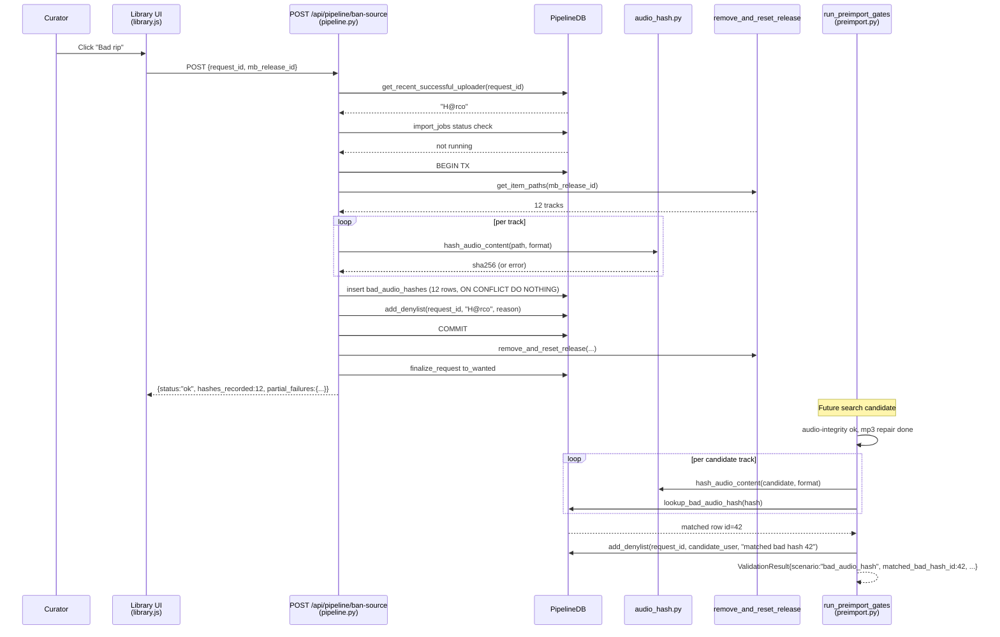

# feat: Bad-Rip Button + Content-Hash Defense

## Overview

Wire a "Bad rip" button into the library row that calls the existing `POST /api/pipeline/ban-source` route, and extend that route to capture per-track audio-content hashes of the imported album before removal. Add a pre-import gate in `lib/preimport.py` that hashes future candidate downloads and rejects them on known-bad-hash match. The known-bad list grows only when a curator clicks the button; we never speculatively hash on every import.

The exemplar that motivates this work — Humansin "Remember the", force-imported as M4A 320 from `H@rco` at 2026-04-28 03:34 with distance 0.000 and spectral classification "genuine" — proves that distance and spectral gates cannot catch *wrong-content* pre-release leaks. The curator's ear is the only durable detection signal; this plan amplifies that signal into a cheap, exact-byte ripple-stop across Soulseek.

---

## Problem Frame

The `ban-source` backend (`web/routes/pipeline.py:761`) already does denylist + `remove_and_reset_release` + requeue-to-wanted, and `banSource` is bound to `window.banSource` in `web/js/main.js:92` — but no library row's HTML invokes it. Verified: `grep -rn "banSource\|onclick.*ban" web/` returns only the export, the `import` line, and the `window` binding — zero call sites. So the "step 1 — one button" half of issue #188 is a wiring gap on top of complete plumbing.

The "more thorough" half is harder. Spectral cliff detection cannot catch engineered fakes that are clean encodes of *something*. A perceptual fingerprint pass (AcoustID/Chromaprint) on every successful import would catch reuse, but the brainstorm explicitly rejected speculative fingerprinting as wasted CPU. The chosen architecture is asymmetric: hash on click (cheap, narrow), check on every validation (cheap, fast-skipped when the table is empty).

(see origin: docs/brainstorms/bad-rip-button-and-content-hash-defense-requirements.md)

---

## Requirements Trace

- R1. Every library row whose request has at least one resolvable successful uploader exposes a "Bad rip" button. **Carried by:** U6.
- R2. Confirmation copy names the resolved username. **Carried by:** U4 (response includes `username`), U6 (button copy).
- R3. The route resolves `username` server-side from the most recent successful `download_log` for the request. **Carried by:** U2 (`get_recent_successful_uploader`), U4.
- R4. Hashes ignore all tags (ID3, Vorbis comments, MP4 atoms) and embedded artwork — only audio frames contribute. **Carried by:** U3.
- R5. Hashes persist in `bad_audio_hashes` with hash, audio_format, request_id, reported_username, reason, reported_at. **Carried by:** U1, U2.
- R6. Hash-capture failure must not block the ban — surface partial failures in the response. **Carried by:** U4 (per-track try/except + `partial_failures` shape).
- R7. Hash recording extends the existing `ban-source` route — no second endpoint. **Carried by:** U4 (extension only).
- R8. Pre-import gate computes per-track hashes and rejects on match. **Carried by:** U5.
- R9. A bad-hash rejection writes a `download_log` row whose `validation_result` records the matched hash and originating request. **Carried by:** U5 (`ValidationResult` field additions).
- R10. A bad-hash rejection denylists the supplying user for the current request. **Carried by:** U5 (mirrors spectral-reject denylisting in `lib/preimport.py:511`).

**Origin actors:** A1 (Curator), A2 (Web UI), A3 (Importer / pre-import gate).
**Origin flows:** F1 (Mark imported album as bad rip), F2 (Future seeder reuploads bad bytes).
**Origin acceptance examples:** AE1 (covers R1, R2, R3), AE2 (covers R4, R5, R7), AE3 (covers R8, R9, R10), AE4 (covers R6).

---

## Scope Boundaries

- **No automatic fingerprinting on import.** Hashes are recorded only when a curator clicks the button; never speculatively populated from successful imports.
- **No track-count / duration sanity gate.** Distance was 0.000 in the Humansin case — sanity gates would have passed.
- **No per-user cross-album trust score.** Per-user denylisting stays per-request; repeat-offender thresholds are a future scope decision, not v1.
- **No fuzzy / perceptual hash.** Compressed-audio-frame SHA-256 with tags+artwork stripped. Re-encoding by an attacker is an accepted evasion path.
- **No retroactive library scan.** Marking an album bad does not scan existing library for matching hashes. v1 protects future imports only.
- **Not a discovery tool.** No automatic detection of bad rips; discovery remains human.
- **No new "report bad rip" surfaces beyond the library row.** Validation log / wrong-matches review get the button later, not in v1.
- **No `pipeline-cli` parity.** CLI does not gain a `ban-source`-equivalent; web-only matches the brainstorm's library-row scope. (Verified: `scripts/pipeline_cli.py` has no current ban-source command.)

### Deferred to Follow-Up Work

- **Pre-repair byte hash capture.** A re-seeder shipping the pre-MP3-repair bytes will produce a different hash than the post-repair hash we record at F1. We accept this evasion path in v1 and rely on Nix-pinned mp3val determinism + a cross-host fixture regression test (U3) to catch toolchain drift; revisit if real-world telemetry shows the evasion exploited. See Key Technical Decisions.

---

## Context & Research

### Relevant Code and Patterns

- `web/routes/pipeline.py:761` — `post_pipeline_ban_source` is the extension point. Today: `add_denylist` → `remove_and_reset_release` → `transitions.finalize_request(...to_wanted_fields(...))`. Hash capture is inserted between `add_denylist` and `remove_and_reset_release` because the latter deletes files (R7).
- `lib/release_cleanup.py:183` — `remove_and_reset_release` returns a typed result with `selector_failures: list[SelectorFailure]` (`msgspec.Struct`). Mirror this shape for hash failures.
- `lib/beets_db.py:408` — `get_item_paths(release_id)` returns `list[tuple[item_id, path]]`. Canonical source of file paths to hash before removal.
- `lib/pipeline_db.py:1523` — `add_denylist` is the template for new write helpers (autocommit, parameterised SQL, `ON CONFLICT DO NOTHING`).
- `lib/pipeline_db.py:1335` — `download_log.soulseek_username` is the column for `get_recent_successful_uploader(request_id)`.
- `lib/preimport.py:282` — `run_preimport_gates` orders gates: MP3 header repair (~340) → audio integrity (~346) → inspection / VBR detection → spectral (~393). Bad-hash check goes between audio-integrity and spectral.
- `lib/preimport.py:511` — denylist-on-spectral-reject is the template for denylist-on-bad-hash-reject.
- `lib/quality.py:369` — `ValidationResult` is `msgspec.Struct`; the place to add `matched_bad_hash_id` and `matched_bad_track_path`.
- `web/js/release_actions.js:108` — `renderRemoveFromBeetsButton` is the visual + onclick wiring template for the new button.
- `web/js/library.js:230-296` — detail-row action area where the button renders.
- `web/js/main.js:92` — `window.banSource` already bound; signature changes (drops `username`) when frontend stops sending it.
- `migrations/007_v0_probe_evidence.sql` — most recent migration; next file is `008_*.sql`.
- `tests/fakes.py` (`FakePipelineDB` ~line 296) and `tests/test_fakes.py` — every new `PipelineDB` method needs a stub plus self-test.
- `tests/test_web_server.py:599` (class `TestRouteContractAudit`) and `:602` (`CLASSIFIED_ROUTES` set) — `/api/pipeline/ban-source` is already classified; extending response shape only requires updating `REQUIRED_FIELDS` for the existing contract test (no audit row change).
- `lib/pipeline_db.py:229-440` — `import_jobs` queue helpers. Existing methods: `get_import_job_by_dedupe_key`, `list_active_import_jobs`, `get_running_import_job_by_id`. **No** existing method takes `request_id`. The `import_jobs.request_id` column exists (`lib/pipeline_db.py:260`), so adding `get_active_import_job_for_request(request_id)` is a small new helper, not an architectural change.
- `web/routes/library.py` and `web/routes/_overlay.py` — the library tab's row payload is built via overlay augmentation in `_overlay.py`. This is the ownership boundary for any per-row field added for U6.
- `tests/test_pipeline_db.py` — exists; the canonical place to unit-test new `PipelineDB` methods (verified 2026-04-29).
- `tests/test_integration_slices.py::TestSpectralPropagationSlice` — model for the F2 slice test (real `run_preimport_gates`, `FakePipelineDB` populated with a known-bad hash).

### Institutional Learnings

- **`.claude/rules/code-quality.md` "No Parallel Code Paths"** — extend `post_pipeline_ban_source`, do not fork it. Frontend signature change cascades back through one route.
- **`.claude/rules/code-quality.md` "Wire-boundary types"** — fields persisted in `download_log.validation_result` JSONB go on the existing `ValidationResult` Struct, not a new dict shape. Strict ≠ coerce: declare `matched_bad_hash_id: int | None`.
- **`.claude/rules/pipeline-db.md`** — DDL only in `migrations/NNN_*.sql`, never inside `PipelineDB` methods. `autocommit=True` is mandatory.
- **CLAUDE.md "Critical rules" #1** — `beet remove -d` only via the `ban-source` flow. Hash capture must happen *before* the existing `remove_and_reset_release` call because the call deletes files.
- **`.claude/rules/code-quality.md` "Finish What You Start"** — `banSource` is wired but unreachable; this plan completes that path. Any new `PipelineDB` method without a `FakePipelineDB` stub is incomplete work.

### External References

External research skipped — local patterns are dense and well-established for every layer the plan touches (route extension, migration, pre-import gate, FakePipelineDB extension, contract test). The one genuinely external technical question (per-format audio-only hashing recipe) is captured as a Key Technical Decision and verified against repo-bundled tooling (`ffmpeg`, `mutagen`).

---

## Key Technical Decisions

- **Compressed-audio-frame hash, not decoded PCM.** Origin R4 specifies "audio frames" — compressed frames after stripping format-specific metadata. Decoded PCM would be format-invariant (M4A 320 vs FLAC of the same audio would match) which is broader than the brainstorm's accepted scope. Stay narrow: hash compressed frames.
- **Per-format recipe.** FLAC: read `STREAMINFO.md5_signature` directly via `mutagen.flac` (it's already in the file header, format-stable, ffmpeg-independent). MP3 / M4A / OGG: stream `ffmpeg -i in -map 0:a -c copy -map_metadata -1 -f <mp3|adts|ogg> -` to SHA-256. Final per-format choice is U3's responsibility to verify against fixture audio; falls back to ffmpeg pipeline for FLAC if STREAMINFO is absent or zero.
- **Hash AFTER MP3 header repair on F1; AFTER repair on F2.** Both flows hash the post-repair byte stream, so a re-seeder of imported library bytes matches. The pre-repair-byte evasion path is an accepted v1 limitation (see Scope Boundaries → Deferred).
- **Per-track row, single transaction.** One row per track in `bad_audio_hashes`. All-or-nothing per-report at the DB layer: per-track *hash-computation* failure is partial (R6), per-track *DB-insert* failure abort-rolls-back the whole report and surfaces 500 to the client.
- **Unique key on `(hash_value, audio_format)`, not including `request_id`.** Same hash from a second curator click is a no-op insert. Duplicate-report attribution is intentionally not tracked in v1.
- **Nullable `reported_username`.** Schema permits NULL so the audit table still records hashes when no successful uploader exists (E1.1) — the bytes are protected even when there's no specific user to denylist.
- **Empty-table fast-path.** Cache a boolean "any bad hashes exist" in `CratediggerContext` with short TTL (60s); skip per-track hashing entirely on cold installs. Saves ~100ms × every candidate × every cycle.
- **Unified `partial_failures` response shape** for the route, containing `cleanup_errors` and `hash_capture_errors` sub-lists. Cleaner contract than two top-level fields; toast logic on the frontend renders one warning when non-empty.
- **Cross-host determinism guarded by a fixture regression test** (U3). A pinned audio fixture's hash is asserted against a known constant on every test run; Nix-driven ffmpeg/mp3val drift fails the test before deploy.
- **Importer-race policy: 409 on conflict, no advisory-lock acquisition in the web handler.** Bad-rip handler queries `import_jobs` for this `request_id`; if `status='running'`, return 409 "importer busy, retry in a moment". Simpler than acquiring the same advisory lock the importer holds, and the curator can retry. (E1.3 alternative — advisory-lock acquisition — deferred to implementation if 409 turns out to be too brittle in practice.)

---

## Open Questions

### Resolved During Planning

- **Where does the gate fire in `run_preimport_gates`?** Between audio-integrity and spectral. After MP3 header repair (so post-repair bytes match F1), after audio-integrity (so we don't choke hashing on undecodable files), before spectral (cheaper to reject early).
- **Is route classification needed?** No — extending response shape on an existing route only updates the existing contract test's `REQUIRED_FIELDS`; `TestRouteContractAudit` is unchanged.
- **Per-track or per-album hash?** Per-track. A bad uploader keeping 11 of 12 good tracks and swapping one fake into another album is still caught.
- **Is `pipeline-cli` parity in scope?** No (per Scope Boundaries).

### Deferred to Implementation

- **Format-specific recipe correctness for OGG / opus / wav.** FLAC and MP3/M4A are spec'd; less common formats default to the ffmpeg `-c copy` recipe but may need per-format verification. U3 picks per-format invocations and verifies against fixtures.
- **What `bad_audio_hashes.hash_value` column type?** `BYTEA` (32-byte raw SHA-256) is the leanest; `TEXT` (hex) is the most debuggable. U1 chooses; both work with the index strategy.
- **Whether to cache the empty-table boolean per-process or via Redis.** Single-process worker → in-memory is simplest. If the importer worker and validation share state, Redis with a 60s TTL is consistent with the rest of `CratediggerContext`. U5 picks based on call-site reality.
- **Does the importer's `import_jobs` row reliably exist for force-imported albums?** U4 verifies — if force-imports skip the queue entirely, `get_active_import_job_for_request` always returns `None` for them and the 409 race-check is a no-op. The race window in that case is the duration of the manual force-import run; document as accepted if so.

---

## High-Level Technical Design

> *This illustrates the intended approach and is directional guidance for review, not implementation specification.*



---

## Implementation Units

- U1. **`bad_audio_hashes` schema migration**

**Goal:** Create the new table with appropriate indexes and constraints so subsequent units can write/read it.

**Requirements:** R5.

**Dependencies:** None.

**Files:**
- Create: `migrations/008_bad_audio_hashes.sql`
- Modify: none
- Test: `tests/test_migrator.py` (existing — verifies migration applies cleanly)

**Approach:**
- Single table, per-track row.
- Columns: `id BIGSERIAL PRIMARY KEY`, `hash_value BYTEA NOT NULL` (raw 32-byte SHA-256), `audio_format TEXT NOT NULL`, `request_id INTEGER REFERENCES album_requests(id) ON DELETE SET NULL`, `reported_username TEXT NULL`, `reason TEXT NULL`, `reported_at TIMESTAMPTZ NOT NULL DEFAULT NOW()`.
- Constraints: `UNIQUE (hash_value, audio_format)`. Per Key Technical Decision, `request_id` is intentionally not part of the unique key.
- Index: explicit `CREATE INDEX ON bad_audio_hashes (hash_value)` for fast point-lookup at validation.
- No DDL guards beyond `IF NOT EXISTS` per `.claude/rules/pipeline-db.md` migration shape.

**Patterns to follow:**
- `migrations/007_v0_probe_evidence.sql` for plain DDL idiom.
- `migrations/003_*` (import_jobs) for FK to `album_requests`.

**Test scenarios:**
- *Happy path:* Migration applies cleanly on top of `007`. Verified by `tests/test_migrator.py` round-trip.
- *Edge case:* Re-running the migration is a no-op (migrator's job); ensure no `IF NOT EXISTS` is missing where the migrator depends on it.

**Verification:**
- `nix-shell --run "python3 -m unittest tests.test_migrator -v"` passes.
- After deploy, `pipeline-cli query "SELECT * FROM schema_migrations ORDER BY version DESC LIMIT 5"` shows `008`.

---

- U2. **`PipelineDB` methods + `FakePipelineDB` stubs**

**Goal:** Add typed CRUD helpers for the new table, the username-resolution lookup, and the importer-race check; mirror them on the test fake.

**Requirements:** R3, R5.

**Dependencies:** U1.

**Files:**
- Modify: `lib/pipeline_db.py` (add `add_bad_audio_hashes`, `lookup_bad_audio_hash`, `has_any_bad_audio_hashes`, `get_recent_successful_uploader`, `get_active_import_job_for_request`)
- Create or modify: a small types module for `BadAudioHashRow` and `BadAudioHashInput` (likely append to `lib/pipeline_db.py` near other row types, or a new `lib/bad_audio_hash_types.py`)
- Modify: `tests/fakes.py` (`FakePipelineDB` — same five methods, with `bad_audio_hashes: list[BadAudioHashRow]` state)
- Test: `tests/test_fakes.py` (self-tests for the new fake methods); `tests/test_pipeline_db.py` (verified to exist 2026-04-29 — extend it for the real DB tests).

**Approach:**
- **Row types are `@dataclass`, not `msgspec.Struct`.** `BadAudioHashRow` (read shape) and `BadAudioHashInput` (write shape) do not cross JSON boundaries — they round-trip between Python and PostgreSQL only. Per `.claude/rules/code-quality.md` "Wire-boundary types", `@dataclass` is correct here. Document the rationale inline in a one-line module comment.
- `add_bad_audio_hashes(request_id, reported_username, reason, hashes: list[BadAudioHashInput])` — single multi-row INSERT with `ON CONFLICT (hash_value, audio_format) DO NOTHING`, returns count of newly inserted rows.
- `lookup_bad_audio_hash(hash_bytes, audio_format) -> BadAudioHashRow | None` — point lookup by `(hash_value, audio_format)`.
- `has_any_bad_audio_hashes() -> bool` — `SELECT 1 FROM bad_audio_hashes LIMIT 1` for the empty-table fast-path. Cached at the call site in U5; method itself is uncached.
- `get_recent_successful_uploader(request_id: int) -> str | None` — selects most recent `download_log.soulseek_username WHERE request_id=%s AND outcome IN ('success','force_import') ORDER BY id DESC LIMIT 1`.
- `get_active_import_job_for_request(request_id: int) -> dict | None` — selects most recent `import_jobs WHERE request_id=%s AND status IN ('queued','running') ORDER BY id DESC LIMIT 1`. Used by U4's importer-race check. The `import_jobs.request_id` column exists (`lib/pipeline_db.py:260`); existing helpers (`get_import_job_by_dedupe_key`, `list_active_import_jobs`, `get_running_import_job_by_id`) all take other keys, so this is a genuinely new helper.
- All methods autocommit; no transactions in `PipelineDB` per `.claude/rules/pipeline-db.md`.

**Patterns to follow:**
- `lib/pipeline_db.py:1523` (`add_denylist`) — insert + ON CONFLICT shape.
- `lib/pipeline_db.py:1531` (`get_denylisted_users`) — read shape.
- `tests/fakes.py:1081` (existing `add_denylist` stub) — list-of-namedtuple state shape.

**Test scenarios:**
- *Happy path:* `add_bad_audio_hashes` inserts 12 rows and returns 12.
- *Happy path:* `lookup_bad_audio_hash` returns the row when present, `None` when not.
- *Edge case:* Inserting a duplicate `(hash, format)` returns 0 (ON CONFLICT) without raising.
- *Edge case:* `get_recent_successful_uploader` returns `None` when no successful download_log exists (covers AE-equivalent E1.1).
- *Edge case:* `get_recent_successful_uploader` returns the most recent username when both `success` and `force_import` outcomes exist.
- *Edge case:* `has_any_bad_audio_hashes` returns `True` after one insert, `False` on a fresh DB.
- *Edge case:* `get_active_import_job_for_request` returns `None` when no job exists, returns the most recent job when one is `queued` or `running`, and returns `None` for terminal-status jobs (`completed`, `failed`).
- *Integration:* `FakePipelineDB` self-test mirrors each scenario above.

**Verification:**
- `nix-shell --run "python3 -m unittest tests.test_fakes -v"` passes.
- Pyright clean on touched files.

---

- U3. **Audio-content-hash helper**

**Goal:** Provide a single function that takes a track path and audio format and returns a SHA-256 over compressed audio frames with all metadata stripped, deterministic across hosts pinned by Nix.

**Requirements:** R4.

**Dependencies:** None (does not depend on DB; can be developed in parallel with U1/U2).

**Files:**
- Create: `lib/audio_hash.py`
- Test: `tests/test_audio_hash.py`
- Test fixtures: `tests/fixtures/audio_hash/*` (small per-format sample files; use existing test audio if present, otherwise check in tiny new ones)

**Approach:**
- Public function: `hash_audio_content(path: Path, audio_format: str) -> bytes` returning raw 32-byte SHA-256.
- Format dispatch:
  - `flac`: read `STREAMINFO.md5_signature` via `mutagen.flac.FLAC(path).info.md5_signature`. If zero/missing, fall back to ffmpeg pipeline.
  - `mp3` / `m4a` / `ogg` / others: `ffmpeg -i path -map 0:a -c copy -map_metadata -1 -f <muxer> -` piped to SHA-256. Muxer chosen per format (`mp3`, `adts`, `ogg`, etc.).
- Format inferred from file extension by default; explicit parameter is authoritative when caller knows.
- Errors raise typed `AudioHashError` so callers can per-track try/except (R6 in U4 and U5).
- All ffmpeg invocations go through `subprocess.run(..., check=True, capture_output=True)`. Hash computed incrementally over stdout to avoid loading the whole file.

**Patterns to follow:**
- `lib/spectral_check.py` for the subprocess + ffmpeg invocation pattern.
- `lib/quality.py` for `msgspec.Struct` if `AudioHashError` carries structured context.

**Test scenarios:**
- *Happy path:* `hash_audio_content` over a fixture FLAC returns the same bytes as `mutagen.flac.FLAC(path).info.md5_signature`.
- *Happy path:* `hash_audio_content` over a fixture MP3 returns a constant byte string (the **fixture regression test** — pinned constant in the test file). If Nix bumps ffmpeg/mp3val/mutagen and the constant drifts, this test fails before deploy.
- *Happy path:* Same fixture MP3 hashed twice in a row returns the same bytes.
- *Happy path:* Re-tagging a fixture MP3 (different ID3 title, different cover art) does not change the hash.
- *Edge case:* FLAC with `STREAMINFO.md5_signature == b"\x00" * 16` falls back to ffmpeg pipeline and produces a non-zero hash.
- *Error path:* Path that doesn't exist raises `AudioHashError`.
- *Error path:* Truncated/invalid MP3 raises `AudioHashError`.
- *Integration:* Fixture across formats (FLAC of the same audio decoded → encoded as MP3) produces *different* hashes — confirms scope boundary "format-mismatch evasion is accepted".

**Execution note:** Test-first. The fixture regression test is the single most important guard against silent toolchain drift; write it before the helper, pin the constant from a known-good run, and let CI fail loudly when Nix moves underneath us.

**Verification:**
- `nix-shell --run "python3 -m unittest tests.test_audio_hash -v"` passes including the cross-host pin.
- Pyright clean.

---

- U4. **Extend `ban-source` route — server-side username + hash capture**

**Goal:** Make the existing route resolve username server-side, compute and persist hashes before file removal, and surface partial failures in a unified `partial_failures` response field. Update the contract test.

**Requirements:** R2, R3, R5, R6, R7.

**Dependencies:** U1, U2, U3.

**Files:**
- Modify: `web/routes/pipeline.py` (`post_pipeline_ban_source` ~line 761)
- Modify: `lib/release_cleanup.py` if needed for any helper; otherwise no
- Test: `tests/test_web_server.py` (extend existing ban-source contract test; do NOT add a `CLASSIFIED_ROUTES` row — extension only)

**Approach:**
- Body: `{request_id, mb_release_id}` is the new minimum; `username` remains optional in the body for back-compat with any non-UI caller. When absent or empty, call `db.get_recent_successful_uploader(request_id)`. If still `None`, proceed without denylist (still record hashes with `reported_username=NULL`, still beet remove + requeue).
- Importer-race check: `db.get_active_import_job_for_request(request_id)` (concrete method added in U2) — if a job is returned with `status='running'`, return 409 with `{error:"importer_busy", retry_after_seconds:30}`. `queued` jobs are also a race risk if dispatch is imminent; treat them the same as `running` for this check (a queued job that fires while we're hashing would race file paths).
- Hash capture sequence (single DB transaction):
  1. `paths = beets_db.get_item_paths(mb_release_id)` — list of `(item_id, path)`.
  2. For each path: try `hash_audio_content(path, fmt_from_ext(path))` → on success append to `hashes`; on failure append to `hash_capture_errors`.
  3. If `hashes` non-empty: `db.add_bad_audio_hashes(request_id, reported_username, reason, hashes)` in the same TX as the existing `add_denylist`.
- Then existing flow: `remove_and_reset_release(...)`, `finalize_request(...to_wanted_fields(...))`.
- Response shape (additive, R7):
  ```
  {
    "status": "ok",
    "username": "H@rco" | null,
    "beets_removed": true,
    "hashes_recorded": 11,
    "partial_failures": {
      "cleanup_errors": [...],   // existing shape
      "hash_capture_errors": [{"track_path": "...", "reason": "..."}]
    }
  }
  ```
- `partial_failures` is OMITTED when both sub-lists are empty (cleaner happy-path response).

**Patterns to follow:**
- Existing route at `web/routes/pipeline.py:761` for I/O shape.
- `msgspec.to_builtins(SelectorFailure)` at line 804 for `cleanup_errors`; mirror for any new typed Struct describing hash failures.

**Test scenarios:**
- *Covers AE1, AE2.* Happy path: POST with body containing only `request_id` and `mb_release_id` returns `username` resolved server-side, `hashes_recorded` matching track count, no `partial_failures`. `bad_audio_hashes` table contains a row per track. `source_denylist` row exists. Album removed from beets. Request status transitions to `wanted`.
- *Covers AE4.* Edge case: 12-track album, track 5 unreadable. Response includes `hashes_recorded: 11`, `partial_failures.hash_capture_errors` has one entry naming the failed path. Denylist + remove + requeue all succeed.
- *Covers E1.1.* Edge case: request has no successful download_log. Response succeeds with `username: null`, hashes recorded with `reported_username=NULL`, no denylist row written, beet remove + requeue still complete.
- *Covers E1.2.* Edge case: `get_item_paths` returns empty list. Response succeeds with `hashes_recorded: 0` and a `hash_capture_errors: [{reason: "no_tracks_in_beets"}]` entry; denylist still written if username resolved; remove is a no-op; requeue completes.
- *Covers E1.3.* Edge case: `import_jobs` row for this request is `running`. Response is 409 with `error: "importer_busy"`; nothing is written.
- *Covers E1.6.* Idempotency: re-sending the same body inserts zero new hash rows (ON CONFLICT) and emits zero new denylist rows; response still 200 with `hashes_recorded: 0` and a noted no-op or equivalent.
- *Covers E1.7.* Atomicity: simulated DB error during hash insert aborts the whole transaction (no denylist written, no hashes inserted, no remove called); response 500.
- *Integration:* Contract test asserts the full `REQUIRED_FIELDS` set for the new shape — existing fields plus `hashes_recorded`. `partial_failures` is checked only when expected.

**Verification:**
- Updated contract test in `tests/test_web_server.py` passes.
- `TestRouteContractAudit` still green (no row added; existing classification still valid).
- Pyright clean.

---

- U5. **Bad-hash gate in `run_preimport_gates`**

**Goal:** Hash candidate tracks at validation time, reject on known-bad-hash match, denylist the supplying user for the current request, and record the matched hash in `validation_result`.

**Requirements:** R8, R9, R10.

**Dependencies:** U1, U2, U3.

**Files:**
- Modify: `lib/preimport.py` (`run_preimport_gates`, the `PreImportGateResult` dataclass, and helpers)
- Modify: `lib/quality.py` (`ValidationResult` Struct — add `matched_bad_hash_id: int | None = None`, `matched_bad_track_path: str | None = None`)
- Modify: `lib/import_dispatch.py` (each `ValidationResult` construction site that touches the bad-hash branch — propagate the new fields)
- Test: `tests/test_preimport.py` (unit-level), `tests/test_integration_slices.py` (slice — model on `TestSpectralPropagationSlice`)

**Approach:**
- New `_check_bad_audio_hashes(paths, db, request_id, username)` helper:
  1. Empty-table fast-path: read cached `has_any_bad_audio_hashes` from `CratediggerContext` (60s TTL); if False, return early `None`.
  2. For each track path: hash via `hash_audio_content(path, fmt)`; lookup with `db.lookup_bad_audio_hash(hash, fmt)`; on first match return the matched row + track path.
  3. Hashing errors here are non-fatal — log, skip the track, continue. (Bad hash gate is a *defense*, not a *requirement*; if hashing fails we fall through to spectral.)
- Insertion: in `run_preimport_gates`, after MP3 header repair (`~line 340`) and after audio integrity check (`~line 346`), before inspection / spectral.
- On match: extend `PreImportGateResult` with `matched_bad_hash_id` / `matched_bad_track_path`; caller folds into `ValidationResult`. Denylist the supplying user for the current request via `db.add_denylist(request_id, username, f"matched bad hash {id}")` — same call shape as `lib/preimport.py:511` for spectral.
- New `scenario` string: `"bad_audio_hash"`.
- The `download_log` row is written by the caller (e.g. `dispatch_import_core`) using the populated `ValidationResult`; we don't write logs from inside the gate, consistent with the existing pattern.

**Execution note:** Slice-test first. The slice (`TestBadAudioHashSlice` in `tests/test_integration_slices.py`) populates `FakePipelineDB` with one known-bad hash, points `run_preimport_gates` at a fixture file with that hash, and asserts the rejection scenario, the denylist row, and the populated `ValidationResult` fields. This is the regression guard that proves F2 works end-to-end.

**Patterns to follow:**
- `lib/preimport.py:393` (spectral gate) — gate composition shape.
- `lib/preimport.py:511` (spectral-reject denylisting) — denylist call shape.
- `tests/test_integration_slices.py::TestSpectralPropagationSlice` — slice test shape.

**Test scenarios:**
- *Covers AE3.* Happy path: candidate with one track whose hash matches a known-bad row → `ValidationResult.scenario == "bad_audio_hash"`, `matched_bad_hash_id` populated, `matched_bad_track_path` is the matched track, supplying user denylisted for the current request.
- *Happy path:* Empty `bad_audio_hashes` table → gate is fast-skipped (mock `has_any_bad_audio_hashes` returns False; no calls to `lookup_bad_audio_hash`, no `hash_audio_content`).
- *Edge case:* Multiple matching rows for the same hash → `matched_bad_hash_id` is the deterministic first (lowest id); `matched_bad_hash_count` is recorded if we add it (otherwise just first).
- *Edge case:* Candidate has 12 tracks; only track 7 matches → reject the whole candidate with `matched_bad_track_path` = track 7.
- *Edge case:* Hashing fails on track 3 → the gate logs and continues; if no match is found across remaining tracks, gate falls through to spectral as if the bad-hash check were a no-op.
- *Edge case:* Format-different re-encode of a known-bad audio (FLAC of an M4A bad copy) → no hash match, no rejection (consistent with scope: re-encoding is accepted evasion).
- *Error path:* DB raises during `lookup_bad_audio_hash` → log and fall through to spectral; do not crash the validation pipeline.
- *Integration / slice:* Real `run_preimport_gates` driven with `FakePipelineDB`; populates a known-bad hash via `db.add_bad_audio_hashes(...)` from U2; validates a fixture audio file whose hash matches; asserts denylist row written and `ValidationResult` fields populated.

**Verification:**
- `nix-shell --run "python3 -m unittest tests.test_preimport tests.test_integration_slices -v"` passes.
- `tests.test_quality_decisions` still green (we touch `ValidationResult` but only add nullable fields).
- Pyright clean across `lib/preimport.py`, `lib/quality.py`, `lib/import_dispatch.py`.

---

- U6. **Library row "Bad rip" button**

**Goal:** Surface a button on every library row; it calls `window.banSource(requestId, mbid)` (signature update — no `username`). The button is always visible. When no successful uploader exists (E1.1), the route still records hashes with `reported_username=NULL` and returns 200 with `username: null`; the frontend toasts that the album was banned but no user was denylisted (so the curator knows the bytes are protected but no Soulseek user was punished).

**Requirements:** R1, R2.

**Dependencies:** U4 (route signature change and 422 error path must land first).

**Files:**
- Modify: `web/js/release_actions.js` (add `renderBadRipButton(state, opts)`)
- Modify: `web/js/library.js` (call the renderer in the detail action area; update `banSource` signature; update toast handling for unified `partial_failures` and for `username: null` responses)
- Modify: `web/js/main.js` (signature alignment for `window.banSource`)
- Test: `node --check web/js/release_actions.js web/js/library.js web/js/main.js` (syntax); manual playwright smoke for click flow

**Approach:**
- Renderer follows `web/js/release_actions.js:108` (`renderRemoveFromBeetsButton`): same `p-btn` class, distinct subclass, `onclick="event.stopPropagation(); window.banSource(${requestId}, ${jsArg(releaseId)})"`.
- Confirmation copy: `"Mark this album as a bad rip?\nThe most recent uploader will be denylisted, files removed from beets, and the album requeued."` — names the user only after the route returns it (toast post-success).
- Show the button on every library row. Decision: do **not** add a `username_resolvable` field to the library-row payload (would require touching `web/routes/library.py` and `web/routes/_overlay.py` for a UX nuance the click flow already handles cleanly). The route always returns 200 — if no uploader was resolved, `username: null`, and the frontend toasts `"Album banned. No uploader on record — hashes captured but no Soulseek user denylisted."` This keeps the per-row payload contract unchanged.
- Toast logic: unified `partial_failures` — if `partial_failures.cleanup_errors.length > 0 || partial_failures.hash_capture_errors.length > 0` → warning toast; otherwise success toast naming `username` and `hashes_recorded`.
- After a deploy that touches `web/js/`, restart the web service: `ssh doc2 'sudo systemctl restart cratedigger-web'`.

**Patterns to follow:**
- `web/js/release_actions.js:108` (`renderRemoveFromBeetsButton`) — visual + onclick template.
- `web/js/library.js:230-296` — detail action area placement.
- `.claude/rules/web.md` — vanilla JS, ES6, JSDoc, `// @ts-check`.

**Test scenarios:**
- *Covers AE1.* Manual / playwright: clicking the button on a row with a resolvable uploader fires `POST /api/pipeline/ban-source` with `{request_id, mb_release_id}` and no `username` field; success toast names the resolved username and the count of hashes recorded.
- *Edge case:* Response with `username: null` shows a distinct toast noting "no Soulseek user denylisted" while still confirming the album was removed.
- *Edge case:* Successful response with non-empty `partial_failures.hash_capture_errors` shows a warning toast referencing the count of failed hashes; details logged to console.
- *Edge case:* 409 response (importer busy) shows a toast asking the curator to retry in a moment; no state change client-side.
- *Integration:* `node --check web/js/release_actions.js web/js/library.js web/js/main.js` passes.

**Verification:**
- Pre-commit pyright + node --check pass.
- After deploy, manual smoke on `music.ablz.au`: click "Bad rip" on a known fresh-import row in a staging request, observe transitions to `wanted`, observe `bad_audio_hashes` rows via `pipeline-cli query`. (Don't perform on production data without confidence.)

---

## System-Wide Impact

- **Interaction graph:** New table referenced by `web/routes/pipeline.py` (write), `lib/preimport.py` (read), `lib/pipeline_db.py` (CRUD). New module `lib/audio_hash.py` referenced by both ban-source route and pre-import gate. Frontend `release_actions.js` gains one renderer; `library.js` gains one onclick site.
- **Error propagation:** Hash-capture errors on F1 surface as `partial_failures.hash_capture_errors` and never block the ban (R6). Hashing errors on F2 are silently logged and the gate falls through to spectral — the bad-hash check is a defense, not a requirement, so failure must not block legitimate imports.
- **State lifecycle risks:** Hash insert + denylist must commit in the same transaction (atomic per-report); `remove_and_reset_release` runs after commit because it crosses the beets boundary. If the beet remove partially fails (`cleanup_errors` non-empty), the hashes remain valid — they describe what *was* in the library, which is still useful for ripple-stop.
- **API surface parity:** `/api/pipeline/ban-source` is the sole mutating entry. CLI (`pipeline-cli ban-source`) is intentionally not added (Scope Boundaries).
- **Integration coverage:** Slice test (U5) is mandatory because the gate sits between two existing gates and propagates state through `ValidationResult` to `download_log`. Pure unit tests will not catch the propagation bug class.
- **Unchanged invariants:** Existing import paths for albums with no matching bad hash are byte-identical (the gate is a fast-skip on empty table). Existing `ValidationResult` consumers see `matched_bad_hash_id == None` for every non-bad-hash code path. Spectral, distance, audio-integrity gates are untouched. The `cratedigger-importer` queue ownership boundary is preserved — no new beets-mutating entry points.

---

## Risks & Dependencies

| Risk | Mitigation |
|------|------------|
| Cross-host ffmpeg / mp3val drift breaks hash determinism between doc1 and doc2 (or between Nix flake updates). | U3 fixture regression test asserts SHA against a pinned constant; Nix-driven drift fails the test before deploy. Add the fixture commit-hash to `.claude/rules/deploy.md` post-deploy verification list. |
| Pre-repair-bytes evasion (attacker re-seeds the original broken-header file rather than the post-repair version). | Accepted v1 limitation — see Scope Boundaries → Deferred. Revisit if telemetry shows real exploitation. The mp3val toolchain pin reduces the practical attack surface to "attacker has the very specific pre-repair file and chooses to seed it". |
| Importer race: bad-rip click while importer is processing the same request. | 409 response on `import_jobs.status='running'`; curator retries. Advisory-lock acquisition is a deferred fallback if 409 proves brittle. |
| Hashing 12 tracks blocks the web handler ~2.5s. | Acceptable for a confirmed click. If pain emerges, hash inside the importer worker and return a queued-status response. Not v1. |
| Frontend signature change (drop `username`) breaks any external caller of `/api/pipeline/ban-source`. | Backend keeps `username` as optional input for backward compat. The frontend is the only caller; verified by `grep -rn ban-source web/`. |
| `bad_audio_hashes` table grows unbounded over years of use. | Acceptable — each row is ~80 bytes, growth is curator-rate-limited (one click → one album → ~12 rows). Even thousands of reports stay sub-megabyte. No retention policy in v1. |

---

## Documentation / Operational Notes

- After merge + flake update + `nixos-rebuild switch` on doc2: `cratedigger-db-migrate.service` runs `008_bad_audio_hashes.sql` automatically. Verify with `ssh doc2 'pipeline-cli query "SELECT version FROM schema_migrations ORDER BY version DESC LIMIT 5"'`.
- Restart `cratedigger-web.service` automatically on switch (default `restartIfChanged`); `cratedigger.service` and `cratedigger-importer.service` pick up the gate change on next 5-min timer.
- Add a brief mention to `docs/quality-verification.md` that the bad-hash gate now sits between audio-integrity and spectral, citing this plan for context.
- No CLAUDE.md change needed; the curated-collection invariant ("multiple pressings are intentional") is preserved because the hash key is `(hash_value, audio_format)` — not bound to MB release ID.

---

## Sources & References

- **Origin document:** [docs/brainstorms/bad-rip-button-and-content-hash-defense-requirements.md](../brainstorms/bad-rip-button-and-content-hash-defense-requirements.md)
- Issue: #188 (Bad releases)
- Related code:
  - `web/routes/pipeline.py:761` — extension point
  - `lib/preimport.py:282` — gate insertion
  - `lib/release_cleanup.py:183` — `remove_and_reset_release`
  - `lib/beets_db.py:408` — `get_item_paths`
  - `lib/quality.py:369` — `ValidationResult`
  - `migrations/007_v0_probe_evidence.sql` — most recent migration
- Rules of note: `.claude/rules/code-quality.md` (No Parallel Code Paths; Wire-boundary types; New Work Checklist), `.claude/rules/pipeline-db.md` (migration discipline), `.claude/rules/web.md` (vanilla JS, contract tests).
