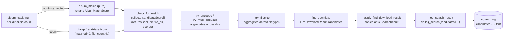

# Search Escalation and Forensics for Stuck Releases

## Overview

Cratedigger releases that fail to match on the first cycle (e.g. #1843 — The Wiggles 1991 AU, 26 tracks) currently grind through dozens of identical search cycles with no learning. The brainstorm identified three independent layers driving this: an unset `responseLimit` capping every search at 100 peer responses, a query that never varies cycle-to-cycle, and an `album_match()` boolean return that discards the per-track scores it computes.

This plan implements: (a) raising `responseLimit` to 1000 by default and exposing it via the NixOS module; (b) a query escalation ladder that activates after 5 failed cycles, layering in V1 (append year) then V4 (rotating distinctive track-name tokens); (c) forensic capture of the top-20 candidate scores per search as JSONB on `search_log`; and (d) a terminal `search_exhausted` state that flips chronically stuck requests to `manual` for operator triage.

The strict 26/26 accept rule in `album_match` is preserved — the refactor only stops discarding the intermediate scores. Strict matching remains a primary defence at both search time and import time.

---

## Problem Frame

See origin: `docs/brainstorms/search-escalation-and-forensics-requirements.md`. The pipeline DB has 28 `search_log` rows for #1843, all with identical query (`*he *iggles`), all with `result_count` 99–100, all with outcome `no_match`, spanning a week. No record of what the 100 candidates were, no record of why they were rejected, and no mechanism to broaden the search across cycles. A manual Soulseek search for `wiggles 1991` returns FLAC dirs with 26 tracks within seconds — the data is on the network, the pipeline is asking the wrong question.

---

## Requirements Trace

- R1. Pass `responseLimit` explicitly on every search; sourced from typed config field. *(see origin: R1)*
- R2. Default 1000, exposed as a NixOS module option. *(see origin: R2)*
- R3. Typed config field `search_escalation_threshold` (default 5) gates escalation. *(see origin: R3)*
- R4. V1 = append year token; skip if year unknown. *(see origin: R4)*
- R5. V4 = rotating 3-token slices of distinctive track tokens, no artist, no wildcard. *(see origin: R5)*
- R6. Exhaustion flips request to `status='manual'` with structured `manual_reason='search_exhausted'`. *(see origin: R6)*
- R7. `album_match` returns structured score; existing accept/reject behaviour preserved by thin wrapper. *(see origin: R7)*
- R8. New JSONB `search_log.candidates` records top 20 by score. *(see origin: R8)*
- R9. New `search_log.variant` text column. *(see origin: R9)*
- R10. New `search_log.final_state` text column captures slskd terminal state. *(see origin: R10)*
- R11. `pipeline-cli show <id>` surfaces variant + top-3 candidate scores. *(see origin: R11)*
- R12. Web UI request detail surfaces exhaustion state and last forensic blob. *(see origin: R12)*

**Origin actors:** A1 (pipeline search loop), A2 (album matcher), A3 (operator), A4 (NixOS module).
**Origin flows:** F1 (default search), F2 (escalated search), F3 (search exhaustion), F4 (forensic capture per search).

---

## Scope Boundaries

- Loosening the strict 26/26 rule is **not** in scope — explicit hard rule from origin and operator preference. *(see origin: Deferred for later)*
- Variants V2 (country) and V3 (format hints) are **not** implemented — peers don't index those tokens. *(see origin: Deferred for later)*
- No in-search pagination (slskd has no "next page"; we widen via `responseLimit` and across-cycle variation). *(see origin: Deferred for later)*
- No adaptive `responseLimit` — flat 1000 baseline only. *(see origin: Deferred for later)*
- The dead `search_type = incrementing_page` config key is left in place; cleanup is out of scope here. *(see origin: Deferred for later)*
- No tuning of `responseFileLimit`, `minimumResponseFileCount`, `minimumPeerUploadSpeed`. *(see origin: Outside this brainstorm)*
- No beets distance scoring at search time. *(see origin: Outside this brainstorm)*

---

## Context & Research

### Relevant Code and Patterns

- `cratedigger.py:search_for_album` (single-album path) and `cratedigger.py:_submit_search` / `_collect_search_results` (parallel path) both call `slskd.searches.search_text(...)` — `responseLimit` argument must be added to both call sites.
- `cratedigger.py:_log_search_result` is the single persistence point for search outcomes; it is invoked from both the serial and parallel search loops after `find_download` runs. It calls `lib/pipeline_db.py:PipelineDB.log_search`. New columns will plumb through this function's signature.
- `cratedigger.py:_apply_find_download_result` is the seam where `FindDownloadResult` is translated into `SearchResult.outcome`. This is where the candidates list will be copied off the find-download result onto the search result.
- `lib/search.py:build_query` is the existing query builder. V1 reuses it as base. V4 bypasses it (no artist, no wildcard) and constructs its own token list using the same `strip_special_chars` / `strip_short_tokens` helpers.
- `lib/matching.py:album_match` is the current bool-returning matcher. Per-track sequence-match ratios are computed via `difflib.SequenceMatcher.ratio()` and `check_ratio` retries. Today the function returns `True` only if every expected track scores above `minimum_match_ratio`; otherwise `False` with all intermediate state discarded.
- `lib/matching.py:check_for_match` (line 171) is the function that iterates `dirs_to_try`, browses each, calls `album_track_num`, and **gates `album_match` behind `tracks_info["count"] == track_num and tracks_info["filetype"] != ""`** (line 244). It returns `tuple[bool, Any, str]` and stops at the first match. This is the actual forensic seam — extending its return type to include per-dir candidate scores is required, since `album_match` itself is invoked from here.
- `lib/enqueue.py:try_enqueue` (line 180) and `try_multi_enqueue` (line 290) call `check_for_match` and currently consume only the bool/dir/file_dir tuple. Both must accept and forward the per-dir candidate scores.
- `lib/enqueue.py:_try_filetype` (line 345) drives `try_enqueue`/`try_multi_enqueue` per filetype attempt; it is the natural aggregation point for candidate scores across filetype tries.
- `lib/enqueue.py:find_download` (around line 413) drives `_try_filetype` per allowed filetype and returns `FindDownloadResult`. Extending `FindDownloadResult` with a `candidates: list[CandidateScore]` is the outermost plumbing seam — populated by `_try_filetype` from accumulated `check_for_match` results.
- **The count-gate blind spot is load-bearing.** Today, dirs that fail `tracks_info["count"] == track_num` (e.g. a peer with 22 of 26 expected audio files) never reach `album_match` and would never produce a `CandidateScore`. Forensic capture MUST emit a cheap `CandidateScore` for sub-count dirs too — built from `album_track_num`'s output (`matched_tracks=0, total_tracks=expected_count, file_count=actual_count, missing_titles=[]`, `avg_ratio=0.0`). Without this, the JSONB blob would only contain the same handful of dirs that already pass the count gate, defeating the headline diagnostic goal of "did the right peer ever appear, even partially?".
- `lib/matching.py:_track_titles_cross_check` runs **after** `album_match` returns True and gates the final accept. The strict-accept ordering (score → bool → cross-check → enqueue) must be preserved by U2.
- `lib/config.py:CratediggerConfig` is the typed config dataclass; new fields (`search_response_limit`, `search_escalation_threshold`) follow the existing pattern in `from_ini`.
- `nix/module.nix` lines 552+ define the `searchSettings` mkOption block; lines 143–155 render those values into the `config.ini` template. New options follow the same shape.
- `migrations/` follows versioned-NNN convention; `001_initial.sql` defines `album_requests` (no `manual_reason` column today), `album_tracks`, and `search_log`. New migration is `009_search_forensics_and_manual_reason.sql`.
- `lib/pipeline_db.py:log_search` is the only writer for `search_log` — its signature is the single-point change for new columns.
- `tests/test_search.py` already exists for query-builder tests (extend for variant generator).
- No `tests/test_matching.py` exists today; matching is exercised via `tests/test_integration.py` and `tests/test_integration_slices.py`. New test file `tests/test_matching.py` is the right home for the album_match refactor's pure-function tests.
- `tests/fakes.py:FakePipelineDB` and `tests/helpers.py` provide the orchestration test surface; `_WebServerCase` in `tests/test_web_server.py` is the contract-test harness for U7's web changes.

### Institutional Learnings

- `.claude/rules/code-quality.md` § "Wire-boundary types": JSONB blobs read back from the DB and consumed at multiple sites are `msgspec.Struct`. The `CandidateScore` type written into `search_log.candidates` and read back in `pipeline-cli show` and the web UI is therefore a `msgspec.Struct` with symmetric `msgspec.json.encode` / `msgspec.convert` at the boundary.
- `.claude/rules/code-quality.md` § "Pipeline Decision Debugging — Simulator-First TDD": variant selection is decision logic; the variant generator must be a pure function with subTest-table tests. `pipeline-cli quality`'s pattern is the right template — consider extending or adding `pipeline-cli search-variant <id> [--cycle N]` to dry-run variant selection without touching slskd.
- `.claude/rules/code-quality.md` § "No Parallel Code Paths": both `search_for_album` (serial) and `_submit_search` (parallel) currently duplicate the slskd call site. New params (`responseLimit`) must be added in both. The serial path is rarely hit in production but must stay in lockstep.
- `.claude/rules/pipeline-db.md`: schema lives in `migrations/NNN_name.sql` only. No DDL inside `PipelineDB` methods.
- `.claude/rules/deploy.md`: cratedigger-db-migrate runs before cratedigger-web/cratedigger; the new migration applies automatically on `nixos-rebuild switch`.
- Recent feat plans (e.g. `2026-04-29-005-feat-bad-rip-button-and-content-hash-defense-plan.md`) follow the unit/test/migration pattern this plan mirrors.

### External References

- slskd-api Python client `SlskdClient.searches.search_text` defaults: `responseLimit=100`, `fileLimit=10000`, `minimumResponseFileCount=1`, `searchTimeout=15000`, `filterResponses=True`. Confirmed via `inspect.signature` in dev shell.
- slskd search states: `Queued -> InProgress -> Completed`, terminal: `TimedOut | ResponseLimitReached | Errored`. Already documented in `cratedigger.py` comments at lines 186 and 296.

---

## Key Technical Decisions

- **Manual-reason column on `album_requests`.** Resolves origin O1. Add `manual_reason TEXT` (NULL by default; populated on system-driven flips like `search_exhausted`, available for future system flips). Rejected alternative: stuffing the reason into `reasoning` (used by request-creation flow for human-authored notes — overloading risks UI confusion). Rejected alternative: dedicated `request_exhaustion` table (over-modelling for one row per request; structured column on `album_requests` is queryable via `WHERE manual_reason = 'search_exhausted'`).
- **Re-queue from manual resets `search_attempts` and clears `manual_reason`.** Resolves origin O2. The variant ladder is purely a function of `search_attempts`; restarting at 0 means the operator's manual re-queue starts at the default query, which is the right behaviour after an MBID swap or fix.
- **Forensic candidates plumbed via `check_for_match` → `try_enqueue` → `_try_filetype` → `FindDownloadResult.candidates`.** Resolves origin O3. The seam is `check_for_match` (matching.py:171), not `_try_filetype` directly — `album_match` is invoked only from inside `check_for_match`. Both the count-gate-passing path (where `album_match` runs) and the count-gate-failing path (where `album_track_num` returns a sub-count) must emit a `CandidateScore`. `check_for_match` returns `(bool, dir, file_dir, list[CandidateScore])` (signature change). `try_enqueue` / `try_multi_enqueue` accumulate scores across dirs they iterate. `_try_filetype` aggregates across filetype attempts. `find_download` returns them on `FindDownloadResult`. `_apply_find_download_result` copies them onto `SearchResult.candidates`. `_log_search_result` passes them to `db.log_search` for top-20-by-score persistence.
- **Discogs path inherits forensic capture for free.** Resolves origin O4. The Discogs source flows through the same `find_download` → `_try_filetype` → `album_match` path as MusicBrainz; the only difference is upstream metadata. No additional work needed; verify in U5 test scenarios.
- **`CandidateScore` is a `msgspec.Struct`, not a `@dataclass`.** It crosses JSON twice — written into `search_log.candidates` JSONB by `log_search`, read back by `pipeline-cli show` and the web UI request-detail route. Symmetric strict validation at both boundaries per `code-quality.md` § Wire-boundary types.
- **Variant generator is a pure function in `lib/search.py`.** No I/O, no DB, no slskd. Inputs: `search_attempts`, `escalation_threshold`, base-query string, `year: int | None`, `track_titles: list[str]`. Output: `SearchVariant` with kind (`default | v1_year | v4_tracks | exhausted`), the query string to issue, a `slice_index` for V4, and a stable `tag` (e.g. `default`, `v1_year`, `v4_tracks_3`) used for `search_log.variant`. The generator is deterministic for a given input — testable via subTest tables.
- **V4 token pool ordering is by length descending, dedupe case-insensitively, drop short tokens (<=2 chars).** The token pool is computed once per search cycle (cheap — typically <30 tokens); the cycle index selects the slice. Pool exhaustion is detectable at generator level: `slice_index * 3 >= len(pool)` returns the `exhausted` sentinel.
- **`search_log.final_state` captured from slskd's `state` field.** Both `search_for_album` and `_collect_search_results` already read `state_resp["state"]`; today they only check whether the search has terminated. They will record the final state string into the `SearchResult` so it can be persisted. This requires no extra slskd round-trip.
- **`responseLimit=1000` flat, not adaptive.** Per origin scope. Slskd CPU impact is acknowledged (D2) but not measured here; if slskd performance regresses under load, revisit in a follow-up.

---

## Open Questions

### Resolved During Planning

- **Where does `search_exhausted` reason live?** New `album_requests.manual_reason TEXT` column (NULL by default). See Key Technical Decisions.
- **Reset `search_attempts` on manual re-queue?** Yes — and clear `manual_reason` at the same time. See Key Technical Decisions.
- **Forensic plumbing without restructuring the search loop?** Yes — extend `FindDownloadResult` with a `candidates` list and copy through the existing `_apply_find_download_result` seam. See Key Technical Decisions.
- **Discogs path forensic capture?** Inherits for free; same matching codepath. Test scenario added to U5 to verify.

### Deferred to Implementation

- The exact attribute name on `FindDownloadResult` for the candidates list — `candidates` is the working name; finalise during U5 if a clearer one emerges.
- Whether the variant tag for V4 is `v4_tracks_<slice_index>` or includes the actual tokens. Implementation should pick whatever the diagnostics consumers (CLI + web UI) display most cleanly. Tag content is not a stable contract — purely informational for operators.
- Whether to delete the dead `search_type = incrementing_page` config key during this work or in a follow-up. Origin says follow-up; revisit only if it actively interferes with U3.
- Exact slskd-state mapping (e.g. is the status string `"Completed"` or `"Completed,ResponseLimitReached"` when both flags are set?). Verify by inspecting one live search response; not knowable until U5 implementation reads real state strings.
- Whether `check_for_match` widens its return to a tuple `(bool, dict, str, list[CandidateScore])` or to a `MatchResult` dataclass. The dataclass is cleaner; the tuple is a smaller diff. Implementer's call.
- Whether the U5 test infrastructure extension is `FakeSlskdSearches` (preferred for reuse) or an inline `MagicMock` (acceptable for a one-off). Decide at test-writing time based on whether other concurrent work also needs the fake.

---

## High-Level Technical Design

> *This illustrates the intended approach and is directional guidance for review, not implementation specification. The implementing agent should treat it as context, not code to reproduce.*

**Variant ladder (pure function):**

```text
inputs: search_attempts, threshold=5, base_query, year, track_titles

if search_attempts < threshold:
    -> SearchVariant(kind=default, query=base_query, tag="default")

# escalation index = how many escalated cycles have happened
esc_idx = search_attempts - threshold     # 0, 1, 2, ...

if esc_idx == 0 and year is not None:
    -> SearchVariant(kind=v1_year, query=base_query + " " + year, tag="v1_year")

# V1 either ran (esc_idx 0) or was skipped (year missing). V4 starts at:
v4_start = 1 if year is not None else 0
v4_idx = esc_idx - v4_start

pool = sorted(distinctive_tokens(track_titles), key=len, descending)
slice_start = v4_idx * 3
if slice_start >= len(pool):
    -> SearchVariant(kind=exhausted)
slice = pool[slice_start : slice_start + 3]
-> SearchVariant(kind=v4_tracks, query=" ".join(slice), tag=f"v4_tracks_{v4_idx}")
```

**Forensic plumbing (data flow):**



The ownership boundary between matching and persistence does not change — `album_match` stays pure, `_log_search_result` stays the only writer. The signature changes propagate through `check_for_match` → `try_enqueue`/`try_multi_enqueue` → `_try_filetype` → `find_download`, but each is a strict expansion of the existing return tuple, not a behavioural change.

---

## Implementation Units

- U1. **Migration: forensic columns + manual_reason**

**Goal:** Add `candidates JSONB`, `variant TEXT`, `final_state TEXT` to `search_log`; add `manual_reason TEXT` to `album_requests`. All NULL-defaulting so historical rows remain readable.

**Requirements:** R6, R8, R9, R10

**Dependencies:** None.

**Files:**
- Create: `migrations/009_search_forensics_and_manual_reason.sql`
- Test: `tests/test_migrator.py` (existing — verifies the migration applies cleanly)

**Approach:**
- Plain SQL `ALTER TABLE … ADD COLUMN` statements, no `IF NOT EXISTS` guards (per `pipeline-db.md`: versioned migrations run once).
- Single migration file covers both tables — they're applied atomically per the migrator's per-file transaction.
- The migration also replaces the inline `search_log.outcome` CHECK constraint to add `'exhausted'`. The constraint at `migrations/001_initial.sql:119–121` is unnamed and inline, so Postgres auto-named it `search_log_outcome_check`. The replacement is:
  ```sql
  ALTER TABLE search_log DROP CONSTRAINT search_log_outcome_check;
  ALTER TABLE search_log ADD CONSTRAINT search_log_outcome_check
    CHECK (outcome IN ('found','no_match','no_results','timeout','error','empty_query','exhausted'));
  ```
  The migrator runs each file in its own transaction, so the DROP+ADD is atomic — no window where the constraint is missing.

**Patterns to follow:**
- `migrations/008_bad_audio_hashes.sql` for SQL style and column ordering.

**Test scenarios:**
- Happy path: migration applies cleanly to a fresh DB and the resulting `search_log` and `album_requests` have the new columns with correct types and NULL defaults. Covered by the existing `tests.test_migrator.TestMigrator` mechanism, which loads each migration file and asserts the resulting schema.
- Edge case: migration applies cleanly when re-run against an already-migrated DB (handled by the migrator's `schema_migrations` version check, but verify the migration file doesn't accidentally include any non-idempotent operations).

**Verification:**
- `nix-shell --run "python3 -m unittest tests.test_migrator -v"` passes with the new migration in place.
- After deploy, `ssh doc2 'pipeline-cli query "SELECT column_name FROM information_schema.columns WHERE table_name=\\'search_log\\'"'` includes `candidates`, `variant`, `final_state`. Same query on `album_requests` includes `manual_reason`.

---

- U2. **Refactor `album_match` to return structured scores; widen `check_for_match` to capture sub-count dirs**

**Goal:** Replace `album_match`'s `bool` return with an `AlbumMatchScore` dataclass exposing the per-track scores already computed. Extend `check_for_match` to (a) accumulate scores across every dir it iterates and (b) emit a cheap `CandidateScore` for dirs that fail the count gate (so the forensic log captures "this peer had 22 of 26 audio files"). Preserve the current accept/reject behaviour exactly: strict match still requires every track above `minimum_match_ratio` AND the existing `_track_titles_cross_check`.

**Requirements:** R7

**Dependencies:** None (pure-function refactor; can land before or after U1).

**Files:**
- Modify: `lib/matching.py` (`album_match`, `check_for_match`)
- Modify: `lib/enqueue.py` (`try_enqueue`, `try_multi_enqueue`, `_try_filetype` — accept and forward the candidate scores list)
- Create: `tests/test_matching.py`

**Approach:**
- Define `AlbumMatchScore` (`@dataclass` — purely internal, never crosses JSON in this form): `matched_tracks: int, total_tracks: int, avg_ratio: float, missing_titles: list[str], best_per_track: list[float]`. The persisted forensic record (`CandidateScore` in U5) is a derivative struct that adds `username`, `dir`, `filetype`, `file_count`.
- Refactor `album_match` to compute and return `AlbumMatchScore` for every input. The `ignored_users` check stays out of the pure scoring function (handled at the `check_for_match` layer).
- Refactor `check_for_match` to return `tuple[bool, dict, str, list[CandidateScore]]` (or a small `MatchResult` dataclass — pick during implementation; the tuple is conservative). For every dir in `dirs_to_try`:
  - If `tracks_info["count"] != track_num` or `tracks_info["filetype"] == ""`: emit a cheap `CandidateScore` with `matched_tracks=0`, `total_tracks=len(tracks)`, `avg_ratio=0.0`, `missing_titles=[]`, `file_count=tracks_info["count"]`. This is the count-gate-failure capture.
  - If the count gate passes: call `album_match`, build a full `CandidateScore` from the resulting `AlbumMatchScore` plus the contextual `username`, `dir`, `filetype`, and `file_count`.
  - The existing strict-accept logic (every track above ratio + `_track_titles_cross_check`) stays in place, in this order: score → bool → cross-check → return True. When the cross-check fails, the dir is logged as a warning today (matching.py:248) and the loop continues — preserve this behaviour, and also append the score to the candidates list so the forensic record captures the cross-check rejection.
- `try_enqueue` (enqueue.py:180) and `try_multi_enqueue` (enqueue.py:290) must be updated to accept the new return shape and forward the candidate scores. Their existing return type to `_try_filetype` must also widen to carry the scores.
- `_try_filetype` (enqueue.py:345) accumulates candidate scores across filetype attempts (each filetype try iterates dirs separately). Pass the accumulated list back via the existing return path.

**Execution note:** Test-first. Write `tests/test_matching.py` with the structured-return shape assertions and the strict-accept regression cases before changing `lib/matching.py`. The refactor is observable behaviour-preserving — the test suite must still pass after the bool→score swap.

**Patterns to follow:**
- Existing typed `@dataclass` returns elsewhere in `lib/matching.py` (e.g. `album_track_num`'s dict return — replace this idiom with a typed return on touch, but only if it's directly impacted; otherwise out of scope).
- subTest table style from `tests/test_quality_decisions.py:TestSpectralImportDecision`.

**Execution note:** Test-first. Write `tests/test_matching.py` with the structured-return shape assertions and the strict-accept regression cases before changing `lib/matching.py`. The refactor is observable behaviour-preserving — the test suite must still pass after the bool→score swap.

**Patterns to follow:**
- Existing typed `@dataclass` returns elsewhere in `lib/matching.py` (e.g. `album_track_num`'s dict return — replace this idiom with a typed return on touch, but only if it's directly impacted; otherwise out of scope).
- subTest table style from `tests/test_quality_decisions.py:TestSpectralImportDecision`.

**Test scenarios:**

`album_match` (pure):
- Happy path: dir with all 26 tracks named exactly → `matched_tracks==total_tracks==26`, `avg_ratio` near 1.0, `missing_titles=[]`. Strict-accept callers see True.
- Happy path: dir with 24 of 26 tracks (2 missing entirely from filenames) → `matched_tracks=24`, `total_tracks=26`, `missing_titles=[<2 titles>]`. Strict-accept callers see False; structured score is still returned for forensic capture.
- Edge case: dir where every track filename has prefix `01 - Title` style → `check_ratio` separator logic kicks in; matched_tracks should still be 26.
- Edge case: dir with album-name prefix `The Wiggles - Title.mp3` → matched via the `album_name + " " + expected_filename` retry path.
- Edge case: catch-all filetype (`*`) — extension comes from slskd filename; per-track ratios computed against `<title>.<inferred-ext>`.
- Edge case: empty `slskd_tracks` list → `matched_tracks=0`, `total_tracks=len(expected)`, `missing_titles` lists every expected title.
- Error path: `expected_tracks` is empty (defensive — should never happen in practice but the function dereferences `expected_tracks[0]` for album metadata) → document the precondition; either raise or short-circuit, decide during implementation.

`check_for_match` (sub-count capture):
- Happy path: every dir in `dirs_to_try` passes the count gate → list of `CandidateScore` has one entry per dir, all built from `album_match` output.
- Happy path (sub-count): dir with `tracks_info["count"]=22, track_num=26` → cheap `CandidateScore` emitted with `matched_tracks=0, total_tracks=26, file_count=22, avg_ratio=0.0`. `album_match` is NOT called for this dir. List ordering is preserved.
- Edge case: dir with `tracks_info["filetype"]==""` (no audio files at all) → cheap `CandidateScore` with `file_count=0`.
- Edge case: cross-check failure on an otherwise-strict-accept dir → the dir is added to `negative_matches`, the loop continues, AND the score is appended to the candidates list with the per-track scores intact (cross-check failure is observable in forensic output even though it doesn't have a dedicated field — operators can infer from "matched_tracks==total_tracks but no enqueue").
- Edge case: first dir already strict-accepts → `check_for_match` returns True immediately; only this dir's score is in the list (the historical short-circuit behaviour is preserved).
- Strict-accept regression: every existing accept-then-cross-check-then-return path still produces the same final `(bool, dir, file_dir)` triplet today (the new fourth element is additive).

Integration:
- `tests/test_integration.py` and `tests/test_integration_slices.py` cases that exercise the matching path must still pass without modification (S4).

**Verification:**
- New tests pass; the full suite (`nix-shell --run "bash scripts/run_tests.sh"`) shows no regressions in `tests/test_integration*` or any other matching-adjacent tests.

---

- U3. **Config + Nix module wiring for `responseLimit` and `escalation_threshold`**

**Goal:** Add `search_response_limit: int = 1000` and `search_escalation_threshold: int = 5` to `CratediggerConfig`. Render via `config.ini`. Expose `search_response_limit` as a NixOS module option (escalation threshold can be config-only for now — operators rarely tune it).

**Requirements:** R1, R2, R3

**Dependencies:** None.

**Files:**
- Modify: `lib/config.py`
- Modify: `nix/module.nix`
- Test: extend `tests/test_config.py` (existing) for the new fields.
- Test: `nix-shell --run "nix build .#checks.x86_64-linux.moduleVm"` for the module change.

**Approach:**
- Add typed fields to `CratediggerConfig` with defaults; read via `getint` in `from_ini`.
- Render in `config.ini` template under `[Search Settings]` next to `search_timeout` and friends.
- Add `searchSettings.searchResponseLimit` to the mkOption block, default 1000, description ties it to slskd's `responseLimit` ceiling.
- Both options carry safe defaults so the module change is transparent to existing deployments.

**Patterns to follow:**
- Existing `searchSettings.searchTimeout` mkOption (line 553 area) for option declaration shape.
- Existing config rendering at module.nix lines 143–156 for the formatting.
- Existing `getint` usage in `lib/config.py:from_ini` for the loader.

**Test scenarios:**
- Happy path: `from_ini` with `[Search Settings]\nsearch_response_limit = 1500` produces a config with `search_response_limit == 1500`.
- Happy path: missing `[Search Settings]` keys → defaults of 1000 and 5 respectively.
- Edge case: `from_ini` with `search_response_limit = 0` — document expected behaviour. Either accept and let slskd reject, or reject in `from_ini`. Recommend: accept and let it fall through; defensive validation at config layer is out of scope.
- Integration (Nix module VM): the rendered `config.ini` contains the `search_response_limit = 1000` line under `[Search Settings]`.

**Verification:**
- `nix-shell --run "python3 -m unittest tests.test_config -v"` passes.
- `nix-shell --run "nix build .#checks.x86_64-linux.moduleVm"` passes.

---

- U4. **Variant generator (pure function)**

**Goal:** Implement `select_variant(search_attempts, threshold, base_query, year, track_titles) -> SearchVariant` in `lib/search.py`. Pure function. Single source of truth for which query to issue per cycle.

**Requirements:** R3, R4, R5, R6 (exhaustion sentinel)

**Dependencies:** None (pure function; testable in isolation).

**Files:**
- Modify: `lib/search.py` (add `SearchVariant` dataclass, `select_variant`, helper `_distinctive_token_pool`)
- Modify: `tests/test_search.py` (extend with variant-generator subTest tables)

**Approach:**
- `SearchVariant` is a `@dataclass` (internal, never crosses JSON): `kind: Literal["default", "v1_year", "v4_tracks", "exhausted"]`, `query: str | None` (None for `exhausted`), `tag: str` (persisted to `search_log.variant`), `slice_index: int | None` (V4 only, for diagnostics).
- `_distinctive_token_pool(track_titles)` reuses `strip_special_chars` and `strip_short_tokens`; dedupes case-insensitively; sorts by token length descending. Returns `list[str]`.
- `select_variant` is the deterministic ladder per the High-Level Technical Design pseudo-code. No I/O.
- **Year input is `str | None`, with `"0000"` treated as unknown.** `AlbumRecord.release_date` (album_source.py:119–130) falls back to the literal string `"0000"` when MB has no year. `select_variant` must treat `year is None or year.startswith("0000")` as "year unknown" and skip V1. Caller is responsible for parsing the 4-char prefix; the function accepts the raw string for simplicity.
- The `tag` value is what gets persisted: `default`, `v1_year`, `v4_tracks_0`, `v4_tracks_1`, etc. `exhausted` is also a tag, used by the search loop to short-circuit before hitting slskd.

**Execution note:** Test-first. The variant ladder is decision logic; per `code-quality.md` § Pipeline Decision Debugging, the simulator-style test is the spec.

**Patterns to follow:**
- subTest table style from `tests/test_quality_decisions.py:TestSpectralImportDecision`.
- Pure-function discipline from `lib/search.py:build_query` (already pure).

**Test scenarios:**
- Happy path (table): cycle 0–4 → kind=default, query=base_query, tag=default. Cycle 5 with year=1991 → kind=v1_year, query=`<base> 1991`, tag=v1_year. Cycle 6 → kind=v4_tracks, slice_index=0, query=top-3 tokens, tag=v4_tracks_0. Cycle 7 → slice_index=1, etc.
- Edge case: year=None → cycle 5 skips V1, goes directly to V4 slice 0.
- Edge case: year=`"0000"` (literal MB-fallback string) → treated as unknown; cycle 5 skips V1.
- Edge case: year=`"0000-00-00"` → also treated as unknown via the `startswith("0000")` check.
- Edge case: track_titles=[] (no track rows) → cycle 5 with year=1991 returns v1_year; cycle 6 returns exhausted (V4 has no pool).
- Edge case: track_titles=[] and year=None → cycle 5 returns exhausted immediately.
- Edge case: single-track album (`len(track_titles) == 1`) → V4 is suppressed even with a non-empty pool. With year known: cycle 5 = v1_year, cycle 6 = exhausted. With year=None: cycle 5 = exhausted immediately. Rationale: a one-token V4 query (the lone track title) produces slskd matches that pass the 0.15 distance gate too easily — unrelated albums that happen to share that song name leak through. (Added 2026-04-30 after the V4 ladder was deployed and observed misfiring on EPs/singles.)
- Edge case: `_distinctive_token_pool` with all duplicate-after-dedupe tokens → pool is the deduped set; slice_index that overshoots returns exhausted.
- Edge case: cycle 100 with a 3-token pool → exhausted (only one V4 slice available; subsequent cycles all exhausted).
- Edge case: token pool of size 7 with year present → v1 at cycle 5, v4 slices at cycles 6 (idx 0, tokens 0-2), 7 (idx 1, tokens 3-5), 8 (idx 2, tokens 6-6 — single token), 9 (exhausted).
- Happy path: tag value matches the format `v4_tracks_<idx>` exactly so it can be parsed by diagnostics.

**Verification:**
- `nix-shell --run "python3 -m unittest tests.test_search -v"` shows the new variant tests passing.
- All existing `tests.test_search` cases still pass.

---

- U5. **Wire variants + responseLimit + forensic capture into the search loop**

**Goal:** Pass `responseLimit` on every slskd search; route every cycle through `select_variant`; capture top-20 candidate scores per search; record final slskd state. End-to-end plumbing across `search_for_album`, `_submit_search`, `_collect_search_results`, `_apply_find_download_result`, `_log_search_result`, `lib/enqueue.py:find_download`, `lib/matching.py:_try_filetype`.

**Requirements:** R1, R2, R7 (consumer), R8, R9, R10

**Dependencies:** U1 (DB columns), U2 (album_match returns scores), U3 (config fields), U4 (variant generator).

**Files:**
- Modify: `cratedigger.py` (search_for_album, _submit_search, _collect_search_results, _apply_find_download_result, _log_search_result)
- Modify: `lib/enqueue.py` (find_download, FindDownloadResult)
- Modify: `lib/matching.py` (_try_filetype to accumulate CandidateScore entries)
- Modify: `lib/search.py` (extend SearchResult with candidates, variant_tag, final_state fields)
- Modify: `lib/pipeline_db.py` (extend log_search signature with candidates, variant, final_state kwargs)
- Create: `lib/quality.py` *or* a new `lib/search_forensics.py` module — define `CandidateScore` as `msgspec.Struct` (this is the wire-boundary type written into JSONB). Decide module placement during implementation; bias toward `lib/quality.py` since it's where the existing wire-boundary types like `ImportResult` live.
- Test: extend `tests/test_integration_slices.py` with a slice that runs find_download + log_search end-to-end with FakePipelineDB.
- Test: `tests/test_pipeline_db.py` — log_search persists candidates as JSONB.
- Test: extend `tests/test_search.py` or add `tests/test_search_loop.py` for the search_for_album wrap that selects a variant and passes it to slskd.

**Approach:**
- Look up `db_request_id` (and from there, `search_attempts`, `release_date`, track titles) at the top of `search_for_album` / pre-`_submit_search`. Call `select_variant` with those inputs to get the variant. Use `variant.query` for the slskd call instead of `build_query()`. Short-circuit on `kind=="exhausted"` — do not call slskd; mark the SearchResult with outcome=`exhausted` (new outcome value — handled by U1's CHECK constraint replacement) and let `_log_search_result` flip the request to `manual` in U6.
- Pass `responseLimit=cfg.search_response_limit` on the `slskd.searches.search_text` call in both `search_for_album` and `_submit_search`.
- Capture `state_resp["state"]` as the final state when polling terminates and carry it on `SearchResult.final_state`. **Serial-path note:** `cratedigger.py:194` currently reads `state` as a one-line expression and does not bind `state_resp`. Refactor to `state_resp = slskd.searches.state(search["id"], False); state = state_resp["state"]; ...; result.final_state = state` so the value is available at termination. Parallel path at `cratedigger.py:306` already binds `state_resp` correctly.
- Forensic plumbing follows the corrected call graph (see Key Technical Decisions and the High-Level Technical Design diagram): `check_for_match` accumulates the `CandidateScore` list (covering both the count-gate-passing path through `album_match` and the count-gate-failing path with cheap synthetic scores). `try_enqueue` and `try_multi_enqueue` forward the list back to `_try_filetype`, which aggregates across filetype attempts. The same dir scored under two different filetypes is two distinct entries (legitimate diagnostic information). `find_download` returns the aggregated list on `FindDownloadResult.candidates`.
- `_apply_find_download_result` copies `find_result.candidates` onto `SearchResult.candidates`.
- `_log_search_result` truncates to top-20 by `(matched_tracks DESC, avg_ratio DESC)` and passes through to `db.log_search(candidates=..., variant=..., final_state=...)`. `log_search` encodes via `msgspec.json.encode` per `code-quality.md` § Wire-boundary types and writes the `candidates` parameter as JSONB.
- **Other `SearchResult` construction sites (parallel-path failure handling).** `cratedigger.py:462–470` (parallel submit failure — empty query / submit raise) and `cratedigger.py:498` (parallel collection crash — exception during `future.result()`) both construct ad-hoc `SearchResult` objects without forensic fields. These call `_log_search_result` and must continue to. The new `candidates`, `variant`, and `final_state` fields default to `[]` / `None` / `None` for these failure rows — explicitly NULL in the DB. This is correct behaviour: failure rows have no scoring data to report.
- **Variant-selection currency invariant (brittle but currently safe).** Variant selection reads `search_attempts` at submit time; `record_attempt` increments at log time. In the parallel pipeline, two albums in flight are always different albums (the `wanted` queue does not duplicate). Within a single album's lifecycle, submit→collect→log is sequential per album, so `search_attempts` cannot drift between submit and log. **Add a one-line comment in `_submit_search` flagging this invariant** — any future refactor that allowed the same album to be submitted twice in one batch would silently pick the same variant.

**Execution note:** Implement after U1, U2, U3, U4 are merged or stacked. The integration test in `tests/test_integration_slices.py` is the verification surface — RED first against the empty `candidates` JSONB, GREEN after plumbing.

**Patterns to follow:**
- `_apply_find_download_result` for the cross-module mapping idiom.
- `lib/pipeline_db.py` JSONB write style — see existing JSONB columns like `download_log.beets_detail`.
- `tests/test_integration_slices.py:TestSpectralPropagationSlice` for the run-real-orchestration-with-FakePipelineDB pattern.
- `code-quality.md` § Wire-boundary types: `CandidateScore` as `msgspec.Struct`; one decode site (the read in U7); symmetric encode at write time.

**Test infrastructure note:** `tests/fakes.py:FakeSlskdAPI` (line 214) currently exposes only `transfers` and `users` — it has no `searches` attribute. To assert that `responseLimit=1000` is passed and to drive search responses in orchestration tests, U5 must extend `FakeSlskdAPI` with a `FakeSlskdSearches` stub that records `search_text` kwargs, returns a fake search id, exposes a `state()` poll, and returns canned `search_responses(search_id)` payloads. Self-test the new fake via `tests/test_fakes.py` per the existing pattern. (Alternative: drop in a `MagicMock` for the searches client in just the U5 tests — acceptable for a one-off but the fake is preferred for reuse in future search-touching tests.)

**Test scenarios:**
- Happy path: search succeeds with one matching peer → SearchResult contains candidates with that peer at top, search_log row persists JSONB with `[{username, dir, filetype, matched_tracks: 26, total_tracks: 26, avg_ratio: 0.92, missing_titles: [], file_count: 26}]`, variant=default, final_state=Completed.
- Happy path (escalation): with `search_attempts=5` and a year set, the variant generator returns v1_year; search uses the year-augmented query; search_log.variant='v1_year'.
- Happy path (V4 escalation): with `search_attempts=6` and track titles populated, variant is v4_tracks_0; search uses top-3 token query; search_log.variant='v4_tracks_0'.
- Happy path: `responseLimit` is passed to the slskd-api call (assert via mock) on both serial and parallel paths.
- Happy path (forensic): a search returning 0 hits still writes a `search_log` row with `candidates=[]` (empty array, not NULL).
- Happy path (forensic order): a search where peer A has 24/26 and peer B has 26/26 → candidates JSONB lists peer B first, then peer A.
- Edge case: more than 20 candidates → JSONB contains only the top 20.
- Edge case: final_state=ResponseLimitReached → persisted on search_log row, distinguishable from final_state=Completed.
- Edge case: variant=exhausted → no slskd call made; SearchResult.outcome='exhausted', search_log row persists with outcome='exhausted', variant='exhausted'. (This row enables U6's flip.)
- Edge case (Discogs path): a Discogs-source request with the same flow produces the same candidates JSONB shape — verify via test that explicitly sets `source='request'` with `discogs_release_id` populated and an MB-equivalent track list.
- Error path: slskd raises during search → SearchResult.outcome='error', candidates=[], variant=<whatever was selected>, final_state=NULL or 'Errored'.
- Integration: `tests/test_integration_slices.py` slice that runs `search_and_queue` end-to-end with mocked slskd + FakePipelineDB and asserts the JSONB blob shape on `db.search_logs[0]`.

**Verification:**
- After deploy, `ssh doc2 "pipeline-cli query \"SELECT id, variant, final_state, jsonb_array_length(candidates) FROM search_log WHERE request_id=1843 ORDER BY id DESC LIMIT 5\""` returns rows with non-NULL variant, non-NULL final_state, and `jsonb_array_length` between 0 and 20.
- For #1843 specifically: at least one of the next 5 search cycles after deploy yields a `candidates` JSONB blob with at least one entry where `matched_tracks >= 20` (S1).
- Full test suite green; pyright clean on touched files.

---

- U6. **Search exhaustion → flip request to manual; manual re-queue resets state**

**Goal:** When the variant generator returns `kind=exhausted`, the request is flipped to `status='manual'` with `manual_reason='search_exhausted'`. When an operator re-queues a manual request from the UI, both `search_attempts` and `manual_reason` reset.

**Requirements:** R6

**Dependencies:** U1 (manual_reason column), U4 (exhausted variant), U5 (the search loop emits exhaustion).

**Files:**
- Modify: `cratedigger.py:_log_search_result` (handle the exhausted outcome by flipping status with manual_reason).
- Modify: `lib/pipeline_db.py` — extend the existing manual-flip path with a `manual_reason` parameter; extend the existing re-queue path to reset both `search_attempts` and `manual_reason`.
- Test: `tests/test_pipeline_db.py` for the reset-on-requeue behaviour.
- Test: extend the U5 integration slice with the exhaustion flow assertion.

**Approach:**
- Identify the existing manual-flip method on `PipelineDB` (likely a `set_status`-like function); extend its signature to accept `manual_reason: str | None = None`. When non-None, write to the new column.
- **Single-seam reset.** All re-queue paths (web UI button, `pipeline-cli`, importer requeue) funnel through `lib/transitions.py:apply_transition` → `db.reset_to_wanted()` (`lib/pipeline_db.py:917`, with `search_attempts = 0` already set at line 927). Adding `manual_reason = NULL` to `reset_to_wanted` is therefore a one-line change that covers every caller transparently. No multi-site audit needed.
- In `_log_search_result`, after the existing `record_attempt` branch, check for `result.outcome == 'exhausted'` and call the flip method. The flip is idempotent for the search-exhausted case — re-flipping is a no-op.

**Patterns to follow:**
- Existing status-flip methods in `lib/pipeline_db.py`. Search for `UPDATE album_requests SET status` to find the flip sites.
- `lib/transitions.py:apply_transition` (line 373) is the single seam for status transitions including reset to wanted.

**Test scenarios:**
- Happy path: variant=exhausted → request status flips to 'manual' and manual_reason='search_exhausted'.
- Happy path: a request with status='manual' and manual_reason='search_exhausted' is re-queued via the UI → status='wanted', search_attempts=0, manual_reason=NULL.
- Happy path: a manually-created request (status='manual' from inception, manual_reason=NULL) is unaffected by the new flip path; re-queue from this state still works.
- Edge case: variant=exhausted on a request that is already status='manual' for an unrelated reason (e.g. an operator-set hold) → defensive behaviour: do not overwrite an existing manual_reason. Either skip the flip (if status already 'manual') or document and accept the overwrite. Recommend: skip if status is already 'manual' to avoid clobbering operator state.
- Integration: full search cycle ending in exhaustion writes the search_log row, flips the request, and the next `get_wanted` call does NOT return this request.

**Verification:**
- After deploy, deliberately re-queue a stuck release at search_attempts >= 5 and watch one cycle: if all variants exhaust, the request appears in the manual list with the new reason. If variants find a candidate, normal flow continues.
- The test slice asserts the full lifecycle.

---

- U7. **Diagnostics: pipeline-cli show + web UI request detail**

**Goal:** Make the new forensic data visible without raw SQL. `pipeline-cli show <id>` displays the most recent variant tag and the top-3 candidate scores. The web UI request-detail view displays the same plus the manual_reason and a button to expand the full last forensic blob.

**Requirements:** R11, R12

**Dependencies:** U1 (columns), U5 (data being persisted), U6 (manual_reason populated for exhausted requests).

**Files:**
- Modify: `scripts/pipeline_cli.py` (the `cmd_show` command, around line 627–636 where the per-row `search_history` print loop already exists).
- Modify: `web/routes/pipeline.py` — the request-detail handler is `get_pipeline_detail` registered in `_FUNC_GET_PATTERNS` at line 1022 (`(re.compile(r"^/api/pipeline/(\d+)$"), get_pipeline_detail)`).
- Modify: `web/js/<request-detail-module>.js` to render the new fields. Verify exact module during implementation.
- Modify: `web/index.html` only if a new section/template is needed.
- Test: extend `tests/test_web_server.py` with a contract test for the new fields on the `/api/pipeline/<id>` route. The route is pattern-routed (already classified under GET patterns) so `TestRouteContractAudit` should already cover it — verify and update `REQUIRED_FIELDS` accordingly.
- Test: extend `tests/test_web_server.py` `_assert_required_fields` for `manual_reason`, `last_search_variant`, `last_search_top_candidates`.

**Approach:**
- Backend route reads `manual_reason` from `album_requests` and the most recent `search_log` row (joined or fetched separately). The response payload exposes `manual_reason`, `last_search.variant`, `last_search.final_state`, and `last_search.top_candidates: list[CandidateScore]` — top 3 by score for compactness in list views; full blob available via an "expand" toggle that hits a separate route or returns the full top-20 inline.
- Decode the JSONB blob via `msgspec.convert(row['candidates'], type=list[CandidateScore])` — single decode site per `code-quality.md` § Wire-boundary types. The route's response serialization re-encodes via `msgspec.to_builtins`.
- `pipeline-cli show` already iterates `search_history` per row (lines 627–636) and prints `outcome`, `result_count`, `elapsed_s`, `query`. Append `variant` to that per-row line so operators triaging stuck releases see the variant ladder progression at a glance, not just the latest. Also add a separate summary block above or below the search-history table that shows the top-3 candidates from the most recent search row (the wider forensic detail).
- Web UI renders manual_reason as a chip near the status (e.g. red "search exhausted" tag). Forensic blob renders as a collapsed table.

**Execution note:** Frontend changes follow `web.md` rules: vanilla JS, no build step, JSDoc types, `// @ts-check`.

**Patterns to follow:**
- `pipeline-cli show`'s existing rendering of quality columns and download history (the brainstorm references this pattern).
- `_WebServerCase` and `_assert_required_fields` from `tests/test_web_server.py`.
- Existing forensic blob rendering in the validation-log / wrong-matches view (similar JSONB-driven UI).

**Test scenarios:**
- Happy path (CLI): `pipeline-cli show 1843` after a deployed search cycle prints variant, final_state, top-3 candidates inline.
- Happy path (web): GET `/api/requests/1843` returns `manual_reason`, `last_search.variant`, `last_search.final_state`, `last_search.top_candidates` in the contract response.
- Happy path (web, exhausted): a request with `manual_reason='search_exhausted'` displays the chip in the UI list view.
- Edge case (web): a request with no search_log rows yet → `last_search` is null in the response; UI handles gracefully.
- Edge case (CLI): `pipeline-cli show` for a request whose latest search_log row has `candidates=[]` prints variant + final_state but no candidate lines.
- Edge case (web, JSONB decode): a search_log row written before this work (NULL candidates) reads as `top_candidates=[]`. No msgspec.ValidationError.
- Contract: `TestRouteContractAudit` continues to pass with the request-detail route's REQUIRED_FIELDS expanded.
- Integration: the full path — search → exhaustion → manual_reason populated → CLI displays it → web UI displays it — works end-to-end on a real deployed release.

**Verification:**
- All web contract tests pass.
- CLI manual smoke: `ssh doc2 'pipeline-cli show 1843'` after deploy shows the new fields populated.
- Browser manual smoke: load `music.ablz.au`, find #1843 (or another stuck request), confirm the exhaustion chip and forensic blob display per UX intent.

---

## System-Wide Impact

- **Interaction graph:** `search_for_album` and `_submit_search` are both upstream entry points — both must take the new `responseLimit` plumbing. `_log_search_result` is the single persistence sink; all changes converge here. `check_for_match` is the matching seam where `CandidateScore` accumulation begins (covering both count-gate-passing and count-gate-failing dirs); the list propagates through `try_enqueue` / `try_multi_enqueue` → `_try_filetype` → `find_download` → `FindDownloadResult.candidates` → `_apply_find_download_result` → `SearchResult.candidates` → `_log_search_result`. Six function signatures widen, no behaviour changes. The Discogs-source flow uses the same path with no special-casing — verified in U5 test.
- **Error propagation:** slskd timeouts and errors must still produce a `search_log` row (existing behaviour). The new fields default to NULL on error rows; the `final_state` field captures whatever slskd reported. Variant=exhausted bypasses slskd entirely; its outcome is the new `'exhausted'` value (CHECK constraint update in U1).
- **State lifecycle risks:** Re-queue must reset both `search_attempts` AND `manual_reason` — missing one is a partial reset and the request will incorrectly skip default search or display a stale exhaustion chip. The single-seam reset via `db.reset_to_wanted` (lib/pipeline_db.py:917) handles both. The variant-selection currency invariant (read attempts at submit, increment at log) holds because the same album is never in flight twice in a single batch — see U5 brittle-invariant comment.
- **API surface parity:** `pipeline-cli show` and the web UI request-detail route must surface the same fields. The contract test in U7 enforces this. JSONB decode happens at exactly one site (the route) per wire-boundary discipline.
- **Integration coverage:** The U5 integration slice exercises the full search → match → log_search path with FakePipelineDB and a mocked slskd. The U7 contract test exercises the read path.
- **Unchanged invariants:**
  - `album_match`'s strict 26/26 accept rule (R7): structurally preserved by the wrapper. Tests in U2 explicitly assert.
  - `record_attempt` is still called for every non-found, non-exhausted outcome (U5 must not regress this).
  - `search_log.outcome` enum still gates writes — extending it to include `'exhausted'` happens once in U1.
  - Existing search_log rows remain readable. New columns NULL-default. Tools must accept NULL.
  - `search_for_album` (serial) and `_submit_search` (parallel) must stay in lockstep; both touched in U5.

---

## Risks & Dependencies

| Risk | Mitigation |
|------|------------|
| Raising `responseLimit` to 1000 stresses slskd CPU under parallel search load. | Document in deploy notes; observe `journalctl -u slskd` for the first day; revert via Nix option if needed. Adaptive cap is explicitly deferred (origin scope). |
| The variant generator runs on a request with NULL year and zero track rows (e.g. a freshly-added request whose track populator hasn't run yet) → exhausted at cycle 5 immediately. | Acceptable: this is an edge case for releases with truly no metadata. The exhaustion chip in the UI alerts the operator. Could harden later by gating exhaustion until track rows exist; out of scope. |
| `album_match` refactor accidentally changes accept/reject behaviour. | U2's strict-accept regression scenarios + the existing `tests/test_integration*` suite are the guard. Pre-commit pyright + full test run in CI. |
| Migration ordering with manual data in prod (someone has manually flipped a request to 'manual' with a custom `reasoning`). | `manual_reason` is a new column; existing `reasoning` is untouched. No conflict. |
| Discogs-source request hits the search loop before `album_tracks` is populated → V4 has no pool. | Variant generator returns `exhausted` cleanly; the operator sees the chip and re-queues after metadata catches up. Acceptable. |
| The `search_log.outcome` CHECK constraint update in U1 fails if any in-flight migration concurrent with deploy violates it. | Migration runs in `cratedigger-db-migrate.service` BEFORE the app starts (per `pipeline-db.md`); no concurrency. |
| `responseLimit=1000` exposes a latent slskd-api or slskd-server bug under heavier response counts. | Operationally observable; revertible via Nix module option. No code rollback required for that revert. |

---

## Documentation / Operational Notes

- After deploy, verify the migration: `ssh doc2 'pipeline-cli query "SELECT * FROM schema_migrations ORDER BY version DESC LIMIT 3"'`.
- Sanity-check #1843 (or whichever release was used as the test bed) over 1–2 search cycles after deploy. Inspect via `ssh doc2 'pipeline-cli show 1843'`.
- Update `docs/pipeline-db-schema.md` and `docs/quality-verification.md` (or the search-specific subsystem doc) to mention the new `search_log` columns and the `manual_reason` column. Brainstorm/plan references can stay as primary sources for the rationale.
- Update `CLAUDE.md` "Critical invariants" only if `search_response_limit` becomes a known frequent-tune-target. Otherwise the Nix module option description is sufficient operator documentation.
- No backfill needed; historical search_log rows remain queryable with NULL forensic columns.
- Slskd has no operational rollback hook — if `responseLimit=1000` causes problems, lower the Nix option and `nixos-rebuild switch`.

---

## Sources & References

- **Origin document:** `docs/brainstorms/search-escalation-and-forensics-requirements.md`
- Related code: `cratedigger.py:search_for_album`, `cratedigger.py:_submit_search`, `cratedigger.py:_collect_search_results`, `cratedigger.py:_apply_find_download_result`, `cratedigger.py:_log_search_result`, `lib/search.py:build_query`, `lib/matching.py:album_match`, `lib/matching.py:_try_filetype`, `lib/enqueue.py:find_download`, `lib/pipeline_db.py:log_search`, `nix/module.nix` (`searchSettings` block), `migrations/`
- Related rules: `.claude/rules/code-quality.md` (Wire-boundary types, Pipeline Decision Debugging, No Parallel Code Paths), `.claude/rules/pipeline-db.md`, `.claude/rules/deploy.md`, `.claude/rules/web.md`
- Live test bed: pipeline DB request id `1843` (The Wiggles, 1991 AU, 26 tracks). Search log rows: 28 entries, 2026-04-22 → 2026-04-29, all `*he *iggles` / `result_count` 99–100 / `outcome` no_match.
