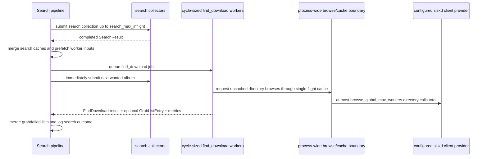

# fix: Parallelize find_download without multiplying browse pressure

## Summary

Decouple search collection from `find_download` by handing completed searches to cycle-sized `find_download` workers while the search pipeline immediately refills search slots. The implementation freezes worker inputs, introduces one process-wide browse/cache coordination boundary, and gives worker threads configured slskd clients so 32 browse workers do not churn a default 10-connection pool.

---

## Problem Frame

Issue #217 shows the search pipeline idling while the main thread runs `find_download` synchronously after each completed search. The wider search surface introduced by the #198/#213 arc makes each `find_download` call much heavier than it was in the older serial design, so the main-thread handoff point has become the current throughput gate.

---

## Requirements

- R1. Successful search completions queue `find_download` work and refill search slots without waiting for browse, match, or enqueue to finish. (Origin R1-R4, F1, AE1)
- R2. Active `find_download` jobs are not limited by a new configuration knob; the cycle batch size is the natural ceiling. (Origin R4)
- R3. Browse capacity is global across all active `find_download` jobs, with the existing default capacity of 32 preserved. (Origin R5-R8, F2, AE2, AE3)
- R4. The slskd HTTP connection pool is sized from browse capacity plus headroom and backpressures instead of discarding excess localhost connections. (Origin R9-R12, AE4)
- R5. Workers isolate per-album matching state and return mergeable results; final collections and search-log outcomes remain owned by the search pipeline. (Origin R13-R17, F3, AE5)
- R6. Cycle observability distinguishes search collection, `find_download` queue/drain behavior, browse time, and local match/scoring time. (Origin R18-R20)

**Origin actors:** A1 search pipeline, A2 `find_download` worker, A3 browse coordinator, A4 slskd HTTP client, A5 operator.

**Origin flows:** F1 search completion handoff, F2 concurrent `find_download` jobs share browse capacity, F3 completed `find_download` results are merged and logged.

**Origin acceptance examples:** AE1-AE5.

---

## Scope Boundaries

- Do not reintroduce per-cycle gates, browse-wave deadlines, search-poll wall-clock caps, or other deadline mechanisms rolled back during #198/#213.
- Do not reduce `search_response_limit`, `search_file_limit`, search ladder breadth, or matching strictness to hide the larger candidate surface.
- Do not tune search-side in-flight depth beyond preserving existing `search_max_inflight` semantics.
- Do not add a separate `find_download_concurrency` configuration knob.
- Do not split candidate selection from transfer enqueue; enqueue remains inside `find_download` for this issue.
- Do not make broad pipeline DB, import, or download polling refactors beyond the ownership changes needed to make `find_download` safe to run concurrently.

### Deferred to Follow-Up Work

- Search-side in-flight tuning above 4: measure only after `find_download` no longer blocks search-slot refill.
- Persisted cache storage changes such as Redis or DB-backed folder cache: tracked separately from #217.
- SignalR or push-based slskd search state collection: unrelated to `find_download` serialization.

---

## Context & Research

### Relevant Code and Patterns

- `cratedigger.py`: `_search_and_queue_parallel` currently merges each successful search, calls `find_download` inline, applies/logs the result, and only then submits the next search.
- `lib/enqueue.py`: `find_download`, `_try_filetype`, `try_enqueue`, `try_multi_enqueue`, and `_iter_wave_matches` contain the browse/match/enqueue path. Today `FindDownloadResult` carries outcome and candidates while `grab_list` is mutated through a caller-owned dictionary.
- `lib/browse.py`: `_fanout_browse_users` creates a new `ThreadPoolExecutor` for each wave, so concurrent albums would multiply `browse_global_max_workers` unless the browse boundary changes.
- `lib/matching.py`: `check_for_match` still has a lazy browse fallback and mutates shared `negative_matches`, `folder_cache`, `_folder_cache_ts`, `broken_user`, and timing counters through `ctx`.
- `lib/context.py`: per-cycle state is centralized on `CratediggerContext`; this worked while `find_download` was serial but needs narrower ownership under concurrency.
- `lib/cycle_summary.py`: cycle summary already emits browse, match, search, cache, peer, fan-out, and watchdog counters.
- `lib/download.py`: `slskd_do_enqueue` remains inside `find_download` and polls slskd transfer snapshots after enqueue.
- `album_source.py` and `lib/pipeline_db.py`: `DatabaseSource._get_db()` caches one `PipelineDB` backed by one psycopg connection, so worker threads must not call the main context's pipeline DB source.
- `tests/test_browse.py`: existing concurrency-probe pattern for directory browse caps.
- `tests/test_enqueue_fanout.py`: wave-shape, cached-entry, cooldown/denylist, enqueue-failure, and multi-disc cache-reuse coverage.
- `tests/test_search_max_inflight.py`: existing pipeline-log contract style for search-side in-flight settings.
- `tests/test_integration_slices.py`: end-to-end slices for search result processing, `find_download`, search logging, and watchdog behavior.

### Institutional Learnings

- `docs/plans/2026-05-01-001-feat-browse-fanout-and-pipeline-depth-plan.md`: the top update supersedes the earlier wave-deadline/cycle-budget design. The fan-out primitive survived, but client-side caps starved legitimate work.
- `docs/slskd-internals.md` and `docs/parallel-search.md`: slskd search creation is serialized and active searches queue internally, while browse is not throttled the same way. This plan keeps search submission sequential and browse separately bounded.
- `docs/solutions/architecture/multiplexed-postgres-client-and-set-local-incompatibility.md`: shared clients and session-scoped state need clear ownership; pools reduce blast radius only when their sizing and use are explicit.
- `docs/solutions/testing/mocked-contract-tests-miss-helper-mirror-integration-bugs.md`: helper-level tests need at least one cross-layer slice for confidence when the changed behavior is a helper/service integration.

### External References

- No web research used. Local package inspection showed `slskd-api` constructs one shared `requests.Session` with adapters that do not override requests' default pool size of 10. The API objects expose that session, so cratedigger can configure adapters without forking the package, but the implementation must still define thread ownership for slskd client instances.

---

## Key Technical Decisions

- Cycle-sized `find_download` executor: use the current cycle's album count as the executor capacity rather than introducing a new `find_download_concurrency` knob. Guard the empty-album case so no executor is created with zero workers.
- Main-thread result merge: `find_download` workers return result objects that the search pipeline merges. This preserves ownership of `grab_list`, failure lists, search logging, and candidate forensics.
- Frozen worker input: each `find_download` worker receives a snapshot of the album's search results, upload speeds, directory audio counts, tracks, denied users, cooled-down users, album metadata, and per-album negative/broken-user state. Workers must not read live `ctx.search_cache`, `ctx.user_upload_speed`, `ctx.search_dir_audio_count`, `ctx.negative_matches`, `ctx.current_album_cache`, or the main pipeline DB source.
- Mandatory DB prefetch or explicit thread ownership: tracks and denied users should be prefetched on the owner thread before queueing work. If implementation cannot avoid worker DB reads, the worker must receive an explicit fresh DB/thread-local factory that closes after use; it must not call the main `ctx.pipeline_db_source._get_db()`.
- Process-wide browse/cache boundary: route both primary fan-out and lazy fallback browsing through the same process-scoped browse coordinator or equivalent shared boundary, so total directory calls honor `browse_global_max_workers` across every `find_download` path in the process.
- Single-flight directory browse: the browse/cache boundary must deduplicate simultaneous cold misses for the same `(user, dir)` so follower workers reuse the first in-flight browse instead of issuing duplicate slskd calls.
- slskd client ownership is explicit: use a small provider/boundary for configured slskd clients rather than casually sharing one mutable `requests.Session` across all worker roles. Thread-local configured clients are preferred if package behavior permits; otherwise the plan must introduce an explicit locked/shared-client contract and capacity semaphores.
- HTTP capacity follows concurrency: configured HTTP capacity must be at least `browse_global_max_workers + search_max_inflight + page_size + phase1/admin slack`. Use blocking behavior plus observable wait/backpressure logging so overload becomes visible rather than just quiet.
- Concurrent enqueue stays in `find_download`: transfer enqueue is not serialized separately unless production evidence later shows it needs its own limiter.
- Side-effect-aware enqueue failures: after slskd accepts an enqueue, later polling/reconciliation errors must not leave untracked transfers behind. Workers must either return enough partial transfer information for the owner to track/reconcile, or cancel/reconcile before logging a failure.

---

## Open Questions

### Resolved During Planning

- Should `find_download` get a separate concurrency knob? No. Active work is capped by cycle batch size; browse pressure is capped globally.
- Should enqueue be serialized outside `find_download`? No. It remains concurrent inside the worker path for this issue.
- Should browse capacity drop from 32 to requests' default pool size of 10? No. Keep capacity at 32 and size the HTTP pool to match.

### Deferred to Implementation

- Exact shape of the browse/cache boundary internals: a dedicated coordinator object, locks around existing maps, or a hybrid wrapper can be chosen during implementation, as long as it is process-scoped, single-flights duplicate cold misses, and preserves persisted cache writes.
- Final names of worker result/state helper types: choose names that fit local conventions once the refactor touches real call sites.

---

## High-Level Technical Design

> *This illustrates the intended approach and is directional guidance for review, not implementation specification. The implementing agent should treat it as context, not code to reproduce.*

The important ordering is search refill before `find_download` completion. The important resource bound is total browse calls, not number of albums currently in `find_download`, and duplicate workers asking for the same cold directory should share one browse.

---

## Implementation Units

- U1. **Configure slskd client ownership and HTTP capacity**

**Goal:** Remove the mismatch between 32 browse workers and requests' default 10-connection pool while making slskd client/session ownership explicit for worker threads.

**Requirements:** R4

**Dependencies:** None

**Files:**
- Modify: `cratedigger.py`
- Create: `lib/slskd_client.py`
- Test: `tests/test_slskd_http_pool.py`

**Approach:**
- Add a small local provider/helper that creates or configures slskd clients with adapters sized from existing config values rather than adding a user-facing knob.
- Prefer thread-local configured slskd clients for worker threads if package behavior permits; otherwise define an explicit shared-client ownership contract with capacity semaphores for browse and transfer calls.
- Configure HTTP capacity with a deterministic lower bound: `browse_global_max_workers + search_max_inflight + page_size + phase1/admin slack`.
- Use blocking pool behavior so accidental over-subscription waits instead of creating and discarding excess localhost connections.
- Make real-client configuration mandatory in production: fake-client tolerance is acceptable for tests, but failure to configure an actual `SlskdClient` should log loudly enough to fail deployment verification.
- Expose or log configured HTTP capacity and any observable wait/backpressure signal so warning absence is not the only health check.

**Execution note:** Implement test-first with a fake requests session/adapter surface before wiring the helper into startup.

**Patterns to follow:**
- `lib/config.py` parse-time clamping for existing concurrency knobs.
- `cratedigger.py` startup checks that log operator-visible configuration issues without preventing healthy startup.

**Test scenarios:**
- Happy path: given `browse_global_max_workers=32`, `search_max_inflight=4`, and `page_size=10`, configuring a fake slskd client sets HTTP and HTTPS capacity to at least browse capacity plus deterministic headroom.
- Contract: given the installed `slskd_api.SlskdClient` shape, the helper discovers and configures the real requests session without making network calls.
- Happy path: configured adapters use blocking behavior, not only a larger pool size.
- Edge case: given a fake slskd client with no accessible requests session, configuration returns without crashing and emits a diagnostic log.
- Edge case: given `browse_global_max_workers=1`, the derived pool size remains at least one plus headroom.
- Integration: several found workers can enter transfer enqueue polling concurrently without starving browse/search client capacity in the test harness.
- Integration: startup path constructs the slskd client and invokes the pool configuration helper exactly once.

**Verification:**
- Local tests prove adapter sizing is derived from config and applied to the real installed client shape.
- Production verification should show the configured HTTP capacity in logs and no repeated `Connection pool is full, discarding connection` warnings during normal fan-out cycles after deploy.

---

- U2. **Make find_download return mergeable results**

**Goal:** Stop `find_download` from mutating final cycle collections so workers can run independently and main-thread merge remains authoritative.

**Requirements:** R5

**Dependencies:** None

**Files:**
- Modify: `lib/enqueue.py`
- Modify: `cratedigger.py`
- Test: `tests/test_grab_list.py`
- Test: `tests/test_integration.py`
- Test: `tests/test_integration_slices.py`

**Approach:**
- Widen the `FindDownloadResult` concept so a found result carries the `GrabListEntry` it produced instead of writing directly into the caller's `grab_list`.
- Preserve existing candidate-forensics behavior: `_apply_find_download_result` still copies candidates to the corresponding `SearchResult`.
- Keep the serial path behavior equivalent by merging the returned entry into `grab_list` at the call site.
- Update existing tests that assert `find_download` output shape and `_apply_find_download_result` mapping.

**Execution note:** Add characterization tests around current serial behavior before changing ownership. The first green state should preserve behavior without enabling concurrency yet.

**Patterns to follow:**
- `lib.grab_list.GrabListEntry` construction in `_try_filetype`.
- Existing `_apply_find_download_result` seam in `cratedigger.py`.

**Test scenarios:**
- Happy path: a found single-disc album returns a result containing a `GrabListEntry`, and the caller merges it into `grab_list`.
- Happy path: a found multi-disc album returns one merged `GrabListEntry` with all disk metadata preserved.
- Error path: enqueue failure returns the same outcome and candidates as before, with no partial `grab_list` write.
- Error path: if slskd accepts an enqueue but later transfer-ID reconciliation fails or raises, the result is side-effect-aware: it either returns trackable partial transfer information or cancels/reconciles before the owner logs failure.
- Integration: existing search-forensics slice still logs top candidates after the ownership change.

**Verification:**
- Serial `search_and_queue` behavior remains unchanged from the caller's perspective.
- No feature-bearing path depends on `find_download` writing directly to an external dict.
- Post-enqueue failures cannot silently orphan untracked transfers that would be duplicated on a later search.

---

- U3. **Isolate worker-local album and match state**

**Goal:** Remove shared per-album mutable state from the `find_download` path before enabling concurrent workers.

**Requirements:** R5

**Dependencies:** U2

**Files:**
- Modify: `lib/enqueue.py`
- Modify: `lib/matching.py`
- Modify: `lib/context.py`
- Test: `tests/test_matching.py`
- Test: `tests/test_enqueue_fanout.py`
- Test: `tests/test_integration_slices.py`

**Approach:**
- Introduce a frozen worker input/view for everything a `find_download` job is allowed to observe from the search pipeline.
- Snapshot the album's search-result entries, upload speeds, directory audio counts, album metadata, tracks, denied users, cooled-down users, search override settings, and per-album negative/broken-user state before queueing work.
- Workers must not read live `ctx.search_cache`, `ctx.user_upload_speed`, `ctx.search_dir_audio_count`, `ctx.negative_matches`, `ctx.current_album_cache`, or the main `ctx.pipeline_db_source`.
- Prefetch track and denylist data on the owner thread by default. A worker-owned DB path is allowed only if it receives an explicit fresh DB/thread-local factory and closes it after use.
- Treat `broken_user` as album-local match state rather than shared global state unless implementation proves a more precise keyed error record is safe.
- Keep shared read-only config and configured slskd client access available through a lightweight worker view.
- Preserve cooldown and denylist filtering semantics from the worker snapshot.
- Move worker-local browse/match/peer/fanout metric accumulation into this boundary so enabling concurrent workers later does not introduce concurrent writes to shared counters.

**Execution note:** Treat this as a behavior-preserving refactor; add concurrency-shaped tests even before the pipeline starts running jobs in parallel.

**Patterns to follow:**
- Existing small dataclasses in `lib/enqueue.py` for return shapes.
- `main()` Phase 1 pattern where a separate DB source is used when work crosses threads.

**Test scenarios:**
- Happy path: two independent worker inputs can evaluate different albums without clearing each other's negative matches or broken-user state.
- Edge case: multi-disc matching still clears negative matches per disc within one album without affecting another album.
- Edge case: denied users, cooled-down users, upload-speed ranking, and directory audio-count prefilters are applied from worker-owned snapshots.
- Edge case: mutating the main context's search cache, upload speeds, dir counts, cooldowns, or denied users after worker submission does not change that worker's result.
- Error path: one album's browse failure for a user does not cause another concurrent album to skip a successful directory from that same user.
- Error path: a spy main pipeline DB source fails the test if a worker calls `_get_db()` through the shared source.
- Integration: two `find_download` calls run concurrently in a test harness and produce independent candidate lists/outcomes.
- Metrics: worker-local browse/match/fanout counters are returned for owner-thread merge and are not written directly to shared context fields.

**Verification:**
- No concurrent worker path mutates `ctx.negative_matches`, `ctx.broken_user`, or relies on `ctx.current_album_cache` for album lookup.
- DB-backed track and denylist data are prefetched on the main thread unless an explicit fresh DB/thread-local factory is passed to and closed by the worker.
- Worker metrics are mergeable data, not direct shared-counter mutation.

---

- U4. **Introduce a true global browse/cache boundary**

**Goal:** Make `browse_global_max_workers=32` mean 32 total directory browse calls across all active `find_download` jobs in the process, with single-flight reuse for duplicate cold directory misses.

**Requirements:** R3, R5

**Dependencies:** U3

**Files:**
- Modify: `lib/browse.py`
- Modify: `lib/enqueue.py`
- Modify: `lib/matching.py`
- Modify: `lib/context.py`
- Test: `tests/test_browse.py`
- Test: `tests/test_enqueue_fanout.py`
- Test: `tests/test_integration_slices.py`

**Approach:**
- Replace per-wave executor ownership with a process-wide/shared-context browse/cache boundary used by every `find_download` path in the process.
- Route primary fan-out and lazy fallback directory browse through the same boundary.
- Protect shared directory cache, cache timestamps, in-flight browse registry, and browse counters through that boundary.
- Implement single-flight behavior keyed by `(user, dir)`: one worker reserves and performs a cold browse while followers wait for and reuse the same result.
- Write successful browse results and timestamps into the existing cache structures that `lib/cache.py` persists, not worker-local copies.
- Keep album-level broken-user/negative-match decisions worker-local; the shared boundary may record per-directory browse errors only if those records cannot cause unrelated albums to false no-match.
- Preserve existing top-K/lazy-tail behavior and cached-entry skipping.
- Keep browse exceptions isolated to the relevant user/dir and preserve broken-user semantics.

**Execution note:** Start with a failing concurrency-cap test using the existing `FakeSlskdUsers.in_flight_probe`.

**Patterns to follow:**
- `tests/test_browse.py` in-flight probe for verifying concurrency caps.
- Existing pre-created bucket invariant from `_fanout_browse_users`, but generalized beyond one wave call.

**Test scenarios:**
- Covers AE2. Given multiple concurrent album jobs with cold directories, peak fake slskd directory calls never exceeds `browse_global_max_workers`.
- Covers AE3. Given two jobs request the same uncached user/dir concurrently, fake slskd receives one directory call and both jobs observe the shared result.
- Covers AE3. Given two jobs request the same uncached user/dir and the first browse fails, the failure does not create a shared album-level broken-user decision that prevents a later successful browse path for another album.
- Happy path: cached entries are skipped from browse work under concurrent jobs.
- Happy path: concurrent browse writes land in the existing `folder_cache` and `_folder_cache_ts` maps so the normal persisted cache save path can write them.
- Error path: one user's browse exceptions do not poison unrelated users or albums.
- Edge case: lazy fallback browse uses the same global capacity as wave fan-out.

**Verification:**
- The old per-wave fan-out tests still pass.
- New cross-album tests prove the cap is global, not multiplied by active albums.
- Cache persistence tests or integration checks prove concurrent browse results remain visible to the existing save/load path.

---

- U5. **Decouple search futures from find_download futures**

**Goal:** Rework `_search_and_queue_parallel` so completed searches queue `find_download` jobs and refill search slots immediately, then drain `find_download` results for merge/logging.

**Requirements:** R1, R2, R5

**Dependencies:** U2, U3, U4

**Files:**
- Modify: `cratedigger.py`
- Test: `tests/test_search_max_inflight.py`
- Test: `tests/test_integration_slices.py`

**Approach:**
- Maintain separate collections for search futures and `find_download` futures.
- On successful search completion, merge search-result cache data needed for ranking/forensics, prepare worker inputs, queue a `find_download` job, and submit the next search before waiting for that job.
- Use a cycle-sized executor for `find_download` jobs so there is no separate user-facing concurrency cap.
- Keep `_log_search_result` on the owner path after the corresponding `find_download` result has produced the final outcome.
- Preserve inline handling for non-search cases such as empty query, search error, or exhausted variant ladder.
- Do not create a `find_download` executor when there are no albums or no successful searches that need it.
- Record search collection timing separately from find-drain timing; search collection ends when the last search future completes, not when all find jobs drain.
- Merge worker-local metric bundles on the owner path exactly once when each find future completes.

**Execution note:** Add a RED orchestration test for the #217 failure shape: a blocked `find_download` must not prevent the next search submission.

**Patterns to follow:**
- Existing `_search_and_queue_parallel` submit/collect/refill loop.
- `tests/test_search_max_inflight.py` log-based contract style.

**Test scenarios:**
- Covers AE1. Given one completed search and a blocked `find_download`, the next search is submitted before the blocked job returns.
- Happy path: found, no-match, no-results, exhausted, empty-query, and search-error outcomes land in the same returned `grab_list`, `failed_search`, and `failed_grab` categories as before.
- Error path: a `find_download` worker exception logs an error for that album, records a safe search outcome, and does not kill unrelated in-flight search or find jobs.
- Error path: a post-enqueue worker failure returns side-effect-aware data or performs cleanup so no untracked transfer continues silently.
- Edge case: no successful searches means the find executor drains no jobs and the function returns promptly.
- Edge case: empty album input does not create an executor with zero workers.
- Metrics: blocked `find_download` drain does not continue increasing `search_time_s` after search collection is complete.
- Integration: a cycle with several successful searches shows overlapping find jobs and final search logs tied to the correct album/request.

**Verification:**
- Search slots are refilled independently from `find_download` completion.
- Existing search-result logging semantics and return shape remain compatible with `grab_most_wanted`.

---

- U6. **Expose find_download drain observability**

**Goal:** Keep cycle logs useful under concurrency and add just enough evidence to verify the new handoff behavior in production.

**Requirements:** R6

**Dependencies:** U4, U5

**Files:**
- Modify: `lib/context.py`
- Modify: `lib/cycle_summary.py`
- Modify: `lib/browse.py`
- Modify: `lib/matching.py`
- Modify: `cratedigger.py`
- Test: `tests/test_cycle_summary.py`
- Test: `tests/test_cycle_watchdog_counter.py`
- Test: `tests/test_integration_slices.py`

**Approach:**
- Add compact cycle-summary fields for `find_download` queued/completed/drain timing if they materially help distinguish search collection from find drain.
- Preserve existing summary field names so current journal queries remain useful.
- Define timing semantics explicitly: search collection wall time excludes find-drain wait; find drain wall time covers queued-to-drained find work; summed worker browse/match times are cumulative worker seconds.
- Log enough lifecycle evidence to show search refill happens while previous find jobs are still active, without adding noisy per-directory logs.

**Patterns to follow:**
- `lib/cycle_summary.py` key=value summary style.
- Existing watchdog counter merge via `_log_search_result`.

**Test scenarios:**
- Happy path: cycle summary includes existing browse/match/search/cache/watchdog fields after the new fields are added.
- Happy path: a worker-local metric bundle from U3/U5 appears in context totals exactly once per completed `find_download` job.
- Edge case: a worker exception still contributes any available timing and does not double-count.
- Edge case: `search_time_s` does not include blocked find-drain wait after the last search future completes.
- Integration: an orchestration test can assert find queued/completed evidence without scraping order-dependent logs.

**Verification:**
- Cycle summary remains grep-friendly.
- Production validation can compare `search_time_s`, browse/match totals, and new find-drain fields for #217-shaped cycles.

---

- U7. **End-to-end regression and production verification**

**Goal:** Prove the changed pipeline preserves acquisition behavior while removing the #217 serialization bottleneck.

**Requirements:** R1-R6

**Dependencies:** U1, U2, U3, U4, U5, U6

**Files:**
- Modify: `tests/test_integration_slices.py`
- Modify: `tests/test_slskd_live.py`

**Approach:**
- Add or extend an integration slice that exercises search completion, concurrent `find_download`, candidate forensics, and final search logging together.
- Add live slskd coverage only where it can validate behavior fakes cannot prove, especially HTTP pool/backpressure and browse concurrency assumptions.

**Patterns to follow:**
- Existing env-gated live slskd tests in `tests/test_slskd_live.py`.
- Existing issue-specific integration slices in `tests/test_integration_slices.py`.

**Test scenarios:**
- Integration: several fake searches complete quickly, several find jobs overlap, final returned `grab_list` and search logs map to the correct albums.
- Integration: a no-match-heavy cycle drains all find jobs and leaves requests in the same failure categories as before.
- Error path: one find job fails while other search/find jobs complete normally.
- Error path: enqueue accepted followed by transfer polling failure leaves no orphaned untracked transfer and no duplicate future enqueue path.
- Live/env-gated: configured HTTP pool size avoids repeated connection-pool churn during a controlled burst of browse calls.

**Verification:**
- Targeted unit and integration tests pass.
- Full suite and pyright pass before merge.
- Post-deploy journal review confirms search slots refill while find jobs drain and connection-pool warnings are absent or rare enough to investigate as exceptions.

---

## System-Wide Impact

- **Interaction graph:** `grab_most_wanted` remains the owner of persistence after `search_and_queue` returns. `search_and_queue` still returns `grab_list`, `failed_search`, and `failed_grab`, but the parallel path internally drains both search and find futures before returning.
- **Error propagation:** Search collection errors remain search failures. `find_download` errors become album-local enqueue/match failures and must not cancel unrelated search or find futures. Post-enqueue failures are handled specially because slskd may already have accepted transfers.
- **State lifecycle risks:** `folder_cache` is intentionally shared and persisted, but per-album negative matches are not. Worker result merging must be exactly-once to avoid duplicate downloads or duplicate failure accounting.
- **API surface parity:** The serial `search_and_queue` path should either reuse the new result merge behavior or stay behaviorally equivalent. CLI/web request status flows should not observe a different contract.
- **Integration coverage:** Unit tests can prove concurrency caps and ownership seams; integration slices are required to prove search logging, candidate forensics, and `grab_list` return behavior remain coherent together.
- **Unchanged invariants:** Search POST submission stays sequential; search ladder, response/file limits, strict matching, cooldowns, denylist filtering, and download polling semantics remain unchanged.

---

## Risks & Dependencies

| Risk | Mitigation |
|------|------------|
| Shared mutable state race creates wrong candidates or duplicate downloads | Move per-album state worker-local; main thread merges final collections; shared cache access goes through one boundary with tests. |
| Browse capacity is accidentally multiplied by active albums | Add cross-album concurrency tests using fake slskd in-flight probes; route lazy fallback and fan-out through the same boundary. |
| HTTP pool sizing removes warnings but hides overload by blocking in an unexpected path | Use a deterministic lower-bound formula, log configured capacity/backpressure, and validate with targeted tests plus production journal review. |
| Shared slskd client session behaves poorly under threaded use | Prefer thread-local configured clients through a provider; otherwise add an explicit shared-client contract with capacity semaphores and tests against the real package shape. |
| Worker thread shares non-thread-safe DB connection | Prefetch track and denylist data before queueing work; if impossible, pass an explicit fresh DB/thread-local factory and test that workers do not call the main source. |
| Refactor changes search-log outcomes or candidate forensics | Keep `_apply_find_download_result` and `_log_search_result` as owner-path seams; extend existing integration slices. |
| Concurrent enqueue creates slskd transfer contention or orphaned transfers | Keep enqueue concurrent per requirements, make post-enqueue failures side-effect-aware, and observe transfer enqueue failures/import throughput after deploy. |

---

## Documentation / Operational Notes

- Update issue #217 or the PR body with before/after cycle traces showing search refill behavior and connection-pool warning status.
- Post-deploy verification should inspect `journalctl -u cratedigger` for cycle summary fields, connection-pool warnings, search throughput, and download/import outcomes.
- Conditional docs: update `docs/slskd-internals.md` only if implementation or verification changes the documented understanding of slskd/client concurrency behavior.
- If slskd HTTP pool sizing requires changing the local `slskd-api` package rather than configuring clients externally, document the reason and keep the package patch scoped.

---

## Sources & References

- **Origin document:** [docs/brainstorms/find-download-concurrency-requirements.md](../brainstorms/find-download-concurrency-requirements.md)
- Related issue: #217
- Related context: #198, #213
- Related docs: `docs/slskd-internals.md`, `docs/parallel-search.md`
- Related plans: `docs/plans/2026-05-01-001-feat-browse-fanout-and-pipeline-depth-plan.md`, `docs/plans/2026-05-04-001-fix-search-watchdog-and-cycle-gate-removal-plan.md`
- Related learnings: `docs/solutions/architecture/multiplexed-postgres-client-and-set-local-incompatibility.md`, `docs/solutions/testing/mocked-contract-tests-miss-helper-mirror-integration-bugs.md`
