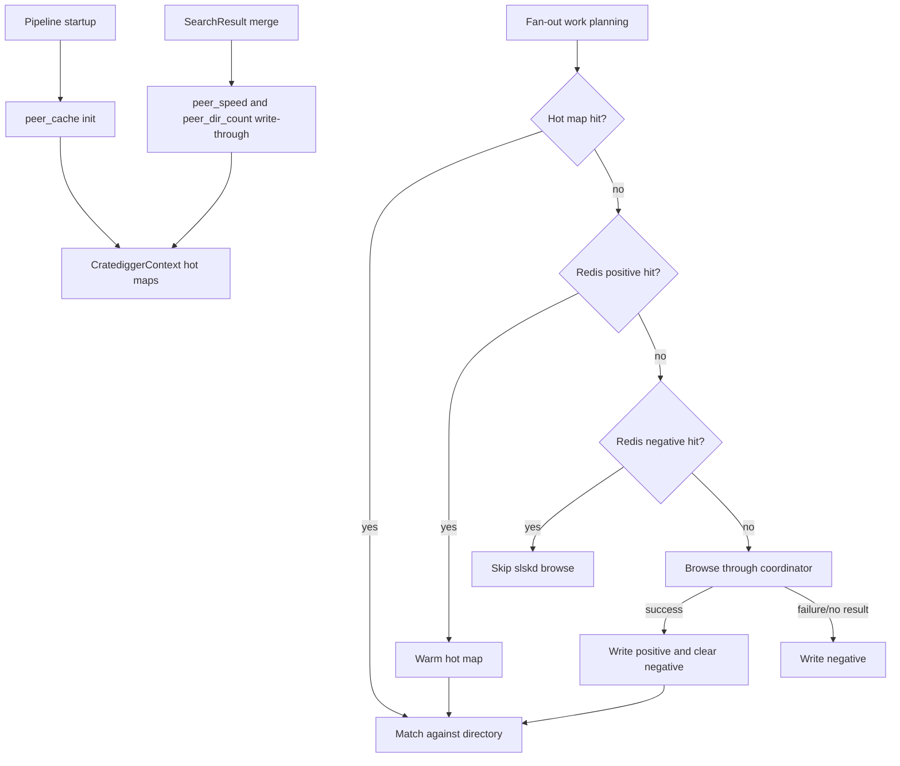
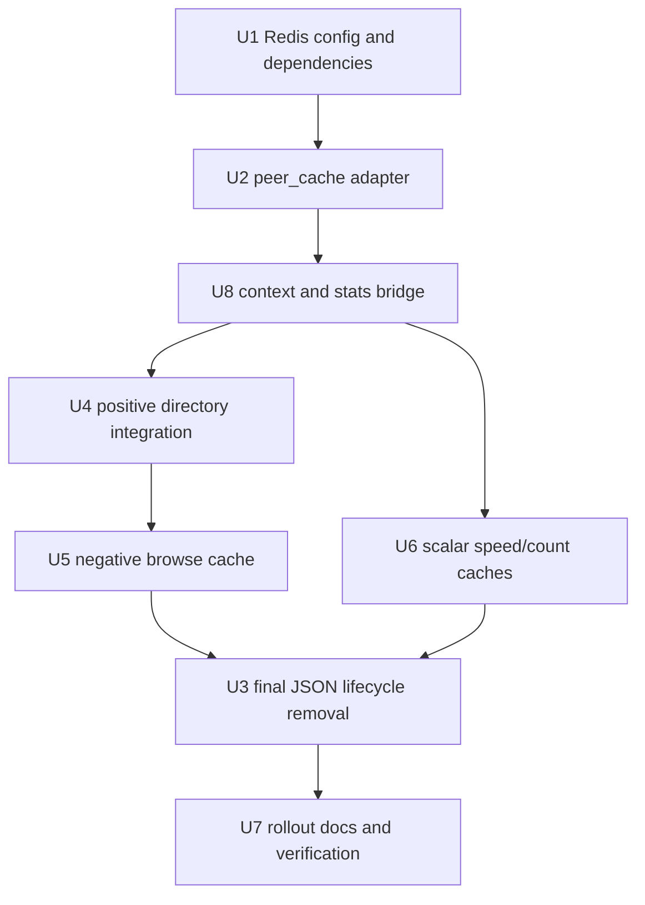
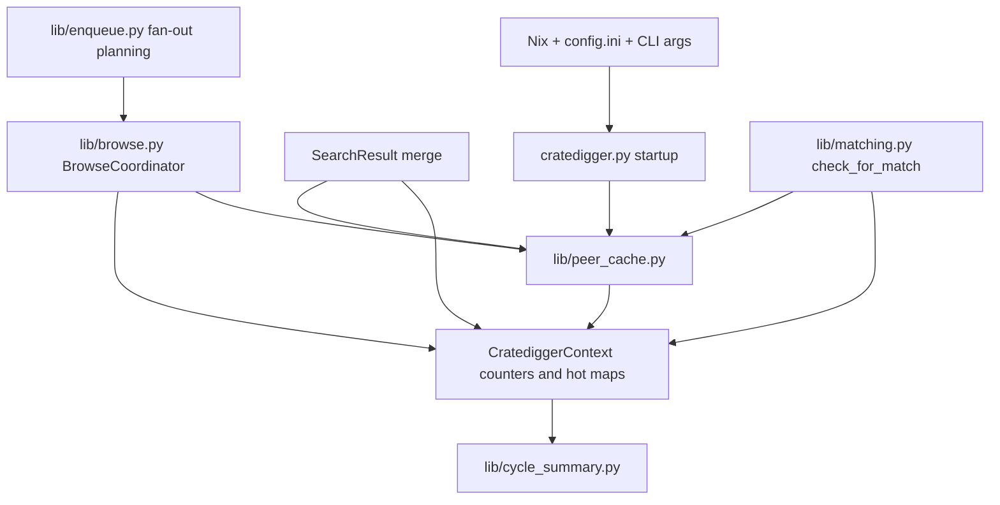

# feat: Migrate peer cache to Redis

## Summary

Replace the JSON-backed peer caches with a Redis-backed pipeline peer cache backed by an app-owned local Redis instance in normal Nix deployments. The implementation keeps the existing per-cycle hot browse maps and coordinator invariants, adds Redis persistence for positive and negative `(user, dir)` state plus scalar peer metadata, and removes the startup/shutdown JSON load/save path while keeping runtime Redis failures fail-soft.

---

## Problem Frame

`lib/cache.py` currently reads and writes all persisted peer cache state through one JSON file, producing a large startup parse cost and making negative browse caching impractical. Issue #201 reframes Redis as the right storage shape because the dominant win is no longer just avoiding JSON load time: it is remembering confirmed empty `(user, dir)` browse responses so the pipeline stops re-issuing known-dead directories every cycle.

---

## Requirements

- R1. Move all three persisted caches to Redis: `folder_cache`, `user_upload_speed`, and `search_dir_audio_count`. The runtime no longer reads or writes `/var/lib/cratedigger/cratedigger_cache.json`. (Origin R1, R21, AE1)
- R2. Delete the JSON cache lifecycle: `lib/cache.py`, `save_caches`, `load_caches`, per-entry timestamp wrapping, and `cache_load_s` summary telemetry are removed. (Origin R2, AE1)
- R3. Add a separate pipeline cache module, `lib/peer_cache.py`, using the fail-safe Redis pattern from `web/cache.py` without sharing its text/JSON client or mutable state. (Origin R3, R12-R14, R16)
- R4. Use Redis namespaces `peer_dir:{user}:{dir}`, `peer_dir_neg:{user}:{dir}`, `peer_speed:{user}`, and `peer_dir_count:{user}:{dir}` for the primary migration. (Origin R4)
- R5. Store structured directory payloads as msgpack-encoded, zstd-compressed bytes behind the `lib/peer_cache.py` boundary; callers receive typed Python values. Store scalar speed/count values as plain integers. (Origin R5, AE4)
- R6. Use server-side Redis TTLs: 7 days for positive directory and directory-count entries, 7 days for negative browse entries, and 24 hours for upload speeds. (Origin R6-R8, AE5, AE6)
- R7. Preserve the existing in-process browse/cache coordination boundary so concurrent `find_download` jobs still share hot results and single-flight cold browses within a cycle. Redis replaces cross-cycle persistence, not the process-local fan-out invariant. (Origin R1, R9, relationship to #198/#217)
- R8. Add persistent negative-cache behavior only for confirmed empty browse results. Broad slskd/API exceptions and local transport failures remain non-cacheable so transient outages do not poison Redis. Semantic matching negatives remain in `ctx.negative_matches` and must not write `peer_dir_neg`. (Origin R9-R11, AE2, AE7)
- R9. Positive directory writes clear stale negatives for the same `(user, dir)`. Negative hits skip slskd browse submission entirely. (Origin R9-R10, AE2)
- R10. Redis is expected for normal pipeline performance but remains fail-soft: Redis connection, timeout, or command failures degrade to cold-cache misses/no-op writes and do not fail the cycle. Use a 200 ms Redis connect timeout, a 100 ms operation timeout, and a cycle/init-scoped availability fuse so repeated Redis outage does not create per-key timeout storms. (Origin R12-R14, AE3)
- R11. Cycle summary telemetry reports `cache_pos_hits=N cache_neg_hits=N cache_misses=N cache_errors=N cache_fuse_tripped=N cache_write_errors=N` counters for the peer-cache namespaces and removes `cache_load_s`. (Origin R15, AE1-AE3)
- R12. Wire Redis host/port, operation timeouts, and peer-cache TTLs through `CratediggerConfig`, the pipeline startup path, rendered Nix `config.ini`, and the NixOS module. For normal deployments, the NixOS module owns and enables a local Redis server for cratedigger. (Origin R17-R20, AE5)
- R13. Configure the app-owned Redis instance with bounded memory and `allkeys-lru`; keep host/port override hooks only for development or exceptional manual deployments, not as a parallel ownership mode. (Origin R19-R20)
- R14. First deploy is a cold Redis start. The legacy JSON file is left on disk but is only a rollback safety net after code rollback; the new code does not read it. (Origin R21-R22, AE1)

**Origin acceptance examples:** AE1-AE7.

---

## Scope Boundaries

- Do not add a JSON-to-Redis bootstrap or migration script.
- Do not delete the existing `cratedigger_cache.json` file during deploy.
- Do not add web UI cache-inspection endpoints.
- Do not cache slskd search responses.
- Do not merge persistent browse-failure negatives with semantic `ctx.negative_matches`.
- Do not remove the process-local hot `ctx.folder_cache`/browse coordinator behavior required by current fan-out and `find_download` concurrency.

### Deferred to Follow-Up Work

- `peer_info:{user}` for slskd `users.info`: repo research found no current pipeline-side `users.info` call under `cratedigger.py` or `lib/`, so adding this now would create a new fetch path rather than caching an existing one.
- `beets_release:{mb_release_id}` for Beets release-presence lookups: real call sites exist, but they are spread across import/download/web flows and are not required for the peer browse-cache migration. Plan separately so identity semantics for MusicBrainz UUIDs and Discogs numerics stay explicit.
- MB mirror pipeline lookups through `web/cache.py` `meta:`: repo research found direct MB mirror use primarily in `scripts/pipeline_cli.py` and web routes, not the core pipeline loop. Keep this out of the peer-cache migration; if implementation discovers a real core-pipeline call site, record a follow-up rather than pulling it into this migration.

---

## Context & Research

### Relevant Code and Patterns

- `lib/cache.py`: current JSON persistence for `folder_cache`, `user_upload_speed`, and `search_dir_audio_count`; target for deletion.
- `web/cache.py`: fail-soft Redis init/get/set pattern, but uses JSON and `decode_responses=True`, so it is not suitable for compressed binary peer directory payloads.
- `lib/context.py`: owns per-cycle hot maps and timing/counter fields. Remove cache timestamp fields and add peer-cache counters.
- `cratedigger.py`: loads JSON caches after context creation and saves them in `finally`; `_merge_search_result` currently writes upload speeds and dir audio counts into context maps with max semantics.
- `lib/browse.py`: `BrowseCoordinator` owns in-process browse single-flight and writes successful directory results into `ctx.folder_cache`.
- `lib/enqueue.py`: `_eligible_user_dirs` ranks by `ctx.user_upload_speed`, applies cooldown/denylist before matching, and `_iter_wave_matches` builds fan-out work from uncached `(user, dir)` pairs.
- `lib/matching.py`: `check_for_match` uses `ctx.search_dir_audio_count` for the cheap sub-count prefilter and `ctx.negative_matches` for album/filetype/track-count semantic negatives.
- `lib/cycle_summary.py`: emits `cache_load_s` today; will emit peer-cache hit/miss/error counters instead.
- `nix/module.nix`: currently passes Redis only to `cratedigger-web`, documents Redis as caller-provided, and renders search/config settings into `config.ini`; this plan changes that posture so the module owns a local Redis server for this app by default.
- `nix/package.nix` and `nix/shell.nix`: production/test Python environments include `msgspec` and `redis` but not `zstandard` or fakeredis-style test support.
- `tests/test_web_cache.py`: has a minimal fake Redis pattern that can inform peer-cache unit tests without sharing web-cache semantics.
- `tests/test_browse.py`, `tests/test_enqueue_fanout.py`, and `tests/test_matching.py`: pin browse fan-out, hot-cache reuse, and matching semantics that must survive the storage migration.
- `tests/test_config.py`, `tests/test_nix_module.py`, and `nix/tests/module-vm.nix`: natural homes for config and Nix option/rendering contracts.

### Institutional Learnings

- `docs/solutions/deployment/runtimemaxsec-vs-type-oneshot-systemd-incompatibility.md`: Nix/systemd directives need semantic verification, not just source matching. The Redis server ownership and memory-policy contract should be verified in module tests and deploy logs.
- `docs/solutions/testing/mocked-contract-tests-miss-helper-mirror-integration-bugs.md`: mocked boundaries miss helper-to-service behavior. Add at least one cross-layer slice proving browse fan-out, peer cache, and matching interact correctly.
- `docs/plans/2026-05-01-001-feat-browse-fanout-and-pipeline-depth-plan.md`: current fan-out behavior intentionally removed client-side wave deadlines; this migration must not reintroduce cycle-starving browse caps.
- `docs/plans/2026-05-04-002-fix-find-download-concurrency-plan.md`: concurrent `find_download` relies on a process-wide browse/cache boundary and shared hot directory map. Redis must not break that concurrency contract.

### External References

- No external web research used. Local code patterns and the origin brainstorm provide enough Redis/client guidance for this migration.

---

## Key Technical Decisions

- Redis is app-owned but fail-soft: normal Nix deployments should enable a local Redis server for cratedigger automatically, while pipeline code still treats Redis outages as cold cache and continues.
- Keep a process-local L1: `ctx.folder_cache`, `ctx.user_upload_speed`, and `ctx.search_dir_audio_count` remain useful as per-cycle hot maps and worker snapshots. Redis is the backing store across cycles and the place where TTL/eviction lives.
- Binary peer cache client is separate from web cache: `lib/peer_cache.py` uses `decode_responses=False`, msgpack via `msgspec`, and zstd compression via `ps.zstandard` / `import zstandard as zstd` for directory payloads. `web/cache.py` remains JSON/text and is not imported.
- Negative cache means confirmed empty browse result only: `peer_dir_neg:{user}:{dir}` records slskd returning no directory data for that pair. Exceptions, local transport failures, track-count skips, filename-ratio failures, and cross-check failures stay out of Redis.
- Redis outage uses an availability fuse: after init failure or a Redis command timeout/error, the peer-cache layer should avoid repeating expensive per-key timeouts for the rest of the current cycle or startup init window, then retry at the next cycle/init recovery point so a restart can recover cleanly.
- Negative Redis skips are a distinct browse outcome: callers must not encode a negative hit as an empty browse result, because lazy matching currently treats all-empty browse batches as potential broken-user evidence.
- Scalar caches preserve legacy max semantics: current search results remain authoritative for this cycle; Redis fills gaps and carries cross-cycle values, with upload speed ranking using the max of current/stored values within the 24h TTL.
- Peer-cache counters must merge across worker contexts: parallel `find_download` work needs either `FindDownloadMetrics` extensions or a thread-safe peer-cache stats aggregator so the main cycle summary reflects worker cache hits and misses.
- Cycle summary counters cover the four primary peer namespaces only. Future extra namespaces should define their own telemetry if/when planned.
- The Nix module owns local Redis by default: implement one straightforward app-owned server path first. Host/port overrides may remain for dev escape hatches, but the plan does not require a full external-Redis ownership story.

---

## Open Questions

### Resolved During Planning

- Should Redis be optional? Operationally no for our Nix deployment: the module should own and enable it. Runtime code still fail-softs so a Redis outage is visible in startup logs and degraded hit/miss telemetry, not a fatal startup error.
- Should Redis replace the in-memory hot maps? No. The local maps/coordinator stay as a per-cycle L1 to preserve existing fan-out and concurrency behavior.
- Should semantic negatives persist? No. Only confirmed empty browse responses write persistent negatives.
- Should the extra namespaces ship with this migration? No. They are deferred to focused follow-up work; discovered call sites should produce a follow-up plan/issue, not expand this migration.

### Deferred to Implementation

- Exact helper names in `lib/peer_cache.py`: choose names that fit call sites once implementation touches `lib/browse.py`, `lib/enqueue.py`, and `lib/matching.py`.
- Exact batch primitive for Redis scalar reads: implementation may use `mget`, pipelines, or helper-level grouping as long as outage behavior and per-cycle latency are bounded.

## Configuration Surface

The implementation should keep the surface small and app-owned:

| Concern | Proposed surface | Default / contract |
|---------|------------------|--------------------|
| Redis ownership | `services.cratedigger.redis.enable` | `true` when `services.cratedigger.enable = true`; enables a local `services.redis.servers.cratedigger` server. |
| Redis host | Nix `services.cratedigger.redis.host`, config `[Peer Cache] redis_host`, CLI `--redis-host` | `127.0.0.1`; rendered into pipeline and web service config. |
| Redis port | Nix `services.cratedigger.redis.port`, config `[Peer Cache] redis_port`, CLI `--redis-port` | `6379`; service ordering points pipeline/web at the app-owned Redis unit. |
| Redis memory | Nix `services.cratedigger.redis.maxmemory` | `1gb`; rendered as Redis `maxmemory` for the cratedigger server. |
| Redis eviction | Module-owned Redis setting | Fixed `allkeys-lru`. |
| Positive/negative TTL | Nix `services.cratedigger.peerCache.ttlSeconds`, config `[Peer Cache] ttl_seconds` | `604800` seconds for `peer_dir`, `peer_dir_neg`, and `peer_dir_count`. |
| Speed TTL | Nix `services.cratedigger.peerCache.speedTtlSeconds`, config `[Peer Cache] speed_ttl_seconds` | `86400` seconds. |
| Timeouts | Nix/config `redis_connect_timeout_ms`, `redis_operation_timeout_ms` | `200` ms connect, `100` ms operation. |

Implementation may adjust exact Nix option names to match NixOS Redis server constraints, but should preserve the simple contract: cratedigger owns the local Redis server by default, memory/eviction are bounded by the module, and app code still degrades safely if Redis is unavailable.

---

## High-Level Technical Design

> *This illustrates the intended approach and is directional guidance for review, not implementation specification. The implementing agent should treat it as context, not code to reproduce.*

The local hot maps remain the fast coordination layer inside a cycle. Redis is consulted only for keys the current cycle actually touches and owns TTL/eviction across process runs.

---

## Implementation Units

- U1. **Redis config, dependency, and Nix posture**

**Goal:** Make Redis an app-owned peer-cache dependency for normal pipeline deployments while preserving fail-soft runtime behavior and adding the binary/compression/test dependencies needed by `lib/peer_cache.py`.

**Requirements:** R3, R5, R10, R12, R13

**Dependencies:** None

**Files:**
- Modify: `lib/config.py`
- Modify: `cratedigger.py`
- Modify: `nix/package.nix`
- Modify: `nix/shell.nix`
- Modify: `nix/module.nix`
- Modify: `nix/tests/module-vm.nix`
- Test: `tests/test_config.py`
- Test: `tests/test_nix_module.py`

**Approach:**
- Add peer-cache config fields for Redis host, port, positive TTL, negative TTL, speed TTL, operation timeouts, and owned-server memory settings.
- Render the peer-cache settings into `config.ini` and parse them through `CratediggerConfig`.
- Add pipeline CLI/startup overrides for Redis host/port so Nix can wire the pipeline explicitly, matching the web service's visible Redis wiring.
- Add production zstd support with `ps.zstandard` / `import zstandard as zstd`, plus test-only Redis faking support to the Nix Python environments.
- Update the upstream Nix module so a normal cratedigger deployment enables a local `services.redis.servers.cratedigger` instance, configures memory/policy there, and orders pipeline/web services after the generated Redis service.
- Keep `web.redis.*` compatible, but document that web and pipeline point at the same app-owned local Redis instance by default.

**Execution note:** Start with config and Nix contract tests before wiring startup.

**Patterns to follow:**
- `lib/config.py` parse-time defaults/clamping for existing search and fan-out knobs.
- `nix/module.nix` rendered-config contract tested by `tests/test_nix_module.py` and `nix/tests/module-vm.nix`.
- `web/server.py` Redis host/port argument pattern for visible service wiring.

**Test scenarios:**
- Happy path: an empty config parses peer-cache defaults of local Redis, 7-day positive/negative TTLs, 24h speed TTL, and tight Redis timeouts.
- Happy path: rendered Nix `config.ini` contains peer-cache Redis host/port and TTL values.
- Happy path: the Nix pipeline wrapper/startup path passes Redis host/port or otherwise makes them visible to `cratedigger.py`.
- Happy path: local Redis config emits `maxmemory` defaulting to 1 GB and `allkeys-lru`.
- Happy path: pipeline and web systemd units are ordered after/want the app-owned Redis unit.
- Edge case: host/port overrides still render into client config without creating a second ownership model.
- Edge case: invalid zero/negative TTL or timeout values clamp or fail predictably at config parse time.
- Dependency: production Python environment includes `zstandard`; test environment includes the Redis fake dependency or an equivalent local fake.
- Regression: existing web Redis config continues to render and `cratedigger-web` still receives Redis host/port.

**Verification:**
- Config parsing, Nix text contracts, and module VM checks prove Redis is no longer web-only optional and is owned by the cratedigger module in normal deployments.

---

- U2. **Build binary-safe `lib/peer_cache.py`**

**Goal:** Introduce the pipeline Redis boundary with typed get/set helpers, compression, TTL handling, counters, and outage behavior.

**Requirements:** R3-R6, R9-R11

**Dependencies:** U1

**Files:**
- Create: `lib/peer_cache.py`
- Test: `tests/test_peer_cache.py`

**Approach:**
- Create a module-level peer-cache client independent from `web/cache.py`, using a binary-safe Redis connection.
- Encode structured directory payloads with msgpack and zstd inside the module boundary; decode them back to the same Python structure callers currently read from `ctx.folder_cache`.
- Store scalar speed and count values as integers with server-side TTL.
- Provide explicit helpers for positive directory, negative directory, upload speed, and directory audio-count cache operations.
- Positive directory writes delete any stale negative for the same `(user, dir)`.
- Redis `get` errors count as misses, Redis write errors no-op, and all exceptions log at debug level.
- Use the configured 200 ms connect timeout and 100 ms operation timeout, then add an availability fuse so one Redis outage does not cause every key lookup in a wave to wait for socket timeouts.
- Track aggregate positive hits, negative hits, and misses in a small stats object that callers can merge into `CratediggerContext`.

**Execution note:** Implement the adapter test-first with a fake Redis object that can store bytes, TTLs, raise connection errors, and record command counts.

**Patterns to follow:**
- `web/cache.py` fail-safe init/get/set shape, but not its JSON/text client settings.
- `tests/test_web_cache.py` fake Redis style, extended for bytes, TTL, and command failures.
- `.claude/rules/code-quality.md` wire-boundary guidance: use strict structured encoding at boundaries.

**Test scenarios:**
- Covers AE4. A directory payload round-trips through msgpack + zstd and decodes to the same Python structure.
- Happy path: scalar upload speed and directory count store as integer-like Redis values and return integers to callers.
- Happy path: positive directory write uses the configured positive TTL and clears an existing negative key.
- Happy path: negative write uses the configured negative TTL and returns a negative hit until expiry.
- Edge case: missing keys return misses and increment `cache_misses`.
- Error path: Redis unavailable at init logs once and every get returns a miss without raising.
- Error path: Redis command failures activate the availability fuse so repeated lookups in one wave do not issue repeated blocking Redis commands.
- Error path: malformed compressed/msgpack payload returns a miss, logs debug, and does not crash matching.
- Telemetry: positive directory/speed/count hits increment `cache_pos_hits`, negative hits increment `cache_neg_hits`, misses increment `cache_misses`.
- Integration: a real Redis-backed slice, in the Nix VM or a local integration test, writes a `peer_dir` payload, confirms the raw Redis value is bytes with a positive TTL, and reads it back through `lib.peer_cache`.

**Verification:**
- Unit tests prove binary values, TTLs, negative clearing, failure behavior, and counters before pipeline integration begins.

---

- U8. **Prepare context, startup, and peer-cache stats bridge**

**Goal:** Add the runtime bridge for peer-cache initialization, counters, diagnostics, and worker metric merging without deleting the legacy JSON timestamp fields yet.

**Requirements:** R3, R10-R12

**Dependencies:** U2

**Files:**
- Modify: `cratedigger.py`
- Modify: `lib/context.py`
- Modify: `lib/cycle_summary.py`
- Test: `tests/test_cycle_summary.py`
- Test: `tests/test_integration_slices.py`

**Approach:**
- Initialize `lib.peer_cache` after `CratediggerConfig` is available and before search/browse work begins, while leaving JSON load/save in place until U3.
- Add peer-cache counters plus internal diagnostics for availability, Redis errors, fuse trips, and write errors.
- Keep `_folder_cache_ts`, `_upload_speed_ts`, `_dir_audio_count_ts`, and `cache_load_s` intact in this unit so existing browse/enqueue call sites continue to run while Redis integration is added.
- Add an explicit merge path for peer-cache stats produced by parallel `find_download` worker contexts, either by extending `FindDownloadMetrics` or by using a thread-safe stats aggregator owned by the main context.
- Make startup logging report connected/unavailable once per init so Redis absence is observable without failing the cycle.

**Execution note:** Treat this as a compatibility bridge. It should make later U4-U6 work possible without changing the old JSON behavior yet.

**Patterns to follow:**
- Existing `FindDownloadMetrics` merge behavior in `cratedigger.py`.
- `lib/cycle_summary.py` grep-friendly `key=value` summary style.
- Existing startup logging in `cratedigger.py` for dependencies that degrade safely.

**Test scenarios:**
- Happy path: `CratediggerContext` defaults peer-cache counters and diagnostics to zero/available defaults.
- Happy path: worker-context peer-cache stats merge back into the main cycle exactly once.
- Error path: peer-cache init failure leaves the pipeline running with miss/no-op cache behavior and a single visible startup log.
- Regression: legacy timestamp fields still exist after this unit, so current browse/enqueue code cannot raise `AttributeError` before U4-U6 land.

**Verification:**
- The app can initialize the new peer-cache bridge and collect stats without yet removing legacy JSON persistence.

---

- U3. **Remove JSON cache lifecycle and swap telemetry**

**Goal:** After Redis-backed directory and scalar paths are wired, stop loading/saving the JSON cache file, delete legacy timestamp bookkeeping, and replace `cache_load_s` with peer-cache counters in cycle telemetry.

**Requirements:** R1, R2, R10, R11, R14

**Dependencies:** U4, U5, U6

**Files:**
- Delete: `lib/cache.py`
- Modify: `cratedigger.py`
- Modify: `lib/context.py`
- Modify: `lib/cycle_summary.py`
- Modify: `lib/browse.py`
- Modify: `lib/enqueue.py`
- Modify: `lib/matching.py`
- Remove or replace: `tests/test_cache.py`
- Test: `tests/test_cycle_summary.py`
- Test: `tests/test_config.py`

**Approach:**
- Remove `load_caches` from startup and `save_caches` from the `finally` block.
- Remove `_folder_cache_ts`, `_upload_speed_ts`, `_dir_audio_count_ts`, and `cache_load_s` from `CratediggerContext` only after U4-U6 have moved all browse/enqueue/matching users to Redis TTLs and U8 stats.
- Update cycle summary formatting and tests to emit the new counters and no longer import `lib.cache`.
- Leave any existing `cratedigger_cache.json` file untouched on disk.

**Execution note:** Characterize the cycle-summary output first so the telemetry swap is isolated from browse behavior changes.

**Patterns to follow:**
- `lib/cycle_summary.py` grep-friendly `key=value` summary style.
- Existing startup logging in `cratedigger.py` for dependencies that degrade safely.

**Test scenarios:**
- Covers AE1. Startup does not import or call `lib.cache.load_caches`; shutdown does not import or call `save_caches`.
- Covers AE1. Cycle summary includes `cache_pos_hits=`, `cache_neg_hits=`, `cache_misses=`, `cache_errors=`, `cache_fuse_tripped=`, and `cache_write_errors=` and excludes `cache_load_s=`.
- Happy path: all former timestamp-field call sites in browse/enqueue/matching have been removed before the fields are deleted.
- Error path: peer-cache init failure still leaves counters at zero/miss-only behavior and does not abort startup.
- Regression: no test module imports `lib.cache` after deletion.
- Rollback safety: no code path deletes `cratedigger_cache.json`.

**Verification:**
- The legacy JSON file is no longer touched by running code, and cycle logs expose Redis hit/miss behavior instead of JSON load cost.

---

- U4. **Integrate positive directory cache with browse fan-out**

**Goal:** Use Redis positive directory entries as cross-cycle cache hits while preserving the current process-local hot map and browse coordinator behavior.

**Requirements:** R1, R5-R7, R9-R11

**Dependencies:** U2, U8

**Files:**
- Modify: `lib/browse.py`
- Modify: `lib/enqueue.py`
- Modify: `lib/matching.py`
- Modify: `lib/context.py`
- Test: `tests/test_browse.py`
- Test: `tests/test_enqueue_fanout.py`
- Test: `tests/test_matching.py`
- Test: `tests/test_integration_slices.py`

**Approach:**
- Keep `ctx.folder_cache` as the in-process L1 for directories seen during the current cycle.
- When planning fan-out work, check the hot map first, then Redis positive entries for touched `(user, dir)` keys, warming `ctx.folder_cache` on hits.
- Ensure primary fan-out and lazy fallback both use the same positive cache lookup path before issuing slskd browse calls.
- On successful browse, write the directory to both the hot map and Redis positive namespace.
- Keep the `BrowseCoordinator` single-flight boundary authoritative for actual slskd browse calls.
- Merge peer-cache stats into context counters exactly once for each lookup path.
- Do not remove legacy `_folder_cache_ts` writes until U3; this unit should make those fields unnecessary but not delete them early.

**Execution note:** Preserve existing fan-out tests before adding Redis-backed hit cases.

**Patterns to follow:**
- `lib/browse.py` `BrowseCoordinator` single-flight behavior.
- `tests/test_enqueue_fanout.py` cached-entry and multi-disc cache-reuse tests.
- `tests/test_browse.py` concurrency/cap regression tests.

**Test scenarios:**
- Covers AE4. Given a Redis `peer_dir` hit and an empty `ctx.folder_cache`, matching uses the decoded directory and no slskd browse is issued.
- Happy path: hot `ctx.folder_cache` hits do not call Redis repeatedly for the same `(user, dir)` in one cycle.
- Happy path: successful slskd browse writes to the hot map and Redis positive namespace.
- Integration: wave fan-out skips Redis-warmed entries and only submits truly cold work.
- Integration: multi-disc enqueue reuses hot map entries across discs even after Redis integration.
- Edge case: Redis miss falls through to normal browse and then warms Redis on success.
- Error path: Redis down behaves like miss and does not prevent browse/match.
- Concurrency: duplicate cold `(user, dir)` requests still single-flight through `BrowseCoordinator`; Redis integration does not multiply slskd calls.

**Verification:**
- Existing browse/fan-out behavior remains intact, and new Redis positive hits reduce network browse work without changing match semantics.

---

- U5. **Add persistent negative browse cache**

**Goal:** Persist only confirmed empty browse-result negatives so dead `(user, dir)` pairs are skipped across cycles without suppressing unrelated semantic matches or caching transient local failures.

**Requirements:** R8-R11

**Dependencies:** U4

**Files:**
- Modify: `lib/browse.py`
- Modify: `lib/enqueue.py`
- Modify: `lib/matching.py`
- Test: `tests/test_browse.py`
- Test: `tests/test_enqueue_fanout.py`
- Test: `tests/test_matching.py`
- Test: `tests/test_cooldown.py`
- Test: `tests/test_integration_slices.py`

**Approach:**
- Check `peer_dir_neg:{user}:{dir}` immediately before a browse would be submitted. A negative hit skips the browse and increments `cache_neg_hits`.
- Represent a negative Redis hit as its own outcome, separate from browse success, browse failure, and empty browse result. It must not be returned as `None` in a way that marks the user broken or suppresses later valid directories.
- Write `peer_dir_neg` when slskd returns no directory result for the pair.
- Do not write `peer_dir_neg` for broad slskd/API exceptions, local transport failures, or timeouts; those degrade to cold-cache behavior next cycle.
- Do not write persistent negatives for track-count prefilter failures, `album_match` failures, cross-check failures, ignored users, denylist skips, or cooldown skips.
- Positive directory writes clear stale negatives through `lib.peer_cache`.
- Preserve user cooldown order: cooldown and denylist filtering happen before cache lookup for that user.
- Keep `ctx.negative_matches` keyed by `(user, dir, track_count, filetype)` for album-local semantic negatives.

**Execution note:** Write negative-cache tests that would fail if `ctx.negative_matches` and `peer_dir_neg` become conflated.

**Patterns to follow:**
- `tests/test_cooldown.py` authority/order tests for cooldown filtering.
- `lib/matching.py` existing `negative_matches` semantics.
- `lib/browse.py` browse exception handling boundaries.

**Test scenarios:**
- Covers AE2. Given a Redis negative for `(user, dir)`, fan-out does not call slskd for that pair and `cache_neg_hits` increments.
- Covers AE2. Given a Redis negative hit in lazy matching, the skipped pair is not counted as a browse failure and does not append `ctx.broken_user`.
- Covers AE6. Given a negative TTL expires, the next cycle treats the pair as cold and issues a fresh browse.
- Covers AE7. Given a user is cooled down, the user is skipped before any Redis positive/negative lookup.
- Happy path: a later successful browse writes a positive and clears the old negative.
- Error path: slskd browse exception does not write a persistent negative.
- Error path: browse returns no directory result and writes a negative.
- Regression: track-count prefilter skip adds to `ctx.negative_matches` but does not write `peer_dir_neg`.
- Regression: filename-ratio or cross-check failure adds semantic candidate/negative data but does not write `peer_dir_neg`.
- Integration: negative hits reduce `peers_browsed`/slskd work without changing eligible-user ranking or candidate logging.

**Verification:**
- Persistent negatives reflect browse reachability only, and cooldown/denylist/semantic matching decisions retain their existing authority.

---

- U6. **Migrate upload speed and directory-count scalar caches**

**Goal:** Move `user_upload_speed` and `search_dir_audio_count` persistence to Redis without changing peer ranking or sub-count prefilter behavior.

**Requirements:** R1, R4, R6, R8, R10, R11

**Dependencies:** U2, U8

**Files:**
- Modify: `cratedigger.py`
- Modify: `lib/enqueue.py`
- Modify: `lib/matching.py`
- Modify: `lib/context.py`
- Test: `tests/test_peer_cache.py`
- Test: `tests/test_config.py`
- Test: `tests/test_enqueue_fanout.py`
- Test: `tests/test_matching.py`
- Test: `tests/test_integration_slices.py`

**Approach:**
- On search-result merge, write observed upload speeds and directory audio counts through `lib.peer_cache` with their configured TTLs.
- For users/dirs in the current search result, read Redis scalar values to fill gaps in the per-cycle hot maps.
- Preserve legacy max semantics for upload speed and directory count: current search observations can raise stored/hot values; Redis values can rank/filter when the current result lacks that scalar.
- Prefer grouped Redis reads for all users/dirs touched by one `SearchResult` so Redis-down behavior stays latency-bounded.
- Keep scalar misses counted in aggregate `cache_misses`; do not add separate public summary keys for scalar namespaces.
- Ensure worker-context snapshots from `prepare_find_download_context` include the scalar values selected for the album at submission time.
- Route scalar-cache hits/misses through the U8 stats merge path so parallel `find_download` work is represented in the main cycle summary.

**Execution note:** Start with tests around current speed ranking and count prefilter behavior, then add Redis-fill cases.

**Patterns to follow:**
- `cratedigger.py` `_merge_search_result` max/update semantics.
- `lib/enqueue.py` upload-speed sorting in `_eligible_user_dirs`.
- `lib/matching.py` `search_dir_audio_count` prefilter.

**Test scenarios:**
- Happy path: current search upload speed writes to `peer_speed` with 24h TTL.
- Happy path: current directory audio count writes to `peer_dir_count` with positive TTL.
- Happy path: Redis speed hit ranks a peer when the current result has no upload speed for that user.
- Happy path: Redis dir-count hit lets `check_for_match` skip an implausible directory before browse.
- Edge case: current search speed/count greater than Redis value updates the hot map and Redis.
- Edge case: Redis speed/count greater than current observed value preserves legacy max ranking/filtering behavior.
- Error path: Redis down leaves hot maps populated from current search result only and the cycle continues.
- Integration: `prepare_find_download_context` snapshots Redis-filled scalars so later context mutations do not change a worker result.

**Verification:**
- Peer ranking and count prefiltering behave like the JSON-backed cache did, except TTL/eviction are server-side and no startup load is required.

---

- U7. **Document rollout, rollback, and operational verification**

**Goal:** Make first deploy, Redis memory behavior, and rollback boundaries explicit enough that operators can verify the migration safely.

**Requirements:** R12-R14

**Dependencies:** U1, U3, U4, U5, U6

**Files:**
- Modify: `README.md`
- Modify: `docs/nixos-module.md`
- Modify: `docs/cooldowns.md`
- Test: `tests/test_nix_module.py`
- Test: `nix/tests/module-vm.nix`

**Approach:**
- Update docs so Redis is described as owned by the cratedigger Nix module for the pipeline peer cache and web metadata cache, not only optional web caching.
- Document the app-owned local Redis settings, including service ordering, `maxmemory`, and fixed `allkeys-lru`.
- Document first-cycle cold-start behavior, expected hit/miss warming, and the fact that the old JSON file is not read by new code.
- Add rollout checks for startup Redis log line, cycle summary counters, JSON mtime stopping, Redis TTL sampling, Redis memory, Redis keyspace growth, and web `meta:` cache coexistence.
- Add an operator gate for first deploy: pause the scheduled pipeline, deploy the Redis-owning module, verify Redis service/config, run one manual cycle, inspect summary/keyspace/memory, then re-enable the schedule.
- Add rollback notes: restoring the JSON file alone is insufficient; rollback means code rollback to the JSON-cache version, after which the untouched file can be reused manually.
- Add correctness-rollback guidance to quarantine or purge peer-cache namespaces (`peer_dir:*`, `peer_dir_neg:*`, `peer_speed:*`, `peer_dir_count:*`) before rolling forward after a bad cache write.
- Clarify that user-level cooldown behavior remains unchanged and still precedes per-directory negative cache checks.

**Patterns to follow:**
- `docs/nixos-module.md` option-surface documentation.
- `README.md` deployment and Nix tuning sections.
- `docs/cooldowns.md` as the user-cooldown authority.

**Test scenarios:**
- Happy path: module VM confirms rendered config contains peer-cache settings and the app-owned Redis service/memory policy.
- Happy path: module VM or local integration test performs a real Redis binary round-trip for `peer_dir` and verifies TTL is present.
- Happy path: Nix text tests confirm docs/options expose Redis as pipeline-relevant.
- Regression: cooldown docs and tests continue to assert user cooldown precedence over per-directory cache decisions.
- Operational: documentation names concrete post-deploy signals, expected ranges, and stop conditions without requiring the old JSON file to be deleted.

**Verification:**
- A deployer can tell whether Redis is connected, whether the cache is warming, whether old JSON writes stopped, and what rollback actually entails.

---

## System-Wide Impact

- **Interaction graph:** Startup initializes Redis once; search merge updates scalar caches; fan-out/matching consult directory positive/negative caches only for touched keys; browse writes positive/negative outcomes; cycle summary emits aggregate counters.
- **Error propagation:** Redis errors do not cross the peer-cache boundary. Gets return misses, sets no-op, and the pipeline continues with cold-cache behavior.
- **State lifecycle risks:** The old JSON file becomes stale immediately after deploy. Redis TTL/eviction owns cross-cycle state. The hot maps own only current-cycle coordination.
- **API surface parity:** Pipeline gains Redis host/port, timeout, and peer-cache TTL configuration; the Nix module owns the shared local Redis instance used by both pipeline peer cache and web metadata cache. Existing web cache behavior remains logically separate.
- **Integration coverage:** Unit tests prove adapter behavior; browse/enqueue/matching tests prove hot-map and Redis interactions; integration slices prove search-result merge, fan-out, negative skip, and matching work together.
- **Unchanged invariants:** User cooldowns still gate users before per-directory cache checks; `ctx.negative_matches` still represents album/filetype semantic negatives; `BrowseCoordinator` still single-flights actual slskd directory calls.

---

## Risks & Dependencies

| Risk | Mitigation |
|------|------------|
| Redis outage causes hundreds of per-key socket timeouts in one cycle. | Add a peer-cache availability fuse and grouped lookups; test command counts under simulated outage. |
| Persistent negative cache suppresses valid matches because semantic negatives or transient slskd failures leak into Redis. | Separate U5 tests prove only confirmed empty browse results write `peer_dir_neg`. |
| Binary payloads break by accidentally using the web cache's text Redis client. | Keep `lib/peer_cache.py` independent, binary-safe, and tested with byte payloads. |
| Owned Redis service is misconfigured or starts after the pipeline. | Module VM verifies the app-owned Redis server, memory policy, and pipeline/web service ordering. |
| Shared Redis `allkeys-lru` evicts web `meta:` keys under peer-cache pressure. | Bound memory intentionally, document coexistence, and include post-deploy memory/keyspace checks. |
| Removing JSON cache makes rollback assumptions false. | Leave file untouched but document code rollback as the real rollback boundary. |
| Existing fan-out concurrency loses single-flight behavior. | Preserve hot maps and `BrowseCoordinator`; run existing browse/enqueue concurrency tests plus Redis hit/miss cases. |

---

## Documentation / Operational Notes

- First cycle after deploy starts cold because Redis is empty by design. Expect higher misses and slower browse behavior until positive and negative entries warm.
- Before deploy, capture a quick baseline of Redis memory, keyspace, and web `meta:` key volume so post-deploy peer-cache growth has something concrete to compare against.
- First rollout should pause the scheduled pipeline, deploy the Redis-owning module, verify the Redis service and rendered config, run one manual cycle, inspect cycle summary/keyspace/memory, then re-enable the schedule.
- Startup should log either Redis connected or Redis unavailable/running without cache once.
- Cycle summary should show `cache_pos_hits`, `cache_neg_hits`, `cache_misses`, `cache_errors`, `cache_fuse_tripped`, and `cache_write_errors`; `cache_load_s` should disappear.
- `/var/lib/cratedigger/cratedigger_cache.json` mtime should stop advancing after deploy, but the file remains available for manual rollback after code rollback.
- Redis TTL sampling should show `peer_dir` and `peer_dir_neg` entries expiring within 7 days and `peer_speed` within 24 hours.
- Redis memory should stay bounded by the configured maxmemory and `allkeys-lru`; monitor that web `meta:` cache still behaves acceptably on the shared instance.
- Stop rollout if Redis is unavailable after service restart, no peer-cache keys appear after a manual cycle, cycle duration regresses sharply, decode/write errors appear, or evictions climb unexpectedly.
- Correctness rollback should quarantine or purge `peer_dir:*`, `peer_dir_neg:*`, `peer_speed:*`, and `peer_dir_count:*` before rolling forward again after a bad cache write.

---

## Sources & References

- **Origin document:** [docs/brainstorms/2026-05-05-folder-cache-redis-migration-requirements.md](docs/brainstorms/2026-05-05-folder-cache-redis-migration-requirements.md)
- **GitHub issue:** [#201](https://github.com/abl030/cratedigger/issues/201)
- Related code: `lib/cache.py`, `lib/peer_cache.py`, `web/cache.py`, `lib/browse.py`, `lib/enqueue.py`, `lib/matching.py`, `lib/context.py`, `lib/cycle_summary.py`, `cratedigger.py`, `lib/config.py`, `nix/module.nix`, `nix/package.nix`, `nix/shell.nix`
- Related tests: `tests/test_peer_cache.py`, `tests/test_cache.py`, `tests/test_cycle_summary.py`, `tests/test_config.py`, `tests/test_browse.py`, `tests/test_enqueue_fanout.py`, `tests/test_matching.py`, `tests/test_cooldown.py`, `tests/test_integration_slices.py`, `tests/test_nix_module.py`, `nix/tests/module-vm.nix`
- Related plans: `docs/plans/2026-05-01-001-feat-browse-fanout-and-pipeline-depth-plan.md`, `docs/plans/2026-05-04-002-fix-find-download-concurrency-plan.md`
- Related docs/learnings: `docs/cooldowns.md`, `docs/nixos-module.md`, `docs/solutions/deployment/runtimemaxsec-vs-type-oneshot-systemd-incompatibility.md`, `docs/solutions/testing/mocked-contract-tests-miss-helper-mirror-integration-bugs.md`
