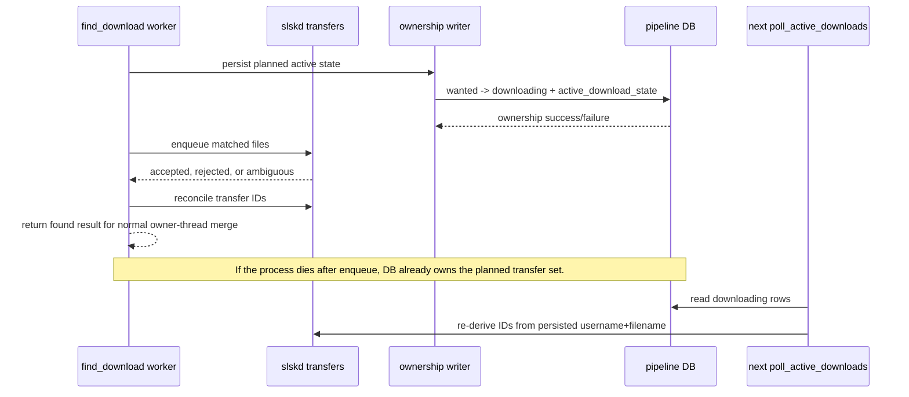

# fix: Claim download ownership before slskd enqueue

## Summary

Move the `wanted` to `downloading` ownership write ahead of the external slskd enqueue side effect so a process restart cannot leave accepted transfers unowned by the pipeline DB. The implementation should persist a planned active download witness before enqueue, then reset it only after verifying that slskd accepted no work.

---

## Problem Frame

Issue #219 reports a restart seam introduced by the async search/enqueue pipeline: slskd can accept transfers inside `find_download`, but Cratedigger currently waits until `search_and_queue` returns and `grab_most_wanted` loops the final grab list before writing `status='downloading'`. A kill in that gap leaves slskd downloading while the request remains `wanted`, allowing the next cycle to enqueue duplicate work.

---

## Requirements

- R1. Before an initial request enqueue can create slskd transfers, the request must transition to `downloading` with planned `active_download_state`; end-of-cycle aggregation must not be the first ownership write.
- R2. The persisted `active_download_state` payload must use one canonical shape: filetype, enqueued/progress timestamps, one entry per planned file with source user, full filename, source `file_dir`, size, disk metadata, retry/progress fields, and a `current_path` key whose initial value is `null` until local processing starts.
- R3. If slskd definitely rejects the enqueue before accepting any transfer, the request must return to retryable `wanted` through the existing retry/backoff behavior.
- R4. If enqueue outcome is ambiguous, cancellation cannot be verified, transfer-ID lookup fails, multi-disc enqueue fails, owner-thread merge fails, or cycle completion fails, the row must not become fresh `wanted` while accepted transfers may still exist. The only valid post-enqueue outcomes are: owned as `downloading`, verified no accepted transfer/cancelled then retryable, or left `downloading` as unsafe-unresolved for poll/timeout/operator recovery.
- R5. Restart regression coverage must prove that a process stop at the dangerous seams, including after the slskd call returns but before normal worker completion, resumes through persisted DB state instead of treating the request as fresh `wanted`.
- R6. Request status writes must continue to flow through the shared `lib.transitions` transition seam.

---

## Scope Boundaries

- Do not change the systemd timer, unit restart policy, or deploy cadence from the #198/#217 rollout.
- Do not refactor search, browse fan-out, match scoring, Redis folder cache, or slskd lifecycle management beyond what is needed to persist download ownership at enqueue time.
- Do not introduce new request statuses or change the existing request lifecycle. The existing automatic retry transition `downloading -> wanted` remains valid when no accepted transfer exists or accepted transfers have been verified cancelled.
- Do not build a general orphan-transfer reconciliation tool; this plan closes the forward path that creates the orphan.
- Do not make broad DB connection-pooling changes. Any worker DB access should be a narrow ownership-write seam, not a general permission for `find_download` workers to use owner DB state.

---

## Context & Research

### Relevant Code and Patterns

- `lib/download.py`: `slskd_do_enqueue` calls `ctx.slskd.transfers.enqueue`, then polls `get_all_downloads` for up to 10 seconds to recover transfer IDs. It already returns `DownloadFile` entries with empty IDs when slskd accepted the enqueue but ID reconciliation is incomplete, and retry re-enqueue inside `poll_active_downloads` also uses this low-level helper.
- `lib/download.py`: `build_active_download_state` serializes `GrabListEntry` data into the JSON shape consumed by `poll_active_downloads`.
- `lib/download.py`: `grab_most_wanted` currently persists `downloading` after `search_and_queue` returns; this is the ownership gap to remove or neutralize.
- `lib/download.py`: `poll_active_downloads` reconstructs entries from `active_download_state`, re-derives transfer IDs from the bulk slskd snapshot, and can continue with empty persisted IDs as long as username and filename data are present.
- `lib/enqueue.py`: `try_enqueue` and `try_multi_enqueue` call `slskd_do_enqueue`; `_try_filetype` builds the `GrabListEntry` after a match and successful enqueue.
- `lib/enqueue.py`: `prepare_find_download_context` intentionally installs `_WorkerPipelineDBSource` so match workers cannot accidentally use the owner thread's cached DB connection.
- `lib/transitions.py`: `RequestTransition.to_downloading`, `finalize_request`, and transition validation are the required state-transition seam.
- `tests/test_request_finalization.py`: AST contract coverage rejects direct request status writes outside the transition seam.
- `tests/test_download.py`: `TestGrabMostWanted`, `TestBuildActiveDownloadState`, and `poll_active_downloads` tests cover the existing delayed persist and resume behavior.
- `tests/test_search_max_inflight.py`: covers parallel `find_download` worker orchestration, owner-path exceptions, merge behavior, and logging.
- `tests/test_enqueue_fanout.py`: covers single-disc, multi-disc, fan-out, and enqueue-failure paths.

### Institutional Learnings

- `docs/advisory-locks.md` documents a similar crash-window fix: persist a precise witness before crossing a process boundary so the next cycle can distinguish safe retry from unsafe duplicate work. This plan applies the same ownership principle to slskd transfer acceptance.
- No `docs/solutions/` entry directly targets slskd enqueue ownership. The closest testing guidance is `docs/solutions/testing/mocked-contract-tests-miss-helper-mirror-integration-bugs.md`: cross-boundary behavior needs at least one integration slice, not only mocked helper tests.

### External References

- No external research used. The issue is local pipeline reliability work with strong existing code patterns.

---

## Key Technical Decisions

- Pre-claim before slskd enqueue: slskd and PostgreSQL cannot be updated atomically, so the robust invariant is that a planned `downloading` witness exists before the external enqueue call can create transfers. A same-process no-acceptance outcome can reset the row; a crash leaves a conservative `downloading` row rather than an unowned transfer.
- Keep `slskd_do_enqueue` a low-level slskd seam: initial request enqueue paths may wrap or split it only after claiming ownership, but poller retry re-enqueues must not trigger new request ownership writes.
- Use a narrow per-call ownership writer: `find_download` workers must not call the owner context's cached `DatabaseSource._get_db()`. The first implementation should pass a dedicated collaborator into worker contexts that constructs its own `PipelineDB` from the configured DSN for the ownership claim, guarded enrichment, and verified reset operations, then closes it in `finally`.
- Provisional planned state is valid state: transfer IDs may be empty because `poll_active_downloads` re-derives them from username and filename. The canonical initial payload includes `current_path: null`; local current-path updates begin only once processing/staging starts.
- Preserve the transition seam and make success observable: the new ownership write must use a transition-layer helper that returns success/failure for `wanted -> downloading`; it must not infer success from warning logs or call `db.set_downloading` directly outside `lib.transitions`.
- Guard all post-claim state changes: enrichment after ID reconciliation and reset-after-no-acceptance must return success/failure and must only apply while the row is still in the expected status.
- Make later aggregation idempotent or obsolete: after immediate persistence lands, `grab_most_wanted` should no longer be the first writer of `downloading`; it should either stop writing ownership entirely or only update non-status state when the row is already owned.
- Treat partial multi-disc acceptance as owned work: after all disc sources are selected, materialize the full planned file list with disk metadata before the first enqueue. Persist that full planned state before any disc enqueue. If a later disc fails in the same process, transition back to retryable `wanted` only after proving no accepted transfers remain; otherwise keep the request `downloading`.

---

## Open Questions

### Resolved During Planning

- Should this be handled by a repair script that finds orphans after restart? No. Issue #219 asks to prevent new orphan creation by persisting ownership at enqueue acceptance time.
- Should the fix wait for transfer IDs before persisting? No. Waiting for ID reconciliation preserves a real kill window; existing polling can re-derive IDs from filenames and usernames.
- Should ownership be written only after slskd acceptance? No. That still leaves a kill window between the external side effect and the DB write. The plan intentionally pre-claims `downloading` and resets only after verified no-acceptance/cancellation.
- Should match workers gain general DB access? No. The existing sentinel is a useful guard. Add only the narrow ownership-write path needed by this bug.

### Deferred to Implementation

- Exact helper names for the transition-layer ownership result and context collaborator.
- Whether a same-process multi-disc cleanup failure should immediately log a download attempt before leaving the row `downloading`, or leave attempt accounting to existing timeout/operator recovery.
- Exact log wording for ownership persistence, guard rejection, verified cancellation, and unsafe-unresolved outcomes.

---

## High-Level Technical Design

> *This illustrates the intended approach and is directional guidance for review, not implementation specification. The implementing agent should treat it as context, not code to reproduce.*

The important ordering is planned ownership before external enqueue before reconciliation. The persisted state can be enriched later, but it must exist before slskd can start work, any slow polling, worker return, owner-thread merge, or end-of-cycle aggregation. If enqueue returns rejected or ambiguous, the code must prove no accepted transfer exists before resetting to `wanted`; otherwise the row stays `downloading`.

---

## Implementation Units

- U1. **Add a worker-safe download ownership writer**

**Goal:** Provide one explicit way for enqueue code running in a `find_download` worker to mark a request `downloading` without using the owner thread's cached DB connection or bypassing transition contracts.

**Requirements:** R1, R2, R6

**Dependencies:** None

**Files:**
- Modify: `album_source.py`
- Modify: `lib/context.py`
- Modify: `lib/download.py`
- Modify: `lib/enqueue.py`
- Modify: `lib/pipeline_db.py`
- Modify: `lib/transitions.py`
- Test: `tests/test_download.py`
- Test: `tests/test_pipeline_db.py`
- Test: `tests/test_request_finalization.py`
- Test: `tests/test_transitions.py`

**Approach:**
- Add a transition-layer ownership helper that returns `True` only when the guarded `wanted -> downloading` write actually applies. Existing callers can keep using `finalize_request`, but the enqueue ownership path needs an observable result.
- Add a narrow ownership persistence collaborator that receives a request identifier and active download state payload, opens its own `PipelineDB` connection from the configured DSN, writes through the transition-layer helper, and closes the connection.
- Give the collaborator three explicit operations: claim planned ownership, guarded active-state enrichment while still `downloading`, and verified reset to retryable `wanted` after no-acceptance/verified-cancelled outcomes.
- Wire worker contexts so they can use this collaborator while `_WorkerPipelineDBSource` continues to reject general DB reads.
- Keep the boundary small: no track reads, no denylist reads, no search logging, no import writes, and no direct status-update calls.
- Make guard rejection explicit. If the row is no longer `wanted`, the enqueue path must stop before calling slskd rather than assuming ownership succeeded or continuing to the next peer.

**Execution note:** Start with a failing test that proves a worker context can persist `downloading` through the new boundary while still failing if it tries to use general DB access.

**Patterns to follow:**
- `lib.transitions.RequestTransition.to_downloading`, transition validation, and the existing `finalize_request` pattern.
- `_WorkerPipelineDBSource` in `lib/enqueue.py` for preserving worker DB boundaries.
- `FakePipelineDB.status_history` and transition tests in `tests/test_download.py` / `tests/test_transitions.py`.

**Test scenarios:**
- Happy path: given a wanted request and a worker-safe ownership writer, persisting active state records one `downloading` transition and stores non-empty `active_download_state`.
- Happy path: the transition-layer ownership helper returns `True` when `PipelineDB.set_downloading` applies the guarded write.
- Happy path: guarded active-state enrichment updates only a row that is still `downloading`.
- Contract: the ownership writer routes through `lib.transitions`; the direct status-write AST guard in `tests/test_request_finalization.py` remains green.
- Edge case: worker code that attempts generic DB reads still hits `_WorkerPipelineDBSource`, proving the new seam did not reopen general worker DB access.
- Error path: if the status guard rejects `wanted -> downloading`, the transition-layer helper returns `False`, the writer reports non-ownership, and the caller stops before invoking slskd.
- Error path: guarded active-state enrichment returns failure and does not rewrite state when the row has moved to `wanted`, `manual`, or `imported`.
- Error path: if the ownership write raises before slskd enqueue, the writer closes its DB connection, reports the failure to the caller, and slskd is not called.

**Verification:**
- Worker enqueue paths have an explicit safe way to persist ownership.
- No new production status writes bypass `lib.transitions`.

---

- U2. **Persist planned ownership before initial slskd enqueue**

**Goal:** Close the kill window between slskd acceptance and DB ownership for single-disc downloads by claiming the planned transfer set before the external enqueue call.

**Requirements:** R1, R2, R3, R5

**Dependencies:** U1

**Files:**
- Modify: `lib/download.py`
- Modify: `lib/enqueue.py`
- Test: `tests/test_download.py`
- Test: `tests/test_enqueue_fanout.py`

**Approach:**
- Build planned active state from the matched album/request context and file payload before calling `transfers.enqueue`.
- Claim `downloading` with that planned state before the external enqueue call. If the claim fails, do not call slskd.
- Do not make the ownership write unconditional inside every `slskd_do_enqueue` call. Either split initial enqueue from retry enqueue, or pass an explicit initial-ownership collaborator only from request enqueue paths so poller retry re-enqueues remain pure slskd operations.
- Keep ID reconciliation as an enrichment step: when IDs are found, update the active state or returned `GrabListEntry` as needed, but do not depend on IDs for initial ownership.
- If slskd definitely rejects the enqueue before accepting work, verify no matching transfer exists and transition back to retryable `wanted` through existing retry semantics.
- If the enqueue result is false, raises, or cannot be trusted, query the bulk transfer snapshot for the requested username and filenames before deciding the request has no accepted transfer. If the snapshot cannot prove no transfer exists, leave the row `downloading`.
- Treat cleanup as a proven-outcome operation: reset to `wanted` only after accepted transfers are verified absent or verified cancelled. Empty transfer IDs, failed snapshots, or failed cancels leave the row `downloading` rather than retryable.

**Execution note:** Add the restart-seam regression before changing the enqueue flow: inject stops after the ownership claim and after the slskd call returns, and assert the DB row is already `downloading`.

**Patterns to follow:**
- `slskd_do_enqueue` currently returns empty IDs when accepted transfers cannot be reconciled.
- `poll_active_downloads` / `rederive_transfer_ids` already tolerate empty persisted IDs.
- `build_active_download_state` is the canonical JSON state builder.

**Test scenarios:**
- Happy path: a single-disc initial enqueue claims `downloading` before the fake slskd enqueue method is called.
- Happy path: accepted enqueue with missing transfer IDs persists planned state containing username, filename, source `file_dir`, size, filetype, timestamps, disk fields, retry/progress fields, and `current_path: null`; next poll can re-derive IDs from a fake slskd snapshot.
- Error path: `transfers.enqueue` returns false and a bulk snapshot proves no matching transfer exists; the row transitions back to retryable `wanted`.
- Error path: `transfers.enqueue` raises and a bulk snapshot finds a matching transfer; the row stays `downloading`.
- Error path: `transfers.enqueue` raises and the bulk snapshot itself fails; the row stays `downloading` as unsafe-unresolved.
- Error path: ownership claim guard fails before enqueue; slskd is not called and the album attempt stops.
- Error path: verified cancellation is required before reset; missing transfer IDs plus failed re-derivation/cancel leaves the row `downloading`.
- Race path: row changes away from `downloading` before ID enrichment; guarded enrichment fails without rewriting active state.
- Restart seam: inject a process-stop exception after the slskd call returns but before normal `find_download` return; the DB row remains `downloading` with planned active state.
- Regression: poller retry re-enqueue of failed files does not call the request ownership writer.

**Verification:**
- The first durable DB write happens before the external slskd enqueue call.
- Existing enqueue-failure telemetry classifies only verified no-acceptance failures as retryable failures.

---

- U3. **Handle multi-disc and partial-acceptance ownership**

**Goal:** Ensure multi-disc enqueue cannot orphan a subset of accepted disc transfers if a later disc fails or the process dies mid-sequence.

**Requirements:** R2, R4, R5

**Dependencies:** U1, U2

**Files:**
- Modify: `lib/enqueue.py`
- Modify: `lib/download.py`
- Test: `tests/test_enqueue_fanout.py`
- Test: `tests/test_download.py`

**Approach:**
- After all disc sources are selected, build the full planned file list with disk metadata before any disc is enqueued.
- Persist the full planned active state before the first disc enqueue, even though later disc transfer IDs may still be empty or not yet accepted.
- Keep active state coherent enough for `poll_active_downloads`: disk metadata, source user, file directory, filename, size, and retry counters must survive restart.
- When final multi-disc success reconciles additional transfer IDs or status details after the planned write, update `active_download_state` through the guarded enrichment operation so the row tracks the latest complete file set.
- If a later disc fails in the same process, attempt to re-derive IDs and cancel accepted transfers. When no accepted transfer exists or cancellation is verified, transition the request back to retryable `wanted`; when absence/cancellation cannot be proven, keep the full planned state owned as `downloading` for poll/timeout handling.

**Execution note:** Characterize current multi-disc failure behavior first, especially the branch that cancels `all_downloads` after one disc accepted and a later enqueue fails.

**Patterns to follow:**
- `try_multi_enqueue` existing `cancel_and_delete(all_downloads, ctx)` cleanup on partial failure.
- `DownloadFile.disk_no` / `disk_count` propagation in successful multi-disc paths.
- `active_download_state` retry and disk metadata tests in `tests/test_download.py`.

**Test scenarios:**
- Happy path: a multi-disc enqueue accepted for all discs persists a final state containing every disc's files and disk metadata.
- Edge case: disc 1 accepted, disc 2 pending, process stops; DB state owns the full planned album so the next poll does not treat disc 1 as a complete album or re-search as fresh `wanted`.
- Error path: disc 1 accepted, disc 2 rejected, transfer IDs initially missing, re-derivation finds IDs, cancellation succeeds; the request transitions back to retryable `wanted` and no accepted transfer remains unowned.
- Error path: disc 1 accepted, disc 2 rejected, transfer IDs cannot be re-derived or cancellation cannot be verified; the request stays `downloading` with the full planned state instead of silently reverting to `wanted`.
- Race path: a manual/imported/reset transition happens before final multi-disc enrichment; guarded enrichment fails and does not overwrite the newer state.
- Integration: `poll_active_downloads` can reconstruct a full planned state after partial acceptance and either observe active transfers, retry missing transfers, or time them out through existing handling.

**Verification:**
- No accepted multi-disc transfer can exist in slskd while the request remains `wanted` without active state.
- Existing successful multi-disc result shape remains compatible with normal owner-thread merge and search logging.

---

- U4. **Remove delayed ownership as the primary writer**

**Goal:** Make `grab_most_wanted` compatible with immediate ownership persistence so later aggregation cannot be the first or only state write.

**Requirements:** R1, R3, R6

**Dependencies:** U2, U3

**Files:**
- Modify: `lib/download.py`
- Modify: `cratedigger.py`
- Test: `tests/test_download.py`
- Test: `tests/test_search_max_inflight.py`

**Approach:**
- Stop relying on the final `grab_list` loop in `grab_most_wanted` to transition found downloads to `downloading`.
- Preserve `grab_most_wanted` return counts and logging semantics for found, failed-search, and failed-grab outcomes.
- Ensure parallel `find_download` owner-path exception handling no longer needs to drain worker results before DB ownership is safe; draining can still matter for logging, metrics, and partial results.
- Avoid duplicate warning noise from attempting a second guarded `wanted -> downloading` transition after the row is already `downloading`.

**Execution note:** Update the existing `TestGrabMostWanted` tests to assert the new ownership location instead of only the end-of-cycle effect.

**Patterns to follow:**
- Existing `grab_most_wanted` no-blocking behavior test.
- `tests/test_search_max_inflight.py` owner-path exception coverage.
- Cycle summary counters should remain metrics-only and not become part of ownership correctness.

**Test scenarios:**
- Happy path: `grab_most_wanted` returns the same count for found downloads when ownership was already persisted by enqueue code.
- Edge case: owner-thread merge is delayed or raises after worker enqueue acceptance; DB ownership is already durable.
- Error path: found result reaches `grab_most_wanted` for a row already `downloading`; no duplicate transition warning is emitted.
- Regression: a verified no-acceptance enqueue failure still increments the failed-grab/search failure path and leaves the request retryable.
- Regression: a worker crash after ownership persistence but before owner-thread merge leaves the request `downloading`, not `wanted`.

**Verification:**
- End-of-cycle aggregation is no longer a restart-safety requirement.
- Existing search logging and cycle summaries remain understandable after the ownership move.

---

- U5. **Add restart-resume integration coverage**

**Goal:** Prove the complete issue #219 lifecycle: accepted slskd work survives process death as a DB-owned active download and resumes through the poller on the next run.

**Requirements:** R2, R5

**Dependencies:** U2, U3, U4

**Files:**
- Modify: `tests/test_download.py`
- Modify: `tests/test_integration_slices.py`
- Modify: `tests/fakes.py`
- Test: `tests/test_download.py`
- Test: `tests/test_integration_slices.py`

**Approach:**
- Add a focused seam test that simulates planned ownership, slskd accepting enqueue, then raises before transfer-ID reconciliation or normal cycle completion.
- Use a sentinel that is not swallowed by broad `except Exception` blocks when modeling process stop; the test should prove persistence happened before normal cleanup/merge code can run.
- Add an integration slice that seeds the resulting DB row into a fresh context and runs `poll_active_downloads` against a fake slskd snapshot.
- Extend fakes only as needed to record enqueue acceptance, active state writes, and bulk transfer snapshots; avoid adding behavior that production does not have.
- Keep the test at the boundary the bug lives on: slskd acceptance, DB state, restart, and poll resume.

**Execution note:** This unit should be test-first and should fail on current `main` because current persistence happens after `search_and_queue` returns.

**Patterns to follow:**
- `FakeSlskdAPI` transfer snapshots and enqueue calls in `tests/fakes.py`.
- `TestGrabMostWanted` and `poll_active_downloads` fixtures in `tests/test_download.py`.
- Existing integration slices that reconstruct `active_download_state` and validate current-path recovery.

**Test scenarios:**
- Integration: enqueue accepted, process-stop exception fires before normal cycle completion, fresh context polls the persisted `downloading` row and matches transfers by username and filename.
- Integration: process-stop exception fires immediately after the fake slskd call returns and before ID reconciliation; fresh context still sees `downloading`.
- Integration: accepted enqueue with transfer IDs still missing in persisted state resumes because the poller re-derives IDs from the bulk slskd snapshot.
- Error path: verified no-acceptance enqueue failure returns the row to `wanted` and eligible for existing retry/backoff behavior.
- Error path: ambiguous enqueue failure leaves the row `downloading` unless the test proves no matching slskd transfer exists.
- Edge case: status guard rejects because another process already moved the request out of `wanted`; slskd is not called for the stale worker.
- Regression: retry re-enqueue inside `poll_active_downloads` does not call the initial-ownership seam.

**Verification:**
- The regression test models the issue's kill seam directly.
- A fresh post-restart poll path uses DB state rather than the original in-memory `grab_list`.

---

## System-Wide Impact

- **Interaction graph:** The affected flow is search result -> `find_download` -> request ownership claim -> slskd enqueue -> `poll_active_downloads`. Import dispatch, web UI add flows, and quality decisions should not change.
- **Error propagation:** Verified no-acceptance slskd failures remain enqueue/search failures. Ambiguous outcomes remain `downloading` unless the implementation proves no transfer exists or verifies cancellation.
- **State lifecycle risks:** The critical risk is a partial side effect: slskd accepts files but DB ownership is absent. The mitigation is a durable planned ownership claim before the external enqueue call, plus guarded reset only after verified no-acceptance or verified cancellation.
- **API surface parity:** CLI/web request creation and pipeline status display continue to use the same `wanted` and `downloading` statuses.
- **Integration coverage:** Unit tests alone are insufficient; the plan requires a restart-style slice where a fresh context resumes from persisted `active_download_state`.
- **Unchanged invariants:** Request status writes still route through `lib.transitions`; `PipelineDB.set_downloading` remains guarded to `status='wanted'`; `poll_active_downloads` remains the only owner of ongoing download monitoring.

---

## Risks & Dependencies

| Risk | Mitigation |
|------|------------|
| Worker code accidentally reuses the owner DB connection | Add a per-call ownership writer that opens/closes its own `PipelineDB` and keep `_WorkerPipelineDBSource` as the general DB sentinel. |
| Transfer IDs are unavailable at the first durable write | Persist username and filename data before enqueue; rely on existing transfer-ID re-derivation in `poll_active_downloads`. |
| Multi-disc partial enqueue creates ambiguous ownership | Materialize and persist full planned state before first enqueue, and reset only after verified no-acceptance or verified cancellation. |
| Duplicate transition attempts create noisy warnings | Remove or neutralize the delayed `grab_most_wanted` transition once immediate persistence owns the state. |
| DB write fails or guard rejects before slskd enqueue | Do not call slskd; stop the album attempt and report enqueue failure. |
| Enqueue result is ambiguous or cancellation cannot be verified | Leave the row `downloading` as unsafe-unresolved so the next poll/operator path owns recovery; do not return it to fresh `wanted`. |

---

## Documentation / Operational Notes

- Update inline comments near `grab_most_wanted` and the initial enqueue path so future changes understand that DB ownership is claimed before slskd enqueue. Keep `slskd_do_enqueue` comments clear that poller retry calls do not create new request ownership.
- No migration is expected; `active_download_state` and `status='downloading'` already exist.
- No deployment choreography change is expected. Normal verification should include a cycle log showing ownership claimed before initial slskd enqueue and retained or reset according to the verified outcome.

---

## Sources & References

- Related issue: #219
- Related rollout context: #198, #217
- Related code: `lib/download.py`, `lib/enqueue.py`, `cratedigger.py`, `lib/transitions.py`, `tests/test_download.py`, `tests/test_search_max_inflight.py`, `tests/test_enqueue_fanout.py`
- Related docs: `docs/advisory-locks.md`, `docs/solutions/testing/mocked-contract-tests-miss-helper-mirror-integration-bugs.md`
