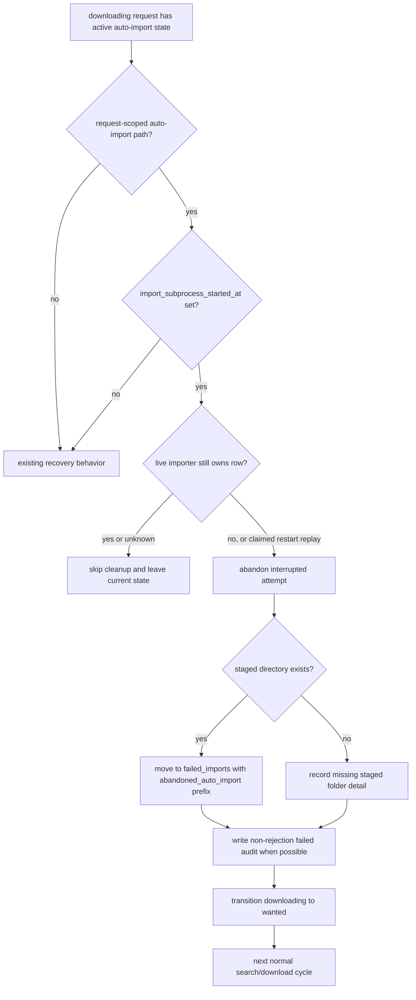

# fix: Auto-abandon interrupted auto-imports

## Summary

Interrupted request auto-imports that can no longer be safely resumed should stop wedging the request in `downloading`. The implementation will quarantine any remaining request-scoped staged folder under a clearly prefixed failed-import folder, reset the request to retryable `wanted`, and avoid every rejection, denylist, and bad-file path so the source can be retried normally.

---

## Problem Frame

Request #1034, Phil Spector - Back to Mono, is stuck because the importer restarted after `import_one.py` had been launched and the request-scoped staging folder no longer matched the tracked lossless files. Current guards correctly avoid blindly rerunning a possibly-started import, but their only outcome is permanent manual recovery. The desired policy is liveness-first: abandon the interrupted local attempt, preserve the leftover files for inspection, and re-download.

---

## Requirements

- R1. A `downloading` request with request-scoped auto-import state, `import_subprocess_started_at` set, and no live importer ownership for the row must automatically abandon the local attempt instead of staying blocked.
- R2. When a staged directory still exists, it must be moved under failed imports using an `abandoned_auto_import` prefix in the destination folder name, with collision-safe uniqueness.
- R3. Abandoned auto-import material must not be classified as bad audio, a wrong match, a validation rejection, or a denylist/cooldown-worthy source failure.
- R4. The request must transition back to retryable `wanted`, clear `active_download_state`, and preserve normal source eligibility and search overrides.
- R5. The same recovery policy must apply whether the condition is detected by the poller before enqueueing importer work or by the importer replaying an abandoned import job.
- R6. The latest request history should not keep implying that the abandonment was the previous unrelated `rejected` outcome when the system can write a non-rejection failure audit row with readable abandonment detail.
- R7. The first deploy smoke test must verify that request #1034 auto-cleans itself: the row leaves the stuck `downloading` state, an `abandoned_auto_import` failed-import folder appears for the old staged files if present, and no denylist or cooldown side effect is created for the uploader.

---

## Scope Boundaries

- Do not resume partial Opus targets or try to infer whether beets already completed the import.
- Do not add a new request status or a manual recovery workflow for this case.
- Do not denylist the uploader, apply source cooldown, record bad-audio hashes, or create wrong-match triage rows.
- Do not move, delete, or rewrite the existing Beets library copy. A later retry can compare against the library through the normal quality pipeline.
- Do not redesign request-scoped staging folder names for future attempts. The unique naming requirement applies to the abandoned failed-import destination only.
- Do not abandon while an import job for the request is still queued/running outside the replay path, or while liveness is unknown.
- Do not change force-import or manual-import semantics for existing `failed_imports/` folders.

---

## Context & Research

### Relevant Code and Patterns

- `lib/download.py` owns the active download local-processing lifecycle, including `_materialize_processing_dir`, `_processing_path_ready_for_importer`, `_run_completed_processing`, and the existing post-move resume guards.
- `lib/import_dispatch.py` stamps `active_download_state.import_subprocess_started_at` immediately before launching `run_import_one(...)`.
- `harness/import_one.py` may convert verified lossless source files to the configured target format and remove originals before import. That is why “tracked FLACs are missing” can be an interrupted import, not a bad source.
- `lib/util.py` has `move_failed_import`, which already moves failed source folders under `failed_imports/` with collision suffixes and only routes bad-file scenarios into `failed_imports/bad_files/`.
- `lib/transitions.py` and `lib/pipeline_db.py` already provide a guarded `downloading -> wanted` reset that clears active state without clearing retry counters.
- `lib/pipeline_db.py` cooldown checks count recent `timeout`, `failed`, and `rejected` rows by `soulseek_username`, so an abandonment audit row must be explicitly excluded from cooldown lookback if it records uploader evidence.
- `lib/download.py` already checks `_active_automation_import_job` before poll-driven processing, so the poller can skip rows with live queued/running importer work instead of racing cleanup.
- `web/classify.py` renders failed rows as a generic import error unless an `error_message` or import-result-derived verdict is present.
- `lib/download_recovery.py`, `lib/quality.py`, and `tests/test_repair.py` currently model post-move auto-import blocks as manual-review issues.
- `tests/test_download.py`, `tests/test_integration_slices.py`, `tests/test_import_queue.py`, `tests/test_download_recovery.py`, and `tests/fakes.py` already cover the affected recovery seams and fake DB behavior.

### Institutional Learnings

- `docs/advisory-locks.md` documents the current “subprocess started means manual recovery” rule. This plan intentionally revises that policy to “subprocess started means abandon, quarantine, and redownload.”
- `docs/solutions/testing/mocked-contract-tests-miss-helper-mirror-integration-bugs.md` applies because this bug crosses a helper-to-subprocess boundary. Unit tests need a deploy smoke against the real stuck album, not just mocked recovery helpers.

### External References

- None. The solution is local pipeline reliability work with established local patterns.

---

## Key Technical Decisions

- Use an abandon-and-redownload policy for interrupted auto-imports. It accepts possible redundant future work in exchange for eliminating permanent `downloading` wedges.
- Move leftover staged folders into `failed_imports/` with a folder name that begins with `abandoned_auto_import`, then preserves the original staged basename and existing collision suffix behavior. This keeps triage obvious without treating the content as `bad_files/`.
- Keep abandonment out of the rejection path. The implementation should not call `reject_and_requeue`, `_record_rejection_and_maybe_requeue`, wrong-match triage, source cooldown, denylist writes, or bad-audio hash writes.
- Reset through the transition seam with `attempt_type="download"` so the request gets normal retry/backoff accounting and downstream state invariants remain centralized.
- Write an audit `download_log` row with `outcome='failed'`, `beets_scenario='abandoned_auto_import'`, and a concise `error_message` when enough request/source context is available. This updates the request's latest history without making the source look rejected.
- Exclude `beets_scenario='abandoned_auto_import'` rows from source cooldown lookback if the audit row records `soulseek_username`. An interrupted local import should not count toward uploader punishment.
- Treat a requeued automation job after importer restart as abandoned ownership, not as a live `import_one.py` subprocess. The poller should still skip active queued/running jobs; the claimed replay job is the place where cleanup is allowed.
- Make the helper idempotent. If another worker already reset the row or the staged directory vanished between detection and cleanup, the request should still end in a retryable state and the code should not raise a second failure.

---

## Open Questions

### Resolved During Planning

- Should the next retry use a unique staged folder? No. The user clarified that uniqueness belongs to the abandoned failed-import folder name, not to future staging.
- Should this block future downloads from the same uploader? No. This is an interrupted local import, not evidence that the source is bad.
- Should the leftover files go under `failed_imports/bad_files/`? No. Use a visible `abandoned_auto_import` prefix under normal failed imports.

### Deferred to Implementation

- Exact helper names and the final separator used in the prefixed failed-import folder name.
- Exact fields in the failed audit row. The important contract is `outcome='failed'`, `scenario='abandoned_auto_import'`, no denylist side effects, and a failed path when a folder was actually moved.

---

## High-Level Technical Design

> *This illustrates the intended approach and is directional guidance for review, not implementation specification. The implementing agent should treat it as context, not code to reproduce.*

---

## Implementation Units

- U1. **Add abandoned auto-import quarantine**

**Goal:** Add the focused filesystem and audit behavior for abandoning an interrupted request auto-import.

**Requirements:** R2, R3, R6

**Dependencies:** None

**Files:**
- Modify: `lib/util.py`
- Modify: `lib/download.py`
- Modify: `lib/pipeline_db.py`
- Modify: `tests/fakes.py`
- Test: `tests/test_util.py`
- Test: `tests/test_download.py`
- Test: `tests/test_cooldown.py`
- Test: `tests/test_web_recents.py`

**Approach:**
- Extend the failed-import move path or add a narrow wrapper so abandonment moves the staged directory into a failed-import folder whose basename starts with `abandoned_auto_import`.
- Preserve the existing collision-safe suffix behavior when the prefixed destination already exists.
- Keep the scenario out of `_BAD_FILE_SCENARIOS` so abandoned auto-import files stay out of `failed_imports/bad_files/`.
- Build a non-rejection audit row from the active download state when request context is available: `outcome='failed'`, `beets_scenario='abandoned_auto_import'`, human-readable `error_message`, source username(s), filetype, original staged path, and moved failed path if present.
- Update cooldown lookback so abandoned-auto-import audit rows do not count as source failures even when the row carries `soulseek_username`.
- Ensure the fake DB records enough of the log row and denylist state for tests to assert the no-rejection contract.

**Execution note:** Implement the helper test-first; the folder-name contract is the user-visible triage behavior.

**Patterns to follow:**
- `move_failed_import` collision handling in `lib/util.py`.
- Existing `db.log_download(..., outcome='failed')` use in `lib/download.py` and `lib/import_dispatch.py`.
- `FakePipelineDB.log_download` and denylist assertions in `tests/fakes.py`.

**Test scenarios:**
- Happy path: abandoning an existing staged folder moves it under `failed_imports/` with an `abandoned_auto_import` prefix and preserves the staged folder's contents.
- Edge case: a destination with the same prefixed name already exists; the second abandonment gets a collision-safe unique folder.
- Edge case: the staged folder is already gone; cleanup returns a clear no-folder result without creating `bad_files/`.
- Error path: the abandonment audit row uses `outcome='failed'`, scenario `abandoned_auto_import`, and a readable `error_message`, and no denylist entry is written.
- Regression: four real source failures plus one `abandoned_auto_import` audit row for the same username do not trigger cooldown.
- Regression: request history renders the abandonment detail from the failed audit row instead of collapsing to a generic import error or the previous unrelated rejection.

**Verification:**
- Abandoned auto-import material is easy to find by folder name and never enters bad-file or reject triage flows.

---

- U2. **Wire abandonment into active download recovery**

**Goal:** Replace the permanent post-move manual block with automatic abandonment and reset for the interrupted-auto-import shape.

**Requirements:** R1, R3, R4, R5

**Dependencies:** U1

**Files:**
- Modify: `lib/download.py`
- Test: `tests/test_download.py`
- Test: `tests/test_integration_slices.py`
- Test: `tests/test_import_queue.py`

**Approach:**
- In `_materialize_processing_dir`, handle importer replay from `scripts/importer.execute_automation_import_job()` through `_run_completed_processing()` and `process_completed_album()`: when the current path is a request-scoped auto-import path and `import_subprocess_started_at` is set on the requeued automation job, call the abandonment helper instead of logging `POST-MOVE RESUME BLOCKED` and returning `None`.
- In `_processing_path_ready_for_importer`, apply the same helper when poll recovery sees a subprocess-started request-scoped auto-import path with no active queued/running importer job for the request.
- Do not let the currently claimed automation replay job veto itself as a live import. The active-job skip belongs to the poller path before enqueue, not to the claimed replay cleanup path.
- Finalize the request through `RequestTransition.to_wanted(from_status='downloading', attempt_type='download')`.
- Return a non-success result to the current poll/import cycle after the transition so the next normal search/download cycle owns the retry.
- Keep existing behavior for legacy shared staged paths, missing `db_request_id`, and request-scoped paths where `import_subprocess_started_at` is not set.

**Execution note:** Start with failing tests that pin the current stuck behavior changing to `wanted`; this is the core bug fix.

**Patterns to follow:**
- Current reset calls around missing local processing paths in `lib/download.py`.
- Existing `TestPostMoveResumeBlockGuard` coverage in `tests/test_integration_slices.py`.
- Importer abandoned-job retry coverage in `tests/test_import_queue.py`.

**Test scenarios:**
- Happy path: poller sees a request-scoped auto-import directory with `import_subprocess_started_at` set and no active importer job; the directory is moved to an `abandoned_auto_import` failed-import folder and the request becomes `wanted`.
- Happy path: importer replay via `recover_abandoned_running_jobs()` and `run_once()` sees the same subprocess-started path after startup requeue; it abandons once, marks the job terminal or failed without requeue looping, leaves no active automation job, and the request becomes `wanted`.
- Happy path: the production missing-files shape, where converted targets remain but tracked lossless files are gone, moves the whole remaining staged folder to the abandoned failed-import destination.
- Edge case: the staged directory is missing; the request still resets to `wanted`, an audit row records the abandonment, and no filesystem move is required.
- Edge case: poller sees a queued/running active automation import job for the request; it skips cleanup and leaves the row for the importer.
- Edge case: `import_subprocess_started_at` is absent; the legacy safe-resume path still behaves as it does today.
- Error path: missing `db_request_id` or legacy shared staged paths still do not auto-abandon because ownership is ambiguous.
- Regression: abandonment does not call rejection helpers, source denylist writes, source cooldown, wrong-match triage, or bad-audio hash writes.

**Verification:**
- A request in the #1034 shape cannot remain stuck across repeated poll/importer cycles.

---

- U3. **Update recovery and repair diagnostics**

**Goal:** Align read-only diagnostics with the new automatic recovery policy so tooling stops describing this case as manual-only.

**Requirements:** R1, R4, R5

**Dependencies:** U2

**Files:**
- Modify: `lib/download_recovery.py`
- Modify: `lib/quality.py`
- Test: `tests/test_download_recovery.py`
- Test: `tests/test_repair.py`

**Approach:**
- Reclassify non-running request-scoped auto-import paths with a started subprocess as auto-abandonable rather than manual blocked when the request id and staged path match.
- Keep manual-review diagnostics for genuinely ambiguous paths: no request id, legacy shared staged paths, multiple populated recovery candidates, or liveness probes that cannot distinguish an in-progress import from an abandoned one.
- Update repair suggestions so operators see the automatic policy and do not receive stale "manual recovery required" guidance for the request-owned case.

**Patterns to follow:**
- `ProcessingPathLocation` classification in `lib/download_recovery.py`.
- `find_orphaned_downloads` and `suggest_repair` issue/action mapping in `lib/quality.py`.

**Test scenarios:**
- Happy path: a request-scoped auto-import path with no in-progress import is reported as auto-abandonable/retryable rather than manual-only.
- Edge case: an in-progress release lock still suppresses the repair issue.
- Edge case: liveness probe unknown still reports manual review because automatic cleanup could race a live import.
- Error path: no `mb_release_id` and legacy shared staged paths remain manual review.

**Verification:**
- Diagnostic output matches the runtime behavior and no longer points operators at manual cleanup for the common request-owned abandonment case.

---

- U4. **Document the revised advisory-lock policy**

**Goal:** Update the durability notes so future changes do not recreate the permanent-block behavior.

**Requirements:** R1, R2, R3, R4

**Dependencies:** U1, U2

**Files:**
- Modify: `docs/advisory-locks.md`
- Modify: `docs/pipeline-db-schema.md`

**Approach:**
- Replace the current "flag set means manual recovery" wording with the new policy: flag set plus missing tracked files/path means abandon the attempt, quarantine remaining staged files, and redownload.
- Document that `abandoned_auto_import` is an interruption/audit scenario, not a validation rejection or bad-file classification.
- Note that `download_log.outcome='failed'` may be used for the audit row so UI history reflects the abandonment, but `beets_scenario='abandoned_auto_import'` rows are excluded from source cooldown accounting.

**Test scenarios:**
- Test expectation: none -- documentation-only unit. Behavioral coverage lives in U1-U3.

**Verification:**
- The docs describe the exact policy implemented by the code and no longer instruct manual recovery for request-owned interrupted auto-imports.

---

- U5. **Add first-deploy smoke coverage**

**Goal:** Make request #1034 the production smoke test for this recovery path.

**Requirements:** R7

**Dependencies:** U1, U2, U3, U4

**Files:**
- Modify: `docs/advisory-locks.md`

**Approach:**
- Add a concise rollout note that the first deploy should verify the existing Phil Spector request clears without manual DB or filesystem edits.
- Define the expected observations: request leaves the stuck `downloading` state, an `abandoned_auto_import` failed-import folder appears if the staged directory still exists, latest history reflects a readable failed abandonment audit rather than the stale unrelated rejection, and no denylist or cooldown side effect exists for the uploader.
- Treat successful re-download/re-import as follow-on confirmation, not as a prerequisite for the abandonment smoke itself.

**Patterns to follow:**
- The smoke-test guidance in `docs/solutions/testing/mocked-contract-tests-miss-helper-mirror-integration-bugs.md`.

**Test scenarios:**
- Test expectation: none -- rollout smoke is an operational verification against the live stuck row after deploy.

**Verification:**
- On deploy, #1034 stops being a permanently stuck `downloading` request without any manual cleanup command.

---

## System-Wide Impact

- **Interaction graph:** Polling, importer startup replay, import dispatch, request history, repair diagnostics, and failed-import triage all observe the same abandoned-auto-import state.
- **Error propagation:** Missing tracked files after `import_subprocess_started_at` is no longer a deferred/manual importer failure. It becomes a terminal local-attempt failure plus retryable request reset.
- **State lifecycle risks:** The main risk is abandoning a row after beets actually succeeded but before the DB was finalized. This plan accepts that liveness tradeoff and mitigates by leaving the Beets library untouched; the next normal attempt can compare against existing library state.
- **API surface parity:** Web request history should see the new latest failed audit row through existing download history ordering. CLI/repair diagnostics should no longer contradict runtime behavior.
- **Integration coverage:** Unit tests must be backed by an importer replay slice because the production bug appeared after a service restart.
- **Unchanged invariants:** Request status writes stay behind `lib.transitions`; failed-import source folders remain the user's inspectable copy; rejection paths still own denylist and wrong-match behavior.

---

## Risks & Dependencies

| Risk | Mitigation |
|------|------------|
| The import actually completed before the process died, so redownload is redundant | Leave the Beets library untouched and let the next normal quality comparison handle existing files |
| The staged directory disappears before the helper can move it | Reset anyway, write missing-folder detail, and keep the helper idempotent |
| A live import is mistaken for abandoned | Only auto-abandon request-scoped paths with matching request ownership and no active in-progress signal; keep unknown liveness as manual review in diagnostics |
| Failed-import folders accumulate | Prefix makes them easy to triage; this is preferable to wedged requests |
| Audit row is confused with source rejection | Use `outcome='failed'`, `abandoned_auto_import` scenario, and no reject/denylist helpers |
| Audit row silently contributes to future source cooldown | Exclude `abandoned_auto_import` rows from cooldown lookback and cover the exclusion with a regression test |

---

## Documentation / Operational Notes

- First deploy smoke: request #1034 should automatically leave `downloading` on the next poll/importer cycle, preserve any remaining staged files under an `abandoned_auto_import` failed-import folder, and avoid denylisting or cooling down `ImaginaryEndings`.
- A successful later re-download is expected, not a sign that cleanup failed.
- If the smoke leaves the request in `downloading`, inspect whether the code saw an in-progress import lock, ambiguous ownership, or an already-reset race before applying any manual fix.

---

## Sources & References

- Related code: `lib/download.py`, `lib/import_dispatch.py`, `harness/import_one.py`, `lib/util.py`, `lib/transitions.py`, `lib/pipeline_db.py`, `lib/download_recovery.py`, `lib/quality.py`, `web/classify.py`, `web/js/history.js`
- Related tests: `tests/test_download.py`, `tests/test_integration_slices.py`, `tests/test_import_queue.py`, `tests/test_download_recovery.py`, `tests/test_repair.py`, `tests/test_util.py`, `tests/test_cooldown.py`, `tests/test_web_recents.py`, `tests/fakes.py`
- Related docs: `docs/advisory-locks.md`, `docs/pipeline-db-schema.md`
- Related plans: `docs/plans/2026-05-05-003-fix-download-ownership-persistence-plan.md`, `docs/plans/2026-05-05-004-fix-download-ownership-review-remediation-plan.md`
- Related learning: `docs/solutions/testing/mocked-contract-tests-miss-helper-mirror-integration-bugs.md`
