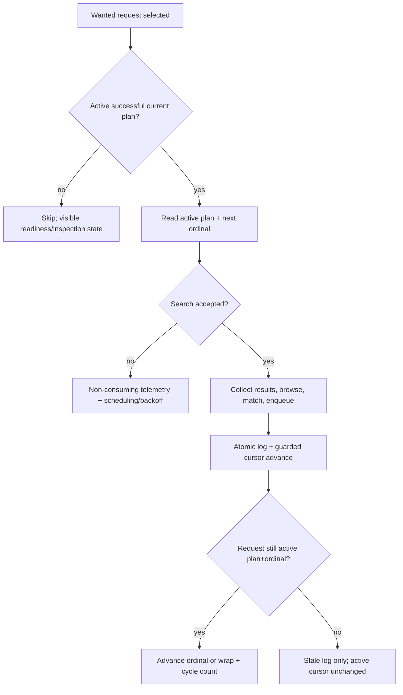
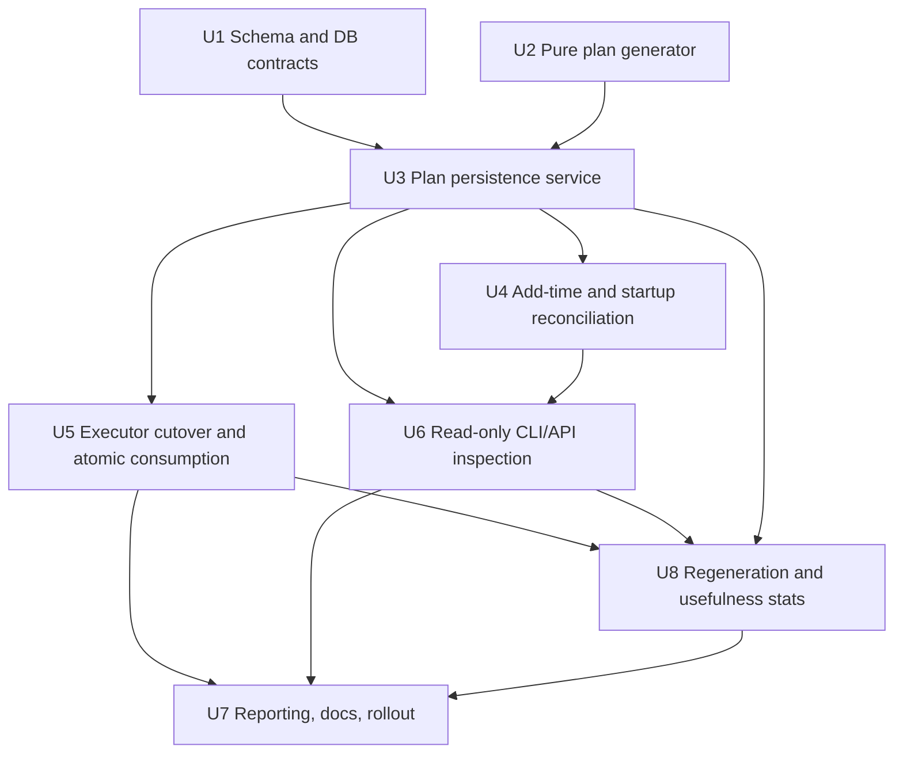

# feat: Persist per-request search plans

## Summary

Hard-cut search selection over to persisted per-request search plans by extending the existing search, pipeline DB, and search-log seams. The implementation lands the data model and pure generator first, then introduces shared plan generation/reconciliation, switches search execution to atomic plan-item consumption, and finishes with CLI/API inspection plus rollout metrics.

---

## Problem Frame

The current search ladder reconstructs intent from `search_attempts`, current metadata, and current query-generation code. That hides the pipeline's next search choice, makes repeated/default/omitted queries hard to audit, and prevents stable per-slot usefulness reporting.

---

## Requirements

- R1. Persisted search plans become the source of truth for query selection. (Origin R1-R14, R26-R28, F3)
- R2. The generator remains deterministic and owns all query construction behavior behind one boundary. (Origin R1-R7, R15-R25, AE1, AE3-AE5)
- R3. Request-owned cursor state replaces `search_attempts` as the search-cycle position. (Origin R26-R36, AE6-AE8, AE11)
- R4. Startup and add-time generation produce current-generator plans for wanted requests without diverging between CLI, web, and service paths. (Origin R37-R44, R61-R65, AE1, AE9, AE12-AE13)
- R5. Consumed search attempts log against exact plan context and atomically advance or wrap the cursor. (Origin R29-R35, R51-R52, R66-R70, AE6-AE8, AE14)
- R6. Deterministic failed plans are visible and sticky; transient resolver/dependency failures are retryable. (Origin R9-R10, R40-R42, R64, AE2, AE12)
- R7. Explicit regeneration is available through request-scoped CLI/API actions and is safe around in-flight searches. (Origin R45-R50, R66-R69, AE10, AE14)
- R8. Inspection surfaces show static plan data, provenance, current cursor/cycle state, legacy logs, and per-slot/query usefulness stats. (Origin R50-R55, R70-R73, AE10, AE16)
- R9. Hard cutover preserves scheduler/backoff pacing while removing new `exhausted` rows and stopping variant selection from `search_attempts`. (Origin R34-R36, R56-R57, R70, R74, AE8-AE11)
- R10. Tests and documentation make generator-output and behavior changes explicit. (Origin R58-R60, R74-R75)

**Origin actors:** A1 search-plan generator, A2 release resolver, A3 startup/preflight reconciler, A4 search executor, A5 operator, A6 future dashboard.

**Origin flows:** F1 add-time plan generation, F2 startup reconciliation, F3 one-slot search execution, F4 plan wrap, F5 explicit regeneration, F6 inspection.

**Origin acceptance examples:** AE1-AE16.

---

## Scope Boundaries

- Do not build the dashboard UI. This plan creates dashboard-ready data and API/CLI inspection.
- Do not backfill historical `search_log` rows to plan items.
- Do not add automatic config-fingerprint invalidation. Generator-id bumps remain the currentness contract.
- Do not expand the low-entropy token set beyond `the`, `you`, `from`, and `and`.
- Do not change strict matching, browse fan-out, watchdog behavior, slskd tuning, download validation, or import dispatch.
- Do not introduce deeper per-search Redis/cache attribution unless implementation confirms those counters are already available at search-result level.
- Do not translate old `search_attempts` into new cursor position.

### Deferred to Follow-Up Work

- Dashboard UI for aggregate search usefulness views.
- Automatic generator/config fingerprinting if manual generator-id discipline proves brittle.
- Broader cache attribution if the first cut shows cycle-level cache stats are insufficient.
- Removal/renaming of legacy scheduling fields after the hard cutover proves stable.

---

## Context & Research

### Relevant Code and Patterns

- `lib/search.py`: current pure search helpers, `build_query()`, `_per_track_queries()`, and `select_variant()`. This is the natural generator boundary to extend rather than duplicating query logic.
- `cratedigger.py`: `_select_variant_for_album()`, `_search_and_queue_parallel()`, `_log_search_result()`, startup cycle flow, and Phase 2 wanted selection are the main orchestration seams.
- `lib/pipeline_db.py`: owns `get_wanted()`, `log_search()`, `record_attempt()`, request reads/tracks, and DB transaction boundaries.
- `migrations/001_initial.sql`, `migrations/010_search_forensics_and_manual_reason.sql`, `migrations/011_cycle_metrics.sql`, `migrations/013_search_browse_metrics.sql`: establish request/search-log schema and current search/cycle telemetry.
- `scripts/pipeline_cli.py`: existing add/show patterns and forensic rendering for the CLI.
- `web/routes/pipeline.py`: web/API add/update/detail routes, including request creation followed by `set_tracks()`.
- `album_source.py`: existing cycle-time release/track lookup and lazy track population, useful context for the shared release snapshot boundary.
- `tests/fakes.py`: `FakePipelineDB` must mirror every new DB method used by pipeline tests.
- `tests/test_search.py`, `tests/test_pipeline_db.py`, `tests/test_fakes.py`, `tests/test_integration_slices.py`, `tests/test_pipeline_cli.py`, `tests/test_web_server.py`: primary test homes.
- `docs/pipeline-db-schema.md`: must be updated; it is already stale around variant tags and will become materially wrong after the cutover.

### Institutional Learnings

- Use migrations only for schema changes; do not add runtime DDL in `PipelineDB`.
- Preserve existing `search_log` forensics (`variant`, `final_state`, `candidates`, browse/match/peer/fanout metrics) and attach plan context onto it rather than replacing it.
- Make cursor advancement a single guarded DB operation coupled to log insertion and active-plan/ordinal validation.
- Startup recovery patterns in this repo distinguish deterministic sticky failures from transient retryable failures and isolate failures per row/request.
- Search completion can be delayed by browse/match/enqueue work; stale completions must log against their executed plan but cannot advance a regenerated active cursor.
- Cache counters are cycle-level today unless implementation proves otherwise.
- CLI/API JSONB boundaries should use structured decode/encode patterns and gracefully handle historical/null rows.

### External References

- No external research used. Local code and prior Cratedigger plans provide the relevant patterns.

---

## Key Technical Decisions

- Extend the existing pure search helper boundary into a materialized plan generator instead of adding a parallel query generator.
- Store all generated plans and failed attempts; plan items contain runnable query fields plus bounded provenance.
- Use a manually bumped current generator id as the only automatic invalidation key. Any generation-affecting config or code change must bump it.
- Preserve old active plans when explicit regeneration fails; a failed regeneration attempt is auditable but does not make a searchable request unsearchable.
- Keep deterministic generator failures sticky for the current generator id; keep transient resolver/dependency failures retryable.
- Retain `search_attempts` only as scheduler/backoff history during the cutover. It must not select queries and must not reset on plan wrap.
- Define consumption boundary as: no accepted search id or equivalent pre-attempt setup failure is non-consuming; accepted search or terminal slskd state is consuming even if browse/match/enqueue later fails.
- Stale old-plan completions are log-only with respect to active request state: they do not advance the current plan cursor, do not change active request status, and do not update active request scheduling/backoff.
- Guard all active request mutations from search execution, including download ownership/status transitions, against the plan/ordinal that was executed.
- Allow explicit regeneration for any existing request; only `wanted` requests with active successful current plans are executable.
- Treat cache attribution honestly: expose cycle-only/unknown cache attribution in plan stats unless per-search counters already exist in the metrics path.
- Use a repairable multi-step add-time path rather than requiring request, tracks, and plan generation to be one transaction. Search eligibility must block request rows until they have a successful current plan, and startup reconciliation repairs request/tracks/no-plan partial states.
- Keep resolver/snapshot ownership explicit: shared generation consumes a `ReleaseSnapshot`-style value supplied by adapters, not direct imports from web or CLI helper layers.
- Serialize per-request plan creation, plan supersession, cursor reads, and consumed-attempt updates using one DB-owned locking/guarded-write boundary.
- Use an additive, rollback-compatible migration posture: new tables/nullable fields may be ignored by old code, historical `outcome='exhausted'` rows remain valid, and rollback repair is operational rather than destructive schema rollback.
- Track attempt execution and cursor mutation separately in logs. A search can be accepted/executed while still failing to mutate the active cursor because it completed stale after regeneration.
- Bound and sanitize persisted generation errors/provenance so exception strings cannot store credentials, private host paths, or unbounded payloads.

---

## Open Questions

### Resolved During Planning

- **What happens when add-time generation fails after request/tracks are resolved?** Keep the request and expose plan status as failed or retryable; do not roll back the request solely because plan generation failed.
- **What consumes a slot?** An accepted search or terminal slskd state consumes. Pre-submit/setup failure without an accepted search is non-consuming.
- **Do stale completions update active request state?** No. They log against the executed old plan context only.
- **Does failed explicit regeneration disable an existing successful plan?** No. The old active successful plan remains active unless a new successful plan replaces it.
- **Can regeneration run for non-wanted requests?** Yes. It records/refreshes plan state, but only wanted requests are eligible for execution.
- **How are transient resolver failures persisted?** Persist a visible retryable generation attempt or state, not a sticky deterministic failure.
- **What replaces `search_attempts` for ordering/backoff?** Nothing for v1; retain it only as scheduler/backoff history if needed, never as query cursor.
- **Does startup block on transient plan failures?** No. Proceed, skip no-plan/unsearchable rows, and log readiness counts.

### Deferred to Implementation

- Exact table/column names for plan status and failure-class fields, provided they preserve the requirements and remain easy to query.
- Exact field names for execution-stage, attempt-consumed, and cursor-update-status audit markers.
- Exact API JSON shape for inspection/regeneration responses.
- Whether cache counters can be attributed per search without new instrumentation.
- Exact implementation mechanism for per-request serialization: request-row locks, advisory locks, or another DB-owned guard, provided active-plan/cursor invariants are enforced.

---

## High-Level Technical Design

> *This illustrates the intended approach and is directional guidance for review, not implementation specification. The implementing agent should treat it as context, not code to reproduce.*

### Lifecycle State Matrix

| Flow | Success State | Retryable Failure | Deterministic Failure | Notes |
|------|---------------|-------------------|-----------------------|-------|
| Add request | Request wanted + active current plan | Request wanted + retryable plan state | Request wanted + failed current plan, not searchable | Resolver failure before identity resolution can still abort add. |
| Startup reconcile | Wanted request has current active plan | Retryable state logged; skipped this cycle | Existing/current failed plan reported and skipped | Scans all wanted, not normal paged `get_wanted()`. |
| Search execution | Log + cursor advance/wrap atomically | Pre-attempt failure logs/backs off without consuming | N/A | Accepted search consumes even if later match/enqueue fails. |
| Explicit regenerate | New active plan, cursor/cycle reset | Failed attempt recorded; old active plan preserved | Failed attempt recorded; old active plan preserved | Allowed for any request status. |
| Stale completion | Log against executed old plan only | Log against executed old plan only | N/A | No active cursor/status/backoff mutation. |

### Currentness Model

| Concept | Meaning | Executable? |
|---------|---------|-------------|
| Latest generation attempt | Most recent plan-generation attempt for a request/generator, successful or failed. | Not by itself. |
| Active successful plan | Successful plan the request currently points at for audit/cursor purposes. | Only if it is also current-generator searchable. |
| Current-generator searchable plan | Active successful plan whose generator id matches the current generator id and whose request is `wanted`. | Yes. |
| Current deterministic failure | Latest current-generator attempt failed deterministically and no active successful current-generator plan remains for this generator id. A failed explicit regeneration attempt records this state as an attempt but does not supersede an existing active successful current plan. | No. |
| Retryable generation failure | Transient resolver/dependency/config failure. Startup may retry it later. | No, until a successful current plan exists. |

### Search Execution Flow

### Attempt Outcome Contract

| Case | Search-log row | Audit markers | Cursor | Cycle count | Scheduler/backoff and status state |
|------|----------------|---------------|--------|-------------|------------------------------------|
| Pre-submit/setup failure; no accepted search | Visible non-consuming telemetry row with plan context when known | `attempt_consumed=false`, pre-attempt stage, no cursor update | Unchanged | Unchanged | Apply retry/backoff so the request cannot spin hot |
| Accepted search -> `no_results` | Consumed current row | `attempt_consumed=true`, cursor advanced or wrapped | Advance or wrap | Increment only on wrap | Increment scheduler failure history and set retry/backoff |
| Accepted search -> `no_match` | Consumed current row | `attempt_consumed=true`, cursor advanced or wrapped | Advance or wrap | Increment only on wrap | Increment scheduler failure history and set retry/backoff |
| Accepted search -> recoverable/error result | Consumed current row when a search was accepted or terminal state exists | `attempt_consumed=true`, cursor advanced or wrapped | Advance or wrap | Increment only on wrap | Increment scheduler failure history and set retry/backoff |
| Found/enqueued | Consumed current row | `attempt_consumed=true`, cursor advanced or wrapped | Advance or wrap before/with guarded status transition | Increment only on wrap | Do not increment search failure history; any download/status claim must validate active plan+ordinal |
| Final-slot attempt | Consumed current row | `attempt_consumed=true`, cursor wrapped | Wrap to first ordinal | Increment by one | Same as outcome row above |
| Stale old-plan completion | Row against executed old plan | `attempt_consumed=true`, stale cursor update ignored | Active cursor unchanged | Active cycle unchanged | No active request scheduling/status/download ownership mutation |

### Plan Data Model Shape

The plan should create three durable concepts:

- request cursor fields on `album_requests`: active plan reference, next ordinal, cycle count, and any searchable/current-plan state needed for efficient filtering
- `search_plans`: request, generator id, status/failure class, metadata snapshot, generation provenance/error, timestamps, supersession state
- `search_plan_items`: plan, ordinal, strategy, query, canonical query key, repeat group, provenance

Schema invariants should be explicit:

- one active successful plan per request
- at most one current successful plan is active per request, enforced with a guarded write and, where the database supports it cleanly, a partial uniqueness constraint
- successful plans have at least one runnable item
- plan items are unique by `(plan, ordinal)` and store non-empty runnable queries
- request active-plan references cannot point to another request's plan
- request next ordinal must point at an item on the active plan when the request is searchable
- plan status and failure class are constrained to known values
- stale/superseded plans remain readable

`search_log` remains the audit/event table and gains plan context fields for new rows. Historical rows stay readable with NULL plan context. New rows must also distinguish consumed vs. non-consuming attempts and current-cursor update status, so usefulness stats do not confuse setup failures or stale completions with normal slot executions. Request deletion should remove plan records/items with the request, while logs keep enough denormalized plan/query context to remain inspectable even if nullable foreign keys are cleared.

---

## Implementation Units

### U1. Schema, Types, and DB Contracts

**Goal:** Add the durable search-plan schema, request cursor fields, search-log plan context, and DB/fake methods needed by later units.

**Requirements:** R1, R3, R5-R6, R8-R10; origin R8-R14, R26-R36, R51-R52, R56-R57, R66-R70, AE2, AE6-AE9, AE14

**Dependencies:** None

**Files:**
- Create: `migrations/014_persisted_search_plans.sql`
- Modify: `lib/pipeline_db.py`
- Modify: `tests/fakes.py`
- Test: `tests/test_migrator.py`
- Test: `tests/test_pipeline_db.py`
- Test: `tests/test_fakes.py`

**Approach:**
- Add plan tables for successful and failed generation attempts, plus request cursor fields and `search_log` plan-context fields.
- Keep the migration additive and rollback-compatible: new tables, nullable search-log fields, and request cursor columns must not prevent old code from reading/writing existing request and search-log paths.
- Keep historical `search_log` rows nullable for plan fields, and preserve historical `outcome='exhausted'` validity even though new code will stop writing it.
- Add explicit execution-stage, attempt-consumed, cursor-update-status, stale-reason, and cycle-snapshot audit fields or equivalents for new search logs.
- Add constraints/guards for known plan statuses, known failure classes, non-empty runnable item queries, unique `(plan, ordinal)` items, active plan/request ownership, and one active successful plan per request.
- Add indexes for active/current plan lookup, plan items by ordinal, logs by plan item/query key, and all-wanted reconciliation.
- Add DB methods for creating plans, superseding plans, fetching active plan/item, all-wanted plan reconciliation candidates, plan inspection with stats, and explicit regeneration persistence.
- Add one guarded consumed-attempt DB method that inserts the search log and conditionally advances/wraps cursor in one transaction. The method also owns the scheduler/backoff write for consumed failure outcomes so `search_attempts` remains scheduler-only.
- Add a non-consuming telemetry method for pre-attempt/setup failures that can set backoff without advancing cursor.
- Define request/plan delete behavior: plan rows/items cascade with requests where appropriate, while logs retain denormalized context and remain readable with nullable plan references.
- Mirror every new `PipelineDB` method in `FakePipelineDB` and self-test the fake behavior.
- Treat use of a transaction in the consumed-attempt method as an intentional exception to the current standalone `log_search()` pattern.
- Avoid SQL backfill of old logs into plan items. Startup/service reconciliation, not the migration, creates current plans.
- If any index must be built concurrently for production safety, account for the repo migrator's transaction behavior before choosing that index form.

**Execution note:** Start with migration and DB/fake tests. This unit should establish the shape that later orchestration consumes.

**Patterns to follow:**
- Existing versioned migrations in `migrations/`.
- `PipelineDB.log_search()` for search-log serialization and forensic fields.
- `PipelineDB.record_attempt()` for retry/backoff semantics, but folded into the consumed-attempt transaction where needed.
- `tests/fakes.py` self-tests for new DB methods.

**Test scenarios:**
- Happy path: migration creates plan tables, request cursor fields, and nullable search-log plan context.
- Happy path: creating a successful plan with items sets request active plan and cursor when requested.
- Happy path: creating a deterministic failed plan leaves the request wanted but not searchable.
- Happy path: creating a transient failed attempt records retryable state without making a sticky failed current plan.
- Happy path: consumed-attempt DB method inserts `search_log`, snapshots cycle count, advances ordinal, and wraps/increments cycle at the final ordinal.
- Happy path: pre-attempt/setup failure writes non-consuming telemetry/backoff and leaves cursor/cycle unchanged.
- Edge case: consumed-attempt detects stale plan/ordinal and logs without advancing active cursor.
- Edge case: historical `search_log` rows with no plan context still return from search history.
- Edge case: request deletion leaves historical logs inspectable and removes request-owned plan state according to the documented cascade/nulling contract.
- Edge case: active plan uniqueness and active-plan/request ownership constraints reject invalid state.
- Error path: failed transaction does not leave log-without-cursor or cursor-without-log partial state.
- Integration: `FakePipelineDB` mirrors successful plan creation, failed plan creation, active-plan lookup, all-wanted reconciliation candidates, non-consuming telemetry, simulated atomic rollback, and consumed-attempt stale/current behavior.

**Verification:**
- Schema migration tests pass.
- PipelineDB and FakePipelineDB tests prove the new data model and atomic consumed-attempt behavior before orchestration changes depend on it.

---

### U2. Pure Search-Plan Generator

**Goal:** Replace cycle-index variant selection with a deterministic materialized plan generator that preserves agreed album-level behavior and emits bounded provenance.

**Requirements:** R1-R2, R10; origin R1-R7, R15-R25, R58, R74-R75, AE1, AE3-AE5, AE15

**Dependencies:** None

**Files:**
- Modify: `lib/search.py`
- Test: `tests/test_search.py`

**Approach:**
- Extend the existing pure query helpers into a generator that accepts a release metadata snapshot and generation-affecting config.
- Emit repeated default slots according to the configured escalation threshold.
- Emit `unwild`, optional `unwild_year`, and up to three track slots for multi-track albums.
- Rank track candidates by useful token count, then character count, then original track order after normalization, low-entropy drops, validation, and dedupe.
- Preserve intentional default repeats as separate slots with shared query identity/repeat grouping.
- Collapse accidental duplicate non-default candidates and record deduped alternatives in provenance.
- Emit only runnable plan items; store omitted candidates and reasons in plan-level or item-level provenance.
- Define one shared current generator id constant/source for service, CLI, and API use.

**Execution note:** Implement generator behavior test-first with full expected plan output and provenance snapshots.

**Patterns to follow:**
- `build_query()`, `_normalize_query_tokens()`, `_per_track_queries()`, `_year_is_known()`, and current `select_variant()` tests.
- Existing `SearchVariant` naming only as transitional context; new plan item strategy names should align with the current code's `default`, `unwild`, `unwild_year`, and `track_<idx>` language unless implementation chooses a clearer stable strategy label.

**Test scenarios:**
- Happy path: typical release with year and many tracks produces repeated defaults, unwild, unwild-year, and three ranked track slots.
- Happy path: unknown year skips year slot and starts track tier after unwild.
- Edge case: single-track release has no track slots.
- Edge case: empty tracklist still produces album-level slots when artist/title are runnable.
- Edge case: all-low-entropy artist names preserve identity fallback where current query builder does.
- Edge case: `the`, `you`, `from`, and `and` are dropped and recorded.
- Edge case: repeated words such as `Love Love Love` dedupe into useful canonical query keys.
- Edge case: two strategies producing the same canonical query keep the first/highest-priority slot and record the loser.
- Edge case: track ranking ties break by source track order.
- Error path: no runnable artist/title/track query returns deterministic generation failure with provenance instead of an empty plan.
- Contract: changing expected generator output requires updating generator-id expectations in tests.

**Verification:**
- Generator tests assert full plan output, strategy ordering, query keys, repeat groups, omitted candidates, dropped tokens, dedupe provenance, and generator id.

---

### U3. Shared Release Snapshot and Plan Generation Service

**Goal:** Create one service boundary that resolves or reads release metadata, invokes the generator, and persists successful, deterministic failed, or transient failed plan attempts for CLI, web, startup, and regeneration.

**Requirements:** R2, R4, R6-R7; origin R2-R4, R9-R13, R37-R47, R61-R65, R75, AE1-AE2, AE9-AE13, AE15

**Dependencies:** U1, U2

**Files:**
- Create: `lib/release_snapshot.py`
- Create: `lib/search_plan_service.py`
- Modify: `album_source.py`
- Modify: `scripts/pipeline_cli.py`
- Modify: `web/routes/pipeline.py`
- Modify: `lib/config.py`
- Test: `tests/test_search_plan_service.py`
- Test: `tests/test_pipeline_cli.py`
- Test: `tests/test_web_server.py`
- Test: `tests/test_config.py`

**Approach:**
- Introduce a resolved `ReleaseSnapshot`-style value and resolver adapter boundary used by add-time generation, startup reconciliation, and explicit regeneration. The service should consume this value rather than importing web or CLI helper layers directly.
- Prefer already-resolved add payload data after tracks are available, so add-time generation does not race `set_tracks()`.
- Use a repairable multi-step add-time path: request creation, track persistence, and plan generation may commit separately, but the request is not searchable until it has a successful active current plan.
- For startup/regeneration, build the snapshot from persisted request fields and tracks first; only use source resolvers when required by missing metadata.
- Classify failures as deterministic generator failures or transient resolver/dependency failures.
- Preserve the old active successful plan when an explicit regeneration attempt fails.
- Ensure service/CLI/API use the same generation-affecting config source and current generator id.
- Make duplicate request add behavior unchanged: duplicates return the existing request and do not regenerate implicitly.
- Bound and sanitize stored generation errors/provenance before persistence.

**Execution note:** Characterize CLI/web add behavior before refactoring, then route both through the shared service.

**Patterns to follow:**
- Web add routes use fresh metadata snapshots before writing request data.
- `DatabaseSource.get_wanted()` track population behavior for missing tracks, but without coupling generation to normal wanted selection.
- `CratediggerConfig` config parsing defaults.

**Test scenarios:**
- Covers AE1. Add-time generation after tracks are available creates active plan and initializes cursor.
- Covers AE2. Deterministic no-runnable-query failure stores failed current plan and leaves request wanted/not-searchable.
- Covers AE12. Resolver outage during startup records retryable failure and allows later reconciliation to retry.
- Covers AE13. CLI and web add paths produce equivalent snapshots and plans for the same release data.
- Edge case: add route duplicate request does not create a second plan.
- Edge case: empty tracklist produces album-level-only plan.
- Edge case: explicit regeneration failure preserves old successful active plan.
- Edge case: explicit regeneration works for non-wanted statuses but does not make them executable.
- Edge case: request exists with tracks but no plan after an interrupted add; startup reconciliation can repair it.
- Edge case: request exists without tracks after an interrupted add; it remains not-searchable and is reported or repaired according to resolver availability.
- Error path: config loading/generator-id mismatch across surfaces is detectable in tests.

**Verification:**
- Shared service tests cover snapshot parity and failure classification.
- CLI/web add tests prove plan generation runs after tracks are available and uses shared behavior.

---

### U4. Startup Reconciliation and Search Eligibility

**Goal:** Ensure every wanted request has a current plan or visible failed/retryable state before search execution, without using the normal page-limited wanted picker as the reconciliation source.

**Requirements:** R4, R6, R9; origin R7, R37-R44, R56-R57, R61-R65, AE9, AE12

**Dependencies:** U1, U3

**Files:**
- Modify: `cratedigger.py`
- Modify: `album_source.py`
- Modify: `lib/pipeline_db.py`
- Test: `tests/test_pipeline_db.py`
- Test: `tests/test_integration_slices.py`
- Test: `tests/test_simulator_scenarios.py`

**Approach:**
- Add a startup/preflight reconciliation step before Phase 2 search selection, with a dry-run/preflight form suitable for deploy verification.
- Use an all-wanted query that ignores page size and retry eligibility.
- Generate missing/old-generator plans per request, isolating failures.
- Make reconciliation idempotent and resumable per request, with batching/progress logging if production counts make a full scan slow.
- Report one searchable summary log line with `generator_id`, `wanted_total`, `active_current`, `generated`, `old_generator_replaced`, `deterministic_failed`, `retryable_failed`, `skipped`, and `duration_s`.
- Treat any wanted row without an active successful current plan or explainable failed/retryable current generation state as a stop-the-deploy signal.
- Modify search eligibility so Phase 2 only selects wanted rows with active successful current plans.
- Preserve Phase 1 concurrency by ensuring rows requeued to wanted after reconciliation are not searchable until a later reconciliation gives them a current plan.
- Do not block the service on transient generation failures; log readiness counts and continue.

**Patterns to follow:**
- Startup recovery patterns for abandoned/queued work in existing plans.
- `cratedigger.py` cycle summary/logging style.
- `PipelineDB.get_wanted()` ordering/backoff semantics, split from all-wanted reconciliation.

**Test scenarios:**
- Happy path: startup scans all wanted rows, not just retry-eligible/page-limited rows.
- Happy path: missing plan rows receive current plans and cursor starts at 0.
- Happy path: old-generator rows receive new active plans and cursor/cycle reset.
- Edge case: deterministic failed current plan is reported and not retried.
- Edge case: transient failed plan attempt is retried on later startup.
- Edge case: row requeued to wanted after reconciliation is excluded from current cycle search if it has no active current plan.
- Error path: one row's generation failure does not stop reconciliation of other wanted rows.
- Error path: summary counts reconcile exactly to wanted total; unclassified no-plan rows fail the readiness check.
- Operational: interrupted reconciliation can resume without duplicating active plans or losing failure state.
- Integration: Phase 2 uses active-plan eligibility and never falls back to recomputed variants.

**Verification:**
- Startup logs and tests demonstrate all-wanted reconciliation and searchable filtering are separate paths.

---

### U5. Search Executor Cutover and Atomic Consumption

**Goal:** Replace runtime variant recomputation with persisted plan-item execution, carry plan context through in-flight search results, and atomically log/advance consumed attempts.

**Requirements:** R1, R3, R5, R9; origin R26-R36, R51-R52, R56-R57, R66-R70, AE6-AE8, AE11, AE14

**Dependencies:** U1, U2, U4

**Files:**
- Modify: `cratedigger.py`
- Modify: `lib/enqueue.py`
- Modify: `lib/download_ownership.py`
- Modify: `lib/search.py`
- Modify: `lib/pipeline_db.py`
- Modify: `lib/transitions.py`
- Modify: `tests/fakes.py`
- Test: `tests/test_integration_slices.py`
- Test: `tests/test_search_max_inflight.py`
- Test: `tests/test_cycle_watchdog_counter.py`
- Test: `tests/test_fakes.py`

**Approach:**
- Remove `_select_variant_for_album()` from the execution path and replace it with active plan-item lookup.
- Carry plan id, item id, ordinal, strategy, query key, repeat group, and cycle count snapshot through the in-flight `SearchResult`.
- Keep `variant`/strategy logging for existing forensic value, but source it from the plan item.
- On pre-attempt failure before accepted search id, write visible non-consuming telemetry/backoff and leave cursor unchanged.
- Once search is accepted or reaches terminal state, consume the slot even if browse/match/enqueue later yields no match, error, or enqueue failure.
- Use the U1 guarded DB method to insert `search_log` and advance/wrap cursor atomically.
- If active plan/ordinal no longer matches because of regeneration, log stale completion against executed plan context and skip active request mutation.
- Before claiming download ownership, moving a request toward downloading, or applying a status transition from search execution, validate that the executing plan/ordinal is still the active request plan/ordinal. Stale completions are audit-only.
- Record execution-stage, attempt-consumed, cursor-update-status, stale reason, and cycle snapshot on every new plan-aware search log row.
- Remove new `exhausted` emissions; plan wrap replaces exhaustion.
- Keep scheduling/backoff semantics intact without using `search_attempts` for query choice. `search_attempts` may increment for consumed failure outcomes and non-consuming pre-attempt failures, but never selects the next query and never resets on plan wrap.

**Execution note:** Add stale-completion and atomicity tests before changing the search loop.

**Patterns to follow:**
- Current `_search_and_queue_parallel()` ownership of search submission and find-download handoff.
- Current `_apply_find_download_result()` for copying metrics/candidates onto `SearchResult`.
- Watchdog counter tests proving `_log_search_result` is a single observation point.

**Test scenarios:**
- Covers AE6. Active plan ordinal executes and advances after log.
- Covers AE7. Submit/setup failure before accepted search is non-consuming and visible.
- Covers AE8. Final ordinal wraps to 0 and increments cycle count with no new exhausted row.
- Covers AE14. Old-plan completion after regeneration logs against old plan but cannot advance new cursor.
- Happy path: found/enqueued outcome consumes the slot and moves cursor.
- Happy path: no_results/no_match/error after accepted search consumes the slot and applies scheduling/backoff as defined.
- Edge case: collection crash after accepted search consumes or logs according to the accepted-search boundary.
- Edge case: request returns to wanted after failed download and retains cursor/cycle.
- Edge case: stale found/enqueued completion after regeneration does not claim download ownership, change request status, or update active scheduling.
- Edge case: pre-attempt failure stats are visible but excluded from normal slot-usefulness counts unless explicitly requested.
- Regression: no call path uses `select_variant()` or `search_attempts` to choose a query.
- Regression: existing candidates/final_state/browse metrics still persist on `search_log`.

**Verification:**
- Integration tests prove current, wrap, stale, found, no-match, error, and pre-attempt failure paths.
- Existing exhausted/reset tests are rewritten to assert cycle wrap and no new `exhausted` rows.

---

### U6. Read-Only CLI/API Inspection

**Goal:** Add request-scoped CLI/API surfaces for inspecting active/failed plans, cursor/cycle state, items, provenance, and legacy logs before the executor cutover is complete.

**Requirements:** R8; origin R50-R55, R70-R73; supports AE16 prerequisites

**Dependencies:** U1, U3, U4

**Files:**
- Modify: `scripts/pipeline_cli.py`
- Modify: `web/routes/pipeline.py`
- Modify: `web/server.py`
- Test: `tests/test_pipeline_cli.py`
- Test: `tests/test_web_server.py`
- Test: `tests/test_js_pipeline.mjs`

**Approach:**
- Add `pipeline-cli search-plan show <request_id>` with human output and JSON output.
- Add request-scoped API read routes for future dashboard use.
- Inspection output should include plan status, generator id, active-current/searchable state, cursor, cycle count, items, provenance, omitted/deduped candidates, failure class/error, superseded plans, and a legacy-log bucket for rows without plan context.
- Clearly distinguish latest generation attempt, active successful plan, current-generator searchable plan, deterministic current failure, and retryable generation failure.
- Keep this unit read-only so operators can inspect startup-generated plans before search execution has moved to plan consumption.

**Patterns to follow:**
- `pipeline-cli show` forensic rendering.
- Existing web route contract tests and JSON response style.
- `msgspec.Struct`/structured JSON boundary conventions for persisted JSONB.

**Test scenarios:**
- Supports AE16 prerequisites. CLI/API output shows active plan, currentness, failed/retryable states, item ordering, cursor/cycle state, and legacy logs.
- Happy path: `search-plan show --json` returns current active plan and legacy logs.
- Happy path: human CLI output clearly marks active, failed deterministic, retryable transient, and superseded plans.
- Edge case: missing request returns nonzero/404-style behavior.
- Edge case: historical logs without plan ids appear in a legacy section, not hidden.
- Contract: API route tests cover read success and failure shapes without requiring dashboard UI.

**Verification:**
- CLI and web route tests pass with fake DB/service boundaries.
- Manual inspection output is useful without raw SQL, even before U5 starts writing plan-aware search logs.

---

### U8. Regeneration and Usefulness Stats

**Goal:** Add request-scoped regeneration actions and per-slot/query usefulness stats after plan-aware execution logs exist.

**Requirements:** R7-R8; origin R45-R55, R66-R73, AE10, AE16

**Dependencies:** U1, U3, U5, U6

**Files:**
- Modify: `scripts/pipeline_cli.py`
- Modify: `web/routes/pipeline.py`
- Modify: `web/server.py`
- Modify: `lib/pipeline_db.py`
- Test: `tests/test_pipeline_cli.py`
- Test: `tests/test_web_server.py`
- Test: `tests/test_js_pipeline.mjs`
- Test: `tests/test_pipeline_db.py`

**Approach:**
- Add `pipeline-cli search-plan regenerate <request_id>` using the shared service.
- Add request-scoped API regeneration routes for future dashboard use.
- Regeneration should acquire the same per-request serialization boundary as cursor consumption, preserve old active plans on failed regeneration, and reset cursor/cycle to 0 only on successful new active plan.
- Regeneration is allowed for any request status, but only `wanted` requests with active successful current plans are executable.
- Add per-slot and per-query-group stats using plan-aware search logs: attempts, outcomes, elapsed time, result count, browse/match/fanout cost, stale count, pre-attempt/non-consuming count, and current-vs-superseded grouping.
- Stats should expose cache attribution level (`per_search`, `cycle_only`, or unavailable-equivalent) rather than implying per-slot cache data exists when it does not.
- Treat explicit regeneration as the operator repair path for bad/fixed metadata; do not automatically regenerate on metadata edits in this plan.

**Patterns to follow:**
- Existing pipeline CLI action style for mutating request commands.
- Existing web route contract tests and JSON response style.
- Search-log forensic aggregation patterns in `lib/pipeline_db.py`.

**Test scenarios:**
- Covers AE10. CLI regeneration succeeds, creates new active plan, preserves old plans/logs, and resets cursor/cycle.
- Covers AE16. CLI/API output can rank slots/query groups by attempts, outcomes, elapsed, result count, browse/match/fanout cost, stale count, non-consuming setup failures, and cache attribution level.
- Happy path: API regeneration succeeds for a wanted request and returns the new currentness/cursor state.
- Happy path: imported/downloading/manual request can regenerate but is not marked executable unless wanted.
- Edge case: failed regeneration preserves previous active plan and cursor/cycle.
- Edge case: regeneration racing an in-flight completion yields stale completion logging without mutating the new cursor.
- Edge case: historical logs without plan ids remain in a legacy stats bucket.
- Contract: API route tests cover read/regenerate success and failure shapes without requiring dashboard UI.

**Verification:**
- CLI and web route tests pass with fake DB/service boundaries.
- Manual inspection can answer which plan slots are useful, expensive, stale, or only historically represented.

---

### U7. Reporting, Documentation, and Rollout Verification

**Goal:** Update reporting, documentation, and operational checks so the hard cutover is understandable and observable after deploy.

**Requirements:** R8-R10; origin R34-R36, R56-R60, R70-R75, AE8-AE9, AE16

**Dependencies:** U4, U5, U6, U8

**Files:**
- Modify: `docs/pipeline-db-schema.md`
- Modify: `docs/parallel-search.md`
- Modify: `README.md`
- Modify: `lib/pipeline_db.py`
- Modify: `web/routes/pipeline.py`
- Test: `tests/test_web_server.py`
- Test: `tests/test_pipeline_db.py`

**Approach:**
- Update schema docs for search plans, plan items, request cursor fields, search-log plan context, generator id, failure classes, cycle count, and no-new-exhausted behavior.
- Replace new-exhausted reporting assumptions with derived wrap/cycle metrics while keeping historical exhausted counts separate.
- Add plan readiness/searchability counts to CLI/API/dashboard data paths where existing dashboard summaries already expose wanted/search outcomes.
- Add rollout notes for migration verification, rollback, startup reconciliation logs, plan coverage counts, stale completion safety, before/after yield/cost monitoring, and generator-id bump discipline.
- Document the doc2 deploy verification path: migration service success, web restart when API routes change, timer-driven pipeline service behavior, first-cycle reconciliation logs, and CLI/API smoke checks.
- Add concrete verification guidance for no-new-exhausted rows using deploy-time windows while keeping historical exhausted rows visible.
- Keep docs clear that the dashboard UI itself is deferred.

**Patterns to follow:**
- `docs/pipeline-db-schema.md` for audit field explanations.
- Existing pipeline dashboard route tests for counts/outcome windows.
- Prior deploy-plan operational verification sections.

**Test scenarios:**
- Happy path: dashboard/API summary distinguishes searchable wanted, failed-plan wanted, retryable-plan wanted, and legacy/no-plan states.
- Happy path: wrap/cycle metrics can be derived without new exhausted rows.
- Edge case: historical exhausted logs still appear as historical outcomes where relevant.
- Edge case: cache attribution level is represented honestly when only cycle-level counters exist.
- Documentation check: schema docs no longer describe `search_attempts` as query selector.
- Operational: rollout checks include plan table row counts, active-plan FK integrity, contiguous ordinals, unclassified wanted/no-plan count, and post-deploy `outcome='exhausted'` count.
- Operational: rollback notes explain additive schema compatibility, old-code behavior, and repair through startup reconciliation or explicit regeneration.

**Verification:**
- Docs explain the new model well enough that a future operator can inspect a stuck request without reading code.
- Dashboard/API summary tests do not rely on new `outcome='exhausted'` rows.

---

## System-Wide Impact

- **Interaction graph:** Web add, CLI add, startup reconciliation, search execution, search logging, and request inspection all converge on the shared plan generation service and PipelineDB plan methods.
- **Error propagation:** Resolver/config/database transient failures remain retryable and visible; deterministic generation failures are sticky and visible; search execution pre-attempt failures are visible/non-consuming.
- **State lifecycle risks:** The plan adds request cursor state, active/superseded plan history, failed generation attempts, and stale completion handling. Atomic log+cursor is the main consistency boundary.
- **API surface parity:** CLI and API both need show/regenerate; add-time generation must behave the same for CLI and web.
- **Integration coverage:** Pure generator tests are not enough. The plan requires DB, fake DB, startup reconciliation, in-flight stale completion, CLI, and API tests.
- **Unchanged invariants:** Matching strictness, slskd watchdog behavior, browse fan-out, download validation, and import behavior remain unchanged.

---

## Risks & Dependencies

| Risk | Mitigation |
|------|------------|
| Atomic log+cursor is implemented as separate commits, causing duplicate or skipped slots after crashes. | U1 requires one guarded DB operation and tests partial-failure behavior before U5 uses it. |
| Startup reconciliation misses rows because it reuses `get_wanted(limit=page_size)`. | U4 requires a separate all-wanted reconciliation query and tests retry/page-limited rows. |
| Phase 1 requeues a row to wanted after reconciliation. | U4/U5 require execution eligibility to demand active successful current plan, so late rows wait. |
| Explicit regeneration races in-flight search completion. | U1/U5 require active-plan/ordinal validation and stale-completion log-only behavior. |
| Stale found/enqueued completion claims download ownership after regeneration. | U5 extends the guard beyond cursor updates to download ownership and status transitions in `lib/download_ownership.py`, `lib/enqueue.py`, and `lib/transitions.py`. |
| Add-time generation runs before tracks are available. | U3 requires shared snapshot service after tracks are available and tests CLI/web parity. |
| Interrupted add leaves wanted rows without usable plans. | U3/U4 intentionally allow repairable partial states, block search eligibility until a current successful plan exists, and reconcile all wanted rows on startup. |
| Schema migration makes rollback unsafe. | U1/U7 require additive nullable schema, historical exhausted validity, old-code tolerance, pre-deploy backup, and repair via reconciliation/regeneration after rollback. |
| Startup backfill takes too long or hides partial failures. | U4 requires dry-run/preflight, idempotent batching/progress logging when needed, and exact reconciliation counts. |
| Manual generator-id bump is forgotten. | U2/U3/U7 require a single runtime source and tests/review checks that generator-output changes surface with id expectations. |
| Hard cutover floods defaults or distorts scheduling. | U5 preserves retry/backoff eligibility and keeps `search_attempts` scheduler-only during cutover. |
| Removing new exhausted rows blinds existing dashboards. | U7 replaces reset/exhaustion reporting with derived wrap/cycle metrics and tests historical/new behavior. |
| Cache usefulness is overstated. | U8/U7 expose attribution level and only show per-slot cache stats when available. |
| Plan rewrite accidentally changes matching/browse/import behavior. | Scope boundaries and regression tests keep those systems unchanged. |

---

## Operational / Rollout Notes

- Deploy includes a schema migration and a hard behavior cutover; no feature flag is planned.
- Planning-time production snapshot on 2026-05-08: 584 wanted rows, 86 due now, 498 backed off, wanted `search_attempts` up to 15, 50,870 total `search_log` rows, 377 `exhausted` rows in the prior 7 days, 528 wanted multi-track rows, 5 wanted zero-track rows, and 3 wanted redownload rows missing release identity. Treat these as sizing signals, not hard-coded expectations.
- Verify migration application through `schema_migrations`, plan table presence, request cursor fields, plan table row counts, active-plan FK integrity, contiguous plan ordinals, and the count of wanted rows without an explainable current successful/failed/retryable plan.
- Take pre-deploy baselines for wanted counts, due/backoff split, search-log outcome counts, search-attempt distribution, 24h/7d searches, distinct requests, found/no-results/no-match/error rates, average/p95 elapsed time, average result count, browse/match time, peers browsed, fanout waves, cycle cache counters, and recent exhausted rows.
- On first startup after deploy, expect a reconciliation pass that creates current plans for existing wanted rows with cursor/cycle starting at 0.
- Watch the startup reconciliation summary log for `generator_id`, `wanted_total`, `active_current`, `generated`, `old_generator_replaced`, `deterministic_failed`, `retryable_failed`, `skipped`, and `duration_s`. Totals must reconcile exactly; unclassified wanted/no-plan rows are a stop signal.
- On doc2, verify the database migration service succeeded, restart the web service when API routes changed, respect that the pipeline service is timer-driven/oneshot, and validate the first pipeline cycle through reconciliation logs plus safe CLI/API inspection of active, failed/retryable, historical legacy, and non-wanted request states.
- Compare before/after search yield, cost, and coverage by strategy, ordinal, canonical query key, and repeat group at early, mid, and next-day windows because top-three track selection and default-repeat materialization are intentional behavior changes.
- Confirm new searches no longer write `outcome='exhausted'` after the deploy timestamp; historical rows remain and should still render as historical outcomes.
- Confirm no query selection path still calls the old `search_attempts` ladder.
- Rollback plan: keep a pre-deploy database backup, rely on additive schema/nullable fields so old code can ignore plan tables and new log columns, preserve the old `search_log.outcome` domain including `exhausted`, and repair any stranded current-generator plan state after rollback/redeploy through startup reconciliation or explicit request regeneration.
- Safe smoke checks should avoid casually regenerating active wanted requests because successful regeneration resets cursor/cycle; use read-only inspection first and reserve regeneration smoke for a selected non-wanted or intentionally chosen request.

---

## Sources & References

- **Origin document:** `docs/brainstorms/2026-05-08-persisted-search-plans-requirements.md`
- Related plan: `docs/plans/2026-04-29-006-feat-search-escalation-and-forensics-plan.md`
- Related plan: `docs/plans/2026-05-04-002-fix-find-download-concurrency-plan.md`
- Related plan: `docs/plans/2026-05-05-001-feat-peer-cache-redis-migration-plan.md`
- Related code: `lib/search.py`
- Related code: `cratedigger.py`
- Related code: `lib/pipeline_db.py`
- Related code: `lib/download_ownership.py`
- Related code: `lib/enqueue.py`
- Related code: `lib/transitions.py`
- Related code: `scripts/pipeline_cli.py`
- Related code: `web/routes/pipeline.py`
- Related tests: `tests/test_search.py`
- Related tests: `tests/test_pipeline_db.py`
- Related tests: `tests/test_integration_slices.py`
- Related tests: `tests/test_pipeline_cli.py`
- Related tests: `tests/test_web_server.py`
