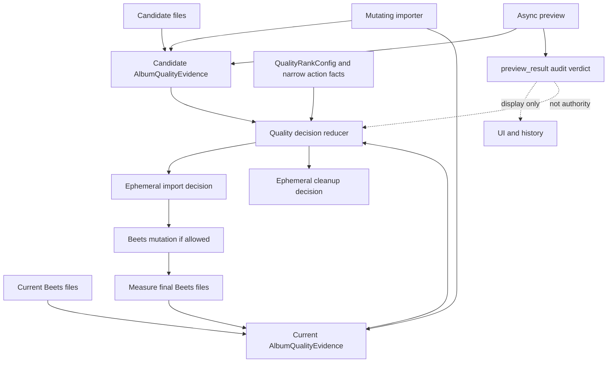
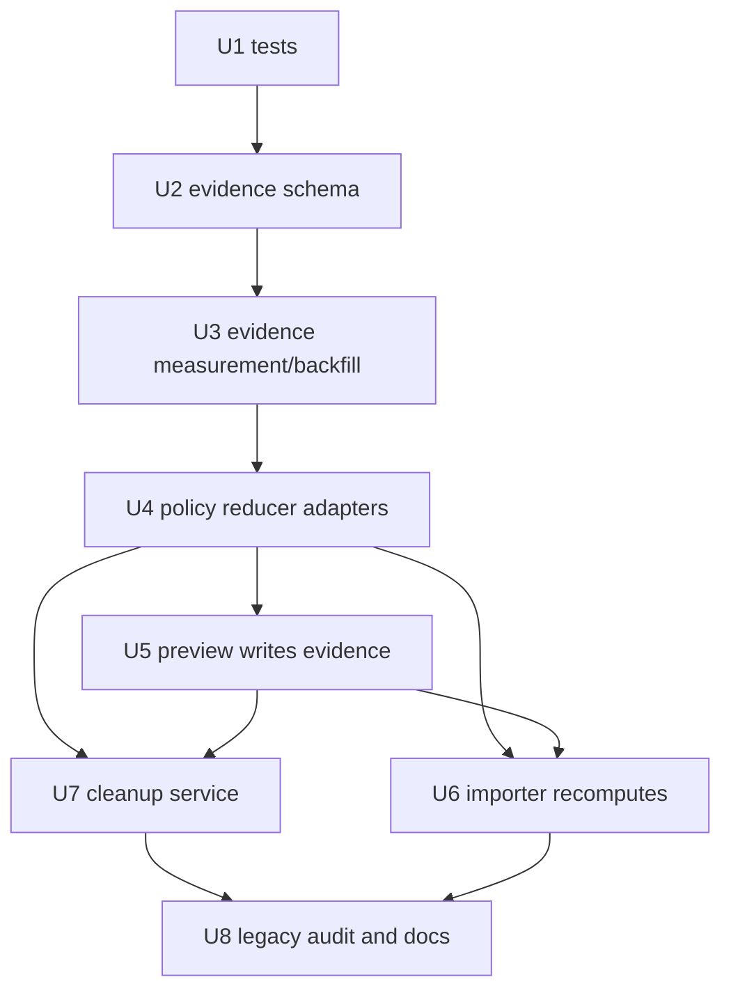
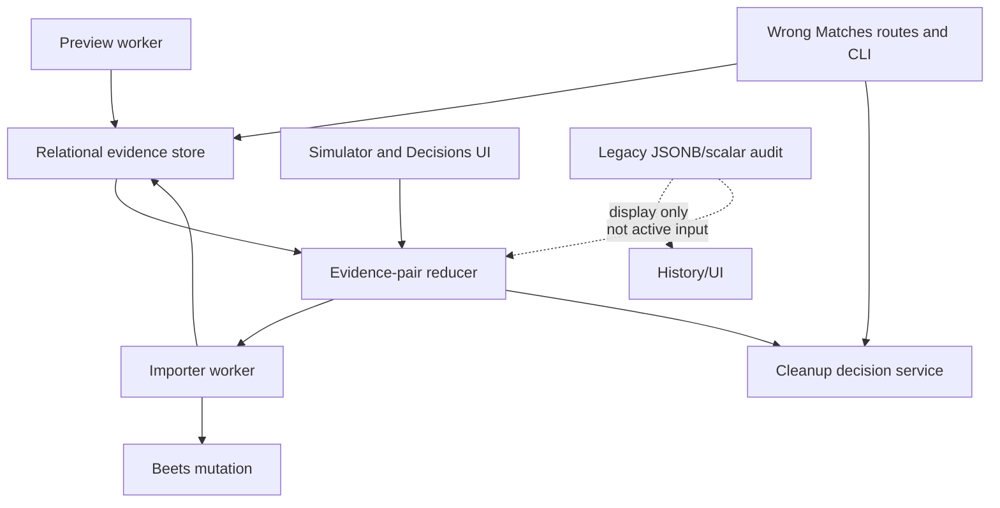

# refactor: Separate quality evidence from decisions

> Superseded on 2026-05-15 by
> `docs/plans/2026-05-15-001-refactor-evidence-backed-import-mutation-plan.md`.
> This plan was sufficient for the stale-decision safety boundary, but it did
> not make R28-R32 explicit enough: snapshot-valid candidate evidence from
> async preview must be reused at import time, and unchanged candidates must not
> be remeasured before Beets mutation.

## Summary

Refactor the import quality pipeline so async preview, Wrong Matches triage,
mutating import, cleanup, and simulator code all share one neutral
album-quality evidence model while recomputing action decisions at action time.
The implementation keeps expensive measurements reusable, moves active evidence
out of legacy JSONB/scalar decision surfaces, and removes preview/import-result
decision authority from force import and cleanup paths.

---

## Problem Frame

The live failure on British Sea Power's *Do You Like Rock Music?* was not a
quality-policy failure. The policy would have rejected the MP3 if import had
recomputed with fresh current evidence. The failure was an authority-boundary
bug: async preview persisted reusable measurements and a `would_import`
decision together, and the mutating importer later reused that stale decision
after the current Beets evidence had changed.

This plan turns the requirements into a code sequence that preserves the
simulator policy suite while replacing the stale authority boundary.

---

## Requirements

- R1. Introduce one active neutral `AlbumQualityEvidence` concept for
  candidates and current Beets/request albums, extending or replacing the
  existing `AudioQualityMeasurement` shape.
- R2. Persist album-quality facts: codec/container, bitrate min/avg/median,
  spectral summary, neutral V0 metric, storage/target facts,
  verified-lossless classification, file snapshot, and provenance.
- R3. Keep import decisions, cleanup verdicts, stage chains, and quality-gate
  outcomes out of reusable evidence.
- R4. Scope candidate/current evidence to the original owner family:
  `download_log_candidate` for Wrong Matches candidates,
  `import_job_candidate` for automation/manual candidates without a
  download-log row, and `request_current` for current Beets/request evidence.
- R5. Current evidence always describes the final current Beets/request
  fileset. Candidate facts are never copied wholesale into current evidence
  after conversion.
- R6. Treat cached evidence as an optimization. Missing, stale, malformed, or
  incomplete evidence triggers recompute/backfill, or fail-closed behavior for
  mutating/destructive actions.
- R7. Store active reusable evidence in typed relational schema, not active
  JSONB blobs.
- R8. Support owner type/id ownership for active import, cleanup, and backfill
  flows. Simulator evidence is ephemeral and does not get a persisted owner
  type in this pass.
- R9. Stop active reads and writes from legacy scalar quality columns as policy
  inputs; legacy scalar columns become audit/UI only.
- R10. Keep album-level evidence relational. Per-track spectral detail may
  remain audit/debug data.
- R11. Keep historical `ImportResult`, `preview_result`, `validation_result`,
  and download-history JSONB decodable/renderable, but not active evidence or
  authority.
- R12. Collapse V0 probe evidence to one neutral min/avg/median metric.
- R13. Remove active policy-shaped V0 probe kinds such as
  `lossless_source_v0`, `native_lossy_research_v0`, and
  `on_disk_research_v0`.
- R14. Use neutral source-lineage provenance, not stored probe kind, to decide
  whether V0 evidence is comparable, audit-only, provisional-source eligible,
  or verified-lossless corroboration.
- R15. Keep `verified_lossless` as a boolean classification, not an override
  and not a tri-state.
- R16. Compute or change `verified_lossless` only while acting on lossless
  container files. Lossy backfill preserves an existing true proof and
  otherwise leaves false as absence of proof.
- R17. Carry forward only verified-lossless source proof/provenance across a
  lossless-source-to-lossy-storage import, not source codec/bitrate/spectral/V0
  facts.
- R18. Later lossy backfill/recompute must not change `verified_lossless`.
- R19. Remove active `verified_lossless_override` or equivalent bypass
  semantics.
- R20. Mutating import always computes its authoritative decision at import time
  from current evidence, candidate evidence, policy/config, and import context.
- R21. Force import only bypasses Beets distance/match gating. It must not
  bypass evidence validation, recomputation, spectral checks, V0 policy,
  verified-lossless policy, downgrade prevention, or quality gate.
- R22. Preview/triage verdicts are UI/audit/prioritization only and never
  authorize Beets mutation, force-import execution, file deletion, or cleanup.
- R23. Every Wrong Matches delete/clear/cleanup path recomputes cleanup
  eligibility at cleanup time and fails uncertain when evidence cannot be
  obtained.
- R24. Persist applicable provenance for evidence source/proof facts, action
  reuse/recompute/backfill, snapshot guard result, and fallback reason without
  mixing action verdicts into durable evidence.
- R25. Preserve existing quality policy behavior unless separately decided.
- R26. Make simulator parity and end-to-end stale-authority regressions
  ship-blocking.
- R27. Make the simulator construct and compare `AlbumQualityEvidence` pairs
  instead of policy-shaped probe-kind/scalar blobs.

**Origin actors:** A1 Operator, A2 Async preview worker, A3 Import worker,
A4 Wrong Matches triage, A5 Quality simulator, A6 On-demand backfill/repair.

**Origin flows:** F1 Candidate evidence preview, F2 Mutating import decision,
F3 Wrong Matches cleanup, F4 Simulator parity guard.

**Origin acceptance examples:** AE1 stale preview cannot force-import over
stronger current evidence, AE2 force import still rejects poor quality, AE3
verified-lossless proof survives later lossy backfill, AE4 neutral V0 metric
with policy lineage, AE5 relational active evidence, AE6 cleanup recomputes,
AE7 snapshot mismatch recomputes/fails closed, AE8 poisoned legacy blobs are
ignored, AE9 all Wrong Matches cleanup entrypoints recompute.

---

## Scope Boundaries

- Do not retune quality thresholds, spectral thresholds, codec ranks,
  provisional lossless policy, or verified-lossless policy.
- Do not build a broad golden corpus. Use the existing simulator suite plus
  focused stale-authority and evidence-boundary regressions.
- Do not support cross-request or cross-release candidate evidence reuse.
- Do not add content hashes or audio fingerprints. The file snapshot guard
  covers accidental staleness for this pass.
- Do not relationalize per-track spectral detail. Keep it audit/debug only.
- Do not migrate historical JSONB audit blobs into the new evidence model. The
  only legacy active-read exception is lazy one-time proof seeding for missing
  `request_current` evidence, limited to verified-lossless source proof facts
  needed to create relational proof provenance.
- Do not build a dedicated provenance UI as part of this refactor. Failed import
  jobs, skipped cleanup results, CLI/API responses, and history/audit surfaces
  still need to expose fallback reason and reused/recomputed/backfilled
  provenance so an operator can inspect what happened.
- Do not preserve old active evidence concepts through compatibility shims.
  Legacy decode remains only for history/audit rendering.
- Do not leave preview-side denylisting in place. Async preview is not an
  action-authority path.

---

## Context & Research

### Relevant Code and Patterns

- `lib/quality.py::AudioQualityMeasurement` is the existing measurement shape
  carried through `ImportResult` and policy functions.
- `lib/quality.py::V0ProbeEvidence` currently encodes policy-shaped lineage in
  `kind`. This must become neutral V0 metrics plus provenance.
- `lib/quality.py::full_pipeline_decision`, `compare_quality`,
  `import_quality_decision`, `provisional_lossless_decision`,
  `determine_verified_lossless`, and `quality_gate_decision` are the shared
  policy surface the refactor must preserve.
- `harness/import_one.py` currently accepts a preview import-result file and
  can reuse both preview measurements and the preview decision. This is the
  main stale-authority path.
- `lib/import_preview.py` produces `ImportPreviewResult` with audit verdicts
  and embedded `ImportResult`; it should write evidence, not authority.
- `scripts/import_preview_worker.py` persists preview output into
  `import_jobs.preview_result` and currently may denylist confident preview
  rejects.
- `scripts/importer.py` currently reads `preview_result.import_result` and
  forwards it through `lib.import_dispatch` into `harness/import_one.py`.
- `lib/import_dispatch.py::dispatch_import_from_db` is the force/manual path.
  It already documents that force only bypasses distance; the new evidence
  flow must keep that invariant true.
- `lib/download.py` automation import processing also forwards preview import
  results into dispatch and needs the same recompute-at-action-time behavior.
- `lib/wrong_match_triage.py` recomputes preview-like triage for some cleanup,
  but `web/routes/imports.py::_delete_wrong_match_row` is still used directly
  by single delete, delete group, transparent non-FLAC cleanup,
  lossless-opus cleanup, and converge unmatched deletion.
- `scripts/importer.py::_cleanup_failed_force_import` calls
  `lib.wrong_matches.cleanup_wrong_match_source` after failed force imports and
  needs the same cleanup decision service as the web paths.
- `lib/pipeline_db.py` and `migrations/` own schema changes. Active legacy
  fields include `album_requests.current_lossless_source_v0_probe_*`,
  `album_requests.verified_lossless`, `download_log.v0_probe_*`,
  `download_log.import_result`, `download_log.validation_result`, and
  `import_jobs.preview_result`.
- `tests/fakes.py::FakePipelineDB` mirrors `PipelineDB` state and must gain
  equivalent evidence methods.

### Institutional Learnings

- `docs/quality-verification.md` and `docs/quality-ranks.md`: measurements are
  the durable audit trail; ranks and decisions are recomputed from facts and
  config.
- `.claude/rules/code-quality.md`: quality/import decisions belong in pure
  `lib/quality.py` functions; every new branch needs direct tests, and high
  risk orchestration boundaries need integration slices.
- `.claude/rules/code-quality.md`: JSON/JSONB/subprocess contracts use
  `msgspec.Struct`, symmetric encode/decode, and one decode boundary.
- `.claude/rules/pipeline-db.md`: schema changes are numbered migrations only;
  no runtime DDL and no edits to old migrations.
- `docs/solutions/testing/contract-test-mocks-must-mirror-production-shape.md`:
  contract tests must use production-shaped rows or integration slices.
- `docs/plans/2026-04-25-004-unified-import-preview-plan.md`: preview must use
  the same decision seam as import, but preview must not mutate source folders,
  beets, request state, queue state, download log, or denylists.
- `docs/plans/2026-04-25-005-feat-async-preview-import-queue-plan.md`: async
  preview was introduced as a readiness gate. This refactor narrows that gate
  to evidence readiness and audit, not mutation authority.

### External References

- None. The work is governed by Cratedigger's local import, quality, and
  pipeline DB architecture.

---

## Key Technical Decisions

- `AlbumQualityEvidence` replaces the active measurement abstraction. It may
  extend or wrap `AudioQualityMeasurement`, but active code must not keep two
  independent measurement models.
- Use exactly three persisted owner families for v1: `download_log_candidate`
  for Wrong Matches candidates, `import_job_candidate` for automation/manual
  candidates without a download-log row, and `request_current` for current
  Beets/request evidence. Future owner families require a later explicit
  migration and plan.
- Store album-level evidence in `album_quality_evidence` and file snapshot rows
  in a child relational table. Snapshot file rows are not per-track spectral
  analysis; they are the active validity guard and therefore should not live in
  JSONB.
- Replace active use of `import_jobs.preview_status='would_import'` with a
  neutral readiness state such as `evidence_ready` or `preview_complete`.
  Legacy `would_import` rows may be drained as queue-claimable compatibility,
  but the token is audit-only and never import/force-import authorization.
- Remove preview decision reuse from `harness/import_one.py`. Reuse may only
  provide snapshot-validated candidate evidence or conversion artifacts, never
  `decision`; valid preview evidence should avoid expensive candidate
  remeasurement while still recomputing the action decision.
- Remove async preview denylisting. Existing denylist/cooldown policy, if still
  applicable, belongs to source-attributed mutating import rejection or explicit
  cleanup/action services after fresh recomputation.
- Treat legacy scalar and JSONB quality values as poisoned by default in active
  paths. Active paths may read legacy data only for identity/location needed to
  find files and for the one-time verified-lossless proof seeding exception
  described in Scope Boundaries.
- Define action-specific evidence readiness contracts for preview audit,
  mutating import, cleanup, and simulator inputs. For nullable policy facts, the
  evidence layer must distinguish `not_applicable` from `missing_reason`; valid
  snapshots with partial policy evidence are incomplete and must recompute or
  fail closed/uncertain before the reducer runs.
- Treat `empty_fileset` as a first-class evidence outcome. Candidate and exact
  current evidence require at least one audio snapshot row; present-but-empty
  filesets fail closed for mutating import and cleanup.
- Preserve `verified_lossless` as a boolean source-proof classification.
  Additional provenance fields explain the proof when true; they do not create
  a separate state machine.
- Do not copy candidate evidence wholesale into current evidence after import.
  After Beets mutation, current evidence is measured from final Beets files and
  receives only valid source-proof carry-forward.
- Introduce one cleanup decision service for every Wrong Matches destructive or
  visibility-removing path. File deletion, `failed_path` clearing, bulk cleanup,
  converge unmatched deletion, and failed force-import cleanup all call it.
- Treat path-missing cleanup as stale-pointer maintenance, not quality cleanup:
  it may clear an absent pointer only after verified path absence. Verified
  absence requires the parent/root to be accessible, configured storage mounted,
  no permission or transient I/O error, and no active move/import ownership. It
  must not use stored preview verdicts.
- Converge may enqueue selected force-import jobs, but queueing must not clear
  the actionable Wrong Matches pointer. The pointer is cleared only after the
  import succeeds or a fresh cleanup decision authorizes removal.
- Keep force handling outside the quality reducer. The reducer receives only
  narrow facts such as `distance_gate_bypassed=true`; it must not receive a
  general `force` flag that could bypass spectral, V0, downgrade, or quality
  gates.
- Replace `--preview-import-result-file` with evidence-only subprocess inputs.
  `lib.import_dispatch` prepares candidate/current evidence files and owner
  context, `harness/import_one.py` validates snapshots immediately before the
  final reducer call and Beets mutation, and the harness returns final current
  evidence plus action provenance for `lib.import_dispatch` to persist.

---

## Open Questions

### Resolved During Planning

- Candidate evidence owner: use `download_log_candidate` when a download-log row
  exists, `import_job_candidate` for job-owned candidates without a row, and
  `request_current` for current evidence.
- Missing-path Wrong Matches rows: allow stale-pointer clear only as verified
  path-absence maintenance with accessible roots, mounted storage, no permission
  or I/O error, and no active import/move ownership.
- Converge selected rows: queueing can still happen, but the actionable pointer
  remains until import succeeds or fresh cleanup authorizes removal.
- Async preview denylisting: remove it; preview persists evidence/audit only.
- Backfill strategy: lazy/on-demand only in active paths. No upfront historical
  repair program in this pass.
- Provenance visibility: no dedicated UI in this pass, but action outputs and
  operator-facing CLI/API/history surfaces expose fallback reason and
  reuse/recompute/backfill provenance.

### Deferred to Implementation

- Exact helper/type names for `AlbumQualityEvidence`, file snapshot rows,
  intrinsic evidence provenance structs, action-provenance structs, and
  cleanup-decision results.
- Exact SQL column names and indexes inside the new evidence tables, provided
  they preserve the owner, snapshot, evidence, provenance, and audit-only
  legacy boundaries in this plan.
- Exact SQL column names and implementation shape for the neutral readiness
  state replacing active `preview_status='would_import'`.

---

## High-Level Technical Design

> *This illustrates the intended approach and is directional guidance for
> review, not implementation specification. The implementing agent should treat
> it as context, not code to reproduce.*

Implementation-unit dependency graph:

---

## Implementation Units

### U1. Characterize Stale-Authority Failures

**Goal:** Add failing tests against existing surfaces for the incident class
before moving the active paths.

**Requirements:** R3, R6, R20, R21, R22, R23, R25, R26, R27, AE1, AE2, AE6,
AE7, AE8, AE9.

**Dependencies:** None.

**Files:**
- Modify: `tests/test_simulator_scenarios.py`
- Modify: `tests/test_quality_decisions.py`
- Modify: `tests/test_import_one_stages.py`
- Modify: `tests/test_import_queue.py`
- Modify: `tests/test_dispatch_from_db.py`
- Modify: `tests/test_integration_slices.py`
- Modify: `tests/test_wrong_match_triage.py`
- Modify: `tests/test_wrong_matches_cleanup.py`
- Modify: `tests/test_web_server.py`
- Modify: `tests/fakes.py`
- Modify: `tests/helpers.py`

**Approach:**
- Start with RED tests on existing preview/import/cleanup surfaces that
  demonstrate stored preview/triage verdicts currently can authorize mutation
  or deletion.
- Add the British Sea Power-shaped simulator and force-import regression:
  preview candidate was importable against old/missing current evidence; current
  evidence later becomes stronger; force import recomputes and rejects.
- Add poisoned legacy tests where `preview_result`, `download_log.import_result`,
  `download_log.validation_result.wrong_match_triage`, and legacy V0 scalar
  fields say import/cleanup is safe. Relational evidence-store poisoning and
  partial-evidence tests land in U2/U3/U6 after the interfaces exist.
- Add cleanup endpoint tests for every destructive web path currently routed
  through `_delete_wrong_match_row`.

**Execution note:** Test-first. These tests are the safety net for the rest of
the refactor.

**Patterns to follow:**
- `tests/test_quality_decisions.py` subTest tables for pure decision branches.
- `tests/test_integration_slices.py::TestForceImportSlice` and existing
  dispatch slices for cross-layer behavior.
- `tests/test_web_server.py::TestWrongMatchesRoutes` for route contracts and
  destructive endpoint behavior.
- `tests/fakes.py::FakePipelineDB` for stateful evidence/cleanup assertions.

**Test scenarios:**
- Covers AE1. Simulator and dispatch slice: stale preview says would-import,
  current evidence later has stronger lossless-source V0/spectral facts, force
  import rejects without Beets mutation.
- Covers AE2. Force import bypasses only distance and still rejects a poor
  quality candidate through the normal quality pipeline.
- Covers AE6 / AE9. Each Wrong Matches delete endpoint sees stored
  `cleanup_eligible=true` but recomputes uncertain and leaves files/pointers
  intact.
- Covers AE7. Existing preview/import-result reuse lacks a snapshot guard; later
  units add the new snapshot mismatch/recompute tests once the evidence
  interfaces exist.
- Covers AE8. Poisoned legacy JSONB/scalar quality values are ignored by active
  import and cleanup.
- Integration: preview-disabled job with old preview status does not receive
  mutation authority from that status alone.

**Verification:**
- The new tests fail against the current code because preview `ImportResult`
  decisions and direct cleanup paths still have authority.

---

### U2. Add Relational Album Evidence Storage

**Goal:** Introduce the active relational evidence store and DB access layer for
candidate/current evidence and snapshot validity.

**Requirements:** R1, R2, R4, R5, R7, R8, R9, R10, R11, R12, R14, R15, R16,
R17, R18, R24, AE3, AE4, AE5, AE7.

**Dependencies:** U1.

**Files:**
- Create: `migrations/017_album_quality_evidence.sql`
- Modify: `lib/quality.py`
- Modify: `lib/pipeline_db.py`
- Modify: `tests/fakes.py`
- Modify: `tests/test_pipeline_db.py`
- Modify: `tests/test_fakes.py`
- Modify: `tests/test_migrator.py`
- Modify: `tests/helpers.py`
- Modify: `docs/pipeline-db-schema.md`

**Approach:**
- Add `AlbumQualityEvidence` in `lib/quality.py` as the active evidence type.
  It should extend/wrap `AudioQualityMeasurement` rather than duplicate it.
- Add typed supporting structs for owner identity, file snapshot, V0 metric
  provenance, and verified-lossless proof provenance. Keep action provenance
  such as reused/recomputed/backfilled/fallback outcomes out of
  `AlbumQualityEvidence`; U5/U6/U7 own action audit/result surfaces.
- Add relational tables:
  - `album_quality_evidence` for one owner-scoped album-level evidence row.
  - `album_quality_evidence_files` for typed snapshot file rows.
- Use an owner uniqueness constraint so each owner has one current active
  evidence record. `upsert_album_quality_evidence` must replace the parent row,
  snapshot rows, and intrinsic provenance in one explicit transaction or one
  SQL CTE so partial parent/child state is never visible.
- Store V0 as neutral min/avg/median plus source-lineage columns, not
  policy-shaped kind.
- Store `verified_lossless` as boolean with nullable proof provenance fields
  that are meaningful only when true.
- Add `PipelineDB` methods to upsert/load evidence, load by owner, validate
  owner existence, and load/store intrinsic evidence provenance. Action
  fallback/reuse provenance is stored by preview/import/cleanup result owners,
  not by the durable evidence row.
- Add matching `FakePipelineDB` methods and self-tests.
- Keep old scalar/JSONB evidence fields readable for audit/UI only; do not
  wire active policy reads to them.

**Patterns to follow:**
- `migrations/014_persisted_search_plans.sql` and related `PipelineDB` methods
  for relational owner/index patterns.
- `.claude/rules/pipeline-db.md` for migration discipline.
- `tests/test_pipeline_db.py` real DB coverage plus `tests/test_fakes.py` fake
  parity.
- `lib/quality.py::ImportResult` and `ValidationResult` for `msgspec.Struct`
  boundary types.

**Test scenarios:**
- Happy path: upsert/load candidate evidence for `download_log_candidate` and
  current evidence for `request_current` returns typed `AlbumQualityEvidence`.
- Happy path: a file snapshot with sorted relative paths, count, sizes, mtimes,
  extensions, container facts, and measured-at timestamp round-trips.
- Edge case: duplicate owner upsert replaces the owner evidence atomically
  without creating two active rows.
- Edge case: legacy scalar V0 fields remain queryable for history but are not
  returned as active evidence.
- Error path: malformed owner type or missing required snapshot fields fails
  validation before policy code sees partial evidence.
- Error path: a failure during evidence upsert cannot leave a visible parent
  row with missing or stale snapshot child rows.
- Error path: a valid snapshot row set with missing action-required policy
  facts is classified incomplete instead of entering the reducer.
- Covers AE3. `verified_lossless=false` means no proof attached; a true proof
  stores proof origin/source/classifier provenance.
- Covers AE4. FLAC and MP3 candidates store the same neutral V0 metric shape
  with different provenance facts.
- Covers AE5. New previewed candidate evidence lives in relational typed
  columns attached to the owner.

**Verification:**
- Migrator applies migration 017 cleanly.
- `PipelineDB` and `FakePipelineDB` evidence methods behave the same for the
  tested paths.
- No active evidence method reads `ImportResult`, `preview_result`,
  `validation_result`, or old V0 scalar columns as policy inputs.

---

### U3. Build Evidence Measurement And Backfill Services

**Goal:** Centralize candidate/current evidence construction, snapshot checks,
and lazy current backfill so all active paths get the same facts.

**Requirements:** R1, R2, R4, R5, R6, R14, R15, R16, R17, R18, R20, R24, AE3,
AE4, AE7.

**Dependencies:** U2.

**Files:**
- Create: `lib/quality_evidence.py`
- Modify: `lib/beets_db.py`
- Modify: `lib/import_preview.py`
- Modify: `lib/preimport.py`
- Modify: `harness/import_one.py`
- Modify: `lib/pipeline_db.py`
- Modify: `tests/test_quality_decisions.py`
- Modify: `tests/test_import_preview.py`
- Modify: `tests/test_import_one_stages.py`
- Modify: `tests/test_integration_slices.py`
- Modify: `tests/helpers.py`

**Approach:**
- Extract evidence construction into a service module that can measure:
  - Candidate folders before import.
  - Current Beets albums by release/request.
  - Final Beets files after successful import.
- Build snapshot validation in the same service so preview/import/cleanup use
  identical mismatch behavior. Current-evidence snapshot validation is
  mandatory for mutating and destructive actions; if validation cannot run, the
  action receives fail-closed/uncertain evidence.
- Add a lazy current-evidence loader:
  - Load relational `request_current` evidence.
  - Validate it against the current Beets fileset for mutating/destructive
    actions before any reducer can authorize mutation or cleanup.
  - Backfill from Beets/filesystem when missing/stale/incomplete.
  - Fail closed when an existing current album is present but evidence cannot
    be obtained.
- Preserve verified-lossless proof semantics:
  - Lossless-container measurement may compute/change the boolean.
  - Lossy current backfill preserves existing true proof and leaves false as
    absence of proof.
  - When relational `request_current` evidence is missing, perform one narrow
    legacy proof-seeding read from existing verified-lossless/probe/import audit
    fields only to create relational proof provenance, then persist it and use
    the relational proof thereafter.
  - Final current evidence after lossy storage measures final lossy facts and
    carries only valid source proof.
- Move reusable V0 metric generation into evidence measurement with neutral
  provenance. Policy decides comparability later.
- Return explicit evidence readiness outcomes including reused, recomputed,
  backfilled, stale, incomplete, empty_fileset, and failed, with action
  provenance owned by the caller's preview/import/cleanup audit result.

**Patterns to follow:**
- `lib.import_preview.preview_import_from_path` for side-effect-free candidate
  measurement.
- `harness/import_one.py` conversion and V0 probing helpers, while removing
  decision reuse.
- `lib.beets_db.BeetsDB.get_album_info` for current Beets measurement.
- `lib.preimport.inspect_local_files` for filesystem inspection and nested
  layout facts.

**Test scenarios:**
- Happy path: candidate folder measurement writes candidate evidence and a
  valid snapshot without making a decision authoritative.
- Happy path: missing current evidence for an existing Beets album is backfilled
  and then used by policy.
- Error path: current Beets path is unavailable, so import/cleanup receives a
  fail-closed evidence result.
- Error path: current snapshot validation cannot run because storage is missing,
  permissions fail, or Beets lookup is ambiguous, so mutating/destructive paths
  fail closed instead of reusing cached current evidence.
- Covers AE3. Lossless candidate imported to lossy target writes final lossy
  current facts while preserving verified-lossless proof.
- Covers AE4. Neutral V0 metrics from native lossy and lossless-source probe
  use one struct/table shape with different source-lineage provenance.
- Covers AE7. Snapshot mismatch on candidate evidence causes recompute, and
  recompute failure records fallback provenance.
- Edge case: present-but-empty candidate or exact-current fileset returns
  `empty_fileset` and cannot authorize import or cleanup.
- Edge case: preview-disabled jobs with no candidate evidence can still compute
  candidate evidence at import time.

**Verification:**
- Candidate and current evidence construction is available without importing
  `ImportResult.decision`.
- The service exposes explicit outcomes for reused, recomputed, backfilled,
  stale, incomplete, empty_fileset, and failed evidence.

---

### U4. Move Policy To Evidence-Pair Reducers

**Goal:** Make simulator, preview classification, import decisions, and cleanup
decisions derive from `AlbumQualityEvidence` pairs instead of legacy scalar
inputs or `ImportResult` blobs.

**Requirements:** R3, R5, R12, R13, R14, R15, R16, R17, R18, R19, R20, R25,
R26, R27, AE1, AE2, AE3, AE4.

**Dependencies:** U3.

**Files:**
- Modify: `lib/quality.py`
- Modify: `lib/import_preview.py`
- Modify: `web/routes/pipeline.py`
- Modify: `web/js/decisions.js`
- Modify: `tests/test_quality_decisions.py`
- Modify: `tests/test_simulator_scenarios.py`
- Modify: `tests/test_import_preview.py`
- Modify: `tests/test_js_decisions.mjs`

**Approach:**
- Add pure reducer inputs that carry `candidate_evidence`,
  `current_evidence`, policy/config, and narrow action facts. Do not pass a
  general `force` flag into quality policy.
- Refactor `full_pipeline_decision()` and its callers in the same cutover so
  active production and simulator paths construct evidence-pair inputs at the
  boundary. Do not add a long-lived compatibility shim for policy-shaped scalar
  inputs.
- Remove policy-shaped V0 kind branching from active policy inputs. Replace it
  with predicates over neutral V0 metric plus source-lineage provenance.
- Replace `verified_lossless_override` style behavior with boolean
  classification plus proof provenance.
- Ensure force/manual/auto/simulator all call the same reducer for quality
  decision semantics. Force is represented only as a distance-gate outcome
  outside quality policy.
- Add a cleanup-decision reducer that answers whether candidate files may be
  deleted/cleared from Wrong Matches based on fresh evidence and policy, not
  stored triage verdicts.

**Patterns to follow:**
- `lib.quality.measured_import_decision` and `provisional_lossless_decision`
  for pure policy functions.
- Existing simulator scenario fixtures in `tests/test_simulator_scenarios.py`.
- `web/routes/pipeline.py::get_pipeline_simulate` and
  `tests/test_js_decisions.mjs` for Decisions UI compatibility.

**Test scenarios:**
- Covers AE1. Evidence-pair reducer rejects stale-preview candidate when current
  evidence is now stronger.
- Covers AE2. Force-import context bypasses distance but produces the same
  poor-quality rejection as normal policy.
- Covers AE3. Verified-lossless boolean true influences policy only through the
  normal reducer; lossy backfill cannot recompute it false.
- Covers AE4. V0 comparability decisions are derived from provenance facts, not
  `kind`.
- Policy preservation: existing simulator scenarios remain green.
- Error path: incomplete evidence returns a fail-closed/uncertain reducer
  result rather than defaulting missing current values to weak evidence.
- Guard path: force/manual/auto with the same evidence pair produce identical
  quality decisions; only the Beets distance gate differs.

**Verification:**
- Existing simulator outputs remain equivalent except where tests were updated
  to use evidence-pair inputs.
- Active policy functions no longer require `candidate_v0_probe_kind` or
  `existing_v0_probe_kind` inputs.

---

### U5. Make Preview Persist Evidence, Not Authority

**Goal:** Rewrite async preview and preview storage so preview computes/stores
candidate evidence and audit verdicts but cannot authorize import, cleanup, or
denylist mutations.

**Requirements:** R3, R4, R6, R7, R8, R11, R20, R22, R24, R26, AE1, AE5, AE8.

**Dependencies:** U3, U4.

**Files:**
- Modify: `lib/import_preview.py`
- Modify: `scripts/import_preview_worker.py`
- Modify: `lib/import_queue.py`
- Modify: `lib/pipeline_db.py`
- Modify: `tests/test_import_preview.py`
- Modify: `tests/test_import_queue.py`
- Modify: `tests/test_pipeline_db.py`
- Modify: `tests/test_integration_slices.py`
- Modify: `docs/pipeline-db-schema.md`

**Approach:**
- Preview writes candidate evidence through the relational evidence store under
  the correct owner.
- `ImportPreviewResult` remains an audit/UI result. If old `import_result`
  blobs remain decodable for history, they are display-only; active import code
  must not deserialize or consume their `decision`.
- Add a neutral preview readiness state such as `evidence_ready` or
  `preview_complete` for queue claim/sort behavior. Legacy
  `preview_status='would_import'` may be drained as queue-claimable but remains
  audit-only and never action authority.
- Remove `_denylist_confident_reject` from async preview worker behavior.
- Store preview action provenance outside durable evidence: evidence
  written/reused, snapshot result, fallback reason, and audit verdict.
- Preview failure must not delete, denylist, mutate request current evidence, or
  clear Wrong Matches pointers.

**Patterns to follow:**
- `scripts/import_preview_worker.py::process_claimed_preview_job` for existing
  preview claim/update lifecycle.
- `lib.import_queue` typed constants for queue states.
- Existing preview-disabled compatibility in `PipelineDB.enqueue_import_job`;
  keep jobs drainable by computing evidence later.

**Test scenarios:**
- Covers AE5. Previewed candidate writes active relational evidence attached to
  the candidate owner.
- Covers AE8. Preview result with poisoned `would_import=true` remains in
  `preview_result`, but importer tests prove it is ignored later.
- Error path: confident preview reject does not write a denylist row.
- Error path: preview error records audit/fallback provenance without creating
  active evidence authority.
- Edge case: legacy preview-disabled job with `preview_status='would_import'`
  and no evidence is still claimable; import computes candidate evidence at
  action time.
- Performance: import with valid preview evidence reuses candidate measurements,
  recomputes only current evidence/action decision as needed, and records
  reused-vs-recomputed action provenance.

**Verification:**
- Async preview can save CPU by persisting evidence, but cannot decide a later
  mutation.
- Queue and display language for active readiness uses neutral terms such as
  evidence-ready or ready-for-final-check, not importable/would-import
  authority.

---

### U6. Recompute Mutating Import Decisions At Import Time

**Goal:** Make automation, manual import, and force import compute the
authoritative decision from current evidence, candidate evidence, policy, and
context inside the mutating import path.

**Requirements:** R5, R6, R9, R11, R17, R18, R20, R21, R22, R24, R26, AE1,
AE2, AE3, AE7, AE8.

**Dependencies:** U4, U5.

**Files:**
- Modify: `scripts/importer.py`
- Modify: `lib/import_dispatch.py`
- Modify: `lib/download.py`
- Modify: `harness/import_one.py`
- Modify: `album_source.py`
- Modify: `lib/pipeline_db.py`
- Modify: `tests/test_import_queue.py`
- Modify: `tests/test_dispatch_from_db.py`
- Modify: `tests/test_force_import.py`
- Modify: `tests/test_force_import_gates.py`
- Modify: `tests/test_import_one_stages.py`
- Modify: `tests/test_integration_slices.py`
- Modify: `tests/test_album_source.py`

**Approach:**
- Remove preview `ImportResult` decision forwarding from
  `scripts/importer.py`, `lib.import_dispatch`, `lib.download`, and
  `harness/import_one.py`.
- Replace `--preview-import-result-file` with evidence-only subprocess inputs:
  `lib.import_dispatch` loads or prepares candidate/current evidence and writes
  candidate/current evidence files plus owner context; `harness/import_one.py`
  validates those snapshots immediately before the final reducer call and Beets
  mutation; the harness returns final current evidence plus action provenance
  for `lib.import_dispatch` to persist.
- At import execution:
  - Load or recompute candidate evidence for the candidate owner.
  - Validate candidate snapshot.
  - Load or backfill current `request_current` evidence.
  - Validate current snapshot for mutating import; if validation is unavailable,
    fail closed.
  - Fail closed if an existing current album is present and required evidence
    cannot be obtained.
  - Run the evidence-pair reducer with narrow action facts, not a generic
    `force` flag.
  - Invoke Beets mutation only if the fresh decision allows it.
- Keep `--force` behavior limited to Beets distance/match threshold bypass. The
  only quality-adjacent value carried forward is the fact that distance was
  bypassed.
- After successful import, measure final Beets files and update current
  evidence from those files. Carry forward only valid verified-lossless source
  proof/provenance.
- On first missing `request_current` evidence, allow the narrow legacy
  verified-lossless proof-seeding read described in Scope Boundaries, persist
  relational proof provenance, then stop reading legacy proof as active input.
- Source-attributed fresh import rejection applies any existing denylist or
  cooldown policy only after recomputation. Preview rejection never writes
  denylist/cooldown state.
- Remove active `verified_lossless_override` handling. Historical rows may
  still decode for audit, but current evidence writes use the new proof model.

**Patterns to follow:**
- `lib.import_dispatch.dispatch_import_from_db` for force/manual preimport
  gates and advisory lock behavior.
- `lib.download._run_completed_processing` for automation import ownership.
- `harness/import_one.py --dry-run` for no-mutation measurement, but not for
  reusable decisions.
- `tests/test_integration_slices.py::TestForceImportSlice` and dispatch slices.

**Test scenarios:**
- Covers AE1. Force import rejects the stale preview candidate after loading
  stronger current evidence.
- Covers AE2. High-distance force import with poor quality bypasses distance
  and rejects through normal quality policy.
- Covers AE3. Import from verified lossless source to lossy target writes final
  lossy current facts and true source proof.
- Covers AE7. Snapshot mismatch at import recomputes; recompute failure fails
  closed.
- Covers AE7. Current snapshot mismatch or validation-unavailable state fails
  closed before Beets mutation.
- Covers AE8. Preview/import-result legacy blobs and scalar V0 fields cannot
  change the fresh import decision.
- Integration: automation import and manual import use the same evidence
  recompute path as force import.
- Integration: old `preview_result.import_result.decision` rows and legacy
  `preview_status='would_import'` rows with no relational evidence recompute at
  action time.
- Integration: source-attributed fresh rejection applies existing denylist or
  cooldown policy after recomputation; preview rejection does not.
- Performance: valid candidate evidence from preview avoids expensive candidate
  remeasurement while still recomputing the action decision and validating
  current evidence.
- Error path: current Beets album exists but current evidence cannot be
  loaded/backfilled; import job fails with provenance and no Beets mutation.

**Verification:**
- `harness/import_one.py` no longer reuses preview `decision`.
- No production path passes `preview_result.import_result.decision` from
  `scripts/importer.py` to `harness/import_one.py`.
- Force import has no bespoke quality code beyond distance bypass context.
- Successful imports update current relational evidence from final Beets files.

---

### U7. Route All Wrong Matches Cleanup Through Fresh Decisions

**Goal:** Replace direct Wrong Matches delete/clear helpers with a cleanup
decision service that recomputes from current/candidate evidence at cleanup
time.

**Requirements:** R3, R6, R11, R20, R22, R23, R24, R26, AE6, AE7, AE8, AE9.

**Dependencies:** U4, U5.

**Files:**
- Create: `lib/wrong_match_cleanup_decision.py`
- Modify: `lib/wrong_matches.py`
- Modify: `lib/wrong_match_triage.py`
- Modify: `scripts/importer.py`
- Modify: `web/routes/imports.py`
- Modify: `scripts/pipeline_cli.py`
- Modify: `tests/test_wrong_matches_cleanup.py`
- Modify: `tests/test_wrong_match_triage.py`
- Modify: `tests/test_web_server.py`
- Modify: `tests/test_pipeline_cli.py`
- Modify: `tests/test_integration_slices.py`

**Approach:**
- Add a cleanup decision service that accepts a generic candidate owner, source
  path hint, current request owner, and cleanup context. Wrong Matches rows use
  `download_log_candidate`; job-owned candidates without a download-log row use
  `import_job_candidate`.
- The service must:
  - Load/validate/recompute candidate evidence.
  - Load/backfill current evidence.
  - Ignore stored preview/triage/import verdicts.
  - Return `delete_allowed`, `dismiss_allowed`, or `uncertain` with action
    provenance.
- Route these paths through the service before deleting files or clearing
  pointers:
  - `triage_wrong_match`
  - `backfill_wrong_match_previews(cleanup=True)`
  - `/api/wrong-matches/delete`
  - `/api/wrong-matches/delete-group`
  - `/api/wrong-matches/delete-transparent-non-flac`
  - `/api/wrong-matches/delete-lossless-opus`
  - `/api/wrong-matches/converge` unmatched deletion
  - `scripts/importer.py::_cleanup_failed_force_import`
- Treat `dismiss_wrong_match_source` as visibility removal. It is allowed only
  after import success, fresh cleanup authorization, or verified stale-pointer
  absence.
- Preserve stale path clearing only when verified path absence holds: parent/root
  accessible, configured storage mounted, no permission or transient I/O error,
  and no active import/move owns the path.

**Patterns to follow:**
- `lib.wrong_matches.cleanup_wrong_match_source` and
  `dismiss_wrong_match_source` for file deletion and DB pointer cleanup.
- `lib.wrong_match_triage.triage_wrong_match` for persisted triage audit.
- Existing web route contract tests for skipped row shapes.

**Test scenarios:**
- Covers AE6. Old triage verdict says confident reject; cleanup recomputes and
  records provenance before deleting.
- Covers AE9. Every web cleanup endpoint with poisoned stored cleanup verdict
  leaves files visible when fresh evidence is uncertain.
- Error path: failed force-import cleanup calls the same service and skips
  deletion on uncertain/missing evidence.
- Edge case: file delete succeeds but DB clear fails returns an explicit partial
  result and does not pretend cleanup succeeded.
- Edge case: DB clear succeeds but file deletion fails returns an explicit
  partial result and keeps audit.
- Edge case: path already missing may clear stale pointers only through the
  stale-pointer rule.
- Edge case: missing mount, permission error, or transient I/O error returns
  uncertain and leaves the pointer visible.
- Integration: converge selected row remains visible while the queued import is
  pending or fails uncertain; it is cleared only after import success or fresh
  cleanup authorization.

**Verification:**
- `_delete_wrong_match_row` is removed or becomes a thin wrapper around the
  cleanup decision service.
- Stored preview/triage verdicts are never read as cleanup authority.

---

### U8. Cut Over Legacy Audit Boundaries And Documentation

**Goal:** Remove active legacy evidence consumption, update operator/docs
surfaces, and run the full policy/orchestration verification suite.

**Requirements:** R9, R11, R13, R19, R24, R25, R26, R27, AE5, AE8.

**Dependencies:** U6, U7.

**Files:**
- Modify: `lib/quality.py`
- Modify: `web/download_history_view.py`
- Modify: `web/routes/imports.py`
- Modify: `web/routes/pipeline.py`
- Modify: `web/js/decisions.js`
- Modify: `web/js/recents.js`
- Modify: `web/js/wrong-matches.js`
- Modify: `scripts/pipeline_cli.py`
- Modify: `docs/pipeline-db-schema.md`
- Modify: `docs/quality-verification.md`
- Modify: `docs/quality-ranks.md`
- Modify: `tests/test_web_recents.py`
- Modify: `tests/test_library_album_detail_service.py`
- Modify: `tests/test_js_decisions.mjs`
- Modify: `tests/test_js_wrong_matches.mjs`
- Modify: `tests/test_pipeline_cli.py`

**Approach:**
- Isolate legacy JSONB/scalar decoding behind audit/history helpers.
- Remove active references to V0 probe kind constants from policy and active
  import/cleanup paths. Keep historical display text only where old rows need
  rendering.
- Remove active `verified_lossless_override` semantics. Historical
  download-history rendering can still show old fields as audit.
- Update docs to describe the new evidence store, owner model, force-import
  boundary, preview semantics, cleanup semantics, and verified-lossless
  carry-forward.
- Keep UI/API response contracts stable where possible. If fields change from
  active values to audit values, name that in docs/tests.
- Rename active UI/API wording that implies preview authorization. Queue/display
  language should say evidence-ready or ready-for-final-check; historical
  `would_import` text can remain only as audit wording for old preview verdicts.

**Patterns to follow:**
- `web/download_history_view.py` for rendering historical triage/import audit.
- `tests/test_web_recents.py` and
  `tests/test_library_album_detail_service.py` for download-history display
  contracts.
- `tests/test_js_decisions.mjs` and `tests/test_js_wrong_matches.mjs` for
  frontend expectations.

**Test scenarios:**
- Covers AE5. New active evidence lives in relational typed columns; JSONB
  result blobs remain audit only.
- Covers AE8. Active code ignores legacy decision/quality fields even when UI
  history can still render them.
- Policy preservation: simulator scenarios remain green after adapters move to
  evidence-pair inputs.
- UI contract: Recents/history still display old audit fields without implying
  active authority.
- CLI contract: quality/import-preview commands render evidence-derived output
  and do not expose old probe-kind policy inputs as active controls.
- Operator contract: failed import jobs and skipped cleanup results expose
  fallback reason plus reused/recomputed/backfilled action provenance through at
  least one CLI/API/history path.

**Verification:**
- `rg` for active `v0_probe_kind`, `lossless_source_v0`,
  `native_lossy_research_v0`, `on_disk_research_v0`,
  `verified_lossless_override`, `preview_result.import_result`,
  `preview_result`, and `import_result` shows only historical decode/display,
  docs about legacy fields, action audit output, or tests asserting they are
  ignored.
- Full Python, JS, and migrator test suites pass.

---

## System-Wide Impact

- **Interaction graph:** The refactor crosses import preview worker, importer,
  force/manual import services, automation import processing, Wrong Matches web
  routes, CLI commands, simulator, pipeline DB, and history UI.
- **Error propagation:** Evidence failures must propagate as fail-closed import
  failures or uncertain cleanup results with persisted action provenance. They
  must not silently fall back to old decisions.
- **State lifecycle risks:** Preview and triage run earlier than mutation. File
  snapshots, owner scoping, and import-time recompute are the guardrails against
  stale candidate/current evidence.
- **API surface parity:** Any new operator cleanup or evidence-inspection
  action must follow CLI/API symmetry. This plan does not require a dedicated
  UI provenance surface, but operator-facing outputs must expose fallback reason
  and reuse/recompute/backfill provenance.
- **Integration coverage:** Unit tests alone are insufficient; force import,
  automation import, preview worker, and Wrong Matches cleanup need integration
  slices over real orchestration code with external edges patched.
- **Unchanged invariants:** Beets mutation remains serial; force import only
  bypasses distance; quality thresholds/ranks are unchanged; historical audit
  remains readable.

---

## Risks & Dependencies

| Risk | Mitigation |
|------|------------|
| Refactor accidentally retunes quality policy | Add simulator regressions first and keep existing simulator scenarios green throughout. |
| Neutral V0 model loses current comparability semantics | Store source-lineage provenance and test provisional/lock/verified-lossless paths before removing `kind`. |
| Verified-lossless boolean becomes a hidden state machine | Keep boolean semantics simple; use nullable proof provenance only to explain true proof. |
| Preview CPU savings disappear | Persist candidate evidence and validated snapshots so import can reuse expensive measurements while recomputing decisions. |
| Missing current evidence causes accidental downgrade | Lazy backfill current evidence; fail closed when existing current album evidence cannot be obtained. |
| Cached current evidence goes stale | Validate current snapshots for mutating/destructive actions; fail closed when validation cannot run. |
| Partial evidence row looks valid | Define per-action readiness/completeness and require explicit missing/not-applicable states before the reducer runs. |
| Wrong Matches cleanup deletes based on stale UI state | Route every destructive/visibility-removing path through one cleanup decision service. |
| Legacy audit decode breaks history UI | Keep historical decode helpers and route UI/history through audit-specific code. |
| Mixed old/new worker cutover reintroduces stale authority | Gate mutating import/cleanup on migration/schema readiness, stop old workers before deploy, and test old queued jobs with no relational evidence. |
| Migration/fake drift | Add real `PipelineDB` tests, migrator coverage, and `FakePipelineDB` parity tests in the same units as DB methods. |

---

## Documentation / Operational Notes

- Update `docs/pipeline-db-schema.md` with new evidence tables and mark old
  scalar/JSONB quality fields as historical audit.
- Update `docs/quality-verification.md` with neutral V0 metric plus
  source-lineage policy behavior.
- Update `docs/quality-ranks.md` only where active inputs change from scalar
  probe kinds to evidence/provenance; do not change rank thresholds.
- Deployment requires the new migration before importer/preview workers run.
  Mutating import and cleanup should check schema readiness before using the new
  evidence path, and old preview/import workers must be stopped before the new
  workers start so mixed authority semantics cannot run concurrently.
- Old queued jobs and old `preview_result` rows without relational evidence must
  remain drainable by recomputing evidence at action time, not by trusting old
  verdicts.
- After deploy, monitor failed import jobs and Wrong Matches skipped cleanup
  results for fail-closed evidence errors. Those indicate missing backfill or
  snapshot coverage gaps, not permission to reuse old decisions.

---

## Sources & References

- **Origin document:** [docs/brainstorms/2026-05-14-quality-evidence-decision-boundary-requirements.md](../brainstorms/2026-05-14-quality-evidence-decision-boundary-requirements.md)
- Related code: `lib/quality.py`
- Related code: `lib/import_preview.py`
- Related code: `scripts/import_preview_worker.py`
- Related code: `scripts/importer.py`
- Related code: `lib/import_dispatch.py`
- Related code: `lib/download.py`
- Related code: `harness/import_one.py`
- Related code: `lib/wrong_match_triage.py`
- Related code: `lib/wrong_matches.py`
- Related code: `web/routes/imports.py`
- Related tests: `tests/test_quality_decisions.py`
- Related tests: `tests/test_simulator_scenarios.py`
- Related tests: `tests/test_import_queue.py`
- Related tests: `tests/test_dispatch_from_db.py`
- Related tests: `tests/test_integration_slices.py`
- Related tests: `tests/test_wrong_matches_cleanup.py`
- Related docs: `docs/quality-verification.md`
- Related docs: `docs/quality-ranks.md`
- Related docs: `docs/pipeline-db-schema.md`
- Related rule: `.claude/rules/code-quality.md`
- Related rule: `.claude/rules/pipeline-db.md`
