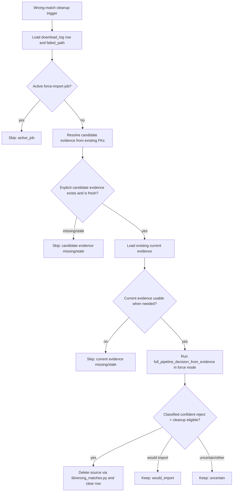

# refactor: Fold Wrong Matches triage into importer decisions

## Summary

Replace Wrong Matches' independent triage/cleanup authority with one shared
evidence-backed cleanup service. Existing Wrong Matches rows are backfilled
exactly once during this work. After that, the service uses explicit
candidate/current evidence FKs only, asks the full pipeline decider the
force-import question, and is used by the importer, web API, and CLI so
destructive cleanup has one rule and one summary shape.

Terminology in this plan:
- **Cleanup service** means the new service-layer decision authority.
- **Bulk triage action** means the operator-facing web/CLI trigger that calls
  the cleanup service.
- **Legacy triage/backfill** means the retired preview, measurement, and
  `wrong_match_triage` write paths.

---

## Problem Frame

PR #261 made candidate evidence canonical and made triage read the evidence FK
chain, but the active Wrong Matches surface still has a separate cleanup
decision module, preview/backfill triage paths, and several destructive web/CLI
entry points. Issue #259 is the live proof that any parallel cleanup authority
is too expensive: stale or sparse evidence can delete source material that the
actual preview/import evidence would have preserved.

---

## Requirements

Cited from
`docs/brainstorms/2026-05-16-wrong-match-triage-importer-branch-requirements.md`.

- R1. High-distance handling becomes an importer decision branch, not a
  post-hoc triage system.
- R2. Cleanup uses candidate/current evidence addressed by explicit evidence
  FKs. It does not infer evidence from legacy sibling/latest-import-job
  fallbacks.
- R3. Cleanup asks the unified pipeline decider the same force-mode question
  force import would ask.
- R4. Confident rejects may be deleted and cleared; would-import, uncertain,
  missing-evidence, or stale-evidence rows are kept for manual review.
- R5. Wrong Matches exposes one bulk triage action over the whole current Wrong
  Matches queue.
- R6. Before replacement cleanup is enabled, the current Wrong Matches queue is
  backfilled exactly once so rows have explicit evidence FKs. Runtime bulk
  cleanup is a read-only evidence consumer: it does not create evidence, run
  preview, run measurement, or use legacy sibling/latest-import-job inference.
- R7. Bulk triage reports deleted, kept would-import, kept uncertain, skipped
  evidence-unavailable/stale, and delete failures separately.
- R8. New active cleanup does not persist `validation_result.wrong_match_triage`.
  Historical blobs remain decodable for audit/history views.
- R8a. Web bulk cleanup requires `confirm_all_wrong_matches: true`; CLI bulk
  cleanup requires `wrong-match-triage --apply`. The replacement bulk action
  does not accept narrower request/limit/all scopes.
- R8b. Cleanup serializes deletion per source row/path/request with a
  DB/advisory lock, rechecks active import jobs inside the lock, and skips rows
  with active jobs referencing the same `download_log_id`, failed/source path,
  request, or source directory. Failed force-import cleanup may ignore its own
  `import_job_id`, but other active jobs still block deletion.
- R9. Old per-row/backfill triage stops being an active workflow. Per-row
  delete, group delete, and heuristic delete routes are removed as destructive
  cleanup surfaces; the confirmed full-queue bulk action is the only
  operator-triggered destructive Wrong Matches cleanup path.
- R10. Recents, History, and album detail do not depend on new
  `wrong_match_triage` writes.
- R11. CLI and web operator surfaces expose the same replacement capability and
  outcome categories.
- R12. The issue #259 sparse-vs-rich evidence loss shape is pinned as a
  regression.
- R13. Simulator-style and evidence-backed decisions agree for the affected
  album shape.
- R14. Tests prove no new active cleanup path writes
  `validation_result.wrong_match_triage`.

**Origin actors:** A1 operator, A2 importer, A3 Wrong Matches UI/CLI, A4
evidence store.

**Origin flows:** F1 new high-distance candidate reaches importer, F2 operator
runs bulk Wrong Matches triage, F3 operator reviews history after cleanup
changes.

**Origin acceptance examples:** AE1 high-distance confident reject deletes,
AE2 high-distance would-import keeps source, AE3 mixed bulk queue summary, AE4
missing evidence skips without writes, AE5 historical audit remains readable,
AE6 issue #259 shape does not re-delete.

---

## Scope Boundaries

- Do not redo PR #261's evidence model: content-addressed evidence,
  `candidate_evidence_id` / `current_evidence_id` FKs, `measurement.py`, and
  preview-measures-only are baseline.
- Do not recover the 64 already-deleted FLAC folders; that remains a separate
  data-recovery/requeue task.
- Do not change quality policy, beets distance thresholds, spectral thresholds,
  V0 policy, or verified-lossless behavior.
- Do not use legacy sibling/latest-import-job evidence inference for Wrong
  Matches cleanup.
- Do not add runtime evidence backfill to bulk cleanup. The current Wrong
  Matches queue is backfilled once as a rollout/implementation step.
- Do not remove historical `wrong_match_triage` decode/render compatibility
  unless implementation proves a reader can drop it safely.
- Do not add a persistent post-run Wrong Matches summary panel in this pass;
  toast-level web feedback plus the API/CLI summary is enough for now.

### Deferred to Follow-Up Work

- Data recovery for already-deleted source folders.
- Full UX redesign of Wrong Matches beyond replacing the cleanup controls and
  summary shape needed for this refactor.
- Persistent in-page post-run summary states for bulk cleanup, if toast-level
  feedback proves insufficient.

---

## Context & Research

### Relevant Code and Patterns

- `lib/quality.py::full_pipeline_decision_from_evidence` is the single decision
  function. Cleanup must not recreate narrower bitrate, spectral, or folder
  checks.
- `lib/import_evidence.py` and `lib/quality_evidence.py` are the evidence
  loading boundary. Cleanup must stop using legacy sibling/latest-job evidence
  inference and must not create evidence at runtime.
- `lib/wrong_matches.py` already owns filesystem deletion/dismissal mechanics.
  The new service should reuse `cleanup_wrong_match_source` and
  `dismiss_wrong_match_source`.
- `scripts/importer.py` already dismisses successful force-import jobs and
  attempts cleanup after failed force-import jobs. This is the importer-side
  seam to replace.
- `web/routes/imports.py`, `web/js/wrong-matches.js`, and
  `scripts/pipeline_cli.py` currently expose multiple overlapping cleanup
  affordances.
- Tests already cover Wrong Matches contracts in `tests/test_web_server.py`,
  queue/importer behavior in `tests/test_import_queue.py`, evidence and triage
  slices in `tests/test_integration_slices.py`, CLI wrappers in
  `tests/test_pipeline_cli.py`, and JS behavior in
  `tests/test_js_wrong_matches.mjs`.

### Institutional Learnings

- Repo standards require CLI/API parity for operator actions: the CLI and web
  API should be thin wrappers around the same service-layer method.
- Route changes require contract coverage and `TestRouteContractAudit`
  classification in `tests/test_web_server.py`.
- `docs/solutions/testing/contract-test-mocks-must-mirror-production-shape.md`
  and `docs/solutions/testing/mocked-contract-tests-miss-helper-mirror-integration-bugs.md`
  apply here: mocked route rows must mirror production shapes, or an
  integration slice must cover the real serialization path.
- `docs/solutions/web-rewrite-deferred-pending-runtime-redesign.md` warns that
  web routes orchestrate pipeline business logic; this plan should move cleanup
  decisions into `lib/` rather than adding more route-level logic.

### External References

- None. Local code and recent PR/plan history are the authoritative context.

---

## Key Technical Decisions

- **Create a shared cleanup service.** Web, CLI, auto high-distance cleanup, and
  force-import failure cleanup call one service/evaluator so outcome categories
  cannot drift.
- **Use canonical summary categories.** The cleanup service, web endpoint, and
  CLI JSON output use these stable summary keys: `deleted`,
  `kept_would_import`, `kept_uncertain`,
  `skipped_candidate_evidence_missing`,
  `skipped_candidate_evidence_stale`,
  `skipped_current_evidence_missing`,
  `skipped_current_evidence_stale`, `skipped_active_job`,
  `skipped_invalid_row`, `skipped_missing_path`, `skipped_operational`, and
  `delete_failed`.
- **Use literal force-mode facts.** Cleanup authorization uses
  `import_mode="force"` rather than the current cleanup-specific mode, matching
  the requirement that the question is "would this import if forced?"
- **Require explicit candidate evidence.** Fresh rejection rows must copy the
  originating import job's `candidate_evidence_id` onto `download_log`. Existing
  Wrong Matches rows are backfilled exactly once during rollout. Cleanup never
  authorizes deletion from latest-import-job or sibling evidence inference.
- **No runtime evidence repair.** If cleanup encounters missing or stale
  candidate/current evidence after the one-time backfill, it keeps the source
  and reports the skip. Runtime cleanup does not run preview, measurement, or
  evidence creation.
- **Clear only authorized duplicates.** After an evaluated representative row
  is authorized and its source is deleted, cleanup may clear duplicate rejected
  rows for the same `request_id` and exact failed path/path candidates. It must
  not clear other requests or other paths.
- **Serialize destructive cleanup.** The service acquires a per-source cleanup
  lock before deletion, rechecks active jobs under the lock, and holds the lock
  through filesystem deletion and DB clearing. This is not a global queue lock.
  Failed-force-import cleanup keeps the existing behavior and passes its own
  `import_job_id` as the only ignored active job; any other matching active job
  still blocks deletion.
- **Keep old audit rendering, stop new writes.** Historical
  `wrong_match_triage` blobs can still render, but new active cleanup does not
  write that blob or depend on it.
- **Remove per-row destructive cleanup.** Per-row delete and group delete
  controls/routes do not survive as cleanup affordances. Operators can still
  inspect, force import, dismiss, or run the confirmed full-queue bulk action.
- **Remove heuristic cleanup controls.** The transparent-non-FLAC and
  lossless-Opus cleanup buttons encode separate eligibility concepts. Remove or
  hide them in this pass; bulk cleanup is not filter-scoped.

---

## Open Questions

### Resolved During Planning

- Exact replacement shape for bulk action: use one shared service with web and
  CLI wrappers that operate on the whole current Wrong Matches queue. The web
  endpoint requires `confirm_all_wrong_matches: true`; CLI requires
  `--apply`.
- Historical display policy: keep compatibility rendering for old
  `wrong_match_triage` blobs, but do not add a replacement persistent cleanup
  blob in this pass. New rows without persisted cleanup data render rejection
  facts or no cleanup chip; service outcomes appear in the immediate action
  summary only unless a separate persisted event is explicitly introduced later.
- Existing per-row delete policy: remove per-row delete and group delete as
  destructive cleanup surfaces. Heuristic bulk deletes are retired.
- Legacy active cleanup modules/tests: delete them. Do not keep wrapper or
  deprecation paths for `lib/wrong_match_cleanup_decision.py`,
  `lib/wrong_match_triage.py`, `tests/test_wrong_match_cleanup_decision.py`,
  or `tests/test_wrong_match_triage.py`.

### Deferred to Implementation

- Exact names of service result structs and outcome strings, as long as CLI/API
  JSON keys stay identical and cover the required categories.
- Whether any historical rendering tests can be simplified after new writes to
  `wrong_match_triage` stop.

---

## High-Level Technical Design

> *This illustrates the intended approach and is directional guidance for
> review, not implementation specification. The implementing agent should treat
> it as context, not code to reproduce.*

For the bulk action, the service enumerates the whole current Wrong Matches
queue, consumes explicit evidence FKs, evaluates each row independently, and
returns a typed summary. Evaluation never uses latest-import-job or sibling
evidence fallback as deletion authority and never creates evidence.
Delete/dismiss filesystem effects continue to flow through
`lib/wrong_matches.py` so path-clearing behavior stays centralized.

---

## Implementation Units

### U1. Shared Evidence-Only Cleanup Service

**Goal:** Introduce one service-layer evaluator and bulk runner for Wrong
Matches cleanup, with typed results shared by importer, CLI, and web API.

**Requirements:** R2, R3, R4, R5, R6, R7, R8, R12, R13, R14. Covers F1, F2,
AE3, AE4, AE6.

**Dependencies:** None.

**Files:**
- Create: `lib/wrong_match_cleanup_service.py`
- Delete: `lib/wrong_match_cleanup_decision.py`
- Delete: `lib/wrong_match_triage.py`
- Modify: `lib/import_evidence.py`
- Modify: `lib/quality_evidence.py`
- Modify: `lib/pipeline_db.py`
- Modify: `tests/fakes.py`
- Delete: `tests/test_wrong_match_cleanup_decision.py`
- Delete: `tests/test_wrong_match_triage.py`
- Test: `tests/test_wrong_match_cleanup_service.py`
- Test: `tests/test_fakes.py`
- Test: `tests/test_integration_slices.py`

**Approach:**
- Define typed result structs for one-row evaluation and bulk summary. These
  structs cross CLI/API JSON, so use `msgspec.Struct`.
- Resolve cleanup evidence from explicit FK references only. For fresh rows,
  use the explicit `download_log.candidate_evidence_id` copied from the
  originating import job.
- Add a one-time rollout/backfill step for the current Wrong Matches queue.
  This may create evidence and write missing FKs before the new cleanup path is
  enabled; it is not called by runtime bulk cleanup.
- Add or adjust DB helpers so the service can detect active force-import jobs
  for a `download_log_id`.
- Remove or bypass latest-import-job/sibling evidence lookup for cleanup
  authorization; that fallback is not allowed to authorize deletion.
- Add a per-source cleanup lock helper. The service must acquire it before
  destructive cleanup, recheck active jobs under the lock, and hold it through
  filesystem deletion and DB path clearing.
- Load existing current evidence only. If current evidence is required but
  missing or stale, skip cleanup and report the reason.
- Call `full_pipeline_decision_from_evidence` with
  `AlbumQualityEvidenceDecisionFacts(import_mode="force", ...)`, classify the
  result, and delete only confident-reject cleanup-eligible rows.
- Reuse `cleanup_wrong_match_source` for filesystem deletion and path clearing.
  Do not write `record_wrong_match_triage`, `preview_import_from_download_log`,
  or measurement output.
- Delete the old active triage/cleanup-decision modules after call sites move.
  No production runtime path may import `lib.wrong_match_triage` or
  `lib.wrong_match_cleanup_decision`.
- Ensure path clearing is bounded to the evaluated row's `request_id` and exact
  failed path/path candidates. Duplicate rejected rows for that exact
  request/path may be cleared after deletion; unrelated requests and paths must
  not be cleared.

**Execution note:** Start test-first with the issue #259 sparse-vs-rich
evidence regression and a mixed-bulk summary test before changing call sites.

**Patterns to follow:**
- `lib/wrong_matches.py` for cleanup/dismiss result shape.
- `lib.search_plan_service.SearchPlanService` style for a service consumed by
  both CLI and web wrappers.
- `tests/fakes.py` self-tests for every new fake DB method.

**Test scenarios:**
- Covers AE3. Mixed queue with confident reject, would-import, uncertain,
  missing evidence, stale evidence, active job, invalid row, missing path, and
  delete failure returns distinct counts and deletes only confident rejects.
- Covers AE4. Missing candidate evidence at runtime skips without calling
  `preview_import_from_download_log`, measurement, evidence creation, or
  `record_wrong_match_triage`.
- Stale candidate evidence is not trusted and skips.
- Missing/stale required current evidence skips and does not backfill.
- Active force-import job for a row skips cleanup.
- Race guard: if a matching active job appears between initial enumeration and
  deletion, the under-lock recheck skips cleanup.
- Covers AE6. Sparse sibling/latest-import-job evidence cannot authorize
  deletion; cleanup uses only the row's explicit evidence FK.
- Duplicate clearing clears same-request exact path/path-candidate duplicates
  only, and does not clear another request or another failed path.

**Verification:**
- Service tests cover every outcome category.
- Grep production cleanup service tests for preview/measurement calls and assert
  those mocks are not called on cleanup paths.

---

### U2. Wire High-Distance Rejections Through the Service

**Goal:** Replace post-rejection auto triage with an importer-owned
high-distance cleanup branch that links each rejection row to its originating
candidate evidence.

**Requirements:** R1, R2, R3, R4, R8, R12, R13, R14. Covers F1, AE1, AE2,
AE6.

**Dependencies:** U1.

**Files:**
- Modify: `lib/download.py`
- Modify: `lib/pipeline_db.py`
- Modify: `tests/fakes.py`
- Test: `tests/test_download.py`
- Test: `tests/test_integration_slices.py`
- Test: `tests/test_pipeline_db.py`

**Approach:**
- Remove or replace `_run_post_rejection_wrong_match_triage`.
- When a rejected auto-import has an originating `import_job_id`, copy that
  job's `candidate_evidence_id` onto the newly-created `download_log` row before
  cleanup evaluation. This closes the wrong-sibling evidence hazard.
- Invoke the shared cleanup service for eligible high-distance/wrong-match
  rejections after the `download_log` row exists.
- Keep rows with would-import, uncertain, missing evidence, stale evidence, or
  active job states visible for manual review.
- Ensure bad-file buckets that are intentionally excluded from Wrong Matches do
  not route into this cleanup branch.

**Execution note:** Characterization-first around current rejected-import log
creation, then modify the branch.

**Patterns to follow:**
- Current rejection logging in `lib/download.py`.
- Candidate evidence FK setters in `lib/pipeline_db.py`.
- Existing integration slices around rejected imports in
  `tests/test_integration_slices.py`.

**Test scenarios:**
- Covers AE1. High-distance confident reject with originating candidate evidence
  deletes/clears the source, writes no `wrong_match_triage`, and runs no
  preview/measurement.
- Covers AE2. High-distance would-import keeps the source and leaves the row
  visible.
- Wrong evidence guard: two import jobs for the same request have different
  evidence; the rejection row uses the originating job evidence, not latest
  sibling evidence.
- Bad-file scenarios excluded from Wrong Matches do not invoke the service.
- `download_log.candidate_evidence_id` is set to the originating job evidence
  for fresh high-distance rows.

**Verification:**
- Fresh high-distance rejection can be explained as "importer asked force-mode
  decider, then deleted or kept." No preview/triage audit path remains in the
  rejection flow.

---

### U3. Replace Force-Import Failure Cleanup

**Goal:** Make failed force-import cleanup use the same evidence-only service
and skip operational failures.

**Requirements:** R2, R3, R4, R8, R9, R14.

**Dependencies:** U1.

**Files:**
- Modify: `scripts/importer.py`
- Test: `tests/test_import_queue.py`
- Test: `tests/test_integration_slices.py`

**Approach:**
- Replace `_cleanup_failed_force_import`'s dependency on
  `decide_wrong_match_cleanup` with the shared cleanup service.
- Pass the current import job id as `ignore_import_job_id` so a failed
  force-import job does not block its own terminal cleanup, while any other
  active matching job still blocks deletion.
- Run cleanup only for terminal evidence-backed confident rejects. Preserve the
  source and wrong-match pointer for deferred lock contention,
  requeued-for-preview, requeue failure, path missing, no JSON, timeout,
  exception, and other operational failures.
- Continue dismissing successful force-import rows through
  `dismiss_wrong_match_source`.
- Preserve the current importer result payload enough for operators to see why
  cleanup was skipped or applied, without writing `wrong_match_triage`.

**Execution note:** Test the force-import failure matrix before removing the
old cleanup decision dependency.

**Patterns to follow:**
- Existing success dismissal in `scripts/importer.py`.
- Existing force-import cleanup tests in `tests/test_import_queue.py`.

**Test scenarios:**
- Evidence-backed confident reject deletes/clears through the service.
- A failed force-import job can clean up its own terminal confident reject, but
  skips when another active matching job exists.
- Would-import and uncertain force-mode answers keep the source.
- Missing/stale candidate evidence keeps the source.
- Missing/stale candidate evidence keeps the source; failed force-import
  cleanup does not backfill evidence at runtime.
- `DISPATCH_CODE_REQUEUED_FOR_PREVIEW` and `DISPATCH_CODE_REQUEUE_FAILED` keep
  the source and do not call cleanup deletion.
- Operational failures keep the source and do not call cleanup deletion.

**Verification:**
- Failed force-import cleanup and high-distance cleanup return the same outcome
  categories for the same evidence shape.

---

### U4. Web API and Wrong Matches UI

**Goal:** Replace overlapping web cleanup actions with one confirmed full-queue
bulk triage action and remove per-row/group/heuristic destructive cleanup
routes.

**Requirements:** R5, R6, R7, R8, R9, R10, R11, R14. Covers F2, F3, AE3, AE4,
AE5.

**Dependencies:** U1.

**Files:**
- Modify: `web/routes/imports.py`
- Modify: `web/js/wrong-matches.js`
- Modify: `web/js/main.js`
- Test: `tests/test_web_server.py`
- Test: `tests/test_js_wrong_matches.mjs`
- Test: `tests/test_js_recents.mjs`
- Test: `tests/test_js_history.mjs`

**Approach:**
- Rework `POST /api/wrong-matches/triage` into the replacement bulk action.
  It takes no row/filter scope, enumerates the whole current Wrong Matches queue
  server-side, requires `confirm_all_wrong_matches: true`, and returns the
  service summary.
- Add a top-level Wrong Matches bulk triage action that triggers the service and
  displays the category counts. The browser confirmation should state that the
  action processes the whole Wrong Matches queue and deletes only force-mode
  confident rejects.
- Remove per-row delete and group delete controls/routes as destructive cleanup
  affordances.
- Remove heuristic bulk cleanup buttons/routes for transparent non-FLAC and
  lossless-Opus.
- Update Converge's unmatched cleanup path to call the shared service for
  non-green rows rather than its own cleanup helper.
- Keep force-import and explorer/playback review controls unchanged.

**Patterns to follow:**
- Existing `_WebServerCase` route contract tests in `tests/test_web_server.py`.
- Existing in-place Wrong Matches refresh patterns in `web/js/wrong-matches.js`.
- Existing JS tests in `tests/test_js_wrong_matches.mjs`.

**Test scenarios:**
- Covers AE3. Bulk endpoint returns required category keys and deletes only
  confident rejects from a mixed mocked queue.
- Bulk endpoint rejects requests missing `confirm_all_wrong_matches: true`.
- Covers AE4. Missing evidence response contains the skip count and no audit
  write occurs.
- Per-row delete and group delete routes are removed or return a deliberate
  retired-route response; tests prove they cannot delete files.
- Converge unmatched cleanup routes through service and keeps skipped rows
  visible.
- Route audit includes any added/changed route.
- JS bulk triage action posts to the new endpoint, renders a summary toast, and
  refreshes Wrong Matches.
- Removed heuristic buttons no longer render.

**Verification:**
- Web and JS tests prove the UI has one cleanup authority and that no frontend
  workflow can bypass service outcomes.

---

### U5. CLI Parity and Command Cleanup

**Goal:** Make CLI Wrong Matches cleanup a thin wrapper around the same service
and retire preview/backfill semantics.

**Requirements:** R5, R6, R7, R8, R9, R11, R14. Covers F2, AE3, AE4.

**Dependencies:** U1.

**Files:**
- Modify: `scripts/pipeline_cli.py`
- Test: `tests/test_pipeline_cli.py`

**Approach:**
- Keep or rename `wrong-match-triage` as the CLI entry point for the shared
  cleanup service. Its bulk mode should process the whole current Wrong Matches
  queue and expose the same JSON outcome keys as the web endpoint.
- Remove `wrong-match-preview-backfill` entirely. It conflicts with the
  requirement that runtime cleanup does not create evidence.
- Preserve destructive guards: bulk apply still requires `--apply`, but does
  not accept a narrower request/limit/all scope.
- Map service outcomes to existing exit-code conventions. Mixed successful
  processing with skipped rows should still be exit 0; input/scope errors
  remain non-zero.

**Patterns to follow:**
- Existing CLI JSON and route contract tests for operator actions.
- Existing CLI JSON tests in `tests/test_pipeline_cli.py`.

**Test scenarios:**
- CLI JSON mode over a mixed queue returns the same category keys and counts as
  the web endpoint over the same seeded rows.
- CLI refuses destructive bulk triage without `--apply`.
- Request, limit, or all-scope flags are removed or rejected for the replacement
  bulk action.
- `wrong-match-preview-backfill` parser/handler is gone.
- CLI does not import old triage functions after migration.

**Verification:**
- A single service method can be identified as the implementation behind both
  the CLI and web bulk action.

---

### U6. History Compatibility and Documentation

**Goal:** Preserve historical audit readability while documenting the new
cleanup architecture and stopping new active triage writes.

**Requirements:** R8, R10, R14. Covers F3, AE5.

**Dependencies:** U1, U2, U3, U4, U5.

**Files:**
- Modify: `web/classify.py`
- Modify: `web/download_history_view.py`
- Modify: `web/routes/pipeline.py`
- Modify: `docs/pipeline-db-schema.md`
- Test: `tests/test_web_recents.py`
- Test: `tests/test_web_server.py`
- Test: `tests/test_library_album_detail_service.py`

**Approach:**
- Keep decode/render support for existing `validation_result.wrong_match_triage`
  blobs as display-only history.
- Ensure rows without a triage blob still render cleanly in Recents, History,
  and album detail. They should show rejection facts or no cleanup chip by
  design, not infer a cleanup outcome from a transient response summary.
- Fix the stale label hazard by deriving new display text from stable scenario
  or actual service outcome where available, not substring matching a stage
  chain for new rows.
- Update docs to state that Wrong Matches cleanup is an importer/service branch,
  not a preview/triage authority, and that active cleanup does not write
  `wrong_match_triage`.

**Patterns to follow:**
- Existing history compatibility tests for old triage blobs.
- Documentation style in `docs/pipeline-db-schema.md`.

**Test scenarios:**
- Covers AE5. Historical `wrong_match_triage` rows still render the old chip and
  detail fields.
- New rows without `wrong_match_triage` do not crash and render rejection facts
  or no cleanup chip by design.
- No production path in the new service writes
  `validation_result.wrong_match_triage`.
- Stage-chain substring mislabel does not apply to new cleanup status.

**Verification:**
- Grep confirms no new active cleanup service call writes
  `record_wrong_match_triage`.

---

### U7. Regression and Test Harness Completion

**Goal:** Pin the issue #259 live-loss shape and make affected JS tests part of
the normal suite.

**Requirements:** R12, R13, R14. Covers AE6.

**Dependencies:** U1, U2, U3, U4, U5.

**Files:**
- Modify: `tests/test_quality_classification.py`
- Modify: `tests/test_integration_slices.py`
- Modify: `scripts/run_tests.sh`
- Delete: `tests/test_wrong_match_cleanup_decision.py`
- Delete: `tests/test_wrong_match_triage.py`
- Test: `tests/test_js_wrong_matches.mjs`
- Test: `tests/test_js_history.mjs`

**Approach:**
- Add a pure decision regression for the Technicolour Sleep / Mountain Goats
  Flux shape using the existing live-bug fixture style.
- Add an evidence-backed orchestration regression where sparse historical
  download-log evidence would delete but richer originating candidate evidence
  would import. The expected outcome is keep, not delete.
- Add a guard that active cleanup never calls preview/measurement/backfill and
  never writes `wrong_match_triage`.
- Ensure `tests/test_js_wrong_matches.mjs` and `tests/test_js_history.mjs` run
  from the standard test script so cleanup-control and history-rendering
  regressions are covered automatically.

**Patterns to follow:**
- `tests/test_quality_classification.py::TestLiveBugReproductions` and
  `TestLiveBugReproductionsThroughEvidencePipeline`.
- Existing high-risk integration slices in `tests/test_integration_slices.py`.

**Test scenarios:**
- Covers AE6. Pure decider says the rich candidate shape would import or at
  least is not deletion-authorizing.
- Covers AE6. Evidence-backed cleanup keeps the source when sparse and rich
  evidence disagree.
- Wrong Matches and History JS test files are executed by the normal test
  script.
- No test references old active `triage_wrong_match`,
  `triage_wrong_matches`, `backfill_wrong_match_previews`,
  `lib.wrong_match_triage`, or `lib.wrong_match_cleanup_decision`. Historical
  compatibility tests may use literal `wrong_match_triage` JSON blobs only.

**Verification:**
- Full test run includes Python and JS coverage for the new cleanup surface.

---

## System-Wide Impact

- **Interaction graph:** cleanup triggers currently span auto rejection,
  force-import failure, web actions, CLI commands, Converge, and history views.
  The shared service becomes the only destructive decision point.
- **Error propagation:** evidence gaps and operational failures are reported as
  skip categories, not as deletion authorization.
- **State lifecycle risks:** stale or ambiguous evidence must keep source
  folders. Active force-import jobs must block cleanup so a queued import does
  not lose its source.
- **API surface parity:** web and CLI wrappers must expose identical summary
  categories.
- **Integration coverage:** destructive cleanup needs service, CLI, API, JS, and
  importer slices because mocks alone can miss the wrong evidence or path
  clearing behavior.
- **Unchanged invariants:** force import still bypasses only beets distance;
  quality policy still lives in `full_pipeline_decision_from_evidence`;
  preview remains the evidence producer.

---

## Risks & Dependencies

| Risk | Mitigation |
|------|------------|
| Cleanup picks the wrong candidate evidence for historical rows | Backfill the current Wrong Matches queue exactly once, require explicit row FKs at runtime, and never use latest sibling evidence. |
| Removing old triage breaks history pages | Keep historical `wrong_match_triage` decode/render tests while stopping new writes. |
| Retired per-row/group/heuristic routes still delete files | Remove the routes or return deliberate retired-route responses; cover them in web tests. |
| CLI and API summary shapes drift | Make both wrappers serialize the same service result structs; add parity tests. |
| Destructive cleanup removes source for active queued import | Service locks per source, rechecks active jobs inside the lock, and skips matching active jobs other than an explicit `ignore_import_job_id`. |
| Mocked route rows hide serialization bugs | Use production-shaped mock rows or pair route contracts with integration slices. |

---

## Documentation / Operational Notes

- Update `docs/pipeline-db-schema.md` to describe Wrong Matches cleanup as an
  existing-evidence consumer and remove the active preview/backfill narrative.
- Note that `wrong_match_triage` JSONB is historical display data only after
  this refactor.
- After deploy, useful manual smoke checks are: a bulk triage dry run/summary
  over the current queue, one force-import failure that preserves source on
  non-evidence failure, and grep of logs for unexpected preview/measurement
  calls from cleanup.

---

## Sources & References

- Origin document:
  `docs/brainstorms/2026-05-16-wrong-match-triage-importer-branch-requirements.md`
- Issue: #259
- Baseline PR: #261
- Baseline plan:
  `docs/plans/2026-05-16-002-refactor-evidence-canonical-cleanup-plan.md`
- Related architecture docs: `docs/pipeline-db-schema.md`
- Relevant implementation files: `lib/wrong_match_cleanup_decision.py`,
  `lib/wrong_match_triage.py`, `lib/wrong_matches.py`, `lib/import_dispatch.py`,
  `lib/download.py`, `scripts/importer.py`, `scripts/pipeline_cli.py`,
  `web/routes/imports.py`, `web/js/wrong-matches.js`
