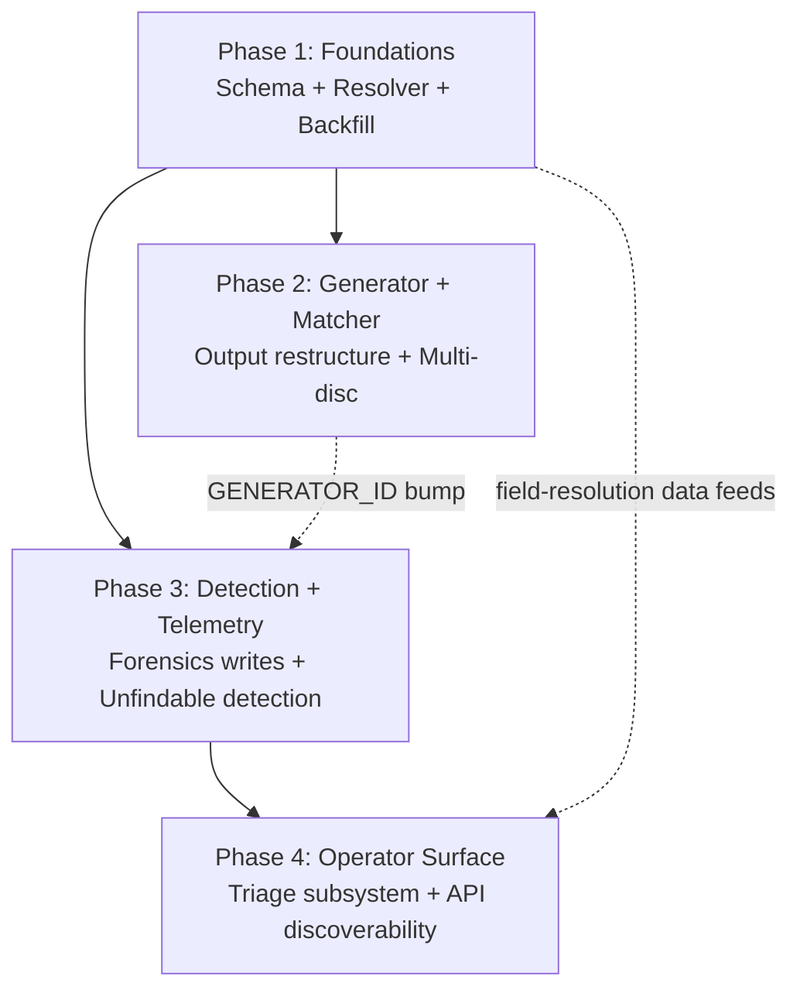
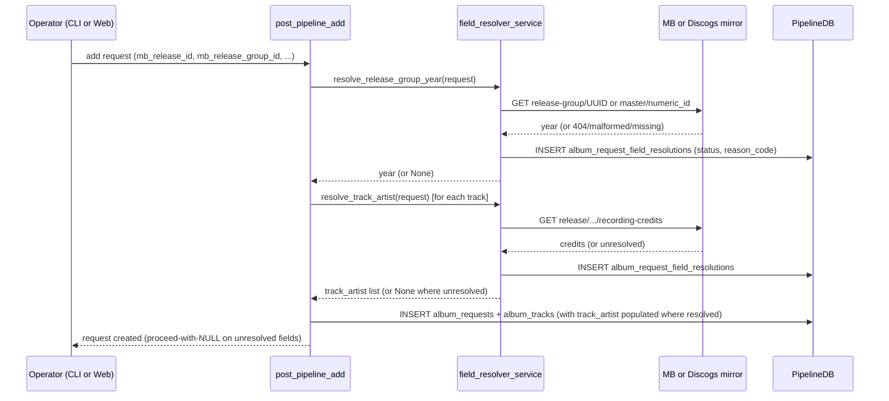

# feat: Search-plan iteration 2 and request observability subsystem

## Summary

Second iteration of the search-plan generator built on 5.5 days of post-deploy data from the 2026-05-19-1 entropy work, plus a new operator-facing observability subsystem that surfaces unfindable albums, metadata-quality gaps, and per-search forensics through one composable triage API.

Four phases delivered as four PRs / four `ce-work` sessions:

- **Phase 1 (PR1) — Foundations.** Schema migrations, dual-source field resolver service, backfill scripts (track_artist, release_group_year + release_group_id), inline enqueue-time field resolution, VA detection. Operator-driven backfill executed during a controlled deploy window (cratedigger stopped → script run → cratedigger restarted).
- **Phase 2 (PR2) — Generator + matcher.** Stopword cleanup (single canonical function), distinctiveness-ranked track selection, generator strategy mix overhaul (retire `literal_lossless`, add `catalog_number` and `track_3_artist` slots, VA-specific mix), single `SEARCH_PLAN_GENERATOR_ID` bump, wildcard-mask rationale documentation, multi-disc subfolder investigation document, multi-disc matcher aggregation redesign.
- **Phase 3 (PR3) — Detection + telemetry.** Wire `search_log` forensics column writes, materialise `failure_class` at plan-wrap, ship `request_search_summary` view, catalog-probe-grounded unfindable detection service with 4-category taxonomy, long-tail-rescue event capture on unfindable→found transitions.
- **Phase 4 (PR4) — Operator surface.** Triage service layer with `msgspec.Struct` typed results, `pipeline-cli triage` subcommands, `/api/triage` endpoints, `/api/_index` discoverability endpoint, `pipeline-cli routes` subcommand, route description metadata enforced by the existing `TestRouteContractAudit`.

The plan does **not** loosen the matcher's strict count gate (the wrong-pressing rejection pattern is correct behaviour). It does **not** auto-throttle search cadence on unfindable categorisation. Both are core product invariants from the origin brainstorm.

---

## Problem Frame

See origin: `docs/brainstorms/2026-05-25-search-plan-iteration-2-requirements.md`. The full data-grounded findings live at `docs/brainstorms/2026-05-25-search-plan-post-deploy-findings.md`.

Five and a half days post-deploy of the 2026-05-19-1 generator showed saturation dropped from ~3% to 0.45% (the entropy work delivered) but exposed a different dominant failure mode: 422 of 832 wanted requests (51%) sit in cohort B with peer candidates every search and zero finds. Drill-down via direct slskd probing classified the cohort across three sub-patterns:

- ~280 requests are bonus-track / wrong-pressing: peers serve a sibling release-group release with different track count, the strict count gate at `lib/matching.py:451` rejects (correctly — substituting would violate the strict-pressing curation invariant).
- ~30 requests are multi-disc subfolder layouts (Kate Bush Aerial pattern): peers split into `CD 1/` and `CD 2/` siblings, matcher only sees the leaf.
- 28 requests are 1-track releases (singles / promos / demos) that cannot exist as standalone folders on the network.

Plus three other observed failure modes:

- 119 of 832 (14%) sit in cohort A — zero results dominant, 94% confirmed network-absent by direct slskd probing. The system needs visibility, not throttling.
- 34 VA requests (3.7% of active) account for 26% of all near-cap saturation events (10× the non-VA rate). The `Various` / `Various Artists` tokens get stripped as low-entropy, queries collapse to title-only.
- `literal_lossless` strategy ran 2,093 times in 5.5 days and produced 1 successful match. 13% of search volume on a slot the network doesn't tag for.
- 78 wanted requests have `mb_release_group_id` set but `release_group_year` NULL; 9 are numeric Discogs master IDs the previous backfill 404s against the MB mirror.

The investigation also surfaced that *why* a `no_match` happened is never recorded as structured data — every triage required walking JSONB to reconstruct rejection cause.

This iteration ships the operator-facing surfaces that make the post-deploy data legible, the generator/matcher changes the data justifies, and the schema/backfill plumbing that unblocks future iterations.

---

## Requirements

Carried from origin (`docs/brainstorms/2026-05-25-search-plan-iteration-2-requirements.md`). The origin numbers R1-R36; each Implementation Unit below cites the R-IDs it advances.

### Generator and matcher (R1-R9)

- R1. Retire `literal_lossless` strategy slot.
- R2. Add `catalog_number` strategy slot (dual-source: MB `labels[*].catalog-number`, Discogs `labels[*].catno`).
- R3. Add `track_3_artist` strategy slot.
- R4. Distinctiveness-ranked track selection for track-fallback slots (simple scoring, no IDF/ML).
- R5. Stopword strip cleanup — single canonical function/constant, all callers route through it; set contents unchanged.
- R6. Wildcard-all-tokens stays — document rationale in code and CLAUDE.md.
- R7. Multi-disc subfolder aggregation investigation document precedes redesign.
- R8. Multi-disc subfolder aggregation redesign — matcher recognises sibling subdirs matching `(?i)(disc|cd|digital media|side)\s*\d+` under a common parent.
- R9. Single `SEARCH_PLAN_GENERATOR_ID` bump captures all generator-output changes.

### Per-track-artist schema (R10-R13)

- R10. Add `album_tracks.track_artist TEXT`.
- R11. Dual-source uniform backfill of `track_artist` for MB and Discogs.
- R12. VA detection via primary-artist-credit identity (MB MBID `89ad4ac3-39f7-470e-963a-56509c546377`; Discogs ID `194`).
- R13. VA-specific strategy mix in the generator (drop `default`/`literal`/`literal_flac`, add `<track_artist> <track_title>` × 2-3 distinctive tracks, add compilation-series slot).

### Field-level data-quality telemetry (R14-R17)

- R14. Add `album_request_field_resolutions` side table.
- R15. Track resolution attempts for `mb_release_group_id`, `release_group_year`, `track_artist`, `catalog_number`.
- R16. Inline field resolution at enqueue time, proceed-with-NULL on failure.
- R17. Dual-source uniform backfill of field resolutions.

### Unfindable cohort detection (R18-R21)

- R18. Catalog-probe-grounded unfindable detection (periodic artist-only probe per cohort member).
- R19. 4-category unfindable taxonomy: `artist_absent`, `album_absent_artist_present`, `one_track_structural`, `wrong_pressing_available`.
- R20. Unfindable detection is purely descriptive — cadence never changes based on categorisation.
- R21. Long-tail-rescue event captured on unfindable→found transitions.

### Search-log forensics (R22-R29)

- R22. `search_log.rejection_reason TEXT`.
- R23. `search_log.result_count_uncapped INTEGER`.
- R24. `search_log.query_token_count` + `query_distinct_token_count`.
- R25. `search_log.expected_track_count INTEGER`.
- R26. `search_log.matcher_score_top1 FLOAT`.
- R27. `search_log.query_template TEXT`.
- R28. `album_requests.failure_class TEXT` populated at plan-wrap.
- R29. `request_search_summary` SQL view.

### Triage subsystem (R30-R33)

- R30. One composable triage subsystem composing unfindable + field-quality + search-forensics domains.
- R31. `pipeline-cli triage <request_id>` per-request view.
- R32. `pipeline-cli triage list --filter=<filter>` cohort listings.
- R33. `/api/triage/<id>` and `/api/triage/list` endpoints with the same JSON shape.

### API discoverability (R34-R36)

- R34. `/api/_index` self-documenting endpoint.
- R35. `pipeline-cli routes` CLI subcommand.
- R36. Description metadata on every registered route, enforced by extended `TestRouteContractAudit`.

**Origin acceptance examples carried forward:** AE1-AE9. Each is anchored to specific Implementation Units below.

---

## Scope Boundaries

Carried from origin's Scope Boundaries section.

### Out of scope (this iteration)

- Release-group-aware sibling-pressing surfacer + operator Replace flow. The `wrong_pressing_available` category detects the cohort; the rich "we have the 10-track standard available — Replace?" UX is a separate future brainstorm.
- UI consumption of the new APIs. Dashboard filters, web-UI long-tail-rescue notifications, browser-side triage views — all separate iteration.
- Aggressive stopword removal (the "kill the set entirely" path from the brainstorm's option B.2).
- Wildcard-mask redesign — R6 documents the rationale; behaviour unchanged.
- Matcher count-gate loosening (curation invariant violation).
- Search cadence throttling on unfindable status (archival watch invariant).
- Cohort D (`found_but_no_import`, 145 requests) — different failure mode, separate brainstorm.

### Deferred to Follow-Up Work

- Per-track-artist generator integration for non-VA requests. R10/R11 fill the column for every existing `album_tracks` row regardless of source, but R13 only consumes `track_artist` for VA strategy mix. Non-VA "featured artist" search shapes (e.g. `<lead_artist> feat <guest> <track_title>`) are a future iteration's question; the data is ready when needed.
- Future per-field operator actions on the data-quality cohort (manual override, "ignore this field," "schedule a re-resolution attempt") — the API surfaces the cohort; explicit per-row operator actions can ride on top in a follow-up.

---

## Context & Research

### Relevant code and patterns

- `lib/search.py` — generator entry point. `SEARCH_PLAN_GENERATOR_ID` at line 35. Strategy helpers (`build_query`, `cap_tokens`, `strip_short_tokens`, `wildcard_artist_tokens`). `generate_search_plan` is the dispatcher.
- `lib/matching.py` — pre-filter at lines 350-356 (asymmetric `search_count > 2 * track_num` from R1 of the previous iteration); strict count gate at line 451 (`tracks_info["count"] != track_num`). `album_match` filename-similarity scoring.
- `lib/search_plan_service.py` — `SearchPlanService` with `dry_run_for_request`, `regenerate`, `saturation` already in place. New triage service follows the same shape.
- `lib/mbid_replace_service.py` and `lib/beets_distance.py` — canonical examples of the "service first, glue follows" pattern (`docs/solutions/architecture/service-first-then-glue.md`). Typed `msgspec.Struct` result, injectable collaborators, integration slice as authority, CLI + HTTP wrappers thin on top.
- `lib/pipeline_db.py` — CRUD + advisory locks. Autocommit mode required (see `.claude/rules/pipeline-db.md`).
- `lib/migrator.py` — versioned migrations under `migrations/NNN_name.sql`. Next number: **027**.
- `lib/quality.py` — `CandidateScore` `msgspec.Struct` is the wire-boundary type for `search_log.candidates`. Extended by previous iteration with `pre_filter_skip: bool`.
- `web/routes/pipeline.py` — request-add (`post_pipeline_add` uses `parse_body` + Pydantic `PipelineAddRequest`), existing search-plan endpoints. The new `/api/triage/*` and `/api/_index` routes land here.
- `web/mb.py` — MB mirror client. `get_release_group_year(rg_mbid)` already exists; extension for numeric IDs needed.
- `web/discogs.py` — Discogs mirror client (`discogs.ablz.au`). Master / release / artist endpoints already used.
- `scripts/pipeline_cli.py` — existing search-plan subcommands (`show`, `regenerate`, `dry-run`, `saturation`). New `triage`, `triage list`, `routes` subcommands land here following the same argparse pattern.
- `scripts/backfill_release_group_year.py` — existing backfill script from the previous iteration. The new dual-source resolver supersedes its MB-only path.
- `Handler._FUNC_GET_ROUTES`, `_FUNC_POST_ROUTES`, `_FUNC_GET_PATTERNS` in `web/server.py` — dispatch tables introspected by `/api/_index`.
- `tests/test_web_server.py::TestRouteContractAudit::CLASSIFIED_ROUTES` — every new route must be registered or the audit fails. Extended in R36 to also require description metadata.
- `tests/fakes.py::FakePipelineDB` — existing stateful fake. Extended for new schema columns and new DB methods.
- `tests/helpers.py` — existing builders (`make_request_row`, `make_import_result`, `make_validation_result`).

### Institutional learnings

- `docs/solutions/architecture/service-first-then-glue.md` — directly applies to the triage subsystem (Phase 4). Order: pure logic → typed result → guardrail before IO → one cache protocol → service ships green before wrappers exist → CLI + HTTP same PR or next, never later. Reference architecture for U17-U19.
- `docs/solutions/testing/contract-test-mocks-must-mirror-production-shape.md` — every API contract test for the new triage endpoints must populate mocks with `datetime.datetime` timestamps, `uuid.UUID` IDs, typed dataclasses for JSONB. Synthetic int/str dicts pass Pyright but 500 in prod.
- `docs/solutions/testing/mocked-contract-tests-miss-helper-mirror-integration-bugs.md` — contract tests don't catch integration bugs; the triage subsystem needs a slice in `tests/test_integration_slices.py` round-tripping through real serialization.
- `docs/persisted-search-plans-rollout.md` — `SEARCH_PLAN_GENERATOR_ID` bump protocol; `test_generator_id_constant_is_pinned` guard. The Phase 2 generator output changes constitute a single bump.
- `docs/brainstorms/2026-05-19-search-plan-entropy-requirements.md` + `docs/plans/2026-05-19-001-feat-search-plan-entropy-and-matcher-prefilter-plan.md` — prior iteration's structure is the template for this plan's shape.

### Constraints from project rules

- `CLAUDE.md` § "CLI ⇄ API surface symmetry" — every operator action exposed on both surfaces, wrapping the same service-layer method. Required for every new R31-R33 + R34-R35 endpoint pair.
- `.claude/rules/code-quality.md` § "Wire-boundary types — `msgspec.Struct`" — every type crossing JSON (triage payloads, route responses, JSONB blobs) is `msgspec.Struct` with one-site decoding via `msgspec.convert`. Field-resolution status enum lives on a Struct.
- `.claude/rules/code-quality.md` § "HTTP request bodies — `pydantic.BaseModel`" — new POST routes use `parse_body` + a Pydantic `*Request` model.
- `.claude/rules/code-quality.md` § "Testing — Red/Green TDD" — write tests first. Carried as Execution note on every feature-bearing unit.
- `.claude/rules/code-quality.md` § "MOCKS: LEAF-SEAM ONLY" — every test consumes `FakePipelineDB` / `FakeBeetsDB` for stateful collaborators. Mock-audit at `tests/test_mock_audit.py` enforces.
- `.claude/rules/pipeline-db.md` — `PipelineDB` methods use autocommit; DDL goes in `migrations/`, never in `PipelineDB` methods.

### External research

No external research warranted. This is internal pipeline infrastructure built on well-trodden patterns in this repo; no third-party libraries, no security/payments boundaries, no unfamiliar protocols. Both the MB mirror and Discogs mirror are well-understood (`docs/musicbrainz-mirror.md`, `docs/discogs-mirror.md`).

---

## Key Technical Decisions

- **Service-first, wrappers-deferred for triage.** Per `docs/solutions/architecture/service-first-then-glue.md`. Typed `TriageResult: msgspec.Struct` lands in Phase 4 U17, with CLI (U18) and HTTP (U19) wrappers as ~30-50 line mapping layers. Integration slice in `tests/test_integration_slices.py` is the authority; wrapper tests are exit-code / status-code mapping only.
- **Side table for field-resolution telemetry, not per-field columns on `album_requests`.** Origin's R14 explicitly chose this shape. Schema evolves cleanly when new resolvable fields are added (catalog number, etc.); the parent `album_requests` table stays clean.
- **Inline columns on `album_requests` for unfindable categorisation state.** Per-request stable state (`unfindable_category`, `last_artist_probe_at`, etc.) lives directly on the row. Origin reserved storage shape; inline is simpler than another side table and the columns are bounded.
- **Long-tail-rescue audit via `rescued_at` + `prior_unfindable_category` columns on `album_requests`.** Origin R21 left the storage shape flexible. Simplest correct shape: two columns on the request row, set at the unfindable→found transition. The import details themselves are already in `download_log` (the closing import).
- **Dual-source resolver as one service, not a switch statement at each call site.** The "no adapter code" invariant from origin's Core Invariants. `lib/field_resolver_service.py` exports `resolve_track_artist(request, source)`, `resolve_release_group_year(request, source)`, etc. Each method internally dispatches on `request.source` (MB or Discogs) but the call site is uniform.
- **VA detection is at enqueue time, persisted on `album_requests`.** R12 leaves this open ("stable boolean column or generator-time derivation"). Enqueue-time persistence avoids re-computing on every plan cycle and gives the operator surface a stable column to filter by. Migration adds `is_va_compilation BOOLEAN NOT NULL DEFAULT FALSE`; resolver populates at insert + backfill.
- **One `SEARCH_PLAN_GENERATOR_ID` bump for Phase 2.** All R1-R5 + R9 + R13 generator-output changes ride one bump (`"search-plan/2026-05-25-1"`). Bumping mid-phase produces intermediate plans the next bump invalidates.
- **Multi-disc redesign sequenced after the investigation.** R7 ships a written investigation document (Phase 2 U10) before R8's code change (Phase 2 U11). The plan reserves scope for both but allows U11 to slip to a follow-up plan if the investigation reveals deeper-than-expected complexity (recorded as "Deferred to Follow-Up Work" in scope at decision time, before U11 starts).
- **Operator-driven backfill during a controlled deploy window.** Per the user's call-out resolution: cratedigger is stopped via systemd, the backfill script runs end-to-end against the dual-source resolver, then cratedigger is restarted. **All three DB-mutating services are stopped during the window** (`cratedigger.service`, `cratedigger-importer.service`, `cratedigger-web.service`) plus a PostgreSQL advisory lock for the script's duration — accidental concurrent writes are blocked structurally, not just by service-stop convention.
- **Dedicated systemd unit for unfindable detection.** `cratedigger-unfindable.service` oneshot + `cratedigger-unfindable.timer` (`OnCalendar=daily`) live alongside the existing `cratedigger.service`. Separate process, separate code path. Makes R20 (never auto-throttle search cadence) structurally enforceable — the detection unit shares no in-process state with the regular search loop, so accidental cursor mutation is impossible by construction.
- **Inline enqueue resolution latency budget.** 3-second wall-clock budget total across all resolvers, with parallel per-track resolution via `concurrent.futures`. Hard-fail-to-NULL with `unresolved_timeout` on budget exceeded. Prevents Discogs 60s-per-call timeout from freezing the UI on a 20-track album add.
- **Side-table retry policy is pinned by status.** `unresolved_404` and `unresolved_field_missing_upstream` are 30d sticky; `unresolved_timeout` and `unresolved_mirror_unavailable` retry after 1d; `unresolved_malformed` is permanent sticky (operator must fix the data). U3 row-selection SQL filters on these windows.
- **VA detection is wider than primary-artist-credit identity.** Three rules in order: primary identity (MBID `89ad4ac3-...` or Discogs 194), MB release-group `primary-type='Compilation'`, joinphrase-divergent track artists. Captures the false-negative classes the brainstorm's narrowest case missed (Tarantino-presents, label samplers, split-artist comps).
- **`is_va_compilation` is immutable post-enqueue.** Set once at enqueue OR by U3 backfill for existing rows. No automated path re-resolves it. Operator-driven re-resolution lives in a follow-up.
- **N+1 mitigation is mandatory, not implementation detail.** `list_triage` MUST use bulk queries (`WHERE request_id = ANY(%s)`); the test asserts ≤5 DB calls at page_size=50.
- **Long-tail-rescue atomicity uses the `replace_request_with_new_mbid` pattern.** `mark_imported_with_rescue` temporarily flips `autocommit=False`, commits the 4 writes atomically, rolls back on failure.
- **API description metadata via parallel-dict-per-module.** `GET_DESCRIPTIONS` + `PATTERN_DESCRIPTIONS` per route module, merged at server boot the same way `GET_ROUTES` is. Mirrors the existing pattern at `web/server.py:217-240`.
- **Phase 4 within-PR sequencing.** Description-registration mechanism first (audit permissive), U17 routes register with descriptions from the start, then backfill ~30 existing routes, then tighten the audit last. Prevents the audit going red mid-PR.
- **Distinctiveness scoring deliberately dumb.** R4 explicitly forbids IDF / corpus statistics / ML. Phase 2 U7 ships a small heuristic (`len(longest_token) * num_tokens` with a generic-titles blacklist) and a unit-test table verifying it picks "Everything in Its Right Place" over "Motion Picture Soundtrack" for Kid A without per-album special-casing.
- **Stopword strip becomes one function reading one constant.** R5 is structural cleanup, not a knob change. The set stays at `{the, you, from, and}`. The Phase 2 U6 investigation surfaces every existing strip-path; collapse to `lib/search.py::strip_stopwords` (or similar single location) and route every caller through it. Test asserts that no other code path mutates token lists outside this function.
- **API discoverability via dispatch-table introspection, not OpenAPI.** `/api/_index` walks the existing `Handler._FUNC_*` dispatch tables + the Pydantic request models registered for POST routes + a description-metadata constant per route. Same shape exposed via `pipeline-cli routes` walking the argparse subparser tree. Consistent with the repo's no-build-step, stdlib-server, vanilla-JS pattern.

---

## Open Questions

### Resolved during planning

- **Multi-disc redesign scope** — in this iteration (option A from the synthesis), with investigation-document gate before code change.
- **Backfill execution path** — operator-driven script during controlled deploy window (hybrid B from the synthesis), not via `cratedigger-db-migrate.service`.
- **Phase / PR shape** — four phases, four PRs, four `ce-work` sessions.
- **Field-resolution side table shape** — origin reserved schema details; Phase 1 U1 finalises (request_id FK, field_name TEXT, resolved_at TIMESTAMPTZ, status TEXT, reason_code TEXT NULL, attempts INTEGER, UNIQUE on (request_id, field_name)).
- **Unfindable state storage shape** — inline columns on `album_requests` (`unfindable_category`, `unfindable_categorised_at`, `last_artist_probe_at`, `last_artist_probe_match_count`).
- **Long-tail-rescue event storage** — inline columns on `album_requests` (`rescued_at`, `prior_unfindable_category`); import details already in `download_log`.
- **VA detection storage** — inline boolean `is_va_compilation` on `album_requests`.

### Deferred to implementation

- Exact field names for the `TriageResult` `msgspec.Struct`. Service-first pattern surfaces the right shape during U17 implementation.
- Exact distinctiveness-scoring formula's tuning constants (the small generic-titles blacklist, the length threshold). The dumb heuristic shape is fixed in U7; the constants are tuned during implementation with a unit-test table.
- Catalog-number length cutoff for the U15 slot (working baseline: `>=4 chars`).
- K and M thresholds for unfindable categorisation (working baselines: K=2 weekly probes for `artist_absent`, M=3 cycles for `album_absent_artist_present`).
- Discogs per-track artist field rate. **Assumption to verify in Phase 1 U2 implementation**: the Discogs mirror exposes per-track credits on master/release endpoints with reasonable fill rate. If coverage is too sparse, the side table's `unresolved_field_missing_upstream` status code captures the gap; the VA strategy mix degrades to "no per-track-artist query" for Discogs-sourced VA requests but the system still works.
- Whether the multi-disc redesign in Phase 2 U10 happens via per-disc subqueries at the generator level, parent-folder aggregation at the matcher level, or a combination. Resolved by the U9 investigation document, gated by the in-scope criteria in U10.
- The reserved advisory-lock namespace ID for the backfill (U5). PostgreSQL advisory locks share a namespace; pick a stable integer not used elsewhere in the codebase.
- Exact route count for the U18 description backfill (~30 working number, finalised at implementation time by reading `web/routes/*.py`).
- Whether the inline-enqueue 3-second budget (U4) needs adjustment based on observed mirror latency in PR1 staging tests. Working baseline; planning may tune up or down.

---

## High-Level Technical Design

### Phase dependency graph



Phase 1 is unblocked. Phase 2 depends on Phase 1's schema (track_artist column for VA mix, catalog_number resolution for the new slot). Phase 3 depends on Phase 1's schema (forensics columns) and benefits from Phase 2's generator output (failure_class classification is more meaningful against the new generator). Phase 4 depends on Phase 3's data (triage composes Phase 3's detection + Phase 1's resolutions + Phase 3's forensics writes).

Each phase = one PR = one `ce-work` session. PR1 and PR2 can land back-to-back without operator intervention; the Phase 1 backfill runs during PR1's deploy window. PR3 and PR4 are operator-paced.

### Triage subsystem composition

> *This illustrates the intended shape for review; the implementing agent should treat it as context, not code to reproduce.*

```text
pipeline-cli triage <id>                          GET /api/triage/<id>
        \                                         /
         +--> triage_service.compose_for(id) -->-+
                       |
       +---------------+----------------+
       |               |                |
   unfindable      field-quality    search-forensics
   (Phase 3)       (Phase 1)        (Phase 3)
       |               |                |
   album_requests  album_request_   search_log +
   columns         field_resolutions request_search_summary view
```

`TriageResult: msgspec.Struct` composes one row per request from three data domains. CLI and HTTP wrappers map outcomes uniformly. The service body never imports route or CLI modules — they import it.

### Field-resolution flow at enqueue



Resolution failures never block the request from landing in `wanted`. The side table records the failure with a status code; the generator skips slots that depend on NULL fields; the operator triage surface makes the cohort visible.

---

## Implementation Units

The plan is phased. Each phase ships as one PR and is implemented in one `ce-work` session. Units within a phase are numbered sequentially with stable U-IDs that survive reordering.

### Phase 1 — Foundations (PR1)

Schema, dual-source field resolver, backfills, inline enqueue-time field resolution, VA detection, deploy procedure documentation.

#### U1. Schema migrations (5 new migration files)

**Goal:** Land all schema changes for the iteration in one PR1 migration sequence. Each migration is its own numbered file under `migrations/`.

**Requirements:** R10, R14, R22-R28.

**Dependencies:** None.

**Files:**
- Create: `migrations/027_search_log_forensics_columns.sql`
- Create: `migrations/028_album_requests_observability_columns.sql`
- Create: `migrations/029_album_tracks_track_artist.sql`
- Create: `migrations/030_album_request_field_resolutions.sql`
- Create: `migrations/031_request_search_summary_view.sql`
- Test: `tests/test_migrator.py` (extended)

**Approach:**
- **027** adds 7 columns to `search_log`: `rejection_reason TEXT`, `result_count_uncapped INTEGER`, `query_token_count INTEGER`, `query_distinct_token_count INTEGER`, `expected_track_count INTEGER`, `matcher_score_top1 REAL`, `query_template TEXT`. All nullable; default NULL.
- **028** adds 8 columns to `album_requests`: `failure_class TEXT CHECK (failure_class IN ('A_zero_results_dominant', 'B_cands_never_match', 'D_found_but_no_import', 'E_mixed', 'resolved') OR failure_class IS NULL)`, `is_va_compilation BOOLEAN NOT NULL DEFAULT FALSE`, `unfindable_category TEXT CHECK (unfindable_category IN ('artist_absent', 'album_absent_artist_present', 'one_track_structural', 'wrong_pressing_available') OR unfindable_category IS NULL)`, `unfindable_categorised_at TIMESTAMPTZ`, `last_artist_probe_at TIMESTAMPTZ`, `last_artist_probe_match_count INTEGER`, `rescued_at TIMESTAMPTZ`, `prior_unfindable_category TEXT`. CHECK constraints follow the existing `search_log.outcome` pattern — typos from scripts surface as constraint violations rather than silent corruption. Includes index `idx_album_requests_unfindable_category (unfindable_category) WHERE unfindable_category IS NOT NULL` for cohort scans.
- **029** adds `track_artist TEXT` to `album_tracks`. Nullable.
- **030** creates `album_request_field_resolutions` (id, request_id FK to album_requests, field_name TEXT, resolved_at TIMESTAMPTZ NOT NULL DEFAULT NOW(), status TEXT NOT NULL, reason_code TEXT, attempts INTEGER NOT NULL DEFAULT 1, UNIQUE (request_id, field_name)). Indexes: `(request_id)`, `(field_name, status)`, `(field_name, resolved_at)` — the third supports the "oldest probe per field" query pattern used by U3 row-selection and operator cohort queries.
- **031** creates view `request_search_summary` aggregating per-request rollup over `search_log`: `request_id`, `total_searches`, `with_cands_count`, `found_count`, `near_cap_count`, `zero_results_count`, `pre_filter_skips_total`, `first_strategy_with_cands`, `dominant_rejection_reason`, `last_search_at`. Restricted to last 14 days for bounded cost.

**Execution note:** Write a migrator-level test for each migration verifying schema after apply (column exists, default NULL, indexes present) before authoring the SQL.

**Patterns to follow:**
- Existing migrations under `migrations/` for shape.
- `migrations/025_search_log_pre_filter_skip_count.sql` and `026_album_requests_release_group_year.sql` as recent column-add examples.

**Test scenarios:**
- Migrator test: after each migration N applies, the column/table exists with expected type and default; pre-existing rows have NULL/DEFAULT value; subsequent rows can be inserted.
- Migrator test: re-running a migration is idempotent (the migrator's existing idempotency contract).
- Migrator test: `request_search_summary` view returns one row per request with all expected aggregate columns.
- Edge case: a request with zero searches in the last 14 days does not appear in the view (LEFT JOIN excludes), OR appears with zeros (INNER JOIN with COALESCE) — final shape decided in implementation; the view's test pins the chosen behaviour.

**Verification:**
- Pyright clean.
- `tests/test_migrator.py` passes.
- Manual on doc2 post-deploy: `pipeline-cli query "\d+ search_log"` shows the new columns; `pipeline-cli query "SELECT * FROM request_search_summary LIMIT 5"` returns rows.

---

#### U2. Dual-source field resolver service

**Goal:** One service module exporting resolver functions for every R15 field, dispatching internally on the request's source (MB or Discogs). Records resolution attempts into the U1's side table.

**Requirements:** R11, R15, R17.

**Dependencies:** U1 (side table must exist).

**Files:**
- Create: `lib/field_resolver_service.py`
- Modify: `web/mb.py` (extend `get_release_group_year` for the UUID-only case; the numeric case routes to discogs)
- Modify: `web/discogs.py` (add `get_master_year(master_id: str) -> int | None`, `get_release_track_artists(release_id) -> list[str]`, etc., as needed)
- Modify: `lib/pipeline_db.py` (add `record_field_resolution(request_id, field_name, status, reason_code)` method)
- Modify: `tests/fakes.py` (`FakePipelineDB.record_field_resolution` + `field_resolutions` list)
- Test: `tests/test_field_resolver_service.py` (new)
- Test: `tests/test_pipeline_db.py` (extended for new method)
- Test: `tests/test_fakes.py` (extended for fake)

**Approach:**
- Service exports `resolve_release_group_year(request, pdb) -> ResolverResult`, `resolve_release_group_id(request, pdb) -> ResolverResult`, `resolve_track_artists(request, pdb) -> list[ResolverResult]`, `resolve_catalog_number(request, pdb) -> ResolverResult`.
- `ResolverResult: msgspec.Struct` carries `(value: ... | None, status: Literal["resolved", "unresolved_404", "unresolved_malformed", "unresolved_mirror_unavailable", "unresolved_timeout", "unresolved_field_missing_upstream"], reason_code: str | None)`. `unresolved_timeout` is distinct from `unresolved_mirror_unavailable` because the retry windows differ (see retry policy below).
- Each resolver internally dispatches: `if request.source == "discogs" or _looks_numeric(rg_id): use discogs mirror; else: use MB mirror`. Single uniform shape returned regardless of source.
- Side-effects: every resolver call writes/updates a row in `album_request_field_resolutions` via `record_field_resolution`. **UPSERT SQL: `INSERT INTO album_request_field_resolutions (request_id, field_name, status, reason_code) VALUES (...) ON CONFLICT (request_id, field_name) DO UPDATE SET status = EXCLUDED.status, reason_code = EXCLUDED.reason_code, attempts = album_request_field_resolutions.attempts + 1, resolved_at = NOW()`.** `resolved_at` updates on conflict so retry-window queries work.
- **Retry policy (pinned).** A row is eligible for re-resolution when `(NOW() - resolved_at) > retry_window(status)`:
  - `resolved` — never re-resolved by automated paths (operator can manually invalidate).
  - `unresolved_404` — 30 days sticky (the resource doesn't exist; recheck monthly in case MB/Discogs adds it).
  - `unresolved_timeout` — 1 day retry (transient, retry sooner).
  - `unresolved_mirror_unavailable` — 1 day retry (transient).
  - `unresolved_malformed` — never re-resolved automatically (data-shape problem, operator must fix the request).
  - `unresolved_field_missing_upstream` — 30 days sticky (data is genuinely missing upstream; recheck monthly).
  U3 row-selection SQL filters on these windows.
- Resolvers inject collaborators: `mb_get_release_group_year`, `discogs_get_master_year`, etc. as keyword arguments with production defaults; tests inject fakes.
- VA detection is part of this service: `detect_va_compilation(request) -> bool`. Detection rules (broader than the brainstorm's narrowest case — agent review flagged false-negative classes):
  - Primary: MB primary-artist-credit MBID = `89ad4ac3-39f7-470e-963a-56509c546377` OR Discogs primary artist ID = `194`.
  - Fallback: MB `release-group.primary-type == "Compilation"` OR `secondary-types includes "Compilation"`.
  - Fallback: MB `artist-credit.joinphrase` includes `"/"` AND track-level artist-credits diverge from album artist-credit (split-artist compilations).
  Each rule is testable in isolation; the function returns True if any rule matches.

**Execution note:** Service first per `docs/solutions/architecture/service-first-then-glue.md`. Write the `ResolverResult` Struct and the function signatures before implementation. Tests go green before the inline-at-enqueue (U4) or backfill (U3) wrappers consume the service. **Integration slice is mandatory** — a `TestFieldResolverSlice` in `tests/test_integration_slices.py` round-trips real MB and Discogs JSON fixtures through the actual HTTP client → resolver → `ResolverResult` chain. Pyright-clean code can still 500 against real-mirror response shape; the slice is what catches that per `docs/solutions/testing/mocked-contract-tests-miss-helper-mirror-integration-bugs.md`.

**Patterns to follow:**
- `lib/mbid_replace_service.py` and `lib/beets_distance.py` for service shape.
- `lib/quality.py::CandidateScore` for wire-boundary Struct shape.
- Existing dependency-injection pattern in `lib/search_plan_service.py`.

**Test scenarios:**
- Happy path: MB UUID rg_id resolves to a year via the MB mirror; ResolverResult.status = "resolved"; side-table row recorded.
- Happy path: Discogs numeric rg_id resolves to a year via the Discogs mirror; same uniform ResolverResult shape; side-table row recorded.
- Edge case: MB mirror returns 404 for a UUID; status = "unresolved_404", value = None; side-table row recorded.
- Edge case: Discogs master entry has no `year` field; status = "unresolved_field_missing_upstream"; side-table row recorded.
- Edge case: mirror call raises (network error); status = "unresolved_mirror_unavailable"; side-table row recorded.
- Edge case: malformed rg_id (e.g. empty string); status = "unresolved_malformed"; side-table row recorded; no mirror call attempted.
- Re-resolution: calling resolver twice for the same (request, field) increments `attempts` and updates status, doesn't create a duplicate row.
- Track-artist multi-row: `resolve_track_artists` returns one ResolverResult per track in the album; partial resolution (some tracks resolved, others not) is the normal case.
- VA detection: `detect_va_compilation(request) -> bool`. **Test scenarios cover all the detection rules** (primary identity + compilation-type fallback + split-artist fallback) plus negative cases:
  - Canonical MBID match (primary-artist-credit = `89ad4ac3-...`) → True.
  - Canonical Discogs ID match (primary artist = 194) → True.
  - MB release-group.primary-type = "Compilation" with non-VA primary credit → True (fallback).
  - MB joinphrase contains "/" + divergent track artist-credits → True (split-artist fallback).
  - **Negative test (regression guard for R12 identity-not-string)**: an artist literally named "Various" whose MBID is NOT the canonical VA MBID → False.
  - **Negative test**: mixed-case `"Various Artists"` artist_name without canonical MBID match → False.
- Side-table contract: every status enum value is exercised by at least one test row.

**Verification:**
- Pyright clean.
- All resolver tests pass.
- `FakePipelineDB.field_resolutions` self-test passes in `tests/test_fakes.py`.

---

#### U3. Backfill script — track_artist, release_group_year, release_group_id

**Goal:** One operator-invokable backfill script that walks every existing request and resolves all R15 fields via U2's service. Idempotent; re-runnable. Writes status to the side table for every attempt.

**Requirements:** R11, R17.

**Dependencies:** U1, U2.

**Files:**
- Create: `scripts/backfill_field_resolutions.py`
- Modify: `scripts/backfill_release_group_year.py` (deprecate / replace with reference to new script)
- Test: `tests/test_backfill_field_resolutions.py` (new)

**Approach:**
- Script accepts `--field` (one of `all`, `release_group_year`, `release_group_id`, `track_artist`, `catalog_number`, **`is_va_compilation`**, **`one_track_structural`**), `--limit N` for batched runs, `--dry-run` for preview.
- For resolver-backed fields (`release_group_year`, `release_group_id`, `track_artist`, `catalog_number`): row selection joins on the side table — `WHERE field IS NULL AND (NO resolution row exists OR resolved_at + retry_window(status) < NOW())`. U2's retry policy (pinned above) defines `retry_window` per status. Resolver writes/updates the side-table row.
- **For `is_va_compilation`**: this column is `NOT NULL DEFAULT FALSE`, so a "field IS NULL" loop won't find existing rows. The backfill **must explicitly enumerate every `album_requests` row** and call `detect_va_compilation(request)`. Updates the row only when the computed value differs from the current value. Live-DB ground truth: 25 wanted rows are credited to "Various"/"Various Artists" today and need the boolean flipped during PR1 deploy.
- **For `one_track_structural`** unfindable categorisation: walks every `album_requests` row where `(SELECT COUNT(*) FROM album_tracks WHERE request_id = ar.id) = 1` AND `unfindable_category IS NULL`, sets `unfindable_category = 'one_track_structural'` and `unfindable_categorised_at = NOW()`. Detection is structural, not probe-driven — happens once at backfill rather than via U13's periodic probes.
- Batched: commits every 100 rows. Failure in one row doesn't abort the run.
- Progress: prints `N / total processed, R resolved, U unresolved` every 100 rows.

**Execution note:** None — straightforward extension of the resolver service.

**Patterns to follow:**
- `scripts/backfill_release_group_year.py` for shape and batching.
- `scripts/migrate_db.py` for argparse + dry-run shape.

**Test scenarios:**
- Happy path: a row with NULL field resolves successfully → parent column populated, side-table row upserted.
- Happy path: re-running the backfill on an already-resolved row skips it (the row selection's retry-window filter excludes it).
- Failure: a row's resolver returns `unresolved_404` → parent column stays NULL, side-table row recorded with `status='unresolved_404'`.
- Retry-window respect: a row with `status='unresolved_timeout'` and `resolved_at = NOW() - 25 hours` is re-attempted (24h window elapsed). A row with `status='unresolved_404'` and `resolved_at = NOW() - 25 hours` is NOT re-attempted (30d window).
- Retry-window edge: `status='unresolved_malformed'` rows are NEVER re-attempted (sticky permanently); the implementer cannot accidentally trigger retries.
- Batching: 250 rows processed in batches of 100 → 3 commits, all rows attempted, even if one batch contains failures.
- Dry-run: `--dry-run` reports row counts but writes nothing.
- Field-scoped: `--field=track_artist` only walks `album_tracks` rows; `--field=release_group_year` only walks `album_requests` rows.
- **`is_va_compilation` backfill** (regression guard for the 25-row gap): given a seed of 25 album_requests rows credited to "Various Artists" by MBID, all 25 rows are flipped to `is_va_compilation=TRUE`; non-VA rows stay FALSE; the assertion COUNTS the flipped rows.
- **`is_va_compilation` immutability invariant** (negative case): re-running the backfill never changes an already-correct value (idempotent).
- **`one_track_structural` backfill**: given a request with `album_tracks` rowcount = 1 and `unfindable_category=NULL`, after backfill the row has `unfindable_category='one_track_structural'`. Multi-track requests untouched.

**Verification:**
- Pyright clean.
- All backfill tests pass.
- Manual post-deploy on doc2 (Phase 1 deploy window): `python3 scripts/backfill_field_resolutions.py --field=all` reports >= 90% resolved across the existing wanted cohort.

---

#### U4. Inline enqueue-time field resolution + VA detection

**Goal:** Every new request created via CLI or web add resolves R15 fields inline at insert time (proceed-with-NULL on failure) and persists the VA detection flag.

**Requirements:** R12, R16.

**Dependencies:** U2.

**Files:**
- Modify: `web/routes/pipeline.py::post_pipeline_add` (call resolver service before inserting the request)
- Modify: `scripts/pipeline_cli.py` (the `add` subcommand wraps the same resolver path)
- Modify: `lib/enqueue.py::_planned_grab_entry` (if request construction lives here)
- Modify: `tests/test_web_server.py` (extended for new add behaviour)
- Modify: `tests/test_pipeline_cli.py` (extended for CLI add)
- Modify: `tests/test_enqueue.py`

**Approach:**
- Add path calls `field_resolver_service.resolve_all(request_skeleton, source, budget_seconds=3.0)` before `INSERT INTO album_requests`. Returns a dict of resolved values + the VA flag.
- **Latency budget (pinned, prevents UI freeze)**: 3-second wall-clock budget total across all resolvers. Per-track-artist resolutions run in parallel via `concurrent.futures.ThreadPoolExecutor` (Discogs HTTP client has a 60s timeout per call; without parallelism + budget, a 20-track album with one slow Discogs call freezes the UI for a minute). Any resolver still running at budget exhaustion is cancelled (or its result discarded) and the field lands NULL with `unresolved_timeout` recorded in the side table. The 3-second figure is the working baseline; planning may adjust during implementation based on observed mirror latency.
- Resolved values populate the request row; NULL where unresolved. Side-table rows written via the resolver service.
- VA flag (`is_va_compilation`) set on the new request row. **Immutability invariant**: `is_va_compilation` is set once at enqueue (or by U3 backfill for existing rows). No automated path re-resolves it. Operator-driven re-resolution lives in a follow-up brainstorm (captured in "Deferred to Follow-Up Work").
- Failure handling: a single unresolved field does not abort the add. The request lands with the field NULL. The side-table row carries the reason.

**Execution note:** None — adapter layer on top of U2.

**Patterns to follow:**
- Existing `post_pipeline_add` Pydantic-validated handler.
- Existing CLI add subcommand argparse pattern.

**Test scenarios:**
- Happy path: web add of a new MB reissue request → row created with `release_group_year` populated, `is_va_compilation=false`, side-table rows recorded.
- Happy path: web add of a new Various Artists compilation → row created with `is_va_compilation=true`.
- Happy path: CLI add equivalent for both paths.
- Edge case: web add where MB mirror is unavailable → row created with NULL `release_group_year`, side-table row carries `unresolved_mirror_unavailable` status. Request lands successfully.
- Edge case: web add with a malformed mb_release_id → resolver returns `unresolved_malformed`; row created with NULLs.
- **Latency budget enforcement**: given a slow-Discogs fixture that exceeds 3 seconds on a single resolver, the add path returns at ~3s with that field NULL and side-table row recording `unresolved_timeout`. Other fields that resolved fast are populated normally.
- Integration: end-to-end add flow round-trips through the real resolver service. Slice in `tests/test_integration_slices.py::TestEnqueueFieldResolutionSlice` covers (a) MB happy path, (b) Discogs happy path, (c) MB mirror unavailable → row lands with NULLs and side-table records the failure, (d) per-request latency budget enforcement.

**Verification:**
- Pyright clean.
- `TestRouteContractAudit` still passes for `/api/pipeline/add` (no shape change to the response).
- Manual: `pipeline-cli add ...` for a known Discogs reissue lands with `release_group_year` populated.

---

#### U5. Deploy procedure documentation

**Goal:** Document the controlled deploy window for Phase 1's backfill. This is **operational** documentation — the deploy procedure that brings the schema + backfilled data online together.

**Requirements:** Origin "Operational notes" (the user's hybrid backfill-execution choice).

**Dependencies:** U1, U2, U3.

**Files:**
- Modify: `docs/persisted-search-plans-rollout.md` (extend with a section for this iteration's deploy procedure)
- Or create: `docs/search-plan-iteration-2-deploy.md` (new dedicated doc)

**Approach:**
- Document the deploy sequence: (1) push code, (2) bump flake input on doc1, (3) deploy to doc2 (migrations land + service restarts).
- **Then the operator runs a controlled backfill window**:
  - Stop **all three DB-mutating services**: `cratedigger.service`, `cratedigger-importer.service`, `cratedigger-web.service`. Stopping only `cratedigger.service` (the original plan) ignored `cratedigger-importer` and `cratedigger-web`, which also write to `album_requests` (force-import, ban-source, add path). A web-add mid-backfill races with row enumeration.
  - Take a PostgreSQL advisory lock for the backfill duration: `SELECT pg_advisory_lock(<reserved_namespace_id>)` at script start, released at finish. Belt-and-braces against any other connection accidentally writing concurrently.
  - Run `python3 scripts/backfill_field_resolutions.py --field=all`.
  - Restart services in reverse-dependency order: `cratedigger-web.service`, `cratedigger-importer.service`, `cratedigger.service`. Web returns 503 until restart.
- Document the rollback path: if backfill fails midway, the side table records the partial state; re-running the backfill picks up where it left off (idempotency from U3). Schema flaws (e.g. wrong column type) are forward-only — a new migration is required; rolling back ALTER TABLE post-deploy is out of scope.
- Document the expected runtime: ~10-15 minutes wall clock for the full backfill against ~830 wanted requests × ~12 tracks each × MB or Discogs lookup latency.
- Document verification: `pipeline-cli query "SELECT COUNT(*) FROM album_requests WHERE release_group_year IS NULL AND status='wanted'"` should drop to a small residual (the truly-unresolvable cases). `pipeline-cli query "SELECT COUNT(*) FROM album_requests WHERE is_va_compilation=TRUE AND status='wanted'"` should show ~25 (matching the live-DB ground truth from PR1's investigation).

**Execution note:** None — pure documentation.

**Patterns to follow:**
- `.claude/rules/deploy.md` for the existing deploy flow.
- `docs/persisted-search-plans-rollout.md` for the rollout-doc shape.

**Test scenarios:**
- None (documentation unit). Verification is the operator successfully executing the procedure during PR1 deploy.

**Verification:**
- Operator runs through the documented procedure during PR1 deploy and confirms the backfill completes.

---

### Phase 2 — Generator + matcher (PR2)

Generator strategy mix overhaul, distinctiveness-ranked tracks, stopword cleanup, wildcard rationale documentation, single `SEARCH_PLAN_GENERATOR_ID` bump, multi-disc investigation + redesign.

#### U6. Stopword strip cleanup — single canonical function/constant

**Goal:** Audit and collapse every stopword-strip code path into one canonical function reading from one canonical constant. Set contents unchanged (`{the, you, from, and}`). No more silent token drops outside this function.

**Requirements:** R5.

**Dependencies:** None (foundational for U7).

**Files:**
- Modify: `lib/search.py` (consolidate stopword logic into `strip_stopwords(tokens: list[str]) -> list[str]` reading from `STOPWORDS: frozenset[str]`)
- Modify: any other module that currently strips tokens (audit reveals during implementation)
- Test: `tests/test_search.py` (extended)

**Approach:**
- Audit: grep for every token-removal site in `lib/`, including `strip_short_tokens`, `_drop_low_entropy`, any inline list comprehensions.
- Consolidate: one function `strip_stopwords(tokens)` in `lib/search.py`, one constant `STOPWORDS = frozenset({"the", "you", "from", "and"})`.
- Route every caller through it.
- **Structural test shape (spelled out)**: two narrow checks, not one fuzzy one.
  - Check 1 — direct-import guard: an `ast.parse` walk over `lib/` rejecting any `from lib.search import STOPWORDS` outside the canonical declaration site. The constant lives in `lib/search.py`; no other module reads it directly.
  - Check 2 — hard-coded-set guard: an `ast.parse` walk over `lib/` searching for `set` / `frozenset` / `list` literals whose contents are a non-empty subset of `STOPWORDS` AND appear in a token-stripping context (i.e. used in a `not in` membership check or a list-comprehension filter). False positives possible (unrelated code might define `["the", "you"]` for a totally different reason); the test prints the offending file:line and the implementer can manually approve via an allowlist.

**Execution note:** **RED first.** Write tests for the live observed bugs (`How to Disappear Completely` → `How Disappear Completely` is wrong; `Have Yourself a Merry Little Christmas` → `Have Yourself a Merry Little Christmas` is the post-fix expected output). Tests fail against the current code; fix.

**Patterns to follow:**
- `lib/search.py`'s existing helper-function shape.
- Code-quality rule § "Single source of truth."

**Test scenarios:**
- Happy path: `["the", "beatles"]` → `["beatles"]`.
- Happy path: `["have", "yourself", "a", "merry", "little", "christmas"]` → `["have", "yourself", "a", "merry", "little", "christmas"]` (no stopword in set matches "have", "a", or "merry").
- Happy path: `["how", "to", "disappear", "completely"]` → `["how", "to", "disappear", "completely"]` (no stopword match; `to` is not in the set).
- Edge case: empty token list returns empty.
- Edge case: all-stopword title returns empty list (and caller handles gracefully).
- Edge case: case-insensitive matching (`"The"` stripped same as `"the"`).
- Audit case: grep-test asserting `STOPWORDS` is referenced only in the canonical function.
- Covers AE1 partial (Kid A's track titles preserved through the generator).

**Verification:**
- Pyright clean.
- All search tests pass.
- The live observed track-fallback queries no longer drop non-stopword tokens.

---

#### U7. Distinctiveness scoring helper + track-fallback integration

**Goal:** Replace MB-track-ordinal-based `track_N_artist` slot selection with a simple distinctiveness ranking. The N most distinctive tracks become the track-fallback slots.

**Requirements:** R4.

**Dependencies:** U6.

**Files:**
- Modify: `lib/search.py` (add `score_track_distinctiveness(title) -> float` and `pick_distinctive_tracks(tracks, n) -> list[Track]`)
- Modify: `lib/search.py::generate_search_plan` (track-fallback slots use the picker instead of ordinal indexing)
- Test: `tests/test_search.py` (extended)

**Approach:**
- `score_track_distinctiveness(title)` returns a numeric score. Working formula: `len(longest_token) * num_non_generic_tokens` where `non_generic_tokens` excludes a small blacklist (`Intro`, `Outro`, `Untitled`, `Overture`, `Theme`, `Motion Picture`, `Soundtrack`, `Track \d+`). Final formula tuned during implementation.
- `pick_distinctive_tracks(tracks, n)` returns the top-N tracks by score, with stable tiebreak on MB ordinal.
- Generator's track-fallback slots use the picker output: `track_0_artist` → first distinctive track, `track_1_artist` → second, etc.

**Execution note:** **RED first.** Write a table-driven test with the canonical bad case (Kid A's "Motion Picture Soundtrack" must score lower than "Everything in Its Right Place" and "How to Disappear Completely") and the Christmas comp case (distinctive tracks for VA mix).

**Patterns to follow:**
- `tests/test_search.py` table-driven test structure.
- Code-quality rule § "Pure decision functions in `lib/quality.py`" — distinctiveness scoring is also a pure function and should be testable in isolation.

**Test scenarios:**
- Happy path: Kid A track list → `pick_distinctive_tracks(tracks, 3)` returns titles other than "Motion Picture Soundtrack" (which is in the generic-words penalty).
- Happy path: a generic-titles-blacklist token alone scores 0; longer titles score higher.
- Edge case: a single-track album returns that one track regardless of distinctiveness.
- Edge case: ties on score break on MB ordinal (stable, deterministic).
- Edge case: empty title returns score 0 and is never picked unless it's the only option.
- Edge case: all-generic-titles album (every track scores 0 — e.g. all named "Untitled 1", "Untitled 2") → fallback to MB ordinal in deterministic order; test pins which titles get picked.
- Integration: Kid A generator output now has track_0_artist using a real Kid A track title (not "Motion Picture Soundtrack").
- Covers AE1 partial (distinctiveness in Kid A's plan).

**Verification:**
- Pyright clean.
- Search tests pass.
- `pipeline-cli search-plan dry-run 1868` (Kid A) shows track-fallback slots using distinctive tracks.

---

#### U8. Generator strategy mix overhaul + GENERATOR_ID bump

**Goal:** Retire `literal_lossless`, add `catalog_number` and `track_3_artist` slots, integrate the VA-specific mix, document the wildcard rationale in code. Single `SEARCH_PLAN_GENERATOR_ID` bump captures all output changes.

**Requirements:** R1, R2, R3, R6, R9, R13.

**Dependencies:** U2 (for catalog-number resolution), U4 (for VA detection persisted on the request), U7.

**Files:**
- Modify: `lib/search.py` (drop `literal_lossless`, add `catalog_number_slot`, add `track_3_artist`, add VA branch in `generate_search_plan`, bump `SEARCH_PLAN_GENERATOR_ID` to `"search-plan/2026-05-25-1"`, add wildcard-rationale comment to `wildcard_artist_tokens`)
- Modify: `CLAUDE.md` (extend § "Critical invariants" or § "Pipeline flow" with the wildcard rationale documentation)
- Test: `tests/test_search.py` (extended for new slots + VA branch)
- Test: `tests/test_search_plan_service.py` (extended for new generator output)

**Approach:**
- Drop `literal_lossless` from the dispatcher.
- Add `_catalog_number_slot(request)` emitting `{artist} {catalog_number}` when `request.catalog_number` is non-NULL and >=4 chars (cutoff finalised during implementation).
- Add `_track_3_artist_slot` symmetric to existing `track_0/1/2_artist`.
- Add VA-detection branch: when `request.is_va_compilation`, the dispatcher emits the VA mix (drop `default`/`literal`/`literal_flac`; keep `unwild_year`; add `<track_artist> <track_title>` × 2-3 distinctive tracks using U7's picker; add compilation-series slot when title contains volume markers like `Vol \d+`, `Volume \d+`, `#\d+`).
- Bump `SEARCH_PLAN_GENERATOR_ID = "search-plan/2026-05-25-1"`.
- Update `test_generator_id_constant_is_pinned` to the new value.
- Add inline comment in `wildcard_artist_tokens` explaining the all-token-wildcard rationale (cite the brainstorm).

**Technical design:** *Directional.* New plan slot mix for a typical non-VA request:

| Slot | Strategy | Source |
|------|----------|--------|
| 1 | `default` | unchanged |
| 2 | `literal` | unchanged |
| 3 | `literal_flac` | unchanged |
| 4 | ~~`literal_lossless`~~ | **dropped** |
| 5 | `unwild_year` | unchanged |
| 6 | `unwild_rg_year` (conditional) | unchanged |
| 7 | `catalog_number` (conditional) | **new (R2)** |
| 8 | `track_0_artist` (distinctiveness rank 0) | restructured (R4) |
| 9 | `track_1_artist` (distinctiveness rank 1) | restructured (R4) |
| 10 | `track_2_artist` (distinctiveness rank 2) | restructured (R4) |
| 11 | `track_3_artist` (distinctiveness rank 3) | **new (R3)** |

For VA-detected requests, slots 1-3 (default / literal / literal_flac) replaced by track-artist queries.

**Execution note:** **RED first.** Write tests for the new slot set against Kid A and a known VA compilation; tests fail; implement. **Slot-mix matrix uses a `subTest` table** per `.claude/rules/code-quality.md` § "subTest tables for decision matrices" — one method with a CASES list covering: non-VA × catalog-present, non-VA × catalog-absent, non-VA × NULL rg_year, VA × volume-marker, VA × no-volume-marker, VA × all-NULL track_artist (degradation case). Each row asserts the exact emitted slot set.

**Patterns to follow:**
- Existing `generate_search_plan` structure.
- `test_generator_id_constant_is_pinned` pattern.

**Test scenarios:**
- Happy path (non-VA): Kid A snapshot → plan has no `literal_lossless`, has `catalog_number` (when populated), has `track_0`-`track_3` via distinctiveness, GENERATOR_ID is the new value.
- Happy path (VA, e.g. Christmas comp): snapshot with `is_va_compilation=true` → plan has no `default`/`literal`/`literal_flac`, has 2-3 `<track_artist> <track_title>` slots using populated track_artist data, has a compilation-series slot when title matches `Vol \d+` pattern.
- Edge case: VA request with NULL track_artist on all tracks → degrades gracefully; emits whatever non-track-artist slots remain (unwild_year, catalog_number) without crashing.
- Edge case: VA request title without volume markers → no compilation-series slot emitted.
- Edge case: request with NULL catalog_number → catalog_number slot omitted.
- Edge case: catalog_number with `< 4 chars` (e.g. "100") → slot omitted (filtered by the length cutoff from R2).
- Edge case: catalog_number resolved to empty string (vs NULL) → treated equivalent to NULL, slot omitted (defensive against upstream-data shape drift).
- **Covers AE4** (explicit annotation): given a request where `release_group_year` is NULL (resolver failed), the next plan cycle's generator output omits the `unwild_rg_year` slot entirely. Side-table row records the failure; the generator does not call the resolver itself.
- Plan dedup: if two slots produce the same canonical_query_key, dedup keeps the higher-priority slot.
- Provenance: `is_va_compilation` flag, catalog_number value, distinctiveness ranks appear in plan provenance JSONB.
- GENERATOR_ID pin test: passes against the new value.
- Covers AE1 (Kid A), AE2 (VA mix).

**Verification:**
- Pyright clean.
- All search-related tests pass.
- `pipeline-cli search-plan dry-run 1868` (Kid A) and a known VA request show the expected new slot sets.

---

#### U9. Multi-disc handling investigation document

**Goal:** Trace the end-to-end multi-disc flow in the current code. Document what happens today for multi-disc requests across enqueue → search → match → import. Output: a written doc the U10 redesign reads as input.

**Requirements:** R7.

**Dependencies:** None (parallel to U6-U8).

**Files:**
- Create: `docs/multi-disc-current-behaviour.md`
- Modify: this plan (record findings inline if they change U10's design)

**Approach:**
- Read `lib/matching.py` to identify all multi-disc-related code paths.
- Read `lib/search.py` and `lib/enqueue.py` to understand what happens at request creation for multi-disc MB releases (do per-disc tracks get separate `album_tracks` rows? are they grouped by disc?).
- Examine existing fixtures and tests (search `tests/` for multi-disc, two-disc, double-album).
- Pick 3-4 known multi-disc requests in the live DB and walk their behaviour: what does `album_tracks` look like, what queries does the generator emit, what does the matcher do with peer subfolders.
- Document: current track_num computation (per-disc or combined?), current behaviour when slskd returns a parent dir vs. child subdirs, current `file_count` aggregation logic (if any).
- Document: known gaps (the `Aerial/CD 1/` + `CD 2/` rejection pattern at the matcher).

**Execution note:** This is a research/discovery unit, not a code unit. No tests; deliverable is the written document.

**Patterns to follow:**
- `docs/persisted-search-plans-rollout.md` for shape and tone.
- Other investigation-as-doc patterns (e.g. `docs/audio-classification-research.md`).

**Test scenarios:**
- None (documentation unit). Verification is the doc being clear enough that U10 can be designed from it without re-investigating.

**Verification:**
- The document is committed and pushed.
- The author can hand it to a fresh implementer who can articulate the current behaviour back without rereading the code.

---

#### U10. Multi-disc subfolder aggregation redesign

**Goal:** Extend the matcher to recognise sibling subdirs matching `(?i)(disc|cd|digital media|side)\s*\d+` under a common parent and treat them as one logical album for the count gate. Same-MBID / same-pressing / different-layout — not pressing substitution.

**Requirements:** R8.

**Dependencies:** U9.

**Files:**
- Modify: `lib/matching.py` (extend `check_for_match` or add a new helper for subfolder aggregation, depending on what U9's investigation reveals)
- Modify: `lib/peer_browse.py` (if subfolder aggregation requires changes to how slskd's response is parsed)
- Test: `tests/test_matching.py` (extended)

**Approach:**
- Trigger condition: when `check_for_match` sees a candidate dir whose name matches the disc-subfolder regex, walk the parent dir's children, find all sibling dirs matching the regex (or matching the parent dir's children with audio content), sum `file_count` across siblings, treat as one logical candidate.
- Exact implementation shape (matcher-side vs. browse-side aggregation; per-disc query vs. parent-only query) decided based on U9's findings. Working hypothesis: matcher-side aggregation is simpler — the search emits the same query, the matcher post-processes the response.
- Strict pressing identity preserved: aggregation only happens within the same parent; we don't aggregate across separate folders that happen to total the right track count.
- **In-scope/follow-up decision criteria (gating U10's body).** U10 stays in-scope for PR2 if and only if ALL of:
  - (a) U9's investigation concludes matcher-side aggregation is viable with no generator-output changes (no per-disc query emission needed).
  - (b) The redesign fits in ≤300 LOC of production code (excluding tests).
  - (c) No changes required to `lib/peer_browse.py` or the slskd browse-fanout machinery.
  
  If any of these fail, U10's body slips to a follow-up plan; the test scaffold (Aerial fixture, sibling-naming variants) lands in PR2 anyway as RED placeholders so the follow-up has a starting point. The decision is made at the moment U9's investigation document lands, before U10's implementation begins. **If U10 changes any query emission**, the `SEARCH_PLAN_GENERATOR_ID` bump (U8) is conditionally re-homed to U10 — single bump still holds, just under a different unit.

**Technical design:** *Directional, pending U9's findings.* For Kate Bush Aerial:

```text
peer returns:
  Aerial/CD 1/        (9 audio files)
  Aerial/CD 2/        (9 audio files)

matcher detects sibling-subdir pattern, aggregates:
  logical_candidate: Aerial/   (18 audio files combined, mapped track titles
                                spanning both subdirs)
  passes strict count gate (request total_tracks=18)
```

**Execution note:** **RED first.** Write a test reproducing the Aerial pattern: mock slskd response with `Aerial/CD 1/` (9 files) + `Aerial/CD 2/` (9 files); assert matcher accepts the combined 18-file logical candidate.

**Patterns to follow:**
- Existing `tests/test_matching.py` per-scenario test structure.
- `FakeSlskdAPI` from `tests/fakes.py` for setting up subfolder browse fixtures.

**Test scenarios:**
- Happy path (the Aerial case): peer returns `Aerial/CD 1/` (9 files) + `Aerial/CD 2/` (9 files); request `total_tracks=18`; matcher aggregates, accepts.
- Happy path (alternative naming): peer returns `Album/Disc 1/` + `Album/Disc 2/`; same outcome.
- Happy path (digital media variant): `Album/Digital Media 01/` + `Album/Digital Media 02/`; same outcome.
- Edge case: peer returns `Aerial/CD 1/` only (Disc 2 missing); aggregated `file_count=9`; request `total_tracks=18`; strict count gate rejects (the aggregate is too small; not substituting).
- Edge case: peer returns a flat `Aerial/` dir with all 18 files; existing matcher path handles; no aggregation triggered.
- Edge case: peer returns `Aerial/CD 1/` (9 files) + `Aerial/Bonus Tracks/` (3 files); only CD 1 matches the disc regex; aggregation includes CD 1 only; aggregate `file_count=9` mismatches; rejected.
- Edge case: peer returns `Aerial/Side A/` + `Aerial/Side B/` (LP-side naming, 9 + 9 files); aggregation accepts.
- Pressing-identity preservation: aggregation does not substitute. The matcher never accepts an `Aerial/CD 1/` standalone for a 9-track album that happens to match.
- **Integration slice** in `tests/test_integration_slices.py::TestMultiDiscAggregationSlice` exercises the real `lib/peer_browse.py` → `lib/matching.py` chain with the Aerial subfolder fixture (FakeSlskdAPI seeded with the actual response shape), end-to-end from search result through matcher decision.
- Covers AE3.

**Verification:**
- Pyright clean.
- All matcher tests pass.
- Manual on doc2 post-deploy: Kate Bush Aerial request (1859) moves from cohort B into a found state on the next cycle that encounters a subfolder-layout peer.

---

### Phase 3 — Detection + telemetry (PR3)

Wire `search_log` forensics writes, materialise `failure_class` at plan-wrap, ship unfindable detection + categorisation, long-tail-rescue event capture.

#### U11. Wire search_log forensics writes

**Goal:** Populate every R22-R27 column at log-write time. Reconstruct the data from already-available state at the matcher / search-executor layer.

**Requirements:** R22, R23, R24, R25, R26, R27.

**Dependencies:** U1 (columns exist).

**Files:**
- Modify: `lib/pipeline_db.py::log_search` (signature gains the new parameters; SQL INSERT includes them)
- Modify: `lib/matching.py::check_for_match` (capture rejection reason and top-1 score per candidate set; thread through to the log call)
- Modify: `lib/search.py::SearchResult` (carry new fields through)
- Modify: `cratedigger.py::_log_search_result` (pass new fields through)
- Modify: `tests/fakes.py::FakePipelineDB::log_search` (record new fields)
- Test: `tests/test_pipeline_db.py` (extended)
- Test: `tests/test_matching.py` (extended for rejection_reason capture)

**Approach:**
- `rejection_reason` (R22): the matcher already knows why it rejected (`strict_count_mismatch`, `avg_ratio_low`, `all_skipped_pre_filter`, `bitrate_below_min`, `denylisted_user`, `cooldown`, `cap_truncation_no_survivors`). Capture the **dominant** reason (the one applying to the highest-scored candidate, or "all_skipped_pre_filter" when every candidate was pre-filtered).
- `result_count_uncapped` (R23): captured from slskd response before our cap is applied. The slskd client knows the raw count; thread through.
- `query_token_count` + `query_distinct_token_count` (R24): `len(query.split())` and `len(set(query.split()))` computed at log-write time.
- `expected_track_count` (R25): snapshotted from the request's track count at search-execution time. Threaded from the search executor.
- `matcher_score_top1` (R26): the top candidate's `(matched_tracks, avg_ratio)` composite. Captured from `candidates[0]` if non-empty.
- `query_template` (R27): the template shape (e.g. `"{artist} {track_N}"`). Derived from the `plan_strategy` field.

**Execution note:** **RED first.** Write a test asserting that a known matcher scenario (e.g. strict count mismatch) writes `rejection_reason="strict_count_mismatch"` to the log row.

**Patterns to follow:**
- Existing `log_search` signature evolution (the previous iteration added `pre_filter_skip_count`).
- Code-quality rule § "Logging & Auditability."

**Test scenarios:**
- Happy path: a `no_match` search where strict count gate rejected all candidates → `rejection_reason="strict_count_mismatch"`.
- Happy path: a `no_match` search where every candidate was pre-filter-skipped → `rejection_reason="all_skipped_pre_filter"`, `pre_filter_skip_count > 0`.
- Happy path: a `found` search → `rejection_reason` NULL; `matcher_score_top1` populated.
- Edge case: a `no_results` search (slskd returned zero) → most reason-related columns NULL; `result_count=0`, `result_count_uncapped=0`.
- Edge case: a saturated search (slskd returned 1000+) → `result_count=1000` (post-cap), `result_count_uncapped` reflects the true count from slskd's response.
- **`expected_track_count` threading**: given a request with `total_tracks=14` at search-execution time, the logged row's `expected_track_count=14` (not slskd's result count, not a hardcoded value). Test pins the source.
- Unit test on a FakePipelineDB-backed `log_search(...)` call: passing all new kwargs produces a recorded row containing all 7 R22-R27 keys with the exact values passed.
- **R29 round-trip test**: after writing 5 known search_log rows for request_id=N, `SELECT * FROM request_search_summary WHERE request_id=N` returns the expected rollup. The view's contract is exercised by a downstream consumer test, not just the U1 migrator test.
- All columns populated for every new search_log row post-deploy.
- Covers AE7.

**Verification:**
- Pyright clean.
- All tests pass.
- Manual post-deploy: `pipeline-cli query "SELECT rejection_reason, COUNT(*) FROM search_log WHERE created_at > '2026-05-25' GROUP BY rejection_reason"` returns a populated distribution.

---

#### U12. failure_class materialisation at plan-wrap

**Goal:** Populate `album_requests.failure_class` at the moment the cursor wraps (when a plan cycle completes), recording which of the 5 classification buckets the request fell into during that cycle.

**Requirements:** R28.

**Dependencies:** U1, U11 (uses `rejection_reason` for classification).

**Files:**
- Modify: `lib/search_plan_service.py` (the wrap path materialises `failure_class`)
- Modify: `lib/pipeline_db.py` (add `update_failure_class(request_id, class) -> None`)
- Test: `tests/test_search_plan_service.py` (extended)

**Approach:**
- **Extract as a pure function**: `classify_failure_class(searches_in_cycle: list[SearchSummary]) -> FailureClass` lives as a standalone pure function (in `lib/search_plan_service.py` or a sibling `lib/search_classification.py` — implementer's call, but it must be importable and testable in isolation). The wrap path calls this function and passes the result to a DB writer. No classification logic buried inside the wrap method.
- 5-bucket taxonomy: `A_zero_results_dominant`, `B_cands_never_match`, `D_found_but_no_import`, `E_mixed`, `resolved`.
- Set `album_requests.failure_class` to the classification. Updates atomically with the cursor-wrap increment (same DB transaction the cursor advance already commits).

**Execution note:** **RED first.** Test the classifier as a pure function with a `subTest` table — one method, CASES list covering all 5 buckets + edge cases.

**Patterns to follow:**
- Pure decision function pattern from `lib/quality.py`.
- `subTest` decision-matrix pattern per `.claude/rules/code-quality.md`.

**Test scenarios:**
- A_zero_results_dominant: > 80% of last cycle's searches were `no_results` → `failure_class="A_zero_results_dominant"`.
- B_cands_never_match: all candidates non-empty but no finds → `failure_class="B_cands_never_match"`.
- D_found_but_no_import: ≥1 search outcome is `found` but request is still `wanted` (import didn't land) → `failure_class="D_found_but_no_import"`.
- E_mixed: doesn't fit A/B/D cleanly → `failure_class="E_mixed"`.
- Resolved: request status moved to `imported` mid-cycle → `failure_class="resolved"`.
- Edge case: a request with no search history (just enqueued) → `failure_class` NULL until first cycle wraps.
- Edge case: a cursor-wrap with **zero searches in the cycle** (degenerate but possible — e.g. all searches were stale-completion rejects) → `failure_class` stays NULL, not `E_mixed`. Defensive against treating "no signal" as a classification.
- **Integration slice** in `tests/test_integration_slices.py::TestPlanWrapClassificationSlice`: drives a real cursor-wrap through the service with a FakePipelineDB recording assertions on call-ordering — proves classification + cursor increment commit together (single transaction).

**Verification:**
- Pyright clean.
- Plan-service tests pass.
- Manual post-deploy: `pipeline-cli query "SELECT failure_class, COUNT(*) FROM album_requests WHERE status='wanted' GROUP BY failure_class"` returns populated distribution matching the findings-doc proportions.

---

#### U13. Unfindable detection service (catalog-probe-grounded)

**Goal:** Periodic artist-only probe per cohort member feeds 4-category taxonomy. Detection writes to `album_requests` columns. Cadence is for the **probe**, not the regular plan — regular plan cadence is unchanged forever (R20).

**Requirements:** R18, R19, R20.

**Dependencies:** U1 (columns exist).

**Files:**
- Create: `lib/unfindable_detection_service.py`
- Modify: `lib/pipeline_db.py` (add methods for probe state read/write)
- Create: `scripts/run_unfindable_detection.py` (oneshot entry point invoked by systemd timer)
- Modify: `nix/module.nix` (add `cratedigger-unfindable.service` oneshot + `cratedigger-unfindable.timer` with `OnCalendar=daily`)
- Test: `tests/test_unfindable_detection_service.py` (new)

**Approach:**
- **Dedicated systemd unit** (the key structural change from review): a `cratedigger-unfindable.service` oneshot + `cratedigger-unfindable.timer` (`OnCalendar=daily`) live in `nix/module.nix` alongside the existing `cratedigger.service`. The detection job is a separate process, not inline in the 5-min `cratedigger.service`. This makes the R20 cadence-never-changes invariant structurally enforceable at the systemd level — the detection unit cannot accidentally modify the regular plan cadence because it shares no code path or process with the regular search loop.
- Service exports `categorise_request(request, pdb, slskd_client) -> UnfindableCategorisation`. Returns one of the 4 enum values or `None` (request doesn't qualify yet).
- **Extract the classifier as a pure decision function**: `classify_unfindable_from_state(probe_history, search_log_summary, total_tracks) -> UnfindableCategorisation | None` is the testable core. The service wraps it with IO (probe slskd, query DB). The pure function gets a `subTest` table covering all 4 buckets + edge cases (boundary, downgrade).
- Cadence: probe runs once per ~7 days per cohort member. The request's `last_artist_probe_at` column tracks this; the detection job picks the K oldest probes per run.
- Probe logic: query slskd for `<artist>` alone. Record `last_artist_probe_match_count`. Match-count + recent search-log behaviour determines category.
- Classification rules:
  - `artist_absent` — last K probes (K=2 default) returned `match_count < threshold` (e.g. < 5) AND no genuine-name matches by simple fuzzy artist-name check.
  - `album_absent_artist_present` — recent probes show `match_count ≥ threshold` but the last M plan cycles (M=3 default) produced zero finds.
  - `one_track_structural` — `total_tracks == 1` on the request. Set at enqueue OR by U3 backfill (per U3's `one_track_structural` field), not via probe.
  - `wrong_pressing_available` — recent search-log shows ≥M candidates with `matched_tracks >= 0.85 * expected_track_count` AND `avg_ratio >= 0.85` AND `rejection_reason='strict_count_mismatch'` (the wrong-pressing pattern). Classification computed from `search_log` rejection reasons.
- The detection job invokes this service per request. Categorisation result writes `unfindable_category` and `unfindable_categorised_at`.
- **Re-categorisation downgrade**: if a request previously categorised `artist_absent` shows a probe match-count surge in a later run, the service clears `unfindable_category` back to NULL. Operator sees the change via triage; cadence stays unchanged.
- **Cadence invariant (R20) enforcement, belt-and-braces**:
  - Structural: the detection module imports nothing from the cursor-mutation surface. Specifically, no `next_plan_ordinal`, `plan_cycle_count`, `advance_for_request`, or any function in a banned-names list — enforced by an `ast.parse` walk over `lib/unfindable_detection_service.py` and `scripts/run_unfindable_detection.py` rejecting any reference to those names.
  - Runtime: a test drives the service against `FakePipelineDB` and asserts every cursor-state mutation method has `call_count == 0` after the run.

**Execution note:** **RED first.** Write tests for each category transition using FakePipelineDB + FakeSlskdAPI.

**Patterns to follow:**
- Service-first pattern.
- `lib/search_plan_service.py` for service shape.

**Test scenarios:**
- Happy path `artist_absent`: 2 weekly probes with low match counts → category set; cadence state unchanged.
- Happy path `album_absent_artist_present`: probes show artist presence; M=3 cycles of zero finds → category set.
- Happy path `one_track_structural`: request created with `total_tracks=1` → category set at enqueue, not via probe.
- Happy path `wrong_pressing_available`: search-log shows 3+ rows with `matched_tracks ≥ 0.85 * expected_track_count` AND `avg_ratio ≥ 0.85` AND `rejection_reason='strict_count_mismatch'` → category set.
- Edge case: request that previously categorised `artist_absent` but recent probe shows match-count surge → category clears to NULL (re-categorisation downgrade).
- Edge case: probe match-count exactly at the threshold boundary (e.g. threshold=5, match_count=5) → pinned behaviour per the inclusive/exclusive choice (test names which side of the boundary qualifies).
- **R20 invariant test (belt-and-braces, two layers)**:
  - AST walk: `ast.parse` over `lib/unfindable_detection_service.py` and `scripts/run_unfindable_detection.py` rejects any reference to `next_plan_ordinal`, `plan_cycle_count`, `advance_for_request`, or any name in the cursor-mutation banned-list.
  - Runtime: driving `categorise_request` against `FakePipelineDB` asserts every cursor-state method has `call_count == 0` post-run.
- Cadence: the detection cadence (probe schedule) is independent of plan cycle. Given a request with `next_plan_ordinal=5` and `last_artist_probe_at=now()-8d`, calling `categorise_request(...)` does not change `next_plan_ordinal`.
- **Integration slice** in `tests/test_integration_slices.py::TestUnfindableDetectionSlice`: end-to-end probe→classify→write flow with FakeSlskdAPI seeded with realistic artist-only response shapes (catalog match, no match, partial match).
- Covers AE5.

**Verification:**
- Pyright clean.
- All detection tests pass.
- Manual post-deploy: after probes have run, `pipeline-cli query "SELECT unfindable_category, COUNT(*) FROM album_requests WHERE status='wanted' GROUP BY unfindable_category"` returns categorised cohort.
- Spot check: request 4628 (Russian Winters) categorised `artist_absent`; search cadence still firing every 5 minutes.

---

#### U14. Long-tail-rescue event capture

**Goal:** When a request transitions from any unfindable category to `imported`, populate `rescued_at` and `prior_unfindable_category`. Audit data only; no behaviour change.

**Requirements:** R21.

**Dependencies:** U13 (categorisation must exist to be captured).

**Files:**
- Modify: `lib/import_dispatch.py` (the success path observes the prior `unfindable_category` and writes the rescue fields atomically with the status update to `imported`)
- Modify: `lib/pipeline_db.py` (add `mark_imported_with_rescue(request_id, prior_category) -> None` or inline into existing `mark_imported`)
- Test: `tests/test_import_dispatch.py` or `tests/test_integration_slices.py` (extended)

**Approach:**
- At the moment the importer marks a request `imported`, check if `unfindable_category` was non-NULL. If yes, write `rescued_at = NOW()`, `prior_unfindable_category = unfindable_category`, then clear `unfindable_category` (the rescue is the resolution; the category no longer applies).
- All four writes (status flip + 3 rescue-state writes) commit atomically. **`PipelineDB` is autocommit-mode by default**, so the implementation follows the pattern from `lib/pipeline_db.py::replace_request_with_new_mbid`: a new method `mark_imported_with_rescue(request_id, prior_category) -> None` temporarily flips `autocommit=False`, wraps explicit `commit()`/`rollback()` in try/finally. Without this pattern, three separate UPDATEs leave a crash window where `unfindable_category` is cleared but `rescued_at` is not yet written (or vice versa) — observable corruption.

**Execution note:** **RED first.** Test the transition explicitly.

**Patterns to follow:**
- `lib/import_dispatch.py` existing success-path mutation pattern.

**Test scenarios:**
- Happy path: request with `unfindable_category="artist_absent"` is imported → row now has `rescued_at` populated, `prior_unfindable_category="artist_absent"`, `unfindable_category=NULL`.
- Happy path: request with no prior unfindable category is imported → `rescued_at` stays NULL.
- Edge case: re-import after a Replace doesn't re-set `rescued_at` (one-shot capture; only the first rescue records).
- Transaction atomicity: simulated mid-transaction failure (e.g. raise after the second UPDATE) leaves the row in its ORIGINAL state — no partial rescue, no half-cleared `unfindable_category`.
- **Integration slice** in `tests/test_integration_slices.py::TestRescueCaptureSlice`: real `PipelineDB` (against a test DB), end-to-end import-success → rescue-capture flow with atomicity assertions on a forced mid-flow failure. Proves `autocommit=False` + try/finally rollback works.
- Covers AE6.

**Verification:**
- Pyright clean.
- Tests pass.
- Manual post-deploy: when a Cohort A request gets imported (rare, but the point of this iteration is to make those moments visible), `SELECT id, rescued_at, prior_unfindable_category FROM album_requests WHERE rescued_at IS NOT NULL` shows the event.

---

### Phase 4 — Operator surface (PR4)

Triage service layer with `msgspec.Struct` typed results, CLI subcommands, HTTP endpoints, API discoverability.

#### U15. Triage service layer (msgspec-typed)

**Goal:** One service exporting `compose_triage_for_request(request_id, pdb) -> TriageResult` composing data from unfindable categorisation, field-resolution side table, search-log forensics, and `request_search_summary` view. Single typed `msgspec.Struct` result.

**Requirements:** R30.

**Dependencies:** U1, U11, U12, U13, U14.

**Files:**
- Create: `lib/triage_service.py`
- Modify: `lib/pipeline_db.py` (add per-domain getter methods if not already present)
- Test: `tests/test_triage_service.py` (new)
- Test: `tests/test_integration_slices.py` (extended with a triage slice)

**Approach:**
- Service signature: `compose_triage_for_request(request_id: int, pdb: PipelineDB) -> TriageResult | None` (None when request doesn't exist).
- `TriageResult: msgspec.Struct` carries nested Structs per domain:
  - `request_meta: RequestMeta` (id, artist, title, status, year, rg_year, ...).
  - `unfindable: UnfindableState | None` (category, categorised_at, last_artist_probe_at, last_artist_probe_match_count, rescued_at, prior_unfindable_category).
  - `field_quality: list[FieldResolutionState]` (one per field tracked).
  - `search_forensics: SearchForensicsSummary` (rollup from `request_search_summary` + last N search log entries with their rejection reasons).
  - `failure_class: str | None`.
- Service body composes from already-existing DB methods; doesn't introduce new query logic, just orchestration.
- Cohort-listing variant: `list_triage(filter: TriageFilter, page_size: int = 50) -> list[TriageResult]`.
- **N+1 mitigation (mandatory, not implementation detail)**: `list_triage` MUST NOT loop over per-request `compose_triage_for_request` calls. Instead, it fetches all 4 data domains in 4 bulk queries scoped to the page's `request_id` set:
  - `WHERE request_id = ANY(%s)` for `album_request_field_resolutions`.
  - `WHERE request_id = ANY(%s)` for the request rows themselves (with unfindable columns).
  - `WHERE request_id = ANY(%s)` for `request_search_summary` view.
  - One bulk query for recent search-log entries scoped to the page's request_ids.
  Then composes in-memory. A test asserts `list_triage(page_size=50)` makes ≤5 DB calls (proven via FakePipelineDB call recording).
- Filter enum: `unfindable`, `unfindable:<category>`, `data_quality`, `data_quality:<field>`, `search_not_converting`, `all`.

**Execution note:** **Service first, wrappers deferred.** Per `docs/solutions/architecture/service-first-then-glue.md`. Write `TriageResult` Struct + function signature; write tests; ship green BEFORE U16-U17 wrappers exist.

**Patterns to follow:**
- `lib/beets_distance.py` for the service-first shape.
- `lib/quality.py::CandidateScore` for the Struct + msgspec.convert pattern.

**Test scenarios:**
- Happy path: per-request triage for Kid A returns populated result with `unfindable.category="wrong_pressing_available"`, field_quality entries for rg_year (resolved post-Phase-1), search_forensics summary with rejection reasons.
- Happy path: per-request triage for Russian Winters returns `unfindable.category="artist_absent"`, field_quality entries, search_forensics with low result counts.
- Happy path: triage for a healthy converted request (cohort "resolved") returns `unfindable=None`, `failure_class="resolved"`, etc.
- Edge case: triage for a non-existent request_id returns None.
- Cohort listing: `list_triage(filter="unfindable")` returns all categorised requests.
- Cohort listing: `list_triage(filter="unfindable:artist_absent")` filters correctly.
- Cohort listing: `list_triage(filter="data_quality")` returns requests with any unresolved field.
- **N+1 guard**: `list_triage(page_size=50)` against a fake DB with call recording shows ≤5 DB queries total — not 50 × 4 = 200.
- Integration slice: real Struct round-trips through msgspec.json.encode + decode; mock data uses production-shaped types per `docs/solutions/testing/contract-test-mocks-must-mirror-production-shape.md`. Enumerated production-shape fields the slice covers: `rescued_at`, `unfindable_categorised_at`, `last_artist_probe_at`, `last_search_at` (all `TIMESTAMPTZ` — naive str mocks would 500), nested `TriageResult` sub-Structs (not dicts).
- Covers AE8 (partial — service body).

**Verification:**
- Pyright clean.
- All triage-service tests pass.
- Integration slice round-trips through real serialization.

---

#### U16. CLI: pipeline-cli triage subcommands

**Goal:** `pipeline-cli triage <request_id>` and `pipeline-cli triage list --filter=<filter>` subcommands wrapping U15's service.

**Requirements:** R31, R32.

**Dependencies:** U15.

**Files:**
- Modify: `scripts/pipeline_cli.py` (add `cmd_triage_show` and `cmd_triage_list`)
- Test: `tests/test_pipeline_cli.py` (extended)

**Approach:**
- `triage <id>`: invokes `compose_triage_for_request`, renders human-readable output (status, last 10 searches with rejection reasons, unfindable categorisation, field-quality summary, summary stats). `--json` flag for machine-readable.
- `triage list --filter=<filter>`: invokes `list_triage`, renders a table (request_id, artist, title, status, category-or-failure, last_search_at). `--json` flag for machine-readable.
- Exit codes per the repo convention: 0 success, 2 not_found (per-request, when id doesn't exist), 3 invalid_filter.

**Execution note:** Wrapper test only (per service-first pattern). Don't re-test what U15 already covers. **The CLI test uses `FakePipelineDB` seeded with a triage-shaped fixture and does NOT mock `compose_triage_for_request`** — per `MOCKS: LEAF-SEAM ONLY` rule, patching our own service function is forbidden. The test invokes the real service against the fake DB.

**Patterns to follow:**
- Existing `pipeline-cli show` and `pipeline-cli search-plan show` subcommands.
- `CLAUDE.md` § "CLI ⇄ API surface symmetry."

**Test scenarios:**
- Happy path: `triage <known_id>` invokes service, prints rendered output, exits 0.
- Happy path: `triage --json <id>` outputs valid JSON parseable as `TriageResult`.
- Happy path: `triage list --filter=unfindable` returns categorised cohort.
- Edge case: `triage <unknown_id>` exits 2 with stderr message.
- Edge case: `triage list --filter=invalid_value` exits 3 with stderr message listing valid filters.
- Covers AE8 (CLI half).

**Verification:**
- Pyright clean.
- CLI tests pass.
- Manual: `pipeline-cli triage 1868` shows Kid A's triage rendering.

---

#### U17. HTTP: /api/triage endpoints

**Goal:** `GET /api/triage/<id>` and `GET /api/triage/list?filter=<filter>` endpoints with the same JSON shape as the CLI.

**Requirements:** R33.

**Dependencies:** U15.

**Files:**
- Modify: `web/routes/pipeline.py` (add `get_triage_for_request` and `get_triage_list`)
- Modify: `web/server.py` (register the new routes)
- Modify: `tests/test_web_server.py::TestRouteContractAudit::CLASSIFIED_ROUTES` (add the new routes)
- Test: `tests/test_web_server.py` (extended with contract tests)

**Approach:**
- Routes invoke U15's service, return `TriageResult` (or list of) JSON-encoded via msgspec.
- Status codes: 200 success, 404 not_found (per-id), 400 invalid_filter (per-list).
- Contract test populates fake DB with production-shaped rows (datetime, UUID, typed structs) per the mocks-must-mirror-production rule.

**Execution note:** **RED first.** Write contract tests with REQUIRED_FIELDS asserting every TriageResult field is present. Service-layer tests from U15 cover the logic; this unit's tests cover the wrapper.

**Patterns to follow:**
- `web/routes/pipeline.py` existing GET endpoint patterns.
- `_WebServerCase` harness in `tests/test_web_server.py`.

**Test scenarios:**
- Happy path: GET `/api/triage/<known_id>` returns 200 with shape matching `TriageResult`. Required fields present.
- Happy path: GET `/api/triage/list?filter=unfindable` returns 200 with a list of TriageResult shapes.
- Edge case: GET `/api/triage/99999` returns 404.
- Edge case: GET `/api/triage/list?filter=garbage` returns 400.
- Contract test: production-shaped mocks (datetime timestamps, UUID identifiers, typed Structs for nested fields).
- TestRouteContractAudit passes with new routes classified.
- Covers AE8 (API half).

**Verification:**
- Pyright clean.
- All web server tests pass; `TestRouteContractAudit` passes.
- Manual: `curl http://localhost:8081/api/triage/1868 | jq` returns Kid A's triage payload.

---

#### U18. API discoverability — /api/_index + pipeline-cli routes + audit extension

**Goal:** Introspect dispatch tables + Pydantic models + route description metadata; expose via `/api/_index` and `pipeline-cli routes`. Extend `TestRouteContractAudit` to require description metadata on every route.

**Requirements:** R34, R35, R36.

**Dependencies:** None (could ship parallel to U15-U17, but lands in PR4 alongside the triage endpoints which need to be discoverable).

**Files:**
- Modify: `web/server.py` (add route-description registration mechanism — e.g. a `_ROUTE_DESCRIPTIONS: dict[str, str]` populated alongside `_FUNC_GET_ROUTES` etc., or `@route(description=...)` decorator wrapper)
- Modify: `web/routes/*.py` (every route registration adds a description string)
- Modify: `web/routes/pipeline.py` (add `get_api_index`)
- Modify: `scripts/pipeline_cli.py` (add `cmd_routes`)
- Modify: `tests/test_web_server.py::TestRouteContractAudit` (extend audit: route must have description metadata)
- Modify: `tests/test_pipeline_cli.py` (add test for the new subcommand)

**Approach:**
- **Description metadata mechanism (pinned)**: a parallel dict per route module, mirroring the existing `GET_ROUTES` / `POST_ROUTES` / `GET_PATTERNS` merge pattern in `web/server.py:217-240`. Each `web/routes/*.py` module declares `GET_DESCRIPTIONS: dict[str, str]` (path → description) and `PATTERN_DESCRIPTIONS: list[tuple[Pattern, str]]` (regex pattern → description), merged the same way the dispatch tables are merged at server boot. Alternatives considered and rejected: decorators on handlers (couples description to function and complicates the merge step); docstrings (designed for code readers, not API consumers; not a contract).
- **Backfill scope (pinned to known count)**: existing route count = **30+ routes** across `web/routes/*.py` (final count read during U18 implementation; the audit refuses to pass until every registered route has a description). Backfill happens in the same PR4 — adding ~30 one-line descriptions is bounded scope and prevents a stale audit from blocking unrelated future work.
- **Within-PR sequencing (matters because U18 audit goes red mid-PR if U17 routes register without descriptions first)**:
  - Land the description-registration mechanism FIRST (the dict shape + the merge code in `web/server.py`) with the audit still permissive.
  - Add descriptions to the U17 triage routes (lands them registered with descriptions from the start).
  - Backfill descriptions for all ~30 existing routes.
  - Tighten the audit LAST — fail when any route is missing a description.
- `/api/_index`: walks `_FUNC_GET_ROUTES`, `_FUNC_POST_ROUTES`, `_FUNC_GET_PATTERNS`, plus the merged description dicts. For POST routes, reads the Pydantic request model class from the handler signature (introspection via `inspect.signature` and `parse_body`'s type parameter). Returns JSON: `[{method, path, description, request_model: "PipelineAddRequest" | null}, ...]`.
- `pipeline-cli routes`: walks the argparse subparser tree, emits `[{subcommand, args, description}, ...]`. JSON via `--json`; human-readable default.
- Audit extension: `TestRouteContractAudit.CLASSIFIED_ROUTES` already asserts every registered route is in the audit's allowlist. Extend: every entry in the allowlist requires a description. Tests fail when a registered route lacks one.

**Execution note:** **RED first.** Migrate one route at a time:
1. Extend the registration mechanism to accept description.
2. Run audit; it fails (no descriptions yet).
3. Backfill descriptions across all existing routes.
4. Audit passes.

**Patterns to follow:**
- Existing dispatch-table introspection in `web/server.py`.
- `TestRouteContractAudit` existing audit pattern.

**Test scenarios:**
- Happy path: GET `/api/_index` returns valid JSON listing all routes with description + request model name where applicable.
- Happy path: `pipeline-cli routes` lists all subcommands with args and descriptions.
- Happy path: `pipeline-cli routes --json` outputs valid JSON.
- Audit: a deliberately description-less test route causes `TestRouteContractAudit` to fail. Audit reverts when description is added.
- Audit: every existing route in the repo has a description (assertion across the real registered routes).
- Edge case: a POST route with no Pydantic model (legacy route) → `request_model: null` in the index output.
- Discovery: a fresh operator running `curl /api/_index | jq` sees the full API surface without grep.
- Covers AE9.

**Verification:**
- Pyright clean.
- All web server + CLI tests pass.
- `TestRouteContractAudit` passes with the new audit requirement.
- Manual: `curl http://localhost:8081/api/_index | jq` returns the full route list with descriptions.

---

## System-Wide Impact

### Interaction graph

- **Phase 1**: Schema additions are additive. No behaviour changes to existing flows. Backfills run during the deploy window with cratedigger stopped — no contention.
- **Phase 2**: `SEARCH_PLAN_GENERATOR_ID` bump invalidates every active plan on the next cycle. The 5-min timer regenerates plans; existing wave caps bound the compute spike. Multi-disc redesign changes matcher behaviour for subfolder-layout peers; existing flat-layout peers unaffected.
- **Phase 3**: Forensics writes are additive (new columns populated; no existing reads change). `failure_class` materialisation runs at cursor-wrap; doesn't affect cursor advance logic. Unfindable detection runs as a separate `cratedigger-unfindable.service` oneshot on a daily timer, never touches plan cursor or cadence (R20 invariant; structurally enforced at the systemd-unit level).
- **Phase 4**: New endpoints; existing endpoints unchanged. Discoverability introspects existing dispatch tables. Within-PR sequencing matters (U18 audit goes red mid-PR if descriptions aren't pre-baked on U17 routes).

### Plan invalidation spike

The `SEARCH_PLAN_GENERATOR_ID` bump in Phase 2 invalidates every active plan. Bounded by existing wave caps. Past bumps (2026-05-08, 2026-05-19) handled the cycle cleanly. **Bump location is conditional**: if U10's multi-disc redesign changes query emission (per U10's in-scope/follow-up criteria), the bump moves from U8 to U10; otherwise it stays in U8. Single bump for the full PR2 still holds.

### Backfill duration

~10-15 minutes wall clock for the full backfill against ~830 wanted requests across both sources. All local I/O. Operator-driven during a controlled deploy window per the U5 procedure.

### Error propagation

- Phase 1 resolver: individual field resolution failures don't abort the enqueue or backfill. Each failure records in the side table; the system degrades gracefully.
- Phase 2 generator: invalid distinctiveness scores (e.g. all tracks tie at 0) fall through to deterministic ordinal-based ordering. No crash path.
- Phase 3 unfindable detection: slskd probe failures (mirror unavailable) leave `last_artist_probe_at` unchanged; the next scheduled run retries. No state corruption.
- Phase 4 triage: any underlying domain that returns no data degrades to `None` in the result Struct; the operator sees a partial view rather than a 500.

### Unchanged invariants

- Matcher's strict count gate stays strict.
- Search cadence never auto-throttles.
- Quality decisions (`full_pipeline_decision_from_evidence`) unchanged.
- Wildcard-all-tokens behaviour unchanged.
- CLI ⇄ API symmetry preserved for every new operator action.
- `msgspec.Struct` at every wire boundary.
- Pyright-clean throughout.

---

## Risks & Dependencies

| Risk | Likelihood | Impact | Mitigation |
|---|---|---|---|
| Discogs per-track-artist coverage too sparse | Med | Med | The resolver records `unresolved_field_missing_upstream` for missing data; VA strategy mix degrades gracefully when track_artist is NULL. Operator sees the cohort via Phase 4 triage. |
| Multi-disc investigation reveals deeper complexity than expected | Med | Low | U10's redesign is scoped to defer to a follow-up plan if needed. The brainstorm and this plan reserve scope either way. |
| Backfill takes longer than 15 min on the live mirrors | Low | Low | Backfill is batched and idempotent; operator can monitor progress and interrupt+resume without corruption. |
| GENERATOR_ID bump produces wave of plan regenerations | High (expected) | Low | This is by design. Past bumps handled cleanly. Wave caps bound per-cycle work. |
| Slskd probe budget for unfindable detection adds load | Low | Low | Probes run on a once-per-week-per-cohort-member schedule. ~120 probes/week vs. ~2,800 regular searches/day. Trivial added load. |
| New `search_log` columns expand row size meaningfully | Very Low | Very Low | Adding 7 INTEGER/REAL/TEXT columns. ~50 bytes per row at most. ~1M rows/year = ~50 MB. Negligible. |
| Field-resolution side table grows unboundedly | Low | Low | One row per (request, field) pair. ~830 requests × ~5 fields = 4,150 rows steady state. Negligible. |
| Triage subsystem's `compose_for_request` is slow due to per-domain queries | Med | Med | Service composes already-indexed reads. Per-request triage targets < 200ms. If slower, add a materialised view or per-request cache. Tune during Phase 4 implementation. |
| `list_triage` N+1 explosion at scale | Med | Med | U15 mandates bulk queries via `WHERE request_id = ANY(%s)`. Test asserts ≤5 DB calls at page_size=50. Risk only manifests if implementation regresses; the test guards against it. |
| Inline enqueue resolution UI freeze on slow Discogs call | Med | Med | U4 pins 3-second wall-clock budget + parallel resolution via concurrent.futures. Per-track resolvers cancelled at budget exhaustion; field lands NULL with `unresolved_timeout` in side table. |
| API discoverability description metadata becomes drift-prone | Low | Low | Enforced by `TestRouteContractAudit` — audit fails when a description is missing or stale. Drift is structurally prevented. |

---

## Documentation / Operational Notes

- After PR1 lands: operator runs the U5 deploy procedure. Verify backfill completion via `pipeline-cli query "SELECT field_name, status, COUNT(*) FROM album_request_field_resolutions GROUP BY field_name, status ORDER BY field_name, status"`.
- After PR2 lands: `SEARCH_PLAN_GENERATOR_ID` bumps. Monitor journalctl for the first 1-2 cycles to confirm plan-regeneration wave clears cleanly. Spot-check Kid A's plan via `pipeline-cli search-plan dry-run 1868`.
- After PR3 lands: unfindable categorisation backfills over the next 1-2 weeks as probes run. `pipeline-cli query "SELECT unfindable_category, COUNT(*) FROM album_requests WHERE status='wanted' GROUP BY unfindable_category"` should show populated buckets.
- After PR4 lands: operator can run `pipeline-cli triage <id>` and `curl /api/_index` from any host with DB + web access.
- Update `CLAUDE.md` § "Critical invariants" with the wildcard rationale (R6).
- Update `docs/persisted-search-plans-rollout.md` with the new GENERATOR_ID and any post-deploy observations.

---

## Deepening Pass Notes

This plan was reviewed by three parallel sub-agents on 2026-05-25 (schema/backfill rigor, service-architecture coherence, test-coverage completeness). Findings integrated:

- **Schema/backfill rigor**: 3 blockers fixed (VA + 1-track existing-row backfill, all-three-services stop + advisory lock, side-table retry policy pinned), 5 should-fixes integrated (`unresolved_timeout` enum, inline-enqueue 3s budget, composite indexes, VA detection wider rules, CHECK constraints on enums).
- **Service-architecture coherence**: 1 blocker fixed (dedicated `cratedigger-unfindable.service`/`.timer` instead of inline in 5-min run), 8 should-fixes integrated (within-PR sequencing for Phase 4, conditional GENERATOR_ID re-homing on U10, `failure_class` as pure function, `mark_imported_with_rescue` autocommit-flip pattern, `list_triage` N+1 bulk-query mandate, U6 AST-walk structural test shape, U10 in-scope/follow-up criteria, R20 invariant test belt-and-braces).
- **Test-coverage completeness**: 2 blockers fixed (U2 integration slice against real-mirror fixtures, U18 ~30-route description backfill scoped), ~10 should-fixes integrated (AE4 explicit annotation, U8 subTest table, U10 + U12 + U14 + U15 explicit integration slices, U2 VA negative test, U11 threading test, edge cases for U7 / U8 / U12 / U13).

The plan's underlying shape (4 phases, 18 units, service-first patterns, single-source-of-truth structural tests) survived the review unchanged. All revisions are at the seam-level — pinning specifications the original prose left ambiguous.

---

## Sources & References

- **Origin brainstorm:** `docs/brainstorms/2026-05-25-search-plan-iteration-2-requirements.md`
- **Findings document:** `docs/brainstorms/2026-05-25-search-plan-post-deploy-findings.md`
- **Previous iteration:**
  - `docs/brainstorms/2026-05-19-search-plan-entropy-requirements.md`
  - `docs/plans/2026-05-19-001-feat-search-plan-entropy-and-matcher-prefilter-plan.md`
- **Institutional learnings:**
  - `docs/solutions/architecture/service-first-then-glue.md` (triage subsystem shape)
  - `docs/solutions/testing/contract-test-mocks-must-mirror-production-shape.md` (API contract tests)
  - `docs/solutions/testing/mocked-contract-tests-miss-helper-mirror-integration-bugs.md` (integration slice requirement)
- **Mirror docs:**
  - `docs/musicbrainz-mirror.md`
  - `docs/discogs-mirror.md`
- **Pipeline DB schema:** `docs/pipeline-db-schema.md`
- **Rollout doc to update:** `docs/persisted-search-plans-rollout.md`
- **Rules:**
  - `CLAUDE.md` § "Critical invariants", § "CLI ⇄ API surface symmetry"
  - `.claude/rules/code-quality.md` (Pyright, TDD, mocks, wire-boundary types, route audit)
  - `.claude/rules/pipeline-db.md` (autocommit, migration discipline)
  - `.claude/rules/deploy.md` (flake-input flow, db-migrate ordering)
- **Key code paths:**
  - `lib/search.py` (generator)
  - `lib/matching.py` (matcher, strict count gate)
  - `lib/search_plan_service.py` (plan lifecycle)
  - `web/mb.py`, `web/discogs.py` (mirror clients)
  - `web/routes/pipeline.py` (routes; triage and discoverability endpoints land here)
  - `scripts/pipeline_cli.py` (CLI; triage and routes subcommands land here)
  - `lib/pipeline_db.py` (data access)
  - `migrations/` (027-031 in Phase 1)
  - `tests/test_web_server.py::TestRouteContractAudit` (extended in U18)
