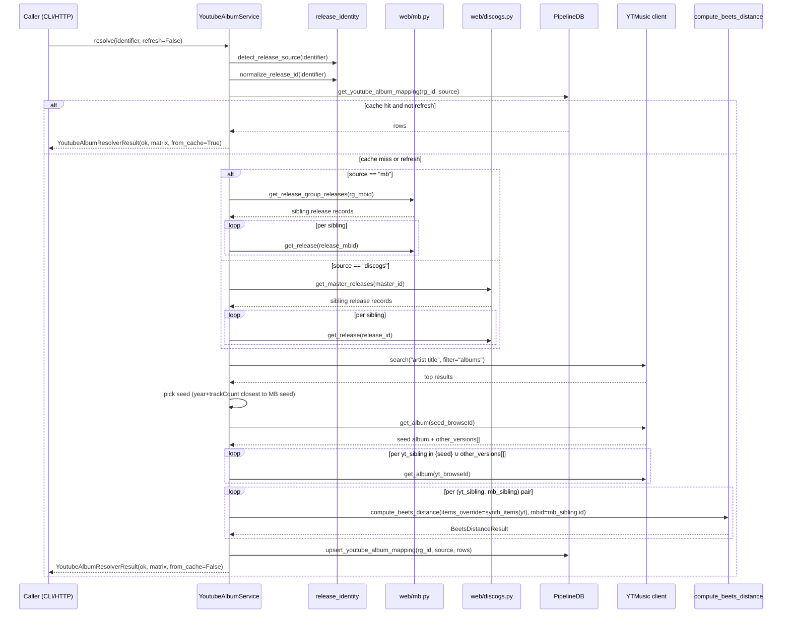

# feat: YouTube Music Album Resolver

## Summary

A new read-only HTTP + CLI surface that takes any MB or Discogs release identifier, auto-widens to the release group, and returns the matching YouTube Music album entities — each annotated with beets distance scores against every MB pressing in the group. The API surfaces evidence; the caller decides. Built as a thin service layer on top of an `items_override` extension to the existing `compute_beets_distance` so beets's distance algorithm is the single source of truth across the Replace picker and the new resolver.

---

## Problem Frame

Cratedigger holds rich pressing-level identity (distinct MBIDs for distinct release-group siblings), while YouTube Music exposes a thinner per-pressing metadata surface and its own editorial clustering of sibling editions. There is no published MBID ↔ YT Music release-level mapping at meaningful scale. Several future use cases (preview-on-YouTube buttons, out-of-print signals, archival cross-reference) need the same lower-level capability: given a release identifier from cratedigger's world, what is the corresponding album entity on YouTube Music — and how good a match is each candidate, against each MB sibling pressing? This plan builds that lower-level capability. Downstream consumers are explicitly out of scope (see origin: `docs/brainstorms/2026-05-27-youtube-music-album-resolver-requirements.md`).

---

## Key Technical Decisions

- **Single bounded PR.** The full brainstorm (17 requirements, 8 acceptance examples) lands as one bundled change covering migration, service, route, CLI, route-audit entry, nix dependency, and tests. Each layer is thin and tightly coupled to the others; splitting buys little and risks orphaned infrastructure. Per the project's clean-as-you-go scope rule.
- **Service-layer pattern: mirror `lib/beets_distance.py` exactly.** Typed `msgspec.Struct` result (the matrix crosses the HTTP / CLI JSON wire), pure service function with injected dependencies (`pdb`, `mb_get_release`, `mb_get_release_group_releases`, `discogs_get_release`, `discogs_get_master_releases`, `yt_client`, `distance_fn`, `cache`), outcome strings inlined at the call sites. Canonical pattern documented in `docs/solutions/architecture/service-first-then-glue.md`.
- **Outcome vocabulary aligned with the existing 6-bucket taxonomy — two layers.** *Service-level outcomes* (the top-level `YoutubeAlbumResolverResult.outcome`): `ok`, `not_found`, `mb_no_release_group`, `unresolved_4xx_client`, `unresolved_mirror_unavailable`, `unresolved_timeout`, `youtube_parse_failed`, `transient`. *Per-pair outcomes* (inside `distances[].outcome`, surfaced verbatim from `compute_beets_distance` per R17): include `ok`, `wrong_release_group`, `mb_lookup_failed`, `mb_no_release_group`, `no_audio`, `empty_items_override`, `invalid_input`, `distance_failed`. Partial failures inside the matrix preserve their per-pair outcome instead of failing the whole resolve. The 6-bucket taxonomy is shared vocabulary, not a completeness mandate — this service has no case that cleanly maps to `unresolved_no_data`. Keeps `pipeline-cli` output and any future triage filters consistent across surfaces. **Origin-mapping note:** this replaces the origin's single `youtube_unavailable` outcome (named in R16, AE6, F3) with the three concrete failure shapes (`unresolved_4xx_client`, `unresolved_mirror_unavailable`, `unresolved_timeout`) so each maps cleanly to the existing taxonomy. (See origin "Deferred to Planning" Q4 + research finding from `docs/pipeline-db-schema.md:470-477`.)
- **Cache via the existing `BeetsDistanceCache` protocol** with a long-sentinel TTL (`2**31-1` seconds, effectively forever) for the YT response cache. Reuses the `_RedisFingerprintCache` adapter pattern in `web/routes/pipeline.py` against a new key namespace `youtube:album:<browseId>` for `get_album` responses and `youtube:search:<query>` for `search` responses. The persisted `youtube_album_mappings` table is the durable cache; Redis is the in-process accelerator for the upstream HTTP calls.
- **`compute_beets_distance` extension is purely additive.** One new optional kwarg `items_override: list[SyntheticItem] | None = None`. When provided, the function skips the download_log + filesystem-loading branch and scores the provided items directly. The Replace-picker path (where `items_override` is absent) is bit-for-bit unchanged. The new `SyntheticItem` type is a `msgspec.Struct` keyed by the fields beets's `distance()` actually reads (title, artist, album, albumartist, track, tracktotal, disc, disctotal, length).
- **`requests_session` with retry adapter and jitter for `ytmusicapi`.** `urllib3.util.Retry` with `total=3, backoff_factor=1.5, status_forcelist=(429, 500, 502, 503, 504)`, plus a desktop User-Agent and 1-3s jitter between unrelated calls. On 429 escalation the service surfaces `unresolved_4xx_client` immediately and the cache absorbs the rest. (See origin "Deferred to Planning" Q4.)
- **Auto-widen via pure helpers, not browse-route plumbing.** Use `lib/release_identity.py::detect_release_source` + `normalize_release_id` for input classification, then `web/mb.py::get_release_group_releases` / `web/discogs.py::get_master_releases` for MB / Discogs sibling enumeration. The `_resolve_mb` / `_resolve_discogs` helpers in `web/routes/browse.py` are `Handler`-shaped (HTTP layer); the service uses the primitives directly.
- **Seed-pick heuristic.** On the MB / Discogs side, pick the lowest-year sibling, tiebreak on first-by-id, to form the search query (`f"{artist_name} {album_title}"`). On the YT Music side, take the `search(filter="albums")` result whose `(year, trackCount)` is closest to the MB seed; fall back to YT Music's top-ranked result when no clear winner. Both rules are documented as deterministic and tunable later if implementation reveals they're too noisy.
- **No backfill at deploy time.** Per the single-operator + no-backfill invariant in `.claude/rules/scope.md`. The cache populates on demand. No `scripts/warm_yt_cache.py` is committed.
- **TDD throughout.** Per the project's strict TDD convention, every implementation unit below is test-first. The plan does not enumerate RED/GREEN substeps — tests are the natural starting point for every unit, with the test scenarios in each unit's section being the actual list of failing tests to write first.

---

## High-Level Technical Design

This sequence diagram illustrates the resolve flow for a cache-miss path. It is directional guidance for review, not implementation specification; the implementing agent should treat it as context.



Failure-mode branches: at any YT step, `requests.Timeout` / `requests.ConnectionError` → `unresolved_timeout`; `YTMusicServerError` mapping to status code → `unresolved_4xx_client` (4xx) / `unresolved_mirror_unavailable` (5xx); empty search result set → `ok` with empty matrix; per-pair `compute_beets_distance` failure → that entry in the matrix carries the failure outcome verbatim, the rest of the matrix is still returned. When any YT failure occurs and a cached matrix exists, the service falls back to the cached result with a freshness flag.

---

## Output Structure

```
cratedigger/
├── lib/
│   ├── beets_distance.py            # modified: items_override kwarg
│   ├── pipeline_db.py               # modified: youtube_album_mappings CRUD
│   └── youtube_album_service.py     # new: service entrypoint + Result struct + SyntheticItem
├── migrations/
│   └── 034_youtube_album_mappings.sql   # new: schema + indexes
├── nix/
│   └── package.nix                  # modified: ps.ytmusicapi added
├── scripts/
│   └── pipeline_cli.py              # modified: cmd_youtube_album + parser entry
├── web/
│   ├── server.py                    # modified: youtube routes module wired into Handler
│   └── routes/
│       └── youtube.py               # new: GET handlers + descriptions
└── tests/
    ├── fakes.py                     # modified: FakeYTMusic + FakePipelineDB stubs
    ├── test_fakes.py                # modified: FakeYTMusic + FakePipelineDB youtube-album self-tests
    ├── test_youtube_album_service.py    # new: outcome table + integration slice
    ├── test_pipeline_cli.py         # modified: cmd_youtube_album tests
    └── test_web_server.py           # modified: route audit entry + contract tests
```

The implementer may adjust the layout if implementation reveals a better shape. The per-unit `**Files:**` sections remain authoritative.

---

## Implementation Units

### U1. Nix dependency: add `ytmusicapi`

**Goal:** Make `ytmusicapi` importable in the dev shell and the production module so every downstream unit can write and run code against it.

**Requirements:** Pre-req for R3, R4, R5 (anonymous YT Music access).

**Dependencies:** none

**Files:**
- `nix/package.nix` (modify)

**Approach:** `python3Packages.ytmusicapi` is in nixpkgs (verified). One-line addition to the `pythonPackages` list in `nix/package.nix:17-26` (`ps.ytmusicapi`). No `buildPythonPackage` needed. After the change, `nix-shell --run "python3 -c 'from ytmusicapi import YTMusic'"` should succeed.

**Patterns to follow:** Identical to how `ps.beets`, `ps.msgspec`, etc. are already listed in `nix/package.nix:17-26`.

**Test scenarios:** none — this is a build-graph change, exercised implicitly by every downstream import.

**Verification:** `nix-shell --run "python3 -c 'from ytmusicapi import YTMusic; print(YTMusic.__module__)'"` prints `ytmusicapi.ytmusic` without error. The dev shell builds clean.

---

### U2. Extend `compute_beets_distance` with `items_override`

**Goal:** Add a purely additive `items_override` kwarg to the existing service so callers can score against caller-provided items instead of files-on-disk. The Replace-picker path stays bit-for-bit identical when `items_override` is absent.

**Requirements:** R6, R7, R8.

**Dependencies:** none (touches existing service in isolation)

**Files:**
- `lib/beets_distance.py` (modify): add `SyntheticItem: msgspec.Struct`, add `items_override: list[SyntheticItem] | None = None` kwarg to `compute_beets_distance`, branch the function so the download_log + filesystem-loading block is skipped when `items_override` is provided, drop a private `_build_items_from_synthetic(items)` helper that mirrors `_build_items` for the new input.
- `tests/test_beets_distance.py` (modify): add a `TestComputeBeetsDistanceWithItemsOverride` test class.

**Approach:**
- Define `SyntheticItem` as a `msgspec.Struct` with the fields beets `distance()` reads: `title`, `artist`, `album`, `albumartist`, `track`, `tracktotal`, `disc`, `disctotal`, `length` (float seconds). Match the `_AudioFileFingerprint` field set in the existing module, minus the on-disk fields (`path`, `mtime`, `size`, `format`, `media`).
- **Signature change.** `download_log_id` becomes `Optional[int] = None`. Add a new `mb_release_group_id: Optional[str] = None` parameter so the override path can source the cross-RG guardrail without a request row. Validate exactly-one-of(`download_log_id`, `items_override`) at the top of the function; if both are supplied or neither, return a new `invalid_input` outcome.
- **Override-path flow.** When `items_override` is provided: skip steps 1-2 (download_log + request loading) entirely. The MB-side guardrails (step 3 MB fetch, step 4 MB-has-RG) still apply against the candidate MBID. The cross-RG guardrail (step 5) **still fires** when `mb_release_group_id` is provided — compare candidate MBID's RG to the caller-supplied RG with identical semantics to the existing guardrail (`wrong_release_group` outcome on mismatch). When `mb_release_group_id` is None alongside `items_override`, the guardrail is skipped (looser standalone-scoring contract for future callers without a known RG). The YT resolver always passes `mb_release_group_id` because the auto-widen step has the value; the existing Replace-picker path passes `download_log_id` only, with both new parameters defaulting to `None`, so its behavior is bit-for-bit unchanged.
- Replace the file-path resolution block (lines 437-457) with a branch: if `items_override` is None, the existing path-resolve + fingerprint-read; if `items_override` is provided, build items directly from the synthetic structs via the new private helper.
- The downstream steps 8 (`_build_album_info` + `assign_items` + `distance`) and 9 (`Distance` → `components` dict) are unchanged.

**Patterns to follow:**
- The existing `_build_items(fingerprints)` at `lib/beets_distance.py:294-318` is the template for the new helper. It already shows that `path` can be a placeholder bytes value (`fp.path.encode("utf-8")` with a synthetic path is fine).
- Eager beets imports per the existing module's "Eager beets imports" comment at lines 49-59. Do not lazy-import.
- `BeetsDistanceResult` already returns `request_id: Optional[int]` and `download_log_id: Optional[int]`; when `items_override` is provided without a `download_log_id`, those fields stay `None`.

**Test scenarios:**
- Happy path: synthetic items matching the MB candidate produce a `Distance` ≈ 0 (within tolerance). Verify `result.outcome == "ok"`, `result.distance` is small, `result.components` is non-empty, `result.download_log_id is None` (since override path was taken).
- Mismatched tracks: synthetic items with 12 entries vs MB candidate with 10 — verify `result.matched_tracks == 10`, `result.extra_local_tracks == 2`, `result.extra_mb_tracks == 0`.
- Per-component breakdown: synthetic items with wrong track-title and correct length — verify `result.components["track_title"]` has a penalty and `result.components["track_length"]` does not.
- MB lookup failure when override is provided: `mb_get_release` returns None → `result.outcome == "mb_lookup_failed"`, no file IO attempted.
- MB no release-group: MB returns release with `release_group_id=None` → `result.outcome == "mb_no_release_group"`, no file IO attempted.
- Empty items list: `items_override=[]` → `result.outcome == "empty_items_override"` (new distinct outcome — do NOT reuse the existing `no_audio` outcome, which means "the failed_path folder on disk had no readable audio files" and maps to HTTP 410. The override-empty case is a caller error, not a runtime filesystem condition, and audit data must keep them distinguishable).
- Invalid input — both signaled: `compute_beets_distance(download_log_id=X, items_override=[...], mbid=Y)` → `result.outcome == "invalid_input"`. No DB query, no MB lookup, no filesystem touch.
- Invalid input — neither signaled: `compute_beets_distance(mbid=Y)` with both `download_log_id=None` and `items_override=None` → `result.outcome == "invalid_input"`. No IO.
- Cross-RG guardrail fires in override path: `compute_beets_distance(items_override=[...], mbid=<MBID in RG A>, mb_release_group_id=<RG B>)` → `result.outcome == "wrong_release_group"`. No scoring attempted; `request_release_group_id` and `candidate_release_group_id` fields populated for traceability.
- Cross-RG guardrail skipped without RG param: `compute_beets_distance(items_override=[...], mbid=Y, mb_release_group_id=None)` proceeds to scoring even when candidate MBID's RG differs from anything the caller might be implicitly tracking. Verify the function does NOT consult any request row in this path.
- Regression — Replace path unchanged: call `compute_beets_distance(download_log_id=X, mbid=Y)` with no `items_override` and no `mb_release_group_id` against the existing fixtures. Covers AE8. Verify the result is byte-identical to the pre-change behavior (same outcome, same distance, same components).

**Verification:** All new tests pass. The existing `TestComputeBeetsDistanceOutcomes` and `TestBeetsDistanceIntegrationSlice` continue to pass with no modification.

---

### U3. Schema migration: `youtube_album_mappings` table

**Goal:** Add the persistence layer for the resolved YT Music sibling matrix.

**Requirements:** R12, R13.

**Dependencies:** none

**Files:**
- `migrations/034_youtube_album_mappings.sql` (create)

**Approach:** Forward-only SQL. Table shape:
- `id BIGSERIAL PRIMARY KEY`
- `release_group_identifier TEXT NOT NULL` — MB release-group MBID or Discogs master ID as string
- `source TEXT NOT NULL CHECK (source IN ('mb', 'discogs'))` — discriminator
- `yt_browse_id TEXT NOT NULL` — the `MPREb_…` form
- `yt_audio_playlist_id TEXT` — the `OLAK5uy_…` form (NULL allowed; some albums lack it)
- `yt_url TEXT NOT NULL` — `https://music.youtube.com/playlist?list=<audioPlaylistId>` or fallback browse URL
- `yt_year INTEGER` — nullable; YT sometimes omits
- `yt_track_count INTEGER NOT NULL`
- `yt_tracks JSONB NOT NULL` — array of `{title, artists, length_seconds, track_number, disc_number, video_id}` (the synthesized item shape used for scoring; durable per R13 so re-scoring against new MBIDs in the group is possible without re-fetching YT)
- `distances JSONB NOT NULL` — array of `{mbid, distance, components, matched_tracks, total_local_tracks, total_mb_tracks, extra_local_tracks, extra_mb_tracks, outcome, error_message}` — one entry per MB sibling in the group; per-MBID outcomes preserve partial failures per R17
- `resolved_at TIMESTAMPTZ NOT NULL DEFAULT now()`
- `UNIQUE (release_group_identifier, source, yt_browse_id)` — enforces "one row per (release-group × YT sibling)"
- `INDEX (release_group_identifier, source)` — supports the primary read path

**Patterns to follow:**
- The content-addressed pattern in `migrations/017_album_quality_evidence.sql` + `migrations/021_evidence_canonical_rekey.sql` is the closest analogue.
- The `CHECK (status IN (...))` discriminator pattern from search-plan iteration 2 migrations (`docs/pipeline-db-schema.md` § "Search-plan iteration 2").
- JSONB column naming convention: name for what it holds (see `import_jobs.payload`, `download_log.validation_result`).

**Test scenarios:**
- Migrator runs the new file exactly once: integration via `tests/test_migrator.py` (existing harness picks up new files automatically; verify the test runs against an empty DB and the schema is created).

**Verification:** `nix-shell --run "python3 -m unittest tests.test_migrator -v"` passes. `pipeline-cli query "SELECT * FROM schema_migrations WHERE version = '034' ORDER BY applied_at DESC LIMIT 1"` returns one row after a deploy.

---

### U4. PipelineDB CRUD for `youtube_album_mappings` + FakePipelineDB stubs

**Goal:** Expose the read/write surface for the new table on `PipelineDB`, with parity on `FakePipelineDB` so the service can be tested without a real Postgres.

**Requirements:** R12, R13, R14.

**Dependencies:** U3 (schema must exist).

**Files:**
- `lib/pipeline_db.py` (modify): add three methods — `get_youtube_album_mapping`, `upsert_youtube_album_mapping`, `delete_youtube_album_mapping`.
- `tests/fakes.py` (modify): add equivalent stubs on `FakePipelineDB` (state-respecting in-memory dict).
- `tests/test_fakes.py` (modify): add self-tests for the new FakePipelineDB methods.

**Approach:**
- `get_youtube_album_mapping(release_group_identifier, source) -> list[dict]` — returns the matrix (list of `(yt_browse_id, …, distances)` row dicts) for the given group. Empty list when nothing cached.
- `upsert_youtube_album_mapping(release_group_identifier, source, rows: list[dict]) -> None` — atomic replace: delete existing rows for `(release_group_identifier, source)` then insert all provided rows in a single transaction. Caller passes the full matrix; partial updates are not supported (refresh always replaces).
- `delete_youtube_album_mapping(release_group_identifier, source) -> int` — returns the count of deleted rows. Used by the operator-triggered refresh (R14) before an upsert.
- `FakePipelineDB` mirrors the same surface using a dict keyed by `(release_group_identifier, source)`. Provide `seed_youtube_album_mapping(rg_id, source, rows)` as a test helper for setup.

**Patterns to follow:**
- The autocommit + cursor pattern at `lib/pipeline_db.py` (see existing `get_request`, `update_request`).
- `FakePipelineDB` request-row pattern at `tests/fakes.py:792` (`seed_request`) and the call-recording pattern used by existing methods.

**Test scenarios:** (on `FakePipelineDB` for the fake; the real `PipelineDB` is exercised by U6's integration slice)
- `get_youtube_album_mapping` returns empty list when nothing cached for the given (rg, source) pair.
- `upsert_youtube_album_mapping` inserts new rows for a fresh (rg, source) pair; `get` returns them.
- `upsert_youtube_album_mapping` on an existing (rg, source) pair replaces all rows atomically (no partial state visible mid-replace).
- `delete_youtube_album_mapping` returns the count of deleted rows; subsequent `get` returns empty.
- (FakePipelineDB only) `seed_youtube_album_mapping` populates the in-memory state observable by `get`.

**Verification:** `tests/test_fakes.py` passes including the new self-tests. The integration slice in U6 will exercise the real DB methods.

---

### U5. `FakeYTMusic` in `tests/fakes.py`

**Goal:** State-respecting fake for `ytmusicapi.YTMusic` so service-layer tests run without network IO. Models the methods the service calls plus the exception types it must distinguish.

**Requirements:** Pre-req for R3, R4, R5, R16 test coverage.

**Dependencies:** none

**Files:**
- `tests/fakes.py` (modify): add `FakeYTMusic` class.
- `tests/test_fakes.py` (modify): add `TestFakeYTMusic` self-tests.

**Approach:**
- `FakeYTMusic` exposes the methods the service uses:
  - `search(query, filter, limit) -> list[dict]` — returns canned album results by default; configurable via `set_search(query, results)`.
  - `get_album(browseId) -> dict` — returns canned album response; configurable via `set_album(browseId, response)`.
- Failure injection mirrors `ytmusicapi`'s exception types: `set_search_error(query, exc)` / `set_album_error(browseId, exc)` queue a `YTMusicServerError`, `YTMusicUserError`, `requests.Timeout`, `requests.ConnectionError`, or `KeyError` (for parse-failure simulation) to be raised on the next matching call.
- Call recording: `fake.search_calls` and `fake.get_album_calls` are lists of dicts capturing call args, so service tests can assert on N+1 fan-out shape, retry counts, etc.
- A `make_album_fixture(browse_id, audio_playlist_id, title, artists, year, tracks, other_versions=[])` helper synthesizes the typical `get_album()` return shape per the external research findings (see U6 patterns).

**Patterns to follow:**
- `FakeSlskdAPI` in `tests/fakes.py` is the closest analogue — stateful, configurable errors, call recording.
- Import `YTMusicError`, `YTMusicServerError`, `YTMusicUserError` from `ytmusicapi.exceptions` for the failure-injection helpers.

**Test scenarios:**
- `search` returns the canned results for a matching query, empty list for an unconfigured query.
- `get_album` returns the canned response for a matching browseId, raises `YTMusicServerError` for an unconfigured browseId (matches real library behavior for non-existent albums).
- Failure injection: queued exception is raised on the next matching call, subsequent calls succeed (one-shot semantics — same as `FakeSlskdAPI`).
- Call recording captures the actual call arguments for both `search` and `get_album`.
- `make_album_fixture` produces a dict that round-trips through `msgspec.convert` to the expected shape without raising.

**Verification:** `tests/test_fakes.py::TestFakeYTMusic` passes.

---

### U6. Service: `lib/youtube_album_service.py`

**Goal:** The service-layer entrypoint that owns the resolve flow end-to-end — auto-widen, MB / Discogs sibling enumeration, YT Music search-then-expand, N×M beets scoring via `compute_beets_distance(items_override=…)`, persistence, and outcome mapping.

**Requirements:** R1, R2, R3, R4, R5, R7, R9, R10, R11, R12, R13, R14, R16, R17.

**Dependencies:** U1 (`ytmusicapi`), U2 (`items_override`), U4 (`PipelineDB` CRUD + `FakePipelineDB`), U5 (`FakeYTMusic`).

**Files:**
- `lib/youtube_album_service.py` (create)
- `tests/test_youtube_album_service.py` (create)

**Approach:**
- **Module surface:** one public function `resolve_youtube_album(identifier, *, pdb, mb_get_release, mb_get_release_group_releases, discogs_get_release, discogs_get_master_releases, yt_client, distance_fn, cache, refresh=False) -> YoutubeAlbumResolverResult`. The function is pure (no side effects beyond `pdb` writes and `cache` writes); every collaborator is injected for testability.
- **Result struct:**
  - `YoutubeAlbumResolverResult: msgspec.Struct` with `outcome: str`, `release_group_identifier: Optional[str]`, `source: Optional[str]`, `from_cache: bool`, `youtube_releases: list[ResolvedYoutubeRelease]`, `error_message: Optional[str]`, `duration_ms: Optional[int]`.
  - `ResolvedYoutubeRelease: msgspec.Struct` with `yt_browse_id`, `yt_audio_playlist_id: Optional[str]`, `yt_url`, `year: Optional[int]`, `track_count: int`, `tracks: list[SyntheticItem]`, `distances: list[ResolvedDistance]`.
  - `ResolvedDistance: msgspec.Struct` with `mbid`, `outcome`, `distance: Optional[float]`, `components: Optional[dict[str, float]]`, plus the matched/total/extra track counts and `error_message`.
- **Outcome set** (frozen at module top so the test, CLI, and route share one source of truth):
  - `ok` — happy path, matrix returned (may be empty per R11)
  - `not_found` — input identifier not in MB / Discogs mirror
  - `mb_no_release_group` — input MBID exists but has no release-group (legacy MB row)
  - `unresolved_4xx_client` — YT Music returned 4xx (captcha, sticky 403, malformed query)
  - `unresolved_mirror_unavailable` — YT Music returned 5xx
  - `unresolved_timeout` — YT Music timeout / connection error
  - `youtube_parse_failed` — YT Music response failed to parse (library version drift)
  - `transient` — short-lived condition; caller may retry
- **Flow** (matches the sequence diagram in High-Level Technical Design):
  1. Detect source + normalize identifier via `lib/release_identity.py::detect_release_source` + `normalize_release_id` (no kind disambiguation expected from these helpers — both bare release-level and release-group/master-level IDs share the same syntax).
  2. **Auto-widen via leaf-then-group fallback** (mirrors the pattern in `web/routes/browse.py::_resolve_mb` / `_resolve_discogs`): for MB, try `mb_get_release(id)` first; if it returns a release, extract `release_group_id` from the response and proceed; if it returns None (404), treat `id` as a release-group MBID directly and call `mb_get_release_group_releases(id)` — that call both validates the RG exists AND returns the sibling list in a single round-trip. For Discogs, identical shape: try `discogs_get_release(id)` → on success extract `master_id`; on 404 call `discogs_get_master_releases(id)` directly. If both calls return None, the service returns `not_found` (input identifier is in neither mirror). Cost per cache-miss is one wasted call per release-group-level input; the durable cache amortizes this to zero on every subsequent resolve.
  3. Cache hit short-circuit: if `not refresh` and `pdb.get_youtube_album_mapping(rg, source)` returns rows, return `ok` + `from_cache=True`.
  4. Enumerate MB / Discogs siblings; for each, fetch the per-release record (track list + durations) via `mb_get_release` / `discogs_get_release`.
  5. Pick a seed MB / Discogs release (heuristic: lowest-year release; tiebreak on first-by-id) and form the search query `f"{artist_name} {album_title}"`.
  6. YT search → top results. Pick seed by year+trackCount proximity to MB seed.
  7. `get_album(seed_browseId)` → seed + `other_versions[]`.
  8. For each yt sibling (cache-first via `yt_client` wrapped in the `BeetsDistanceCache`-shaped Redis cache): `get_album` → track list.
  9. Synthesize `SyntheticItem`s per yt sibling (one list per sibling).
  10. For each (yt sibling × MB sibling) pair: call `distance_fn(items_override=synth, mbid=mb_id, mb_release_group_id=<the resolved RG>)`. Collect `BeetsDistanceResult` per pair. Passing `mb_release_group_id` activates the cross-RG guardrail in the override path per U2's signature change.
  11. Build the matrix, persist via `pdb.upsert_youtube_album_mapping`, return `ok` + matrix + `from_cache=False`.
- **Failure handling:** at any YT step, map exceptions to outcome strings. When any YT failure occurs AND a cached matrix exists for the requested group, return the cached matrix with `from_cache=True` AND `error_message="<failure-outcome>: serving from cache"` (the outcome stays `ok` because the caller got a useful matrix). When no cached matrix exists, return the failure outcome with empty `youtube_releases`.
- **No retry loop in the service itself.** The `requests_session` configured at YTMusic construction time (in `web/routes/youtube.py` for HTTP, in `scripts/pipeline_cli.py` for CLI) carries the retry adapter. Within-service the call either succeeds, exhausts retries (→ outcome string), or raises a parse error (→ `youtube_parse_failed`).
- **Synthesized URL:** `f"https://music.youtube.com/playlist?list={audio_playlist_id}"` when `audio_playlist_id` is present; fallback to `f"https://music.youtube.com/browse/{browse_id}"` when absent.

**Patterns to follow:**
- `compute_beets_distance` at `lib/beets_distance.py:324-523` — guardrails-before-IO ordering, typed result, error-result helper, `started = time.monotonic()` for latency.
- `mbid_replace_service.py` for the class-vs-function decision: function-shaped service like `compute_beets_distance` is the right fit here (no instance state).
- `_RedisFingerprintCache` in `web/routes/pipeline.py:2281-2317` for the new `_RedisYoutubeCache` adapter (constructed and injected by the route + CLI, identical pattern).
- `lib/release_identity.py::detect_release_source` + `normalize_release_id` for the auto-widen entry.
- `web/mb.py::get_release_group_releases` (line 215) and `web/discogs.py::get_master_releases` (line 292) for sibling enumeration. Both return the same shape — no adapter needed.
- The N+1 fan-out pattern from `docs/parallel-search.md` + `docs/slskd-internals.md` — bounded deadline, treat non-responders as broken-for-this-cycle but don't fail the matrix.

**Test scenarios:**

*Happy path*
- Covers AE1. MB release group with 3 siblings; YT Music returns a seed + 1 `other_versions[]` entry. Matrix has 2 YT releases each with 3 distance entries. All distances are `ok` outcome with reasonable scores.
- Covers AE3. Input is an MB release MBID (release-level, not RG); the leaf call `mb_get_release(id)` returns a release; service extracts `release_group_id` and proceeds to enumerate siblings.
- Covers AE4. Input is a Discogs release ID; the leaf call `discogs_get_release(id)` returns a release; service extracts `master_id` and proceeds to enumerate siblings.
- Auto-widen — MB release-GROUP MBID input: the leaf call `mb_get_release(id)` returns None (404); service falls back to `mb_get_release_group_releases(id)` directly, validates the RG exists, and proceeds. Verify only one `mb_get_release_group_releases` call was made on the cache-miss path.
- Auto-widen — Discogs MASTER ID input: the leaf call `discogs_get_release(id)` returns None (404); service falls back to `discogs_get_master_releases(id)` directly. Verify the fallback path is exercised once per first resolve.
- Auto-widen — neither leaf nor group resolves: both `mb_get_release(id)` and `mb_get_release_group_releases(id)` return None (likewise on the Discogs side). Service returns `not_found` outcome.

*Cache behavior*
- Covers AE5. First call populates the DB cache via `upsert_youtube_album_mapping`. Second call returns the cached matrix with `from_cache=True` and zero YT Music traffic (verified via `yt_client.search_calls == [] and yt_client.get_album_calls == []` on the second call).
- Covers AE5. Same as above but with `refresh=True` on the second call — YT Music is queried again, cached rows are replaced.

*Empty / not-found*
- Covers AE2. YT Music search returns empty list. Service returns `ok` outcome with empty `youtube_releases`. (The R11 "normal response, not an error" shape.)
- Input MBID exists at release-level but the returned release has `release_group_id=None` (legacy MB row). Service returns `mb_no_release_group` outcome.

*Partial / pair failures*
- Covers AE7. YT Music has 3 sibling albums; the local MB mirror is missing one of the 4 MB siblings in the group. Each YT release's `distances` array has 3 entries with `outcome="ok"` and 1 entry with `outcome="mb_lookup_failed"` — verbatim from `compute_beets_distance`. Service-level outcome stays `ok`.
- YT Music returns siblings but one of the `get_album` calls fails with `YTMusicServerError`. That sibling is excluded from the matrix; the rest are scored normally; service returns `ok`.

*Failure modes with cache*
- Covers AE6. YT Music throws 429 / 503; a cached matrix exists for the group → service returns the cached matrix with `from_cache=True` AND `error_message` indicating the upstream failure outcome.
- Covers AE6. YT Music throws 429 / 503; no cached matrix exists → service returns `unresolved_4xx_client` (for 429) or `unresolved_mirror_unavailable` (for 5xx) with empty `youtube_releases`.
- YT Music throws `requests.Timeout` → `unresolved_timeout` outcome.
- YT Music throws `KeyError` from the parser → `youtube_parse_failed` outcome.

*Seed-pick heuristic*
- YT search returns 3 album candidates with different (year, trackCount) profiles; service picks the one whose (year, trackCount) is closest to the MB seed release's. Verify via the `get_album_calls` recording on `FakeYTMusic`.
- All YT search candidates are equidistant on (year, trackCount); service falls back to the top-ranked search result.

*URL synthesis*
- YT album has `audioPlaylistId`: returned `yt_url` is `music.youtube.com/playlist?list=<id>`.
- YT album lacks `audioPlaylistId` (rare): returned `yt_url` is `music.youtube.com/browse/<browseId>`, `yt_audio_playlist_id` is None.

*Integration slice* (in `tests/test_youtube_album_service.py::TestYoutubeAlbumResolverIntegrationSlice`)
- Real `compute_beets_distance` (with `items_override` from U2), real `assign_items` + `distance` from beets, real `FakePipelineDB` + `FakeYTMusic`. Constructs a release group with 2 MB siblings, 2 YT siblings (each with realistic track lists), and asserts the produced distance values are within tolerance of what beets would produce on equivalent on-disk fixtures.

**Verification:** All test scenarios pass via `nix-shell --run "python3 -m unittest tests.test_youtube_album_service -v"`. The outcome set is verified stable via a `test_outcome_set_is_stable` method (matches the pattern at `tests/test_beets_distance.py:136`).

---

### U7. CLI: `pipeline-cli youtube-album` subcommand

**Goal:** Expose the resolver from `pipeline-cli` so the operator can call it from the shell and downstream automation can shell out.

**Requirements:** R1 (input shape), R9 (matrix output), R11 (not-found is normal), R14 (refresh path), R15 (CLI ⇄ API symmetry).

**Dependencies:** U6 (service).

**Files:**
- `scripts/pipeline_cli.py` (modify): add `cmd_youtube_album` function + parser subcommand.
- `tests/test_pipeline_cli.py` (modify): add `TestCmdYoutubeAlbum` test class.

**Approach:**
- Subcommand: `pipeline-cli youtube-album <identifier> [--refresh] [--json]`. Identifier accepts a bare MBID (release-level OR release-group MBID — the service auto-discriminates via leaf-then-group fallback) or a bare Discogs ID (release OR master — same auto-discrimination). No prefix vocabulary; callers pass whatever ID they have.
- `cmd_youtube_album(db, args) -> int`:
  - Construct a `requests.Session` with retry adapter + custom User-Agent + jitter helper.
  - Construct `YTMusic(requests_session=session)`.
  - Construct `_RedisYoutubeCache()` if Redis is available, else `None`.
  - Call `resolve_youtube_album(identifier, pdb=db, mb_get_release=..., yt_client=yt, distance_fn=compute_beets_distance, cache=..., refresh=args.refresh)`.
  - Print: human-readable matrix (default) or `msgspec.json.encode(result).decode()` (with `--json`).
  - Map `result.outcome` to exit code: `ok` → 0; `not_found` → 2; `mb_no_release_group` → 3; `unresolved_4xx_client` → 5; `unresolved_mirror_unavailable` → 5; `unresolved_timeout` → 5; `youtube_parse_failed` → 5; `transient` → 5; other unknown → 1.
- Parser registration in `_build_parser` and dispatch wiring in the `commands` dict in `main()`.

**Patterns to follow:**
- `cmd_beets_distance` at `scripts/pipeline_cli.py:1982-2064` — exact analogue, including `--json` flag and outcome → exit-code mapping.
- The outcome → exit-code mapping must be exposed as a module-level dict (e.g. `_YOUTUBE_ALBUM_EXIT_CODES`) so the test, the CLI, and the route (U8) share one source. (Lesson from PR #381 — outcome vocabulary from one source.)

**Test scenarios:** (each scenario: `patch("scripts.pipeline_cli.resolve_youtube_album", return_value=...)` with a fixture result, assert exit code + stdout shape)
- `ok` outcome → exit 0; stdout (text mode) shows matrix; stdout (`--json` mode) is parseable JSON with `outcome == "ok"`.
- `not_found` outcome → exit 2.
- `mb_no_release_group` outcome → exit 3.
- `unresolved_4xx_client` outcome → exit 5; stderr / stdout indicates the throttling.
- `unresolved_timeout` outcome → exit 5.
- `youtube_parse_failed` outcome → exit 5; stderr indicates parse failure (operator may want to bump `ytmusicapi`).
- `--refresh` flag is forwarded to the service as `refresh=True` (verify via the mock's call args).
- `--json` mode outputs a single JSON object on stdout with all `YoutubeAlbumResolverResult` fields.

**Verification:** `nix-shell --run "python3 -m unittest tests.test_pipeline_cli.TestCmdYoutubeAlbum -v"` passes. `pipeline-cli youtube-album --help` shows the new subcommand on a live shell after deploy.

---

### U8. Web route: `web/routes/youtube.py` + Handler wiring + route audit + contract tests

**Goal:** Expose the resolver from the HTTP API so the web UI and any downstream automation can consume it. Wire into the server's route tables and the route audit so contract coverage is enforced.

**Requirements:** R9, R10, R11, R14, R15, R16, R17.

**Dependencies:** U6 (service), U7 (CLI — same outcome → exit-code dict pattern lives next to the new outcome → status-code dict).

**Files:**
- `web/routes/youtube.py` (create)
- `web/server.py` (modify): wire the new module into the eight merge sites in `Handler` (`_FUNC_GET_ROUTES`, `_FUNC_POST_ROUTES`, `_FUNC_GET_PATTERNS`, `_FUNC_POST_PATTERNS`, `_FUNC_GET_DESCRIPTIONS`, `_FUNC_POST_DESCRIPTIONS`, `_FUNC_GET_PATTERN_DESCRIPTIONS`, `_FUNC_POST_PATTERN_DESCRIPTIONS`).
- `tests/test_web_server.py` (modify): add the route to `TestRouteContractAudit.CLASSIFIED_ROUTES`; add a `TestYoutubeRouteContracts` test class.

**Approach:**
- **Route shape:** `GET /api/youtube-album?identifier=<id>&refresh=<true|false>`. Identifier accepts the same shapes as the CLI. Both `identifier` and `refresh` are query-string params (read-only GET). No POST endpoint in v1.
- **Handler:** `get_youtube_album(h, params)`:
  - Validate `identifier` param presence; 400 with `error="identifier query parameter is required"` if absent.
  - Construct `YTMusic` + cache + collaborators (same pattern as U7's CLI; consider extracting a `_build_youtube_client_and_cache()` helper that both surfaces share if it doesn't bloat).
  - Call `resolve_youtube_album(...)`.
  - Encode response via `msgspec.to_builtins(result)`.
  - Map `result.outcome` to HTTP status via a module-level dict `_YOUTUBE_ALBUM_OUTCOME_STATUS`:
    - `ok` → 200
    - `not_found` → 404
    - `mb_no_release_group` → 422
    - `unresolved_4xx_client` → 503
    - `unresolved_mirror_unavailable` → 503
    - `unresolved_timeout` → 503
    - `youtube_parse_failed` → 503
    - `transient` → 503
    - other → 500
  - Send via `h._json(payload, status=status)`.
- **Route exports:** `GET_ROUTES`, `POST_ROUTES`, `GET_PATTERNS`, `POST_PATTERNS`, `GET_DESCRIPTIONS`, `POST_DESCRIPTIONS`, `PATTERN_DESCRIPTIONS`. The route is exact-path so it goes in `GET_ROUTES` (not patterns). Description: short imperative phrase per the existing convention.
- **Outcome dict shared with CLI:** if `_YOUTUBE_ALBUM_OUTCOME_STATUS` and `_YOUTUBE_ALBUM_EXIT_CODES` live in `lib/youtube_album_service.py` (as exported module-level dicts), both surfaces import the same vocabulary, killing the PR #381 drift vector. Recommend doing so.

**Patterns to follow:**
- `get_beets_distance` at `web/routes/pipeline.py:2333-2375` — the canonical service-wrapping route. Outcome → status dict at lines 2320, Redis cache adapter at lines 2281-2317, `msgspec.to_builtins` + `h._json` response shape.
- `TestRouteContractAudit::CLASSIFIED_ROUTES` at `tests/test_web_server.py:1014` — every new route URL must appear.
- `TestPipelineRouteContracts` style contract tests at `tests/test_web_server.py:1270` — `_WebServerCase` harness, `_get` / `_post` helpers, `_assert_required_fields` against a `REQUIRED_FIELDS` set.
- Per CLAUDE.md "Contract test mocks must mirror production shape": the contract test must use production-shaped values for any JSONB / timestamp / UUID fields, OR the test must be paired with an integration slice that round-trips through real serialization. The integration slice in U6 satisfies this; the contract test can use simpler mocks but should still pass production-shaped distances dicts.

**Test scenarios:** (in `tests/test_web_server.py::TestYoutubeRouteContracts` against the `_WebServerCase` harness, with `patch("web.routes.youtube.resolve_youtube_album", …)` returning fixture results)
- `GET /api/youtube-album?identifier=<mbid>` with `ok` outcome → 200 + JSON containing every field in `REQUIRED_FIELDS` (`outcome`, `release_group_identifier`, `source`, `from_cache`, `youtube_releases`, `error_message`, `duration_ms`).
- Each `youtube_releases[]` entry has its `REQUIRED_FIELDS` (`yt_browse_id`, `yt_audio_playlist_id`, `yt_url`, `year`, `track_count`, `tracks`, `distances`).
- Each `distances[]` entry has its `REQUIRED_FIELDS` (`mbid`, `outcome`, `distance`, `components`, `matched_tracks`, `total_local_tracks`, `total_mb_tracks`, `error_message`).
- Missing `identifier` query param → 400.
- `not_found` outcome → 404.
- `mb_no_release_group` outcome → 422.
- `unresolved_4xx_client` / `_mirror_unavailable` / `_timeout` / `youtube_parse_failed` outcomes → 503.
- Covers AE5. `?refresh=true` is forwarded to the service as `refresh=True` (verify via the mock's call args).
- Covers AE6. When the service returns `ok` + `from_cache=True` + non-empty `error_message`, the route returns 200 (the cache served, the caller got a useful result).
- The route appears in `TestRouteContractAudit.CLASSIFIED_ROUTES` — the audit test (`test_all_web_routes_are_classified_for_contract_coverage`) passes after the route is registered.
- The route's description in `_FUNC_GET_DESCRIPTIONS` is non-empty — the description audit (`test_every_registered_route_has_a_description`) passes.

**Verification:** `nix-shell --run "python3 -m unittest tests.test_web_server.TestYoutubeRouteContracts tests.test_web_server.TestRouteContractAudit -v"` passes. Live smoke after deploy: `curl https://music.ablz.au/api/youtube-album?identifier=<known-mbid>` returns a 200 with the expected shape.

---

## Acceptance Examples Trace

Origin AEs traced to the units that exercise them via test scenarios:

| Origin AE | Covered by units |
|---|---|
| AE1 (RG with 3 MB × 2 YT siblings → 6 distances) | U6 (service happy path) |
| AE2 (YT search empty → `ok` + empty matrix) | U6 (empty/not-found) |
| AE3 (release-level MBID input → auto-widen) | U6 (happy path) |
| AE4 (Discogs release ID input → master widen) | U6 (happy path) |
| AE5 (cache hit / `refresh=true`) | U6 (cache behavior), U7 (CLI flag forwarding), U8 (`?refresh=true` forwarding) |
| AE6 (YT 429 + cache existence) | U6 (failure modes with cache), U8 (route status mapping) |
| AE7 (3 YT × 4 MB with one MB lookup failure) | U6 (partial/pair failures) |
| AE8 (Replace picker path unchanged) | U2 (regression test) |

---

## Verification Strategy

- **Per-unit tests** as enumerated above; every unit's verification block names the unittest module to run.
- **Full suite** after the last unit: `nix-shell --run "bash scripts/run_tests.sh"` — must pass clean. Pre-existing `OK (skipped=0)` invariant per `tests/test_skip_audit.py` is preserved (no new skip-gated tests).
- **pyright clean** on the full repo per `.claude/rules/code-quality.md`: `nix-shell --run "pyright --threads 4"` exits with 0 errors after the change.
- **Live smoke after deploy**:
  - `pipeline-cli youtube-album <known-popular-mbid>` — happy path: returns matrix, exit 0.
  - `pipeline-cli youtube-album <known-obscure-mbid>` — returns empty matrix (R11), exit 0.
  - `pipeline-cli youtube-album <known-popular-mbid> --refresh` — re-fetches, returns matrix.
  - `curl https://music.ablz.au/api/youtube-album?identifier=<known-popular-mbid>` — 200 with expected shape.
- **Synthetic-item distance quality validation** (the one Deferred-to-Planning question from the brainstorm that genuinely requires running code): run the CLI against three test releases — one popular (heavy YT Music presence; expect distances near 0 for the matching MB sibling), one moderately obscure (Topic-uploaded; expect distances comparable to the popular case), and one archival (likely absent from YT Music; expect empty matrix). If the popular-case distance is wildly different from what the Replace picker produces on equivalent on-disk audio, treat as a finding worth re-opening before downstream consumers depend on the matrix.

---

## Scope Boundaries

Carried forward from origin (`docs/brainstorms/2026-05-27-youtube-music-album-resolver-requirements.md` § Scope Boundaries) — single-tier list per Standard plan convention:

- Downstream consumers of this API (preview-on-YouTube buttons, out-of-print signals, library decoration, web UI changes) are not built. The API is the artifact; what calls it is separate work.
- Real YouTube playlists created via `playlists.insert` are not built. The artifact is the existing YT Music album URL, never a synthesized playlist.
- `watch_videos`-style URLs from individual video IDs are not built.
- Track-by-track video search and matching is not done. Resolution happens at the album-entity level only.
- OAuth, Google Cloud Console flows, and browser-cookie authentication are not implemented. Anonymous-only.
- The operator's real Google account is never authenticated. Burner+OAuth is documented (in this plan's Key Technical Decisions) as the only escape hatch if anonymous access degrades — not implemented in v1.
- MusicBrainz `release-url` "free streaming" relationship-type lookups are not consulted.
- TTL-based stale invalidation is not implemented. The cache lives forever absent explicit refresh.
- No backfill of existing `album_requests` rows with YT Music URLs at deploy time. Cache populates on demand.

### Deferred to Follow-Up Work

- A potential `web/routes/youtube.py` `POST /api/youtube-album/refresh` endpoint (vs the `?refresh=true` query param on the GET) — the GET-with-refresh form is sufficient for v1, but if downstream consumers want a clean "force refresh" semantic without re-fetching the matrix, a POST variant could be added later.
- A potential `pipeline-cli youtube-album --all-stuck-requests` operator command to walk every `wanted` request whose YT mapping is missing and resolve in batch — useful operationally but explicitly not in scope per the no-backfill invariant; can be added as a deliberate operator action if and when it's needed.
- Frontend integration on `music.ablz.au` — preview button on the browse / library views, or a Decisions-tab section showing the YT distance matrix alongside the existing beets distance from the Replace picker.

---

## System-Wide Impact

- **`lib/beets_distance.py`** — additive: one new struct, one new kwarg, one new internal branch. The Replace picker's existing call path is unchanged (verified by the U2 regression test).
- **`lib/pipeline_db.py`** — three new methods; no changes to existing methods.
- **`web/server.py`** — eight merge-site additions in `Handler` to wire the new routes module.
- **Nix build graph** — one new package (`ytmusicapi`); rebuild time should not change meaningfully.
- **Disk space** — `youtube_album_mappings` table grows on demand; rough estimate at 100 release groups with 3 YT siblings each ≈ 300 rows × ~5 KB JSONB ≈ 1.5 MB. Will not grow unbounded since the table is content-addressed per release group.
- **External traffic** — anonymous YT Music HTTP calls, one search + N `get_album` per cache miss per release group. Cache TTL is effectively forever, so steady-state traffic is near-zero. Realistic worst case during initial population: a few hundred release groups × ~5 calls each = manageable.
- **No changes** to the importer, the spectral pipeline, the search-plan service, the unfindable-detection service, the Soulseek transfer loop, or any UI surface.

---

## Risk Analysis

- **Synthetic item distance quality drift.** If beets's `distance()` scores synthetic items differently than disk-backed items in some non-obvious way (e.g. an internal heuristic that depends on `format` or `media` we set to empty), the resulting distance values may not be directly comparable to the Replace picker's. **Mitigation:** the integration slice in U6 asserts within-tolerance scores; the live-smoke validation explicitly compares popular-case distances to Replace-picker distances. If divergence appears, the per-component breakdown in `BeetsDistanceResult.components` lets callers filter on `track_title` + `track_length` rather than the aggregate.
- **`ytmusicapi` version drift / parse failures.** YT Music has changed its InnerTube response shape multiple times historically; `ytmusicapi` typically follows within days, but a flagged parser regression could produce `KeyError`s mid-flight. **Mitigation:** the service maps parse exceptions to `youtube_parse_failed`, the cache absorbs subsequent traffic for already-resolved release groups, and the operator can pin `ytmusicapi` to a known-good version in `nix/package.nix` if drift becomes operational pain.
- **Anonymous access degradation.** If Google tightens bot detection further and anonymous `ytmusicapi` access stops working in 2026-2027, the documented escape hatch is OAuth-via-burner-account (Key Technical Decisions). The service's collaborator-injection pattern means the `yt_client` can be swapped without touching the resolve flow.
- **Discogs mirror coverage of `release_track.length_seconds`.** The brainstorm flagged this as a planning-time question. The repo agent confirmed `web/discogs.py::get_release` returns the same shape as `web/mb.py::get_release` (per the docstring at `web/discogs.py:323-324`). **Mitigation:** for any Discogs release where `length_seconds` is missing per track, beets's distance helpers skip the `track_length` comparison without penalty — the matrix is still produced, just with weaker distance signal.
- **PR #203/#204-style integration bug.** A bug where a mocked test passed because the test author populated a field that production doesn't populate. **Mitigation:** the U6 integration slice exercises the full path against real beets primitives and real MB / Discogs mirror data (via `web/mb.py::get_release` calls — not mocked); the contract test in U8 is paired with the integration slice per CLAUDE.md.

---

## Dependencies / Assumptions

- `ytmusicapi` is available in nixpkgs as `python3Packages.ytmusicapi` (verified by the repo research agent).
- `web/mb.py::get_release_group_releases` and `web/discogs.py::get_master_releases` already exist and return parallel shapes (verified at `web/mb.py:215` and `web/discogs.py:292`).
- `lib/release_identity.py::detect_release_source` + `normalize_release_id` distinguish only MB-vs-Discogs from syntax — they do NOT distinguish release-level from release-group/master-level IDs (both share the same syntax). Per the U6 auto-widen contract, the service handles kind disambiguation itself via leaf-then-group fallback against the local mirrors; no new helpers are added to `lib/release_identity.py`.
- The Redis client in `web/cache.py` is initialized at server startup when `--redis-host` is set; the CLI path constructs an in-process equivalent or accepts `cache=None`.
- Anonymous YT Music access remains viable for read-only `search` + `get_album` in 2026 (research-confirmed).
- The `BeetsDistanceCache` protocol's `ttl_seconds` parameter accepts arbitrarily large integers (Redis SETEX accepts up to `2**63 - 1` seconds per docs).

---

## Outstanding Questions

### Deferred to Implementation

- [Affects U6][Technical] How does beets's `distance()` on synthetic items compare quantitatively to the disk-backed Replace-picker path? Validate during implementation against a small set of release groups (popular, moderately obscure, archival). If divergence appears, the mitigation is the per-component breakdown — but the planning-time best guess is that divergence will be minor since beets distance is metadata-driven and the synthesized items carry the same fields the existing helper builds for files.
- [Affects U6][Technical] The exact mapping from `ytmusicapi` exception → outcome string at the `requests.exceptions.*` boundary. Per the external research agent, `requests.Timeout` and `requests.ConnectionError` are not wrapped by `ytmusicapi`; the service catches them at the boundary and maps to `unresolved_timeout`. Confirm by writing the catch block test-first.
- [Affects U6][Technical] The exact jitter / spacing between the search-then-N×get_album fan-out. The Key Technical Decisions name 1-3s jitter; the implementer should code a small helper (`time.sleep(random.uniform(1, 3))`) before each `get_album` call after the first, and assert via the `FakeYTMusic.get_album_calls` recording that the helper is invoked. The exact range is tunable.
- [Affects U7, U8][Technical] If the new `_RedisYoutubeCache` adapter is sufficiently similar to `_RedisFingerprintCache`, consider refactoring both to a shared `_RedisBytesCache(namespace)` helper. Trade-off: thin DRY win vs scope-creep into pipeline.py's existing cache code. Decide at implementation time based on what the actual class bodies look like; default is "don't refactor pipeline.py, just write the new adapter next to it."
- [Affects U2][Technical] The exact behavior at the top-of-function input validation. Plan-time decision (per Key Technical Decisions): exactly-one-of(`download_log_id`, `items_override`) is required; supplying both or neither returns `invalid_input` outcome. Empty `items_override=[]` returns the distinct `empty_items_override` outcome. The implementer should verify these guards fire BEFORE any IO (no DB query, no MB lookup, no filesystem touch).
