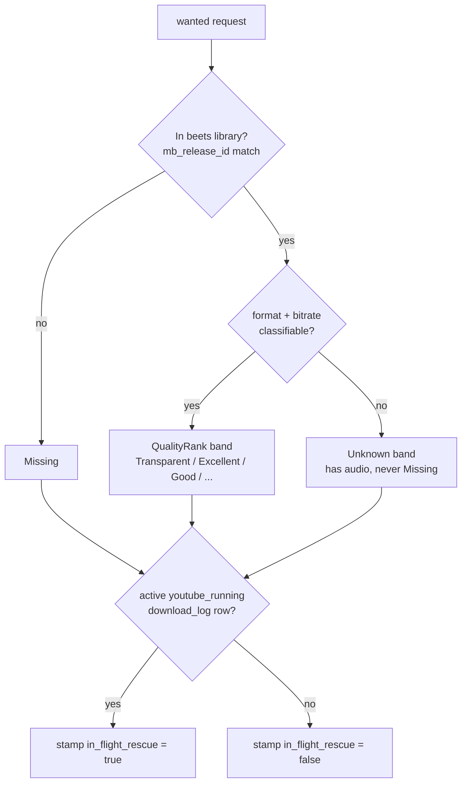
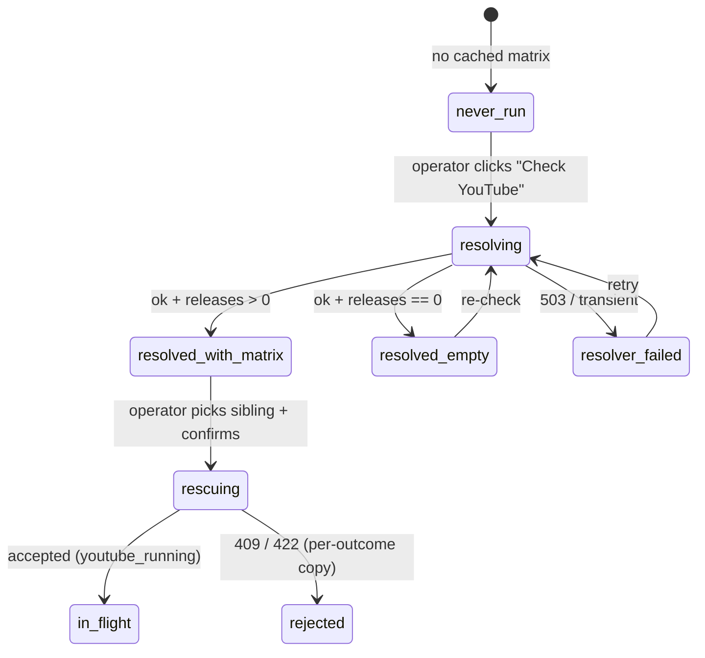
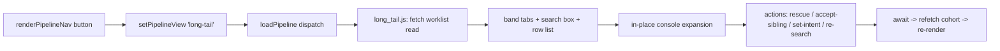

# feat: Long-Tail Triage Console

## Summary

Build a new long-tail worklist as a sub-view under the Pipeline tab: it opens on the
`wanted` set, banded by on-disk quality (`Missing` + the `QualityRank` bands) as selectable
filter tabs, with a search box. Selecting a release expands an in-place action console that
renders why it's stuck (unfindable category, Soulseek peers seen, sibling pressings, the
YouTube Music resolver matrix) and offers inline operator actions — YouTube rescue,
accept-a-sibling-pressing, set quality intent, and re-search. The view is the first UI
consumer of three already-built backends; the only new backend is a banded worklist read
(with a CLI counterpart) plus a small widening of how many Soulseek peers the detail returns.
No new pipeline behavior.

---

## Problem Frame

Three backends shipped without a UI consumer: the triage / search-analytics surface, the
YouTube Music resolver, and the YouTube rescue ingest API. They answer powerful per-request
questions but only from the CLI or raw HTTP — there's no place to stand in front of the long
tail as a cohort and work it down. The long tail is measurable: of 820 `wanted` requests, 391
carry an unfindable category and 454 already hold a provisional on-disk copy at some quality
band. The operator wants to *select* a band (start at `Missing`, climb the quality levels) and
spend attention where it pays off, resolving each stuck item in one place instead of bouncing
between `pipeline-cli triage show`, `youtube-album`, `youtube-rescue`, the pipeline detail
panel, and the Replace picker.

Research confirmed the brainstorm's central unknown (origin Q1 / D6) and surfaced two scope
corrections that this plan resolves up front:

1. There is **no band-filterable `wanted` endpoint** and no server-side banding of
   `album_requests` rows. The existing quality overlay bands *beets-library* release rows in a
   bounded batch (`web/routes/_overlay.py` → `web/server.py::compute_library_rank`); that is the
   reuse target, and "Missing" means the release isn't in the library at all.
2. There is **no "re-search now" backend** (origin Q4 / R15). Searches fire only on the 5-minute
   `cratedigger.service` cycle. This plan defines re-search as "regenerate the plan + reset the
   cursor" via the existing `search-plan/regenerate` surface, honestly labeled as next-cycle —
   not an instant search. A genuine single-request search trigger would be new watch-loop
   behavior and is deferred (see Scope Boundaries).

---

## High-Level Technical Design

### Band classification (server-side, per `wanted` row)

Banding reuses the beets-library quality machinery the rest of the UI already uses. A `wanted`
request's on-disk copy is its beets-library album (keyed by `mb_release_id`); "Missing" means
no such album exists.

Key rule: "Missing" means **no clean beets-library album for the `mb_release_id`** (the
`check_mbids` membership test) — honestly "no library copy to upgrade." That also covers brief
transients (mid-import, a download routed to wrong-matches) that have files on disk but no
imported album; the `in_flight_rescue` stamp (KTD4) disambiguates the active-rescue case. An
in-library row whose format/bitrate can't be classified bands as `Unknown`, never `Missing` —
these are two distinct mechanisms (absent from the membership set vs. present-but-rank-unknown)
and both are fixtured in U1.

### YouTube section state machine (per release, inside the console)

The resolver `GET` is slow and side-effectful (MB/Discogs mirror + per-pressing beets distance +
YT API). The console renders four explicit states derived from
`(cached-row-exists, outcome, releases length, from_cache, error_message)`:

### Console panel → data-source map

The console reuses existing read endpoints rather than a new aggregate endpoint:

| Console panel | Source endpoint | Key fields |
|---|---|---|
| Header band + status | worklist read (new, U1) | band, `in_flight_rescue`, status, `min_bitrate`, `target_format`, `search_filetype_override` |
| Why-unfindable | `GET /api/triage/<id>` | `unfindable.category`, `search_forensics.*`, `field_quality` |
| Soulseek peers seen | `GET /api/pipeline/<id>` `last_search.top_candidates` | username, dir, matched/total, avg_ratio, filetype, rejection per-search |
| Recent rescue attempts | `GET /api/pipeline/<id>` download history | `download_log` source/outcome (incl. terminal `youtube_*`) |
| Sibling pressings | `GET /api/release-group/<rg>` | id, title, date, country, track_count, `in_library`, `pipeline_status` |
| YouTube matrix | `GET /api/youtube-album?identifier=<id>` | `youtube_releases[].yt_browse_id`, `distances[]` |

### New sub-view wiring (frontend)

---

## Key Technical Decisions

- KTD1. **Band the cohort from the beets-library copy, not from `album_requests` spectral columns —
  via a beets-only banding helper factored out of the existing overlay.** `web/server.py::compute_library_rank`
  is the rank function and `web/routes/_overlay.py::overlay_release_rows_in_place` already bands beets
  rows in one batched query (N+1-safe), stamping `library_rank` — the exact field `web/js/badges.js`
  renders. Two refinements from review: (a) the overlay keys on `r["id"]` = *release* id, but
  `album_requests` rows key on request id with the release in `mb_release_id`, so U1 factors out the
  beets-only core (membership + detail + `compute_library_rank`) into a release-id→band helper and maps
  the band back onto request rows by `mb_release_id` — it does **not** feed request rows into the
  overlay verbatim; (b) U1 calls only that beets-only half, skipping the overlay's `check_pipeline`
  query (the cohort row already carries the pipeline columns). Banding is three-way: `mb_release_id`
  absent from the membership set → `Missing`; present but no detail row / `compute_library_rank` →
  `"unknown"` → `Unknown`; otherwise the band. Because the list, the console header, and the sibling
  panel all band through this one function (the sibling panel via the same overlay on
  `GET /api/release-group/<rg>`), there is no divergence path — header and list always agree.
  Badge rendering comes for free. Spectral-aware refinement (using `current_spectral_grade`) is
  deferred. (Resolves origin D5/D6 and the divergent-banding-source risk.)

- KTD2. **One server-banded fetch + client-side tab/search filtering — not a per-band endpoint.**
  The `wanted` cohort is ~820 rows; fetching it once (each row pre-banded server-side) and filtering
  tabs/search in JS kills stale-response races, avoids reimplementing `quality_rank` in JS (which
  would drift), and keeps the query *fan-out* bounded. The CLI counterpart (R16) accepts an optional
  `--band` filter so the service method supports both shapes; the UI uses the unfiltered fetch.
  **Scope correction from review:** U1 inherits `list_triage`'s N+1 *fan-out* bound but **not** its
  50-row pagination bound — this is a deliberate v1 choice (full-cohort fetch enables client-side
  filtering), and the true scaling driver is the beets banding batch against the whole `mb_release_id`
  list on the single web thread, not the Postgres cohort query. The `wanted` set grows without a
  product cap ("the system never stops searching"), so this carries an explicit ceiling (~1,500 rows):
  beyond it the read must paginate. See System-Wide Impact.

- KTD3. **"Re-search now" = regenerate the search plan + reset the cursor, labeled next-cycle.**
  Reuses the existing `POST /api/pipeline/<id>/search-plan/regenerate` (which always supersedes and
  starts the fresh plan at ordinal 0 — a reset cursor is a natural consequence, not a bolt-on). Button
  copy is explicit ("will be searched fresh on the next cycle, ~5 min"), never implying instant
  results. No new pipeline behavior; respects "the system never stops searching." **Failure outcomes
  are triage signal, not errors** (review): a `Missing`-band long-tail row is the *most likely* request
  to return `failed_deterministic` (no runnable query / incomplete metadata) — so the button surfaces
  *why the plan can't be built* (the same gap the console is triaging), with `failed_transient` mapped
  to retry. A genuine immediate single-request search trigger is deferred. (Resolves origin Q4/R15.)

- KTD4. **In-flight and failed rescues are surfaced by reading `download_log`, never by moving the
  row optimistically.** A rescue leaves `album_requests.status` untouched (`wanted`), so the row stays
  in `Missing` until the importer completes minutes later. The `in_flight_rescue` stamp is the existing
  `download_log` predicate `source='youtube' AND outcome='youtube_running'` — the same one already in
  `get_wanted_searchable` (as `NOT EXISTS`) and `list_active_youtube_rescues`, backed exactly by
  migration 037's partial unique index `one_youtube_running_per_request` (so it probes a tiny index,
  never a seq scan). Use the `EXISTS` form for planner consistency, and centralize the predicate literal
  rather than carrying a third copy. (Note: this is **not** `find_active_youtube_import_job`, which
  queries `import_jobs`.) The console reads the request's `download_log` history to show "rescue
  running" (`youtube_running`) or "last rescue failed: <reason>" (terminal `youtube_failed`
  specifically — distinct from `youtube_success`). Rows move bands only on a later refetch. (Resolves
  research gaps on in-flight banding and async-failure invisibility.)

- KTD5. **The console reuses existing read endpoints; the only read-path backend change is widening
  the `last_search` candidate cap.** Per-peer Soulseek rows live on `GET /api/pipeline/<id>`'s
  `last_search.top_candidates`, currently capped at 3 (the JSONB stores up to 20). Widen the cap for
  the peers panel. Folding candidates into the triage payload is deferred. (Resolves the split
  peers-data-source finding.)

- KTD6. **Console substrate: in-place expansion for evidence + actions; confirm-overlay modal for the
  two destructive confirmations.** The evidence/action console expands in place (the `.p-detail` /
  `.release-detail` pattern, per origin R6). The two-step rescue pick and the accept-sibling
  confirmation reuse the Promise-based `web/js/replace_picker.js` `.confirm-overlay` /
  `.replace-picker-shell` modal — the only reusable modal substrate in the app.

- KTD7. **Accept-a-sibling-pressing is MusicBrainz-only in v1.** Sibling enumeration is MB-keyed
  (`GET /api/release-group/<rg>`); Discogs-sourced requests have no MB release group. For Discogs
  requests the action renders disabled with a one-line reason. Rescue / set-intent / re-search still
  work for Discogs requests. No MB↔Discogs adapter is introduced (honors the no-adapter invariant).
  (Resolves the Discogs sibling-gap finding.)

- KTD8. **Post-action freshness: refetch the acted-on row and patch it in — not the whole cohort.**
  No optimistic band moves, no polling. The full banding read (KTD2) is the app's heaviest, so
  re-running it after every action — when a rescue/set-intent usually doesn't move the band immediately
  (KTD4) — would block the single-threaded server to re-render an essentially-identical cohort. Instead
  each action awaits, refetches just that request's authoritative band/flags (a single-id variant of
  the worklist read), and patches the one row. A successful Replace is the exception: it removes the old
  row (now a frozen `replaced` row) and closes the console, so it triggers a full cohort refetch; the
  explicit "Refresh" affordance also refetches the whole cohort. (Resolves research freshness gaps and
  the per-action heavy-read cost.)

---

## Requirements

Traceability to origin (`docs/brainstorms/2026-05-30-long-tail-triage-console-requirements.md`).

**Worklist view**

- R1. New sub-view under the Pipeline tab, reachable from the existing sub-view nav (origin R1).
- R2. Default scope is the `wanted` set; `imported` / `manual` / `downloading` / `replaced` are
  excluded (origin R2).
- R3. Quality-band filter tabs (`Missing` + the on-disk `QualityRank` bands present), selectable
  filters not a forced sort (origin R3).
- R4. `Missing` = a `wanted` request with no beets-library album; each band = a `wanted` request whose
  beets-library copy classifies into that band; unclassifiable-but-present = `Unknown` band (origin R4,
  refined by KTD1).
- R5. Search box filtering the current cohort by artist / album, within the selected band, with a
  stale-response token guard (origin R5).

**Action console**

- R6. Selecting a release expands it in place into the action console, reusing the in-place detail
  substrate (origin R6).
- R7. For a `Missing` / unfindable release, the console surfaces the unfindable category + reason, the
  Soulseek peers seen + rejection reasons, the sibling pressings, and the YouTube matrix when resolved.
  A not-yet-categorised state is rendered distinctly from an error (origin R7, refined by research).
- R8. For an on-disk-below-intent release, the console surfaces current band vs. intent and what better
  is available, adapting emphasis to the row's state (origin R8).

**Console actions**

- R9. YouTube rescue action with a two-step flow (run resolver when no cached matrix, then rescue
  against a resolver-supplied `browse_id`), with the four-state YouTube section (origin R9).
- R10. Rescue targets an operator-chosen sibling; never auto-picked (origin R10).
- R11. Rescue requires no quality-bar step (origin R11).
- R12. After a successful rescue the row reflects its new band only on a later refetch (import owns the
  transition); audit fields are populated by the existing import path (origin R12, refined by KTD4).
- R13. Accept-a-sibling-pressing via the existing Replace action, MB-only in v1 (origin R13, refined by
  KTD7).
- R14. Quality-intent control (keep grinding to lossless vs. accept current floor) via the existing
  set-intent surface (origin R14).
- R15. Re-search action = regenerate-plan-and-reset-cursor, next-cycle, never implying instant search
  (origin R15, redefined by KTD3).

**Surface symmetry**

- R16. The new worklist read ships with a `pipeline-cli` counterpart through the same service method,
  classified in the route-contract audit; the existing mutating actions keep their single service path
  (origin R16). The read also exposes a single-id variant used by the post-action single-row refetch (KTD8),
  so U1 and U6 both trace here.

---

## Implementation Units

### U1. Worklist banding service + read API + CLI counterpart

- **Goal:** Return the `wanted` cohort with each row pre-banded (`Missing` / band / `Unknown`) and
  stamped with `in_flight_rescue`, in a bounded number of queries, exposed via both an HTTP read and a
  `pipeline-cli` subcommand.
- **Requirements:** R1, R2, R3, R4, R16.
- **Dependencies:** none.
- **Files:**
  - `lib/long_tail_service.py` (new) — service method + typed `msgspec.Struct` result (`outcome`, banded
    rows). Injected collaborators (DB, band fn, active-rescue lookup) per the service-first pattern.
  - `lib/pipeline_db.py` — a bounded cohort query stamping `in_flight_rescue` via the existing
    `download_log` predicate `source='youtube' AND outcome='youtube_running'` (the `EXISTS` form already
    in `get_wanted_searchable` / `list_active_youtube_rescues`, backed by migration 037's partial unique
    index). Centralize the predicate literal; do NOT reach for `find_active_youtube_import_job` (that
    queries `import_jobs`, not the `youtube_running` flag KTD4 needs).
  - `web/routes/pipeline.py` — `GET /api/pipeline/long-tail` handler wrapping the service; rows mapped
    through `_server()._serialize_row(...)`; band applied via the beets-only helper (KTD1). Add the
    route description to this module's `GET_DESCRIPTIONS` dict (the audit gate fails on an empty one).
  - `web/server.py` / `web/routes/_overlay.py` — factor the beets-only banding core (membership +
    `check_mbids_detail` + `compute_library_rank`) into a release-id→band helper U1 and the overlay both
    call; U1 maps the band onto request rows by `mb_release_id` and skips the overlay's redundant
    `check_pipeline` query (the cohort already carries those columns).
  - `scripts/pipeline_cli.py` — `pipeline-cli long-tail [--band=<band>] [--json]` wrapping the same
    service; outcome → exit-code mapping per convention.
  - `tests/test_long_tail_service.py` (new), `tests/test_web_server.py`, `tests/test_pipeline_cli.py`,
    `tests/fakes.py` + `tests/test_fakes.py` (new `FakePipelineDB` method + self-test if one is added).
- **Approach:** Service-first (KTD2): typed result is the contract; the HTTP route and CLI are thin
  adapters. Band per row via the beets-only helper (KTD1) — batched beets queries for the whole cohort,
  never per row, and no redundant `check_pipeline`. Three-way band derivation: `mb_release_id` absent
  from the membership set → `Missing`; present but rank-unknown → `Unknown`; else the band. Stamp
  `in_flight_rescue` via the centralized `EXISTS` `youtube_running` predicate (KTD4), not an N-query
  loop. The endpoint returns the full `wanted` cohort unfiltered (UI filters client-side, KTD2); the
  service's optional `band` filter backs the CLI's `--band`, and a single-id variant backs the
  per-action single-row refetch (KTD8). Add the route to `TestRouteContractAudit.CLASSIFIED_ROUTES`
  AND a non-empty entry to `GET_DESCRIPTIONS`.
- **Execution note:** Start with a failing real-PG round-trip test asserting every returned field
  (especially band + `in_flight_rescue`) survives the production query, then build the service.
- **Patterns to follow:** `lib/triage_service.py::list_triage` (4-query N+1 bound + typed result),
  `web/routes/_overlay.py::overlay_release_rows_in_place` (batched banding), the
  `scripts/pipeline_cli.py` triage/youtube subcommands (CLI adapter shape), `web/server.py::_serialize_row`.
- **Test scenarios:**
  - Covers AE1. A `wanted` request with no beets-library album bands as `Missing`; an `imported` request
    is absent from the result entirely.
  - Covers AE2. A `wanted` request whose beets copy classifies `Transparent` bands as `Transparent`.
  - A `wanted` request present in the library but with an unclassifiable / absent detail row bands as
    `Unknown`, not `Missing` (the two mechanisms — absent-from-membership vs. present-but-rank-unknown —
    are fixtured separately).
  - A Discogs-sourced `wanted` request bands correctly via the existing dual-key membership lookup
    (`check_mbids` already buckets MB UUIDs and Discogs numerics → `discogs_albumid` — no new lookup
    path is introduced); banding must work for Discogs rows even though KTD7 makes accept-sibling MB-only.
  - A `wanted` request with an active `youtube_running` `download_log` row is stamped
    `in_flight_rescue = true`; one without is `false`.
  - N+1 guard: the total query count is constant regardless of cohort size — and the assertion counts
    the beets membership + `check_mbids_detail` queries too, not just the Postgres cohort query (model
    on `TestListTriageN1Guard`).
  - Production-shape round-trip: a row populated with real `datetime` / `uuid.UUID` / typed JSONB
    serializes without error through the endpoint (guards the datetime-500 class).
  - CLI `long-tail --band=missing` returns only `Missing` rows; exit 0; `--json` emits the typed shape.
  - Route is present in `CLASSIFIED_ROUTES` and has a non-empty description (audit gate).
- **Verification:** `GET /api/pipeline/long-tail` returns banded `wanted` rows; `pipeline-cli long-tail`
  prints the same cohort; full suite green including the route-contract audit and the N+1 guard.

### U2. Widen the `last_search` candidate cap for the peers panel

- **Goal:** Expose more than the current 3 Soulseek peers per search so the console's "peers seen" panel
  shows a useful slice (the JSONB stores up to 20).
- **Requirements:** R7.
- **Dependencies:** none.
- **Files:**
  - `web/routes/pipeline.py` — `_build_last_search_payload` candidate limit raised from 3 to the stored
    maximum (top-20; the JSONB already caps there, so no value is left open).
  - `tests/test_web_server.py` — assert the widened cap in the `last_search` contract.
- **Approach:** A bounded read-path tweak only; no schema change. Keep the existing `CandidateScore`
  decode path. Confirm `GET /api/triage/<id>`, `GET /api/youtube-album`, `GET /api/release-group/<rg>`
  already provide the rest of the console's evidence (they do, per research) — no other backend change.
- **Patterns to follow:** the existing `_build_last_search_payload` decode + `top_candidates` cap.
- **Test scenarios:**
  - `last_search.top_candidates` returns up to the new cap when the stored JSONB has more than 3
    candidates; still truncates at the stored maximum.
  - `LAST_SEARCH_REQUIRED_FIELDS` / `CANDIDATE_SCORE_REQUIRED_FIELDS` still hold after the change.
- **Verification:** the detail endpoint returns the widened peer list; existing contract tests pass.

### U3. Pipeline sub-view scaffold: nav, dispatch, band tabs, search box

- **Goal:** Register a new `long-tail` Pipeline sub-view that fetches the worklist read and renders the
  band tabs, search box, and row list — without the action console yet.
- **Requirements:** R1, R2, R3, R5.
- **Dependencies:** U1.
- **Files:**
  - `web/js/state.js` — add `pipelineView` value `'long-tail'` (and any detail context field needed).
  - `web/js/pipeline.js` — dispatch branches in `loadPipeline`, `setPipelineView`, `renderPipeline`; a
    nav button in `renderPipelineNav`.
  - `web/js/main.js` — register `window.*` bindings for the new module's handlers. The F12 detail-reset
    guard in `showTab` likely needs **no** change: `long-tail` is a list view (like `dashboard`, which
    survives F12 because it isn't named in the reset condition), not a per-request detail with stashed
    context. Confirm the intended F12 behavior and only touch the guard if `long-tail` should reset to
    `queue` on re-click.
  - `web/js/long_tail.js` (new) — fetch `/api/pipeline/long-tail`, derive tab set from present bands,
    render tabs + search box + row list; client-side band/search filtering; stale-response token guard;
    pure helpers exported via the repo's `export const __test__ = {…}` named-object convention.
  - `web/index.html` — band-tab / list CSS (reuse existing `badge-rank-*` colours).
  - `web/js/util.js` — any pure helper (band-label formatting, count rollup) added here for testability.
  - `tests/test_js_util.mjs` — unit tests for the pure helpers.
- **Approach:** Mirror the `search-plan-detail` sub-view registration (the worked template). Band tabs are
  derived from the bands present in the fetched cohort (KTD2); filtering is client-side over the single
  fetch. The search box uses the `browse.js` in-flight token + 300ms debounce pattern and filters within
  the selected band (with a "N matches in other bands" hint to avoid dead-ends). Reuse `badges.js` for
  per-row band badges. Each tab shows a live count computed in the same banding pass, so counts stay
  consistent with `Unknown` / in-flight rows by construction. The list has three explicit states: a
  loading row beneath the tabs while the worklist fetch is in flight (distinct from empty); the
  empty-cohort state (zero `wanted` rows); and an empty-band state ("No <band> releases match" when a
  search filters the selected band to zero — the tab stays visible while filtered, and disappears only
  after a full-cohort refetch drops the band entirely).
- **Patterns to follow:** `web/js/search_plan.js::openSearchPlanDetail`, `web/js/pipeline.js`
  dispatch trio, `web/js/browse.js` stale-token search, `web/js/badges.js`.
- **Test scenarios:**
  - Pure: band-tab derivation from a cohort with mixed bands yields the expected ordered tab set
    (`Missing` first).
  - Pure: search filter within a selected band matches by artist/album substring; cross-band match count
    is reported for the hint.
  - Pure: stale-token guard discards an earlier fetch's result when a newer fetch has started.
  - Pure: per-tab counts derived in the banding pass equal the row count of each band.
  - Render: loading, empty-cohort, and empty-band states each show their own affordance — never a blank area.
  - `node --check web/js/*.js` passes; the new module is `// @ts-check` clean.
- **Verification:** the new sub-view loads, shows band tabs + search, lists the cohort, and filters
  client-side; JS unit tests + syntax check pass.

### U4. Action console evidence panel

- **Goal:** On row select, expand an in-place console rendering the band-aware evidence: unfindable
  category, Soulseek peers seen, recent rescue attempts, sibling pressings, and the YouTube matrix —
  with the not-yet-categorised, four-YouTube-state, and async-rescue-failure states handled.
- **Requirements:** R6, R7, R8.
- **Dependencies:** U2, U3.
- **Files:**
  - `web/js/long_tail.js` — console expansion + evidence rendering; fetches `GET /api/triage/<id>` and
    `GET /api/pipeline/<id>` (peers + rescue history), and `GET /api/release-group/<rg>` for siblings;
    YouTube section reads cached `GET /api/youtube-album` state.
  - `web/js/util.js` — reuse `renderForensicBlock` for the peers table; add pure state-mapping helpers
    (YouTube four-state classifier, band-aware emphasis selector).
  - `web/index.html` — console CSS (in-place `.p-detail` / `.release-detail` family).
  - `tests/test_js_util.mjs` — unit tests for the YouTube state classifier and emphasis selector.
- **Approach:** In-place expansion (KTD6). Render distinct states: not-yet-categorised (origin's 429
  un-categorised cohort) shown as "detection runs daily" rather than an error; the YouTube section driven
  by the four-state classifier (KTD6 / HTD); an `in_flight_rescue` row shows "rescue running"; a row with
  a latest-terminal `youtube_failed` `download_log` (specifically, not `youtube_success`) shows "last rescue failed:
  <reason>". `Missing` rows lead with the unfindable category; on-disk rows lead with band-vs-intent.
  The evidence panels load **independently** (parallel fetches, per-panel loading + error states): a slow
  or failing `GET /api/release-group/<rg>` (the 15s mirror timeout) renders that panel's own error
  affordance and never blocks the unfindable/peers panels or silently drops one. Information architecture
  to keep the action buttons reachable without scrolling past evidence: the peers list shows a few rows
  with a "show all" expansion, and the YouTube matrix stays collapsed until "Check YouTube" is clicked.
- **Patterns to follow:** `web/js/pipeline.js::toggleDetail` (in-place fetch + render), `web/js/util.js::renderForensicBlock`,
  `web/js/replace_picker.js` row-expansion structure.
- **Test scenarios:**
  - Covers AE3. A `Missing` request categorised `wrong_pressing_available` renders the category + reason,
    the peers-seen table, and the sibling-pressings list.
  - Pure: the YouTube state classifier maps `(no cached matrix)` → `never_run`; `(ok, releases>0)` →
    `resolved_with_matrix`; `(ok, releases==0)` → `resolved_empty`; `(503/transient)` → `resolver_failed`;
    `(ok, from_cache, error_message)` → matrix-with-staleness-flag.
  - Pure: a not-yet-categorised request (`unfindable == null`) selects the "not categorised" emphasis, not
    an error state.
  - A row with an active `youtube_running` row renders "rescue running"; a row with a terminal
    `youtube_failed` renders the failure reason.
  - On-disk-below-intent row leads with band-vs-intent rather than the unfindable category.
  - Partial failure: a non-200 from one evidence endpoint (e.g. `release-group` times out) renders that
    panel's error state while the other panels still render — the console is never blank on partial failure.
- **Verification:** selecting rows in each state renders the correct panel; pure-helper unit tests pass; a
  Playwright smoke (small/obscure artist) shows real triage + sibling + matrix content.

### U5. Console rescue flow (two-step)

- **Goal:** Wire the YouTube rescue action: "Check YouTube" runs the resolver (guarded against
  double-fire), the matrix renders pickable siblings, and confirming a pick submits the rescue with
  per-outcome feedback.
- **Requirements:** R9, R10, R11, R12.
- **Dependencies:** U4.
- **Files:**
  - `web/js/long_tail.js` — the two-step flow: resolver call with in-progress/disabled state; matrix
    render; confirm step reusing the `web/js/replace_picker.js` `.confirm-overlay` modal; submit to
    `POST /api/pipeline/<id>/youtube-rescue`; outcome → copy mapping; on `accepted`, mark the row
    in-flight and refetch (KTD8).
  - `web/index.html` — any rescue-specific console CSS.
  - `tests/test_js_util.mjs` — unit tests for the outcome → copy mapping.
- **Approach:** Two-step mirrors the Replace picker's list→confirm shape (KTD6). The resolver "Check
  YouTube" button disables while outstanding (slow side-effectful GET). Map every ingest outcome to
  specific copy: `in_flight` (fold into the in-flight indicator, surface existing `download_log_id`),
  `wrong_state` ("request changed — refresh"), `no_resolver_mapping` ("re-run Check YouTube"),
  `track_count_precheck_failed` (show expected vs. resolver count), `transient` (retry). Never optimistically
  move the row to a band; the importer owns the transition (KTD4).
- **Patterns to follow:** `web/js/replace_picker.js` (`openReplacePicker` Promise + confirm overlay +
  `runWithConcurrency`), `web/routes/youtube.py` outcome vocabulary.
- **Test scenarios:**
  - Covers AE4. With no cached matrix, the YouTube section offers "Check YouTube"; after a successful
    resolve, sibling rescue targets render.
  - Covers AE5. Picking a sibling and confirming submits the rescue and, on `accepted`, the row is marked
    in-flight (stays in `Missing` until a later refetch); no bar-drop step appears.
  - Pure: each ingest outcome (`accepted` / `in_flight` / `wrong_state` / `no_resolver_mapping` /
    `track_count_precheck_failed` / `transient`) maps to its intended console copy.
  - Double-fire guard: clicking "Check YouTube" twice while a resolve is outstanding fires one request.
  - `resolved_empty` hides the rescue button and shows "not on YouTube Music — re-check".
- **Verification:** the rescue flow completes end-to-end against a resolved release; rejections render the
  right copy; unit tests pass; Playwright smoke confirms the two-step.

### U6. Console secondary actions + post-action freshness

- **Goal:** Wire accept-a-sibling-pressing (MB-only), set quality intent, and re-search, plus the shared
  refetch-after-action freshness model.
- **Requirements:** R13, R14, R15, R16.
- **Dependencies:** U4.
- **Files:**
  - `web/js/long_tail.js` — accept-sibling via `window.openReplacePicker` (disabled with a note for
    Discogs-sourced requests); set-intent via the existing `{id, intent}` POST (render the current intent
    as a label/badge with a small toggle to switch lossless ↔ default; mirror `web/js/library.js::setIntent`,
    which lives in a different view context); re-search via `POST /api/pipeline/<id>/search-plan/regenerate` with
    next-cycle copy and `regenerate` outcome mapping; shared `action → await → single-row
    refetch-and-patch` helper; on successful Replace, close the console (old id now a frozen `replaced`
    row) and full-cohort refetch.
  - `web/js/main.js` — `window.*` bindings for the new handlers.
  - `tests/test_js_util.mjs` — unit tests for the regenerate outcome → copy mapping and the
    Discogs-disable predicate.
- **Approach:** Reuse the existing operator-action endpoints unchanged (no parallel paths, R16). Accept-sibling
  is MB-only (KTD7) — disabled with a one-line reason when the request is Discogs-sourced or has no
  pickable siblings (siblings already tracked as requests are shown non-pickable). Re-search maps to
  `regenerate` with honest next-cycle copy and handles `noop_active_plan_exists` / `failed_*` outcomes
  (KTD3); the button disables while outstanding. On `failed_deterministic` (no runnable query / incomplete
  metadata — common on `Missing`-band rows) it does not simply re-enable to fire again; it surfaces the
  metadata gap inline (pointing at the field-quality detail) so re-clicking isn't futile. Every action
  awaits then refetches just the acted-on row and patches it (KTD8); a successful Replace closes the
  console and refetches the full cohort; no optimistic band moves.
- **Patterns to follow:** `web/js/library.js::setIntent`, `web/js/main.js::openReplacePickerAndHandle`,
  `web/js/search_plan.js` regenerate handling, `lib/mbid_replace_service.py` outcomes.
- **Test scenarios:**
  - Covers AE6. Accept-sibling on an MB request opens the Replace picker; confirming replaces the request
    to the chosen sibling; the console closes and the cohort refetches.
  - Pure: the Discogs-disable predicate disables accept-sibling for a Discogs-sourced request and enables
    it for an MB request with pickable siblings.
  - Set-intent to `lossless` posts `{id, intent}`; the row refetches and reflects the new intent.
  - Pure: `regenerate` outcomes (`success` / `noop_active_plan_exists` / `failed_deterministic` /
    `failed_transient`) map to their intended next-cycle copy; the button guards double-fire.
  - After any successful action, the cohort is refetched (no optimistic band move asserted).
- **Verification:** all three actions complete against real requests with correct copy and refetch
  behavior; Discogs requests show accept-sibling disabled; unit tests + CLI/contract suites pass;
  Playwright smoke confirms the action set.

---

## Scope Boundaries

Carried from origin (`docs/brainstorms/2026-05-30-long-tail-triage-console-requirements.md`):

- The ~3,500 `imported` albums re-ranked by quality (whole-collection health dashboard) — not in this view.
- The "click any release anywhere → popup" framing — dropped; the only detail surface is the in-place
  console.
- No "lower the quality bar before rescue" step — the gate doesn't block first acquisition and Opus 128 is
  `Transparent`.
- No automatic / background rescue; rescue stays operator-initiated.
- The watch loop is never throttled by this view.

### Deferred to Follow-Up Work

- **Spectral-aware banding.** v1 bands from the beets-library `(format, bitrate)` via the existing overlay
  (KTD1). Refining the band with `current_spectral_grade` / `current_spectral_bitrate` is a later
  enhancement.
- **A genuine immediate single-request search trigger.** v1 re-search = regenerate + next-cycle (KTD3). A
  true "search this one now" verb is new watch-loop behavior (new service + CLI + API, R16) and is out of
  v1.
- **Folding Soulseek candidates into the triage payload.** v1 widens the existing `last_search` cap (U2)
  and reads two endpoints; consolidating into one triage response is deferred.
- **Discogs sibling support in accept-sibling.** v1 is MB-only (KTD7); a Discogs-master sibling path is
  deferred and must not introduce an MB↔Discogs adapter.

---

## System-Wide Impact

- **Single-threaded web server.** `cratedigger-web` is stdlib `http.server` (not threading); a slow
  worklist read blocks every other route. Keep U1 bounded: one Postgres cohort query + the batched
  beets banding (membership + `check_mbids_detail`, ≤ a handful of `IN (...)` queries, no redundant
  `check_pipeline`) + one `EXISTS` `youtube_running` probe (index-backed by migration 037 — negligible).
  At ~820 rows this lands in the low-hundreds-of-ms; the dominant cost is the beets banding batch, not
  the cohort query.
- **Growth ceiling.** The `wanted` set accumulates monotonically (the system never stops searching) with
  no product cap. The full-cohort fetch is a deliberate v1 choice (KTD2) and inherits `list_triage`'s
  N+1 *fan-out* bound but NOT its pagination — so it carries an explicit ~1,500-row ceiling, beyond which
  the read must paginate. First latency lever before that: a banding-only beets getter that selects just
  `(mb_albumid, format, MIN(bitrate))`, dropping the three unused correlated subqueries in
  `check_mbids_detail`. Implement only if profiling on the real cohort exceeds a few-hundred-ms budget.
- **Per-action read cost.** Because the banding read is the heaviest in the app, the post-action refresh
  is a single-row refetch-and-patch (KTD8), not a full-cohort re-band; the whole-cohort read fires only
  on explicit Refresh or after a Replace removes a row.
- **Route-contract audit gate.** The new read must be added to `TestRouteContractAudit.CLASSIFIED_ROUTES`
  with a description or the suite fails (U1).
- **No pipeline/importer/beets changes.** The view consumes existing read + action endpoints; Meelo / Plex /
  the importer are unaffected. `album_requests.status` is never written by this work.
- **CLI ⇄ API symmetry.** Only the new worklist read adds a surface; it ships with a `pipeline-cli`
  counterpart (R16). The three mutating actions keep their single existing service path.

---

## Risks & Mitigation

- **Serialization 500 on the first real row** (datetime / UUID / JSONB). Mitigation: route every row through
  `_serialize_row`; write the production-shaped contract mock and a real-PG round-trip test (U1) — the
  highest-probability bug for the new read.
- **Mock-vs-helper drift** for resolver-matrix and sibling rendering (mocks encode the author's mental model,
  not the mirror's real output). Mitigation: gate "done" on a live Playwright smoke against `music.ablz.au`
  using small/obscure artists (15s mirror timeout), per the institutional learning.
- **Band cohort-filter mismatch** (operator band vocabulary vs. the value the writer persists). Mitigation:
  band off `compute_library_rank`'s actual `library_rank` output and fixture the exact persisted band value,
  not the tab label (U1).
- **"Re-search now" implying instant results.** Mitigation: explicit next-cycle copy (KTD3); never label the
  regenerate action as an immediate search.
- **Operator double-fires** (slow resolver, regenerate writes). Mitigation: disable each action button while
  outstanding; map idempotent/`in_flight`/`noop` outcomes to clear copy (U5, U6).
- **Heaviest-read-on-a-single-thread, issued per action.** The full banding read can block other routes;
  re-issued on every action it compounds. Mitigation: single-row refetch-and-patch (KTD8); full-cohort
  ceiling + the `check_mbids_detail` subquery trim held as the first latency lever (System-Wide Impact).
- **Unbounded `wanted` growth** silently degrading the full-cohort fetch. Mitigation: the documented
  ~1,500 ceiling and the pagination switch (Open Questions); the cited `list_triage` model is N+1-bound
  but the plan does NOT inherit its pagination, so the ceiling is stated, not assumed.

---

## Open Questions (deferred to implementation)

- The precise row-count ceiling at which the full-cohort fetch must switch to pagination (planned ~1,500)
  — confirm against measured per-cohort banding latency at deploy.
- Keyboard operability for repetitive triage (focusable band tabs + rows, Enter-to-expand,
  Escape-to-dismiss) — advisory for v1; worth adding if the operator works long cohorts by keyboard.
- Final console copy strings for each rescue / regenerate outcome (U5, U6).
- Whether `GET /api/release-group/<rg>` should grow a Discogs-master path later (deferred; out of v1 per KTD7).

---

## Sources & Research

- Origin requirements: `docs/brainstorms/2026-05-30-long-tail-triage-console-requirements.md`.
- Resolver + rescue backends: `docs/brainstorms/2026-05-27-youtube-music-album-resolver-requirements.md`,
  `docs/brainstorms/2026-05-28-youtube-rescue-ingest-api-requirements.md`; routes in `web/routes/youtube.py`,
  services `lib/youtube_album_service.py`, `lib/youtube_ingest_service.py`.
- Banding reuse: `web/server.py::compute_library_rank`, `web/routes/_overlay.py`, `lib/quality.py::quality_rank`,
  `docs/quality-ranks.md` (TRANSPARENT 60 > EXCELLENT 50; Opus 128 → TRANSPARENT).
- Triage / forensics: `lib/triage_service.py`, `web/routes/pipeline.py` (`/api/triage/...`,
  `_build_last_search_payload`), `request_search_summary` view, `search_log.candidates` / `rejection_reason`.
- Sub-view + modal substrate: `web/js/search_plan.js` (sub-view template), `web/js/pipeline.js`
  (dispatch trio + `toggleDetail`), `web/js/replace_picker.js` (modal), `web/js/browse.js` (stale-token
  search), `web/js/badges.js`, `web/js/library.js::setIntent`.
- Empirical justification: `docs/brainstorms/2026-05-25-search-plan-post-deploy-findings.md` (Cohort B =
  strict-count rejections = the accept-sibling / rescue targets).
- Institutional learnings: `docs/solutions/testing/contract-test-mocks-must-mirror-production-shape.md`,
  `docs/solutions/testing/mocked-contract-tests-miss-helper-mirror-integration-bugs.md`,
  `docs/solutions/testing/cohort-filter-must-match-production-column-shape.md`,
  `docs/solutions/architecture/service-first-then-glue.md`.
