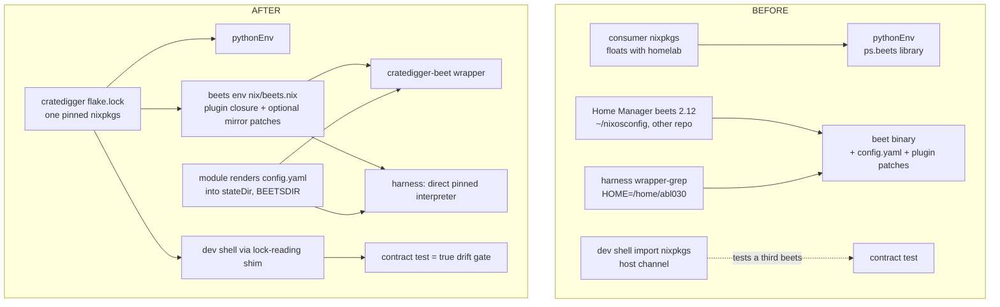
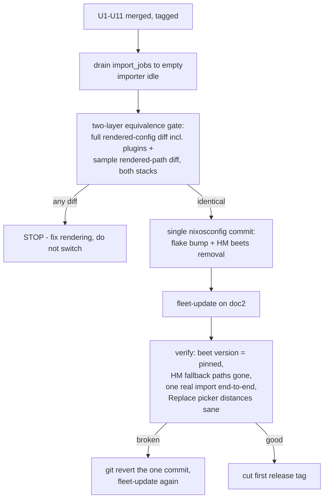

# Tier-2 Packaging - Plan

## Goal Capsule

- **Objective:** Make cratedigger reproducible for the operator and runnable by a competent NixOS stranger: the module builds from cratedigger's own flake.lock, cratedigger owns beets end-to-end (package, config, binary, library), a real flake package output exists, and known-good revs are tagged behind a `nix flake check` push hook. Explicitly NOT a supported product — no tier 3.
- **Authority:** This plan > repo conventions (CLAUDE.md, `.claude/rules/`) > implementer judgment. Single-operator data invariants (forward-only migrations, no compat shims, no committed backfill scripts) are inviolable and override anything in this plan that appears to drift from them.
- **Stop conditions:** Stop and surface to the operator if (a) the pinned-beets contract test fails against the updated flake.lock, (b) the pre-cutover equivalence gate shows ANY difference — in the full rendered beets config or in sample rendered destination paths across the two stacks, or (c) any unit requires touching `migrations/` (this plan should need zero schema changes).
- **Execution profile:** Repo work lands as normal feature-branch PRs. U12 (operator cutover) is a live-deploy operation on doc2 driven by agent + operator, not a code unit — its one-shot steps live in chat/deploy-doc per the single-operator rule.
- **Tail ownership:** After U12 verifies live, cut the first tag and update memory/docs pointers.

---

## Product Contract

### Summary

Pin the entire runtime to cratedigger's own flake.lock (module, dev shell, checks, and prod all consume one nixpkgs), move beets ownership into cratedigger (pinned package with plugin closure, module-rendered config.yaml, `cratedigger-beet` wrapper, appliance-owned library.db), expose a real package output with a version, gate tags with a `nix flake check` pre-push hook, and add stranger-boot ergonomics (`pipelineDb.createLocally`, assertions, extended moduleVm gate, mirrors runbook with public-MB fallback).

### Problem Frame

Today `nixosModules.default` is a bare path: `nix/module.nix:22` calls `pkgs.callPackage ./package.nix {}` against the **consumer's** nixpkgs, so the production Python env (including beets as a library) floats with the operator's homelab nixpkgs — independent of what cratedigger's own flake.lock and test suite saw. Worse, the `beet` binary that performs imports is a third thing entirely: the operator's Home Manager beets, reached via a hardcoded `HOME=/home/abl030` override (`lib/util.py::beets_subprocess_env`) and a harness shell script that reverse-engineers the HM wrapper's internals by grepping `.beet-wrapped`. This dev/prod skew shipped the 2026-06-29 beets 2.12 breakage (all imports broken two ways, green suite), and the gap is still open: the dev shell (`nix/shell.nix` uses `import <nixpkgs>`) tests the host channel's beets 2.12 while the flake.lock (April 2026) pins beets **2.8.0** — the one contract test built to catch beets drift validates a version production never runs. Separately, the module is not stranger-runnable: required options have no friendly errors, PostgreSQL provisioning is bring-your-own, the MB mirror URL is hardcoded in two places, and beets setup lives in a different repo.

### Requirements

**Pinning and parity**

- R1. The NixOS module builds its Python env and beets from cratedigger's own flake.lock, not the consumer's nixpkgs; a consumer-visible escape hatch exists to override the package set.
- R2. Dev shell, `nix flake check`, and production consume the same pinned nixpkgs — one beets everywhere. `nix-shell` keeps working (rules and scripts depend on it) but resolves the pinned rev, not `<nixpkgs>`.
- R3. Before the pin governs prod, cratedigger's flake.lock is updated to a rev shipping beets >= 2.12.0 (prod's current version), so cutover is a lateral move, never a downgrade. `tests/test_harness_beets2_contract.py` must pass against the pinned beets before anything ships.

**Beets ownership**

- R4. Cratedigger owns the `beet` runtime: a pinned beets package carrying the full production plugin closure (`musicbrainz discogs fetchart embedart lyrics lastgenre scrub info missing duplicates edit fromfilename ftintitle the`), with the two mirror patches (Discogs plugin -> Discogs mirror, lyrics plugin -> local LRCLIB) as optional module knobs that default OFF for strangers. A `cratedigger-beet` wrapper lands on `environment.systemPackages` as the canonical manual-ops binary for the library cratedigger manages.
- R5. The module renders `config.yaml` into the state dir. The rendered config hard-codes `import.duplicate_keys.album: [mb_albumid, discogs_albumid]` (data-loss invariant — NOT an operator-tunable option) and pins the path-affecting keys (`paths:`, `replace:`, `asciify_paths`, `path_sep_replace`) to the current production values verbatim. `directory`, `library`, fetchart widths, `musicbrainz.host/https/ratelimit` are options with production-matching defaults.
- R6. Every Home-Manager-coupled seam is deleted, not supplemented: the `HOME=/home/abl030` literal in `lib/util.py::beets_subprocess_env` (all six callsites move together), the `/etc/profiles/per-user/abl030/bin/beet` fallbacks in `lib/util.py::_beet_binary` and `harness/run_beets_harness.sh`, and the harness's `.beet-wrapped` grep-scraping. No surviving fallback may silently revert to the HM beet.
- R7. The Discogs plugin token is handled via the existing `*File` secret pattern (issue #117). A stranger with no token and no mirrors gets a config that loads cleanly — the harness must not crash or spam on the tokenless/unpatched default.

**Package and release**

- R8. The flake exposes `packages.default` (bundling the entry-point wrappers) runnable via `nix run`, carrying a version string. The flat repo layout stays — no pyproject/src-layout migration (the vulture gate, unittest discovery, and pyrightconfig all assume repo-root layout).
- R9. Known-good revs are tagged; a `scripts/pre-push` git hook runs `nix flake check` before push (no CI changes — CI stays GitGuardian-only).

**Stranger ergonomics**

- R10. `pipelineDb.createLocally = true` provisions `services.postgresql` with the ensure-role named after `cfg.user` and defaults `pipelineDb.dsn` to the local unix socket — peer authentication works by construction, no password material anywhere — and injects `after`/`requires` ordering on `cratedigger-db-migrate` so first boot cannot race PostgreSQL.
- R11. Required options without defaults get module `assertions` with actionable messages naming the option and what to set it to.
- R12. The moduleVm check becomes the stranger-boot gate: it exercises `createLocally = true` (dropping its hand-rolled postgres block), asserts the rendered beets config (duplicate_keys nesting, `musicbrainz` in plugins), and boots to a serving web UI.
- R13. The MusicBrainz API base becomes one config value threaded through all three consumers — `web/mb.py`, `scripts/pipeline_cli.py`, and the rendered beets `musicbrainz.host` — defaulting to public `musicbrainz.org` when no mirror is configured (documented as functional-but-slow). The Discogs API base (`web/discogs.py`) becomes an option too, but with a **mirror-required** contract: `web/discogs.py` speaks the Rust mirror's endpoint shape and response schema, which public api.discogs.com does not serve, so there is no functional public-Discogs fallback — mirror-less installs get MB browse only, documented as such. (The beets discogs plugin's own public-Discogs path, used by imports, is unaffected.)
- R14. A `docs/mirrors.md` runbook documents standing up both mirrors and the public-MB fallback; `docs/beets-primer.md`, `docs/nixos-module.md`, and CLAUDE.md are updated to the new ownership reality. The MB Rust mirror rewrite (`mb-api`) is named as the endgame; Discogs mirror packaging is named as a follow-up plan in the discogs-api repo.

**Operator cutover**

- R15. The live doc2 install migrates to module-owned beets with: the importer queue drained to empty before the switch, a mechanical config-equivalence diff (rendered module config vs live HM config, path-affecting keys) gating the cutover, the flake bump + HM beets removal landing as a single revertable nixosconfig commit, and a live verification checklist afterward (real import through the module-owned beet).

### Scope Boundaries

**Deferred to Follow-Up Work**

- Discogs mirror packaging: its own plan in the `discogs-api` repo (flake + generic upstream module, same pattern as this plan). Referenced from `docs/mirrors.md`.
- MusicBrainz Rust mirror (`mb-api`): sibling project reimplementing the observed WS/2 subset (XML for musicbrainzngs/beets, JSON for `web/mb.py`) with golden-diff verification against the running mirror, Discogs-style full-dump re-import, PG FTS search. Replaces the hardest section of the mirrors runbook when it lands.
- Residual `/mnt/virtio` literals beyond what U5 touches (only load-bearing ones move now).

**Outside this product's identity**

- Docker/OCI images and non-NixOS installs.
- Tier 3: versioned upgrade guarantees, compat shims, reversible migrations, committed backfill scripts, support promises.
- pyproject/src-layout packaging migration — evaluated and rejected (see KTD4).

---

## Planning Contract

### Key Technical Decisions

- KTD1. **Module closes over its own nixpkgs via a flake-level wrapper.** `flake.nix` exports `nixosModules.default` as a module that imports `nix/module.nix` and supplies the pinned package set (instantiated from `self.inputs.nixpkgs` for the consumer's `pkgs.stdenv.hostPlatform.system`). A `services.cratedigger.packageSet`-style escape hatch lets a consumer substitute their own pkgs deliberately. Rationale: flake.lock becomes the single source of truth for the runtime closure; cost is a second nixpkgs evaluation on the consumer host, which is the standard trade.
- KTD2. **Flake update precedes pinning — verified fact, not assumption.** flake.lock currently pins nixpkgs 2026-04-14 = beets 2.8.0 (NixHub: 2.9.0 landed 2026-04-16; 2.12.0 current since 2026-06-27); prod HM beets is 2.12. Pinning without updating downgrades prod and resurrects the 2026-06-29 breakage in reverse — undetected, because `nix/shell.nix` uses `import <nixpkgs>` so the contract test runs against the host channel, not the pin. U1 updates the lock and re-points `nix-shell` at the locked rev (a `flake.lock`-reading fetchTarball shim in `nix/shell.nix`), making `tests/test_harness_beets2_contract.py` the true drift gate for every future `nix flake update`.
- KTD3. **One beets, addressed via `BEETSDIR`.** A single pinned beets env (package + plugin closure, `nix/beets.nix`) serves all four consumers: the harness importer, `lib/beets_distance.py`'s library import in cratedigger-web, the dev shell, and `cratedigger-beet`. Processes locate the module-rendered config via the `BEETSDIR` environment variable (beets' native config-dir override) instead of the `HOME` impersonation hack. `harness/run_beets_harness.sh` collapses to a direct invocation of the pinned interpreter — the module *knows* the interpreter and site-packages, so the `.beet-wrapped` archaeology is deleted. `${src}` stays OFF the beets subprocess path (the `lib/beets.py` shadow hazard, `nix/module.nix:49-56`).
- KTD4. **Flat layout; package output is a wrapper bundle, not a buildPythonApplication.** `lib/`/`scripts/`/`harness/` have no `__init__.py`, every entry point does a `sys.path.insert` bootstrap, and `scripts/find_dead_code.sh`'s hardcoded source list, unittest discovery, and `pyrightconfig.json` all assume repo-root layout. A src-layout migration is high-churn, low-value, and reopens the `lib/beets.py` shadow bug. Instead `packages.default` bundles the existing `writeShellScriptBin` wrappers (symlinkJoin), with `version` derived from the latest tag / `self.shortRev` fallback.
- KTD5. **`createLocally` follows the stock NixOS pattern, with peer auth by construction.** `services.postgresql.enable` + `ensureDatabases`/`ensureUsers` where the ensure-role is named after `cfg.user` (whatever it is, including the default `root`), and the DSN defaults to the local unix socket — `ensureUsers` authenticates by socket-peer identity, so naming the role after the service user makes auth work with zero credentials, no pg_hba loosening, and nothing for the `*File` secret pattern to carry. Plus `after = requires = [ "postgresql.service" ]` on `cratedigger-db-migrate` — the ordering that today exists only inside the VM test's hand-rolled node (`nix/tests/module-vm.nix`). The operator's nspawn DB keeps working: `createLocally` defaults false and doc2 continues passing a DSN.
- KTD6. **One MB value, three consumers.** New `[MusicBrainz] api_base` in config.ini + module option (default `https://musicbrainz.org`; doc2 sets the mirror). Wired to: `web/server.py`'s existing-but-unwired `--mb-api` (module `webPkg` passes it), a new equivalent in `scripts/pipeline_cli.py` (which has a second hardcoded copy today), and the rendered beets `musicbrainz.host`/`https`/`ratelimit` (derived from the URL: mirror -> ratelimit 100, public -> ratelimit 1, mirroring the harness `--upstream` block's values). `web/discogs.py`'s `DISCOGS_API_BASE` gets the same option shape but no public default — its endpoints and msgspec Structs are shaped to the Rust mirror, so Discogs browse is mirror-required (any public-Discogs translation adapter belongs to the discogs-api follow-up, not this plan).
- KTD7. **Cutover is gated mechanically, not by prose.** Before the doc2 switch: drain `import_jobs` to empty, then run a two-layer equivalence check: (a) diff the full rendered module `config.yaml` — including the plugin list — against the live HM `~/.config/beets/config.yaml`, and (b) render actual destination paths for a sample of real library items under both stacks (module config × pinned beet vs HM config × HM beet) and diff the rendered paths. Any difference blocks cutover. Layer (b) is the load-bearing one: rendered paths depend not just on the path-affecting keys but on the plugin set (`ftintitle`/`fromfilename` mutate the fields the templates consume) and the beets version's template semantics — a key-subset diff can pass while paths still drift (the 2026-05-18 asciify incident split 1,178 Plex albums from exactly this class of drift + post-import `beet move`). The nixosconfig change (cratedigger flake bump + HM beets removal) is one commit so `git revert` restores both.

### Risks & Dependencies

- **Beets drift trigger moves into this repo.** After U1/U2, a `nix flake update` inside cratedigger — not the consumer's nixpkgs bump — is what changes the beets version prod runs. Mitigation: `tests/test_harness_beets2_contract.py` runs against the pinned beets in every suite run and the pre-push `nix flake check`; `.claude/rules/deploy.md` gains a line making the contract test an explicit step of every flake update (U9/U11).
- **Cutover blast radius on the curated library.** Config drift in path-affecting keys + the importer's post-import `beet move` reproduces the 2026-05-18 asciify pattern (1,178 split albums). Mitigation: KTD7's two-layer equivalence gate (full rendered config + sample rendered paths under both stacks) blocks the switch on any difference; importer queue drained; single revertable nixosconfig commit.
- **Discogs plugin behavior without a token is unverified.** The stranger default (no token, unpatched plugin) could error at load or per-import. U3 carries a test scenario for it; if the plugin proves noisy, the fallback is documented token-required or a stub token file — decide in U3, not here.
- **Public-MB degraded mode is honest but slow.** ~1 req/s against per-cycle album counts interacts with the oneshot's `TimeoutStartSec`; supported-but-slow is the promise, documented in `docs/mirrors.md` (U11). No throttling of search cadence — R20 stands.
- **Double nixpkgs evaluation on the consumer host** (cratedigger's pin alongside the homelab's). Accepted standard trade for closure fidelity; the KTD1 escape hatch exists for consumers who refuse it.
- **Pre-push hook latency.** First `nix flake check` per machine builds the moduleVm (~minutes); subsequent runs are cache-hits. Documented in the script header; `git push --no-verify` remains the deliberate escape.
- **`nix-shell` shim fetches the locked nixpkgs tarball once per machine.** GC-root it the same way the existing shellHook roots `.pyright-venv` so `nix-collect-garbage` doesn't force re-downloads.

### High-Level Technical Design

Runtime closure before and after — who supplies `beet` and its config:

Operator cutover sequence (U12):

---

## Implementation Units

Unit index:

| U-ID | Title | Key files | Depends on |
|---|---|---|---|
| U1 | Flake update + dev-shell pin unification | flake.lock, nix/shell.nix | — |
| U2 | Module builds from own pin | flake.nix, nix/module.nix | U1 |
| U3 | Owned beets package + plugin closure | nix/beets.nix, nix/package.nix | U1 |
| U4 | Module renders beets config.yaml | nix/module.nix, nix/tests/module-vm.nix | U2, U3 |
| U5 | Python/harness seam rewiring | lib/util.py, harness/run_beets_harness.sh | U4 |
| U6 | MB + Discogs API base options | web/mb.py, scripts/pipeline_cli.py, web/discogs.py | U4 |
| U7 | createLocally + assertions | nix/module.nix | U2 |
| U8 | packages.default + version | flake.nix | U2 |
| U9 | Pre-push hook + tagging | scripts/pre-push | U8 |
| U10 | moduleVm stranger-boot gate | nix/tests/module-vm.nix | U4, U7 |
| U11 | Docs: mirrors runbook + ownership updates | docs/ | U4, U6 |
| U12 | Operator cutover (doc2) | live operation | all |

### U1. Flake update + dev-shell pin unification

- **Goal:** One nixpkgs everywhere, at a rev shipping beets >= 2.12.0.
- **Requirements:** R2, R3
- **Dependencies:** none
- **Files:** `flake.nix`, `flake.lock`, `nix/shell.nix`; verify `pyrightconfig.json` / `.pyright-venv` shellHook still resolves.
- **Approach:** `nix flake update` to current nixos-unstable. Change `nix/shell.nix`'s default `pkgs` from `import <nixpkgs> {}` to a shim that reads the locked rev out of `flake.lock` (builtins.fromJSON + fetchTarball), so plain `nix-shell` — which every rule and script uses — resolves the pinned rev. `nix develop` path (flake devShell) already uses the lock.
- **Execution note:** Run the full suite in the re-pinned shell FIRST; the real-beets contract test passing against the locked beets is the unit's exit criterion, not an afterthought.
- **Test scenarios:**
  - Full suite green in the pinned shell (`nix-shell --run "bash scripts/run_tests.sh"`), specifically `tests/test_harness_beets2_contract.py` (pins 2-arg `library.Library` and `get_duplicate_action`).
  - `nix-shell --run "python3 -c 'import beets; print(beets.__version__)'"` reports the locked version, and it is >= 2.12.0.
  - Pyright clean repo-wide in the pinned shell.
- **Verification:** Dev shell and `nix flake check` provably consume the same nixpkgs rev (same store path for the python env).

### U2. Module builds from cratedigger's own pin

- **Goal:** `nixosModules.default` supplies the pinned package set; consumer nixpkgs no longer determines the runtime closure.
- **Requirements:** R1
- **Dependencies:** U1
- **Files:** `flake.nix`, `nix/module.nix`, `tests/test_nix_module.py`, `docs/nixos-module.md`.
- **Approach:** Export the module from `flake.nix` as a wrapper closing over `self.inputs.nixpkgs`, instantiated per the consumer's `hostPlatform.system`; thread the resulting package set into `nix/module.nix` in place of the ambient `pkgs` for `callPackage ./package.nix` and the beets env (U3). Add an explicit override option (escape hatch) with a doc note that using it forfeits the tested-closure guarantee. Keep `nix/module.nix` importable standalone for the VM check.
- **Patterns to follow:** The existing generic-upstream/homelab-wrapper split (`docs/nixos-module.md`); `tests/test_nix_module.py`'s literal-assertion style — update its assertions in the same commit, don't delete them.
- **Test scenarios:**
  - moduleVm passes with the wrapped export.
  - `tests/test_nix_module.py`: PYTHONPATH still carries only `${src}`; updated assertions cover the new package-set threading.
  - Eval-level: a consumer overriding the escape hatch gets their pkgs (assert via `nix eval` in the VM check or a flake check).
- **Verification:** Building the module's pythonEnv from a consumer flake with a *different* nixpkgs rev produces the store path from cratedigger's lock, not the consumer's.

### U3. Owned beets package + plugin closure

- **Goal:** One pinned beets env with the full production plugin set and optional mirror patches; `cratedigger-beet` wrapper.
- **Requirements:** R4, R7
- **Dependencies:** U1
- **Files:** `nix/beets.nix` (new), `nix/package.nix`, `nix/shell.nix`, `nix/module.nix` (wrapper bin + systemPackages).
- **Approach:** Package beets via nixpkgs' beets plugin mechanism with the production list: `musicbrainz discogs fetchart embedart lyrics lastgenre scrub info missing duplicates edit fromfilename ftintitle the` (no chroma — no fpcalc needed). Port the two `substituteInPlace` patches from the HM module in ~/nixosconfig as functions of module options: `discogsMirrorUrl` (patches the discogs plugin's base URL when set) and `lrclibUrl` (patches the lyrics plugin when set); both null/off by default so a stranger gets stock plugin behavior. `pythonEnv`'s `ps.beets` (for `lib/beets_distance.py`) and the dev shell consume this same beets derivation. `cratedigger-beet` = writeShellScriptBin exporting `BEETSDIR` at the module-rendered config dir, exec'ing the pinned `beet`; goes on `environment.systemPackages`.
- **Patterns to follow:** The `yt-dlp` single-boundary PATH comment in `nix/module.nix:97-103` (one owner for a binary lookup); issue #117 `*File` secret pattern for the Discogs token.
- **Test scenarios:**
  - Real-beets contract test passes against this derivation (not just raw `ps.beets`).
  - VM check: `cratedigger-beet --version` (or `beet version`) runs and lists the full plugin set loaded.
  - With mirror knobs unset, the beets env contains unpatched plugins (assert the LRCLIB/mirror URLs absent from the built plugin files); with knobs set, present.
  - Tokenless default: `beet config` under the rendered stranger config exits 0 (no crash from discogs plugin without token).
- **Verification:** Exactly one beets store path is referenced by pythonEnv, dev shell, harness wiring, and `cratedigger-beet`.

### U4. Module renders beets config.yaml

- **Goal:** The module owns the beets config; `BEETSDIR` points every consumer at it.
- **Requirements:** R5, R7, R13 (the `musicbrainz.host` leg)
- **Dependencies:** U2, U3
- **Files:** `nix/module.nix` (new `beetsConfig` option group + writeText render + preStart placement), `nix/tests/module-vm.nix`, `docs/nixos-module.md`.
- **Approach:** New option group mirroring the production HM config (source of truth: `docs/beets-primer.md` lines 41-116): `directory`, `library`, import block (copy:false, move:true, write:true, incremental:true), `paths:` templates, `replace:`, fetchart widths (maxwidth 500 / minwidth 300 — load-bearing: library size + Meelo black-box floor), plugin list (fixed, not operator-blankable), `musicbrainz.{host,https,ratelimit}` defaulting to public musicbrainz.org (host `musicbrainz.org`, https on, ratelimit 1 — the harness `--upstream` block's values), which U6 later overrides by threading the shared `[MusicBrainz] api_base` option through; discogs token via `include:` of a `*File`-materialized secrets.yaml. `import.duplicate_keys.album: [mb_albumid, discogs_albumid]` is rendered as a literal — no option exposes it. Render to `${stateDir}/beets/config.yaml` in preStart (atomic mv, same as config.ini). Path-affecting keys default to today's exact production values.
- **Execution note:** Write the VM assertions for duplicate_keys nesting and plugin-list presence BEFORE the render code (RED first) — these are the Palo Santo and zero-candidates guards moving to first-line-of-defense.
- **Test scenarios:**
  - VM check parses rendered YAML: `duplicate_keys` nested under `import:` with exactly the two keys; `musicbrainz` present in plugins.
  - VM check: config renders with beetsValidation enabled and no secrets present (stranger path) without breaking boot.
  - `tests/test_nix_module.py`: render-block literal assertions (mirror the config.ini assertions style).
  - Harness's own `_assert_duplicate_keys_include_mb_albumid` still passes against the rendered config (defense in depth retained); update its error-message text to name the module option path instead of `~/.config/beets/config.yaml`.
- **Verification:** A VM-booted system has `${stateDir}/beets/config.yaml` whose path-affecting keys byte-match the defaults documented in `docs/beets-primer.md`.

### U5. Python/harness seam rewiring

- **Goal:** Delete every HM coupling; all beets subprocesses resolve the pinned beet + rendered config via configuration.
- **Requirements:** R6
- **Dependencies:** U4
- **Files:** `lib/util.py` (`beets_subprocess_env`, `_beet_binary`), `harness/run_beets_harness.sh`, `lib/config.py` (new `[Beets]` keys: config dir, beet binary), `nix/module.nix` (render the new keys), `harness/beets_harness.py` (MUTATIONS_LOG_PATH derived from library dir), tests.
- **Approach:** `beets_subprocess_env()` sets `BEETSDIR` from `CratediggerConfig` (new config.ini key rendered by the module) — the `HOME=/home/abl030` literal is deleted. `_beet_binary()` reads the configured binary path (module renders the pinned beet's store path); the `/etc/profiles/per-user/abl030` fallback is deleted. `run_beets_harness.sh` collapses to exec'ing the pinned interpreter with the beets env's site-packages (provided via env vars from the module wrapper) — all `.beet-wrapped` grep-scraping deleted. All six `beets_subprocess_env` callsites (`lib/import_dispatch.py`, `lib/beets_album_op.py`, `lib/beets.py`, `harness/import_one.py`, ban-source via `web/routes/pipeline.py`, `remove_and_reset_release`) move in this one unit. `${src}` must never land on the beets subprocess PYTHONPATH (`lib/beets.py` shadow hazard).
- **Patterns to follow:** `.claude/rules/harness.md`; kwarg-DI seams from `.claude/rules/code-quality.md` for testability; `tests/fakes.py` for orchestration tests.
- **Test scenarios:**
  - Unit: `beets_subprocess_env` returns `BEETSDIR` from config; no `HOME` literal remains (grep-style guard test).
  - Real-beets contract test green through the new invocation path (subprocess launched exactly as production launches it).
  - Failure path: unset/missing beets config dir -> actionable error, not silent HM fallback.
  - Grep guard: `/home/abl030` and `/etc/profiles/per-user` appear nowhere in `lib/`, `harness/`, `scripts/` (test asserts absence — this is R6's "deleted, not supplemented" made mechanical).
- **Verification:** On a VM boot, a harness dry invocation uses the pinned interpreter and rendered config with no reference to any per-user profile path.

### U6. MB + Discogs API base options

- **Goal:** Mirror URLs become configuration; mirror-less installs work against public MusicBrainz, and Discogs browse is explicitly mirror-required.
- **Requirements:** R13
- **Dependencies:** U4 (beets leg)
- **Files:** `web/mb.py`, `web/server.py`, `scripts/pipeline_cli.py`, `web/discogs.py`, `lib/config.py`, `nix/module.nix`, `tests/web/` contract tests, `tests/test_pipeline_cli.py`.
- **Approach:** New `[MusicBrainz] api_base` and `[Discogs] api_base` config keys + module options. MB defaults to `https://musicbrainz.org`; the Discogs base has no public default — unset means Discogs browse is off with a clear mirror-required message, because `web/discogs.py`'s paths (`/api/search`, `/api/masters/{id}`) and response Structs are the Rust mirror's shape, not api.discogs.com's (R13). The operator's homelab wrapper sets both mirrors. Wire `web/server.py --mb-api` (exists at line ~494, unwired) from `webPkg`; replace `scripts/pipeline_cli.py:89`'s second hardcoded copy with the config/flag value; same option plumbing for `web/discogs.py:27`. Beets `musicbrainz.{host,https,ratelimit}` thread from the same MB value, overriding U4's public-MB default (mirror -> host:port/http/ratelimit 100; no mirror -> U4's default stands).
- **Test scenarios:**
  - Contract tests: web routes hit the configured base (assert the URL construction, not live network).
  - `pipeline-cli` flag/config plumbing test (exit-code path unchanged).
  - Rendered beets config flips host/https/ratelimit correctly for mirror vs public values (VM or render unit test).
  - Public-MB default documented as degraded-but-supported: note the ~1 req/s vs per-cycle album count interaction in `docs/mirrors.md` (U11).
  - Discogs base unset: Discogs browse routes return a clear mirror-required response (contract test), not a broken upstream fetch.
- **Verification:** Grep shows no remaining hardcoded `192.168.1.35:5200` in `web/` or `scripts/`; doc2's homelab wrapper sets both mirrors explicitly.

### U7. createLocally + assertions

- **Goal:** A stranger gets PostgreSQL and friendly failures for free.
- **Requirements:** R10, R11
- **Dependencies:** U2
- **Files:** `nix/module.nix`, `nix/tests/module-vm.nix`, `tests/test_nix_module.py`, `docs/nixos-module.md`.
- **Approach:** `pipelineDb.createLocally` (default false): enables `services.postgresql` with `ensureDatabases`/`ensureUsers`, the ensure-role named after `cfg.user` so unix-socket peer auth works by construction (KTD5 — no password, no pg_hba changes, nothing in config.ini), defaults `pipelineDb.dsn` to the local socket, adds `after`/`requires = [ "postgresql.service" ]` to `cratedigger-db-migrate` (the ordering that today lives only in the VM test node — move it into the module). Assertions: required-option presence with messages naming the option (`slskd.downloadDir`, `beetsValidation.stagingDir`/`trackingFile` when enabled, `pipelineDb.dsn` xor `createLocally`, mirror-knob coherence). Follow the existing meelo/plex/jellyfin assertion block's style.
- **Test scenarios:**
  - VM: `createLocally = true` boots to green migrate + serving web with no hand-rolled postgres in the test node.
  - Peer-auth by construction: the `createLocally` VM connects over the unix socket as `cfg.user` with no password material in `config.ini`, the DSN, or the rendered systemd units (grep assertion).
  - Eval test: missing `slskd.downloadDir` fails eval with the friendly message (assert message text).
  - doc2 path unchanged: `createLocally = false` + DSN behaves exactly as today (VM variant or eval assert).
- **Verification:** First-boot VM with `createLocally` never hits the migrate-before-postgres race (migrate unit ordered after postgresql.service).

### U8. packages.default + version

- **Goal:** `nix run github:abl030/cratedigger#pipeline-cli` works; the flake has a version.
- **Requirements:** R8
- **Dependencies:** U2
- **Files:** `flake.nix`, `nix/package.nix` (or a new `nix/wrappers.nix`), README/docs touch.
- **Approach:** `packages.default` = symlinkJoin (or buildEnv) of the existing wrapper bins with `pname = "cratedigger"` and `version` = latest tag when available, else `0-unstable-${self.shortRev or "dirty"}`. Expose `apps` for the primary entry points. No pyproject, no layout change (KTD4). Wrappers needing a DSN keep their current behavior of requiring flags/env — `nix run` is for the CLI surfaces, not the daemons.
- **Test scenarios:**
  - `nix build .#default` succeeds; `nix run .#pipeline-cli -- --help` exits 0.
  - `nix flake check` covers the package build (add to checks).
  - Version string visible in `nix eval .#default.version`.
- **Verification:** A stranger can `nix run` the CLI without cloning.

### U9. Pre-push hook + tagging

- **Goal:** Tags are verifiably green without CI.
- **Requirements:** R9
- **Dependencies:** U8
- **Files:** `scripts/pre-push` (new), CLAUDE.md § pre-commit hook, `.claude/rules/deploy.md`.
- **Approach:** `scripts/pre-push` runs `nix flake check` (moduleVm + package build; cached evaluations make repeat runs cheap — note the first-run cost in the script header). Install: `ln -sf ../../scripts/pre-push .git/hooks/pre-push`, documented next to the existing pre-commit line. Tag convention: `vYYYY.MM.DD` (date of deploy-worthy state; suffix `-N` for same-day). Tagging happens after live verification, so the hook gates the push, the tag records the verified state.
- **Test scenarios:** Test expectation: none — hook + convention docs; the hook's behavior is `nix flake check` itself, covered by U8/U10's checks.
- **Verification:** A push with a deliberately broken module fails at the hook.

### U10. moduleVm stranger-boot gate

- **Goal:** The VM check proves "a stranger can boot this" every `nix flake check`.
- **Requirements:** R12
- **Dependencies:** U4, U7
- **Files:** `nix/tests/module-vm.nix`.
- **Approach:** Reshape the VM node to the stranger posture: `createLocally = true` (drop the hand-rolled postgres + manual ordering), beetsValidation enabled so the beets config renders, no mirror knobs, no secrets beyond the stubbed slskd key. Assertions added across U4/U7 consolidate here: migrate green, rendered config.ini AND config.yaml correct (duplicate_keys nesting, plugins list, MB defaults = public), web serving, `cratedigger-beet` on PATH and loads plugins, unit ordering vs postgresql.service. Keep runtime < a few minutes so the pre-push hook stays tolerable.
- **Test scenarios:** (This unit IS the test.) The scenario matrix: stranger-default boot; assert each invariant named in R12.
- **Verification:** `nix build .#checks.x86_64-linux.moduleVm` green from a clean eval.

### U11. Docs: mirrors runbook + ownership updates

- **Goal:** Documentation matches the new ownership reality; strangers have an honest system-requirements page.
- **Requirements:** R14
- **Dependencies:** U4, U6
- **Files:** `docs/mirrors.md` (new), `docs/beets-primer.md`, `docs/nixos-module.md`, `docs/musicbrainz-mirror.md`, `docs/web-dev-server.md`, `CLAUDE.md`, `.claude/rules/harness.md`, `.claude/rules/web.md`.
- **Approach:** `docs/mirrors.md`: what each mirror is, how the operator's are stood up (MB podman stack incl. replication token; Discogs via the discogs-api repo + its NixOS module; LRCLIB), the public-MB fallback with the rate-limit math (~1 req/s vs per-cycle album counts — functional, slow), the Discogs-browse-is-mirror-required stance (R13), `services.slskd` exists in nixpkgs for the slskd prerequisite, and the endgame note: `mb-api` Rust mirror as a follow-up project, Discogs packaging as a follow-up plan in discogs-api. Rewrite `docs/beets-primer.md`'s ownership sections (HM references -> module options; `cratedigger-beet` as the manual-ops binary; the "never edit config.yaml" warning re-pointed at module options). Update CLAUDE.md subsystem bullets (Beets no longer "via Home Manager"), key-paths table, and rules files that name HM paths.
- **Test scenarios:** Test expectation: none — documentation. The route-audit/dead-code gates are unaffected.
- **Verification:** Grep for `/etc/profiles/per-user` and "Home Manager" across docs returns only historical/incident references.

### U12. Operator cutover (doc2)

- **Goal:** The live install runs module-owned beets, verified end-to-end.
- **Requirements:** R15, R3
- **Dependencies:** all prior units merged and deployed-ready.
- **Files:** none committed — live operation per the single-operator rule (one-shot steps in chat/deploy notes; `.claude/rules/deploy.md` § flow applies).
- **Approach:** (1) Merge + push cratedigger; (2) drain: stop enqueuing, wait `import_jobs` empty, confirm importer idle; (3) equivalence gate (KTD7, two layers): diff the full rendered module beets config (incl. plugin list) against live `/home/abl030/.config/beets/config.yaml`, AND diff rendered destination paths for a sample of real library items under both stacks (module config × pinned beet vs HM config × HM beet) — any diff in either layer stops the cutover; (4) single nixosconfig commit: `nix flake update cratedigger-src` + remove the HM beets module + wrapper sets mirror knobs (Discogs mirror, LRCLIB, MB mirror URL) and Discogs token file; (5) `fleet-update` on doc2; (6) verify: `cratedigger-beet` version = pinned >= 2.12, grep deployed store for the deleted HM literals (absent), one real album import end-to-end through the queue, Replace-picker distance sanity (beets_distance now on pinned beets), ban-source path exercised or code-inspected; (7) rollback if broken: revert the one nixosconfig commit, fleet-update; (8) cut the first tag.
- **Execution note:** This is an operator-in-the-loop deploy window. Do not commit backfill/cutover scripts; the equivalence diff is a transient invocation.
- **Test scenarios:** Live verification checklist above stands in for tests; each item is a boolean the operator/agent records in the deploy notes.
- **Verification:** A post-cutover import succeeds with the HM beets module deleted from nixosconfig and no per-user profile references in the running closure.

---

## Verification Contract

| Gate | Command | Applies to |
|---|---|---|
| Full suite (pinned shell) | `nix-shell --run "bash scripts/run_tests.sh"` then read `/tmp/cratedigger-test-output.txt` | every unit touching `.py`/`.js` |
| Pyright (whole repo) | `nix-shell --run "pyright"` — 0 errors | every unit touching `.py` |
| Real-beets drift gate | `tests/test_harness_beets2_contract.py` inside the pinned shell | U1, U3, U5, and every future `nix flake update` |
| Module VM boot gate | `nix build .#checks.x86_64-linux.moduleVm` | U2, U4, U7, U10 |
| Package build | `nix build .#default` + `nix run .#pipeline-cli -- --help` | U8 |
| Flake check (hook) | `nix flake check` via `scripts/pre-push` | every push from U9 on |
| Cutover equivalence gate | two layers: full rendered config.yaml diff (incl. plugins) vs live HM config + sample rendered-path diff under both stacks; importer queue empty | U12 only |
| Live verification | real import end-to-end on doc2, pinned `beet version`, HM literals absent from closure | U12 |

Quality-bar notes: mock rules per `.claude/rules/code-quality.md` (leaf-seam only; `FakePipelineDB`/`FakeBeetsDB` for our types); the R6 grep-guard test makes "deleted, not supplemented" mechanical; no skipped tests (audit enforces).

## Definition of Done

- All units U1–U11 merged via feature-branch PRs (merge commits), each with the suite + pyright green in the **pinned** shell.
- moduleVm green in the stranger posture (`createLocally = true`, rendered beets config asserted, public-MB defaults).
- U12 completed live: doc2 imports through the module-owned pinned beets, HM beets module deleted from nixosconfig, verification checklist recorded.
- First release tag cut post-verification; pre-push hook installed and documented.
- Docs updated (mirrors runbook exists; no stale HM-ownership references outside incident history).
- Cleanup: no dead-end code from abandoned approaches in the final diffs; vulture baseline regenerated if deletions expose orphans; no committed one-shot cutover scripts.
