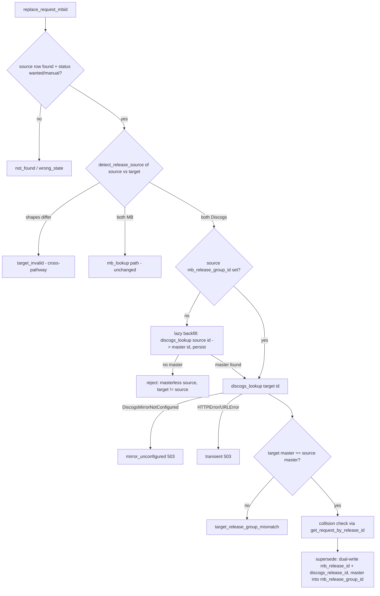

# Discogs-Pathway Replace - Plan

## Goal Capsule

- **Objective:** Extend the Replace operator action to Discogs-pathway requests — a Discogs-master-anchored sibling picker with the same supersede/audit semantics MB Replace already has.
- **Product authority:** GitHub issue #282, scoped and confirmed by the operator; Product Contract below is the confirmed scope.
- **Product Contract preservation:** unchanged from the brainstorm except (a) R10-R11 added — service-level guardrails surfaced by flow analysis (master-mismatch gate, mirror-unconfigured outcome); (b) the Outstanding Question (persist vs live-lookup master anchor) is resolved into KTD-1 and the section removed; (c) R6 clarified in review — parity is with MB Replace's supersede (base identity, no resolver re-run), not the full add flow.
- **Open blockers:** None.
- **Stop conditions:** Any change that would touch MB Replace behavior beyond routing (R3), or that requires a new `album_requests` column, contradicts this plan — stop and surface rather than improvise.

---

## Product Contract

### Summary

Recreate Replace for Discogs-pathway requests: from a stuck Discogs request, the operator opens a picker of the other pressings of the same album (siblings under the release's Discogs master), picks one, and the request is superseded with the same audit chain as MB Replace. Same-pathway only; nothing new conceptually.

### Problem Frame

Replace shipped MB-only (#279/#280). A Discogs-pathway request — a numeric Discogs id — fails at two gates: the target must be a UUID-shaped MBID, and source release-group resolution has no Discogs branch. The #280 backfill skipped 124 Discogs rows as "non-MB id; no release-group concept", so those requests have no first-class repoint path at all.

The operator job this serves is simple: "we keep downloading the wrong release for this request — show me the other pressings of this album." Pendulum's *Hold Your Colour* is the canonical case: many pressings, and the one the request anchors on is not the one Soulseek peers actually carry. An operator action that exists for one pathway and not the other is also exactly the MB/Discogs adapter asymmetry the project doctrine forbids.

### Key Decisions

- **Discogs master is the release-group analog.** The picker anchors on the source release's master, the same way MB anchors on the release group. Production precedent: the YouTube resolver already enumerates Discogs siblings via the master and treats it as the RG analog.
- **Same-pathway siblings only; lists are never merged.** MB and Discogs are disjoint ID spaces, and the resolver precedent deliberately keeps their sibling lists separate. A Discogs row's picker shows Discogs releases only.
- **Minimum recreation, no rework.** The existing MB Replace machinery (service, picker, supersede semantics) is extended, not refactored or simplified.
- **Masterless releases inherit the orphan shape.** A Discogs release with no master gets a one-element sibling list (itself), not an error — matching how the YouTube resolver handles the same case.

### Requirements

**Picker**

- R1. A Discogs-pathway request's Replace picker lists the sibling releases of the source release's Discogs master — other pressings of the same album, Discogs releases only.
- R2. A masterless Discogs release yields a picker containing only the current release, presented as "nothing to swap to" rather than an error.
- R3. MB-pathway picker behavior is unchanged.

**Replace action**

- R4. Replace accepts a Discogs release id as target when the source request is Discogs-pathway; a target from the other pathway is rejected as invalid.
- R5. Supersede semantics are identical to MB Replace: the old row flips to `replaced` (terminal, frozen audit), the new row is created as `wanted` pointing back via `replaces_request_id`, and the next pipeline cycle rebuilds derived state.
- R6. The superseded-into row carries complete Discogs identity — `mb_release_id` and `discogs_release_id` dual-written as the add flow writes them; resolver-derived fields (`is_va_compilation`, `release_group_year`, `catalog_number`, `track_artist`) are not re-resolved, matching MB Replace's supersede.
- R7. Strict pressing identity holds: the new request anchors on exactly the Discogs release id the operator picked — no substitution, no sibling fallback.

**Service guardrails**

- R10. The service rejects a Discogs target that is not a sibling of the source's master (the Discogs analog of MB's release-group-mismatch gate), so a caller bypassing the picker cannot cross albums. A masterless source rejects every target other than itself.
- R11. An unconfigured Discogs mirror surfaces as its own outcome — distinct from "invalid target" and from "transient" — so the operator sees "mirror not set up", not "your pick was bad".

**Surface parity**

- R8. The action exists on both `pipeline-cli` and the web API, wrapping the same service method with matched exit-code/status-code mappings.
- R9. The web Replace picker works from a Discogs-pathway request row; its backing sibling-enumeration route accepts Discogs ids (today it rejects numeric ids with 422).

### Key Flows

- F1. Repoint a stuck Discogs request
  - **Trigger:** Operator notices a Discogs request repeatedly downloading or rejecting the wrong release.
  - **Steps:** Operator opens Replace on the request; the picker enumerates the master's sibling pressings; operator picks one; the service supersedes the row; the pipeline's next cycle searches the new pressing.
  - **Outcome:** Old row frozen as `replaced` audit, new `wanted` row back-linked, no manual DB surgery.
  - **Covers:** R1, R4, R5, R6, R7.

### Acceptance Examples

- AE1. **Covers R2, R10.** Given a Discogs-pathway request whose release has no master, when the operator opens Replace, then the picker shows only the current release; any submitted target other than the current release is rejected. The operator's fallback is delete-and-re-add via browse.
- AE2. **Covers R4.** Given a Discogs-pathway request, when the operator submits an MB UUID as the replacement target, then the action is rejected as invalid — cross-pathway replace is not supported.
- AE3. **Covers R11.** Given a host with no Discogs mirror configured, when the operator attempts Replace on a Discogs request, then the outcome names the missing mirror (HTTP 503 / CLI exit 5), not an invalid-target error.

### Success Criteria

- Every Discogs-pathway request in the pipeline DB — including the 124 rows the #280 backfill skipped — can be replaced through the picker, except masterless releases, which correctly present as having no siblings.

### Scope Boundaries

- Cross-pathway replace (Discogs↔MB, scenario (c) in #282) — out. Delete-and-re-add via browse covers the rare pathway jump, at the acknowledged cost of the `replaces_request_id` audit link.
- Mixed-pathway picker (showing MB and Discogs candidates together) — out; lists are never merged.
- Refactoring or simplifying the existing MB Replace machinery — out; this issue only recreates the action for the second pathway.
- Special handling for upstream Discogs rename/merge in dump rebuilds (scenario (b)) — no dedicated machinery; Replace itself is the remedy when it happens.
- The picker's inverted mode (`requests-by-rg`) for Discogs — deferred to follow-up; standard mode covers the operator job.
- Beets-distance badges for Discogs siblings — the `/api/beets-distance` route is UUID-anchored, so the badge silently doesn't render on Discogs rows; widening it is deferred to follow-up. Tracklist comparison remains the pressing-selection aid.

### Dependencies / Assumptions

- The Discogs mirror is required for master sibling enumeration, consistent with Discogs browse being mirror-required today (R11 covers the unconfigured case).
- Pathway is inferred from the id's shape (UUID vs numeric, `lib/release_identity.py::detect_release_source`); this inference is authoritative for routing the service branch and validating targets.

---

## Planning Contract

### Key Technical Decisions

- KTD-1. **The master anchor lives in `mb_release_group_id` — no new column, no migration, no deploy one-shot, no add-flow change.** Numeric Discogs master ids in that column are an established convention: `lib/field_resolver_service.py::_looks_numeric` exists to dispatch on exactly this ("historical rows where Discogs was the source carry the numeric master id in that column"), and the field resolver already persists the master for new Discogs adds — both add paths run `_resolve_and_update_after_add`, whose RG resolver writes the Discogs master (from `web/discogs.py::get_release`'s `release_group_id` key, `web/discogs.py:406`) into `mb_release_group_id` when NULL (`lib/field_resolver_service.py:497-509, 1642-1646`). Only legacy rows (and resolver-timeout rows) lack it, and the Replace service's existing lazy-backfill branch (resolve-then-persist when the column is NULL) gains a Discogs arm — so the 124 legacy rows resolve themselves on first Replace with no backfill.
- KTD-2. **Extend `MbidReplaceService`; no parallel service.** One service, branching on `detect_release_source(source_mbid)`. The target gate becomes pathway-aware: UUID target requires MB source, numeric target requires Discogs source (R4); everything after the lookups (mismatch check, collision check, supersede, warnings) stays shared. Follows `docs/solutions/architecture/service-first-then-glue.md`: guardrails before IO, injected lookup collaborators, wrappers stay thin.
- KTD-3. **The Discogs lookup is an injected collaborator, mirroring `mb_lookup`.** The service gains a `discogs_lookup` constructor parameter defaulting to `web.discogs.get_release`, so tests fake it with real exception contracts (`HTTPError`/`URLError`, per test-fidelity Rule B) instead of patching module internals.
- KTD-4. **Supersede dual-writes Discogs identity.** `supersede_request_mbid` gains a `new_discogs_release_id` parameter; for a Discogs replace the new row gets `mb_release_id = discogs_id` AND `discogs_release_id = discogs_id`, matching the add flow. The dual-write is load-bearing twice over: `mb_release_id`'s UNIQUE constraint is the only DB-level collision safety net (`discogs_release_id` has none), and beets validation for Discogs rows queries both `mb_albumid` and `discogs_albumid` (`lib/beets_db.py:184-268`).
- KTD-5. **`DiscogsMirrorNotConfigured` maps to its own outcome** (`mirror_unconfigured` → HTTP 503 / CLI exit 5). Without an explicit catch it falls into the generic handler and reads as `target_invalid` — misleading, per flow analysis. 503/5 fits the existing convention (service unavailable) while the outcome string tells the operator it's a config gap, not a retry.
- KTD-6. **Collision checks go identity-aware in the Discogs branch only.** The Discogs arm's collision pre-check and canonical-redirect re-check use the existing identity-aware `get_request_by_release_id` (`lib/pipeline_db/requests.py:128-151`); the MB branch's `get_request_by_mb_release_id` call sites stay untouched, honoring the no-MB-behavior-change stop condition. The dual-write (KTD-4) keeps the `mb_release_id` UNIQUE-constraint safety net intact for both pathways.
- KTD-7. **The picker reuses `GET /api/discogs/master/<id>`.** The route already exists for browse (`web/routes/browse.py:311`, wrapping `get_master_releases`) and is already classified in the route audit. `replace_picker.js` branches on the resolved anchor's shape: UUID → `/api/release-group/<id>`, numeric → `/api/discogs/master/<id>`. `post_pipeline_resolve_rg` loses its numeric-id 422 and instead resolves+persists the master for Discogs rows (same lazy-backfill contract as MB), returning a distinct `masterless` status when the release has no master.

### Assumptions

- The `target_mb_release_id` field name is reused for numeric Discogs targets on both surfaces (least churn; the service dispatches on id shape, not the parameter name). Renaming the wire field is not worth the drift.
- Discogs mirror 404 on a nonexistent numeric id surfaces as transient (inherited: `HTTPError` subclasses `URLError`, which is in `_TRANSIENT_LOOKUP_EXCEPTIONS`) — same behavior as the MB path today; not changed by this plan.
- Persisting numeric master ids into `mb_release_group_id` for newly added Discogs requests is safe for existing consumers: the field resolver dispatches on shape by design, and the YouTube services classify by release-id shape before trusting the column. U2 verifies this with a targeted check of `mb_release_group_id` consumers rather than assuming.

### High-Level Technical Design

Target-validation gate after the change (the service's decision order — guardrails before IO):

---

## Implementation Units

### U1. Supersede carries Discogs identity

- **Goal:** `supersede_request_mbid` can populate `discogs_release_id` on the new row, with the write proven against real PG.
- **Requirements:** R5, R6.
- **Dependencies:** none.
- **Files:** `lib/pipeline_db/requests.py`, `lib/mbid_replace_service.py` (the `MbidReplaceDB` protocol signature), `tests/fakes/pipeline_db.py`, `tests/test_fakes.py`, `tests/test_pipeline_db.py`.
- **Approach:** Add `new_discogs_release_id: str | None` to `supersede_request_mbid` (production INSERT column list at `lib/pipeline_db/requests.py:307-322`, protocol at `lib/mbid_replace_service.py:93-105`, fake at `tests/fakes/pipeline_db.py:2395-2469`). Forward-only: MB callers pass `None`.
- **Execution note:** Rule A red-first — no real-PG round-trip test exists for supersede at all today. Write the round-trip test asserting *every* input field (not just the new one) is readable back, watch it fail on `discogs_release_id`, then add the column to the INSERT.
- **Test scenarios:**
  - Real-PG round-trip (`@requires_postgres`, model on `tests/test_pipeline_db.py` Rule A shape): supersede with `new_discogs_release_id="12345"` → new row's `discogs_release_id`, `mb_release_id`, `mb_release_group_id`, artist/title/year/country, `replaces_request_id`, status all read back exactly; old row is `replaced`.
  - Same round-trip with `new_discogs_release_id=None` (MB path) → column is NULL, everything else unchanged.
  - `FakePipelineDB` parity self-test in `tests/test_fakes.py`: fake threads the new field identically.
- **Verification:** round-trip test red before the INSERT change, green after; `TestReplaceDBProtocolParity` still passes for both DB implementations.

### U2. Pin the add flow's master-anchor persistence

- **Goal:** Prove with tests that new Discogs adds already persist the master id into `mb_release_group_id` via the field resolver — no add-flow code change (a second write in `add_request` would be a parallel code path).
- **Requirements:** R1 (anchor availability), KTD-1.
- **Dependencies:** none.
- **Files:** `tests/test_field_resolver_service.py` (or the resolver's existing test module).
- **Approach:** The RG resolver already writes the Discogs master to `mb_release_group_id` when NULL after both add paths (`lib/field_resolver_service.py:497-509, 1642-1646`). If existing resolver tests don't pin the Discogs-master case, add the missing assertions; if they do, cite them and this unit collapses to verification. Grep `mb_release_group_id` consumers once to confirm no UUID-shape assumption breaks (the Assumptions section records the expected answer).
- **Test scenarios:**
  - RG resolver on a numeric-id row whose Discogs lookup returns `release_group_id="98765"` → `mb_release_group_id="98765"` written (skip if an equivalent assertion already exists).
  - Masterless release (`release_group_id=None`) → column stays NULL, no error.
- **Verification:** resolver tests green; a fresh Discogs add on the dev server shows the master id via `pipeline-cli show`.

### U3. Service: Discogs replace branch

- **Goal:** `MbidReplaceService.replace_request_mbid` completes the full outcome matrix for Discogs-pathway sources.
- **Requirements:** R4, R5, R6, R7, R10, R11.
- **Dependencies:** U1 (supersede parameter). U2 is verification-only; the lazy backfill covers rows without the anchor.
- **Files:** `lib/mbid_replace_service.py`, `tests/test_mbid_replace_service.py`, `scripts/pipeline_cli.py` (`cmd_replace` outcome→exit-code map), `web/routes/pipeline.py` (`post_pipeline_replace` outcome→status map), `tests/test_pipeline_cli.py`, `tests/web/test_routes_pipeline_replace.py`.
- **Approach:** Per the HTD flowchart. Replace the step-0a UUID gate with a pathway-aware gate: `detect_release_source(target)` must be valid and equal `detect_release_source(source_mbid)`, else `RESULT_TARGET_INVALID`. Add injected `discogs_lookup` (default `web.discogs.get_release`) beside `mb_lookup`. Discogs arm: lazy-backfill source master from `discogs_lookup(source_id)["release_group_id"]` (persist like the MB backfill); masterless source → reject any target ≠ source; target lookup via `discogs_lookup(target_id, fresh=True)`; master equality reuses the existing mismatch outcome; catch `DiscogsMirrorNotConfigured` → new `RESULT_MIRROR_UNCONFIGURED`; supersede call passes `new_discogs_release_id=canonical_id` and the master as `new_mb_release_group_id`. In the Discogs arm only, run the collision pre-check and canonical-redirect re-check through the identity-aware `get_request_by_release_id` (KTD-6); MB call sites stay on `get_request_by_mb_release_id`. Wrapper updates are mechanical: `mirror_unconfigured` → HTTP 503 / exit 5.
- **Execution note:** Test-first against the outcome matrix — extend `TestReplaceOutcomeMatrix` one red scenario at a time; fakes for `discogs_lookup` must raise real `urllib.error.HTTPError`/`URLError` on failure paths (Rule B), never return `None`.
- **Test scenarios (extend `tests/test_mbid_replace_service.py`):**
  - Happy path: Discogs source with persisted master, sibling target → `replaced`; supersede received dual identity + master; old row `replaced`, `replaces_request_id` set (assert against `FakePipelineDB` state).
  - Lazy backfill: source with NULL `mb_release_group_id`, `discogs_lookup` returns master → backfill persisted, replace proceeds (mirror of `test_release_group_mismatch_after_lazy_backfill`).
  - Covers AE2: Discogs source + UUID target → `target_invalid`; MB source + numeric target → `target_invalid`.
  - Covers AE1: masterless source (lookup returns `release_group_id=None`) + any other target → rejected; target == source → `target_same_as_current`.
  - Master mismatch: target's master ≠ source's master → `target_release_group_mismatch` (R10).
  - Covers AE3: `discogs_lookup` raises `DiscogsMirrorNotConfigured` → `mirror_unconfigured`.
  - Transient: `discogs_lookup` raises `URLError` → `transient` (Rule B exception classes).
  - Collision: another active row already holds the target Discogs id → `target_collision_request`, via the identity-aware lookup.
  - MB regression row: the existing matrix untouched and green (R3).
  - CLI wrapper: `mirror_unconfigured` → exit 5; numeric target accepted by argparse (exit-code map test).
  - API contract: `mirror_unconfigured` → 503 with required fields; numeric target passes the pydantic body (status-code map test).
- **Verification:** full outcome matrix green; `pipeline-cli replace <discogs-row> --to <sibling-id>` works against the dev DB.

### U4. resolve-rg resolves Discogs masters

- **Goal:** `POST /api/pipeline/<id>/resolve-rg` resolves and persists the master anchor for Discogs rows instead of 422ing on numeric ids.
- **Requirements:** R9, R2 (masterless signalling).
- **Dependencies:** U2 (shared persistence convention).
- **Files:** `web/routes/pipeline.py` (`post_pipeline_resolve_rg`, lines ~1108-1186), `tests/web/test_routes_pipeline_replace.py`.
- **Approach:** In the numeric-id branch (today's 422), call `discogs_api.get_release(source_id)`: master found → persist to `mb_release_group_id`, return 200 `{status:"resolved", mb_release_group_id:<master>}` (same payload shape as MB); no master → 200 `{status:"masterless"}` so the picker renders the one-element state instead of an error; `DiscogsMirrorNotConfigured` → 503. No new route, so no route-audit entry; the existing 422 contract test (`test_resolve_rg_discogs_release_id_returns_422`) is replaced with the new contract (note the equivalence in the commit message).
- **Test scenarios:**
  - Discogs row, master exists → 200 resolved, fake DB row updated with the master id.
  - Discogs row, masterless → 200 `masterless`, row untouched.
  - Discogs row, mirror unconfigured → 503.
  - MB row behavior unchanged (existing tests stay green).
- **Verification:** `tests/web/test_routes_pipeline_replace.py` green; route audit unchanged.

### U5. Picker enumerates Discogs siblings

- **Goal:** The Replace picker works end-to-end from a Discogs request row.
- **Requirements:** R1, R2, R3, R7.
- **Dependencies:** U3 (pathway-aware replace endpoint for submit), U4 (resolve-rg contract).
- **Files:** `web/js/replace_picker.js`, `web/js/util.js` (pure mapping helper if extracted), `tests/test_js_util.mjs`.
- **Approach:** After resolve-rg, branch on the anchor: UUID → existing `GET /api/release-group/<id>`; numeric → `GET /api/discogs/master/<id>` (existing browse route), mapping its `releases` payload (`id, title, date, country, format, track_count, labels`) onto the picker's row shape. Branch the tracklist fetches the same way: `fetchTracklist`/`loadSourceTracklist` call `GET /api/release/<mbid>` unconditionally today — route numeric ids to `GET /api/discogs/release/<id>` and map its `tracks` shape, or every row-expand and the reference panel errors on Discogs rows. `masterless` status → render the current release only with the "nothing to swap to" note (R2). Submit path unchanged — `POST /api/pipeline/<id>/replace` with the picked numeric id in `target_mb_release_id`. Mirror-error responses ride the picker's existing generic error state. The beets-distance badge (`/api/beets-distance/<log>/<mbid>`, UUID-anchored route) will silently not render for Discogs siblings — accepted and deferred (see Scope Boundaries), not a bug.
- **Execution note:** Keep the payload-mapping function pure and Node-testable; the JS suite has no DOM.
- **Test scenarios:**
  - Pure mapping: a `get_master_releases`-shaped payload maps to picker rows preserving id/title/date/country/format; current release is marked.
  - Pure mapping: a Discogs `get_release`-shaped `tracks` payload maps to the picker's tracklist shape (the row-expand comparison view).
  - Covers AE1: `masterless` resolve-rg response yields the one-element render state.
  - `node --check web/js/*.js` passes (syntax gate).
- **Verification:** JS tests green; manual dev-server pass via `scripts/web_dev_server.py --data live-db` showing siblings for a real Discogs row.

### U6. Live smoke and rescan parity

- **Goal:** Prove the shipped flow on doc2 against real data, including one of the 124 legacy rows.
- **Requirements:** Success Criteria; R5.
- **Dependencies:** U3, U4, U5 deployed.
- **Files:** none (operator verification; deploy per `.claude/rules/deploy.md`).
- **Approach:** Deploy via `/deploy`. Playwright smoke on `music.ablz.au`: open Replace on a Discogs-pathway request (small/obscure artist), confirm sibling list renders, execute one real replace on a legacy row (NULL `mb_release_group_id`) to exercise the lazy backfill live, verify old row `replaced` + new row `wanted` with dual identity via `pipeline-cli show`. Institutional lesson: a structurally identical mirror-backed feature (MB search-by-id) shipped green-but-broken on mocks alone; the live smoke is not optional.
- **Test expectation:** none — live verification unit; the suite coverage lives in U1-U5.
- **Verification:** replaced row visible in the UI's replaced filter; `rescued_at`/audit columns intact; tag the verified state per deploy rules.

---

## Verification Contract

| Gate | Command | Applies to |
|---|---|---|
| Full suite (JS syntax + JS tests + vulture + unittest, includes real-PG tests) | `nix-shell --run "bash scripts/run_tests.sh"` then grep `^FAIL\|^ERROR` in `/tmp/cratedigger-test-output.txt` | U1-U5 |
| Type check, whole repo, zero errors | `nix-shell --run "pyright --threads 4"` | U1-U5 |
| Single-module loop during dev | `nix-shell --run "python3 -m unittest tests.test_mbid_replace_service -v"` (and peers) | U1, U3, U4 |
| Route audit self-check | included in the suite (`tests/web/test_route_audit.py`) | U4, U5 |
| Live smoke | Playwright against `music.ablz.au` + `pipeline-cli show`/`query` on doc2 | U6 |

No `nix/module.nix` changes are planned, so the `moduleVm` check is not required; the pre-push hook (`nix flake check`) still gates the push.

---

## Definition of Done

- All of U1-U5 landed; full suite green with zero skips; pyright zero errors on the whole repo.
- MB Replace outcome matrix untouched and green (R3).
- The Rule A supersede round-trip test exists and passes against real PG.
- U6 live verification complete: one legacy Discogs row (previously unreplaceable) replaced end-to-end on doc2, lazy backfill observed, audit chain intact.
- No abandoned experimental code in the diff; the plan's guardrails (no new column, no parallel service, no MB behavior change) hold.
- PR merged via "Create a merge commit"; deploy verified and tagged per `.claude/rules/deploy.md`.

---

## Sources / Research

- `lib/mbid_replace_service.py` — outcome constants (109-116), UUID target gate (250-260), source-RG resolution + lazy backfill (299-343), target lookup (359-401), mismatch gate (403-411), supersede call (507-517), protocol (93-105).
- `web/routes/pipeline.py` — Discogs add branch dual-write, `mb_release_group_id=None` (1464-1541); `post_pipeline_resolve_rg` numeric-id 422 (1108-1186); `post_pipeline_replace` (1241).
- `web/discogs.py` — `get_master_releases` (344-372), `get_release` master→`release_group_id` remap (406), `DiscogsMirrorNotConfigured` (44-53).
- `lib/field_resolver_service.py` — `_looks_numeric` and the numeric-master-in-`mb_release_group_id` convention (153-167, 318-345); the RG resolver that persists the master on add (497-509, 1642-1646).
- `lib/beets_db.py` (184-268) and `harness/import_one.py` (170-208) — dual-column Discogs identity lookups downstream of supersede.
- `lib/pipeline_db/requests.py` — supersede INSERT (307-322), `get_request_by_release_id` (128-151).
- `web/routes/browse.py:311` — existing `GET /api/discogs/master/<id>` route; classified in `tests/web/test_route_audit.py`.
- `tests/test_mbid_replace_service.py`, `tests/web/test_routes_pipeline_replace.py`, `tests/test_pipeline_cli.py`, `tests/fakes/pipeline_db.py:2395-2469` — test surfaces to extend.
- `docs/solutions/architecture/service-first-then-glue.md`, `docs/solutions/testing/contract-test-mocks-must-mirror-production-shape.md`, `docs/solutions/testing/mocked-contract-tests-miss-helper-mirror-integration-bugs.md`, `.claude/rules/test-fidelity.md` — the patterns U1/U3/U6 follow.
- `docs/plans/2026-05-18-001-feat-replace-operator-action-plan.md` — the original MB Replace plan.
