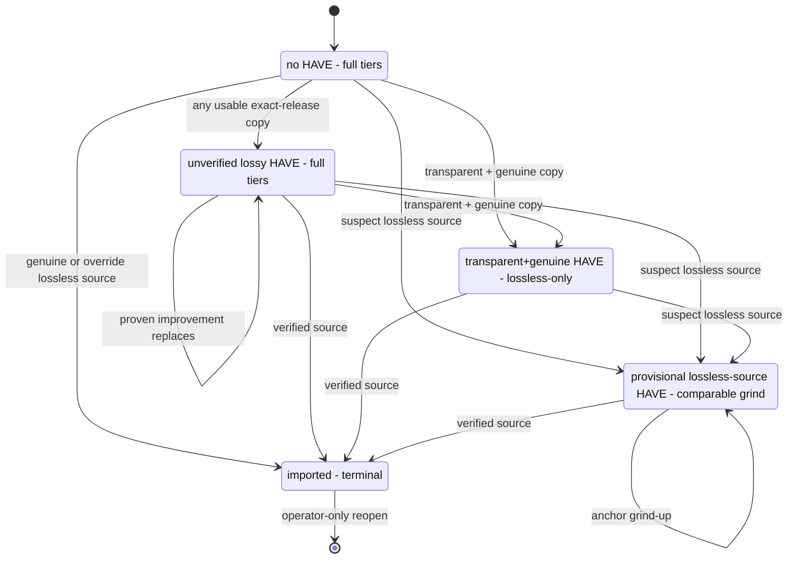

# Quality Model Untangle - Plan

## Goal Capsule

- **Objective:** Implement issue #711's settled quality model: verified-lossless proof as the sole terminal acquisition boundary, no acceptance floor, one narrowing rule, loud analysis-failure aborts, first-class Vorbis/WMA, and a uniform two-axis evidence vocabulary.
- **Product authority:** This plan, consolidating the issue #711 thread's settled decisions. The thread holds the full rationale, superseded alternatives, and live grounding.
- **Open blockers:** None. Field-level migration DDL and the change-family-2 pin enumeration are deferred to planning.

---

## Product Contract

### Summary

Restructure the quality model so acceptance, upgrade ceiling, installed-bytes authority, source lineage, materialized format, and search intent each have exactly one owner. Verified-lossless proof becomes the only automatic acquisition stop; every other state keeps searching. Evidence facts adopt a two-axis vocabulary — subject (`installed` | `source`) and provenance (`measured` | `carried`) — and Vorbis/WMA join the codec rank model with UNKNOWN as the orderable bottom.

### Problem Frame

Issue #708 exposed four semantic collisions: `gate_min_rank` conflated acceptance with upgrade ceiling, making EXCELLENT copies look terminal; Ogg was searchable but unranked; candidate spectral facts could stand in for installed-copy authority; and `verified_lossless` carried both source-lineage and on-disk-quality meaning depending on the path. PR #723 then showed the cost of blind-HAVE comparisons in both directions — a ~96k transcode replaced a ~160k copy, and a fake CBR-320 was protected by its container bitrate. Separately, absence of evidence could mint verification (a lossless file whose spectral scan never ran verified unconditionally), and the legacy request-scalar seeding inside evidence rebuilds mixed historical stamps into present-day decisions — the exact blur the evidence-ownership boundary bans.

### Key Decisions

Decisions 1–10 and 16 were settled in the issue #711 thread (2026-07-16 settlement pass); the thread records each superseded alternative. Decisions 11–15 were settled in this session.

1. **Verified-lossless proof is the sole, absolute terminal boundary.** No automatic candidate — lossy or lossless — crosses it in either direction; there is nothing left to acquire. Operator Replace/re-request is the only way back in and is never blocked by proof.
2. **No acceptance floor; `gate_min_rank` is retired outright.** First acquisition is gated by identity and structural usability, not quality. Quality ranks govern relative replacement and search scope only. This supersedes the issue body's "acceptance floor" framing.
3. **One narrowing rule, one era.** Transparent + independently genuine installed copy narrows search to lossless-only; the issue-#60-era grade-blind CBR branch dies. A suspect CBR 320 returns to full-tier searching — an intentional loosening.
4. **Verification requires affirmative evidence; analysis failure aborts loudly on both sides.** Evidence that policy requires but cannot be produced is an environment failure, not a quality datum. Error is failure, not disagreement; absence is failure, not trust.
5. **`have_analysis_error` is mechanically ordinary, semantically non-quality.** Normal attempt bookkeeping (backoff, global user-cooldown streak) applies; quality-reputation consequences (denylist, narrowing, verdict) never do.
6. **Acquisition facts carry unconditionally across evidence rebuilds; the scalar seam closes.** Proof and the source V0 anchor describe the acquisition event and cannot be re-derived from converted files. No audio-identity precondition guards the carry — out-of-band file replacement is outside the state model.
7. **Every retained lossy import denylists its winning source at import time.** The denylist is convergence machinery: the pipeline holds that copy, so re-offering it can never help.
8. **Provisional imports narrow to lossless-only at import time**, replacing the lazy narrowing that cost one guaranteed-wasted download; the decision-time `lossless_source_locked` path stays as defense-in-depth.
9. **Vorbis and WMA are first-class codec families; the generic relabel-as-MP3 fallback is deleted; UNKNOWN is the deliberate orderable bottom.** Container identity (ogg) stays separate from codec identity (vorbis/opus).
10. **The V0 trust override stays hardcoded at avg ≥ 230 / min ≥ 200** — a named exception to the thresholds-live-in-config doctrine, because these two numbers guard the terminal stop.
11. **Two-axis evidence vocabulary** (session-settled: user-directed — chosen over per-column bespoke enums: one mental model, two questions with the same two answers everywhere). Every quality fact answers *what bytes does this describe* (subject) and *how did it get on this row* (provenance).
12. **Spectral gets a persisted subject marker; no column split** (session-settled: user-directed — chosen over separate source/on-disk column pairs: no settled lane ever needs both subjects on one row).
13. **V0's three lineage values collapse into the subject axis** (session-settled: user-approved — the persisted native-research vs on-disk-research distinction drops entirely; policy only ever asks "is this a source anchor?").
14. **The proof object is the sole writable owner of verified-lossless** (session-settled: user-approved — the boolean leaves the byte-measurement struct so a measurement can never assert an acquisition claim; the row-level boolean stays as a derived, CHECK-tied convenience).
15. **Existing evidence rows convert via a `lineage_version` bump and the existing rebuild-on-next-touch machinery** (session-settled: user-directed — chosen over an SQL relabel: the machinery is already built and already handles failures; acquisition facts carry per decision 6).
16. **Request stamps stay as point-in-time history.** They keep being written and rendered; after the deploy one-shot they feed no rebuild and no decision. Divergence between stamps and evidence rows is not corruption.

### Requirements

**Terminal boundary and search policy**

- R1. Verified-lossless proof completes acquisition terminally; no automatic candidate, lossy or lossless, may replace a proof-bearing HAVE.
- R2. A supported lossless-container source verifies on spectral `genuine`/`marginal`, or via the V0 trust override (avg ≥ 230 and min ≥ 200) when spectral ran and disagreed.
- R3. First acquisition has no quality floor: any structurally usable exact-release copy imports regardless of codec, bitrate, or grade — where "usable" presupposes the measurement pipeline ran.
- R4. The post-import decision sets search policy only: proof → `imported` (terminal); transparent + independently genuine installed copy → `wanted` with lossless-only override; everything else → `wanted` on full tiers.
- R5. `gate_min_rank` is removed end to end — config key, `QualityRankConfig` field, and module option (checked against the nixosconfig wrapper); the startup sanity warning retargets to fire when `verified_lossless_target` classifies below canonical TRANSPARENT.
- R6. Every automatic lossy import that keeps the request `wanted` denylists its winning source at import time.
- R7. A provisional lossless-source import sets `search_filetype_override = lossless` at import time; `lossless_source_locked` remains as defense-in-depth.
- R8. The provisional lane compares the candidate's source V0 average against the current anchor average: no anchor → import provisionally; beats it by more than `within_rank_tolerance_kbps` → import provisionally; equal/worse/within tolerance → `suspect_lossless_downgrade`; missing candidate probe → `suspect_lossless_probe_missing`.

**Analysis failure**

- R9. When an installed HAVE exists, fresh on-disk analysis of it is a prerequisite for that attempt's replacement decision; candidate provenance and the provisional path are not exceptions.
- R10. When required evidence cannot be produced from the bytes — on either the HAVE or the candidate side — the attempt aborts before the decider with a distinct non-quality outcome, and the request returns to ordinary `wanted` searching.
- R11. The abort is attempt-local and stateless: no durable marker, retry counter, or blocking status; a later attempt re-analyses from scratch.
- R12. The abort still receives ordinary attempt bookkeeping: `next_retry_after` exponential backoff and the global user-cooldown streak.
- R13. Failed attempts surface prominently in Recents with the attempt's diagnostics: album/request, installed path, candidate reference, failure category, underlying error text, and the statement that the request remains wanted.
- R14. Verification is never minted from absent or failed evidence; every absence-verifies branch dies. Any deliberate non-run of spectral on a lossless candidate must be an explicit named policy routing to a non-verified import, never a silent `None`.
- R15. The new `download_log` outcome value ships with the CHECK-constraint migration and the matching `FakePipelineDB` parity update in the same PR.

**Evidence vocabulary**

| Fact | Subject: `installed` \| `source` | Provenance: `measured` \| `carried` |
|---|---|---|
| Spectral | new persisted marker | new persisted marker |
| V0 metric | replaces the three lineage values | repurposes the existing provenance field |
| Verified-lossless proof | always `source` — no marker | replaces the existing origin values |

- R16. Spectral and V0 each carry one persisted subject marker; one fact of each kind per evidence row.
- R17. The comparable-anchor test becomes subject = `source`; the `unknown_v0_source` fallback dies — an unrecognized probe kind aborts loudly and never persists; the redundant V0 proof-provenance field dies.
- R18. `verified_lossless` leaves `AudioQualityMeasurement`; the proof object is the sole writable owner; the row-level boolean remains derived and CHECK-tied to proof presence.
- R19. On any evidence rebuild, every on-disk fact is freshly re-measured; acquisition facts (proof, source V0 anchor, source-subject spectral) copy across unconditionally with provenance `carried`.
- R20. The legacy request-scalar readers die after the deploy one-shot: `legacy_verified_lossless_proof_from_request`, `legacy_current_v0_metric_from_request`, `legacy_current_lossless_v0_probe_from_request`, and the request-stamp spectral read inside `evidence_from_album_info`.
- R21. Request stamps keep being written as point-in-time history and remain readable by rendering/audit surfaces; no rebuild or decision path reads them.
- R22. `lineage_version` bumps; existing rows convert through the existing rebuild-on-next-touch machinery, including its failure handling — no mass re-measurement wave.
- R23. One operator/agent deploy one-shot materializes scalar-carried proof/anchor onto a linked evidence row for every non-replaced request; requests whose album can no longer be resolved on disk surface to the operator rather than keeping a silent scalar fallback alive.

**Codec model**

- R24. Codec detection labels downloaded bytes by actual codec: Opus-in-Ogg is `opus` (existing bands); true Vorbis is `vorbis` with new bands. `ogg` remains the container/search selector.
- R25. Vorbis bands (measured album-average, one table, no `is_cbr` branch): TRANSPARENT 192 / EXCELLENT 160 / GOOD 112 / ACCEPTABLE 96 / POOR below 96.
- R26. WMA is first-class with bands mirroring the MP3-CBR table: TRANSPARENT 320 / EXCELLENT 256 / GOOD 192 / ACCEPTABLE 128 / POOR below 128.
- R27. The generic relabel-as-MP3 fallback is deleted with no replacement, and its pins invert rather than delete: `test_vorbis_folder_falls_back_to_mp3` flips into the first-class Vorbis behavior, with the empty-folder sibling pin of the same fallback reviewed alongside. Decodable audio with no rank family ranks UNKNOWN = 0 — anything ranked upgrades over it, it upgrades over nothing, UNKNOWN vs UNKNOWN keeps searching, and it claims no ceiling and triggers no narrowing. Undecodable audio remains `audio_corrupt`.
- R28. Bitrate never substitutes for spectral authority: a candidate or HAVE graded `suspect`/`likely_transcode` gains no genuine status and no narrowing from any band value.

**Regression contract**

- R29. Exactly five named change families flip in the album/scenario corpus, each inverted into named negative pins rather than deleted; the codec-label pin flip (R27) is additional to these: (1) verified-lossless inversion; (2) terminal lossy accept abolished — canonical pin `test_mp3_v0_240`, with the full flipping set enumerated by name before behavior changes; (3) grade-blind CBR narrowing loosened to transparent+genuine; (4) absence-verifies inverted — `test_flac_no_spectral_is_verified`, `test_lossless_no_spectral_is_verified`, and the converted-path `None` branches; (5) lossless re-import over proof inverted — `test_genuine_flac_reimports_verified`.
- R30. Everything else in the album/scenario corpus is protected: no bulk updates, weakening, or deletion; the Fred again.. minimum-track boundary and the V0-override positive pins (Bill Hicks, Sundowner) stay unchanged.
- R31. Every new invariant ships as a deterministic pin plus generated property with known-bad fault injection; generated coverage supplements the corpus, never replaces it.
- R32. Vorbis/WMA coverage includes threshold edges at and immediately below each band value, cross-codec parity, Vorbis vs Opus-in-Ogg detection, and named scenarios from the live Ogg cohort.
- R33. The unmapped-codec UNKNOWN path is proven through the full decision path, with known-bad coverage for every consumer of the codec-family label — today the fallback guarantees "MP3", so that path has never run.

### Key Flows

Every non-terminal state searches forever; narrowing eligible tiers is not stopping search.

### Acceptance Examples

- AE1. **Covers R1.** Given a HAVE with verified-lossless proof, when any automatic candidate completes — including a genuine FLAC — then no replacement occurs and the request stays `imported`.
- AE2. **Covers R8, R2.** Fred again.. (request 5219, download 31854): suspect FLAC with V0 min 193 / avg 256 against anchor 248 imports as a provisional upgrade (256 beats 248 beyond tolerance) and stays unverified (193 misses the 200 floor). The minimum-track guard is intentional.
- AE3. **Covers R10, R13.** Given the installed path is unreadable when a candidate completes, then the attempt aborts as an analysis failure: Recents card with diagnostics, no denylist entry, no narrowing, request `wanted`.
- AE4. **Covers R3, R27.** Given a Musepack-only exact-release copy and no HAVE, the copy imports, ranks UNKNOWN, and the request stays `wanted` on full tiers.
- AE5. **Covers R14.** Given a lossless candidate whose spectral scan never ran, the attempt aborts rather than importing verified; with no installed copy the pipeline holds zero copies rather than unmeasured bytes.
- AE6. **Covers R4, R6.** A genuine CBR-320 MP3 import leaves the request `wanted` with lossless-only override and denylists its source; a suspect CBR-320 import leaves it `wanted` on full tiers — the intentional loosening.
- AE7. **Covers R19, R22.** Given a size-changing retag flips the snapshot fingerprint, the rebuild re-measures every on-disk fact and carries proof and anchor with provenance `carried`; the next suspect lossless candidate still hits the anchor comparison, not "no comparable probe".

### Scope Boundaries

- Denylist model: unchanged in identity, triggers, candidate filtering, and cooldown interaction. No folder/path scope, content fingerprints, consumed-offer tracking, second exclusion system, expiry, or filesystem-disappearance detection.
- The #184 verified-lossless sidecar consumer stays deferred; existing sidecar proofs correspond to already-imported rows.
- Lossless-share formats (APE, WavPack, Shorten, TTA) are a different axis — lossless-tier search/conversion support, not rank bands. Out.
- Out-of-band library mutation (evil-maid) stays outside the state model.
- The V0 override thresholds are deliberately not configurable (decision 10), and request stamps are deliberately not deleted (decision 16).

### Outstanding Questions

Deferred to planning — none block it:

- Field-level migration DDL: marker columns, CHECK constraints, relabeling of historical lineage/provenance values, the new `lineage_version` number.
- The change-family-2 flipping set, enumerated by name before behavior changes (R29).
- The named-policy-skip audit: enumerate every production source of spectral `None` on lossless candidates; expectation is failures and legacy rows only (R14).

### Sources / Research

- GitHub issue #711 thread — the settled-decision record with rationale and live grounding (2026-07-16: 7,068 imported / 1,404 wanted; wanted∧verified proof = 1 row by scalar, 0 by evidence; imported∧verified = 7,061/7,068; measured evidence codecs: mp3 126,632 / flac 101,952 / opus 56,308 / m4a 4,353 / ogg 213 / wav 125; zero WMA or Musepack ever measured).
- Issues #708 (the narrow shipped fix this cleans up after), #723 (blank `source_path` HAVE evidence — the blind-HAVE incidents), #60 (the legacy narrowing era).
- Code anchors: `lib/quality/evidence_types.py` (evidence structs, lineage constants), `lib/quality_evidence.py` (legacy scalar readers, rebuild reasons, carry/propagation), `lib/quality/decisions.py` (V0 override constants, `quality_gate_decision`, absence-verifies branches), `lib/quality/filetypes.py` (post-#708 narrowing), `harness/import_one.py` (codec-family fallback), `lib/dispatch/core.py` (post-import tier reset).
- `docs/quality-verification.md`, `docs/quality-ranks.md`, `docs/generated-testing.md`.
