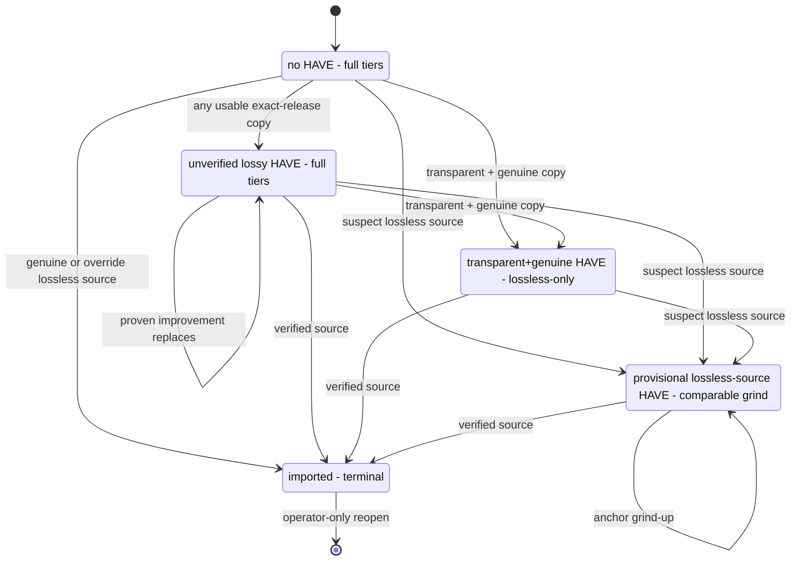
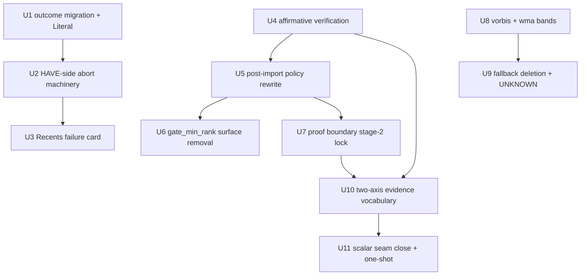

# Quality Model Untangle - Plan

## Goal Capsule

- **Objective:** Implement issue #711's settled quality model: verified-lossless proof as the sole terminal acquisition boundary, no acceptance floor, one narrowing rule, loud analysis-failure aborts, first-class Vorbis/WMA, and a uniform two-axis evidence vocabulary.
- **Product authority:** This plan. The issue #711 thread holds the full rationale, superseded alternatives, and live grounding. Product Contract unchanged from the requirements pass except Outstanding Questions, which planning resolved (the spectral-None audit expectation was refuted — see KTD1).
- **Execution profile:** Multi-PR series in unit dependency order (suggested grouping under Sequencing). Every flipped behavior lands RED-first via its inverted pin; every new invariant ships pin + generated property + known-bad self-test in the same PR. Focused tests while converging; whole-repo Pyright + full suite once per PR before its first push.
- **Stop conditions:** Evidence that any settled decision cannot work → stop and surface, do not adapt around it. A corpus test outside the enumerated flip-set failing for behavioral (not mechanical) reasons → stop and surface; the corpus is protected evidence.
- **Tail ownership:** Each PR merges via merge commit after review; deploy via the house deploy sequence; live verification includes the wanted∧verified reconciliation glance (expected: 1 row), the deploy one-shot (U11, uncommitted), and the nixosconfig wrapper edit in the U6 deploy window.

---

## Product Contract

### Summary

Restructure the quality model so acceptance, upgrade ceiling, installed-bytes authority, source lineage, materialized format, and search intent each have exactly one owner. Verified-lossless proof becomes the only automatic acquisition stop; every other state keeps searching. Evidence facts adopt a two-axis vocabulary — subject (`installed` | `source`) and provenance (`measured` | `carried`) — and Vorbis/WMA join the codec rank model with UNKNOWN as the orderable bottom.

### Problem Frame

Issue #708 exposed four semantic collisions: `gate_min_rank` conflated acceptance with upgrade ceiling, making EXCELLENT copies look terminal; Ogg was searchable but unranked; candidate spectral facts could stand in for installed-copy authority; and `verified_lossless` carried both source-lineage and on-disk-quality meaning depending on the path. PR #723 then showed the cost of blind-HAVE comparisons in both directions — a ~96k transcode replaced a ~160k copy, and a fake CBR-320 was protected by its container bitrate. Separately, absence of evidence could mint verification (a lossless file whose spectral scan never ran verified unconditionally), and the legacy request-scalar seeding inside evidence rebuilds mixed historical stamps into present-day decisions — the exact blur the evidence-ownership boundary bans.

### Key Decisions

Decisions 1–10 and 16 were settled in the issue #711 thread (2026-07-16 settlement pass); the thread records each superseded alternative. Decisions 11–15 were settled in this session.

1. **Verified-lossless proof is the sole, absolute terminal boundary.** No automatic candidate — lossy or lossless — crosses it in either direction; there is nothing left to acquire. Operator Replace/re-request is the only way back in and is never blocked by proof.
2. **No acceptance floor; `gate_min_rank` is retired outright.** First acquisition is gated by identity and structural usability, not quality. Quality ranks govern relative replacement and search scope only. This supersedes the issue body's "acceptance floor" framing.
3. **One narrowing rule, one era.** Transparent + independently genuine installed copy narrows search to lossless-only; the issue-#60-era grade-blind CBR branch dies. A suspect CBR 320 returns to full-tier searching — an intentional loosening.
4. **Verification requires affirmative evidence; analysis failure aborts loudly on both sides.** Evidence that policy requires but cannot be produced is an environment failure, not a quality datum. Error is failure, not disagreement; absence is failure, not trust.
5. **`have_analysis_error` is mechanically ordinary, semantically non-quality.** Normal attempt bookkeeping (backoff, global user-cooldown streak) applies; quality-reputation consequences (denylist, narrowing, verdict) never do.
6. **Acquisition facts carry unconditionally across evidence rebuilds; the scalar seam closes.** Proof and the source V0 anchor describe the acquisition event and cannot be re-derived from converted files. No audio-identity precondition guards the carry — out-of-band file replacement is outside the state model.
7. **Every retained lossy import denylists its winning source at import time.** The denylist is convergence machinery: the pipeline holds that copy, so re-offering it can never help.
8. **Provisional imports narrow to lossless-only at import time**, replacing the lazy narrowing that cost one guaranteed-wasted download; the decision-time `lossless_source_locked` path stays as defense-in-depth.
9. **Vorbis and WMA are first-class codec families; the generic relabel-as-MP3 fallback is deleted; UNKNOWN is the deliberate orderable bottom.** Container identity (ogg) stays separate from codec identity (vorbis/opus).
10. **The V0 trust override stays hardcoded at avg ≥ 230 / min ≥ 200** — a named exception to the thresholds-live-in-config doctrine, because these two numbers guard the terminal stop.
11. **Two-axis evidence vocabulary** (session-settled: user-directed — chosen over per-column bespoke enums: one mental model, two questions with the same two answers everywhere). Every quality fact answers *what bytes does this describe* (subject) and *how did it get on this row* (provenance).
12. **Spectral gets a persisted subject marker; no column split** (session-settled: user-directed — chosen over separate source/on-disk column pairs: no settled lane ever needs both subjects on one row).
13. **V0's three lineage values collapse into the subject axis** (session-settled: user-approved — the persisted native-research vs on-disk-research distinction drops entirely; policy only ever asks "is this a source anchor?").
14. **The proof object is the sole writable owner of verified-lossless** (session-settled: user-approved — the boolean leaves the byte-measurement struct so a measurement can never assert an acquisition claim; the row-level boolean stays as a derived, CHECK-tied convenience).
15. **Existing evidence rows convert via a `lineage_version` bump and the existing rebuild-on-next-touch machinery** (session-settled: user-directed — chosen over an SQL relabel: the machinery is already built and already handles failures; acquisition facts carry per decision 6).
16. **Request stamps stay as point-in-time history.** They keep being written and rendered; after the deploy one-shot they feed no rebuild and no decision. Divergence between stamps and evidence rows is not corruption.

### Requirements

**Terminal boundary and search policy**

- R1. Verified-lossless proof completes acquisition terminally; no automatic candidate, lossy or lossless, may replace a proof-bearing HAVE.
- R2. A supported lossless-container source verifies on spectral `genuine`/`marginal`, or via the V0 trust override (avg ≥ 230 and min ≥ 200) when spectral ran and disagreed.
- R3. First acquisition has no quality floor: any structurally usable exact-release copy imports regardless of codec, bitrate, or grade — where "usable" presupposes the measurement pipeline ran.
- R4. The post-import decision sets search policy only: proof → `imported` (terminal); transparent + independently genuine installed copy → `wanted` with lossless-only override; everything else → `wanted` on full tiers.
- R5. `gate_min_rank` is removed end to end — config key, `QualityRankConfig` field, and module option (checked against the nixosconfig wrapper); the startup sanity warning retargets to fire when `verified_lossless_target` classifies below canonical TRANSPARENT.
- R6. Every automatic lossy import that keeps the request `wanted` denylists its winning source at import time.
- R7. A provisional lossless-source import sets `search_filetype_override = lossless` at import time; `lossless_source_locked` remains as defense-in-depth.
- R8. The provisional lane compares the candidate's source V0 average against the current anchor average: no anchor → import provisionally; beats it by more than `within_rank_tolerance_kbps` → import provisionally; equal/worse/within tolerance → `suspect_lossless_downgrade`; missing candidate probe → `suspect_lossless_probe_missing`.

**Analysis failure**

- R9. When an installed HAVE exists, fresh on-disk analysis of it is a prerequisite for that attempt's replacement decision; candidate provenance and the provisional path are not exceptions.
- R10. When required evidence cannot be produced from the bytes — on either the HAVE or the candidate side — the attempt aborts before the decider with a distinct non-quality outcome, and the request returns to ordinary `wanted` searching.
- R11. The abort is attempt-local and stateless: no durable marker, retry counter, or blocking status; a later attempt re-analyses from scratch.
- R12. The abort still receives ordinary attempt bookkeeping: `next_retry_after` exponential backoff and the global user-cooldown streak.
- R13. Failed attempts surface prominently in Recents with the attempt's diagnostics: album/request, installed path, candidate reference, failure category, underlying error text, and the statement that the request remains wanted.
- R14. Verification is never minted from absent or failed evidence; every absence-verifies branch dies. Any deliberate non-run of spectral on a lossless candidate must be an explicit named policy routing to a non-verified import, never a silent `None`.
- R15. The new `download_log` outcome value ships with the CHECK-constraint migration and the matching `FakePipelineDB` parity update in the same PR.

**Evidence vocabulary**

| Fact | Subject: `installed` \| `source` | Provenance: `measured` \| `carried` |
|---|---|---|
| Spectral | new persisted marker | new persisted marker |
| V0 metric | replaces the three lineage values | repurposes the existing provenance field |
| Verified-lossless proof | always `source` — no marker | replaces the existing origin values |

- R16. Spectral and V0 each carry one persisted subject marker; one fact of each kind per evidence row.
- R17. The comparable-anchor test becomes subject = `source`; the `unknown_v0_source` fallback dies — an unrecognized probe kind aborts loudly and never persists; the redundant V0 proof-provenance field dies.
- R18. `verified_lossless` leaves `AudioQualityMeasurement`; the proof object is the sole writable owner; the row-level boolean remains derived and CHECK-tied to proof presence.
- R19. On any evidence rebuild, every on-disk fact is freshly re-measured; acquisition facts (proof, source V0 anchor, source-subject spectral) copy across unconditionally with provenance `carried`.
- R20. The legacy request-scalar readers die after the deploy one-shot: `legacy_verified_lossless_proof_from_request`, `legacy_current_v0_metric_from_request`, `legacy_current_lossless_v0_probe_from_request`, and the request-stamp spectral reads inside `evidence_from_album_info`, `lib/measurement.py` (the `current_spectral_grade` fallback), and `lib/import_preview.py` (`load_persisted_existing_spectral`'s legacy branch).
- R21. Request stamps keep being written as point-in-time history and remain readable by rendering/audit surfaces; no rebuild or decision path reads them.
- R22. `lineage_version` bumps; existing rows convert through the existing rebuild-on-next-touch machinery, including its failure handling — no mass re-measurement wave.
- R23. One operator/agent deploy one-shot materializes scalar-carried proof/anchor onto a linked evidence row for every non-replaced request; requests whose album can no longer be resolved on disk surface to the operator rather than keeping a silent scalar fallback alive.

**Codec model**

- R24. Codec detection labels downloaded bytes by actual codec: Opus-in-Ogg is `opus` (existing bands); true Vorbis is `vorbis` with new bands. `ogg` remains the container/search selector.
- R25. Vorbis bands (measured album-average, one table, no `is_cbr` branch): TRANSPARENT 192 / EXCELLENT 160 / GOOD 112 / ACCEPTABLE 96 / POOR below 96.
- R26. WMA is first-class with bands mirroring the MP3-CBR table: TRANSPARENT 320 / EXCELLENT 256 / GOOD 192 / ACCEPTABLE 128 / POOR below 128.
- R27. The generic relabel-as-MP3 fallback is deleted with no replacement, and its pins invert rather than delete: `test_vorbis_folder_falls_back_to_mp3` flips into the first-class Vorbis behavior, with the empty-folder sibling pin of the same fallback reviewed alongside. Decodable audio with no rank family ranks UNKNOWN = 0 — anything ranked upgrades over it, it upgrades over nothing, UNKNOWN vs UNKNOWN keeps searching, and it claims no ceiling and triggers no narrowing. Undecodable audio remains `audio_corrupt`.
- R28. Bitrate never substitutes for spectral authority: a candidate or HAVE graded `suspect`/`likely_transcode` gains no genuine status and no narrowing from any band value.

**Regression contract**

- R29. Exactly five named change families flip in the album/scenario corpus, each inverted into named negative pins rather than deleted; the codec-label pin flip (R27) is additional to these: (1) verified-lossless inversion; (2) terminal lossy accept abolished — canonical pin `test_mp3_v0_240`, with the full flipping set enumerated by name before behavior changes; (3) grade-blind CBR narrowing loosened to transparent+genuine; (4) absence-verifies inverted — `test_flac_no_spectral_is_verified`, `test_lossless_no_spectral_is_verified`, and the converted-path `None` branches; (5) lossless re-import over proof inverted — `test_genuine_flac_reimports_verified`.
- R30. Everything else in the album/scenario corpus is protected: no bulk updates, weakening, or deletion; the Fred again.. minimum-track boundary and the V0-override positive pins (Bill Hicks, Sundowner) stay unchanged.
- R31. Every new invariant ships as a deterministic pin plus generated property with known-bad fault injection; generated coverage supplements the corpus, never replaces it.
- R32. Vorbis/WMA coverage includes threshold edges at and immediately below each band value, cross-codec parity, Vorbis vs Opus-in-Ogg detection, and named scenarios from the live Ogg cohort.
- R33. The unmapped-codec UNKNOWN path is proven through the full decision path, with known-bad coverage for every consumer of the codec-family label — today the fallback guarantees "MP3", so that path has never run.

### Key Flows

Every non-terminal state searches forever; narrowing eligible tiers is not stopping search.

### Acceptance Examples

- AE1. **Covers R1.** Given a HAVE with verified-lossless proof, when any automatic candidate completes — including a genuine FLAC — then no replacement occurs and the request stays `imported`.
- AE2. **Covers R8, R2.** Fred again.. (request 5219, download 31854): suspect FLAC with V0 min 193 / avg 256 against anchor 248 imports as a provisional upgrade (256 beats 248 beyond tolerance) and stays unverified (193 misses the 200 floor). The minimum-track guard is intentional.
- AE3. **Covers R10, R13.** Given the installed path is unreadable when a candidate completes, then the attempt aborts as an analysis failure: Recents card with diagnostics, no denylist entry, no narrowing, request `wanted`.
- AE4. **Covers R3, R27.** Given a Musepack-only exact-release copy and no HAVE, the copy imports, ranks UNKNOWN, and the request stays `wanted` on full tiers.
- AE5. **Covers R14.** Given a lossless candidate whose spectral scan never ran, the attempt aborts rather than importing verified; with no installed copy the pipeline holds zero copies rather than unmeasured bytes.
- AE6. **Covers R4, R6.** A genuine CBR-320 MP3 import leaves the request `wanted` with lossless-only override and denylists its source; a suspect CBR-320 import leaves it `wanted` on full tiers — the intentional loosening.
- AE7. **Covers R19, R22.** Given a size-changing retag flips the snapshot fingerprint, the rebuild re-measures every on-disk fact and carries proof and anchor with provenance `carried`; the next suspect lossless candidate still hits the anchor comparison, not "no comparable probe".

### Scope Boundaries

- Denylist model: unchanged in identity, semantics, candidate filtering, and cooldown interaction; R6 adds one import-time call site to the existing trigger set — no new exclusion model, no folder/path scope, content fingerprints, consumed-offer tracking, second exclusion system, expiry, or filesystem-disappearance detection.
- The #184 verified-lossless sidecar consumer stays deferred; existing sidecar proofs correspond to already-imported rows.
- Lossless-share formats (APE, WavPack, Shorten, TTA) are a different axis — lossless-tier search/conversion support, not rank bands. Out.
- Out-of-band library mutation (evil-maid) stays outside the state model.
- The V0 override thresholds are deliberately not configurable (decision 10), and request stamps are deliberately not deleted (decision 16).

### Sources / Research

- GitHub issue #711 thread — the settled-decision record with rationale and live grounding (2026-07-16: 7,068 imported / 1,404 wanted; wanted∧verified proof = 1 row by scalar, 0 by evidence; imported∧verified = 7,061/7,068; measured evidence codecs: mp3 126,632 / flac 101,952 / opus 56,308 / m4a 4,353 / ogg 213 / wav 125; zero WMA or Musepack ever measured).
- Issues #708 (the narrow shipped fix this cleans up after), #723 (blank `source_path` HAVE evidence — the blind-HAVE incidents), #60 (the legacy narrowing era).
- Code anchors: `lib/quality/evidence_types.py` (evidence structs, lineage constants), `lib/quality_evidence.py` (legacy scalar readers, rebuild reasons, carry/propagation), `lib/quality/decisions.py` (V0 override constants, `quality_gate_decision`, absence-verifies branches), `lib/quality/filetypes.py` (post-#708 narrowing), `harness/import_one.py` (codec-family fallback), `lib/dispatch/core.py` (post-import tier reset).
- `docs/quality-verification.md`, `docs/quality-ranks.md`, `docs/generated-testing.md`.

---

## Planning Contract

### Key Technical Decisions

- KTD1. **Preview measurement runs spectral on lossless-container candidates.** Research refuted the audit expectation that spectral-None on lossless candidates is "failures and legacy rows only": `_needs_spectral_check` (`lib/measurement.py:371-405`) returns False for every non-MP3 candidate, so `flac`/`lossless`-target requests reach `determine_verified_lossless` with `spectral_grade=None` on the happy path and absence-verifies fires routinely. Affirmative verification (decision 4) requires the evidence row to carry a real grade, and the decision architecture requires preview to measure it (preview measures, importer decides). The harness's unconditional import-time source scan (`harness/import_one.py:1670`) retires with this: the harness reuses the preview-persisted candidate grade, so a lossless candidate is scanned exactly once, at preview — rejected candidates gain that one scan; imported ones are never scanned twice.
- KTD2. **One post-import policy owner; the four duplicated action mappings collapse.** The decision→(status, override, denylist) mapping is independently re-derived in `lib/dispatch/quality_gate.py`, `lib/dispatch/core.py:806-826`, the simulator's stage-3 self-model (`lib/quality/pipeline.py:636-650`), and the test mirror (`tests/test_simulator_scenarios.py:367-389`) — and the existing Hypothesis parity property never calls the first two, so they can drift false-green. The rewrite moves the mapping into one pure function in `lib/quality/` consumed by the production and simulator sites. The test mirror does not become a thin call into that same function — that would make the parity property self-confirming; it becomes an independent expectation table (decision → expected status/override/denylist) that every production integration is tested against, with known-bad coverage per output field.
- KTD3. **The HAVE-side abort lives at the dispatch evidence gate, not inside the decider.** `lib/dispatch/core.py:322-332` already blocks on `current_fail_closed` before `full_pipeline_decision_from_evidence` runs; by the time evidence reaches the decider the failed-vs-absent distinction is gone. Today that gate is a silent black hole (no `download_log` row, no request transition — force/manual imports strand). The abort consequences (outcome row, `to_wanted`, backoff, cooldown streak, Recents payload) are built there, modeled on `_record_preview_measurement_failed` (`lib/dispatch/outcome_actions.py:512-584`).
- KTD4. **Proof-blocked candidates get a named stage-2 decision** (`verified_lossless_locked`), parallel to `lossless_source_locked`: when the current evidence carries proof, every automatic candidate routes there before quality comparison. No existing decision label expresses "blocked by proof"; reusing `downgrade` would denylist and mislabel the audit trail. It does not denylist (the source did nothing wrong) and does not narrow (the request is terminal).
- KTD5. **Two-axis DDL: repurpose and rename, drop the dead columns, add spectral markers** (inherits decisions 11–13, session-settled). `v0_source_lineage` → `v0_subject` (`lossless_source` → `source`, research values → `installed`); `v0_source_provenance` → `v0_provenance` (`measured` | `carried`); `v0_proof_provenance` dropped; `verified_lossless_proof_origin` → `verified_lossless_provenance` (`import_result` → `measured`, `legacy_request_seed` → `carried`); new `spectral_subject`/`spectral_provenance`. Existing rows get a mechanical in-migration value map so dead columns drop immediately (single-operator, no dual-read hydration); `lineage_version` 4 remains the conversion authority — v1/v3 rows still rebuild on next touch per decision 15. Cross-product rule: `subject = installed` ⟹ `provenance = measured` (installed facts are always freshly measurable; `carried` is reserved for acquisition facts crossing a fingerprint change). Every new value-domain and cross-product CHECK is version-gated to `lineage_version = 4` exactly like the shape CHECKs (`lineage_version < 4 OR (fact IS NULL) = (marker IS NULL)`) — the in-migration value map is best-effort seeding, never a validity precondition, so an un-normalized legacy value self-heals on rebuild instead of aborting the deploy. The map also covers the two extra values live data carries: `unknown_v0_source` → `installed`/`measured`, and migration-024's `new_measurement_fallback` → `measured`. The three pre-existing 017 CHECKs referencing renamed/dropped columns (`album_quality_evidence_v0_metric_shape`, `album_quality_evidence_verified_proof_shape`, and the inline `v0_source_lineage` guard) are explicitly dropped and recreated in v4 form — no reliance on Postgres's silent auto-drop or rename carry-forward.
- KTD6. **`have_analysis_error` is a two-file, self-verifying addition**: migration extending `download_log_outcome_check` (042's DROP+ADD pattern) plus the `DownloadLogOutcome` Literal (`lib/pipeline_db/download_log.py:19-27`). `FakePipelineDB` imports the Literal and `tests/test_migrator.py::TestDownloadLogOutcomeTaxonomySync` asserts migration↔Literal equality, so R15's parity is enforced automatically.
- KTD7. **Carry logic keys on the provenance markers, replacing the codec heuristic.** `propagate_candidate_evidence_to_current`'s `strip_source_fields` gate (codec-name inference plus V0-lineage rescue, `lib/quality_evidence.py:939-969`) is replaced by subject-driven rules: source-subject facts (proof, anchor, source spectral) carry unconditionally with provenance `carried` (R19); installed-subject facts never propagate — they are re-measured. This also closes the propagate-not-remeasure seam the corpus audit found (`_refresh_current_evidence_after_import` forwarding candidate spectral onto the library row).
- KTD8. **Vorbis/WMA are `CodecRankBands` fields; both hardcoded MP3 fallbacks die together.** `QualityRankConfig.to_json`/`from_json` hardcode the four codec keys, and a second relabel site exists in the simulator twin (`lib/quality/pipeline.py:558`) beside the harness one (`harness/import_one.py:687`) — fixing only one breaks the parity contract. `mixed_format_precedence` and `_KNOWN_CODEC_FAMILIES` gain the new families; UNKNOWN=0 already exists in the rank enum, so the bottom-rank behavior is detection routing, not new rank plumbing.

### High-Level Technical Design

Evidence-field mapping (U10):

| Today (v3) | After (v4) | Values |
|---|---|---|
| `v0_source_lineage` | `v0_subject` | `lossless_source`→`source`; `native_lossy_research`/`on_disk_research`/`unknown_v0_source`→`installed` |
| `v0_source_provenance` | `v0_provenance` | probe-kind echoes and `new_measurement_fallback`→`measured`; carry writes `carried` |
| `v0_proof_provenance` | — dropped | lineage echo / legacy seed marker |
| `verified_lossless_proof_origin` | `verified_lossless_provenance` | `import_result`→`measured`; `legacy_request_seed`→`carried` |
| — | `spectral_subject` (new) | `installed` \| `source` |
| — | `spectral_provenance` (new) | `measured` \| `carried` |
| `AudioQualityMeasurement.verified_lossless` | — removed from struct | row bool stays, derived from proof presence |

Unit dependencies:

### Sequencing

Suggested PR series, each independently deployable: **PR1** U1+U2+U3 (analysis failure, migration first); **PR2** U4 (affirmative verification); **PR3** U5+U6 (policy rewrite + config retirement — nixosconfig wrapper edit rides this deploy window); **PR4** U7 (proof boundary); **PR5** U8+U9 (codec model); **PR6** U10+U11 (evidence vocabulary + seam close — intra-window order: hold the cratedigger timer or complete the one-shot before the new code's first cycle; the recorded wanted∧verified reconciliation gates resuming cycles). Migration-before-code holds within every PR: the migration must be live on doc2 before code reading new columns runs (deploys apply migrations before workers start; `cratedigger.service` gates on schema currency).

---

## Implementation Units

| U-ID | Title | Key files | Depends on |
|---|---|---|---|
| U1 | `have_analysis_error` outcome | `migrations/054_*.sql`, `lib/pipeline_db/download_log.py` | — |
| U2 | HAVE-side abort machinery | `lib/dispatch/core.py`, `lib/dispatch/outcome_actions.py` | U1 |
| U3 | Recents analysis-failure card | `web/classify.py`, `web/js/history.js` | U2 |
| U4 | Affirmative verification | `lib/quality/decisions.py`, `lib/measurement.py` | — |
| U5 | Post-import policy rewrite | `lib/quality/decisions.py`, `lib/dispatch/quality_gate.py`, `lib/dispatch/core.py` | U4 |
| U6 | `gate_min_rank` surface removal | `lib/quality/ranks.py`, `nix/module.nix`, `cratedigger.py` | U5 |
| U7 | Proof-boundary stage-2 lock | `lib/quality/dispatch_actions.py`, `lib/quality/pipeline.py` | U5 |
| U8 | Vorbis + WMA rank families | `lib/quality/ranks.py`, `nix/module.nix` | — |
| U9 | Fallback deletion + UNKNOWN bottom | `harness/import_one.py`, `lib/quality/pipeline.py`, `lib/quality/compare.py` | U8 |
| U10 | Two-axis evidence vocabulary | `migrations/055_*.sql`, `lib/quality/evidence_types.py`, `lib/quality_evidence.py`, `lib/pipeline_db/evidence.py` | U4, U7 |
| U11 | Scalar seam close + deploy one-shot | `lib/quality_evidence.py`, `lib/measurement.py`, `lib/import_preview.py` | U10 |

### U1. `have_analysis_error` download_log outcome

- **Goal:** The new non-quality outcome exists end to end at the DB boundary.
- **Requirements:** R15.
- **Dependencies:** none.
- **Files:** `migrations/054_download_log_have_analysis_error_outcome.sql`, `lib/pipeline_db/download_log.py`, `tests/test_migrator.py`.
- **Approach:** Mirror `migrations/042_download_log_user_offline_outcome.sql` (DROP CONSTRAINT IF EXISTS + ADD CHECK restating the full outcome list). Add the value to the `DownloadLogOutcome` Literal. `FakePipelineDB` imports the frozenset (KTD6) and `TestDownloadLogOutcomeTaxonomySync` enforces migration↔Literal equality, so no further parity edit exists.
- **Patterns to follow:** migrations 042 and 019; the taxonomy-sync test's regex expectations.
- **Test scenarios:** taxonomy-sync test passes with the new value; `FakePipelineDB` accepts a `have_analysis_error` log row and rejects a misspelled one (known-bad).
- **Verification:** `nix-shell --run "python3 -m unittest tests.test_migrator -v"` green.

### U2. HAVE-side analysis-failure abort machinery

- **Goal:** A failed HAVE analysis aborts the attempt loudly before the decider: distinct outcome row, request back to `wanted`, ordinary bookkeeping, no quality consequences — closing today's silent black hole where the evidence gate returns a bare failure that strands force/manual imports with no log row.
- **Requirements:** R9, R10, R11, R12; decision 5.
- **Dependencies:** U1.
- **Files:** `lib/dispatch/core.py`, `lib/dispatch/outcome_actions.py`, `lib/dispatch/evidence_gate.py`, `lib/import_evidence.py`, `tests/test_import_dispatch.py`, `tests/test_dispatch_outcomes_generated.py`.
- **Approach:** Build the consequence writer as a sibling of `_record_preview_measurement_failed` (`lib/dispatch/outcome_actions.py:512-584`): `download_log` row with outcome `have_analysis_error` carrying a failure category (permission denied / path missing / no audio files / snapshot changed / analyser failure) and raw error text, `RequestTransition.to_wanted()`, `next_retry_after` backoff stamp, global user-cooldown streak increment, no denylist, no narrowing. Wire it into the existing `current_fail_closed` gate at `lib/dispatch/core.py:322-332` (KTD3) for both auto and force/manual paths — force/manual currently falls through to `mark_import_job_failed` with no `download_log` row at all. The distinction failed-vs-absent already exists (`CURRENT_STATUS_FAILED` vs `CURRENT_STATUS_MISSING` in `lib/import_evidence.py`); absent-because-no-beets-album stays allowed (fresh request), only failed analysis aborts.
- **Execution note:** RED-first with an orchestration test reproducing the stranding: force-import with a fail-closed current gate must produce a log row and a `wanted` request, not a silent `import_jobs` failure.
- **Patterns to follow:** `_record_preview_measurement_failed`; `patch_dispatch_externals()` + `FakePipelineDB` orchestration tests; `MeasurementFailure` category taxonomy (`lib/quality/decisions.py:36-73`).
- **Test scenarios:** happy abort (unreadable HAVE path → outcome row, `wanted`, backoff stamped, cooldown streak counted, denylist empty); absent-HAVE fresh request proceeds (must-still-work guard); force/manual abort writes the same row; attempt-locality (a second attempt with a healthy HAVE proceeds normally — no durable marker read); generated lifecycle property in `tests/test_dispatch_outcomes_generated.py`: an aborted attempt never writes denylist entries, never changes `search_filetype_override`, always lands `wanted` — with a known-bad self-test.
- **Verification:** focused dispatch modules green; the invariant property kills a planted mutant that routes the abort through the downgrade path.

### U3. Recents analysis-failure card

- **Goal:** Aborted attempts render prominently in Recents with full diagnostics and the remains-wanted statement.
- **Requirements:** R13.
- **Dependencies:** U2.
- **Files:** `web/classify.py`, `web/download_history_view.py`, `web/routes/pipeline.py`, `web/js/history.js`, `web/js/recents.js`, `tests/web/test_routes_pipeline.py`, `tests/test_js_util.mjs`.
- **Approach:** Explicit `_classify` branch for `have_analysis_error` (the generic fallback renders only the raw outcome string — not acceptable for R13). Thread the diagnostics the card needs through `LogEntry` → `ClassifiedEntry` → `DownloadHistoryViewRow`: installed path, candidate reference, failure category, error text (`staged_path`/`download_path` exist in the SQL row but are dropped by `LogEntry.from_row` today). Card copy states the request remains wanted and a future download retries normally. Distinct badge/border so it reads as an environment failure, not a quality verdict.
- **Patterns to follow:** the `spectral_error` chip precedent (`web/js/history.js:479-490`); Recents evidence schema in `docs/webui-primer.md:167-210`; `_FakeDbWebServerCase` contract tests with `REQUIRED_FIELDS`.
- **Test scenarios:** contract test with a production-shaped `have_analysis_error` row asserting the card's required fields; classification unit test for the new branch (badge, verdict text, remains-wanted copy); regression: existing outcomes' classification unchanged.
- **Execution note:** visible UI change — run the live-db dev-server screenshot loop before pushing (`docs/solutions/ui-dev-server-screenshot-loop.md`).
- **Verification:** `tests/web` module green; screenshots show the card with diagnostics.

### U4. Affirmative verification — absence-verifies dies, candidate side aborts

- **Goal:** Verification requires affirmative spectral evidence; absent or errored analysis never verifies, and lossless candidates get a real preview-time grade.
- **Requirements:** R14, R2; decision 4; change family 4.
- **Dependencies:** none (lands before U5 so the gate rewrite reads sane verification semantics).
- **Files:** `lib/quality/decisions.py`, `lib/measurement.py`, `harness/import_one.py`, `lib/import_preview.py`, `tests/test_conversion_e2e.py`, `tests/test_quality_decisions.py`, `tests/test_quality_generated.py`.
- **Approach:** Four branches die (research-confirmed anchors): `determine_verified_lossless`'s `None`-verifies (`decisions.py:608` — `None` leaves the genuine/marginal tuple); the `error`-grade fall-through to the V0 rescue (`error` joins abort, not override — today it verifies with zero log trace because the `[V0_OVERRIDE]` audit line is gated on transcode grades); `transcode_detection`'s `post_conversion_min_bitrate is None → False` (`:514`) and the spectral-None bitrate-threshold fallback (`:526-532`, deleted with its pure-function pins — unreachable once absence aborts). KTD1: `_needs_spectral_check` (`lib/measurement.py:371-405`) extends to lossless containers so preview evidence carries a grade; an errored or missing scan on a lossless candidate routes to the existing `measurement_failed` abort, never to the decider. The harness's unconditional source re-scan retires: `import_one.py:1670` reuses the preview-persisted grade instead of re-scanning (KTD1). The V0 override's lane is unchanged: spectral ran and disagreed (`suspect`/`likely_transcode`).
- **Execution note:** invert the family-4 pins RED first, then implement.
- **Patterns to follow:** `_measurement_failed_result` (`lib/import_preview.py:1061-1112`) for the candidate-side abort routing; `TestDetermineVerifiedLossless` table style.
- **Test scenarios:** flips (enumerated): `test_flac_no_spectral_is_verified`, `test_lossless_no_spectral_is_verified` (`tests/test_conversion_e2e.py:253-255, 290-291`) → named negative pins; the 8 spectral-None rows in `TestTranscodeDetection.CASES` (`tests/test_quality_decisions.py:569-585`) + `test_transcode_detection_uses_cfg_mp3_vbr_excellent` + `_default_cfg_when_omitted` → deleted with the branch; error-grade rescue → new negative pin (errored scan aborts, never verifies). Protected (must stay green): genuine/marginal verifies, suspect/likely_transcode does not, all `test_v0_override_*` including Bill Hicks (`test_conversion_e2e.py:312-321`) and Sundowner (`:323-331`). New: preview-spectral-on-FLAC slice (lossless candidate gets a persisted grade; scan error → `measurement_failed`, request `wanted`); generated property — `determine_verified_lossless` returns True only when spectral affirms or the override fires on a disagreeing grade; absence/error inputs never return True — with known-bad self-test.
- **Verification:** focused quality modules green; mutant reverting the `None`-verifies fix is killed by the property.

### U5. Post-import search-policy rewrite — one owner, proof-driven

- **Goal:** `quality_gate_decision` becomes the proof-driven search-policy rule (R4) with one action mapping shared by every consumer; retained lossy imports denylist; provisional imports narrow at import time.
- **Requirements:** R3, R4, R6, R7, R8 (verify-only — the anchor comparison already matches spec); decisions 2, 3, 7, 8; change families 2, 3. R3's floor removal lands here — killing the `requeue_upgrade` floor branch is what removes the first-acquisition quality gate.
- **Dependencies:** U4.
- **Files:** `lib/quality/decisions.py`, `lib/quality/pipeline.py`, `lib/dispatch/quality_gate.py`, `lib/dispatch/core.py`, `tests/test_simulator_scenarios.py`, `tests/test_quality_decisions.py`, `tests/test_import_dispatch.py`, `tests/test_quality_lineage_generated.py`, `tests/test_quality_generated.py`.
- **Approach:** Rewrite `quality_gate_decision` (`decisions.py:634-666`): proof → terminal accept; transparent + independently genuine installed copy → wanted + lossless-only; else wanted + full tiers. Both legacy branches die: the `gate_min_rank` floor (`requeue_upgrade`) and the grade-blind CBR `requeue_lossless` (the narrowing condition reuses `rejection_backfill_override`'s genuine-gated shape, `lib/quality/filetypes.py:91-137`). KTD2: extract the decision→(status, override, denylist) mapping into one pure function consumed by `_check_quality_gate_core`, `dispatch_import_core`'s tail (`core.py:806-826` — gains the `provisional_lossless_upgrade` → `QUALITY_LOSSLESS` branch for R7), and the simulator's stage 3; the test mirror becomes the independent expectation table per KTD2, not a call into the shared function. R6: the wanted-keeping branches denylist the winning source (today `requeue_lossless` writes `denylists=()`).
- **Execution note:** flip the enumerated family-2/3 pins RED first; the corpus enumeration below is the carve-out — anything outside it breaking behaviorally is a stop condition.
- **Test scenarios:** family-2 flips (enumerated by research): `test_mp3_v0_240` (canonical), `test_avg_bitrate_flows_into_stage3_rank`, the accept-rows of `TestQualityGateDecision.CASES` ("MP3 V0 label" ×2, "Opus 128 not verified", "bare MP3 VBR above rank"), `test_stage3_grade_aware_spectral_gate` genuine/marginal rows, `test_quality_gate_reads_current_spectral_not_last_download`, `test_genuine_v0_replacing_transcode_accepted`, `test_quality_gate_ignores_genuine_low_spectral`, the "mp3 v0" subtest of `test_explicit_mp3_labels_ignore_contradictory_projected_modes`, and the `test_explicit_mp3_label_owns_mode_and_gate_policy` property (both branches invert). Family-3 flips: the three CBR `requeue_lossless` rows in `TestQualityGateDecision.CASES`, `test_cbr_320_no_spectral`/`test_cbr_256_no_spectral`, `test_requeue_lossless_uses_intent`, the "mp3 320" subtest. Verified-target pins (`Opus 64/48 verified`) re-pin to terminal accept (proof absolute; the retargeted warning is the guard). Collateral: the `gate_min_rank` denylist-reason-text tests in `tests/test_import_dispatch.py:1627-1737` rewrite with the new reason text. Protected: `rejection_backfill_override` suite, `test_stars_of_the_lid_loop`, suspect-CBR clamp scenarios, every verified completion. New pins: AE6 both halves (genuine CBR-320 → wanted + lossless-only + denylisted; suspect CBR-320 → wanted + full tiers); import-time narrowing for a provisional import (R7). New generated property (closing the coverage gap research found — the existing below-gate property only covers ≤128 kbps): **no unverified lossy candidate at any bitrate ever yields terminal acceptance**; plus an action-mapping parity property driving the real `quality_gate.py` mapping against the simulator's — both with known-bad self-tests.
- **Verification:** full simulator + quality module runs green with only enumerated flips; planted mutant restoring the grade-blind branch is killed.

### U6. `gate_min_rank` surface removal

- **Goal:** The config key, field, module option, CLI output, and docs references are gone; the startup warning retargets to canonical TRANSPARENT.
- **Requirements:** R5.
- **Dependencies:** U5 (the decision no longer reads it).
- **Files:** `lib/quality/ranks.py`, `lib/dispatch/quality_gate.py`, `scripts/pipeline_cli/quality.py`, `cratedigger.py`, `nix/module.nix`, `docs/quality-ranks.md`, `tests/test_config.py`, `tests/test_quality_decisions.py`, `tests/test_integration_slices.py`, `tests/helpers.py`.
- **Approach:** Remove the field (`ranks.py:144`), INI parse, `to_json`/`from_json` keys, constructor arg; the log-string read in `quality_gate.py:194-209`; CLI prints (`scripts/pipeline_cli/quality.py:124-125, 203-204, 487, 495`); option `services.cratedigger.qualityRanks.gateMinRank` (`nix/module.nix:1223-1227`) and its `config.ini` rendering (`:311`). Retarget the startup warning (`cratedigger.py:1266-1290`) to compare against `QualityRank.TRANSPARENT` and rewrite its message (the tunable no longer exists; a too-low verified target now completes acquisition terminally, so the warning gains weight). Update `docs/quality-ranks.md` (five sites, including the Nix option table). Deploy window: edit the nixosconfig wrapper in lockstep (check `hosts/doc2/configuration.nix` for a `gateMinRank` set; verify with a doc2 toplevel build before pushing Forgejo) — `moduleVm` cannot catch wrapper drift.
- **Patterns to follow:** `make_quality_rank_config` (`tests/helpers.py:494`) is the single test-side choke point; `TestQualityRankConfigDefaults` Nix-parity pin.
- **Test scenarios:** config INI/JSON round-trips without the key; unknown-key INI containing `gate_min_rank` is ignored (forward-only); startup warning fires for a below-TRANSPARENT verified target and stays silent at TRANSPARENT+ (both directions pinned); `test_custom_gate_min_rank_accepts_lower` (`tests/test_integration_slices.py:687-716`) is deleted with an equivalence note (the branch it exercised no longer exists; U5's property owns the replacement guarantee). Note: `tests/test_quality_lineage_generated.py` calls `quality_gate_decision` 11× without naming the key — expect assertion churn here, not silent passes.
- **Verification:** `nix build .#checks.x86_64-linux.moduleVm` before deploy; docs audit green (stale-option cleanup is manual — the audit only catches undocumented additions).

### U7. Proof-boundary stage-2 lock

- **Goal:** A proof-bearing HAVE blocks every automatic candidate in both directions with a named, non-punitive decision.
- **Requirements:** R1; decision 1; change families 1, 5.
- **Dependencies:** U5.
- **Files:** `lib/quality/dispatch_actions.py`, `lib/quality/decisions.py`, `lib/quality/pipeline.py`, `tests/test_simulator_scenarios.py`, `tests/test_quality_generated.py`.
- **Approach:** KTD4: new stage-2 decision `verified_lossless_locked`, checked before quality comparison when current evidence carries proof: no import, no denylist, no narrowing change, request stays `imported`. Operator paths (Replace, re-request, force-import) bypass it untouched — proof never blocks operator-initiated actions. Both twins gain the branch in lockstep (parity contract).
- **Execution note:** invert the family-1/5 pins RED first.
- **Test scenarios:** flips: `test_genuine_flac_reimports_verified` (`tests/test_simulator_scenarios.py:1343-1350`) and `test_mp3_higher_than_lofi_imports` (`:1359-1363`) → named negative pins asserting the lock. Protected: every verified-completion scenario; force-import slice must still import over proof (operator authority guard). New: generated property — for any current evidence with proof, no automatic candidate world produces a replacement (both lossy and lossless candidate strategies); known-bad self-test plants a proof-ignoring mutant.
- **Verification:** simulator scenarios green with only the two enumerated flips; parity property green.

### U8. Vorbis + WMA rank families

- **Goal:** True Vorbis and WMA classify through their own confirmed band tables end to end (config, wire, Nix, display, docs).
- **Requirements:** R24, R25, R26, R28, R32; decision 9.
- **Dependencies:** none.
- **Files:** `lib/quality/ranks.py`, `lib/quality/compare.py`, `lib/quality/filetypes.py`, `nix/module.nix`, `web/js/util.js`, `web/js/history.js`, `docs/quality-ranks.md`, `tests/test_quality_decisions.py`.
- **Approach:** Two `CodecRankBands` fields (`vorbis`: 192/160/112/96; `wma`: 320/256/192/128), single table each, no `is_cbr` branch. Thread through: INI `_get_bands`, constructor, **`to_json`/`from_json` (hardcode the new keys symmetrically — the wire silently drops unknown bands otherwise)**, `mixed_format_precedence`, `_KNOWN_CODEC_FAMILIES`, `quality_rank()` label dispatch, `_NATIVE_CODEC_LABELS` in `compare.py` (vorbis/wma entries), Nix `bandSection` + `mkCodecBands` options, web format-label tables. WMA already has full container identity in `filetypes.py`; Vorbis needs none beyond codec detection (ogg stays the search selector, R24).
- **Test scenarios:** threshold edges at and one below every band value for both families (subTest table); cross-codec parity rows; INI + JSON round-trips carrying the new bands (RED: a config with vorbis bands surviving `from_json(to_json())`); spectral-authority guard — 192+ Vorbis graded suspect gains no genuine status or narrowing (R28 pin); Nix-parity defaults pin extended.
- **Verification:** focused quality-decisions run; `moduleVm` for the module change.

### U9. Fallback deletion + UNKNOWN bottom

- **Goal:** The relabel-as-MP3 fallback is gone from both twins; unmapped decodable codecs rank UNKNOWN through the full decision path.
- **Requirements:** R27, R33; change: codec-label pins (additional to the five families).
- **Dependencies:** U8.
- **Files:** `harness/import_one.py`, `lib/quality/pipeline.py`, `lib/quality/compare.py`, `tests/test_native_codec_label.py`, `tests/test_simulator_scenarios.py`, `tests/test_quality_generated.py`.
- **Approach:** Delete `_detect_native_codec_family`'s `return "MP3"` (`import_one.py:687`, warning log stays) **and** the simulator twin's hardcoded `native_codec_family="MP3"` (`pipeline.py:558`) together (KTD8). Detection routes actual codecs: vorbis → vorbis bands; unmapped-but-decodable → UNKNOWN family label (`native_codec_format_label("vorbis")` returns the label instead of None). Empty-folder contract: unreachable in production (the `empty_fileset` early-exit rejects upstream) — the label function returns a no-audio sentinel, pinned as such. UNKNOWN semantics (already in the rank enum): anything ranked upgrades over it, it never upgrades over anything, UNKNOWN vs UNKNOWN fails open and keeps searching, no ceiling, no narrowing.
- **Test scenarios:** flips: `test_vorbis_folder_falls_back_to_mp3` → asserts `vorbis`; `test_empty_folder_falls_back_to_mp3` → asserts the no-audio sentinel; the vorbis assertion in `test_unmapped_codec_returns_none` → `vorbis` (the true-unknown assertions stay). New: Vorbis-vs-Opus-in-Ogg discrimination — both arrive in `.ogg` containers, detection must route each by actual codec (R32); at least one named scenario drawn from the live 213-row ogg cohort; R33's full-path pin — a Musepack-shaped world imports, ranks UNKNOWN, stays wanted on full tiers (AE4), driven through the real decision path; known-bad coverage for every consumer of the family label (each must tolerate an unmapped family — today unreachable because the fallback guaranteed "MP3"); generated property over random unmapped codec labels: never a ceiling, never narrowing, never terminal.
- **Verification:** simulator + codec-label modules green; both twins agree on a vorbis world (parity property).

### U10. Two-axis evidence vocabulary

- **Goal:** Every quality fact carries subject and provenance; the proof object solely owns verified-lossless; acquisition facts carry across rebuilds by marker, not codec heuristic.
- **Requirements:** R16, R17, R18, R19, R22; decisions 11–15 (KTD5, KTD7).
- **Dependencies:** U4, U7.
- **Files:** `migrations/055_evidence_two_axis_vocabulary.sql`, `lib/quality/evidence_types.py`, `lib/quality_evidence.py`, `lib/pipeline_db/evidence.py`, `lib/dispatch/helpers.py`, `lib/dispatch/quality_gate.py`, `lib/quality/ranks.py`, `lib/quality/decisions.py`, `lib/quality/pipeline.py`, `lib/import_preview.py`, `lib/sidecar.py`, `harness/import_one.py`, `tests/test_pipeline_db.py`, `tests/test_quality_evidence.py`, `tests/test_evidence_generated.py`, `tests/test_quality_lineage_generated.py`.
- **Approach:** Migration per KTD5's mapping table (renames, value maps, drops, new spectral markers, cross-product and version-gated shape CHECKs, `lineage_version` default → 4 with CHECK IN (1,3,4) per migration 050's pattern). Structs: `AlbumQualityV0Metric` fields become `subject`/`provenance` (validation: `unknown_v0_source` fallback dies — unrecognized probe kind raises, R17); `AudioQualityMeasurement` gains `spectral_subject`/`spectral_provenance`, loses `verified_lossless` (R18). The replacement source at every decision site is an explicitly threaded boolean derived from proof presence (the CHECK-tied row bool), never a measurement field. Every struct reader rewires: `gate_rank` (`lib/quality/ranks.py:635`, spectral-clamp skip), `import_quality_decision` (`lib/quality/decisions.py:198`), `lib/dispatch/quality_gate.py:229`, `lib/dispatch/helpers.py:120`, `lib/quality/pipeline.py:1182`, `lib/import_preview.py:1189`, and `should_write_sidecar` (`lib/sidecar.py:102/164` — the shipped #184 producer's read rewires; the deferred sidecar consumer stays out of scope). The harness wire emits proof at the `ImportResult` level; `storage_validation_errors` derives the row bool from proof presence. `upsert_album_quality_evidence`'s atomic-merge CASE logic and `_album_quality_evidence_from_row` hydration gain the marker columns. `current_evidence_rebuild_reasons` requires version 4. KTD7: carry keys on markers — source-subject facts carry with provenance `carried`; installed-subject facts re-measure; `strip_source_fields` and its codec/V0-lineage heuristics die. The comparable-anchor test becomes `subject == "source"` (one definition, both twins).
- **Execution note:** migration lands in the same PR but deploys before code reads the new columns (the deploy sequence guarantees this); structs and SQL move together or the round-trip tests fail.
- **Patterns to follow:** migration 050 (version bump), 021 (content-addressed rekey discipline), 052 (marker column); `tests/test_pipeline_db.py` real-PG round-trip shape (`test_upsert_round_trip_preserves_every_field`).
- **Test scenarios:** real-PG round-trip asserting **every** field of a v4 evidence row (subject/provenance markers, proof provenance) reads back — Rule A; msgspec RED test feeding a legacy lineage value into the new struct asserts `ValidationError`; cross-product CHECK known-bad (installed+carried rejected); AE7 slice — fingerprint flip rebuild re-measures on-disk facts, carries proof + anchor + source spectral with provenance `carried` (extends `test_evidence_generated.py`'s existing carry properties); v3-row rebuild-on-touch slice (old row triggers rebuild, acquisition facts survive, markers appear); the `6cf26a4`-descended converted-evidence property still green; twin parity property still green.
- **Verification:** real-PG suite + generated evidence modules green; a planted mutant that carries an installed-subject fact is killed by the cross-product property.

### U11. Scalar seam close + deploy one-shot

- **Goal:** No policy or rebuild path reads request-row quality stamps; the evidence chain is self-sustaining.
- **Requirements:** R20, R21, R23; decisions 6, 16.
- **Dependencies:** U10.
- **Files:** `lib/quality_evidence.py`, `lib/measurement.py`, `lib/import_preview.py`, `tests/test_quality_evidence.py`, `tests/test_import_preview.py`.
- **Approach:** Delete the three named legacy readers and the request-stamp spectral read inside `evidence_from_album_info` (all colocated, `lib/quality_evidence.py:397-462, 741-751, 773`), plus the two structurally identical reads research found: `lib/measurement.py:817` (`current_spectral_grade` fallback) and `lib/import_preview.py:280-288` (`load_persisted_existing_spectral`'s legacy branch). Stamp *writers* stay (decision 16); rendering/audit readers stay. Deploy one-shot (operator/agent-run, never committed) with explicit intra-window ordering — hold the cratedigger timer, or complete the one-shot, before the reader-deletion code's first cycle; the recorded reconciliation gates resuming: for every non-replaced request whose scalars carry proof or anchor, ensure a linked evidence row exists and materialize those facts with provenance `carried`; requests whose album no longer resolves on disk print to the operator (the #723 blank-path one-shot is the template). Post-one-shot, the wanted∧verified reconciliation is a one-row glance.
- **Test scenarios:** rebuild of a request with scalar stamps but no evidence row produces evidence *without* reading the stamps (RED against today's seeding); `evidence_from_album_info` output carries no stamp-derived spectral/V0/proof; rendering surfaces still read stamps (guard); vulture/dead-code sweep confirms no orphaned helpers remain (cascading-orphan check).
- **Verification:** focused evidence modules; after deploy — one-shot executed, unresolvable requests surfaced, reconciliation glance recorded in the PR/issue.

---

## Verification Contract

| Gate | Command | When |
|---|---|---|
| Focused iteration | `nix-shell --run "python3 -m unittest tests.<module> -v"` | while converging, per unit |
| Whole-repo types | `nix-shell --run "pyright --threads 4"` | once per PR, final committed tree, before first push |
| Full suite | `nix-shell --run "bash scripts/run_tests.sh"` | once per PR, same tree (includes JS gates, import checks, vulture, docs audit) |
| Quality-policy fuzz burst | `CRATEDIGGER_HYPOTHESIS_PROFILE=fuzz` on `tests/test_quality_generated.py`, `tests/test_quality_lineage_generated.py`, `tests/test_evidence_generated.py`, `tests/test_dispatch_outcomes_generated.py` | after U4, U5, U7, U9, U10 land (quality policy changed) |
| Module VM check | `nix build .#checks.x86_64-linux.moduleVm` | PRs touching `nix/module.nix` (U6, U8) |
| Mutant qualification | planted mutants per unit's known-bad list; kill matrix recorded in the PR | U2, U4, U5, U7, U9, U10 |
| Live verification | deploy sequence + journal check; Recents card visible (U3); reconciliation glance wanted∧verified = 1 row; one-shot output captured (U11) | per deploy window |

Every corpus flip must match a name enumerated in U4/U5/U7/U9's test scenarios; an unenumerated behavioral failure is a stop condition, not a test to update.

---

## Definition of Done

- All five change families plus the codec-label pins flipped by name into negative pins; every new invariant has pin + generated property + known-bad self-test; fuzz bursts run clean.
- The rest of the album/scenario corpus green and unmodified (R30); Bill Hicks, Sundowner, and the Fred again.. boundary (fresh AE2 pin) intact.
- Pyright 0 errors and full suite green on each PR's final tree; docs updated in the same PR that changes their surface (`test_docs_audit.py` plus manual stale-mention sweep for removed options).
- `gate_min_rank` gone from code, config, module, CLI, docs; nixosconfig wrapper edited in the same deploy window; moduleVm green.
- Evidence vocabulary live: new rows write v4 markers; rebuild-on-touch converts on contact; scalar readers deleted; deploy one-shot executed with unresolvables surfaced; wanted∧verified reconciliation recorded.
- All PRs merged via merge commit, deployed to doc2, live-verified; no abandoned experimental code in any diff; vulture whitelist regenerated where deletions cascade.
