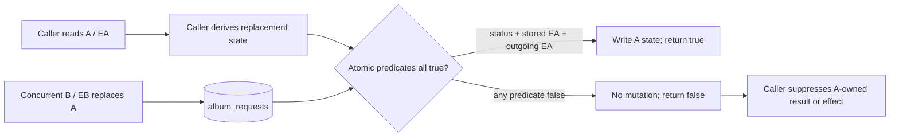
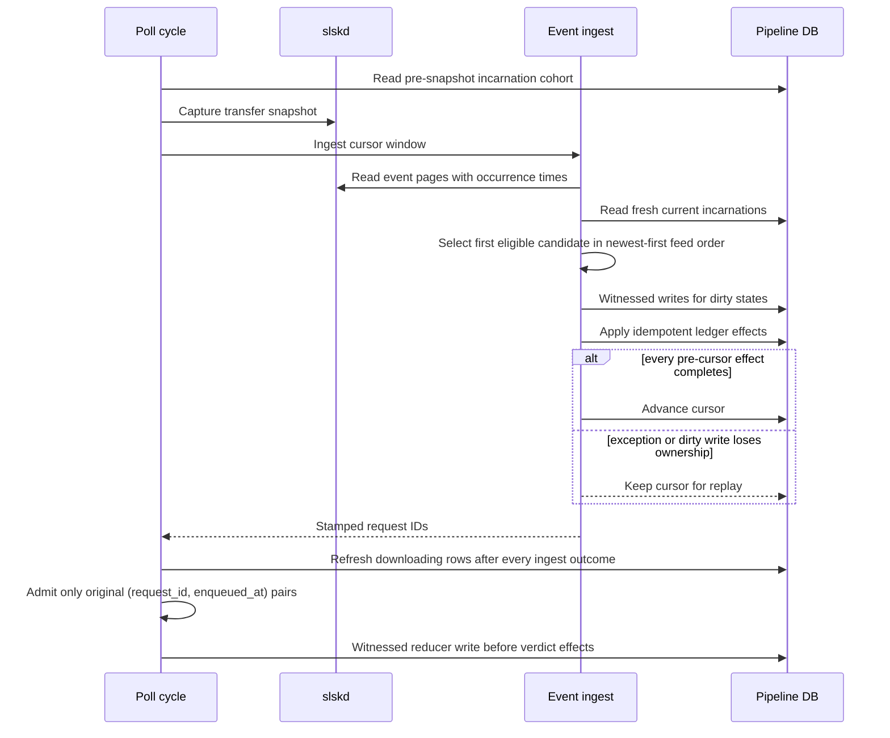
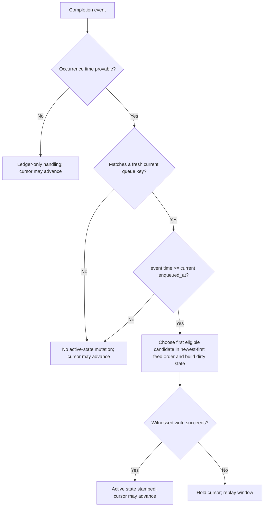

# Download Incarnation RMW Fence - Plan

## Goal Capsule

Deliver PR1 of issue
[#898](https://github.com/abl030/cratedigger/issues/898): prevent a delayed
whole-state read-modify-write from download attempt A from overwriting a newer
still-`downloading` attempt B for the same request.

`ActiveDownloadState.enqueued_at` is the attempt-incarnation witness. The PR
fences only four whole-state seams: initial enqueue ownership enrichment, slskd
event stamping, pre-purge terminal-evidence harvest, and poller persistence. It
also preserves retryable event-cursor semantics and prevents a post-event B row
from being polled against A's older transfer snapshot.

The work stops if a correct implementation requires fencing post-handoff
processing, filesystem actions, importer jobs, terminal transitions, or
abandonment. Those are PR2, not reasons to widen PR1.

Execution is test-first. The implementation tail owns focused proof, generated
fault qualification, independent review, the exact final repository gates, a
merge-commit PR, and the repository's ordinary deployment verification. Issue
#898 remains open for PR2.

---

## Product Contract

### Summary

A `downloading` status is not sufficient ownership for a whole-state rewrite.
The request may have moved from A to B without leaving that status, and both
attempts may use the same deterministic path. Each PR1 writer must prove that
the stored state still carries its expected `enqueued_at` witness and that its
replacement state retains the same witness.

### Requirements

#### Incarnation authority

- R1. Treat the persisted `ActiveDownloadState.enqueued_at` text as the
  immutable identity witness for one download attempt; paths and transfer keys
  are evidence within an attempt, not attempt identity.
- R2. A PR1 whole-state rewrite succeeds only when the request is still
  `downloading`, the stored state witness equals the writer's expected witness,
  and the outgoing state retains that witness.
- R3. A missing stored witness, changed stored witness, changed outgoing
  witness, malformed outgoing state, or non-`downloading` status rejects or
  errors without changing the state or row metadata.

#### Four fenced flows

- R4. Initial enqueue ownership may persist any whole-state accepted,
  ambiguous, rejected, or partial-recovery observation only for the incarnation
  claimed before the enqueue call; a rejected write never reports A as
  successful or poll-recoverable work.
- R5. Event ingestion matches all decoded same-key completion candidates
  against freshly read current incarnations with valid witnesses and selects
  the first candidate in newest-first feed order whose provable occurrence
  time is at or after that incarnation's `enqueued_at`. A valid witness is
  non-empty ISO-8601 text accepted and normalized by the same timestamp parser
  used for event occurrence times; the original stored text remains the exact
  CAS token.
- R6. For a fully collected event window that reaches the prior cursor, the
  cursor advances only after every pre-cursor effect completes and no dirty
  current-incarnation rewrite loses its witness; otherwise the same window is
  reclassified against fresh state on the next pass.
- R7. Transfer-ledger stamping remains independent and idempotent while an
  event window is replayed; active-state time qualification grants no new
  ledger authority, and an event with an unprovable occurrence time cannot
  mutate active state or poison the cursor indefinitely. A bounded scan that
  returns `cursor_gap=True` retains the existing fail-open cursor behavior and
  materialization self-heal for older omitted events; it is not claimed as a
  replayable complete window under R6.
- R8. Pre-purge harvest and poll reduction persist their whole-state results
  only for the incarnation they read; a rejected write has no stale
  count/verdict effect and does not prevent unrelated rows from proceeding.
- R9. After every event-ingest outcome, a row admitted to polling must have a
  valid witness under R5 and be the same exact
  `(request_id, enqueued_at)` incarnation that existed before the cycle's
  transfer snapshot. A row with an invalid witness is logged and excluded
  without reset or verdict dispatch.

#### Proof and compatibility

- R10. Deterministic pins cover same-path A/EA to B/EB replacement at every
  named caller seam, including event cursor retry and poll snapshot admission.
- R11. Generated properties vary witnesses, queue-key reuse, event timing, and
  interleavings across only the four PR1 whole-state operations.
- R12. Known-bad self-tests and an implementation-time fault-injection matrix
  independently prove atomicity, the three write predicates, fresh event-state
  classification, same-key candidate selection, event-time bound, cursor-hold
  rule, and exact-incarnation poll admission all constrain behavior.
- R13. Real PostgreSQL is authoritative for the atomic write contract, and
  `FakePipelineDB` must produce the same result, semantically equal final
  state, and unchanged rejection metadata for the same transcript.
- R14. The fix adds no migration, request status, lock, compatibility shim,
  committed backfill, or new `ActiveDownloadState` field.

### Key Product Decisions

- KD1. PR1 is the four named state-RMW seams, not partial processor ownership.
  It governs R4-R9.
- KD2. The stopped `fix/898-pr1-incarnation-fence` branch is evidence only.
  Current `main` is the implementation base. It governs R10-R14.

### Flows

- F1. Initial enqueue: claim A/EA, submit to slskd, route accepted, ambiguous,
  and partial outcomes through witnessed whole-state writes, and suppress every
  A-owned success or poll-recovery result when a write rejects. Covers R2-R4.
- F2. Event window: collect events, read current incarnations, classify by
  current queue keys and occurrence time, write dirty states with their
  witnesses, apply replay-safe ledger effects, and advance the cursor only
  when every pre-cursor effect completes without a lost dirty write. Covers
  R5-R7.
- F3. Poll cycle: capture the decodable pre-snapshot incarnation cohort,
  capture the transfer snapshot, ingest events, refresh after every ingest
  outcome, admit only the same incarnations, and witness each reducer write
  before verdict effects. Covers R8-R9.
- F4. Pre-purge harvest: read downloading rows, match terminal transfers with
  the row's `enqueued_at` lower bound, attempt the witnessed write, and continue
  per row regardless of one rejection. Covers R8.

### Acceptance Examples

- AE1. A/EA is read, B/EB replaces it at the same deterministic path, and A
  attempts any named whole-state write. The write returns false, B's state is
  semantically unchanged, and B's row metadata is unchanged. Covers R1-R4 and
  R8.
- AE2. An event for B's queue key occurs at or after EB while ingestion began
  from an A-era view. Fresh classification stamps B. B is not polled against
  A's earlier transfer snapshot and becomes eligible on the next cycle. Covers
  R5 and R9.
- AE3. An event predating EB reuses B's queue key. It does not stamp B, and the
  cursor can advance because no valid current-incarnation mutation was lost.
  Covers R5-R7.
- AE4. A valid B event produces a state update, but B is replaced again before
  the write. The write rejects, the cursor stays put, and replay later
  converges without duplicating accepted-ledger evidence. Covers R6-R7.
- AE5. Harvest loses A's witness race while a second request remains current.
  A's stale evidence is rejected and the second request is still harvested
  before terminal transfers are purged. Covers R8.
- AE6. One event window has multiple decoded completions for B's queue key.
  An ineligible newer feed entry does not hide an older entry whose occurrence
  time and path are eligible for B. Covers R5-R7.

### Success Criteria

- Every PR1 whole-state caller supplies the witness from the state it read and
  consumes a rejected write without an A-owned result, count, or verdict.
- When B replaces A before A's witnessed write, no named seam can change B's
  persisted state or continue an A-owned result.
- Event windows neither lose a valid current-incarnation completion nor stamp
  a pre-incarnation completion onto a replacement attempt.
- The real/fake contract and all independent known-bad variants are qualified.

### Scope Boundaries

#### In scope

- The downloading-only whole-state persistence contract and fake parity.
- Initial enqueue whole-state persistence for accepted, ambiguous, rejected,
  and partial outcomes, but not the actual `downloading -> wanted` reset.
- Fresh-incarnation slskd event classification, occurrence-time filtering,
  cursor retry, and ledger replay.
- Pre-purge terminal-evidence harvest.
- Poller whole-state persistence and exact-incarnation admission after event
  refresh.
- Focused deterministic, generated, known-bad, and real-PostgreSQL proof.

#### Deferred to Follow-Up Work

- PR2 ownership across materialization, validation, filesystem actions,
  processing dispatch, importer jobs, and terminal outcomes.
- Interrupted-import abandonment and recovery fencing.
- Partial-state writers such as `current_path` and import-subprocess markers.
- Transfer-ledger temporal-attribution or identity redesign beyond preserving
  existing replay idempotence.

#### Out of scope

- The verified-no-acceptance reset transition, a broad reset/recovery redesign,
  new audit bundle, timeout/cooldown changes, new lifecycle status, or legacy
  compatibility job.
- Path-based attempt identity.
- Deleting or strengthening generic and partial state writers whose callers
  belong to PR2.
- Cherry-picking the stopped branch or carrying its unrelated audit, Vulture,
  documentation, or workspace changes.

### Sources

- [Issue #898](https://github.com/abl030/cratedigger/issues/898) and its
  [2026-07-28 stopped-branch boundary comment](https://github.com/abl030/cratedigger/issues/898#issuecomment-5099285548).
- `lib/pipeline_db/requests.py` — current status-only whole-state writers.
- `lib/enqueue.py` and `lib/download_ownership.py` — claim witness and enqueue
  outcome persistence.
- `lib/slskd_events.py` — event projection, active-state stamping, and cursor
  advancement.
- `lib/download.py` — pre-purge harvest and poll-cycle orchestration.
- `tests/fakes/pipeline_db.py` — required fake parity surface.
- `docs/generated-testing.md` and `.claude/rules/code-quality.md` — paired
  deterministic/generated proof and known-bad qualification.

---

## Planning Contract

### Key Technical Decisions

- KTD1. Strengthen `update_download_state_if_downloading` in place by requiring
  the expected witness; its production callers are exactly the four PR1 seams.
  `(session-settled: user-directed — chosen over globally propagating processor ownership: PR1 stays at the four named RMW seams.)`
  Keep the separate generic whole-state writer and partial-state writers
  unchanged for PR2. This makes witness omission unrepresentable at the PR1
  surface without forcing a processing refactor. Governs R2-R4 and R8.
- KTD2. Implement the database contract as one atomic conditional update with
  three independent predicates: status, stored witness, and outgoing witness.
  Missing JSON state or witness naturally rejects. Exact text equality
  preserves the token callers already round-trip and avoids inventing timestamp
  normalization. Governs R1-R3 and R13.
- KTD3. Classify all decoded event candidates against a fresh
  current-incarnation read, not the prefetched poll rows. The cursor is the
  application-level commit marker: any pre-cursor exception or lost dirty
  write holds it, and replay reclassifies once rather than chasing another
  incarnation in the same pass. This hold/replay guarantee applies only when
  the bounded scan reaches the prior cursor; preserve the established
  `cursor_gap=True` fail-open behavior and downstream materialization
  self-heal for older omitted events. Governs R5-R7.
- KTD4. Preserve the poll cycle's snapshot boundary with an exact
  `(request_id, enqueued_at)` admission set refreshed after success, no-op, or
  failed event ingestion. Missing or invalid witnesses are logged and excluded,
  and a failed refresh skips the poll pass. Witness validity is decided with
  the event timestamp parser, while database CAS equality remains exact text
  equality. Governs R9.
- KTD5. Use the stopped branch only to retain counterexamples and mutant ideas.
  `(session-settled: user-directed — chosen over simplifying or cherry-picking the stopped branch: that branch crossed into PR2 ownership and unrelated changes.)`
  Rebuild from current `main` with the smallest file footprint that satisfies
  R1-R14.
- KTD6. PR1 linearizes each named whole-state mutation at its witnessed write.
  If B lands first, A is rejected before its result, count, or verdict. If B
  replaces A after A's successful write but before a downstream effect,
  downstream fencing belongs to PR2. Governs R8 and the follow-up scope.
- KTD7. Do not cancel or delete an accepted A transfer solely because its state
  write lost to B. In partial-failure handling, first persist the witnessed A
  recovery observation. Only a successful write may continue into the existing
  A-derived cancellation/reset sequence; a rejected write skips cancellation,
  suppresses the A-owned result, and leaves cleanup to accepted-ledger-backed
  orphan convergence. A B replacement after a successful A write is KTD6's
  PR2 boundary. Governs R4.

### High-Level Technical Design

These sketches define relationships and sequencing, not exact APIs.

#### Whole-state write boundary



#### Event-window and poll-snapshot sequence



#### Event classification decisions



### System-Wide Impact

- Persistence: the existing PR1 whole-state mutation surface gains a required
  witness in `PipelineDB` and its fake; no schema or stored-shape change.
- Enqueue workers: the already-captured claim witness crosses the fresh-DB
  ownership writer for every whole-state result/recovery persistence path.
- Event ingestion: decoded completion evidence gains occurrence time in its
  in-memory projection; cursor advancement becomes conditional on durable
  current-incarnation writes.
- Polling: post-event refresh preserves the same incarnation cohort as the
  earlier slskd snapshot.
- Transfer cleanup: harvest stays before purge and keeps per-row isolation.
- Operations: no configuration, migration, unit, API, CLI, or web change.

### Risks and Mitigations

- State writes, ledger stamps, and the cursor are not one database transaction.
  Treat every pre-cursor effect as replay-safe and the cursor as the final
  application-level commit marker.
- A cursor held for one racing row replays the whole event window. Pin prior
  successful state stamps as no-ops and ledger replays as zero new stamps.
- `MAX_EVENT_PAGES` can produce a cursor gap that omits older events. Preserve
  the current fail-open cursor advance and materialization self-heal for that
  bounded-scan condition, log it distinctly from a held dirty write, and do not
  present it as R6 no-loss replay.
- Fresh event classification can see B while the transfer snapshot belongs to
  A. KTD4 prevents B from entering the current poll pass.
- The event-time lower bound is sound only if slskd's completion timestamp is
  a server-authored occurrence time comparable to doc2-generated
  `enqueued_at`. Verify that provenance and timezone normalization against the
  live/configured slskd response before relying on it; if comparability cannot
  be established, stop and surface the blocker rather than silently treating
  receipt time or feed order as causal proof.
- Missing or invalid persisted witnesses fail closed and can leave a request
  `downloading`. Audit the live downloading cohort before deployment, abort on
  any invalid witness, and monitor the new exclusion log signal. Do not add a
  compatibility parser, backfill, or automatic reset in PR1.
- A monolithic generated model could accidentally include PR2 semantics. Keep
  its operation alphabet to the four named whole-state payload shapes and test
  event cursor behavior separately.
- A fake that checks only the incoming witness can mask the production race.
  Drive one transcript table against both adapters and compare the final state,
  not only return values.
- Ledger stamping retains its existing newest-open accepted-row attribution;
  PR1's active-state time qualification does not redesign ledger identity.

### Sequencing

U1 is the shared persistence boundary. U2 and U3 depend on U1. U4's harvest and
direct poll write use U1, while its post-event admission proof also depends on
U3. U5 depends on all four so its generated oracle and documentation describe
the integrated contract.

---

## Implementation Units

### U1. Establish the incarnation-aware persistence contract

**Goal:** Make stale whole-state writes atomically rejectable in real
PostgreSQL and the fake.

**Requirements:** R1-R3, R13-R14; KTD1-KTD2.

**Dependencies:** None.

**Files:** `lib/pipeline_db/requests.py`, `tests/fakes/pipeline_db.py`,
`tests/test_pipeline_db.py`, `tests/test_fakes.py`,
`tests/test_pipeline_db_write_audit.py`, `lib/download.py`,
`lib/download_ownership.py`, `lib/slskd_events.py`, and
protocol/signature parity tests in
`tests/test_download.py`.

**Approach:**

- Write the real-PostgreSQL failure table first, then strengthen the existing
  downloading-only whole-state operation with all predicates applied in one
  atomic statement.
- Mirror missing state, stored-witness mismatch, outgoing-witness mismatch,
  malformed outgoing state, and status mismatch exactly in `FakePipelineDB`.
- Register the new write in the DB write-audit registry with its real-PostgreSQL
  proof; do not rely on a generic method-name heuristic.
- Leave the generic whole-state and partial-state writers used by PR2-owned
  paths unchanged.

**Test scenarios:**

- Happy path: stored A/EA, expected EA, and outgoing EA update successfully and
  preserve EA.
- Edge: A is read through one PostgreSQL handle, another handle installs B/EB
  at the same path, and A's write returns false with B's state and `updated_at`
  unchanged.
- Error predicates: independently vary status, stored witness, outgoing
  witness, missing state, missing stored witness, and malformed outgoing JSON;
  each rejected or error case leaves all persistent observations unchanged.
- Integration: run the same case table against real PostgreSQL and
  `FakePipelineDB`; both produce the same result, state, and rejection metadata.
- Atomicity: a known-bad split read/check/update implementation loses to a
  two-handle A-to-B interleaving that the one-statement implementation rejects.

**Verification:** The real and fake tables pass, protocol/signature parity
passes, and the DB write audit points to the authoritative real-PostgreSQL
proof.

### U2. Fence initial enqueue whole-state persistence

**Goal:** Prevent a delayed A outcome from overwriting B or escaping as an
A-owned success/poll-recovery result.

**Requirements:** R4, R10; F1; AE1; KTD1, KTD5, and KTD7.

**Dependencies:** U1.

**Files:** `lib/download_ownership.py`, `lib/enqueue.py`,
`tests/test_enqueue_fanout.py`, and ownership protocol/signature parity tests
in `tests/test_download.py`.

**Approach:**

- Thread `DownloadOwnershipClaim.enqueued_at` through the fresh-DB ownership
  writer used by `_persist_claimed_download_state`,
  `_reset_claim_after_verified_no_acceptance` fallback persistence,
  `_leave_claim_for_poll_recovery`, and `_handle_claimed_partial_failure`
  fallback persistence.
- Propagate a rejected write through each outward result so no stale path
  returns A as matched or poll recovery.
- In `_handle_claimed_partial_failure`, persist the witnessed A recovery
  observation before any A-derived `cancel_and_delete` call. Continue into the
  existing cancellation/reset sequence only when that write succeeds.
- If the partial-failure write rejects, skip cancellation, suppress the A-owned
  result, and let existing accepted-ledger orphan convergence own cleanup.
- Leave the actual verified-no-acceptance status reset and broad recovery
  policy unchanged.

**Test scenarios:**

- Happy path: accepted enrichment for current A retains EA and returns the
  accepted downloads.
- Race: install same-path B/EB after A's slskd acceptance but before enrichment;
  B stays exact, A is not returned as matched or poll recovery, and no
  A-snapshot cancellation touches B-backed keys.
- Edge: single-disc accepted, ambiguous, and rejected fallbacks plus multi-disc
  accepted and partial-failure fallbacks all consume the rejected write.
- Partial ordering: a rejected partial-failure write makes zero
  `cancel_and_delete` calls, while a successful current-incarnation write
  preserves the existing cancellation/reset behavior.
- Cleanup: an unbacked A key is later removed by ordinary convergence while a
  same-key B-backed transfer survives.
- Boundary: the actual no-acceptance reset transition gains no new incarnation
  contract in PR1.

**Verification:** Every initial-claim whole-state persistence path proves the
witness reaches U1 and a stale A outcome cannot escape as owned work.

### U3. Make event stamping incarnation- and cursor-safe

**Goal:** Stamp completion paths only onto the current eligible incarnation
without losing a replayable event window.

**Requirements:** R5-R7, R10-R12; F2; AE2-AE4 and AE6; KTD3.

**Dependencies:** U1.

**Files:** `lib/slskd_events.py`, `tests/test_slskd_events.py`,
`tests/test_slskd_events_generated.py`.

**Approach:**

- Carry each completion's parsed occurrence time alongside its local path.
- Parse current `enqueued_at` values through the same ISO-8601 normalization
  path used for event occurrence times. Exclude and log active rows with empty
  or invalid witnesses while allowing their replay-safe ledger handling to
  continue.
- Keep all decoded completion candidates per queue key for active-state
  classification. Read current downloading incarnations after collecting the
  window, select the first eligible candidate in newest-first feed order for
  each current key, and enforce the occurrence-time lower bound. Preserve the
  ledger's separate newest-decoded-event projection.
- Persist each dirty state through U1 with the witness read during fresh
  classification.
- Treat state writes and existing ledger stamps as replay-safe pre-cursor
  effects. Advance the event cursor only when all effects complete and no dirty
  state write loses ownership.
- Consume irrelevant, pre-incarnation, and unparseable-time events without
  active-state mutation; only a lost valid dirty write holds the cursor.
- Apply the hold/replay rule only when collection reaches the prior cursor. If
  the bounded scan returns `cursor_gap=True`, preserve the current fail-open
  cursor/materialization-self-heal behavior and report it separately from a
  held valid dirty write.
- Expose a safe ingest outcome/log distinction for a held window and its reason
  without serializing active state.

**Test scenarios:**

- Same key: an event before EB does not stamp B; an event at or after EB does.
- Same-key candidates: an ineligible newer feed entry does not hide an older
  eligible B completion in the same window.
- Different keys: ingestion starts with A-era input, fresh B/EB has a new key,
  and a qualifying B event still stamps B.
- Write race: fresh B is dirty, C replaces it before persistence, the write
  rejects, and the cursor remains at the old position.
- Replay: the next pass reclassifies current state, converges, advances the
  cursor, treats prior state stamps as no-ops, and adds zero duplicate ledger
  stamps.
- Error path: an exception after any partial pre-cursor success leaves the
  cursor unchanged and replay converges safely.
- Invalid evidence: a malformed occurrence time cannot stamp active state and
  does not hold the global cursor.
- Invalid witness: a current row with empty or malformed `enqueued_at` is
  logged and excluded from active-state classification; ledger replay remains
  eligible and the cursor can advance when no valid dirty state was lost.
- Cursor gap: a dirty-write loss in a complete window holds the prior cursor,
  while the same observation under `cursor_gap=True` follows the existing
  logged fail-open behavior rather than claiming replay protection for omitted
  history.
- Generated integration: vary same/different A-B keys, event before/at/after
  EB, current replacement, and first-write loss.

**Verification:** Deterministic and generated event suites kill stale-state
classification, same-key candidate shadowing, missing time bound, lost
pre-cursor exception handling, unconditional cursor advance, and non-idempotent
replay variants independently.

### U4. Fence harvest and poll persistence

**Goal:** Keep stale terminal evidence and reducer output from crossing an
attempt boundary while preserving cycle progress and snapshot ordering.

**Requirements:** R8-R10; F3-F4; AE1-AE2 and AE5; KTD1, KTD4, and KTD6.

**Dependencies:** U1 and U3 for the post-event admission integration; harvest
and direct poll persistence can begin after U1.

**Files:** `lib/download.py`, `tests/test_download.py`.

**Approach:**

- Pass the decoded state's witness to U1 from
  `harvest_terminal_transfer_evidence` and `_poll_one_active_download`.
- Preserve harvest-before-purge and per-row isolation. A rejected harvest
  write does not increment its success count.
- Keep the poller's existing immediate return before verdict dispatch when its
  whole-state write rejects.
- Capture the pre-transfer-snapshot `(request_id, enqueued_at)` cohort and use
  it, rather than request IDs alone, to filter rows refreshed after every event
  outcome. Skip the poll pass if refresh fails.
- Exclude rows with missing or undecodable witnesses before snapshot admission;
  log and leave broader missing-state recovery to follow-up work instead of
  taking the current reset path.

**Test scenarios:**

- Harvest race: A/EA becomes same-path B/EB before write; B remains exact,
  A is not counted, and a second current request still harvests.
- Poll race: A/EA becomes B/EB before reducer persistence; B remains exact and
  no A verdict, reset, audit, import-job, slskd, or filesystem effect runs.
- Orchestration: the cycle snapshots A, event ingestion stamps same-ID B with
  a different key, and the refresh does not call the poller for B against A's
  transfer snapshot.
- Ingest outcomes: success with stamps, no-op/no-new-events, and caught ingest
  error all perform the same exact-incarnation refresh before polling.
- Missing state: absent or malformed state cannot enter the cohort, reset the
  request, or dispatch a verdict.
- Invalid witness: an otherwise decodable state with empty or malformed
  `enqueued_at` is logged and excluded from the pre-snapshot cohort and the
  post-event poll pass.
- Happy path: an unchanged incarnation persists observations and follows its
  ordinary verdict path.

**Verification:** Direct caller tests prove both witness propagation and false
return handling; the cycle-level pin proves event freshness cannot violate the
older transfer-snapshot boundary.

### U5. Qualify the integrated invariant and document it

**Goal:** Prove the four seams compose into one narrow PR1 invariant and leave a
durable contract for PR2.

**Requirements:** R9-R14; KD1-KD2; KTD5-KTD6.

**Dependencies:** U1-U4.

**Files:** new `tests/test_download_incarnation_generated.py`,
`docs/generated-testing.md`, `docs/pipeline-db-schema.md`, plus the focused
tests named by U1-U4 when adding known-bad checker self-tests.

**Approach:**

- Drive the production downloading-only persistence operation through
  `FakePipelineDB` over generated A/B witnesses, deterministic path reuse, and
  delayed whole-state payloads from only the four PR1 seams. Keep only the
  independent invariant oracle/checker modeled.
- Assert that once B replaces A, no A payload changes B; current B payloads
  remain permitted.
- Keep event cursor/interleaving generation in the event module where time,
  queue-key, and replay semantics are visible.
- Add a generated post-ingest cohort property and a request-ID-only
  known-bad admission model for R9.
- Add module-level invariant checkers with committed known-bad self-tests.
  During implementation, qualify every R12 predicate/removal variant against
  the focused and generated suites, record the kill matrix in the PR, and
  restore production code before review.
- Document `enqueued_at` as the immutable whole-state incarnation witness and
  register the generated properties. State that downstream side-effect
  ownership remains PR2.

**Test scenarios:**

- Generated operation sequences delay A payloads until after B owns the same
  request/path and assert B's exact state is invariant.
- The status-only, missing-stored-witness, and missing-outgoing-witness
  known-bad models each produce a counterexample.
- Event generated worlds independently catch prefetched-state classification,
  same-key candidate shadowing, missing event-time filtering, unconditional
  cursor advance, and duplicate replay effects.
- Poll-admission worlds vary same IDs and different witnesses across ingest
  outcomes and kill a request-ID-only cohort filter.
- The operation alphabet rejects accidental reset, audit, partial-state,
  abandonment, processing, filesystem, and terminal operations.

**Verification:** The deterministic pins and generated properties each fail
against their intended known-bad behavior and pass together against the final
PR1 implementation.

---

## Verification Contract

### Focused convergence

Run the smallest relevant modules while implementing:

```bash
nix-shell --run "python3 -m unittest tests.test_pipeline_db tests.test_fakes tests.test_pipeline_db_write_audit -v"
nix-shell --run "python3 -m unittest tests.test_enqueue_fanout -v"
nix-shell --run "python3 -m unittest tests.test_slskd_events tests.test_slskd_events_generated -v"
nix-shell --run "python3 -m unittest tests.test_download tests.test_download_incarnation_generated -v"
```

Run the randomized generated burst after the generated modules are green and
promote any shrunk failure to a named deterministic example:

```bash
nix-shell --run "bash scripts/fuzz_burst.sh"
```

### Fault qualification

Before final review, exercise the R12 kill matrix as uncommitted local
mutations. Each variant must be killed by a named focused pin and, where
applicable, its generated property. The final tree contains only the production
implementation and committed known-bad checker self-tests, not a mutation
runner or mutant.

The matrix includes a split read/check/update writer, each removed database
predicate, prefetched-only event classification, same-key first-entry
selection, a missing event-time bound, unconditional cursor advance, and
request-ID-only poll admission.

### Review

Use fresh correctness, testing, maintainability, and project-standards
reviewers on the complete diff. Add an adversarial concurrency pass focused on:

- independent enforcement of all U1 predicates;
- cursor retry and ledger replay;
- the event-to-poll snapshot boundary;
- false-return propagation at all four callers;
- absence of PR2 files and semantics.

Any fix from review restarts focused verification and requires review of the
new exact tree.

### Final repository gates

After review and commit, run exactly once on the final tree before its first
push, in this order:

```bash
nix-shell --run "pyright --threads 4"
nix-shell --run "bash scripts/run_tests.sh"
```

A failure restarts convergence, review, commit, and the final sequence. Do not
replay the gates for an unchanged tree after push or merge.

### Landing and deployment

- Open PR1 with a non-closing `Refs #898`; do not close the issue while PR2 is
  outstanding.
- Merge with GitHub **Create a merge commit**, never squash or rebase.
- Deploy through the repository's signed nixosconfig pin and locked fleet
  workflow.
- Capture the event cursor before deployment. Verify the exact active source, a
  fresh service invocation, and a natural successor cycle. Prove the cursor
  advances normally, that a logged held window clears on replay, or—when the
  successor cycle logs `no_new_events`—that the cursor is unchanged and the
  cycle completes successfully.
- Before deployment, query the live schema and audit every current
  `downloading` row through the read-only operator control plane. Abort and
  investigate if any persisted state lacks a valid witness; do not backfill or
  reset it as part of PR1.
- Prefer fix-forward after the new cursor protocol has processed events. If an
  unavoidable rollback is needed, stop the poll timer before changing the pin
  and inspect whether a held event window exists.

---

## Definition of Done

- U1-U5 meet their stated verification outcomes on one coherent final tree.
- All R1-R14 requirements and AE1-AE6 examples are covered by named tests.
- Real PostgreSQL and `FakePipelineDB` agree on the complete witnessed-write
  case table, including unchanged `updated_at` on rejection.
- All four caller seams prove same-status, same-path A-to-B rejection and
  correct false-return behavior.
- Event ingestion proves fresh-state classification, same-key eligible
  selection, occurrence-time filtering, invalid-witness exclusion,
  complete-window exception/CAS cursor hold, distinct cursor-gap behavior, and
  replay idempotence.
- Poll refresh runs after every ingest outcome and admits only decodable
  valid-witness incarnations present before the transfer snapshot.
- The R12 fault-injection matrix is recorded in the PR and no experimental
  mutant, stopped-branch artifact, or dead-end implementation remains.
- Documentation names the PR1 witness contract and the PR2 boundary.
- Focused tests, fuzz burst, independent review, and both exact final gates
  pass.
- PR1 lands by merge commit, the signed pin deploys, exact live source and a
  natural successor cycle are verified (including the healthy idle
  `no_new_events` case), the live downloading cohort has no invalid witnesses,
  and issue #898 remains open for PR2.
