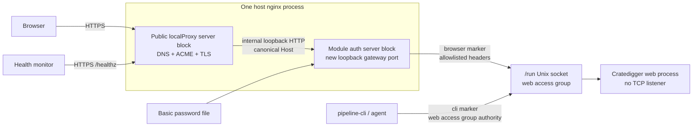
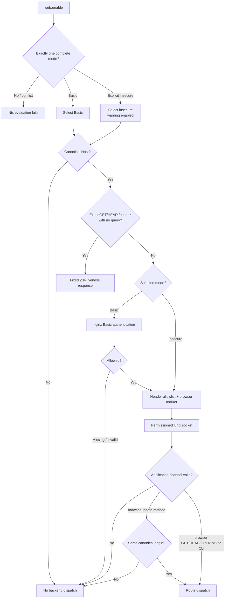

# Web Authentication Perimeter - Plan

## Goal Capsule

Close CD-SEC-02 within issue
[#663](https://github.com/abl030/cratedigger/issues/663) by putting the complete
Cratedigger browser surface behind a fail-closed authentication perimeter,
with only exact anonymous GET/HEAD `/healthz` without a query excepted. The
NixOS module supplies whole-site Basic Auth, subject to that liveness exception,
as the secure mode and refuses to expose the site unless Basic or the explicit
insecure escape hatch is selected.

The implementation keeps authentication outside Cratedigger. The existing
public homelab proxy continues to own DNS, ACME, and TLS; a module-owned
loopback nginx gateway owns authentication and browser request classification;
and the Python application accepts production traffic only through a
permissioned Unix socket. Its single local authority is the **web access
group** (`cfg.web.accessGroup`). The five API-backed `pipeline-cli` mutations
use that same socket and canonical route behavior under web access group
authority.

This is one coordinated security change rather than a web rewrite. It includes
the application request-security envelope, Unix transport, CLI adapter,
module-owned nginx configuration, deterministic and generated proof, the real
NixOS VM boundary, the unobtrusive insecure footer, documentation, downstream
Basic configuration, deployment, and live verification.

The only runtime inputs not contained in the repository are operator-selected
Basic credential material: the initial `htpasswd` entry and the replacement
entry used for the required live rotation. Both are provisioned through
sops-managed secret transactions; the initial entry must exist before the
downstream pin can deploy, and the replacement is applied after cutover before
audit closure.

External/OIDC authorization is not implemented, exposed as a module option,
VM-qualified, promised in operator documentation, deployed, or required for
Definition of Done in this workstream. The settled future direction remains a
binary, whole-site, mutually exclusive external allow-or-deny mode, but all of
its delivery surfaces are deferred until the provider-neutral
external-session credential bridge is settled in
[Deferred / Open Questions](#deferred--open-questions).

**Secondary target repository:** `nixosconfig`. Entries explicitly labeled
“In `nixosconfig`” use paths relative to that repository.

**Product Contract preservation:** clarified actors, flows, and
implementation-facing acceptance detail for the confirmed current scope:
R1-R15, F1-F5, and AE1-AE8 cover Basic plus explicit insecure mode. The
historically settled external-auth direction is preserved only as deferred
future work.

---

## Product Contract

### Summary

The implementation inserts a module-owned authentication gateway in front of a
Unix-only web backend, while preserving the existing public DNS/TLS proxy and
canonical API behavior. It covers Basic and deliberate insecure modes without
making Cratedigger an identity or credential system.

### Problem Frame

The current web service has no identity, credential, or request-origin
boundary. It binds its Python HTTP server on every interface, permits wildcard
CORS, and exposes destructive archival actions to any device that can reach the
service or to a malicious page using the operator's authenticated browser as a
request relay.

Cratedigger is a single-operator archival tool, so it does not need accounts,
roles, or a permission model. It does need to prove that browser requests
passed through an established authentication component, prevent direct backend
bypass, retain non-interactive local CLI access, and fail closed when the secure
boundary is absent or unhealthy.

### Key Product Decisions

- KD1. **Authentication remains outside Cratedigger.**
  `(session-settled: user-directed — chosen over Cratedigger-owned passwords, sessions, tokens, or identity-aware authorization.)`
  Basic credential verification belongs to nginx in this delivery. The
  historically settled future external mode remains binary allow-or-deny, but
  is deferred in full. Governs R3-R5.
- KD2. **Basic Auth is the module-owned secure mode delivered now.**
  `(session-settled: user-directed — Basic is the smallest portable secure baseline.)`
  External/OIDC mode is not part of the current option or acceptance surface.
  Governs R1-R3.
- KD3. **Basic and explicit insecure modes are mutually exclusive, and Basic
  protects the whole site.**
  `(session-settled: user-directed — chosen over mutation-only protection: a partial gate would leave metadata exposed.)`
  If external authorization is implemented later, the settled direction is
  that it remains mutually exclusive with Basic and insecure mode and has no
  Basic fallback. Governs R2 and R5-R6.
- KD4. **Local CLI authority comes from web access group membership.**
  `(session-settled: user-approved — chosen over interactive browser credentials or a duplicate direct service path: agents and automation remain passwordless while using canonical API behavior.)`
  Governs R11-R12.
- KD5. **Insecure mode is deliberate but gently visible.**
  `(session-settled: user-directed — chosen over refusing all test use or showing a disruptive warning: the operator expects to use the escape hatch and wants a persistent nudge rather than harassment.)`
  Governs R13-R15.

### Actors

- A1. **Operator/installer:** Configures Basic or explicit insecure mode,
  supplies the Basic password file when required, and uses Cratedigger from
  browsers.
- A2. **Public TLS proxy:** The existing downstream `localProxy` vhost owns
  public DNS, ACME, TLS termination, and forwarding to the loopback gateway.
- A3. **Module-owned authentication gateway:** Enforces Basic Auth, or
  deliberately omits browser authentication only in explicit insecure mode,
  before forwarding a classified browser request.
- A4. **Local CLI or agent:** Uses web access group membership to call the
  same canonical API behavior without a browser login.
- A5. **Health monitor:** Checks a non-sensitive liveness surface without
  receiving operator credentials.

### Requirements

#### Mode selection and authentication ownership

- R1. A production web service must not expose the application unless Basic
  Auth or explicit insecure mode is completely configured.
- R2. Basic Auth and insecure operation are mutually exclusive modes; missing,
  conflicting, or incomplete configuration must fail closed before an
  unprotected site becomes reachable.
- R3. Basic mode must be fully wired by the NixOS module through the
  browser-facing HTTPS proxy chain using an operator-supplied password file,
  and Cratedigger must never receive or verify the username or password.
- R4. Authenticated application behavior must receive only a trusted allow
  assertion, not a username, email, group, role, access token, refresh token,
  cookie, or session identifier.

#### Protected browser surface

- R5. Authentication must cover the SPA, static assets, read APIs, route
  discovery, and mutation APIs; the minimal liveness surface in R6 is the only
  unauthenticated Cratedigger route.
- R6. The unauthenticated liveness surface must reveal only whether the web
  process can serve requests and must expose no collection, request,
  configuration, dependency, version, route, or error detail.
- R7. A network client or unprivileged co-resident service must not reach
  authenticated application behavior by calling the backend directly or by
  supplying forged proxy headers.
- R8. Cratedigger must remove wildcard CORS, deny cross-origin framing, mark
  application resources as same-origin, and provide no cross-origin browser
  API contract.
- R9. Every browser-facing mutation must reject a missing or mismatched
  same-origin `Origin`/`Referer` signal before application dispatch, while the
  web access group-authorized CLI path remains usable without browser headers.
- R10. Confirmation words and flags remain secondary intent checks and must
  never substitute for authentication or same-origin validation.

#### Local operator and agent access

- R11. `pipeline-cli` must remain non-interactive for authorized local
  operators, agents, scripts, and systemd services, with web access group
  membership deciding access.
- R12. API-backed CLI commands must continue through the canonical API behavior
  without a direct database or duplicate service fallback, and an unauthorized
  local user must not gain the CLI's trusted channel.

#### Explicit insecure operation

- R13. Insecure operation must require the explicit
  `web.enableInsecure = true` decision and must never be inferred from address,
  hostname, environment, development state, or missing auth configuration.
- R14. Every insecure-mode startup must emit a prominent log warning, and every
  rendered page must carry a small persistent notice at the bottom of the UI
  reading “Authentication is disabled for this Cratedigger instance.” without
  an overlay, modal, repeated prompt, or dismissal flow.
- R15. Insecure mode bypasses browser authentication only; CORS removal,
  browser mutation provenance, destructive confirmation, input validation, and
  canonical service authority remain enforced.

### Key Flows

- F1. **Basic Auth startup and use:** the installer selects Basic mode and
  supplies a password file; module evaluation validates the exclusive complete
  configuration; the outer TLS proxy forwards to the loopback gateway; nginx
  challenges the browser; and only valid credentials reach the application.
  Covers R1-R5 and R7.
- F2. **Browser mutation defense:** an authenticated browser request is marked
  by the gateway, its same-origin provenance is validated before its body or
  route is touched, and ordinary input and confirmation checks run only after
  that security gate. Covers R8-R10.
- F3. **Local CLI mutation:** a web access group member invokes an API-backed
  command; group permissions permit the Unix-socket connection; the CLI marks
  the request as local; and the canonical route result maps back to the
  existing exit-code contract. Covers R9 and R11-R12.
- F4. **Deliberate insecure test use:** the installer explicitly enables
  insecure mode; the gateway remains in place without browser authentication;
  startup logs the decision; and the SPA renders its footer notice while
  retaining every non-authentication security check. Covers R2 and R13-R15.
- F5. **Unauthenticated monitoring:** a monitor requests the exact liveness
  route through the canonical hostname; authentication is bypassed only for
  that method/path pair; and, after successful service startup, the probe
  executes a constant response without querying a dependency. Covers R5-R6.

### Acceptance Examples

- AE1. **Missing mode fails closed.** With web enablement and no auth mode or
  insecure opt-in, module evaluation fails and no site becomes reachable.
  Covers R1-R2.
- AE2. **Basic protects the complete site.** Missing or invalid credentials
  cannot fetch the SPA, assets, read APIs, route index, or mutations; valid
  credentials can; and the application never receives the Basic credential.
  Covers R2-R5.
- AE3. **Conflicting modes fail evaluation.** Basic plus insecure is rejected
  rather than ordered implicitly. Covers R2.
- AE4. **Forged headers do not create authority.** Browser-supplied internal,
  identity, token, forwarded, or authorization headers are overwritten or
  removed, and a caller without Unix-socket permission cannot reach
  application behavior directly. Covers R4 and R7.
- AE5. **Cross-origin mutation is inert.** An authenticated browser's missing,
  null, malformed, or mismatched provenance is rejected before body parsing,
  handler dispatch, service calls, or mutation of PostgreSQL, Beets, audit, or
  filesystem state. Covers R8-R10.
- AE6. **Authorized CLI remains non-interactive.** Every API-backed mutation
  retains its method, payload, response, exit status, no-redirect behavior, and
  pre-database short circuit over the socket; an unrelated OS user fails before
  route dispatch and receives no TCP or direct-DB fallback. Covers R9 and
  R11-R12.
- AE7. **Liveness is the sole anonymous route.** The exact GET/HEAD liveness
  application response is a bare 204 with no body or application metadata and
  performs no dependency access after service startup; public-chain proof
  compares only stable semantic fields while every other route and method
  remains gated. Covers R5-R6.
- AE8. **Insecure is explicit and visible, not weakened.** Explicit insecure
  mode starts with the log and footer warnings, but a cross-origin mutation,
  forged request channel, or wildcard-CORS probe still fails. Covers R13-R15.

### Success Criteria

- No browser-accessible application route is unauthenticated except the exact
  liveness contract.
- The Python application has no production TCP listener and cannot be reached
  by an OS identity outside the web access group.
- Neither Cratedigger nor its module implements a password database, session
  lifecycle, OIDC protocol flow, account model, identity propagation, or
  permission model.
- Basic, insecure, direct-backend, forged-header, browser-relay, local-CLI, and
  health-probe worlds produce the contract's allow or deny result through real
  nginx and OS-permission boundaries.
- Existing same-origin UI behavior and all five API-backed CLI actions remain
  usable through their respective authorized paths.
- The deployed doc2 configuration uses Basic mode. The current module exposes
  no external-auth/OIDC mode.

### Scope Boundaries

#### In scope

- A module-owned loopback nginx gateway with whole-site Basic Auth.
- Exclusive fail-closed mode selection and the explicit insecure escape hatch.
- A systemd-owned Unix backend socket and the web access group, which is
  distinct from secret-bearing Cratedigger groups.
- Whole-site protection, strict Host handling, backend header allowlisting,
  direct-backend bypass prevention, CORS removal, and browser mutation
  provenance.
- Unix HTTP transport for the five existing API-backed CLI mutation adapters.
- A minimal liveness route and an unobtrusive insecure-mode footer.
- Real module evaluation, nginx, Unix-permission, deterministic, generated, UI,
  downstream, and live-deployment proof.

#### Deferred to Follow-Up Work

- The entire future external/OIDC mode: implementation, module option surface,
  external-authorizer fixture, VM acceptance, operator-documentation promise,
  downstream configuration, deployment, and Definition of Done. It remains
  deferred until the provider-neutral external-session credential bridge is
  settled.
- Provisioning or packaging an OIDC provider or authorization proxy such as
  OAuth2 Proxy, Authelia, Authentik, Cloudflare Access, or Tailscale.
- Moving CLI families that currently use PostgreSQL, filesystem, Beets, or
  secret authority onto the web API.
- Rate limiting, multi-user audit attribution, and public-internet exposure
  profiles.

#### Out of scope

- Cratedigger accounts, users, roles, permissions, identity attribution, or
  user-scoped audit history.
- Built-in passwords, sessions, cookies, bearer tokens, passkeys, WebAuthn,
  OAuth, OIDC, logout, recovery, or credential administration.
- Any stacked authentication policy.
- A web framework rewrite, new frontend build system, or second API mutation
  implementation.
- A general redesign of downstream `homelab.localProxy`; its Cratedigger entry
  remains the DNS/TLS owner and changes only its upstream to the new gateway
  port.
- A turnkey authentication framework for non-NixOS launch methods; those
  operators must supply an equivalent trusted gateway or deliberately choose
  insecure operation.

### Dependencies

- The downstream public proxy preserves the canonical `Host` and terminates TLS
  before forwarding over host loopback.
- The operator supplies initial and replacement bcrypt-capable `htpasswd`
  material outside the Nix store and grants nginx read access without exposing
  either value to Cratedigger.
- Linux users intended to run API-backed CLI mutations can be added explicitly
  to the web access group.

### Sources

- [Issue #663](https://github.com/abl030/cratedigger/issues/663) — CD-SEC-02
  remediation authority.
- `docs/security-audit-2026-07-12.md` — confirmed LAN/browser-relay attack
  paths and remediation boundary.
- `web/server.py`, `web/routes/imports.py`, and `scripts/web_dev_server.py` —
  current unauthenticated dispatch and wildcard-CORS surfaces.
- `scripts/pipeline_cli/api_mutations.py`,
  `scripts/pipeline_cli/routes_meta.py`, and `scripts/pipeline_cli/cli.py` —
  canonical API-backed CLI contract and early dispatch.
- `nix/module.nix`, `nix/tests/module-vm.nix`, and `tests/test_nix_module.py` —
  current web listener, wrapper, service, and Nix proof surfaces.
- In `nixosconfig`, `modules/nixos/services/cratedigger.nix` and
  `modules/nixos/services/local_proxy.nix` own the downstream service, secret,
  DNS, ACME, TLS, and public proxy boundary.
- [NGINX Basic Authentication](https://nginx.org/en/docs/http/ngx_http_auth_basic_module.html)
  and [RFC 7617](https://datatracker.ietf.org/doc/html/rfc7617) — nginx-owned
  password verification and HTTPS requirement.
- [NGINX proxy request-header controls](https://nginx.org/en/docs/http/ngx_http_proxy_module.html)
  — Basic credential and client-header isolation.
- [OWASP CSRF guidance](https://cheatsheetseries.owasp.org/cheatsheets/Cross-Site_Request_Forgery_Prevention_Cheat_Sheet.html)
  and [NGINX request routing](https://nginx.org/en/docs/http/request_processing.html)
  — canonical-origin and Host validation.
- [systemd socket units](https://www.freedesktop.org/software/systemd/man/latest/systemd.socket.html)
  and [Python `socketserver`](https://docs.python.org/3/library/socketserver.html)
  — Unix-socket ownership, activation, and threaded serving.

---

## Planning Contract

### Key Technical Decisions

- KTD1. Preserve the confirmed two-tier proxy topology. The downstream
  `localProxy` vhost continues to own `music.ablz.au`, DNS, ACME, and TLS. The
  Cratedigger module adds a loopback-only authentication server block on a new
  `web.gatewayPort` that is distinct from the legacy Python port; downstream
  changes only the Cratedigger-owned `localProxy` option instance/upstream in
  `modules/nixos/services/cratedigger.nix`. The generic
  `modules/nixos/services/local_proxy.nix` implementation remains unchanged.
  Both server blocks run in the same host nginx process, so separation is
  configuration- and listener-based rather than process isolation.
  `(session-settled: user-approved — chosen over moving the public vhost into the Cratedigger module: this preserves the existing homelab DNS/TLS boundary without a general proxy refactor.)`
  Governs R3, R5, and R7.
- KTD2. Preserve the user-facing `web.enableInsecure` decision and infer no mode
  from missing settings. Add `web.hostName` and nullable
  `web.basicAuthFile`. Assertions require exactly one of Basic or insecure
  whenever `web.enable` is true and reject pairwise conflicts. The password
  file option is an absolute runtime string, not a Nix path value; store paths
  reject. No external-auth/OIDC submodule or related option is added in this
  delivery. Governs R1-R3 and R13.
- KTD3. Make a systemd-owned AF_UNIX socket the only production application
  listener. A declarative runtime-directory rule owns the socket parent as
  `root:${cfg.web.accessGroup}` with mode `0750`; the socket unit separately
  owns the node and its `0660` mode. The web service explicitly requires and
  orders after its socket, so direct service start activates the same socket or
  fails without inventing a listener. Add nginx, the Cratedigger service user,
  and only explicitly configured operators to the web access group; never add
  nginx to `cratedigger-ops`, `beets-library`, `users`, or another group that
  carries unrelated secret or media authority. Web access group membership
  grants arbitrary HTTP access to the complete API and the `cli` channel, not
  merely permission to execute five wrapper commands. Governs R7 and R11-R12.
- KTD4. Classify trusted requests with
  `X-Cratedigger-Request-Channel: browser|cli` only after transport authority is
  established. The gateway discards any client value and writes `browser`; the
  Unix CLI writes `cli`; the application rejects missing or unknown values
  before route dispatch. An authorized web access group member can write `cli`
  because that membership is the local authority; the header alone is never
  authentication. Governs R7, R9, and R11-R12.
- KTD5. Treat the gateway-to-application request as a fresh allowlisted
  request, not a forwarded browser request. Disable wholesale request-header
  forwarding and reconstruct an exact set: canonical Host, one validated
  content length/type, `Accept`, `Range`, `Origin`, `Referer`, and the
  overwritten request channel. Never relay client `Transfer-Encoding`,
  `Connection`, `Upgrade`, `TE`, `Trailer`, `Expect`, connection-nominated
  fields, Basic credentials, cookies, tokens, identity/group fields, forwarded
  identity, or a client-supplied internal marker. Ambiguous or conflicting
  framing/authority headers reject at the edge and close the connection.
  Application responses deny framing with CSP `frame-ancestors 'none'` plus
  `X-Frame-Options: DENY`, and mark application, static, API, and audio
  resources `Cross-Origin-Resource-Policy: same-origin`. Governs R3-R4 and
  R7-R9.
- KTD6. Use an exact canonical public origin computed from the configured HTTPS
  hostname in Basic and insecure modes, never from `Host`,
  `X-Forwarded-Host`, or another request header. For every browser method
  outside the explicit safe set, a pure request-security helper parses and
  compares scheme, normalized host, and effective port; rejects `null`,
  malformed, multiple, userinfo-bearing, or mismatched values; validates every
  supplied signal; and requires at least one valid `Origin` or `Referer`. It
  runs before body reads, route lookup, service calls, or error-triggered DB
  reconnect work. A route/method audit prevents a state-changing
  GET/HEAD/OPTIONS or future unsafe method from escaping this policy. Governs
  R7-R10.
- KTD7. Give the loopback gateway two server blocks on the dedicated port: an
  exact configured hostname and a default reject server on IPv4 and IPv6
  loopback. Responses and return targets use the configured public origin or a
  validated relative request URI, never a request-derived host. This makes DNS
  rebinding, IP-literal access, and forwarded-host spoofing fail before auth or
  dispatch. Governs R3 and R7.
- KTD8. Implement `/healthz` as the only unauthenticated Cratedigger route:
  exact GET/HEAD with no query, a bare 204 with no body or `Content-Length`, no
  per-request database/cache/mirror/Beets access, no
  product/version/error payload, and no ordinary Python server metadata.
  Nginx proxies a fixed `/healthz` target, never an alternate raw URI.
  Application-level proof pins that deterministic response; public-chain proof
  compares stable status/body/application metadata while permitting
  transport-generated headers such as `Date`. Canonical Host enforcement still
  applies, and encoded separators, dot segments, duplicate slashes,
  absolute-form targets, and every other method/path stay gated. The web
  service may still require migration and dependencies to start; liveness is
  not readiness. Governs R5-R6.
- KTD9. Add Unix HTTP transport inside the existing API mutation adapter,
  preserving `_relay`, JSON validation, timeouts, `_NoRedirectHandler`
  semantics for explicit TCP development, route payloads, status-to-exit
  mapping, and the early return before database/mirror setup. The installed
  wrapper selects a non-overridable socket endpoint; a later CLI argument
  cannot replace it. Explicit `--api-base` remains available only when invoking
  the standalone development entry point and is never a production fallback.
  Other CLI families retain their present PostgreSQL, filesystem, Beets, and
  secret boundaries.
  `(session-settled: user-approved — chosen over migrating the whole CLI onto the web API: this work secures the existing API-backed mutations without redesigning unrelated operator authority.)`
  Governs R11-R12.
- KTD10. Keep insecure mode behind the same loopback gateway, Unix backend,
  request-channel overwrite, Host gate, header allowlist, CORS removal, and
  browser provenance checks using the same configured HTTPS canonical origin
  as Basic mode. It disables only the browser auth directive, passes an
  explicit render/startup flag to the app, logs at CRITICAL on every start, and
  exposes a static non-dismissible footer in normal document flow. Governs
  R13-R15.
- KTD11. Qualify policy at three independent layers: pure deterministic and
  generated origin/channel properties; real HTTP and AF_UNIX adapter tests
  with dispatch spies; and the real NixOS nginx/systemd boundary with
  Basic/insecure mode switching, a recording backend, and distinct OS users.
  The downstream preflight additionally evaluates the combined public/gateway
  server blocks from the exact nixosconfig candidate. Source-text assertions
  alone are not sufficient security proof. Governs all requirements and
  acceptance examples.
- KTD12. Use a staged fail-closed cutover. First preposition and validate the
  runtime Basic secret and close only the public Cratedigger vhost through a
  signed downstream generation. Then deploy the candidate source, auth
  configuration, and new gateway port together; temporary
  denial/unavailability is acceptable, anonymous application success is not. A
  failed new nginx reload must never leave the legacy unauthenticated vhost
  serving. After cutover proof, deploy replacement `htpasswd` material through
  a separate signed sops/nixosconfig transaction and retain its fleet and
  active-secret-generation receipt before audit closure. Governs R1-R3, R7,
  and the U6 rollout/rollback.

### High-Level Technical Design

These sketches define the security relationships and order of decisions, not
exact implementation signatures.

#### Component and authority topology



The public server block has no UDS location and dials only the distinct
loopback gateway listener. This is a reviewed nginx-configuration boundary, not
process isolation. The gateway and authorized web access group members can reach
the complete application API; no general LAN client or unrelated local service
can.

#### Mode selection and request admission



#### Authenticated browser mutation sequence

```mermaid
sequenceDiagram
    participant B as Browser
    participant O as Public TLS proxy
    participant N as Module nginx gateway
    participant W as Cratedigger web
    participant S as Canonical service

    B->>O: POST with Basic credentials and Origin
    O->>N: Loopback request with canonical Host
    N->>N: Validate Basic credentials
    alt missing or invalid credentials
        N-->>B: Basic challenge; no application request
    else allowed
        N->>N: Drop credentials, cookies, identity, and client markers
        N->>W: Allowlisted request with browser marker
        W->>W: Validate channel and every supplied origin signal
        alt missing or mismatched provenance
            W-->>B: Denial before body/route/service dispatch
        else same origin
            W->>S: Existing canonical mutation
            S-->>W: Existing result
            W-->>B: Existing JSON/status contract
        end
    end
```

#### Local CLI mutation sequence

```mermaid
sequenceDiagram
    participant U as Authorized OS user
    participant C as pipeline-cli
    participant K as Unix socket permissions
    participant W as Cratedigger web
    participant S as Canonical service

    U->>C: Existing non-interactive command
    C->>K: HTTP POST over AF_UNIX with cli marker
    alt user lacks web access group
        K-->>C: Permission denied; no fallback
    else authorized
        K->>W: Request reaches handler
        W->>W: Validate cli channel; browser provenance not required
        W->>S: Same canonical mutation as browser
        S-->>W: Existing service result
        W-->>C: Existing HTTP JSON/status contract
        C->>C: Map status to existing exit code
    end
```

### System-Wide Impact

- **Web process:** replaces its production all-interface listener with inherited
  AF_UNIX serving, adds a pre-dispatch request-security gate and exact liveness
  path, removes wildcard CORS, and conditionally renders the insecure footer.
- **Nginx:** gains loopback-only Cratedigger gateway and reject vhosts,
  mutually exclusive Basic/insecure policy and a backend header allowlist.
- **Systemd/users:** gains a socket unit and the web access group; nginx
  receives only that group, not Cratedigger's existing secret-bearing groups.
- **CLI:** the five API-backed mutations use Unix HTTP in production; all other
  command families and their resource-specific authority remain unchanged.
- **Frontend/dev tooling:** the SPA gains one static footer and the read-only
  dev server gains an explicit warning-preview path; no JavaScript framework or
  build step is introduced.
- **Downstream NixOS:** adds a hostname, Basic password-file secret, operator
  membership in the web access group, and a new gateway upstream port.
  Its current `localProxy` entry remains the public TLS owner.
- **Persistence/domain behavior:** no migration, PostgreSQL schema, Beets
  operation, request status, archival policy, route payload, or service result
  changes.

### Risks and Mitigations

- **The two server blocks share one nginx process and can merge or bypass each
  other through configuration.** Give them unique vhost keys and listeners,
  keep the public block free of any UDS location, pin canonical Host/origin,
  and qualify the combined evaluated downstream nginx configuration.
- **Adding nginx to an existing operator group could expose unrelated
  secrets.** Create the web access group solely for this authority and assert
  nginx is absent from
  `cratedigger-ops`, `beets-library`, and the service's broader media group.
- **Web access group membership is complete local API authority.** Keep
  membership explicit and minimal, audit supplementary groups for every
  service identity, and document that compromise of nginx or any member
  compromises this perimeter.
- **Basic credentials or client cookies can leak through nginx defaults.**
  Disable wholesale backend request-header forwarding, add back only the
  reviewed application allowlist, and prove captured upstream headers in the
  VM.
- **Ambiguous request framing can be interpreted differently by the public
  block, gateway, and Python parser.** Reconstruct one content length, drop all
  hop-by-hop/framing headers, reject duplicates and CL+TE ambiguity, close the
  connection on rejection, and qualify raw requests with zero backend
  dispatch.
- **Basic policy can be inherited or bypassed inconsistently across
  locations.** Render authentication once for the whole site, disable it only
  for the exact liveness location or explicit insecure mode, and sweep every
  registered route anonymously in the VM.
- **Socket activation can regress threading, HTTP/1.1, cleanup, or boot
  ordering.** Adopt exactly one systemd fd, retain `daemon_threads` and
  per-connection handle cleanup, reject missing/extra/non-Unix fds, and run
  concurrency, keep-alive, shutdown, restart, and migration-order tests over a
  real socket.
- **The request-channel header can be mistaken for authentication.** Require
  the protected Unix transport first, overwrite the browser value in nginx,
  require the CLI value from the web access group-authorized client, reject
  missing or unknown values, and qualify forged inbound headers.
- **Privacy tools can omit browser provenance.** Fail closed as required; keep
  the local CLI channel independent, document the browser requirement, and
  avoid adding a weaker cookie or Fetch-Metadata fallback.
- **The liveness exception can expand accidentally.** Use an exact
  normalized method/path/no-query contract in both nginx and the application,
  proxy a fixed upstream target, keep it outside route registries, and test raw
  URI normalization variants plus every registered route anonymously.
- **The footer can become intrusive or disappear after SPA changes.** Keep it
  static, semantic, non-dismissible, and in document flow; assert secure versus
  insecure rendering and inspect desktop/mobile screenshots.
- **A new upstream assertion can make the old downstream pin unevaluable.**
  Prepare and evaluate the complete downstream hostname, Basic secret, and web
  access group settings against the candidate Cratedigger revision before
  merge. Use the staged KTD12 sequence: preposition the secret and close the
  public edge first, then update the source pin and matching auth configuration
  together in the final signed cutover transaction.
- **A password hash committed to the Nix store remains offline-guessable.**
  Treat the entire `htpasswd` file as secret, provision it with sops, document a
  modern bcrypt entry, and prove neither store closure nor application
  environment contains it.

### Sequencing

U1 establishes the application-level request-security contract. U2 adds the
Unix server and CLI transport that U3 will make authoritative in production.
U3 adds module options, systemd socket ownership, and nginx mode enforcement.
U5 then adds the insecure-mode presentation and its focused browser proof. U4
runs last among the implementation units so its final VM qualification tests
the complete U1-U3 plus U5 tree in Basic and insecure modes.

U6A adds current-scope operator documentation and completes candidate
downstream preflight before merge. U1-U3, then U5, then final U4, plus only
U6A's upstream Cratedigger documentation land together in the implementation
PR. The evaluated nixosconfig candidate and encrypted secret declaration
remain downstream and do not land in that PR; U6B lands them later through
signed downstream transactions. This separation avoids exposing an
unclassified backend, requiring auth before the local CLI transport exists,
advertising a mode that is not actually qualified, or leaving the shipped
configuration undocumented. After that merge, U6B performs the signed
downstream edge-close/cutover, live proof, and signed credential-rotation
transaction. Only after those receipts exist does U6C land the upstream audit
closure in a separate documentation-only PR. CD-SEC-02 is marked complete only
after U6C; issue #663 remains open if any other checklist item is still
outstanding.

---

## Implementation Units

### U1. Establish the application request-security envelope

**Outcome:** every application request is classified before ordinary dispatch;
browser mutations require exact same-origin provenance; the liveness exception
is minimal; and no production or dev response advertises wildcard CORS.

**Requirements:** R4-R10 and R15.
**Acceptance:** AE4-AE5 and AE7-AE8.

**Primary files**

- Add `web/request_security.py`.
- Update `web/server.py` and `web/routes/imports.py`.
- Update `scripts/web_dev_server.py`.
- Update `tests/web/_harness.py`,
  `tests/web/test_server_endpoints.py`,
  `tests/web/test_server_threading.py`,
  `tests/web/test_routes_imports.py`, and
  `tests/test_web_dev_server.py`.
- Add `tests/web/test_request_security.py` and
  `tests/test_web_request_security_generated.py`.

**Contract**

- `web.request_security` owns pure parsing and decisions; route modules do not
  reimplement origin or request-channel logic.
- The handler recognizes only the exact `browser` and `cli` channels.
  Missing/unknown values fail before route lookup. The liveness method/path is
  the sole intentional pre-channel exception.
- Every browser method outside the explicit GET/HEAD/OPTIONS safe set supplies
  at least one `Origin` or `Referer`; every supplied signal must parse to the
  configured canonical origin. Default-port equivalence is normalized, while
  `null`, credentials, multiple values, malformed values, and
  prefix/suffix-confusable hosts reject. A route audit proves the safe methods
  have no mutation registration.
- Rejection happens before `_read_post_body`, handler selection, DB reconnect,
  service execution, filesystem access, or audit writes.
- `_json`, `do_OPTIONS`, wrong-match audio success/range errors, and the dev
  server emit no `Access-Control-Allow-*` contract.
- `/healthz` handles only GET/HEAD with no query, returns a bare 204 with no
  body or `Content-Length`, uses no route registry or per-request dependency,
  and suppresses the stdlib Server/version response path.

**Implementation steps**

1. Write deterministic pins for exact-origin, Referer fallback, conflicting
   signals, default ports, malformed/null/multiple values, unknown channels,
   and pre-dispatch rejection using body/route/service spies.
2. Add a generated strategy over methods, schemes, host casing, ports,
   userinfo, serialized headers, and channel values. Pair it with a named
   deterministic example and a known-bad checker self-test that proves
   mismatched-origin, missing-provenance, and future-unsafe-method mutants are
   killed.
3. Implement the pure decision helper and one central handler gate used by all
   POST routes, including the cache-invalidation compatibility route.
4. Add the exact liveness GET/HEAD/no-query short circuit before ordinary GET
   dispatch. Pin the application-controlled status/body/metadata,
   per-request dependency non-use,
   encoded-separator/dot-segment/duplicate-slash rejection, and the distinction
   between liveness and startup readiness; public-chain assertions compare only
   stable fields and tolerate transport-generated headers.
5. Remove wildcard CORS from the central JSON writer, OPTIONS, wrong-match
   audio 200/206/416 responses, and every dev-server response. Update tests to
   assert absence rather than substitute a restrictive wildcard.
6. Make the shared route harness send production-shaped browser classification
   and canonical origin by default, while targeted tests can omit or corrupt
   either signal. Audit raw POST tests outside the harness so they cannot
   silently exercise an impossible production request.
7. Add a method/route inventory assertion that GET, HEAD, and OPTIONS own no
   mutation registration and that every other method enters the provenance
   gate before route lookup.
8. Fault-inject origin-derived-from-Host, first-signal-only validation,
   post-body validation, unknown-channel acceptance, and one surviving CORS
   header. Record the named tests that kill each mutant.

**Verification outcome**

The deterministic and generated suites prove every rejected browser world has
zero dispatch, while existing same-origin route tests remain behaviorally
unchanged and no response surface advertises cross-origin access.

### U2. Replace the production TCP backend with Unix HTTP and preserve CLI parity

**Outcome:** the web process can serve its existing threaded HTTP/1.1 handler
from exactly one systemd-provided Unix fd, and every API-backed CLI mutation
uses that socket without acquiring a fallback path.

**Requirements:** R7 and R11-R12.
**Acceptance:** AE4 and AE6.
**Approach:** KTD9.

**Primary files**

- Update `web/server.py`.
- Update `scripts/pipeline_cli/api_mutations.py`,
  `scripts/pipeline_cli/routes_meta.py`, and
  `scripts/pipeline_cli/cli.py`.
- Update `tests/web/test_server_threading.py`,
  `tests/test_no_dual_load.py`,
  `tests/test_pipeline_cli_api_mutations.py`, and
  `tests/test_pipeline_cli_api_mutations_generated.py`.

**Contract**

- Production startup accepts exactly one inherited AF_UNIX stream socket and
  never calls `ThreadingHTTPServer(("0.0.0.0", ...))`.
- The Unix server retains HTTP/1.1 keep-alive, concurrent request threads,
  daemon-thread shutdown, `Handler.finish()` cleanup, and per-thread DB/Beets
  handles.
- Missing, multiple, wrong-family, or non-listening inherited fds fail startup.
  Any retained manual TCP mode is explicitly insecure, loopback-only, and never
  selected by the NixOS module.
- The Unix CLI client sends a valid HTTP/1.1 request with the `cli` marker and a
  fixed internal Host, preserves request paths/bodies/timeouts, and reads error
  bodies exactly as the current adapter does.
- Socket absence, permission denial, connection failure, timeout, and malformed
  HTTP produce the existing structured local failure and exit 5. They never
  try TCP, construct `PipelineDB`, configure mirrors, or duplicate a service.
- Explicit TCP `--api-base` remains available only for standalone development
  and the real no-redirect/replay test. The installed wrapper selects a
  non-overridable Unix endpoint in U3, so argument order cannot restore TCP.

**Implementation steps**

1. Add real AF_UNIX threading/keep-alive/shutdown tests before changing startup.
   Include restart/stale-node behavior at the systemd layer in U4 rather than
   application-owned unlink logic.
2. Implement a threaded Unix HTTP server around the inherited fd without
   invoking `HTTPServer.server_bind`, which assumes a `(host, port)` address.
   Keep the current Handler and teardown semantics.
3. Add a small Unix `HTTPConnection` transport inside `api_mutations.py` and
   thread endpoint selection through `_post`/`_relay` without changing the five
   command payload builders.
4. Add a real Unix round-trip server to
   `tests/test_pipeline_cli_api_mutations.py`. Run all five adapters through it,
   verify the `cli` marker, and retain the existing real TCP redirect test.
5. Extend the generated response/exit property across both transports without
   weakening its known-bad self-test.
6. Pin permission-denied/no-socket behavior and prove all API commands still
   return before runtime config, mirrors, and database setup.
7. Pin that a wrapper invocation cannot override its socket with a later
   `--api-base`, while the standalone entry point retains explicit development
   TCP.
8. Remove the production all-interface startup path and update boot-shape,
   no-dual-load, mock-audit, and dead-code expectations as required.

**Verification outcome**

A real Unix server preserves the current route and CLI contracts, the web
process has no production TCP bind path, and every local transport failure is
fail-closed and fallback-free.

### U3. Make the NixOS module own authentication, web access authority, and proxy isolation

**Outcome:** enabling the web module renders exactly one complete auth mode, a
dedicated systemd socket, and a loopback nginx gateway that cannot leak browser
credentials or be bypassed through the Python backend.

**Requirements:** R1-R7 and R11-R15.
**Acceptance:** AE1-AE4 and AE6-AE8.
**Approach:** KTD1-KTD10.

**Primary files**

- Update `nix/module.nix`.
- Update `tests/test_nix_module.py` and `flake.nix` only where the evaluated
  module/check contract requires it.
- Update `examples/cratedigger.nix` enough for the module to remain a valid
  first-install example; full narrative documentation belongs to U6A.

**Contract**

- `web.enable = false` needs no auth mode. When enabled, exactly one of a
  non-null `web.basicAuthFile` or `web.enableInsecure = true` is required.
- `web.gatewayPort` is a new loopback nginx port and does not reuse the legacy
  Python `8085` listener during the cutover. The old `web.port` production
  contract is removed rather than repurposed ambiguously.
- `web.hostName` is a non-empty canonical DNS hostname. Basic and insecure
  modes compute the same HTTPS public origin from it. The Basic file is an
  absolute runtime string outside the Nix store.
- The fixed backend socket is systemd-owned under `/run`, with an explicit
  parent owner/group/mode, socket owner/group, and `0660` node mode. The module
  creates only the web access group, grants it to nginx and the service, and
  exposes `cfg.web.accessGroup` for explicit operator membership.
- `cratedigger-web.socket` owns socket lifecycle and passes one fd to
  `cratedigger-web.service`; the service requires/orders after the socket and
  cannot start through another listener. Migration/Redis ordering and the
  existing service sandbox remain intact.
- The installed `pipeline-cli` wrapper selects the fixed Unix socket in a way
  user arguments cannot override. It does not embed Basic credentials and
  does not change other CLI authority.
- Nginx listens only on loopback at `web.gatewayPort`. The exact-host vhost
  owns auth, fixed-target liveness, header reconstruction, browser marking, and
  Unix `proxy_pass`; a default vhost rejects every other Host.
- The gateway adds framing denial to documents and same-origin resource policy
  to application, static, API, and audio responses in both modes.
- Basic uses `basicAuthFile`, never Nix's plaintext `basicAuth`. Liveness
  disables inherited Basic only for its exact contract.
- Insecure mode changes only the browser auth directive and passes the explicit
  warning/render flag; it retains the gateway and every other boundary.
- The module exposes no external-auth/OIDC option in this delivery.

**Implementation steps**

1. Add real `nix eval` cases for web disabled, missing mode, Basic, insecure,
   and the Basic-plus-insecure conflict. Include store-path Basic files and
   malicious/malformed hostname inputs.
2. Add all new options with descriptions so the documentation audit has no
   allowlist exception. Preserve `web.enableInsecure` exactly as the confirmed
   operator decision.
3. Provision the runtime parent with exact group ownership independently of the
   socket node, add the socket unit, and make the web service require the
   inherited-fd topology. Prove direct service start activates that socket or
   fails without a restart loop. Ensure nginx receives no existing
   secret/media group.
4. Add the distinct gateway listener and exact/default loopback vhosts. Proxy
   ordinary original URIs to the fixed Unix socket, but proxy anonymous
   liveness to a fixed `/healthz` upstream target.
5. Render Basic and insecure location policy from one mode selection. Avoid
   `satisfy`, stacked directives, and fallback order.
6. Disable backend request-header forwarding and add the reviewed allowlist,
   fixed public origin/Host, and overwritten browser channel. Ensure Basic
   credentials and client cookies never reach the application proxy, and add
   the response-side framing/resource-isolation headers.
7. Add runtime Basic-file validation to nginx activation/reload ordering:
   non-empty, restrictive, readable by nginx through a separate secret
   permission, unreadable by the application and operator identities, not
   readable merely through web access group membership, and outside the store.
   Evaluation proves only option shape; runtime proof owns
   presence/readability.
8. Update the CLI wrapper contract and first-install example to use the socket,
   hostname, gateway port, and one deliberate mode.
9. Add structural assertions that no Python TCP target or trusted-loopback
   `--api-base` remains in production, without treating source text as the
   final security proof.

**Verification outcome**

Every invalid module world fails evaluation; every valid world renders one
auth policy and one protected socket; and the generated nginx/systemd
configuration never forwards credentials to the application backend and
contains no direct Python listener.

### U4. Qualify the real nginx, Basic, and OS-permission boundary

**Outcome:** the NixOS module VM proves the deployed components—not mocks or
source strings—enforce whole-site Basic Auth, header isolation, canonical
Host/origin, explicit insecure mode, and web access group permissions.

**Requirements:** all R1-R15.
**Acceptance:** all AE1-AE8.
**Approach:** KTD11.
**Execution order:** run this final VM qualification after U5 has added and
focused-tested the insecure presentation; the unit number groups verification
responsibility and is not chronological.

**Primary files**

- Update `nix/tests/module-vm.nix`.
- Update `flake.nix` only if the existing `moduleVm` check must aggregate a
  dedicated auth fixture without changing the final gate name.
- Update `tests/test_nix_module.py` for generated-unit and option-shape audits.

**Contract**

- The existing module VM boots in Basic mode with a test-only bcrypt password
  file, `beets-operator` in the web access group, and `unrelated-user` outside
  it.
- The VM supplies a representative outer TLS/proxy server block with the same
  public-host-to-gateway relationship as downstream `localProxy`; U6A's exact
  candidate evaluation remains the final combined-config proof.
- A test-only NixOS specialisation exercises insecure mode on the same module
  revision. The test switches Basic→insecure→Basic and proves each transition
  restarts/reloads the correct socket, app, and nginx units without leaving
  stale policy.
- A test-only header-recorder service can temporarily replace the application
  `ExecStart` behind the same module-owned Unix socket, user, groups, and
  sandbox. It records dispatch counts and nginx-to-backend requests in
  root-only test state without adding a production inspection route.
- The ordinary Cratedigger app remains the backend for route, provenance,
  liveness, and CLI parity checks.

**Implementation steps**

1. Extend the VM's users/groups and configure the base system with canonical
   hostname, Basic mode, and a fixture password file.
2. Prove anonymous versus valid/invalid Basic behavior for the SPA, one static
   asset, one read route, route discovery, and a mutation. Assert the password
   file is outside the application environment and no Authorization reaches
   the recorder. Assert framing denial on documents and same-origin resource
   policy on application, static, API, and audio responses.
3. Sweep all registered application routes anonymously and allow only the
   exact liveness method/path. Assert its response is constant and performs no
   dependency access once the service has started; separately retain the
   existing migration/dependency startup contract.
4. Prove the Python process owns no TCP listener, nginx owns only the loopback
   gateway listener on the new non-legacy port, the socket parent and node
   ownership/modes are independently exact, nginx and the web access group
   member can connect, and the unrelated user receives a filesystem denial.
   Stop the socket and start the service directly to prove no alternate
   listener or restart loop appears.
5. Run all five installed API-backed commands as the web access group member
   without a browser credential. Run one as the unrelated user and prove no
   gateway TCP or database fallback is attempted.
6. Send spoofed Authorization, Cookie, `X-Auth-Request-*`,
   `X-Forwarded-User/Email`, bearer/token, identity/role/group, forwarded-host,
   and internal-channel headers through the public-facing gateway. Use the
   recorder to prove only the allowlist and overwritten browser marker arrive.
   Add raw duplicate/conflicting Host, Origin, Referer, Content-Length, CL+TE,
   hop-by-hop, and malformed-chunk cases; every rejection closes the connection
   with zero recorder dispatch.
7. Exercise canonical Host, attacker Host, IP-literal Host, missing Host where
   HTTP permits, and forged forwarded Host. Assert rejection happens before
   Basic challenge, liveness, or backend dispatch.
8. Through real nginx, send exact Origin, exact Referer fallback, matching both,
   mismatched one, null, malformed, and missing-both browser mutations. Use a
   state/dispatch spy to prove rejected requests make zero change.
9. Switch to insecure mode and prove authentication alone is absent while
   Host, header stripping, browser marker, origin enforcement, liveness, web
   access group authority, startup warning, and footer flag remain. A browser
   mutation with the configured canonical origin succeeds, while mismatched,
   missing, and IP-literal-host variants reject.
10. Probe `/healthz` with queries, encoded separators, dot segments, duplicate
    slashes, absolute-form targets, conflicting Host forms, and alternate
    methods through the outer/gateway chain. Only the canonical GET/HEAD target
    may reach the fixed liveness handler.
11. Inspect the store closure, generated config, unit environments, file
    permissions, and representative process identities with a sentinel
    fixture. The Basic hash is absent from the store/config/environment;
    nginx alone can read the runtime file.
12. Restart nginx, the socket, and the web service in representative orders;
    assert socket activation, stale-node cleanup, threaded request serving, and
    migration dependency behavior remain sound.

**Verification outcome**

`nix build .#checks.x86_64-linux.moduleVm` proves the complete allow/deny matrix
against the same nginx, systemd, Python, and user/group mechanisms deployed by
the module.

### U5. Add the unobtrusive insecure-mode warning and visual proof

**Outcome:** explicit insecure mode is visible on every SPA render without an
overlay or repeated prompt, while Basic mode renders no warning.

**Requirements:** R13-R15.
**Acceptance:** AE8.
**Execution order:** converge U5 before running U4's final module VM matrix.

**Primary files**

- Update `web/index.html` and `web/server.py`.
- Update `scripts/web_dev_server.py`.
- Update `tests/web/test_server_endpoints.py` and
  `tests/test_web_dev_server.py`.

**Contract**

- The warning is server-selected from the explicit mode, not inferred in
  JavaScript from hostname, protocol, environment, or failed auth.
- Secure Basic responses contain no warning. Insecure responses
  contain exactly one semantic footer after the application sections and
  before scripts with the exact text “Authentication is disabled for this
  Cratedigger instance.”
- The footer remains in document flow, compact, readable, accessible, and
  non-dismissible. It uses a native footer landmark with ordinary non-live
  text, meets WCAG AA text contrast, and remains readable without overlap at
  200% zoom and the mobile viewport. It has no modal, overlay, close button,
  local-storage state, timer, animation, or repeated toast.
- Insecure startup logs one prominent CRITICAL message on every process start;
  secure startup does not.
- The read-only dev server has an explicit preview flag so visual verification
  does not require enabling a production bypass.

**Implementation steps**

1. Pin secure/insecure index bytes and startup logging before changing the
   template.
2. Add one static footer and minimal inline CSS consistent with the current
   no-build single-page document. Make the server's index rendering toggle only
   that known placeholder/element.
3. Add the explicit dev-preview switch and keep it compatible with the existing
   dev badge injection.
4. Run browser screenshots at representative desktop and mobile widths. Inspect
   the Browse, Recents, Pipeline, and Wrong Matches tabs with short and long
   content so the footer neither obscures controls nor floats as an overlay.
5. Add automated DOM/style assertions for presence, singularity,
   exact copy, non-live footer semantics, non-dismissible shape, and
   secure-mode absence. Add an accessibility-tree assertion and retain
   contrast/reflow screenshots as review evidence rather than brittle pixel
   fixtures.

**Verification outcome**

The warning is persistent and gently visible exactly in insecure mode, and
browser inspection confirms it does not interfere with normal archival work.

### U6. Document, configure, deploy, and close CD-SEC-02

**Outcome:** a first-time NixOS operator can choose one mode safely; doc2 deploys
Basic through the existing public TLS proxy; and issue/audit state records exact
live proof for the current Basic/insecure contract.

**Requirements:** all R1-R15.
**Acceptance:** all AE1-AE8.
**Approach:** KTD1, KTD8-KTD10, and KTD12.

#### U6A. Pre-merge documentation and candidate preflight

**Outcome:** the implementation tree documents only the Basic/insecure
contract, and the exact downstream candidate is evaluated and built before
that tree is merged. Only the upstream documentation belongs to the
Cratedigger implementation PR. The prepared nixosconfig candidate and encrypted
secret declaration remain downstream for U6B's signed transactions; no
downstream commit or production deployment occurs in U6A.

**Primary Cratedigger files**

- Update `docs/nixos-module.md`, `docs/webui-primer.md`,
  `docs/debugging-cli.md`, `examples/cratedigger.nix`, and
  `examples/README.md`.
- Update `docs/security-audit-2026-07-12.md` to describe the implemented
  perimeter and retain a visible pending-live-proof state until deployment.

**Candidate downstream files and state**

- These candidate changes are prepared and evaluated in U6A but land only
  through U6B's signed nixosconfig transactions.
- In `nixosconfig`, update `modules/nixos/services/cratedigger.nix`.
- Add the sops declaration and encrypted source for the operator-supplied
  `htpasswd` file through the repository's existing secret mechanism.
- Keep the generic `modules/nixos/services/local_proxy.nix` implementation
  unchanged. The Cratedigger-owned `localProxy` option instance in
  `modules/nixos/services/cratedigger.nix` preserves `music.ablz.au`
  DNS/ACME/TLS ownership and changes only its upstream to the new gateway port.

**Contract**

- Documentation names the two current exclusive modes, HTTPS requirement,
  Basic credential isolation, header/identity non-propagation, exact liveness
  path, web access group authorization, and insecure warning. It does not
  expose or promise an external-auth/OIDC option.
- Documentation states that executable mode bits do not secure a Nix-store
  program. API-backed CLI authority is the web access group; other CLI
  commands retain their resource-specific PostgreSQL/filesystem/secret
  boundaries.
- Basic password creation examples use a modern `htpasswd` hash, never inline
  plaintext or a Nix-store `basicAuth` attribute. They also document atomic
  sops-backed rotation and verification that the old credential is denied
  while the replacement succeeds without logging either value.
- Downstream adds `music.ablz.au`, Basic password-file configuration, and the
  existing operator user to the web access group, plus the new gateway
  upstream port. Nginx receives no `cratedigger-ops` membership.
- Insecure mode is never deployed on doc2. External mode is absent from the
  current module, operator documentation, VM acceptance, and downstream
  configuration.

**Pre-merge steps**

1. Update the option table, topology, Basic/insecure examples, CLI access
   instructions, health-monitor guidance, Basic credential rotation,
   troubleshooting, and rollback notes in the upstream docs. Do not publish an
   external-auth/OIDC configuration promise before its deferred credential
   bridge is settled.
2. Replace the web primer's “No auth” known issue with the actual perimeter and
   same-origin behavior. Update the CLI guide's trusted-loopback note to the
   Unix socket and honest whole-CLI authority statement.
3. Provision the bcrypt `htpasswd` entry directly into sops-managed downstream
   secret state; configure its runtime file for nginx read through a separate
   secret permission. Web access group membership alone grants no secret read,
   and the application, operator, and unrelated-user identities remain denied.
4. From a clean current Forgejo `master`, evaluate and build the exact doc2
   toplevel with the candidate Cratedigger commit, complete downstream diff,
   encrypted secret declaration, and combined public/gateway nginx
   configuration. Prove sops recipient/decryption, runtime permissions,
   `nginx -t`, distinct gateway-port availability, and no alternate UDS
   location.

#### U6B. Post-merge downstream cutover, live proof, and credential rotation

**Outcome:** after the implementation merge, doc2 moves through a fail-closed
edge-close and Basic cutover, passes the non-rotation live probes, receives a
separately signed sops-backed credential rotation with its own deployment
receipt, then completes the live verification contract with post-rotation
health proof.

**Post-merge steps**

1. Deploy a signed secret-preposition/edge-closed generation before the source
   cutover. The `music.ablz.au` certificate/DNS remain, but its application
   location returns only denial/unavailability. Verify externally that
   anonymous application content is impossible.
2. Make the ordinary signed nixosconfig pin/config transaction containing
   Basic, hostname, web access group, and new gateway
   upstream settings. Deploy through the locked fleet trigger. Temporary 401
   or 503 is acceptable; anonymous 2xx or application redirects are a stop
   condition.
3. Run every non-rotation part of the live verification contract below using a
   predeclared non-destructive canary. Prove successful same-origin gate passage
   with validation/no-op behavior, never by deleting or changing an archival
   object.
4. Create a replacement bcrypt entry, update only the sops-managed `htpasswd`
   credential material, and land it in a separate signed nixosconfig
   transaction after cutover. Deploy it through the locked fleet trigger and
   retain its signed revision, fresh upgrade invocation, exact active secret
   generation, and nginx reload/service-health receipt. Prove the old
   credential is denied and the replacement succeeds without printing or
   logging either value, then complete the post-rotation health checks.

#### U6C. Post-live upstream audit closure

**Outcome:** a later documentation-only Cratedigger tree records the exact
cutover, live, successor-cycle, and credential-rotation receipts; it does not
retroactively alter the already-verified implementation tree.

**Post-live steps**

1. Only after U6B and its rotation receipt, update the audit checklist/status
   and issue #663 CD-SEC-02 record with the implementation PR, signed pin,
   active source, service invocation, route/auth/socket probes,
   successor-cycle evidence, and signed rotation receipt. Land the audit update
   through a second documentation-only Cratedigger PR, run the final repository
   gates once on that audit tree, and merge it with a merge commit before
   updating the final issue status. Do not close the broader issue if unrelated
   checklist items remain open.

**Verification outcome**

The public site is Basic-protected through its existing certificate and DNS
path, CLI mutations by web access group members remain non-interactive, the
signed credential-rotation transaction is proven, and the later audit tree and
issue tell the exact implemented/deployed truth.

---

## Verification Contract

### Red/green focused convergence

Write each invariant as a failing deterministic pin plus a generated property
where the input space is meaningfully combinatorial. Use `nix-shell --run` for
all Python/test commands.

```bash
nix-shell --run "python3 -m unittest tests.web.test_request_security tests.test_web_request_security_generated -v"
nix-shell --run "python3 -m unittest tests.web.test_server_endpoints tests.web.test_server_threading tests.web.test_routes_imports -v"
nix-shell --run "python3 -m unittest tests.test_pipeline_cli_api_mutations tests.test_pipeline_cli_api_mutations_generated -v"
nix-shell --run "python3 -m unittest tests.test_nix_module tests.test_web_dev_server -v"
```

After the deterministic/generated modules are green, run the randomized burst
and promote any shrunk counterexample to a named `@example` or deterministic
pin:

```bash
nix-shell --run "bash scripts/fuzz_burst.sh"
```

### Fault qualification

Before final review, exercise these uncommitted known-bad variants. Each must be
killed by a named deterministic test and, where applicable, its paired
generated property:

- accept a browser POST with neither provenance header;
- admit a future PUT/PATCH/DELETE or a state-changing safe-method route outside
  the central provenance/method inventory;
- derive the expected origin from request Host;
- validate only the first of conflicting Origin/Referer signals;
- validate provenance after body parsing or handler lookup;
- treat a missing/unknown request channel as local CLI;
- preserve one wildcard CORS header on JSON, audio, OPTIONS, or dev responses;
- let a client-supplied browser/CLI marker survive nginx;
- forward Authorization, Cookie, or one identity/token header to the backend;
- forward a hop-by-hop header, accept duplicate framing/authority fields, or
  reuse a connection after CL+TE/malformed-chunk rejection;
- add nginx to the existing `cratedigger-ops` group;
- create the socket parent as `root:root`, create the node with systemd
  defaults, or start the service without its socket dependency;
- retain the Python TCP listener or retry TCP after a Unix failure;
- allow the installed wrapper to override its Unix endpoint with `--api-base`;
- omit Basic authentication from one protected location or accidentally retain
  it in explicit insecure mode;
- omit framing/resource-isolation response headers from one application,
  static, API, or audio response;
- exempt a route, query, normalized/raw URI variant, or method beyond the exact
  liveness contract;
- import the Basic hash into the Nix store or let the application or a web
  access group member read its runtime file;
- infer insecure mode from missing auth or suppress its startup/footer warning.

Keep only the production code and committed known-bad checker self-tests in the
final tree. Record the mutant-to-test kill matrix in the implementation PR.

### NixOS module boundary

The browser-presentation work and focused proof in the following section run
first. The mandatory module gate is U4's final qualification of that complete
tree:

```bash
nix build .#checks.x86_64-linux.moduleVm
```

It must prove:

- missing, incomplete, and conflicting mode configurations fail evaluation;
- Basic protects SPA/static/read/discovery/mutation routes and strips
  credentials;
- invalid or missing Basic credentials never dispatch, while valid credentials
  reach each protected surface;
- only exact liveness is anonymous and its response is constant;
- encoded/doubled/dotted/query/absolute-form liveness variants and alternate
  methods do not reach an anonymous application route;
- canonical Host works while attacker/IP/forwarded hosts reject;
- the backend has no TCP listener, the gateway uses the distinct cutover port,
  and both public/gateway server blocks have one unambiguous owner in the
  combined configuration;
- socket owner/group/directory/node modes are exact;
- nginx and the web access group member connect while an unrelated user cannot;
- all five installed API commands succeed without browser auth for the
  web access group member and fail without fallback for the unrelated user;
- captured backend headers contain the allowlist/browser marker and no
  credential, cookie, identity, token, forwarded identity, or client marker;
- documents deny framing and every application/static/API/audio response
  carries the required same-origin resource policy;
- raw duplicate Host/origin/framing, CL+TE, hop-by-hop, and malformed-chunk
  requests close without backend dispatch;
- the Basic sentinel is absent from the store/config/environment and readable
  only by nginx at runtime;
- insecure mode preserves every boundary except browser authentication and
  emits both warnings; its canonical-origin mutation succeeds while missing,
  mismatched, and IP-literal variants reject.

### Browser presentation

Use the repository's web dev server and Playwright workflow to inspect the
insecure footer at desktop and mobile widths. Capture evidence for its placement
on all four tabs, confirm it remains in document flow with long content, and
confirm secure mode contains no footer. Verify the exact copy, native non-live
footer semantics, WCAG AA contrast, the accessibility tree, and overlap-free
reflow at 200% zoom and the mobile viewport. Browser inspection is required
because DOM assertions cannot establish that a persistent bottom notice is
genuinely unobtrusive.

### Independent review

After U1-U3, U5, final U4, and U6A's upstream documentation converge on the
implementation tree—and U6A's downstream candidate preflight passes—use fresh
reviewers for:

- security: proxy trust, Basic challenge/failure states, header/cookie
  isolation, Host and origin parsing, filesystem authority, and secret
  exposure;
- correctness/reliability: socket activation, threaded HTTP lifecycle,
  timeouts, mode switching, liveness, and rollout/rollback;
- API/CLI contract: five adapters' payload/status/exit/no-redirect parity and
  absence of a database/TCP fallback;
- testing: deterministic/generated pair quality, known-bad qualification,
  recording-backend fidelity, real OS identities, and anonymous route sweep;
- maintainability/project standards: minimal new abstractions, Nix option
  descriptions, docs freshness, and no unrelated auth/provider framework.

Any review fix restarts the affected focused proof and requires review of the
new exact tree. A security-boundary change restarts the module VM gate as well.

### Final repository gates

After review and commit, run exactly once on the implementation tree containing
U1-U3, U5, final U4, and U6A's upstream documentation before its first push, in
this order:

```bash
nix-shell --run "pyright --threads 4"
nix-shell --run "bash scripts/run_tests.sh"
```

A failure restarts convergence, review, commit, and the final sequence. Do not
replay the gates for an unchanged tree after push or merge.

### Landing, downstream cutover, and audit closure

- In U6A, from a clean current Forgejo `master`, build the exact doc2 toplevel
  with the candidate source, complete downstream diff, real encrypted secret
  declaration, and combined public/gateway nginx configuration.
- Open one Cratedigger implementation PR containing U1-U3, U5, final U4, and
  U6A's upstream documentation, referencing CD-SEC-02 in issue #663. The
  prepared nixosconfig candidate and encrypted secret declaration remain
  downstream for U6B. Do not use a closing keyword for the entire issue unless
  every remaining issue item is complete.
- Merge with GitHub **Create a merge commit**, never squash or rebase.
- In U6B, preposition/decrypt the runtime secret and close the public
  Cratedigger edge through one signed locked-fleet deployment. Proceed only
  when secret permissions, free gateway port, closed edge, and candidate
  `nginx -t` are proven.
- After merge, update the source through the ordinary signed pin transaction
  and include Basic, hostname, web access group, and gateway-port settings in
  the final cutover commit.
- During cutover, anonymous application 2xx or an application redirect is STOP;
  challenge/denial or temporary unavailability is safe.
- After cutover and the non-rotation live probes pass, deploy the replacement
  `htpasswd` material through its own signed sops/nixosconfig transaction.
  Retain the signed revision, fresh fleet invocation, active-secret-generation
  receipt, nginx/service health, old-credential denial, and
  replacement-credential success.
- Only after that rotation receipt, begin U6C: land the audit closure through a
  second documentation-only Cratedigger PR, run the final gates once on that
  audit tree, and merge it with a merge commit before final issue-status
  updates.

### Live deployment proof

On doc2, capture and retain:

- the signed nixosconfig pin and exact active Cratedigger source from the
  deployed wrappers;
- a fresh `cratedigger-web` InvocationID, active socket/nginx units, migration
  success, and nginx configuration-test success;
- `ss`/systemd proof that nginx alone listens on the new loopback gateway port,
  the legacy Python port is closed, and the backend has only the expected Unix
  listener;
- exact socket parent/node owner, group, and modes, plus a direct-service-start
  probe showing the socket remains the sole topology;
- anonymous public HTTPS results for liveness versus SPA, static, read,
  discovery, and mutation routes;
- invalid and valid Basic behavior without printing or logging the credential;
- a separate signed sops-backed Basic rotation transaction and fleet receipt
  proving the old credential is denied and the replacement succeeds without
  either value appearing in output or logs;
- canonical Host versus IP/attacker/forwarded-host rejection;
- authenticated exact-Origin route passage using a predeclared nonexistent or
  validation-only canary, plus cross-origin/missing-origin rejection with
  authoritative before/after proof that request rows, audit records, Beets,
  and filesystem state are unchanged;
- authorized installed `pipeline-cli` success over the socket and an
  unrelated-user filesystem denial with no fallback;
- journal proof that insecure mode is not active and no credential/token or
  identity reaches Cratedigger;
- closure/config/environment and file-permission proof that the Basic hash is
  outside the Nix store and readable only by nginx;
- the ordinary exact-source health/migration checks and a natural successor
  `cratedigger` pipeline cycle required by the repository deploy contract.

If the password file is absent/unreadable, nginx validation/reload fails, the
legacy listener remains reachable, the socket is too broad, a protected route
is anonymous, or a rejected provenance probe dispatches, keep the public edge
closed and fix forward before marking CD-SEC-02 complete. Nix evaluation owns
mode shape; runtime preflight owns secret presence/readability.

### Rollback

- Prefer fix-forward after the new module has deployed; the old pin restores an
  unauthenticated backend and is not an acceptable steady state.
- If rollback is unavoidable, first close only the public
  `music.ablz.au` application location through the prepared downstream denial
  state and verify externally that it serves no application content.
- Deploy one signed revert transaction containing both the old Cratedigger pin
  and its matching old option set. Verify the fleet anchor, upgrade invocation,
  closed edge, and resulting service/listener state before rollback is
  considered complete.
- Reopening is a separate go decision and requires a proven authenticated
  generation; never reopen the edge onto the legacy unauthenticated listener.
- Preserve the sops `htpasswd` secret during rollback. Removing a declarative
  reference is reversible; deleting the credential material is a separate
  operator action.

---

## Definition of Done

- One reviewed implementation tree contains U1-U3, U5, final U4, and U6A's
  upstream documentation and passes their focused, VM, browser, and exact
  final-gate contracts. U6A's evaluated nixosconfig candidate and encrypted
  secret declaration remain downstream until U6B produces the signed
  edge-close, cutover, live-proof, successor-cycle, and credential-rotation
  receipts. A later documentation-only U6C audit tree records those receipts
  and passes its own exact final gates.
- All R1-R15 requirements and AE1-AE8 examples map to named deterministic,
  generated, VM, browser, or live proofs.
- Module evaluation rejects no-mode, incomplete, and conflicting
  configurations and accepts exactly Basic or explicit insecure mode.
- The public Basic deployment protects the SPA, static assets, every read and
  mutation API, and route discovery; only exact liveness is anonymous.
- The application receives no Basic credentials, client cookie, token,
  identity/group/role header, forwarded identity, or client-supplied internal
  marker.
- The Python web process has no production TCP listener; its systemd-owned
  socket and parent have independently exact restrictive ownership/modes; nginx
  and the web access group member connect; an unrelated user cannot; direct
  service start cannot bypass socket activation.
- Every browser unsafe method proves exact canonical origin before body, route,
  service, database, Beets, audit, or filesystem work; the safe-method route
  inventory contains no mutation; wildcard CORS is absent from every
  production/dev/audio response; documents deny framing; and resources carry
  same-origin isolation.
- All five API-backed CLI mutations preserve canonical path/payload/result,
  status-to-exit mapping, confirmation, timeout, no-redirect/no-replay, and
  pre-database dispatch over AF_UNIX with no fallback.
- Insecure mode is explicit, retains every non-auth security control, emits the
  CRITICAL startup warning, uses the same canonical origin, and renders the
  exact reviewed accessible footer; it is not active on doc2.
- The generated properties' known-bad self-tests and the full fault matrix prove
  the security harness constrains the intended behavior.
- Focused tests, fuzz burst, final module VM qualification after U5, browser
  inspection, independent review, and both exact final repository gates pass
  on the implementation tree.
- The implementation PR lands by merge commit; the sops-backed Basic
  secret is prepositioned with the edge closed; the final Basic configuration
  and signed pin deploy through the locked fleet workflow; exact live source,
  web InvocationID, auth/socket/route probes, and a natural successor pipeline
  cycle are retained.
- Basic credential rotation is documented and deployed after cutover through a
  separate signed sops/nixosconfig transaction with its own fleet and active
  secret-generation receipt, without exposing either credential.
- Only after the rotation receipt, the post-live audit update lands through a
  second documentation-only merge-commit PR with its own exact final-gate
  receipt.
- `docs/security-audit-2026-07-12.md` and issue #663 record the live CD-SEC-02
  closure for the Basic/insecure perimeter without claiming external-auth/OIDC
  implementation or qualification, and the broader issue remains open if
  unrelated findings are unfinished.

## Deferred / Open Questions

### From 2026-07-28 review

- **Future external authorization direction is preserved but fully deferred.**

  If implemented in a later workstream, external authorization remains a
  binary whole-site allow-or-deny decision owned by an established external
  component. It is mutually exclusive with Basic and insecure modes, never
  falls back to Basic, and does not propagate identity, roles, or provider
  tokens into Cratedigger.

  This plan does not implement that mode, add its NixOS option surface, qualify
  it in the module VM, promise it in operator documentation, configure or
  deploy it downstream, or include it in current acceptance or Definition of
  Done. Those surfaces reopen together only after the credential bridge below
  is settled.

- **External-session credential bridge is unresolved** — Planning Contract —
  External authorization (P1, feasibility, security-lens, adversarial +
  cross-model: Claude Opus 5, confidence 100)

  OIDC login can succeed while every Cratedigger request remains unauthorized
  because a cookie scoped only to a separate login origin never reaches the
  gateway. A shared-domain cookie can bridge the session but expands the trust
  boundary, while a different credential channel adds provider-specific
  contract surface. Settle the provider-neutral mechanism before external mode
  is designed, implemented, exposed as a module option, VM-qualified,
  documented as available, deployed, or added to Definition of Done.
