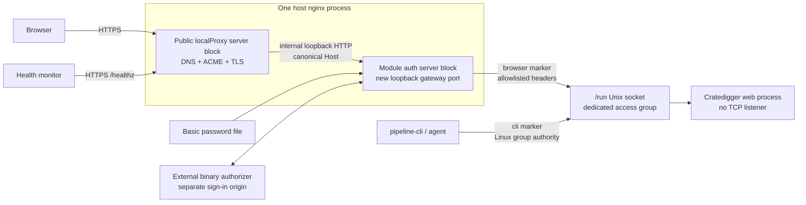
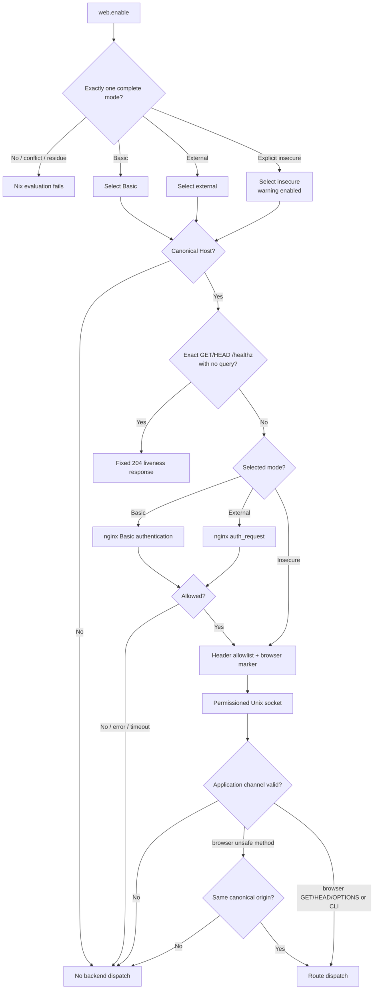

# Web Authentication Perimeter - Plan

## Goal Capsule

Close CD-SEC-02 within issue
[#663](https://github.com/abl030/cratedigger/issues/663) by putting the complete
Cratedigger web surface behind a fail-closed authentication perimeter. The
NixOS module supplies Basic Auth as the minimum secure mode, composes with an
operator-managed binary external authorizer for OIDC-backed access, and refuses
to expose the site unless one secure mode or the explicit insecure escape hatch
is selected.

The implementation keeps authentication outside Cratedigger. The existing
public homelab proxy continues to own DNS, ACME, and TLS; a module-owned
loopback nginx gateway owns authentication and browser request classification;
and the Python application accepts production traffic only through a
permissioned Unix socket. The five API-backed `pipeline-cli` mutations use that
same socket and canonical route behavior under Linux group authority.

This is one coordinated security change rather than a web rewrite. It includes
the application request-security envelope, Unix transport, CLI adapter,
module-owned nginx configuration, deterministic and generated proof, the real
NixOS VM boundary, the unobtrusive insecure footer, documentation, downstream
Basic configuration, deployment, and live verification.

The only execution-time input not contained in the repository is the initial
operator-selected Basic credential. It must be provisioned as a sops-managed
`htpasswd` file before the downstream pin can deploy. Standing up an OIDC
provider or authorization proxy remains separate work; external mode is
qualified with a real local authorizer fixture rather than deployed on doc2 in
this workstream.

**Secondary target repository:** `nixosconfig`. Entries explicitly labeled
“In `nixosconfig`” use paths relative to that repository.

**Product Contract preservation:** clarified actors, flows, and
implementation-facing acceptance detail without changing product scope;
R1-R16, F1-F6, and AE1-AE9 remain stable.

---

## Product Contract

### Summary

The implementation inserts a module-owned authentication gateway in front of a
Unix-only web backend, while preserving the existing public DNS/TLS proxy and
canonical API behavior. It covers Basic, external, and deliberate insecure
modes without making Cratedigger an identity or credential system.

### Problem Frame

The current web service has no identity, credential, or request-origin
boundary. It binds its Python HTTP server on every interface, permits wildcard
CORS, and exposes destructive archival actions to any device that can reach the
service or to a malicious page using the operator's authenticated browser as a
request relay.

Cratedigger is a single-operator archival tool, so it does not need accounts,
roles, or a permission model. It does need to prove that browser requests
passed through an established authentication component, prevent direct backend
bypass, retain non-interactive local CLI access, and fail closed when the secure
boundary is absent or unhealthy.

### Key Product Decisions

- KD1. **Authentication remains external and binary.**
  `(session-settled: user-directed — chosen over Cratedigger-owned passwords, sessions, tokens, or identity-aware authorization: established components answer only allow or deny.)`
  Governs R3-R5.
- KD2. **Basic Auth is the module-owned minimum and external authorization is
  the OIDC-compatible alternative.**
  `(session-settled: user-directed — chosen over Basic-only, OIDC-only, Tailscale-only, or client-certificate-only support: Basic is the smallest portable secure baseline while external OIDC is the intended richer deployment.)`
  Governs R2-R4.
- KD3. **Secure modes are mutually exclusive and protect the whole site.**
  `(session-settled: user-directed — chosen over Basic fallback and mutation-only protection: a fallback would bypass OIDC policy and a partial gate would leave metadata exposed.)`
  Governs R2 and R6-R7.
- KD4. **Local CLI authority comes from Linux permissions.**
  `(session-settled: user-approved — chosen over interactive browser credentials or a duplicate direct service path: agents and automation remain passwordless while using canonical API behavior.)`
  Governs R12-R13.
- KD5. **Insecure mode is deliberate but gently visible.**
  `(session-settled: user-directed — chosen over refusing all test use or showing a disruptive warning: the operator expects to use the escape hatch and wants a persistent nudge rather than harassment.)`
  Governs R14-R16.

### Actors

- A1. **Operator/installer:** Configures one web mode, supplies any required
  external secret or authorization service, and uses Cratedigger from browsers.
- A2. **Public TLS proxy:** The existing downstream `localProxy` vhost owns
  public DNS, ACME, TLS termination, and forwarding to the loopback gateway.
- A3. **Module-owned authentication gateway:** Enforces Basic Auth or delegates
  one authorization decision before forwarding a classified browser request.
- A4. **External authorization service:** Owns OIDC providers, redirects,
  callbacks, cookies, tokens, login, and logout, then returns a binary
  authorization result.
- A5. **Local CLI or agent:** Uses Linux-granted socket authority to call the
  same canonical API behavior without a browser login.
- A6. **Health monitor:** Checks a non-sensitive liveness surface without
  receiving operator credentials.

### Requirements

#### Mode selection and authentication ownership

- R1. A production web service must not expose the application unless Basic
  Auth, external authorization, or explicit insecure mode is completely
  configured.
- R2. Basic Auth, external authorization, and insecure operation are mutually
  exclusive modes; missing, conflicting, or incomplete configuration must fail
  closed before an unprotected site becomes reachable.
- R3. Basic mode must be fully wired by the NixOS module through the
  browser-facing HTTPS proxy chain using an operator-supplied password file,
  and Cratedigger must never receive or verify the username or password.
- R4. External mode must delegate to one operator-supplied binary authorization
  service; that service owns the complete OIDC lifecycle and any denial, error,
  timeout, malformed response, unauthenticated HTTPS peer, or ambiguity must
  deny access.
- R5. Authenticated application behavior must receive only a trusted allow
  assertion, not a username, email, group, role, access token, refresh token, or
  provider session.

#### Protected browser surface

- R6. Authentication must cover the SPA, static assets, read APIs, route
  discovery, and mutation APIs; the minimal liveness surface in R7 is the only
  unauthenticated Cratedigger route.
- R7. The unauthenticated liveness surface must reveal only whether the web
  process can serve requests and must expose no collection, request,
  configuration, dependency, version, route, or error detail.
- R8. A network client or unprivileged co-resident service must not reach
  authenticated application behavior by calling the backend directly or by
  supplying forged proxy headers.
- R9. Cratedigger must remove wildcard CORS, deny cross-origin framing, mark
  application resources as same-origin, and provide no cross-origin browser
  API contract.
- R10. Every browser-facing mutation must reject a missing or mismatched
  same-origin `Origin`/`Referer` signal before application dispatch, while the
  Linux-authorized local CLI path remains usable without browser headers.
- R11. Confirmation words and flags remain secondary intent checks and must
  never substitute for authentication or same-origin validation.

#### Local operator and agent access

- R12. `pipeline-cli` must remain non-interactive for authorized local
  operators, agents, scripts, and systemd services, with Linux permissions
  deciding access.
- R13. API-backed CLI commands must continue through the canonical API behavior
  without a direct database or duplicate service fallback, and an unauthorized
  local user must not gain the CLI's trusted channel.

#### Explicit insecure operation

- R14. Insecure operation must require the explicit
  `web.enableInsecure = true` decision and must never be inferred from address,
  hostname, environment, development state, or missing auth configuration.
- R15. Every insecure-mode startup must emit a prominent log warning, and every
  rendered page must carry a small persistent notice at the bottom of the UI
  reading “Authentication is disabled for this Cratedigger instance.” without
  an overlay, modal, repeated prompt, or dismissal flow.
- R16. Insecure mode bypasses browser authentication only; CORS removal,
  browser mutation provenance, destructive confirmation, input validation, and
  canonical service authority remain enforced.

### Key Flows

- F1. **Basic Auth startup and use:** the installer selects Basic mode and
  supplies a password file; module evaluation validates the exclusive complete
  configuration; the outer TLS proxy forwards to the loopback gateway; nginx
  challenges the browser; and only valid credentials reach the application.
  Covers R1-R3, R5-R6, and R8.
- F2. **OIDC-backed external authorization:** the installer selects external
  mode and supplies an authorization endpoint plus an operator-owned sign-in
  URL; nginx delegates the request; the external service owns any OIDC
  interaction; and nginx forwards only an unambiguous allow result without
  identity or token data. Covers R1-R2, R4-R6, and R8.
- F3. **Browser mutation defense:** an authenticated browser request is marked
  by the gateway, its same-origin provenance is validated before its body or
  route is touched, and ordinary input and confirmation checks run only after
  that security gate. Covers R9-R11.
- F4. **Local CLI mutation:** an authorized local user invokes an API-backed
  command; filesystem permissions permit the Unix-socket connection; the CLI
  marks the request as local; and the canonical route result maps back to the
  existing exit-code contract. Covers R10 and R12-R13.
- F5. **Deliberate insecure test use:** the installer explicitly enables
  insecure mode; the gateway remains in place without browser authentication;
  startup logs the decision; and the SPA renders its footer notice while
  retaining every non-authentication security check. Covers R2 and R14-R16.
- F6. **Unauthenticated monitoring:** a monitor requests the exact liveness
  route through the canonical hostname; authentication is bypassed only for
  that method/path pair; and, after successful service startup, the probe
  executes a constant response without querying a dependency. Covers R6-R7.

### Acceptance Examples

- AE1. **Missing mode fails closed.** With web enablement and no auth mode or
  insecure opt-in, module evaluation fails and no site becomes reachable.
  Covers R1-R2.
- AE2. **Basic protects the complete site.** Missing or invalid credentials
  cannot fetch the SPA, assets, read APIs, route index, or mutations; valid
  credentials can; and the application never receives the Basic credential.
  Covers R2-R3, R5-R6.
- AE3. **External authorization has no fallback.** An allow result reaches the
  site; denial, unavailability, timeout, malformed HTTP, redirects, and
  unexpected error responses do not dispatch the backend or fall back to
  Basic. Covers R2 and R4-R6.
- AE4. **Conflicting modes fail evaluation.** Basic plus external, either
  secure mode plus insecure, and all three together are rejected rather than
  ordered implicitly. Covers R2.
- AE5. **Forged headers do not create authority.** Browser-supplied internal,
  identity, token, forwarded, or authorization headers are overwritten or
  removed, and a caller without Unix-socket permission cannot reach
  application behavior directly. Covers R5 and R8.
- AE6. **Cross-origin mutation is inert.** An authenticated browser's missing,
  null, malformed, or mismatched provenance is rejected before body parsing,
  handler dispatch, service calls, or mutation of PostgreSQL, Beets, audit, or
  filesystem state. Covers R9-R11.
- AE7. **Authorized CLI remains non-interactive.** Every API-backed mutation
  retains its method, payload, response, exit status, no-redirect behavior, and
  pre-database short circuit over the socket; an unrelated OS user fails before
  route dispatch and receives no TCP or direct-DB fallback. Covers R10 and
  R12-R13.
- AE8. **Liveness is the sole anonymous route.** The exact GET/HEAD liveness
  application response is a bare 204 with no body or application metadata and
  performs no dependency access after service startup; public-chain proof
  compares only stable semantic fields while every other route and method
  remains gated. Covers R6-R7.
- AE9. **Insecure is explicit and visible, not weakened.** Explicit insecure
  mode starts with the log and footer warnings, but a cross-origin mutation,
  forged request channel, or wildcard-CORS probe still fails. Covers R14-R16.

### Success Criteria

- No browser-accessible application route is unauthenticated except the exact
  liveness contract.
- The Python application has no production TCP listener and cannot be reached
  by an OS identity outside the dedicated local web-access group.
- Neither Cratedigger nor its module implements a password database, session
  lifecycle, OIDC protocol flow, account model, identity propagation, or
  permission model.
- Basic, external, insecure, direct-backend, forged-header, browser-relay,
  local-CLI, and health-probe worlds produce the contract's allow or deny
  result through real nginx and OS-permission boundaries.
- Existing same-origin UI behavior and all five API-backed CLI actions remain
  usable through their respective authorized paths.
- The deployed doc2 configuration uses Basic mode, while external mode is
  independently qualified against a real local authorization fixture.

### Scope Boundaries

#### In scope

- A module-owned loopback nginx gateway with Basic Auth and generic external
  `auth_request` modes.
- Exclusive fail-closed mode selection and the explicit insecure escape hatch.
- A systemd-owned Unix backend socket and a dedicated nginx/operator access
  group that is distinct from secret-bearing Cratedigger groups.
- Whole-site protection, strict Host handling, backend header allowlisting,
  direct-backend bypass prevention, CORS removal, and browser mutation
  provenance.
- Unix HTTP transport for the five existing API-backed CLI mutation adapters.
- A minimal liveness route and an unobtrusive insecure-mode footer.
- Real module evaluation, nginx, external-authorizer, Unix-permission,
  deterministic, generated, UI, downstream, and live-deployment proof.

#### Deferred to Follow-Up Work

- Provisioning an OIDC provider or authorization proxy for doc2.
- First-class packaging for a particular provider such as OAuth2 Proxy,
  Authelia, Authentik, Cloudflare Access, or Tailscale.
- Moving CLI families that currently use PostgreSQL, filesystem, Beets, or
  secret authority onto the web API.
- Rate limiting, multi-user audit attribution, and public-internet exposure
  profiles.

#### Out of scope

- Cratedigger accounts, users, roles, permissions, identity attribution, or
  user-scoped audit history.
- Built-in passwords, sessions, cookies, bearer tokens, passkeys, WebAuthn,
  OAuth, OIDC, logout, recovery, or credential administration.
- Basic Auth as an external-mode fallback or any stacked authentication policy.
- A web framework rewrite, new frontend build system, or second API mutation
  implementation.
- A general redesign of downstream `homelab.localProxy`; its Cratedigger entry
  remains the DNS/TLS owner and changes only its upstream to the new gateway
  port.
- A turnkey authentication framework for non-NixOS launch methods; those
  operators must supply an equivalent trusted gateway or deliberately choose
  insecure operation.

### Dependencies

- The downstream public proxy preserves the canonical `Host` and terminates TLS
  before forwarding over host loopback.
- The operator supplies a bcrypt-capable `htpasswd` file outside the Nix store
  and grants nginx read access without exposing the file to Cratedigger.
- An external authorizer can provide request-time HTTP allow/deny decisions and
  host its login/callback lifecycle on an operator-owned origin.
- Linux users intended to run API-backed CLI mutations can be added explicitly
  to the dedicated local web-access group.

### Sources

- [Issue #663](https://github.com/abl030/cratedigger/issues/663) — CD-SEC-02
  remediation authority.
- `docs/security-audit-2026-07-12.md` — confirmed LAN/browser-relay attack
  paths and remediation boundary.
- `web/server.py`, `web/routes/imports.py`, and `scripts/web_dev_server.py` —
  current unauthenticated dispatch and wildcard-CORS surfaces.
- `scripts/pipeline_cli/api_mutations.py`,
  `scripts/pipeline_cli/routes_meta.py`, and `scripts/pipeline_cli/cli.py` —
  canonical API-backed CLI contract and early dispatch.
- `nix/module.nix`, `nix/tests/module-vm.nix`, and `tests/test_nix_module.py` —
  current web listener, wrapper, service, and Nix proof surfaces.
- In `nixosconfig`, `modules/nixos/services/cratedigger.nix` and
  `modules/nixos/services/local_proxy.nix` own the downstream service, secret,
  DNS, ACME, TLS, and public proxy boundary.
- [NGINX Basic Authentication](https://nginx.org/en/docs/http/ngx_http_auth_basic_module.html)
  and [RFC 7617](https://datatracker.ietf.org/doc/html/rfc7617) — external
  password verification and HTTPS requirement.
- [NGINX `auth_request`](https://nginx.org/en/docs/http/ngx_http_auth_request_module.html)
  and [proxy request-header controls](https://nginx.org/en/docs/http/ngx_http_proxy_module.html)
  — binary external authorization and credential/header isolation.
- [OAuth2 Proxy nginx integration](https://oauth2-proxy.github.io/oauth2-proxy/configuration/integrations/nginx/)
  — current sign-in redirect and auth-subrequest behavior.
- [OWASP CSRF guidance](https://cheatsheetseries.owasp.org/cheatsheets/Cross-Site_Request_Forgery_Prevention_Cheat_Sheet.html)
  and [NGINX request routing](https://nginx.org/en/docs/http/request_processing.html)
  — canonical-origin and Host validation.
- [systemd socket units](https://www.freedesktop.org/software/systemd/man/latest/systemd.socket.html)
  and [Python `socketserver`](https://docs.python.org/3/library/socketserver.html)
  — Unix-socket ownership, activation, and threaded serving.

---

## Planning Contract

### Key Technical Decisions

- KTD1. Preserve the confirmed two-tier proxy topology. The downstream
  `localProxy` vhost continues to own `music.ablz.au`, DNS, ACME, and TLS. The
  Cratedigger module adds a loopback-only authentication server block on a new
  `web.gatewayPort` that is distinct from the legacy Python port; downstream
  changes only the Cratedigger host entry's upstream port. Both server blocks
  run in the same host nginx process, so separation is configuration- and
  listener-based rather than process isolation. No `local_proxy.nix` feature
  change is needed.
  `(session-settled: user-approved — chosen over moving the public vhost into the Cratedigger module: this preserves the existing homelab DNS/TLS boundary without a general proxy refactor.)`
  Governs R3, R6, and R8.
- KTD2. Preserve the user-facing `web.enableInsecure` decision and infer no mode
  from missing settings. Add `web.hostName`, nullable `web.basicAuthFile`, and
  an explicitly enabled external-auth submodule containing a validated
  authorization URL and separate-origin sign-in URL. Assertions require
  exactly one of Basic, complete external, or insecure whenever `web.enable`
  is true and reject inactive-mode residue as well as pairwise conflicts. The
  password-file option is an absolute runtime string, not a Nix path value;
  store paths reject. External authorization permits HTTPS or explicitly local
  HTTP only, while sign-in is HTTPS on the separate configured origin. Remote
  HTTPS authorization enables upstream certificate verification, SNI, hostname
  matching, and an explicit trusted CA; plaintext HTTP requires an exact
  literal IPv4 or IPv6 loopback endpoint.
  Governs R1-R4 and R14.
- KTD3. Make a systemd-owned AF_UNIX socket the only production application
  listener. A declarative runtime-directory rule owns the socket parent as
  `root:<dedicated-group>` with mode `0750`; the socket unit separately owns
  the node and its `0660` mode. The web service explicitly requires and orders
  after its socket, so direct service start activates the same socket or fails
  without inventing a listener. Add nginx, the Cratedigger service user, and
  only explicitly configured operators to the new group; never add nginx to
  `cratedigger-ops`, `beets-library`, `users`, or another group that carries
  unrelated secret or media authority. Membership grants arbitrary HTTP access
  to the complete API and the `cli` channel, not merely permission to execute
  five wrapper commands. Governs R8 and R12-R13.
- KTD4. Classify trusted requests with
  `X-Cratedigger-Request-Channel: browser|cli` only after transport authority is
  established. The gateway discards any client value and writes `browser`; the
  Unix CLI writes `cli`; the application rejects missing or unknown values
  before route dispatch. An authorized socket member can write `cli` because
  that group membership is the local authority; the header alone is never
  authentication. Governs R8, R10, and R12-R13.
- KTD5. Treat the gateway-to-application request as a fresh allowlisted
  request, not a forwarded browser request. Disable wholesale request-header
  forwarding and reconstruct an exact set: canonical Host, one validated
  content length/type, `Accept`, `Range`, `Origin`, `Referer`, and the
  overwritten request channel. Never relay client `Transfer-Encoding`,
  `Connection`, `Upgrade`, `TE`, `Trailer`, `Expect`, connection-nominated
  fields, Basic credentials, cookies, tokens, identity/group fields, forwarded
  identity, or a client-supplied internal marker. Ambiguous or conflicting
  framing/authority headers reject at the edge and close the connection.
  Application responses deny framing with CSP `frame-ancestors 'none'` plus
  `X-Frame-Options: DENY`, and mark application, static, API, and audio
  resources `Cross-Origin-Resource-Policy: same-origin`. Governs R3, R5, and
  R8-R10.
- KTD6. Use an exact canonical public origin computed from the configured HTTPS
  hostname in Basic, external, and insecure modes, never from `Host`,
  `X-Forwarded-Host`, or another request header. For every browser method
  outside the explicit safe set, a pure
  request-security helper parses and compares scheme, normalized host, and
  effective port; rejects `null`, malformed, multiple, userinfo-bearing, or
  mismatched values; validates every supplied signal; and requires at least one
  valid `Origin` or `Referer`. It runs before body reads, route lookup, service
  calls, or error-triggered DB reconnect work. A route/method audit prevents a
  state-changing GET/HEAD/OPTIONS or future unsafe method from escaping this
  policy. Governs R8-R11.
- KTD7. Give the loopback gateway two server blocks on the dedicated port: an
  exact configured hostname and a default reject server on IPv4 and IPv6
  loopback. Redirects and return targets use the configured public origin or a
  validated relative request URI, never a request-derived host. This makes DNS
  rebinding, IP-literal access, and forwarded-host spoofing fail before auth or
  dispatch. Governs R3-R4 and R8.
- KTD8. Implement external mode with one internal, bodyless nginx
  `auth_request` subrequest. Any documented 2xx authorizer response allows;
  401/403 denies; redirects, other statuses, malformed HTTP, disconnects,
  timeouts, and unavailability fail closed. Browser document requests may
  redirect from a 401 only for exact GET/HEAD requests to the canonical SPA
  root `/`; static assets, API routes, and every other method/path retain their
  non-HTML denial regardless of `Accept` or Fetch Metadata. Callback and
  provider routes remain on the separate auth-service origin. The authorizer
  receives a fixed documented request set: method, configured public origin,
  and a validated relative path/query plus only the credentials/cookies needed
  for its decision. Remote HTTPS subrequests verify the certificate chain and
  hostname with SNI against the configured trusted CA.
  Browser login redirects use one percent-encoded return URL derived from that
  configured origin and validated relative target; protocol-relative,
  backslash/control-bearing, fragmented, nested-absolute, or duplicate-return
  targets reject.
  `(session-settled: user-approved — chosen over unauthenticated same-host callback routes: liveness remains the only anonymous Cratedigger-host route.)`
  The generic auth subrequest relays no authorizer cookie or identity response
  header; the external service sets and refreshes its browser cookie through
  its own origin. No cookie is ever sent to Cratedigger. Governs R4-R6.
- KTD9. Implement `/healthz` as the only unauthenticated Cratedigger route:
  exact GET/HEAD with no query, a bare 204 with no body or `Content-Length`, no
  per-request database/cache/mirror/Beets access, no
  product/version/error payload, and no ordinary Python server metadata.
  Nginx proxies a fixed `/healthz` target, never an alternate raw URI.
  Application-level proof pins that deterministic response; public-chain proof
  compares stable status/body/application metadata while permitting
  transport-generated headers such as `Date`. Canonical Host enforcement still
  applies, and encoded separators, dot segments, duplicate slashes,
  absolute-form targets, and every other method/path stay gated. The web
  service may still require migration and dependencies to start; liveness is
  not readiness. Governs R6-R7.
- KTD10. Add Unix HTTP transport inside the existing API mutation adapter,
  preserving `_relay`, JSON validation, timeouts, `_NoRedirectHandler`
  semantics for explicit TCP development, route payloads, status-to-exit
  mapping, and the early return before database/mirror setup. The installed
  wrapper selects a non-overridable socket endpoint; a later CLI argument
  cannot replace it. Explicit `--api-base` remains available only when invoking
  the standalone development entry point and is never a production fallback.
  Other CLI families retain their present PostgreSQL, filesystem, Beets, and
  secret boundaries.
  `(session-settled: user-approved — chosen over migrating the whole CLI onto the web API: this work secures the existing API-backed mutations without redesigning unrelated operator authority.)`
  Governs R12-R13.
- KTD11. Keep insecure mode behind the same loopback gateway, Unix backend,
  request-channel overwrite, Host gate, header allowlist, CORS removal, and
  browser provenance checks using the same configured HTTPS canonical origin
  as the secure modes. It disables only the browser auth directive, passes an
  explicit render/startup flag to the app, logs at CRITICAL on every start, and
  exposes a static non-dismissible footer in normal document flow. Governs
  R14-R16.
- KTD12. Qualify policy at three independent layers: pure deterministic and
  generated origin/channel properties; real HTTP and AF_UNIX adapter tests
  with dispatch spies; and the real NixOS nginx/systemd boundary with mode
  switching, a raw-fault external authorizer, a recording backend, and distinct
  OS users. The downstream preflight additionally evaluates the combined
  public/gateway server blocks from the exact nixosconfig candidate.
  Source-text assertions alone are not sufficient security proof.
  Governs all requirements and acceptance examples.
- KTD13. Deploy Basic mode on doc2 in this workstream and treat external mode
  as implementation-, VM-, and documentation-complete but not live-configured.
  `(session-settled: user-approved — chosen over provisioning an OIDC provider inside this project: no provider exists today and provider operation remains explicitly out of scope.)`
  Governs R2-R4 and the U6 rollout.
- KTD14. Use a staged fail-closed cutover. First preposition and validate the
  runtime Basic secret and close only the public Cratedigger vhost through a
  signed downstream generation. Then deploy the candidate source, auth
  configuration, and new gateway port together; temporary denial/unavailability
  is acceptable, anonymous application success is not. A failed new nginx
  reload must never leave the legacy unauthenticated vhost serving.
  Governs R1-R3, R8, and the U6 rollout/rollback.

### High-Level Technical Design

These sketches define the security relationships and order of decisions, not
exact implementation signatures.

#### Component and authority topology



The public server block has no UDS location and dials only the distinct
loopback gateway listener. This is a reviewed nginx-configuration boundary, not
process isolation. The gateway and authorized socket-group members can reach
the complete application API; no general LAN client or unrelated local service
can.

#### Mode selection and request admission



#### Authenticated browser mutation sequence

```mermaid
sequenceDiagram
    participant B as Browser
    participant O as Public TLS proxy
    participant N as Module nginx gateway
    participant A as External auth service
    participant W as Cratedigger web
    participant S as Canonical service

    B->>O: POST with browser credentials/cookies and Origin
    O->>N: Loopback request with canonical Host
    opt external mode
        N->>A: Internal bodyless authorization subrequest
        A-->>N: Binary allow or deny
    end
    alt denied, ambiguous, or unavailable
        N-->>B: Challenge/denial; no application request
    else allowed
        N->>N: Drop credentials, cookies, identity, and client markers
        N->>W: Allowlisted request with browser marker
        W->>W: Validate channel and every supplied origin signal
        alt missing or mismatched provenance
            W-->>B: Denial before body/route/service dispatch
        else same origin
            W->>S: Existing canonical mutation
            S-->>W: Existing result
            W-->>B: Existing JSON/status contract
        end
    end
```

#### Local CLI mutation sequence

```mermaid
sequenceDiagram
    participant U as Authorized OS user
    participant C as pipeline-cli
    participant K as Unix socket permissions
    participant W as Cratedigger web
    participant S as Canonical service

    U->>C: Existing non-interactive command
    C->>K: HTTP POST over AF_UNIX with cli marker
    alt user lacks socket group
        K-->>C: Permission denied; no fallback
    else authorized
        K->>W: Request reaches handler
        W->>W: Validate cli channel; browser provenance not required
        W->>S: Same canonical mutation as browser
        S-->>W: Existing service result
        W-->>C: Existing HTTP JSON/status contract
        C->>C: Map status to existing exit code
    end
```

### System-Wide Impact

- **Web process:** replaces its production all-interface listener with inherited
  AF_UNIX serving, adds a pre-dispatch request-security gate and exact liveness
  path, removes wildcard CORS, and conditionally renders the insecure footer.
- **Nginx:** gains loopback-only Cratedigger gateway and reject vhosts,
  mutually exclusive Basic/external/insecure policy, explicit external-auth
  subrequest plumbing, and a backend header allowlist.
- **Systemd/users:** gains a socket unit and a dedicated local web-access group;
  nginx receives only that group, not Cratedigger's existing secret-bearing
  groups.
- **CLI:** the five API-backed mutations use Unix HTTP in production; all other
  command families and their resource-specific authority remain unchanged.
- **Frontend/dev tooling:** the SPA gains one static footer and the read-only
  dev server gains an explicit warning-preview path; no JavaScript framework or
  build step is introduced.
- **Downstream NixOS:** adds a hostname, Basic password-file secret, operator
  membership in the dedicated socket group, and a new gateway upstream port.
  Its current `localProxy` entry remains the public TLS owner.
- **Persistence/domain behavior:** no migration, PostgreSQL schema, Beets
  operation, request status, archival policy, route payload, or service result
  changes.

### Risks and Mitigations

- **The two server blocks share one nginx process and can merge or bypass each
  other through configuration.** Give them unique vhost keys and listeners,
  keep the public block free of any UDS location, pin canonical Host/origin,
  and qualify the combined evaluated downstream nginx configuration.
- **Adding nginx to an existing operator group could expose unrelated
  secrets.** Create a new socket-only group and assert nginx is absent from
  `cratedigger-ops`, `beets-library`, and the service's broader media group.
- **Socket-group membership is complete local API authority.** Keep membership
  explicit and minimal, audit supplementary groups for every service identity,
  and document that compromise of nginx or any member compromises this
  perimeter.
- **Basic credentials or OIDC cookies can leak through nginx defaults.**
  Disable wholesale backend request-header forwarding, add back only the
  reviewed application allowlist, and prove captured upstream headers in the
  VM.
- **Ambiguous request framing can be interpreted differently by the public
  block, gateway, and Python parser.** Reconstruct one content length, drop all
  hop-by-hop/framing headers, reject duplicates and CL+TE ambiguity, close the
  connection on rejection, and qualify raw requests with zero backend
  dispatch.
- **An auth subrequest redirect can accidentally become fail-open or return
  login HTML to API clients.** Treat only documented 2xx as allow; keep sign-in
  redirect handling outside the subrequest and limited to browser document
  requests; pin denial/error/timeout matrices against a real fixture.
- **Socket activation can regress threading, HTTP/1.1, cleanup, or boot
  ordering.** Adopt exactly one systemd fd, retain `daemon_threads` and
  per-connection handle cleanup, reject missing/extra/non-Unix fds, and run
  concurrency, keep-alive, shutdown, restart, and migration-order tests over a
  real socket.
- **The request-channel header can be mistaken for authentication.** Require
  the protected Unix transport first, overwrite the browser value in nginx,
  require the CLI value from the socket-authorized client, reject missing or
  unknown values, and qualify forged inbound headers.
- **Privacy tools can omit browser provenance.** Fail closed as required; keep
  the local CLI channel independent, document the browser requirement, and
  avoid adding a weaker cookie or Fetch-Metadata fallback.
- **The liveness exception can expand accidentally.** Use an exact
  normalized method/path/no-query contract in both nginx and the application,
  proxy a fixed upstream target, keep it outside route registries, and test raw
  URI normalization variants plus every registered route anonymously.
- **The footer can become intrusive or disappear after SPA changes.** Keep it
  static, semantic, non-dismissible, and in document flow; assert secure versus
  insecure rendering and inspect desktop/mobile screenshots.
- **A new upstream assertion can make the old downstream pin unevaluable.**
  Prepare and evaluate the complete downstream hostname/Basic/secret/group
  settings against the candidate Cratedigger revision before merge. Use the
  staged KTD14 sequence: preposition the secret and close the public edge
  first, then update the source pin and matching auth configuration together
  in the final signed cutover transaction.
- **A password hash committed to the Nix store remains offline-guessable.**
  Treat the entire `htpasswd` file as secret, provision it with sops, document a
  modern bcrypt entry, and prove neither store closure nor application
  environment contains it.

### Sequencing

U1 establishes the application-level request-security contract. U2 adds the
Unix server and CLI transport that U3 will make authoritative in production.
U3 adds module options, systemd socket ownership, and nginx mode enforcement.
U4 qualifies U1-U3 against real nginx and OS identities before any downstream
configuration can rely on them. U5 adds the insecure-mode presentation and
visual proof without weakening the security envelope. U6 updates the
documentation and downstream deployment only after U1-U5 are coherent.

U1-U5 land together in one Cratedigger implementation PR because a partial
merge would either expose an unclassified backend, require auth before the
local CLI transport exists, or advertise a mode that is not actually
qualified. U6 prepositions the runtime secret and closes the public
Cratedigger edge in a signed downstream generation before the implementation
pin/configuration cutover. CD-SEC-02 is marked complete only after live proof;
issue #663 remains open if any other checklist item is still outstanding.

---

## Implementation Units

### U1. Establish the application request-security envelope

**Outcome:** every application request is classified before ordinary dispatch;
browser mutations require exact same-origin provenance; the liveness exception
is minimal; and no production or dev response advertises wildcard CORS.

**Requirements:** R5-R11 and R16.  
**Acceptance:** AE5-AE6, AE8-AE9.

**Primary files**

- Add `web/request_security.py`.
- Update `web/server.py` and `web/routes/imports.py`.
- Update `scripts/web_dev_server.py`.
- Update `tests/web/_harness.py`,
  `tests/web/test_server_endpoints.py`,
  `tests/web/test_server_threading.py`,
  `tests/web/test_routes_imports.py`, and
  `tests/test_web_dev_server.py`.
- Add `tests/web/test_request_security.py` and
  `tests/test_web_request_security_generated.py`.

**Contract**

- `web.request_security` owns pure parsing and decisions; route modules do not
  reimplement origin or request-channel logic.
- The handler recognizes only the exact `browser` and `cli` channels.
  Missing/unknown values fail before route lookup. The liveness method/path is
  the sole intentional pre-channel exception.
- Every browser method outside the explicit GET/HEAD/OPTIONS safe set supplies
  at least one `Origin` or `Referer`; every supplied signal must parse to the
  configured canonical origin. Default-port equivalence is normalized, while
  `null`, credentials, multiple values, malformed values, and
  prefix/suffix-confusable hosts reject. A route audit proves the safe methods
  have no mutation registration.
- Rejection happens before `_read_post_body`, handler selection, DB reconnect,
  service execution, filesystem access, or audit writes.
- `_json`, `do_OPTIONS`, wrong-match audio success/range errors, and the dev
  server emit no `Access-Control-Allow-*` contract.
- `/healthz` handles only GET/HEAD with no query, returns a bare 204 with no
  body or `Content-Length`, uses no route registry or per-request dependency,
  and suppresses the stdlib Server/version response path.

**Implementation steps**

1. Write deterministic pins for exact-origin, Referer fallback, conflicting
   signals, default ports, malformed/null/multiple values, unknown channels,
   and pre-dispatch rejection using body/route/service spies.
2. Add a generated strategy over methods, schemes, host casing, ports,
   userinfo, serialized headers, and channel values. Pair it with a named
   deterministic example and a known-bad checker self-test that proves
   mismatched-origin, missing-provenance, and future-unsafe-method mutants are
   killed.
3. Implement the pure decision helper and one central handler gate used by all
   POST routes, including the cache-invalidation compatibility route.
4. Add the exact liveness GET/HEAD/no-query short circuit before ordinary GET
   dispatch. Pin the application-controlled status/body/metadata,
   per-request dependency non-use,
   encoded-separator/dot-segment/duplicate-slash rejection, and the distinction
   between liveness and startup readiness; public-chain assertions compare only
   stable fields and tolerate transport-generated headers.
5. Remove wildcard CORS from the central JSON writer, OPTIONS, wrong-match
   audio 200/206/416 responses, and every dev-server response. Update tests to
   assert absence rather than substitute a restrictive wildcard.
6. Make the shared route harness send production-shaped browser classification
   and canonical origin by default, while targeted tests can omit or corrupt
   either signal. Audit raw POST tests outside the harness so they cannot
   silently exercise an impossible production request.
7. Add a method/route inventory assertion that GET, HEAD, and OPTIONS own no
   mutation registration and that every other method enters the provenance
   gate before route lookup.
8. Fault-inject origin-derived-from-Host, first-signal-only validation,
   post-body validation, unknown-channel acceptance, and one surviving CORS
   header. Record the named tests that kill each mutant.

**Verification outcome**

The deterministic and generated suites prove every rejected browser world has
zero dispatch, while existing same-origin route tests remain behaviorally
unchanged and no response surface advertises cross-origin access.

### U2. Replace the production TCP backend with Unix HTTP and preserve CLI parity

**Outcome:** the web process can serve its existing threaded HTTP/1.1 handler
from exactly one systemd-provided Unix fd, and every API-backed CLI mutation
uses that socket without acquiring a fallback path.

**Requirements:** R8 and R12-R13.  
**Acceptance:** AE5 and AE7.
**Approach:** KTD10.

**Primary files**

- Update `web/server.py`.
- Update `scripts/pipeline_cli/api_mutations.py`,
  `scripts/pipeline_cli/routes_meta.py`, and
  `scripts/pipeline_cli/cli.py`.
- Update `tests/web/test_server_threading.py`,
  `tests/test_no_dual_load.py`,
  `tests/test_pipeline_cli_api_mutations.py`, and
  `tests/test_pipeline_cli_api_mutations_generated.py`.

**Contract**

- Production startup accepts exactly one inherited AF_UNIX stream socket and
  never calls `ThreadingHTTPServer(("0.0.0.0", ...))`.
- The Unix server retains HTTP/1.1 keep-alive, concurrent request threads,
  daemon-thread shutdown, `Handler.finish()` cleanup, and per-thread DB/Beets
  handles.
- Missing, multiple, wrong-family, or non-listening inherited fds fail startup.
  Any retained manual TCP mode is explicitly insecure, loopback-only, and never
  selected by the NixOS module.
- The Unix CLI client sends a valid HTTP/1.1 request with the `cli` marker and a
  fixed internal Host, preserves request paths/bodies/timeouts, and reads error
  bodies exactly as the current adapter does.
- Socket absence, permission denial, connection failure, timeout, and malformed
  HTTP produce the existing structured local failure and exit 5. They never
  try TCP, construct `PipelineDB`, configure mirrors, or duplicate a service.
- Explicit TCP `--api-base` remains available only for standalone development
  and the real no-redirect/replay test. The installed wrapper selects a
  non-overridable Unix endpoint in U3, so argument order cannot restore TCP.

**Implementation steps**

1. Add real AF_UNIX threading/keep-alive/shutdown tests before changing startup.
   Include restart/stale-node behavior at the systemd layer in U4 rather than
   application-owned unlink logic.
2. Implement a threaded Unix HTTP server around the inherited fd without
   invoking `HTTPServer.server_bind`, which assumes a `(host, port)` address.
   Keep the current Handler and teardown semantics.
3. Add a small Unix `HTTPConnection` transport inside `api_mutations.py` and
   thread endpoint selection through `_post`/`_relay` without changing the five
   command payload builders.
4. Add a real Unix round-trip server to
   `tests/test_pipeline_cli_api_mutations.py`. Run all five adapters through it,
   verify the `cli` marker, and retain the existing real TCP redirect test.
5. Extend the generated response/exit property across both transports without
   weakening its known-bad self-test.
6. Pin permission-denied/no-socket behavior and prove all API commands still
   return before runtime config, mirrors, and database setup.
7. Pin that a wrapper invocation cannot override its socket with a later
   `--api-base`, while the standalone entry point retains explicit development
   TCP.
8. Remove the production all-interface startup path and update boot-shape,
   no-dual-load, mock-audit, and dead-code expectations as required.

**Verification outcome**

A real Unix server preserves the current route and CLI contracts, the web
process has no production TCP bind path, and every local transport failure is
fail-closed and fallback-free.

### U3. Make the NixOS module own authentication, socket authority, and proxy isolation

**Outcome:** enabling the web module renders exactly one complete auth mode, a
dedicated systemd socket, and a loopback nginx gateway that cannot leak browser
credentials or be bypassed through the Python backend.

**Requirements:** R1-R8 and R12-R16.  
**Acceptance:** AE1-AE5 and AE7-AE9.
**Approach:** KTD1-KTD9 and KTD11.

**Primary files**

- Update `nix/module.nix`.
- Update `tests/test_nix_module.py` and `flake.nix` only where the evaluated
  module/check contract requires it.
- Update `examples/cratedigger.nix` enough for the module to remain a valid
  first-install example; full narrative documentation belongs to U6.

**Contract**

- `web.enable = false` needs no auth mode. When enabled, exactly one of a
  non-null `web.basicAuthFile`, complete enabled external auth, or
  `web.enableInsecure = true` is required.
- `web.gatewayPort` is a new loopback nginx port and does not reuse the legacy
  Python `8085` listener during the cutover. The old `web.port` production
  contract is removed rather than repurposed ambiguously.
- `web.hostName` is a non-empty canonical DNS hostname. All three modes compute
  the same HTTPS public origin from it. The Basic file is an absolute runtime
  string outside the Nix store. External URLs contain no
  whitespace/newline/nginx directive injection; authorization is verified
  HTTPS or literal-loopback HTTP, and sign-in is HTTPS on an origin distinct
  from Cratedigger. Remote HTTPS authorization requires an explicit trusted CA
  plus SNI and hostname verification.
- The fixed backend socket is systemd-owned under `/run`, with an explicit
  parent owner/group/mode, socket owner/group, and `0660` node mode. The module
  creates only that group, grants it to nginx and the service, and exposes its
  name for explicit operator membership.
- `cratedigger-web.socket` owns socket lifecycle and passes one fd to
  `cratedigger-web.service`; the service requires/orders after the socket and
  cannot start through another listener. Migration/Redis ordering and the
  existing service sandbox remain intact.
- The installed `pipeline-cli` wrapper selects the fixed Unix socket in a way
  user arguments cannot override. It does not embed Basic/OIDC credentials and
  does not change other CLI authority.
- Nginx listens only on loopback at `web.gatewayPort`. The exact-host vhost
  owns auth, fixed-target liveness, header reconstruction, browser marking, and
  Unix `proxy_pass`; a default vhost rejects every other Host.
- The gateway adds framing denial to documents and same-origin resource policy
  to application, static, API, and audio responses in all three modes.
- Basic uses `basicAuthFile`, never Nix's plaintext `basicAuth`. Liveness
  disables inherited Basic only for its exact contract.
- External mode uses one `internal` bodyless auth location, finite connect/read
  timeouts, explicit original request metadata, verified upstream identity,
  fail-closed status handling, separate browser sign-in handling, and no Basic
  fallback. Only exact GET/HEAD requests to `/` may become a sign-in redirect;
  static assets, APIs, and all other requests retain non-HTML denial.
- Insecure mode changes only the browser auth directive and passes the explicit
  warning/render flag; it retains the gateway and every other boundary.

**Implementation steps**

1. Add real `nix eval` cases for web disabled, missing mode, each valid mode,
   incomplete external configuration, inactive-mode residue, and every
   pair/triple conflict. Include store-path Basic files and
   malicious/malformed hostname and URL inputs.
2. Add all new options with descriptions so the documentation audit has no
   allowlist exception. Preserve `web.enableInsecure` exactly as the confirmed
   operator decision.
3. Provision the runtime parent with exact group ownership independently of the
   socket node, add the socket unit, and make the web service require the
   inherited-fd topology. Prove direct service start activates that socket or
   fails without a restart loop. Ensure nginx receives no existing
   secret/media group.
4. Add the distinct gateway listener and exact/default loopback vhosts. Proxy
   ordinary original URIs to the fixed Unix socket, but proxy anonymous
   liveness to a fixed `/healthz` upstream target.
5. Render Basic, external, and insecure location policy from one mode
   selection. Avoid `satisfy`, stacked directives, and fallback order.
6. Disable backend request-header forwarding and add the reviewed allowlist,
   fixed public origin/Host, and overwritten browser channel. Keep the auth
   subrequest's credential/cookie inputs separate from the application proxy,
   and add the response-side framing/resource-isolation headers.
7. Add runtime Basic-file validation to nginx activation/reload ordering:
   non-empty, restrictive, readable by nginx, unreadable by the application
   and socket users, and outside the store. Evaluation proves only option shape;
   runtime proof owns presence/readability.
8. Update the CLI wrapper contract and first-install example to use the socket,
   hostname, gateway port, and one deliberate mode.
9. Add structural assertions that no Python TCP target or trusted-loopback
   `--api-base` remains in production, without treating source text as the
   final security proof.

**Verification outcome**

Every invalid module world fails evaluation; every valid world renders one
auth policy and one protected socket; and the generated nginx/systemd
configuration forwards credentials only as documented authorizer inputs, never
to the application backend, and contains no direct Python listener.

### U4. Qualify the real nginx, external-authorizer, and OS-permission boundary

**Outcome:** the NixOS module VM proves the deployed components—not mocks or
source strings—enforce whole-site auth, fail-closed external decisions, header
isolation, canonical Host/origin, and local socket permissions.

**Requirements:** all R1-R16.  
**Acceptance:** all AE1-AE9.
**Approach:** KTD12.

**Primary files**

- Update `nix/tests/module-vm.nix`.
- Update `flake.nix` only if the existing `moduleVm` check must aggregate a
  dedicated auth fixture without changing the final gate name.
- Update `tests/test_nix_module.py` for generated-unit and option-shape audits.

**Contract**

- The existing module VM boots in Basic mode with a test-only bcrypt password
  file, `beets-operator` in the dedicated socket group, and
  `unrelated-user` outside it.
- The VM supplies a representative outer TLS/proxy server block with the same
  public-host-to-gateway relationship as downstream `localProxy`; U6's exact
  candidate evaluation remains the final combined-config proof.
- Test-only NixOS specialisations exercise external and insecure modes on the
  same module revision. The test retains the parent system path and switches
  base→external→base→insecure because sibling specialisations are not nested.
  Each transition restarts/reloads the correct socket, app, and nginx units
  without leaving stale policy.
- A raw-capable fake authorizer can return allow, 401, 403, redirect, malformed
  status/header bytes, disconnect, delay/timeout, and server error while
  recording the subrequest. It is a test fixture only.
- A test-only header-recorder service can temporarily replace the application
  `ExecStart` behind the same module-owned Unix socket, user, groups, and
  sandbox. It records dispatch counts and nginx-to-backend requests in
  root-only test state without adding a production inspection route.
- The ordinary Cratedigger app remains the backend for route, provenance,
  liveness, and CLI parity checks.

**Implementation steps**

1. Extend the VM's users/groups and configure the base system with canonical
   hostname, Basic mode, and a fixture password file.
2. Prove anonymous versus valid/invalid Basic behavior for the SPA, one static
   asset, one read route, route discovery, and a mutation. Assert the password
   file is outside the application environment and no Authorization reaches
   the recorder. Assert framing denial on documents and same-origin resource
   policy on application, static, API, and audio responses.
3. Sweep all registered application routes anonymously and allow only the
   exact liveness method/path. Assert its response is constant and performs no
   dependency access once the service has started; separately retain the
   existing migration/dependency startup contract.
4. Prove the Python process owns no TCP listener, nginx owns only the loopback
   gateway listener on the new non-legacy port, the socket parent and node
   ownership/modes are independently exact, nginx and the authorized operator
   can connect, and the unrelated user receives a filesystem denial. Stop the
   socket and start the service directly to prove no alternate listener or
   restart loop appears.
5. Run all five installed API-backed commands as the authorized operator
   without a browser credential. Run one as the unrelated user and prove no
   gateway TCP or database fallback is attempted.
6. Send spoofed Authorization, Cookie, `X-Auth-Request-*`,
   `X-Forwarded-User/Email`, bearer/token, identity/role/group, forwarded-host,
   and internal-channel headers through the public-facing gateway. Use the
   recorder to prove only the allowlist and overwritten browser marker arrive.
   Add raw duplicate/conflicting Host, Origin, Referer, Content-Length, CL+TE,
   hop-by-hop, and malformed-chunk cases; every rejection closes the connection
   with zero recorder dispatch.
7. Exercise canonical Host, attacker Host, IP-literal Host, missing Host where
   HTTP permits, and forged forwarded Host. Assert rejection happens before
   auth redirect, liveness, or backend dispatch.
8. Switch to external mode and exercise allow, 401/403, redirect, malformed
   HTTP, 5xx, timeout, disconnect, and unavailable service. Browser documents
   may redirect only for exact GET/HEAD requests to `/` and only to the
   configured external sign-in origin; assets, APIs, and all other requests
   remain non-HTML denial responses regardless of `Accept` or Fetch Metadata.
   Prove the request metadata contract is exact, login redirects cannot be
   influenced into an external target, and no authorizer cookie/header reaches
   the application. For remote HTTPS authorization, prove trusted identity
   succeeds while untrusted, wrong-name, and expired certificates plus
   non-loopback plaintext HTTP fail without backend dispatch.
9. Through real nginx, send exact Origin, exact Referer fallback, matching both,
   mismatched one, null, malformed, and missing-both browser mutations. Use a
   state/dispatch spy to prove rejected requests make zero change.
10. Switch to insecure mode and prove authentication alone is absent while
    Host, header stripping, browser marker, origin enforcement, liveness,
    socket authority, startup warning, and footer flag remain. A browser
    mutation with the configured canonical origin succeeds, while mismatched,
    missing, and IP-literal-host variants reject.
11. Probe `/healthz` with queries, encoded separators, dot segments, duplicate
    slashes, absolute-form targets, conflicting Host forms, and alternate
    methods through the outer/gateway chain. Only the canonical GET/HEAD target
    may reach the fixed liveness handler.
12. Inspect the store closure, generated config, unit environments, file
    permissions, and representative process identities with a sentinel
    fixture. The Basic hash is absent from the store/config/environment;
    nginx alone can read the runtime file.
13. Restart nginx, the socket, and the web service in representative orders;
    assert socket activation, stale-node cleanup, threaded request serving, and
    migration dependency behavior remain sound.

**Verification outcome**

`nix build .#checks.x86_64-linux.moduleVm` proves the complete allow/deny matrix
against the same nginx, systemd, Python, and user/group mechanisms deployed by
the module.

### U5. Add the unobtrusive insecure-mode warning and visual proof

**Outcome:** explicit insecure mode is visible on every SPA render without an
overlay or repeated prompt, while secure modes render no warning.

**Requirements:** R14-R16.  
**Acceptance:** AE9.

**Primary files**

- Update `web/index.html` and `web/server.py`.
- Update `scripts/web_dev_server.py`.
- Update `tests/web/test_server_endpoints.py` and
  `tests/test_web_dev_server.py`.

**Contract**

- The warning is server-selected from the explicit mode, not inferred in
  JavaScript from hostname, protocol, environment, or failed auth.
- Secure Basic/external responses contain no warning. Insecure responses
  contain exactly one semantic footer after the application sections and
  before scripts with the exact text “Authentication is disabled for this
  Cratedigger instance.”
- The footer remains in document flow, compact, readable, accessible, and
  non-dismissible. It uses a native footer landmark with ordinary non-live
  text, meets WCAG AA text contrast, and remains readable without overlap at
  200% zoom and the mobile viewport. It has no modal, overlay, close button,
  local-storage state, timer, animation, or repeated toast.
- Insecure startup logs one prominent CRITICAL message on every process start;
  secure startup does not.
- The read-only dev server has an explicit preview flag so visual verification
  does not require enabling a production bypass.

**Implementation steps**

1. Pin secure/insecure index bytes and startup logging before changing the
   template.
2. Add one static footer and minimal inline CSS consistent with the current
   no-build single-page document. Make the server's index rendering toggle only
   that known placeholder/element.
3. Add the explicit dev-preview switch and keep it compatible with the existing
   dev badge injection.
4. Run browser screenshots at representative desktop and mobile widths. Inspect
   the Browse, Recents, Pipeline, and Wrong Matches tabs with short and long
   content so the footer neither obscures controls nor floats as an overlay.
5. Add automated DOM/style assertions for presence, singularity,
   exact copy, non-live footer semantics, non-dismissible shape, and
   secure-mode absence. Add an accessibility-tree assertion and retain
   contrast/reflow screenshots as review evidence rather than brittle pixel
   fixtures.

**Verification outcome**

The warning is persistent and gently visible exactly in insecure mode, and
browser inspection confirms it does not interfere with normal archival work.

### U6. Document, configure, deploy, and close CD-SEC-02

**Outcome:** a first-time NixOS operator can choose one mode safely; doc2 deploys
Basic through the existing public TLS proxy; and issue/audit state records exact
live proof without claiming that an OIDC provider was installed.

**Requirements:** all R1-R16.  
**Acceptance:** all AE1-AE9.
**Approach:** KTD1, KTD8, KTD10, KTD13, and KTD14.

**Primary Cratedigger files**

- Update `docs/nixos-module.md`, `docs/webui-primer.md`,
  `docs/debugging-cli.md`, `examples/cratedigger.nix`, and
  `examples/README.md`.
- Update `docs/security-audit-2026-07-12.md` to describe the implemented
  perimeter and retain a visible pending-live-proof state until deployment.

**Downstream files and state**

- In `nixosconfig`, update `modules/nixos/services/cratedigger.nix`.
- Add the sops declaration and encrypted source for the operator-supplied
  `htpasswd` file through the repository's existing secret mechanism.
- Keep `modules/nixos/services/local_proxy.nix` unchanged and preserve the
  `music.ablz.au` entry's DNS/ACME/TLS ownership; only its service-specific
  upstream changes to the new gateway port.

**Contract**

- Documentation names all three exclusive modes, HTTPS requirement, external
  binary contract, remote-authorizer TLS verification and trusted-CA
  configuration, separate login origin, exact document-redirect
  classification, header/identity non-propagation, exact liveness path,
  socket-group authorization, and insecure warning.
- Documentation states that executable mode bits do not secure a Nix-store
  program. API-backed CLI authority is the dedicated socket group; other CLI
  commands retain their resource-specific PostgreSQL/filesystem/secret
  boundaries.
- Basic password creation examples use a modern `htpasswd` hash, never inline
  plaintext or a Nix-store `basicAuth` attribute. They also document atomic
  sops-backed rotation and verification that the old credential is denied
  while the replacement succeeds without logging either value.
- Downstream adds `music.ablz.au`, Basic password-file configuration, and the
  existing operator user to the dedicated web-access group, plus the new
  gateway upstream port. Nginx receives no `cratedigger-ops` membership.
- The encrypted secret declaration lands and is verified before the auth
  cutover. The source pin and required downstream auth configuration then
  change together so no generation has `web.enable` without a mode.
- Insecure mode is never deployed on doc2. External mode is documented and VM
  qualified but remains undeployed until a separate operator-managed
  authorizer exists.

**Implementation steps**

1. Update the option table, topology, Basic/external/insecure examples,
   remote-authorizer TLS/trusted-CA setup, exact redirect behavior, CLI access
   instructions, health-monitor guidance, Basic credential rotation,
   troubleshooting, and rollback notes in the upstream docs.
2. Replace the web primer's “No auth” known issue with the actual perimeter and
   same-origin behavior. Update the CLI guide's trusted-loopback note to the
   Unix socket and honest whole-CLI authority statement.
3. Provision the bcrypt `htpasswd` entry directly into sops-managed downstream
   secret state; configure its runtime file for nginx read and no application,
   socket-group, or unrelated-user access.
4. From a clean current Forgejo `master`, evaluate and build the exact doc2
   toplevel with the candidate Cratedigger commit, complete downstream diff,
   encrypted secret declaration, and combined public/gateway nginx
   configuration. Prove sops recipient/decryption, runtime permissions,
   `nginx -t`, distinct gateway-port availability, and no alternate UDS
   location.
5. Deploy a signed secret-preposition/edge-closed generation before the source
   cutover. The `music.ablz.au` certificate/DNS remain, but its application
   location returns only denial/unavailability. Verify externally that
   anonymous application content is impossible.
6. After upstream merge, make the ordinary signed nixosconfig pin/config
   transaction containing Basic, hostname, socket-group, and new gateway
   upstream settings. Deploy through the locked fleet trigger. Temporary 401
   or 503 is acceptable; anonymous 2xx or application redirects are a stop
   condition.
7. Run the live verification contract below using a predeclared non-destructive
   canary. Prove successful same-origin gate passage with validation/no-op
   behavior, never by deleting or changing an archival object.
8. Only after live proof, update the audit checklist/status and issue #663
   CD-SEC-02 record with the implementation PR, signed pin, active source,
   service invocation, route/auth/socket probes, and successor-cycle evidence.
   Land the audit update through a second documentation-only Cratedigger PR,
   run the final repository gates once on that tree, and merge it with a merge
   commit before updating the final issue status. Do not close the broader
   issue if unrelated checklist items remain open.

**Verification outcome**

The public site is Basic-protected through its existing certificate and DNS
path, local authorized CLI mutations remain non-interactive, and the repository
and issue tell the exact implemented/deployed truth.

---

## Verification Contract

### Red/green focused convergence

Write each invariant as a failing deterministic pin plus a generated property
where the input space is meaningfully combinatorial. Use `nix-shell --run` for
all Python/test commands.

```bash
nix-shell --run "python3 -m unittest tests.web.test_request_security tests.test_web_request_security_generated -v"
nix-shell --run "python3 -m unittest tests.web.test_server_endpoints tests.web.test_server_threading tests.web.test_routes_imports -v"
nix-shell --run "python3 -m unittest tests.test_pipeline_cli_api_mutations tests.test_pipeline_cli_api_mutations_generated -v"
nix-shell --run "python3 -m unittest tests.test_nix_module tests.test_web_dev_server -v"
```

After the deterministic/generated modules are green, run the randomized burst
and promote any shrunk counterexample to a named `@example` or deterministic
pin:

```bash
nix-shell --run "bash scripts/fuzz_burst.sh"
```

### Fault qualification

Before final review, exercise these uncommitted known-bad variants. Each must be
killed by a named deterministic test and, where applicable, its paired
generated property:

- accept a browser POST with neither provenance header;
- admit a future PUT/PATCH/DELETE or a state-changing safe-method route outside
  the central provenance/method inventory;
- derive the expected origin from request Host;
- validate only the first of conflicting Origin/Referer signals;
- validate provenance after body parsing or handler lookup;
- treat a missing/unknown request channel as local CLI;
- preserve one wildcard CORS header on JSON, audio, OPTIONS, or dev responses;
- let a client-supplied browser/CLI marker survive nginx;
- forward Authorization, Cookie, or one identity/token header to the backend;
- forward a hop-by-hop header, accept duplicate framing/authority fields, or
  reuse a connection after CL+TE/malformed-chunk rejection;
- add nginx to the existing `cratedigger-ops` group;
- create the socket parent as `root:root`, create the node with systemd
  defaults, or start the service without its socket dependency;
- retain the Python TCP listener or retry TCP after a Unix failure;
- allow the installed wrapper to override its Unix endpoint with `--api-base`;
- accept external-auth redirect/error/timeout as allow or fall back to Basic;
- trust an unverified, wrong-name, expired, or non-loopback-plaintext external
  authorizer;
- relay an external-authorizer cookie/header to the application or build a
  login return URL from an unvalidated request target;
- classify an API or asset request as a browser document from `Accept` or Fetch
  Metadata, or omit framing/resource-isolation response headers;
- exempt a route, query, normalized/raw URI variant, or method beyond the exact
  liveness contract;
- import the Basic hash into the Nix store or let the application/socket group
  read its runtime file;
- infer insecure mode from missing auth or suppress its startup/footer warning.

Keep only the production code and committed known-bad checker self-tests in the
final tree. Record the mutant-to-test kill matrix in the implementation PR.

### NixOS module boundary

The mandatory module gate is:

```bash
nix build .#checks.x86_64-linux.moduleVm
```

It must prove:

- missing, incomplete, residual, and conflicting mode configurations fail
  evaluation;
- Basic protects SPA/static/read/discovery/mutation routes and strips
  credentials;
- external 2xx allows while denial, redirect, malformed response, timeout,
  disconnect, untrusted/wrong-name/expired TLS identity, and unavailability
  never dispatch or fall back;
- only exact GET/HEAD requests to `/` may become a sign-in redirect; assets,
  APIs, and all other requests retain non-HTML denial regardless of client
  classification headers;
- only exact liveness is anonymous and its response is constant;
- encoded/doubled/dotted/query/absolute-form liveness variants and alternate
  methods do not reach an anonymous application route;
- canonical Host works while attacker/IP/forwarded hosts reject;
- the backend has no TCP listener, the gateway uses the distinct cutover port,
  and both public/gateway server blocks have one unambiguous owner in the
  combined configuration;
- socket owner/group/directory/node modes are exact;
- nginx and the authorized operator connect while an unrelated user cannot;
- all five installed API commands succeed without browser auth for the
  authorized operator and fail without fallback for the unrelated user;
- captured backend headers contain the allowlist/browser marker and no
  credential, cookie, identity, token, forwarded identity, or client marker;
- documents deny framing and every application/static/API/audio response
  carries the required same-origin resource policy;
- raw duplicate Host/origin/framing, CL+TE, hop-by-hop, and malformed-chunk
  requests close without backend dispatch;
- the Basic sentinel is absent from the store/config/environment and readable
  only by nginx at runtime;
- insecure mode preserves every boundary except browser authentication and
  emits both warnings; its canonical-origin mutation succeeds while missing,
  mismatched, and IP-literal variants reject.

### Browser presentation

Use the repository's web dev server and Playwright workflow to inspect the
insecure footer at desktop and mobile widths. Capture evidence for its placement
on all four tabs, confirm it remains in document flow with long content, and
confirm secure mode contains no footer. Verify the exact copy, native non-live
footer semantics, WCAG AA contrast, the accessibility tree, and overlap-free
reflow at 200% zoom and the mobile viewport. Browser inspection is required
because DOM assertions cannot establish that a persistent bottom notice is
genuinely unobtrusive.

### Independent review

After U1-U6 converge, use fresh reviewers for:

- security: proxy trust, auth failure states, header/cookie isolation, Host and
  origin parsing, filesystem authority, secret exposure, and redirects;
- correctness/reliability: socket activation, threaded HTTP lifecycle,
  timeouts, mode switching, liveness, and rollout/rollback;
- API/CLI contract: five adapters' payload/status/exit/no-redirect parity and
  absence of a database/TCP fallback;
- testing: deterministic/generated pair quality, known-bad qualification,
  recording-backend fidelity, real OS identities, and anonymous route sweep;
- maintainability/project standards: minimal new abstractions, Nix option
  descriptions, docs freshness, and no unrelated auth/provider framework.

Any review fix restarts the affected focused proof and requires review of the
new exact tree. A security-boundary change restarts the module VM gate as well.

### Final repository gates

After review and commit, run exactly once on the final tree before its first
push, in this order:

```bash
nix-shell --run "pyright --threads 4"
nix-shell --run "bash scripts/run_tests.sh"
```

A failure restarts convergence, review, commit, and the final sequence. Do not
replay the gates for an unchanged tree after push or merge.

### Landing and downstream preflight

- Open one Cratedigger implementation PR referencing CD-SEC-02 in issue #663.
  Do not use a closing keyword for the entire issue unless every remaining
  issue item is complete.
- Merge with GitHub **Create a merge commit**, never squash or rebase.
- From a clean current Forgejo `master`, build the exact doc2 toplevel with the
  candidate source, complete downstream diff, real encrypted secret
  declaration, and combined public/gateway nginx configuration.
- Preposition/decrypt the runtime secret and close the public Cratedigger edge
  through one signed locked-fleet deployment. Proceed only when secret
  permissions, free gateway port, closed edge, and candidate `nginx -t` are
  proven.
- After merge, update the source through the ordinary signed pin transaction
  and include Basic, hostname, dedicated-group, and gateway-port settings in
  the final cutover commit.
- During cutover, anonymous application 2xx or an application redirect is STOP;
  challenge/denial or temporary unavailability is safe.
- After live proof, land the audit closure through a second documentation-only
  Cratedigger PR, run the final gates once on that documentation tree, and merge
  it with a merge commit before final issue-status updates.

### Live deployment proof

On doc2, capture and retain:

- the signed nixosconfig pin and exact active Cratedigger source from the
  deployed wrappers;
- a fresh `cratedigger-web` InvocationID, active socket/nginx units, migration
  success, and nginx configuration-test success;
- `ss`/systemd proof that nginx alone listens on the new loopback gateway port,
  the legacy Python port is closed, and the backend has only the expected Unix
  listener;
- exact socket parent/node owner, group, and modes, plus a direct-service-start
  probe showing the socket remains the sole topology;
- anonymous public HTTPS results for liveness versus SPA, static, read,
  discovery, and mutation routes;
- invalid and valid Basic behavior without printing or logging the credential;
- an atomic sops-backed Basic rotation proving the old credential is denied and
  the replacement succeeds without either value appearing in output or logs;
- canonical Host versus IP/attacker/forwarded-host rejection;
- authenticated exact-Origin route passage using a predeclared nonexistent or
  validation-only canary, plus cross-origin/missing-origin rejection with
  authoritative before/after proof that request rows, audit records, Beets,
  and filesystem state are unchanged;
- authorized installed `pipeline-cli` success over the socket and an
  unrelated-user filesystem denial with no fallback;
- journal proof that insecure mode is not active and no credential/token or
  identity reaches Cratedigger;
- closure/config/environment and file-permission proof that the Basic hash is
  outside the Nix store and readable only by nginx;
- the ordinary exact-source health/migration checks and a natural successor
  `cratedigger` pipeline cycle required by the repository deploy contract.

If the password file is absent/unreadable, nginx validation/reload fails, the
legacy listener remains reachable, the socket is too broad, a protected route
is anonymous, or a rejected provenance probe dispatches, keep the public edge
closed and fix forward before marking CD-SEC-02 complete. Nix evaluation owns
mode shape; runtime preflight owns secret presence/readability.

### Rollback

- Prefer fix-forward after the new module has deployed; the old pin restores an
  unauthenticated backend and is not an acceptable steady state.
- If rollback is unavoidable, first close only the public
  `music.ablz.au` application location through the prepared downstream denial
  state and verify externally that it serves no application content.
- Deploy one signed revert transaction containing both the old Cratedigger pin
  and its matching old option set. Verify the fleet anchor, upgrade invocation,
  closed edge, and resulting service/listener state before rollback is
  considered complete.
- Reopening is a separate go decision and requires a proven authenticated
  generation; never reopen the edge onto the legacy unauthenticated listener.
- Preserve the sops `htpasswd` secret during rollback. Removing a declarative
  reference is reversible; deleting the credential material is a separate
  operator action.

---

## Definition of Done

- U1-U6 meet their verification outcomes on one coherent Cratedigger tree, a
  signed secret/edge-close generation, and the signed final cutover
  transaction.
- All R1-R16 requirements and AE1-AE9 examples map to named deterministic,
  generated, VM, browser, or live proofs.
- Module evaluation rejects no-mode, incomplete, residual, and conflicting
  configurations and accepts exactly Basic, complete external, or explicit
  insecure mode.
- The public Basic deployment protects the SPA, static assets, every read and
  mutation API, and route discovery; only exact liveness is anonymous.
- The application receives no Basic credentials, provider cookie, token,
  identity/group/role header, forwarded identity, or client-supplied internal
  marker.
- The Python web process has no production TCP listener; its systemd-owned
  socket and parent have independently exact restrictive ownership/modes; nginx
  and the authorized operator connect; an unrelated user cannot; direct service
  start cannot bypass socket activation.
- Every browser unsafe method proves exact canonical origin before body, route,
  service, database, Beets, audit, or filesystem work; the safe-method route
  inventory contains no mutation; wildcard CORS is absent from every
  production/dev/audio response; documents deny framing; and resources carry
  same-origin isolation.
- All five API-backed CLI mutations preserve canonical path/payload/result,
  status-to-exit mapping, confirmation, timeout, no-redirect/no-replay, and
  pre-database dispatch over AF_UNIX with no fallback.
- External authorization is qualified with real nginx for allow, denial,
  redirect, malformed, error, timeout, disconnect, unavailable, and invalid-TLS
  worlds; callback/login/cookie ownership remains outside Cratedigger, only the
  canonical SPA document may redirect, redirect targets are canonical and
  validated, and no Basic fallback exists.
- Insecure mode is explicit, retains every non-auth security control, emits the
  CRITICAL startup warning, uses the same canonical origin, and renders the
  exact reviewed accessible footer; it is not active on doc2.
- The generated properties' known-bad self-tests and the full fault matrix prove
  the security harness constrains the intended behavior.
- Focused tests, fuzz burst, module VM, browser inspection, independent review,
  and both exact final repository gates pass.
- The implementation PR lands by merge commit; the sops-backed Basic
  secret is prepositioned with the edge closed; the final Basic configuration
  and signed pin deploy through the locked fleet workflow; exact live source,
  web InvocationID, auth/socket/route probes, and a natural successor pipeline
  cycle are retained.
- Basic credential rotation is documented and proven without exposing either
  credential, and the post-live audit update lands through a second
  documentation-only merge-commit PR with its own exact final-gate receipt.
- `docs/security-audit-2026-07-12.md` and issue #663 record the live CD-SEC-02
  closure without claiming an OIDC provider was deployed, and the broader issue
  remains open if unrelated findings are unfinished.

## Deferred / Open Questions

### From 2026-07-28 review

- **External-session credential bridge is unresolved** — Planning Contract —
  External authorization (P1, feasibility, security-lens, adversarial +
  cross-model: Claude Opus 5, confidence 100)

  OIDC login can succeed while every Cratedigger request remains unauthorized
  because a cookie scoped only to a separate login origin never reaches the
  gateway. A shared-domain cookie can bridge the session but expands the trust
  boundary, while a different credential channel adds provider-specific
  contract surface; settle the provider-neutral mechanism before external mode
  is considered complete.
