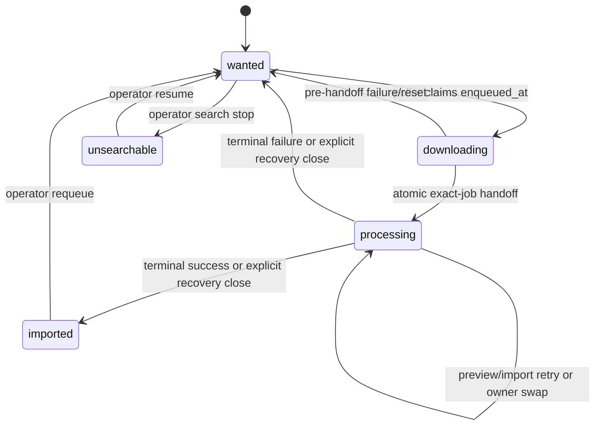
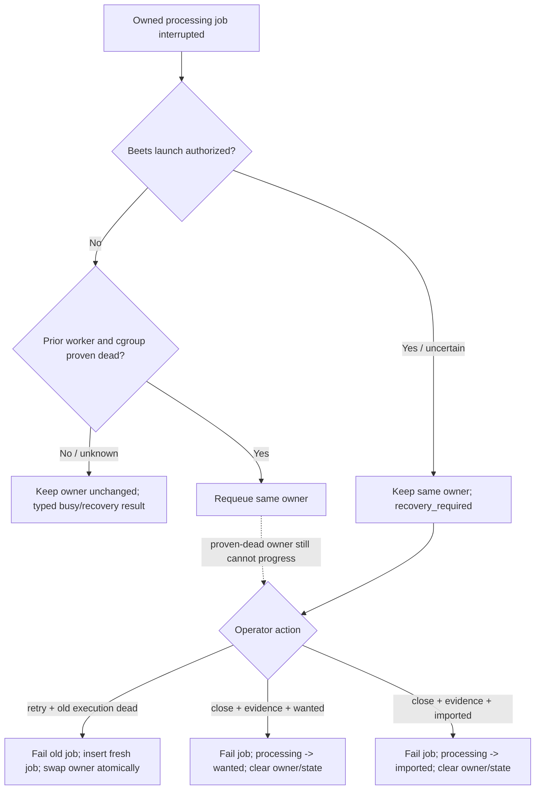

# Processing Lifecycle and Exact Automation Ownership - Plan

## Goal Capsule

Complete PR2 of
[#898](https://github.com/abl030/cratedigger/issues/898) by replacing inferred
post-download ownership with an explicit `processing` lifecycle owned by one
exact automation import job.

The authority changes once:

```text
(request_id, downloading, enqueued_at)
    -> (request_id, processing, active_automation_import_job_id)
```

The handoff is one PostgreSQL transaction under the existing per-request
`IMPORT` advisory lock. It commits before processor-owned filesystem work.
Afterward, only the recorded job may materialize, preview, import, recover, or
terminalize the request. A merely live or latest job, path equality,
`processing_started_at`, and `import_subprocess_started_at` remain evidence;
none is ownership. The recorded job's matching request, automation type, and
active owning status are required parts of the exact-owner predicate.

The work stops if it requires adopting historical jobs, retaining a
job-less `processing` row, adding a lock namespace, changing strict release
identity, weakening canonical manifest purity, or rewriting force-import and
YouTube ingestion around the new automation lifecycle.

Execution is invariant-first and test-first. The implementation tail owns
focused proof, generated and known-bad qualification, independent review,
one receipt-backed final pre-push confirmation, a merge-commit PR, a quiescent
migration, exact deployed source proof, one complete live processing
lifecycle, a natural successor cycle, and issue closure.

---

## Product Contract

### Summary

`downloading` currently covers two owners: the poller before queue handoff and
preview/importer afterward. That ambiguity lets a stale poller, a non-owner
job, or an operator action reconstruct authority from mutable signals and act
on processor-owned files or lifecycle state.

PR2 gives the processor a durable state and exact owner. The poller commits the
new owner before any processor filesystem effect. All processor mutations and
terminal bundles then require that exact relationship.

### Problem Frame

PR1, merged and deployed as
[#918](https://github.com/abl030/cratedigger/pull/918), fences four
download-state read-modify-write seams with `enqueued_at`. It intentionally
does not protect canonical publication, validation rejection, preview,
importer recovery, terminal outcomes, or operator invalidation.

The stopped PR1 expansion demonstrated three independent downstream failures:
a stale attempt can publish or remove files, quarantine a replacement
incarnation, or commit its audit and terminal outcome against another
incarnation. Carrying `enqueued_at` through all those layers recreates the
inferred-ownership design that issue #898 rejected.

### Requirements

#### Lifecycle and schema authority

- R1. A request is processor-owned exactly when
  `status='processing'` and `active_automation_import_job_id` names its one
  matching-request `automation_import` job in top-level status `queued`,
  `running`, or `recovery_required`; `processing` without an owner and an
  owner outside `processing` are invalid states. Claim, heartbeat, preview,
  launch, and terminal commands additionally require the stage-specific
  top-level and preview status they mutate.
- R2. Historical terminal jobs remain readable audit history but are never
  adopted, backfilled, rewritten, or treated as active owners.
- R3. `active_download_state` remains immutable attempt/manifest provenance
  during `processing`; processor code may update only owner-authorized fields,
  and a terminal transition clears the state with the owner.

#### Downloader-to-processor handoff

- R4. The handoff acquires `IMPORT(request_id)`, locks the request row, and
  atomically verifies `status='downloading'` plus the exact stored
  `enqueued_at`, inserts one automation job, records that job ID, persists the
  canonical processing path, stamps `processing_started_at` as non-authority
  evidence, and transitions to `processing`.
- R5. The handoff transaction commits before materialization, publication,
  source unlink, normalization, preview repair, quarantine, Beets launch, or
  cleanup; a stale witness or transaction fault therefore produces no
  filesystem, request, job, audit, or policy effect.
- R6. Once the handoff commits, poll, event, timeout, reset, and materialization
  grace code cannot mutate or recover that request; the recorded processor
  owns convergence from that point.
- R7. Generic automation enqueue is not a second route into processing. Only
  the specialized handoff may create the initial owner while entering
  processing; R14's atomic recovery retry is the only permitted in-processing
  owner replacement.

#### Exact-owner processor behavior

- R8. Automation preview claim, heartbeat, candidate-evidence binding,
  preview completion/failure, importer claim, preview requeue, launch
  authorization, recovery, path/state mutation, and terminal persistence act
  only when the job is the request's exact processing owner. A current owner
  in `recovery_required` remains attached but is not claimable, heartbeat-
  eligible, or launchable. A persisted execution lease identifies the current
  host boot ID, systemd unit and invocation, worker PID/start ticks, and
  authorized Beets child PID/start ticks for death proof; that lease is
  evidence, never ownership.
- R9. The recorded owner re-reads durable authority while holding
  `IMPORT(request_id)` before each worker stage's first filesystem effect.
  Preview uses its own dedicated non-pooled `PipelineDB` session and retains it
  through materialization/repair and its preview-state commit; importer
  reacquires on a separate dedicated non-pooled session and retains it through
  validation/rejection, Beets work, processor-owned cleanup, and the terminal
  commit. One owner-session watchdog continuously checks that same pinned
  session and exposes a cooperative cancellation token; every multi-step
  materialize, repair, validation, quarantine, cleanup, and subprocess
  primitive checks it before each mutation. Losing the session is fail-stop:
  the owner scope never reconnects, terminates and waits for any monitored
  process group, and initiates no new filesystem or database mutation after
  cancellation is observed. An atomic syscall already in flight may finish;
  exact manifests/journals reconcile it only after that execution is proven
  dead, and no replacement execution is authorized meanwhile.
- R10. Existing release serialization remains the inner
  `RELEASE(release_id)` lock. The order is always `IMPORT -> RELEASE`, using
  the same `PipelineDB` session. Automation runtime context borrows that exact
  session without owning or closing it; it never lazily opens a second
  connection for terminal or release-lock work.
- R11. A stale or wrong job ID produces no claim, heartbeat, evidence link,
  preview mutation, path mutation, launch stamp, audit, request transition,
  job terminalization, or cleanup effect.

#### Recovery and terminal behavior

- R12. A crashed preview or importer before Beets launch may requeue the same
  exact owner only after the shared liveness service proves the persisted
  execution dead. A changed host boot ID is conclusive death; on the same boot
  the exact unit/invocation, worker PID/start ticks, Beets child PID/start
  ticks, and cgroup must all be absent. A PID with different start ticks proves
  only that the stored process identity is absent; it is never treated as the
  old process. Any contradictory signal or read/probe error is `unknown` and
  leaves the owner untouched.
  Automatic recovery is startup-only; a stale heartbeat inside the same live
  invocation cannot requeue itself. A crash after launch authorization changes
  that job to `recovery_required` while the request stays `processing` with
  the same owner. Recovery never creates two live executions of one job.
- R13. A pre-launch defer, release-lock contention, or missing/stale preview
  evidence requeues the same owning job instead of terminalizing it and
  stranding the request; this in-process requeue remains under the same live
  execution and lock, while startup requeue obeys R12's death proof.
- R14. Automation recovery `retry` atomically fails the ambiguous job, inserts
  a fresh job ID, retargets the request owner to it, clears the old launch
  authority, atomically retargets any owner-scoped cleanup journal without
  altering its paths/progress, and remains `processing`; it requires a current
  recovery-evidence revision and is rejected until the old execution is proven
  dead from that same persisted lease. The action locks request, job, and
  journal and compare-and-swaps the exact probed owner, stage, launch fence,
  every lease field, and journal revision; any fresh claim or changed field
  returns `evidence_changed` without mutation, so the old job can never replay
  against files or the database.
- R15. Automation recovery `close` requires the operator to declare
  `result_status='wanted'` or `result_status='imported'`. The final close
  transaction fails the ambiguous job, applies that explicit lifecycle result,
  and clears owner and active state. The system never infers whether Beets
  applied the import. One shared `AutomationRecoveryDetail` shown by
  `GET /api/import-jobs/{id}/recovery` and
  `pipeline-cli import-job-recovery show JOB_ID` contains the exact
  request/release, owner job, canonical path, launch stamp, persisted execution
  lease, observation timestamps, liveness (`live|dead|unknown`), liveness
  reason, completion (`captured|absent|unavailable`), exact-library observation
  (`unique|missing|ambiguous|unavailable`), an opaque evidence revision,
  cleanup-journal status/progress, `close_eligible`, and
  `close_block_reason`. `absent` and `missing` are
  positive observations, never aliases for an observation failure. Retry and
  close submit the displayed revision. The action re-observes evidence, then
  locks request/job and compare-and-swaps the exact owner, stage, launch fence,
  and persisted lease snapshot used by the death proof; a stale observation,
  fresh claim, or changed field returns refreshed detail without mutation. The
  declared result and existing non-empty audit reason are echoed and
  persisted. The same close is the break-glass exit for a queued or running
  exact owner that is proven execution-inactive and cannot otherwise progress.
  Close never treats a missing journal as proof that cleanup is unnecessary.
  Under `IMPORT -> RELEASE`, a revision-bound close first persists a
  result-specific processor-cleanup intent from the exact canonical
  path/manifest, or a typed no-op receipt when exact inspection proves no
  processor-owned bytes remain. It executes and checkpoints that journal while
  the owner remains attached. Incomplete or unreconciled cleanup blocks the
  final close transaction; a completed/no-op journal is consumed with its
  receipt. A crash during this phase retains the declared close result, reason,
  evidence revision, and journal for evidence-backed resume after death proof.
  Force-import and YouTube recovery semantics remain unchanged.
- R16. Preview failure, validation rejection, quality rejection, local
  completion failure, and successful import each use an existing canonical
  terminal bundle extended to verify the exact owner first; the bundle applies
  `processing -> wanted|imported`, clears owner/state, writes audit and policy
  effects, and terminalizes that exact job once. All processor-owned cleanup
  required for that exit completes under the still-attached owner before this
  bundle. Before its first cleanup mutation, an owner-aware command persists
  an exact-owner cleanup journal containing the deterministic action, exact
  source/destination manifests, hashes, collision-selected destination, and
  step progress. Each idempotent step checkpoints the journal, so a crash can
  resume it after the prior execution is proven dead without path inference.
  Its completed typed receipt is folded into the pending terminal outcome,
  download audit, and job result while the terminal transaction consumes the
  journal. Cleanup failure leaves owner and journal intact and follows
  R12-R15 instead of creating unauthorised post-terminal work or a second
  audit write.
- R17. A terminal transaction fault rolls back request, owner, active state,
  audit, denylist/cooldown, and job changes together. The terminal commit is
  the last processor-owned step and cannot leave a cleanup obligation after
  authority is cleared.

#### Operator and presentation behavior

- R18. Replace, force-import, Bad Rip/ban-source, library delete, direct
  pipeline delete, and generic lifecycle/intent mutations fail closed while a
  request has a processing owner; each authoritative filesystem check occurs
  after acquiring `IMPORT` and re-reading the durable owner.
- R19. API and CLI adapters expose the same typed busy/conflict outcomes from
  their canonical services. Force-import may provide an early busy response,
  but execution repeats the authoritative check under `IMPORT`.
- R20. Status counts, browse/library badges, request action controls, dev
  fixtures, and operator documentation recognize `processing`. Mutation
  controls render one shared locked state as focusable
  `aria-disabled="true"` controls: pointer, Enter, and Space activation are
  suppressed, and `aria-describedby` names the visible owner-job explanation.
  A stale click maps the typed conflict to that same state immediately,
  announces it through an `aria-live` status, and refetches only the affected
  row while preserving tab/subview, filters, expansion, scroll, and focus. If
  refetch fails, the locked state remains with an accessible retry action.
- R21. `/api/pipeline/downloading` remains transfer-owner-only. The Recents
  current Downloading subview becomes **Acquisition** and shows both
  downloading and processing request rows through a combined acquisition
  query/route rather than relabeling the downloader endpoint. The separate
  Imports subview remains the job-oriented timeline, and each processing row
  links to its recorded owner detail rather than the latest active job inferred
  by request ID. Existing active YouTube rescue rows remain visible in
  Acquisition without entering the processing lifecycle. One shared
  request-presentation projection is present on every request-shaped payload
  consumed by those badges and controls:
  `processing_owner: {job_id, status, preview_status}`, null only when the
  request is not processing. One helper derives the label, lock reason, and
  exact owner-detail target from that projection. The shared mapping renders:
  queued/waiting as queued for preview,
  queued/preview-running as previewing, queued/evidence-ready as waiting to
  import, top-level running as importing, and `recovery_required` as needs
  recovery; path existence is never a presentation predicate.
- R22. Processing remains part of unresolved backlog accounting, but it is not
  added to slskd event, transfer, ledger-retention, or reaper status sets.

#### Proof and rollout

- R23. Every named ownership invariant ships as a deterministic pin and a
  generated property that drives production seams, plus an independently
  qualified known-bad mutant.
- R24. Real PostgreSQL is authoritative for schema constraints, handoff
  rollback, exact-owner predicates, two-session overlap, recovery owner swap,
  and terminal atomicity; `FakePipelineDB` must match the same transcripts and
  unchanged-rejection metadata.
- R25. A widest-boundary integration test composes the real materializer and
  terminal writer with real PostgreSQL and a shared request-scoped filesystem
  namespace.
- R26. Deployment quiesces every producer or consumer of the old lifecycle and
  aborts unless the live preconditions are clean. Verification includes the
  migration, exact active source, worker health, an ordinary natural successor
  pipeline cycle, and eventually one complete natural processing lifecycle;
  no single cycle is assumed to both enqueue and poll a new download. The
  controlled phase starts and verifies web, preview, and importer while acquisition
  timers remain masked and receipt-owned start inhibitors keep both the main
  cycle and YouTube ingest inactive even if metadata resume overlaps. Only
  after worker readiness proof does the helper remove the main-only inhibitor
  and start the controlled cycle; the YouTube inhibitor remains until final
  release. A separately deployed downstream gate change must guard YouTube
  ingest and honor both inhibitors before the lifecycle migration is
  attempted.

### Key Product Decisions

- KD1. Post-handoff ownership is `processing + exact automation job`, not a
  propagated download witness. It governs R1-R17.
- KD2. Processor ownership is committed before processor filesystem work. It
  governs R4-R11.
- KD3. An automation recovery close requires an explicit operator-declared
  result backed by visible reconciliation evidence. It governs R15.
- KD4. The change is automation-specific; force-import and YouTube retain
  their current queue and recovery lifecycles. It governs R7, R15, and R19.
- KD5. Processor-owned cleanup completes before the owner-clearing terminal
  transaction; no post-terminal cleanup authority is inferred from paths or
  history. It governs R9 and R16-R17.
- KD6. Same-job retry is safe only after the prior execution is proven dead;
  exact job identity does not by itself authorize concurrent executions. It
  governs R12-R15.

### Actors

- A1. Download poller — owns one `downloading` incarnation and may publish the
  specialized handoff.
- A2. Automation preview worker — reads and measures only the exact processing
  owner's canonical source.
- A3. Automation importer — owns filesystem mutation and Beets launch under
  `IMPORT -> RELEASE`.
- A4. Recovery operator — explicitly retries or closes ambiguous Beets work.
- A5. Operator invalidator — attempts Replace, force-import, destructive
  release work, request deletion, or lifecycle mutation.
- A6. Deployment operator — establishes a quiescent old-lifecycle boundary
  before the forward migration.

### Flows

- F1. Handoff: A1 acquires `IMPORT`, submits R4's transaction, releases the
  poller only after commit, and never materializes on a rejected handoff.
  Covers R4-R7.
- F2. Normal processor path: A2/A3 claims the recorded job, acquires `IMPORT`,
  verifies exact ownership, materializes and previews, nests `RELEASE` for
  Beets work, performs all processor-owned cleanup, commits one terminal bundle
  last, and releases locks. Covers R8-R11 and R16-R17.
- F3. Crash recovery: startup recovery changes only the recorded owner after
  proving any prior claimed execution dead; an unclaimed queued owner may be
  claimed normally, pre-launch work retries, post-launch ambiguity waits for
  A4, reconciliation evidence is shown before retry/close, and the request
  never returns to the poller. Covers R12-R15.
- F4. Operator race: A5 waits for or loses `IMPORT`, re-reads the request, and
  returns a typed conflict without touching files or lifecycle state if the
  owner is still current. Covers R18-R19.
- F5. Rollout: A6 first deploys the downstream YouTube gate prerequisite,
  establishes the authoritative hold, proves the clean boundary, deploys
  migration 066 through Nix, starts only the controlled worker set while
  timers remain masked, and captures live lifecycle plus successor evidence
  before completing the hold receipt. Covers R26.

### Acceptance Examples

- AE1. A current `downloading` A/EA commits the handoff. One queued automation
  job exists, the request is `processing`, the owner points to that same job,
  its expected status is `processing`, and no processor file has yet moved.
  Covers R1 and R4-R5.
- AE2. A/EA snapshots the row, B/EB replaces it, and A attempts the handoff at
  the same deterministic path. A creates no job, owner, path, audit, state
  transition, canonical tree, quarantine, or unlink. Covers R4-R6.
- AE3. The handoff faults after job insertion or request publication. The
  transaction rolls back completely and the unchanged downloading incarnation
  remains eligible for a fresh handoff. Covers R4-R5.
- AE4. A handoff commits and the process exits before materialization. Preview
  startup finds the same queued, never-claimed owner, claims it with a fresh
  execution lease, materializes under `IMPORT`, and continues without
  returning the request to downloading. If a prior preview claim exists, its
  execution must instead be proven dead before requeue. Covers R8-R13.
- AE5. A non-owner job races preview or importer. It cannot claim or mutate
  evidence, files, launch authority, lifecycle, audit, or job state. Covers
  R8-R11.
- AE6. Importer startup sees two interrupted owners. The unlaunched job
  requeues with the same owner only after the old service cgroup is dead; the
  launched job becomes `recovery_required` with its owner unchanged. A live or
  unprovable old execution blocks either action. Covers R12.
- AE7. The operator retries a recovery-required automation job. The old job
  worker execution, Beets subprocess, and service cgroup are all proven dead;
  the old job becomes failed, a fresh job becomes the owner, and no observation
  can see `processing` without exactly one owner. Covers R14.
- AE8. The operator closes ambiguous automation work and declares `wanted` or
  `imported` after reviewing exact job, launch, path, completion, and library
  evidence. The chosen status, audit reason, failed old job, cleared owner, and
  cleared active state commit together; omitting the declaration is rejected.
  The same action can close a proven-dead wedged active owner. Covers R15.
- AE9. A terminal validation reject faults after its audit write. No audit,
  denylist, transition, owner clear, or job failure survives; retry still sees
  the same processing owner. A crash after any cleanup mutation likewise
  leaves the owner and exact checkpointed journal attached; after death proof,
  recovery resumes its deterministic next step without recomputing a path.
  Covers R16-R17.
- AE10. Replace or force-import starts before, during, or after processor work.
  `IMPORT` orders the operations; while processing remains owned, the
  invalidator returns a conflict with zero file or lifecycle effects. The UI
  renders the same accessible locked reason and refreshes a stale action
  without discarding context. Covers R18-R20.

### Success Criteria

- No request can be durably `processing` without one exact owner, and no owner
  can remain attached outside `processing`.
- No downloader or non-owner processor action changes an owned processing
  request, its files, its audit, or its job.
- Every processing exit either retargets ownership atomically or clears it in
  the same terminal transaction after owned cleanup is complete.
- Every cleanup mutation is preceded and followed by exact owner-scoped journal
  evidence, so crash recovery resumes a deterministic step and terminal commit
  leaves no cleanup journal behind.
- Recovery never guesses whether ambiguous Beets work succeeded.
- Recovery never creates two live executions of one owning job, and session
  loss cannot authorize a replacement while the old worker is alive; within
  the bounded watchdog interval the old worker stops initiating new mutations
  and any in-flight atomic effect remains exactly reconcilable.
- The execution lease records the complete current execution identity at claim
  and launch, every automated recovery action is justified by a reproducible
  `dead` transcript, and `unknown` evidence produces no lifecycle or filesystem
  effect.
- Operators can see processing work and cannot accidentally mutate it.
- Recovery evidence, action eligibility, labels, lock reasons, and owner-detail
  links agree across CLI, API, Recents, browse, library, and artist surfaces.
- The live migration and first ordinary processing lifecycle satisfy the same
  invariants as the real-PostgreSQL tests.

### Scope Boundaries

#### In scope

- Forward migration 066, request row projection, fake parity, and status
  taxonomy, including the owner-scoped pre-terminal cleanup journal.
- Specialized automation handoff and removal of poller-side processor
  inference.
- Exact-owner automation preview, importer, recovery, terminal, abandonment,
  and filesystem authority.
- Processing-aware operator invalidation, read/presentation surfaces, and
  documentation.
- Cratedigger deploy-hold changes plus the minimal downstream nixosconfig
  metadata-gate prerequisite needed to stop and resume YouTube ingest.
- Deterministic, generated, known-bad, real-PostgreSQL, real-filesystem, and
  live rollout proof.

#### Out of scope

- A witness in `AutomationImportPayload`, historical `{}` job adoption,
  committed backfill, startup cleanup, or compatibility shim.
- Path equality, `processing_started_at`, `import_subprocess_started_at`, or
  latest-active-job inference as ownership.
- A new advisory-lock namespace or reversed `RELEASE -> IMPORT` acquisition.
- A generic import-queue redesign, force-import/YouTube lifecycle rewrite, or
  change to importer singleton ownership. The downstream YouTube unit is only
  added to deployment guarding; its queue behavior is unchanged.
- Weakening exact canonical manifest equality or adding sidecars to processing
  album directories.
- Cherry-picking any stopped issue #898 branch.

### Sources

- `origin/main` at `fb86921052bd00482b2e6699ab82cd75b94d8d5a`
  (2026-07-29), including PR1's merge commit and #919's current
  judgment-based validation/receipt workflow.
- [Issue #898](https://github.com/abl030/cratedigger/issues/898), its
  [stopped-attempt boundary](https://github.com/abl030/cratedigger/issues/898#issuecomment-5099285548),
  and the
  [PR1 deployment receipt](https://github.com/abl030/cratedigger/issues/898#issuecomment-5103221942).
- `docs/plans/2026-07-28-001-fix-download-incarnation-rmw-fence-plan.md` —
  shipped PR1 contract and explicit PR2 boundary.
- `docs/plans/2026-05-06-001-fix-abandoned-auto-import-recovery-plan.md` —
  current interrupted-import policy that exact ownership supersedes.
- `docs/pipeline-db-schema.md` and `docs/advisory-locks.md` — current queue,
  terminal, crash-fence, and lock-order contracts.
- `docs/solutions/testing/idealized-destructive-tests-missed-the-beets-runtime-envelope.md`
  — production-boundary test requirement.
- `docs/solutions/deployment/authoritative-systemd-deploy-holds.md` —
  authoritative deploy-hold procedure.

---

## Planning Contract

### Key Technical Decisions

- KTD1. Add nullable `album_requests.active_automation_import_job_id` and
  include `processing` in the status constraint.
  `(session-settled: user-approved — chosen over propagating enqueued_at through processor code: issue #898 assigns post-handoff authority to one exact job.)`
  Enforce `processing` iff owner is non-null. Add a unique
  `import_jobs(id, request_id)` key and a composite
  `(active_automation_import_job_id, album_requests.id)` foreign key with
  `ON DELETE RESTRICT`, so an owner must belong to the same request. Add a
  partial one-active-automation-job-per-request constraint for top-level
  statuses `queued`, `running`, and `recovery_required`. Deferred constraint
  triggers on both tables enforce at commit that an attached job is
  `automation_import`, remains in that active set, and points back to the same
  processing request; terminal and retry bundles may change both rows within
  one transaction but cannot commit a half-state. Owner-aware commands still
  require the exact stage status, and generic job terminal writers reject a
  currently attached owner. Governs R1-R3 and R24.
- KTD2. Keep the processing transitions private to owner-aware database
  commands. Ordinary `VALID_TRANSITIONS` does not expose
  `downloading -> processing` or `processing -> wanted|imported`; generic
  web/CLI status writers therefore cannot steal processor ownership. The
  handoff and terminal/recovery bundles own those edges. Governs R4, R15-R19.
- KTD3. Commit lifecycle ownership before processor filesystem mutation.
  `(session-settled: user-approved — chosen over materialize-then-enqueue: the older ordering can unlink source bytes before durable processor authority exists.)`
  The handoff computes the canonical path from the persisted manifest but does
  not publish it. After commit, the owner resumes the existing idempotent
  exact-manifest materializer under `IMPORT`. Governs R4-R9.
- KTD4. Strengthen queue methods by job type rather than forcing every queue
  consumer into the automation lifecycle. Automation query/write predicates
  join through the exact processing owner; force-import and YouTube retain
  their existing expected-status and payload authorities. Generic automation
  enqueue and job-only terminal methods reject owning automation jobs.
  Governs R7-R8, R11-R16.
- KTD5. Hold `IMPORT` around each automation worker stage that can mutate
  processor files or lifecycle state; durable exact ownership spans the
  preview/importer gap, not one cross-process advisory-lock session.
  `(session-settled: user-approved review amendment — use one borrowed importer DB session for IMPORT -> RELEASE and fail-stop on its loss.)`
  `RELEASE` remains inner during the importer stage. The automation importer
  gives its existing dedicated `PipelineDB` session to a non-owning
  `DatabaseSource` runtime context; that context returns the borrowed object
  from `_get_db()` and never closes it. The owner-session scope pins one
  connection, disables `_execute`'s ordinary autocommit reconnect/replay, and
  runs a same-session watchdog that cancels every owner-scoped primitive on
  loss. Preview creates its own dedicated non-pooled session and request lock
  before materialization/repair. Multi-step filesystem helpers check that
  cancellation token before every mutation; a lost session aborts the
  execution and kills and waits for any monitored process group;
  recovery operations that are database-only use atomic owner predicates, and
  any recovery path that touches files also takes `IMPORT`. Governs R9-R13
  and R18.
- KTD6. Retire job-less abandonment and subprocess-stamp ownership. Preserve
  collision-safe quarantine and non-punitive audit outcomes only inside an
  exact-owner terminal command. Claim persists a non-authoritative execution
  lease: host boot ID, systemd unit and `INVOCATION_ID`, worker PID/start
  ticks, and, after launch, Beets child PID/start ticks. One production
  liveness service checks those exact identities plus the unit cgroup and is
  shared by startup recovery, retry, close detail, and CLI/API presentation.
  A boot-ID change proves the old execution dead; on the same boot every exact
  identity must be absent. A reused PID with different start ticks is not the
  stored process, while disagreement or probe failure is `unknown`. Automatic
  recovery runs only during a new service invocation; a
  live or unprovable execution leaves the owner untouched. The Beets runner
  uses a monitored `Popen` process group rather than blocking
  `subprocess.run`, probes the pinned DB session at least once per second while
  it waits, and terminates and waits for the child process group on session
  loss. The same bounded watchdog/cancellation contract covers materialize,
  repair, validation, quarantine, and cleanup; the owner/session is reverified
  before each later filesystem effect and before terminal commit. Launched
  ambiguity remains processing and recovery-required until the operator acts,
  and retry also requires the same death proof. Governs R12-R17.
  `(session-settled: user-approved review amendment — exact job identity does not authorize two live executions of that job.)`
- KTD7. Extend the existing preview/import terminal transactions rather than
  creating another finalizer. They lock and verify the owner before any
  request, audit, policy, or job write. Processor-owned path/quarantine cleanup
  completes while that owner and `IMPORT` still exist. Migration 066 adds an
  owner-scoped cleanup journal keyed by `(job_id, request_id)` with deferred
  exact-owner enforcement, deterministic action/source/destination manifests
  and hashes, collision-selected destination, step progress, and completed
  receipt. The owner persists intent before the first mutation, checkpoints
  each idempotent step, and after proven execution death resumes only the exact
  journaled paths. Then the terminal transaction clears owner/state as its
  final step, consumes the journal, carries the typed receipt in
  `PendingImportTerminalOutcome`, inserts the download row, attaches the
  receipt to its validation audit, merges it into the job result, and
  terminalizes atomically. Cleanup failure does not terminalize and instead
  preserves owner plus journal under the exact-owner recovery policy. Governs
  R16-R17.
  `(session-settled: user-approved review amendment — cleanup-before-terminal was chosen over a durable post-terminal cleanup receipt.)`
- KTD8. Recovery `close` retains its action name but requires
  `result_status` for automation jobs.
  `(session-settled: user-directed — chosen over always-wanted or always-imported: ambiguous Beets work requires an explicit operator reconciliation result.)`
  CLI and API share one typed, revisioned `AutomationRecoveryDetail` and action
  service. Forward-only CLI verbs are
  `pipeline-cli import-job-recovery show|retry|close JOB_ID`; automation retry
  and close require the displayed opaque evidence revision, and close also
  requires the declared result. The API GET returns the same detail and its
  described POST accepts `action`, `evidence_revision`, `reason`, and
  automation-close `result_status`. A stale revision returns typed
  `evidence_changed` plus refreshed detail without mutation. The revision binds
  the observed evidence, while recovery SQL locks request/job and
  compare-and-swaps the exact owner ID, job/preview stage, launch fence, and
  every execution-lease field returned by the liveness service, plus cleanup
  journal identity/version/progress; a fresh claim or cleanup step therefore
  invalidates the action. Detail exposes `close_eligible` and
  `close_block_reason` for recovery-required and wedged queued/running owners.
  The latter may close only after the common liveness proof reports `dead`.
  When no journal exists, close persists the selected result/reason/revision
  plus an exact processor-cleanup plan or proven no-op receipt under
  `IMPORT -> RELEASE`. Incomplete or unreconciled cleanup blocks the final
  close transaction; completed/no-op cleanup is consumed with its receipt.
  Retry atomically retargets an existing journal to the fresh owner without
  recomputing any path or step.
  Force/YouTube action contracts remain as specified in R14-R15.
  `(session-settled: user-approved review amendment — evidence-backed close also supplies the wedged-owner escape.)`
- KTD9. Treat every per-request operator invalidator as a lock-and-recheck
  boundary. Early preflight improves feedback but is never authority. Direct
  request deletion moves behind a canonical service so it cannot null an
  active job's request FK and orphan a processor. Governs R18-R19.
- KTD10. Present processing without reclassifying it as slskd activity. Add it
  to unresolved backlog and acquisition presentation, keep downloading API and
  transfer ownership sets narrow, and replace "latest active job" display
  inference with a combined acquisition query joined to the recorded owner.
  Every request overlay consumed by badges, Acquisition, browse, library,
  artist, and action-state code carries the same
  `processing_owner: {job_id, status, preview_status}` projection, null only
  outside processing. One presentation helper derives the canonical label,
  locked reason, and exact recovery-detail target. Locked controls stay
  focusable with `aria-disabled`, suppress all activation, and retain a typed
  locked state plus accessible retry if the contextual row refresh fails. No
  path probe contributes to presentation state.
  Governs R20-R22.
- KTD11. Use real production boundaries for proof. The generated model invokes
  the specialized handoff, owner-aware queue methods, terminal bundles, and
  invalidator services; deterministic two-session tests force orderings that
  generated scheduling cannot guarantee. Governs R23-R25.
- KTD12. Migrate only at a proven quiescent boundary with
  `scripts/cratedigger_deploy_hold.py`. First ship a separate signed
  nixosconfig prerequisite that adds YouTube ingest to the metadata gate's
  guarded/resume sets and root-evaluated receipt-owned start inhibitors for the
  main service and YouTube. After the Cratedigger switch,
  `prepare-controlled` creates both inhibitors before it releases the manual
  gate, explicitly starts and proves web/preview/importer healthy while every
  acquisition timer stays masked, and proves overlapping metadata resume can
  start neither main nor YouTube. It then removes only the main inhibitor and
  starts the controlled main cycle; a concurrent resume after that readiness
  boundary merely coalesces the same systemd start. Final receipt release
  removes the YouTube inhibitor only immediately before ordinary metadata
  resume. No manual DDL or runtime mask is an acceptable substitute. Governs
  R2 and R26.
  `(session-settled: user-approved review amendment — two-stage downstream gate then source-pin rollout replaces the infeasible original hold sequence.)`

### High-Level Technical Design

#### Lifecycle state machine



`processing -> processing` is not a generic status write. It represents either
the same owner changing queue/preview state or R14's atomic owner swap.

#### Handoff and first processor effect

```mermaid
sequenceDiagram
    participant P as Poller A/EA
    participant D as PipelineDB
    participant J as import_jobs
    participant W as Preview/Importer owner
    participant F as Filesystem

    P->>D: Acquire IMPORT(request)
    P->>D: BEGIN; SELECT request FOR UPDATE
    D->>D: Verify downloading + exact EA
    P->>J: Insert automation job, expected processing
    P->>D: Set processing + owner job ID + canonical path
    D-->>P: COMMIT handoff
    P-->>D: Release IMPORT
    W->>D: Acquire IMPORT(request)
    W->>D: Re-read processing + exact job ID
    W->>F: Materialize exact manifest and unlink proven sources
    W->>D: Preview/import owner-aware writes
    W->>F: Beets effects
    W->>D: Persist exact cleanup intent
    W->>F: Journaled processor-owned cleanup
    W->>D: COMMIT terminal bundle, consume journal, clear owner last
```

No processor-owned filesystem effect appears before the commit line.

#### Crash and recovery decisions



The shared liveness decision table is exact and fail-closed:

| Persisted/current observation | Result | Permitted effect |
| --- | --- | --- |
| Queued owner has never been claimed and has no lease | `dead` (`never_claimed` evidence) | Ordinary exact-owner claim or revision-bound wedged close; their CAS resolves any race |
| Current host boot ID differs from the stored boot ID | `dead` | Startup requeue or revision-bound recovery may proceed |
| Same boot and any exact worker/child identity or stored invocation is live | `live` | No recovery mutation |
| Same boot, stored invocation is gone, and every exact PID/start-tick identity and its cgroup membership are absent | `dead` | Startup requeue or revision-bound recovery may proceed |
| PID exists with different start ticks | identity absent | Continue evaluating invocation, child, and cgroup; never signal `live` from PID alone |
| Any lookup fails, observations disagree, or exact absence cannot be established | `unknown` | No recovery mutation |

Retry/close additionally lock request, job, and cleanup journal and require
the complete probed snapshot to remain byte-for-byte current. A fresh claim or
cleanup checkpoint after the probe therefore returns `evidence_changed`.

### System-Wide Impact

- Persistence: one migration changes `album_requests`, its read projection,
  fixture builder, fake, and lifecycle audits.
- Poller: handoff replaces generic materialize/enqueue and removes active-job
  inference, subprocess-stamp abandonment, and post-handoff reset paths.
- Preview/importer: automation operations gain exact-owner query predicates and
  per-request `IMPORT` ownership on one borrowed DB session; force-import and
  YouTube remain separate.
- Terminal/recovery: canonical bundles gain owner validation, clear semantics,
  and atomic retry owner transfer.
- Operator actions: Replace, destructive release actions, force-import, direct
  delete, intent, and status adapters fail closed against processing.
- Presentation: status lists, badges, controls, Recents acquisition detail,
  fixtures, and docs learn one durable `processing` presentation mapping.
- Operations: deployment adds a Cratedigger controlled-worker phase, a minimal
  downstream YouTube metadata-gate prerequisite, a one-time quiescence audit,
  and post-switch lifecycle proof; no persistent compatibility machinery is
  added.

### Risks and Mitigations

- A handoff that records a path before publication could leave a queued owner
  with no canonical directory after a crash. The owner reconstructs from the
  still-persisted event manifest and materializes idempotently; preview never
  treats path existence as ownership.
- Holding `IMPORT` through spectral preview can delay operator actions. That
  delay is the required serialization; use typed busy/conflict feedback and do
  not weaken the lock boundary.
- A database disconnect could drop the session-scoped lock while a worker
  continues. Use one dedicated non-pooled session, pass it through the runtime
  context, and fail-stop immediately on session loss; startup/retry recovery
  proves the old service cgroup and subprocess dead before reusing authority.
- Generic queue methods could accidentally terminalize an owner. Reject that
  job type outside owner-aware bundles and qualify the restriction with direct
  mutants.
- A recovery retry could create two owners if old-job failure, new-job insert,
  and request retarget split. Keep them in one transaction and exercise every
  write boundary. Also reject retry while the old execution is live or
  unprovably dead.
- Clearing ownership before cleanup would leave no durable cleanup authority.
  Complete processor-owned cleanup under the attached owner and make the
  terminal transaction the final operation; cleanup failure remains owned and
  enters recovery.
- `processing` could leak into slskd cleanup semantics through broad status-set
  edits. Audit every hard-coded status consumer by purpose and update only
  backlog/presentation owners.
- Direct deletion can bypass service-level guards. Put the final conditional
  delete in PostgreSQL behind `IMPORT`, and keep the service/API/CLI result
  mapping as adapters.
- A fake can appear correct while production SQL joins the wrong row. Replay
  the same transcripts against real PostgreSQL and the fake, including
  unchanged `updated_at`, job metadata, and filesystem observations on
  rejection.
- A quiescent migration can still encounter old post-handoff state represented
  as `downloading`. The deploy audit rejects any active automation job,
  recovery-required job, `processing_started_at`, staged `current_path`,
  subprocess stamp, or malformed PR1 witness rather than converting it.
- Migration 066 intentionally makes the old lifecycle source an unsupported
  rollback target even after rows drain. After the switch, retain the hold and
  forward-fix against the migrated schema; never assume zero current owners
  proves old writers compatible.
- The current metadata gate omits YouTube ingest, and the current controlled
  phase does not restart preview/importer. Ship and verify the downstream gate
  prerequisite first, then use the revised helper's separate receipt-owned
  main and YouTube inhibitors to start only the controlled worker set while
  timers remain masked. Overlapping resume cannot start either acquisition
  producer before readiness; the main inhibitor is removed only at the
  deliberate controlled-cycle boundary.

### Sequencing

U0 is a dependency-free downstream control-plane prerequisite and is deployed
against the old source before the Cratedigger lifecycle migration is eligible.
U1 establishes the schema and private lifecycle vocabulary. U2-U4 are one
atomic, non-shippable core-lifecycle implementation unit: U2 publishes the
handoff, U3 establishes processor execution at the exact-owner boundary, and
U4 completes every terminal/recovery exit. Their headings are convergence
phases, not branch, review, push, or deploy boundaries. U5 depends on that
complete core authority. U6 depends on U0 and U1-U5, then integrates
presentation, generated proof, documentation, and rollout.

---

## Implementation Units

### U0. Ship the controlled-start prerequisite

**Goal:** Make the future lifecycle migration hold capable of starting only
the intended worker/service subset.

**Requirements:** R26; F5; KTD12.

**Dependencies:** None. This is implemented, signed, pushed, deployed, and
verified while nixosconfig still pins the old Cratedigger source.

**Repository/files:** In a separate isolated nixosconfig worktree on doc1,
`modules/nixos/services/cratedigger.nix` plus its existing generated,
evaluation, and metadata-gate tests.

**Approach:**

- Add YouTube ingest to the metadata gate's guarded and resume unit sets.
- Add root-evaluated receipt-owned start conditions for separate main-service
  and YouTube inhibitor files. Neither condition changes ordinary behavior
  when its inhibitor is absent.
- Keep web, preview, and importer free of those controlled-start inhibitors so
  they can be brought up after the ordinary manual hold is released.
- Signed-commit, push, and deploy this prerequisite independently. Do not
  update the Cratedigger source pin in the same transaction.

**Test scenarios:**

- Ordinary hold stops main, web, preview, importer, and enabled YouTube;
  ordinary resume restarts the enabled set when no inhibitor exists.
- Main-only and YouTube-only inhibitors each block their exact producer under
  direct start and `resume-if-clear` without blocking web/preview/importer.
- Both inhibitors survive overlapping watchdog/resume attempts and are removed
  only by the receipt that created them.

**Verification:** Nix evaluation/generated checks pass, the signed prerequisite
deploy is exact on doc2, and live ordinary/inhibited hold-resume probes match
the three scenarios before U1-U6 implementation can ship.

### U1. Add the processing schema and private lifecycle contract

**Goal:** Make valid processing ownership representable and invalid owner/state
combinations rejectable.

**Requirements:** R1-R3, R20, R23-R24; KTD1-KTD2.

**Dependencies:** None.

**Files:** `migrations/066_processing_automation_owner.sql`,
`lib/transitions.py`, `lib/import_queue.py`, `lib/pipeline_db/rows.py`,
`lib/pipeline_db/_shared.py`, `lib/pipeline_db/requests.py`,
`lib/pipeline_db/import_jobs.py`, `lib/pipeline_db/__init__.py`,
`tests/helpers.py`, `tests/fakes/pipeline_db.py`,
`tests/test_migrator.py`, `tests/test_pipeline_db.py`,
`tests/test_pipeline_db_column_contract.py`,
`tests/test_request_lifecycle_generated.py`, and database write-audit tests.

**Approach:**

- Write migration pins first, then add `processing`, the composite same-request
  owner FK with `ON DELETE RESTRICT`, status/owner equivalence, active
  automation per-request uniqueness, and the two deferred complete-owner
  constraint triggers without touching historical rows. Add KTD7's empty
  owner-scoped cleanup-journal table in the same forward migration; its
  composite job/request key and deferred trigger reject a journal that is not
  attached to that exact processing owner.
- Add nullable execution-lease fields on `import_jobs` for invocation ID,
  host boot ID, systemd unit, worker PID/start ticks, and Beets child PID/start
  ticks. They are populated on claim/launch and cleared on safe requeue, retry,
  or terminalization; no request-owner constraint treats them as authority.
- Update the typed row, fixture builder, fake, exports, and status vocabulary
  together so the column-contract test stays exact.
- Keep processor transitions out of the ordinary transition graph. Add narrow
  owner-aware database commands in later units rather than a public
  `to_processing` helper.
- Make generic request field/status/delete writers reject an attached owner so
  raw service mistakes fail closed below adapters.

**Test scenarios:**

- Migration: `processing + owner` is accepted; either half alone is rejected.
- Foreign/unique constraints: an unknown or wrong-request job, current-owner
  deletion, or one job attached to two requests is rejected; two active
  automation jobs for one request are rejected.
- Complete-owner trigger: wrong job type, terminal owning status, owner/job
  request drift, and a job terminal update without the same-transaction owner
  clear all fail at commit. Ordered handoff, terminal, and retry transactions
  satisfy the deferred checks.
- Cleanup journal: wrong-request, non-owner, terminal-owner, and
  duplicate-active journals are rejected; owner-aware commands refuse deletion
  except as part of terminal consumption, and an empty migration leaves all
  historical jobs untouched.
- Forward-only: historical terminal `{}` jobs and existing request rows are
  byte/column semantically unchanged after migration.
- Projection: `AlbumRequestRow`, `make_request_row`, `ImportJob`,
  `information_schema`, and the fake agree exactly.
- Execution-lease columns round-trip and malformed partial identity shapes are
  rejected without altering request ownership. U3 owns claim/launch
  population plus changed-boot, same-boot, PID-reuse, cgroup, and
  unreadable-evidence behavior.
- Private edge: ordinary status APIs cannot enter or leave processing.
- Known bad: removing status/owner equivalence, owner uniqueness, or the
  generic-writer guard fails its dedicated self-test.

**Verification:** Migration, column-contract, lifecycle, fake parity, and
write-audit pins pass against migrations-applied real PostgreSQL.

### U2-U4 atomic core-lifecycle unit

U2, U3, and U4 below are ordered internal convergence phases of one runnable
unit. The branch is not implementation-complete, review-ready, pushable, or
deployable until all three phases and their composed tests pass.

#### U2. Commit the atomic downloader-to-processor handoff

**Goal:** Transfer authority from one exact download incarnation to one exact
automation job before processor filesystem work.

**Requirements:** R4-R7, R23-R25; F1; AE1-AE4; KTD3-KTD4.

**Dependencies:** U1.

**Files:** `lib/pipeline_db/import_jobs.py`, `lib/download.py`,
`lib/download_materialization.py`, `lib/download_processing.py`,
`lib/quality/download_state.py`, `lib/staged_album.py`, `lib/import_queue.py`,
`tests/fakes/pipeline_db.py`, `tests/fakes/download.py`,
`tests/test_pipeline_db.py`, `tests/test_download.py`,
`tests/test_download_reducer.py`, `tests/test_import_queue.py`,
`tests/test_staged_album.py`,
`tests/test_preview_manifest_generated.py`, and
`tests/test_integration_slices.py`.

**Approach:**

- Add one specialized real/fake handoff command implementing R4 in a single
  transaction. Compute the canonical exact-manifest path before the command
  but perform no filesystem mutation; stamp `processing_started_at` in that
  same transaction and never use it in an owner predicate.
- Replace `_enqueue_completed_processing`'s materialize-then-generic-enqueue
  ordering with the command and consume tagged stale/conflict/error outcomes
  without poller-owned follow-on effects.
- Disallow `IMPORT_JOB_AUTOMATION` in generic `enqueue_import_job`; retain
  generic force/YouTube queueing.
- After commit, remove the request from all downloader recovery paths. Delete
  latest-active-job inference and any downloading-row wait/abandon branch
  whose premise was “an active job probably owns this request.”
- Remove the poll reducer's active-import-job snapshot fields and obsolete
  wait/recovery decisions, replacing their pinned scenarios with exact
  processing-owner behavior.
- Keep canonical processing-path persistence inside the specialized handoff
  transaction. `StagedAlbum` must not perform a separate automation path write,
  and no automation path may fall back to the status-only partial writer.

**Test scenarios:**

- Happy handoff produces exactly AE1 and is idempotently rejected on repeat.
- Witness mismatch, missing state, non-downloading status, or existing owner
  produces no observable change.
- Fault injection after job insert and after request update rolls back every DB
  observation.
- A two-handle A/EA-to-B/EB overlap proves stale A creates no job, path,
  transition, audit, or filesystem effect.
- A crash immediately after commit leaves a queued exact owner and untouched
  source manifest for U3 to resume.
- Poll/event/reset methods reject after handoff without changing row metadata.
- Generic automation enqueue and status-only `current_path` persistence fail
  their known-bad qualification.

**Verification:** The same handoff transcript passes on real PostgreSQL and
`FakePipelineDB`; the cycle-level integration pin proves the poller cannot act
after the commit boundary.

#### U3. Enforce exact ownership through preview, materialization, and importer

**Goal:** Ensure only the recorded job can touch processor files, evidence, or
Beets.

**Requirements:** R8-R13, R23-R25; F2-F3; AE4-AE6; KTD4-KTD6.

**Dependencies:** U1-U2.

**Files:** `album_source.py`, new `lib/import_execution.py`,
`lib/pipeline_db/_core.py`, `lib/pipeline_db/import_jobs.py`,
`lib/pipeline_db/evidence.py`, `lib/download_materialization.py`,
`lib/download_processing.py`, `lib/download_validation.py`,
`lib/download_rejection.py`, `lib/staged_album.py`,
`lib/import_preview.py`, `lib/dispatch/core.py`,
`lib/dispatch/entry_points.py`, `scripts/import_preview_worker.py`,
`lib/dispatch/subprocess_runner.py`, `scripts/importer.py`,
`tests/fakes/pipeline_db.py`, new `tests/test_import_execution.py`,
new `tests/test_import_execution_generated.py`,
`tests/test_album_source.py`, `tests/test_import_preview.py`,
`tests/test_import_queue.py`,
`tests/test_import_dispatch.py`, `tests/test_dispatch_core.py`,
`tests/test_import_operation_fence.py`,
`tests/test_preview_failure_evidence_generated.py`, and
`tests/test_integration_slices.py`.

**Approach:**

- Apply the exact-owner join to automation claims, heartbeats, candidate
  evidence, preview state, importer claim/requeue, launch authorization, and
  recovery. Keep force/YouTube branches on their existing authorities.
- Have preview/importer acquire `IMPORT`, re-read the exact owner, and hold it
  around every processor filesystem effect. Reuse the existing materializer
  from the event-stamped manifest; remove preview's unauthorised path-derivation
  and materialize fallback.
- Keep `RELEASE` inner in the dispatch funnel. Ensure the same DB session owns
  both locks by constructing automation's `DatabaseSource` with the existing
  worker DB as a borrowed, non-owning session. Do not use that bridge for
  ordinary poller or force/YouTube contexts.
- Replace `import_subprocess_started_at` ownership decisions with the import
  job's launch fence and execution lease. Capture systemd invocation identity
  plus the host boot ID, unit, and worker PID/start ticks at claim; capture
  child PID/start ticks after `Popen`; and remove automatic abandonment based
  on job absence. Put the exact boot/invocation/PID/cgroup decision table in
  one liveness service, with every probe failure resolving to `unknown`.
- Pin the owner session so `_execute` cannot reconnect or replay inside the
  scope. Run a one-second same-session watchdog for the whole owner stage and
  thread its cancellation token through materialization, repair, validation,
  quarantine, cleanup, and process runners. Each multi-step primitive checks
  before every mutation; on loss terminate and wait for any process group,
  then initiate no later file or DB mutation. Reverify the exact owner/session
  before each post-Beets filesystem operation and terminal bundle.
- Requeue the same owner on pre-launch defer, evidence refresh, or release-lock
  contention. Startup requeue additionally proves the old process/cgroup dead;
  loss of the lock-owning session fail-stops the current execution. No owner-
  aware automation path may fall through to a job-only failed/completed
  writer.

**Test scenarios:**

- Wrong job ID cannot claim preview/import, heartbeat, bind evidence, publish a
  canonical tree, repair MP3s, move/quarantine files, authorize launch, or
  change job metadata.
- Crash after handoff and before materialization resumes the exact manifest
  under the same owner.
- Crash during private materialization leaves only idempotent owner-recoverable
  state; a stale request/job cannot adopt or remove it.
- Preview/importer heartbeat updates keep the same processing owner; no
  in-service stale-heartbeat path requeues a live execution.
- Preview/importer startup requeues only after the old process and service
  cgroup are proven dead; an unknown/live old execution produces no requeue.
- Boot replacement proves an old execution dead; same-boot exact PID/start
  ticks and cgroup checks distinguish live, dead, PID-reused, and unknown
  cases. Read/probe failure and conflicting signals fail closed.
- Importer startup before launch requeues; after launch moves only the same
  owner to recovery-required.
- Release-lock contention and stale/missing evidence requeue rather than
  terminalize the owner.
- Lock trace proves the same session holds `IMPORT -> RELEASE` through Beets,
  cleanup, and terminalization; borrowed-source close does not close it, and
  reversed/missing/second-session mutants fail.
- A separate preview trace proves its dedicated non-pooled session holds
  `IMPORT` through materialization, repair, and preview-state commit and fails
  a pooled/recycled-session mutant.
- Forced database-session loss prevents every mutation initiated after
  cancellation; the monitored runner terminates and waits for its process
  group within the bounded probe interval, owner scope never reconnects, any
  already-in-flight atomic syscall is reconciled by exact manifest/journal
  evidence, and same-job duplicate execution cannot pass the recovery/claim
  boundary.
- Deterministic blocked-stage tests drop the pinned session during
  materialization, repair, validation, quarantine, cleanup, and Beets; each
  primitive observes cancellation before its next mutation and a mutant that
  checks only around Beets fails.
- A real filesystem plus real PostgreSQL test drives publication, source
  unlink, validation, and exact-owner rejection in one shared namespace.

**Verification:** Focused preview/import/operation-fence suites pass, and
known-bad owner, lock, path-inference, and job-only-terminal variants fail
independently.

#### U4. Make recovery and terminal outcomes owner-atomic

**Goal:** Retarget or clear processor ownership exactly once with every
recovery or terminal outcome.

**Requirements:** R12-R17, R23-R25; F2-F3; AE6-AE9; KTD6-KTD8.

**Dependencies:** U1-U3.

**Files:** `lib/pipeline_db/import_jobs.py`,
`lib/pipeline_db/terminal_outcomes.py`,
`lib/pipeline_db/download_log.py`, new
`lib/pipeline_db/cleanup_journal.py`, `lib/terminal_outcomes.py`,
`lib/import_job_recovery_service.py`,
`lib/dispatch/outcome_actions.py`, `lib/dispatch/post_import.py`,
`lib/dispatch/quarantine.py`, `scripts/import_preview_worker.py`,
`scripts/importer.py`, `scripts/pipeline_cli/imports.py`,
`web/routes/pipeline.py`, `tests/fakes/pipeline_db.py`,
`tests/test_pipeline_cli.py`, `tests/web/test_routes_imports.py`,
`tests/test_terminal_outcomes.py`,
`tests/test_terminal_outcome_callers.py`,
`tests/test_import_operation_fence.py`,
`tests/test_import_queue.py`,
new `tests/test_cleanup_journal.py`,
new `tests/test_cleanup_journal_generated.py`,
`tests/test_import_job_lifecycle_generated.py`,
`tests/test_import_job_display.py`,
`tests/test_import_job_display_generated.py`,
`tests/test_dispatch_outcomes_generated.py`,
`tests/web/test_routes_pipeline.py`, and `tests/test_fakes.py`.

**Approach:**

- Extend preview and importer terminal bundles to lock the job/request owner
  relationship before their first write and clear owner/state through private
  processing transitions.
- Route every automation preview/import failure with lifecycle meaning through
  those bundles. Reject generic `mark_import_job_failed/completed` for a
  current owner.
- Update startup recovery queries so only an exact owner requeues or becomes
  recovery-required, and require the shared execution-lease probe to prove the
  previous execution dead. Heartbeat age alone is never death proof.
- Implement R14's retry owner swap in the existing recovery transaction after
  proving the old worker/subprocess/cgroup dead. Order writes as old job
  terminalization, fresh job insert, cleanup-journal retarget if present, then
  request retarget so the immediate active-job uniqueness constraint and
  deferred complete-owner/journal triggers both finish valid.
- Require `result_status` for automation `close` in the service, CLI, and API;
  implement R15's shared typed detail, GET route, and forward-only CLI
  `show|retry|close` verbs. Classify liveness, completion, and exact-library
  observations without collapsing failures into absence; include timestamps,
  opaque revision, `close_eligible`, and `close_block_reason`.
- Require the displayed revision for automation retry and close. Recompute and
  compare it inside the action transaction; on mismatch return typed
  `evidence_changed` with refreshed detail and zero mutation. The locked CAS
  includes owner, job/preview stage, launch fence, all lease fields, and
  cleanup-journal version/progress. Permit the same evidence-backed close for a
  proven-dead wedged queued/running automation owner. When no journal exists,
  close acquires `IMPORT -> RELEASE`, persists the selected result/reason/
  evidence revision plus an exact processor-cleanup plan or proven no-op
  receipt, and completes that plan under the still-attached owner before its
  final transaction. Block final close while a journal is incomplete or
  unreconciled; consume a completed/no-op journal and apply the declared result
  atomically. Do not require or interpret the result for force/YouTube.
- Register the recovery GET and POST with route descriptions and map
  `evidence_changed`, ineligible, live, unknown, and ordinary validation
  outcomes identically across HTTP and the forward-only CLI verbs.
- Move all processor-owned path/quarantine cleanup before the terminal bundle
  while the exact owner and `IMPORT` still exist. Persist KTD7's exact intent
  before mutation and checkpoint each deterministic idempotent cleanup step;
  after a crash, require death proof and resume only from that journal.
  Commit the terminal bundle only after cleanup succeeds; consume the journal
  while carrying its typed source/destination/action/result receipt through
  `PendingImportTerminalOutcome` so the inserted download audit and final job
  result record it atomically. Otherwise preserve owner plus journal and enter
  the matching pre/postlaunch recovery state.

**Test scenarios:**

- Every preview failure, validation/quality rejection, local failure, and
  success produces the expected private processing edge and clears owner/state.
- A wrong, terminal, retargeted, or mismatched-request job cannot commit a
  terminal bundle or any audit/policy effect.
- Boundary faults after request transition, audit, denylist/cooldown, and job
  write each roll back the complete bundle.
- Recovery retry atomically produces old failed + fresh owner; faults never
  expose zero or two owners, and a live/unknown old execution blocks the swap.
  An existing cleanup journal retargets to the fresh owner with byte-identical
  intent/progress or the whole swap rolls back.
- One liveness transcript drives startup recovery, retry, close detail, and
  API/CLI output against live, PID-reused, dead-worker, live-child,
  dead-cgroup, changed-boot, contradictory, and unprovable identities; only
  complete death authorizes a same-job requeue or owner swap.
- Automation close without `result_status` or with another status is rejected
  without mutation. Recovery detail supplies the exact release, owner, path,
  launch/liveness, completion, library evidence, observation timestamps,
  revision, eligibility, and block reason with the exact enums from R15.
  Explicit wanted/imported cases and their audit reason commit exactly once.
- Close with no prior journal plans and checkpoints the exact remaining
  processor-owned tree or persists a proven no-op receipt before terminal
  mutation. Crash after plan or any cleanup step retains the declared
  result/reason for exact resume; an uninspectable tree blocks rather than
  silently becoming no-op.
- A stale detail revision on retry or close returns refreshed evidence without
  job, request, audit, policy, or filesystem mutation.
- A fresh claim between liveness probe and mutation changes the lease snapshot;
  the locked recovery CAS returns `evidence_changed` and cannot retarget or
  clear the owner.
- A proven-dead poisoned queued/running owner can use the same close; a live or
  unprovably dead owner cannot. Missing, incomplete, and uninspectable cleanup
  report distinct stable states; close plans missing work, blocks incomplete or
  uninspectable work, and consumes completed/no-op work atomically.
- Force/YouTube retry and close retain their prior behavior.
- Cleanup failure occurs before terminal commit, leaves the owner attached, and
  recovers without inferred path authority. After terminal commit there is no
  remaining processor cleanup step.
- Crash and forced session loss after cleanup intent and after every journaled
  filesystem step preserve enough exact manifest/hash/progress evidence to
  resume idempotently after death proof; collision-selected destinations never
  get recomputed.
- Successful corrupt-audio quarantine and ordinary staged cleanup persist their
  typed receipt in the newly inserted download audit and terminal job result in
  one transaction while consuming the journal; a receipt/journal-consumption
  fault rolls back the complete bundle with ownership and completed journal
  still attached.

**Verification:** Real-PostgreSQL terminal/recovery matrices, fake parity, API
and CLI mapping tests, and every terminal known-bad mutant pass.

### U5. Fence operator invalidators and generic request mutation

**Goal:** Prevent operator actions from touching an exact processor owner while
preserving their existing behavior after ownership ends.

**Requirements:** R18-R19, R23-R25; F4; AE10; KTD5 and KTD9.

**Dependencies:** U1, U3, and U4.

**Files:** `lib/mbid_replace_service.py`,
`lib/force_import_service.py`, `lib/dispatch/entry_points.py`,
`lib/destructive_release_service.py`, `lib/pipeline_db/requests.py`,
`web/routes/pipeline_mutations.py`,
`scripts/pipeline_cli/album_requests.py`,
`tests/test_mbid_replace_service.py`,
`tests/test_force_import_service.py`,
`tests/test_dispatch_from_db.py`,
`tests/test_destructive_authority.py`,
`tests/test_destructive_authority_generated.py`,
`tests/test_library_delete_service.py`, and
`tests/web/test_routes_pipeline_mutations.py`.

**Approach:**

- In each existing `IMPORT` boundary, re-read the durable owner and return the
  service's typed conflict before Beets, quarantine, staging, identity, audit,
  or request mutation.
- Add a visible processing conflict to force-import enqueue, then repeat the
  check at dispatch under `IMPORT`.
- Replace “most recent active job” destructive guards with the request's
  durable owner. Keep unrelated wrong-match quarantine cleanup on its existing
  contract.
- Move direct pipeline deletion behind a canonical `IMPORT`-locked conditional
  service/DB command and preserve descendant-FK conflict reporting.
- Treat processing like downloading for intent/edit controls, while generic
  status commands rely on U1's private-edge rejection.
- Map every stale adapter conflict to the shared processing-locked response;
  web callers refresh the affected row/action state in place and preserve the
  current view context.

**Test scenarios:**

- Replace, force-import, ban-source, library delete, direct request delete,
  intent, and status mutation each race a processing owner and produce zero
  request, job, filesystem, Beets, audit, or policy effect.
- Each action succeeds through its ordinary path after a terminal bundle
  releases ownership.
- An early force-import preflight passes, processing commits before dispatch,
  and the under-lock recheck still blocks the stale queued action.
- A direct-delete overlap cannot set the owning job's request ID to NULL.
- Generated invalidator orderings kill missing-lock, pre-lock-only-check, and
  latest-active-job mutants.

**Verification:** Canonical service, API/CLI parity, destructive-authority, and
real overlap tests pass with the established `IMPORT -> RELEASE` trace.

### U6. Integrate visibility, proof, documentation, and rollout

**Goal:** Make processing operationally visible and qualify the complete
lifecycle through deployment.

**Requirements:** R20-R26; F5; KTD10-KTD12.

**Dependencies:** U0 and U1-U5.

**Files:** new `tests/test_processing_lifecycle_generated.py`,
`lib/pipeline_db/_shared.py`, `lib/pipeline_db/dashboard.py`,
`web/routes/pipeline.py`, `web/routes/browse.py`,
`scripts/pipeline_cli/album_requests.py`, `scripts/web_dev_server.py`,
`scripts/cratedigger_deploy_hold.py`, `tests/fakes/deploy_hold.py`,
`tests/test_deploy_hold.py`, `tests/test_deploy_hold_generated.py`,
`web/js/badges.js`, `web/js/recents.js`, `web/js/pipeline.js`,
`web/js/library.js`, `web/js/release_action_state.js`,
`web/js/artist_page.js`, `tests/test_js_badges.mjs`,
`tests/test_js_recents.mjs`, `tests/test_js_release_actions.mjs`,
`tests/test_web_recents.py`, `tests/test_web_recents_generated.py`, affected
JavaScript and web tests,
`tests/test_replaced_write_audit.py`, `docs/pipeline-db-schema.md`,
`docs/advisory-locks.md`, `docs/generated-testing.md`, `CLAUDE.md`, and
`.claude/rules/pipeline-db.md`.

**Approach:**

- Audit each hard-coded status set by purpose. Add processing to row
  presentation, backlog continuity, badge priority, and locked controls; leave
  downloader API and slskd ownership sets narrow.
- Add one combined acquisition query/route for Recents and attach the exact
  recorded owner. Rename the request-oriented Recents Downloading subview to
  Acquisition, preserve the existing active YouTube rescue feed, keep Imports
  as the job timeline, and link processing rows to exact owner detail.
  This is ownership work, not an unrelated Recents redesign: adding processing
  to the existing downloading route would falsely grant it transfer semantics,
  while omitting it would hide the new owner state.
  Project `processing_owner: {job_id, status, preview_status}` on every
  request-shaped response consumed by badges, Recents, browse, library,
  artist, and action-state code, null only outside processing. Centralize the
  R21 durable-state table and consume it from one presentation helper that
  returns the label, visible lock explanation, accessible description, and
  exact owner-detail target; never infer any of them from path existence or a
  latest job. The shared projection prevents each surface from reconstructing
  authority independently.
- Render locked mutation controls as focusable `aria-disabled="true"` elements
  with `aria-describedby`, and suppress pointer, Enter, and Space activation.
  On a typed conflict, lock immediately, announce the change through
  `aria-live`, and refetch only the row while preserving tab/subview, filter,
  expansion, scroll, and focus. If refetch fails, retain the locked state and
  expose an accessible retry. This contextual refresh is the stale-click
  ownership fence's user-visible half: an adapter conflict must not restore an
  enabled action from stale local state.
- Build a generated lifecycle state machine over the real handoff, queue,
  terminal, recovery, and invalidator seams. Keep only the independent oracle
  modeled.
- Register deterministic/generated pairs and self-test every mutant before the
  final gates. Update structural docs and status audits in the same tree.
- Extend `prepare-controlled` to create separate receipt-owned main and YouTube
  inhibitors, release the manual metadata hold, explicitly start and verify
  web/preview/importer, prove acquisition timers remain masked and an
  overlapping `resume-if-clear` can start neither producer, then remove only
  the main inhibitor and start the controlled main cycle. Keep the YouTube
  inhibitor through final release.
- Verify U0's already-deployed signed downstream prerequisite before acquiring
  the lifecycle-migration hold; abort if its exact main/YouTube guarded-unit
  and inhibitor probes are not still current.
- Follow KTD12's staged hold, live preflight, normal Nix migration, exact-source
  verification, observed processing lifecycle, natural successor, and
  post-switch failure branch.

**Test scenarios:**

- API/CLI/UI: processing appears in counts and badges, acquisition detail names
  the exact job, controls are locked, and `/api/pipeline/downloading` remains
  downloading-only.
- Acquisition continuity: active YouTube rescue rows remain visible beside
  downloading and processing requests without gaining processing ownership.
- Presentation table: each owning top-level/preview status maps to exactly one
  label and detail source across every surface; stale action conflicts render
  the same accessible locked reason and refresh without losing context.
- Payload parity: one processing and one non-processing fixture flow through
  every named route/renderer with the exact `processing_owner` projection;
  latest-job and path-derived fallbacks fail dedicated mutants.
- Accessibility: locked controls remain focusable but send no request by
  pointer, Enter, or Space; description and live announcement name the exact
  owner. Successful and failed row refreshes preserve context and focus, with
  the latter retaining lock plus a working accessible retry.
- Status taxonomy: dashboard backlog includes processing; transfer/event/
  ledger/reaper sets do not.
- Generated interleavings vary A/B download witnesses, handoff, wrong jobs,
  preview/import crashes, recovery retry/close, terminal outcomes, and operator
  invalidators while preserving R1 and R11-R17.
- Mutants independently remove witness, owner predicate, job/request match,
  lock/recheck, private transition, owner clear, transaction bundling, and
  retry retarget.
- Live preflight aborts on each dirty old-lifecycle shape and performs no
  migration or cleanup.
- Deploy hold: after switch, the controlled phase starts healthy
  web/preview/importer with every acquisition timer still masked and both
  producers inhibited; forced overlapping metadata resumes cannot start main
  or YouTube. Main starts only after its readiness-bound inhibitor removal,
  and final receipt release removes the remaining inhibitor then restarts
  guarded YouTube.
- Live post-deploy proof observes one request move
  `downloading -> processing -> imported|wanted` with no orphan owner/job. If
  no qualifying download completes during the safe held window, release the
  receipt normally, leave #898 open, and observe ordinary exact-source
  successor cycles until one does; never keep acquisition held or fabricate a
  request merely to satisfy the receipt.

**Verification:** Focused web/JS/docs audits, generated tests and fuzz burst,
real-PostgreSQL integration, deterministic-fixture browser keyboard/focus
checks, the receipt-backed repository confirmation, and deployment receipts
all satisfy the Verification Contract.

---

## Verification Contract

### Focused convergence

Use engineering judgment to run the smallest useful checks while each unit
converges. Because this change crosses every listed surface, the expected
focused inventory is:

```bash
nix-shell --run "python3 -m unittest tests.test_migrator tests.test_pipeline_db tests.test_pipeline_db_column_contract tests.test_request_lifecycle_generated tests.test_fakes -v"
nix-shell --run "python3 -m unittest tests.test_download tests.test_download_reducer tests.test_staged_album tests.test_import_queue tests.test_import_preview tests.test_preview_manifest_generated tests.test_preview_failure_evidence_generated tests.test_integration_slices -v"
nix-shell --run "python3 -m unittest tests.test_album_source tests.test_import_execution tests.test_import_execution_generated tests.test_import_dispatch tests.test_dispatch_core tests.test_import_operation_fence tests.test_terminal_outcomes tests.test_terminal_outcome_callers tests.test_cleanup_journal tests.test_cleanup_journal_generated tests.test_import_job_lifecycle_generated tests.test_import_job_display tests.test_import_job_display_generated tests.test_dispatch_outcomes_generated -v"
nix-shell --run "python3 -m unittest tests.test_pipeline_cli tests.test_mbid_replace_service tests.test_force_import_service tests.test_dispatch_from_db tests.test_destructive_authority tests.test_destructive_authority_generated tests.test_library_delete_service -v"
nix-shell --run "python3 -m unittest tests.test_deploy_hold tests.test_deploy_hold_generated tests.test_web_recents tests.test_web_recents_generated tests.test_replaced_write_audit tests.test_processing_lifecycle_generated tests.web.test_routes_imports tests.web.test_routes_pipeline tests.web.test_routes_pipeline_mutations -v"
```

Use the repository's JavaScript runner selected by `scripts/run_tests.sh` for
`tests/test_js_badges.mjs`, `tests/test_js_recents.mjs`,
`tests/test_js_pipeline.mjs`, `tests/test_js_library.mjs`,
`tests/test_js_release_actions.mjs`, and `tests/test_js_artist_page.mjs`.

### Generated and fidelity proof

- Run `tests/test_processing_lifecycle_generated.py` deterministically in the
  ordinary suite.
- Run every affected existing generated module named by U1-U6.
- Run the randomized generated burst after the deterministic suites:

```bash
nix-shell --run "bash scripts/fuzz_burst.sh"
```

- Promote every discovered counterexample to a named deterministic example.
- Qualify each known-bad mutant separately; a single mutant that combines
  missing status, witness, owner, lock, and transaction predicates is not
  sufficient.
- The widest-boundary test uses migrations-applied PostgreSQL and the actual
  canonical materializer over a temporary private processing/slskd tree. It
  may fake slskd transport and Beets subprocess results, but not Cratedigger's
  writer, owner predicate, materializer, or terminal transaction.

### Structural preflight

Before the receipt-backed final confirmation, use the repository's focused
structural checks wherever they add evidence, including Ruff,
production-strict typing, Vulture whitelist freshness, write-audit coverage,
column-contract parity, replaced-write audit, and generated-test registry. Fix
known drift before proceeding.

### Exact final tree

After implementation, proportionate review, fixes, and a clean commit, invoke
the repository `check` skill once immediately before the first branch push. It
owns the receipt-backed exact-tree confirmation:

```bash
scripts/run_final_gate.sh pyright
scripts/run_final_gate.sh tests
```

Both receipts must name the same clean committed HEAD. Any failure returns the
change to ordinary convergence; a changed tree requires a new commit,
proportionate re-review, and a new receipt pair. Recover an `exact-active`
receipt after detachment and never replay an unchanged passing tree after push
or merge.

### Review gates

- Correctness review must force stale poller, wrong-job, terminal rollback,
  same-job duplicate execution, recovery swap, cleanup-before-terminal, and
  operator overlap counterexamples, including stale recovery-evidence
  revisions.
- Data-integrity review must verify migration constraints, circular FK/delete
  behavior, deferred complete-owner triggers, no data rewrite, and owner
  clear/retarget atomicity.
- Concurrency review must verify row/advisory lock ordering, one borrowed
  session, no reconnect in owner scope, bounded subprocess monitoring,
  boot/PID/cgroup prior-execution death proof, and absence of a pre-commit or
  post-cancellation initiated filesystem effect; it must also verify that an
  in-flight atomic syscall cannot overlap a replacement execution.
- Test-fidelity review must prove the generated harness calls production seams
  and the real-PostgreSQL/real-filesystem integration does not mock Cratedigger
  writers.
- Scope review must reject legacy adoption, path ownership, generic queue
  redesign, and stopped-branch carryover.
- Browser review must exercise Acquisition and one processing-owned action
  from pointer and keyboard paths against deterministic fixtures, including
  successful row refresh and refresh-failure retry, while checking focus and
  live-region behavior rather than screenshots alone.

### Deployment and live proof

1. Merge with GitHub's merge-commit method.
2. In a separate isolated nixosconfig worktree on doc1, add YouTube ingest to
   the metadata gate's guarded/resume sets and add deploy-helper-owned main and
   YouTube inhibitors to their respective root-evaluated start conditions.
   Signed-commit, push, and deploy this control-plane prerequisite while
   nixosconfig still pins the old Cratedigger source. Prove an ordinary manual
   hold stops YouTube with main/web/preview/importer,
   `resume-if-clear` restarts the enabled set when no inhibitor exists, and
   each inhibitor blocks only its producer without blocking the controlled
   workers; do not combine this prerequisite with the source pin.
3. From the verified PR2 implementation worktree, run its revised
   `scripts/cratedigger_deploy_hold.py acquire` against doc2 while nixosconfig
   still pins the old deployed Cratedigger source. It masks and drains the
   fixed acquisition timers, establishes the now-YouTube-aware manual metadata
   hold, cancels only exact waiting jobs, and proves two inactive/job-free
   samples. Query the live schema first, then abort unless:
   - active `automation_import` jobs are zero;
   - all `recovery_required` jobs are zero;
   - no downloading row carries `processing_started_at`, a staged
     `current_path`, or `import_subprocess_started_at`;
   - no downloading row has a missing or malformed PR1 `enqueued_at`.
   If dirty, perform no migration: release only through the receipt-owned
   staged protocol, resolve/drain with the old lifecycle, and reacquire until
   the authoritative held query is clean.
4. Push the separate signed nixosconfig Forgejo source pin and deploy through
   the locked-sibling fleet trigger. Migration 066 runs only through the normal
   Nix switch; no manual DDL or row rewrite is allowed.
5. Run `verify-held`, then verify migration success, exact active Cratedigger
   source, the held worker/timer set, and zero complete-owner constraint
   violations. The new `prepare-controlled` first creates receipt-owned main
   and YouTube inhibitors, then releases the manual gate, explicitly starts
   and proves web/preview/importer healthy, proves all acquisition timers remain
   masked, and proves an overlapping `resume-if-clear` can start neither
   producer. It removes only the main inhibitor and immediately starts one
   controlled main cycle; any later overlapping start coalesces that same
   unit.
6. Capture that controlled cycle's fresh InvocationID and prove its exact
   source, health, and absence of active orphan jobs, wrong-request owners,
   terminal owners, or job-less processing rows. Record a complete
   `downloading -> processing -> imported|wanted` lifecycle if one happens,
   but do not require a newly enqueued download to re-enter the poll snapshot
   in this same cycle.
7. Run the helper's main-timer-open phase. Because
   `cratedigger.service.restartIfChanged=false`, capture and verify natural
   exact-source successor cycles while the unfindable/watchdog timers and
   YouTube resume remain held. Observe the first complete natural processing
   lifecycle here when available.
8. Finish the receipt-owned release, which restores the remaining timers and
   removes the owned YouTube inhibitor immediately before running the
   metadata-gate resume path. Prove web/preview/importer and enabled YouTube
   ingest are healthy, verify the captured ordinary successor exactly, then
   complete the hold receipt. If no download completed a full processing
   lifecycle during the operationally safe held window, do not extend the
   outage: leave #898 open and continue exact-source observation on ordinary
   successor cycles until one does, then attach that proof and close.
9. If any post-switch verification fails, re-establish `held` and retain its
   receipt. Migration 066 is a forward-only application boundary: do not
   repin the pre-PR2 source, even at zero processing rows. Forward-fix the new
   source and, when needed, use its exact-owner recovery tools while the hold
   remains authoritative. Never down-migrate or hand-edit lifecycle rows.
10. Retain both signed downstream receipts and the live proof, close #898, and
    remove the isolated worktree only after the implementation branch is safely
    integrated.

---

## Definition of Done

### Per-unit completion

- U1: migrations-applied PostgreSQL, row projection, fake, private transition
  vocabulary, and structural audits agree on the processing-owner invariant.
- U2: the specialized handoff is the only initial automation ownership
  publication; only U4's private recovery transaction may replace that owner
  while processing, and the poller has no post-handoff inference or effect.
- U3: every automation preview/import/materialization/launch/recovery mutation
  proves the exact owner under the correct same-session lock, and same-job
  recovery cannot overlap a prior execution.
- U4: every recovery and terminal path either preserves, retargets, or clears
  ownership atomically; journaled cleanup completes before authority clears,
  stale recovery evidence cannot mutate, and evidence-backed explicit recovery
  close is enforced end to end.
- U5: every operator invalidator returns a typed zero-effect conflict while
  processing is owned.
- U6: status surfaces, generated proof, documentation, and deployment receipts
  describe and demonstrate the same lifecycle; the downstream YouTube gate
  prerequisite and controlled-worker release are independently proven.

### Global completion

- All R1-R26 requirements and AE1-AE10 examples are covered by passing named
  tests or live receipts.
- Deterministic/generated pairs and known-bad self-tests prove every ownership
  predicate and transaction boundary matters.
- Real PostgreSQL and `FakePipelineDB` produce equivalent results for their
  shared transcripts.
- The exact clean committed and pushed tree has one passing receipt-backed
  `check` confirmation after proportionate final review.
- PR2 is merge-committed, signed-pinned, deployed, and verified at the exact
  active source with a natural successor cycle; the separate signed
  nixosconfig gate prerequisite precedes the source-pin receipt.
- One live processing lifecycle completes without an orphan owner/job pair,
  and issue #898 is closed with the deployment evidence.
- No legacy adopter, backfill, startup cleanup, compatibility branch, new lock
  namespace, path-authority shortcut, disabled/skipped test, or stopped-branch
  implementation remains.
- Experimental and dead-end code is removed; Vulture, write-audit, generated
  registry, documentation, branch, and worktree state are clean at handoff.
