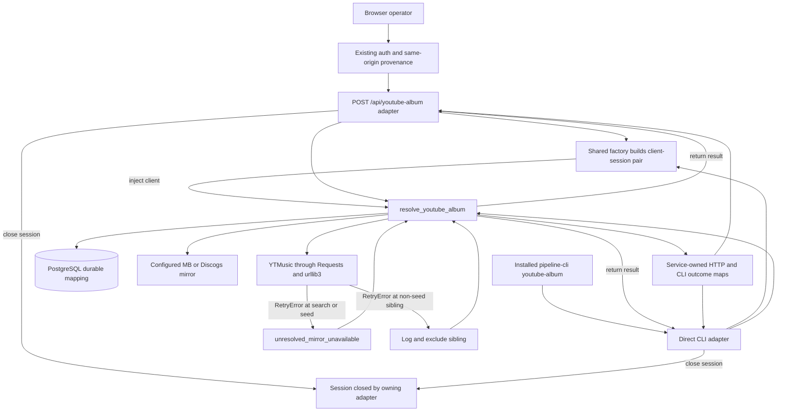

# YouTube Retry and Headless Boundary - Plan

## Goal Capsule

- **Objective:** Close issue [#923](https://github.com/abl030/cratedigger/issues/923) by converting exhausted Requests status retries into the resolver's existing typed availability behavior and by fixing the headless authority design in writing and proof.
- **Behavior authority:** `lib/youtube_album_service.py` owns resolver outcomes and durable-cache fallback.
- **Transport authority:** One shared production factory owns the Requests session, urllib3 retry adapter, default timeouts, and YouTube client construction used by both adapters.
- **Surface authority:** `pipeline-cli youtube-album` remains a direct adapter over the shared service, while `POST /api/youtube-album` remains a browser mutation behind the existing web authentication and same-origin provenance boundary.
- **Execution profile:** Use test-first implementation in an isolated worktree, deliver one bounded PR, merge with a merge commit, deploy through the signed Nix pin, and close #923 only after exact-source and natural-successor verification.
- **Stop conditions:** Do not parse nested retry exception text, catch all `RequestException`, add an always-running control socket, change empty-cache semantics, tune retry/deadline policy, or make live YouTube availability a release gate.
- **Tail ownership:** The implementing agent owns focused convergence, independent review, exact-tree repository gates, PR landing, downstream deployment, live non-network-dependent smoke proof, and issue closure.

---

## Product Contract

### Summary

The resolver will treat status-retry exhaustion as an upstream availability failure instead of allowing `requests.exceptions.RetryError` to escape as a generic server error.
A previously resolved nonempty durable matrix will remain usable during a forced refresh failure, and an uncached failure will retain the existing 503/exit-5 contract.
The CLI and browser route will continue to use one service and one outcome vocabulary through separate authority channels, with the CLI remaining available when `web.enable = false`.

### Problem Frame

Both production YouTube adapters configure urllib3 to retry 429 and selected 5xx responses.
When the configured attempts are exhausted, Requests raises `RetryError`, which is neither `Timeout` nor `ConnectionError`.
The resolver does not catch that sibling exception today, so the typed availability result and durable-cache fallback can be bypassed.

Issue #921 also showed that moving `youtube-album` onto the optional web socket would break the supported default headless composition.
The current two-adapter shared-service shape already provides one canonical behavior path, but duplicated transport construction and incomplete headless-composition proof leave that decision vulnerable to drift.

### Actors

- A1. **Local operator or agent:** Runs the installed `pipeline-cli youtube-album` command under the configured database and mirror authority.
- A2. **Browser operator:** Calls the cache-writing POST route through the authenticated or explicitly insecure web gateway with valid same-origin provenance.
- A3. **Resolver service:** Reads durable mappings, calls mirrors and YouTube Music, classifies failures, and returns the canonical typed result.
- A4. **YouTube transport:** Applies the configured Requests timeout, headers, allowed methods, retry statuses, and connection-pool lifecycle.

### Requirements

#### Retry exhaustion and cache behavior

- R1. Exhausted status retries from the production YouTube transport must never escape the resolver as an untyped exception.
- R2. An exhausted status retry without a nonempty durable matrix must return `unresolved_mirror_unavailable`, HTTP 503, and CLI exit code 5.
- R3. A forced refresh that exhausts status retries with a nonempty durable matrix must return `ok`, `from_cache=true`, the exact cached matrix, and an `error_message` that exposes `unresolved_mirror_unavailable` without rewriting durable rows.
- R4. Retry exhaustion while fetching one non-seed YouTube sibling must preserve the current isolation policy by excluding only that sibling and continuing the matrix.
- R5. Existing timeout, connection, direct YT user/client, direct YT server, and parse classifications must retain their current outcomes and wrapper mappings.
- R6. Ordinary non-refresh reads must continue to distinguish an absent durable mapping from a successfully cached empty matrix, while refresh-time empty-cache fallback behavior remains unchanged.

#### CLI, API, and authority boundaries

- R7. `pipeline-cli youtube-album` and `POST /api/youtube-album` must remain thin adapters over `resolve_youtube_album` and the service-owned outcome maps.
- R8. Both production adapters must construct the YouTube client through one transport policy without a surface-specific retry or timeout fallback.
- R9. The exported NixOS module with `web.enable` left at its false default must install `pipeline-cli`, omit the web units and socket, and preserve direct `youtube-album` dispatch for a seeded durable mapping.
- R10. The browser resolver must remain a strict-body, cache-writing POST whose invalid provenance is rejected before resolver or database access.
- R11. The selected direct CLI boundary must add no daemon, TCP listener, Unix socket, role, module option, or new authentication wrapper.

#### Proof and documentation

- R12. A deterministic offline test must drive the real production Session and HTTPAdapter through status-retry exhaustion and the real resolver classification path.
- R13. A generated property must cover every configured retryable status, both configured HTTP methods, cached and uncached worlds, and a known-bad checker self-test.
- R14. Operator and security documentation must state the selected headless authority boundary, the browser mutation provenance boundary, and the typed retry-exhaustion behavior.

### Key Flows

- F1. **Uncached status exhaustion**
  - **Trigger:** A fresh or forced resolver call reaches a YouTube operation with no nonempty durable matrix.
  - **Steps:** The shared transport makes the original request and configured retries; Requests raises `RetryError`; the service catches it without inspecting nested text; the adapter maps the typed service result.
  - **Outcome:** `unresolved_mirror_unavailable`, no fabricated matrix, HTTP 503, and CLI exit 5.
  - **Covers:** R1-R2, R5, R7-R8, R12-R13.
- F2. **Cached forced-refresh fallback**
  - **Trigger:** `refresh=true` reaches the same exhausted retry path while a nonempty durable matrix exists.
  - **Steps:** The resolver retains the durable rows, classifies the upstream failure, and returns through the canonical mapping tables.
  - **Outcome:** `ok`, `from_cache=true`, byte-equivalent typed matrix content, recorded upstream failure, HTTP 200, and CLI exit 0.
  - **Covers:** R1, R3, R5-R8, R12-R13.
- F3. **Sibling isolation**
  - **Trigger:** Seed resolution succeeds, one `other_versions` fetch exhausts retries, and at least one other sibling remains healthy.
  - **Steps:** The failed sibling is logged and excluded at the existing per-sibling catch boundary; later siblings continue.
  - **Outcome:** The resolver returns `ok` with the seed and healthy siblings only.
  - **Covers:** R1, R4-R5, R12-R13.
- F4. **Headless CLI composition**
  - **Trigger:** The exported module is evaluated with web enablement unset, and the production CLI entry point is exercised against a seeded MB release-group mapping with no web socket.
  - **Steps:** Nix composition retains the installed CLI and omits web units; command dispatch opens the configured database and returns before mirror or YouTube access.
  - **Outcome:** The composition and direct-dispatch proofs jointly establish exit 0 with the seeded `ok/from_cache` JSON result and no dependency on a web service or socket.
  - **Covers:** R7-R9, R11, R14.
- F5. **Browser resolver mutation**
  - **Trigger:** A browser submits the POST route.
  - **Steps:** The web boundary validates channel and same-origin provenance before parsing and dispatch; the route calls the same service and HTTP outcome map as before.
  - **Outcome:** Valid requests retain parity, while missing or hostile provenance reaches neither the resolver nor the database.
  - **Covers:** R7-R8, R10, R14.

### Acceptance Examples

- AE1. **Real 503 exhaustion:** Given a loopback server that always returns 503, when the production retry policy is used with no durable mapping, then four requests occur and the resolver returns `unresolved_mirror_unavailable`.
  - **Covers:** R1-R2, R8, R12.
- AE2. **Generated status and method matrix:** Given each of 429, 500, 502, 503, and 504 and each configured GET/POST method at the uncached whole-operation boundary, when the real adapter exhausts retries, then every status/method world reaches `unresolved_mirror_unavailable` without parsing exception text. Generated cache-fallback and sibling-isolation worlds instead retain the branch-specific outcomes defined by AE3-AE6, independent of status and method.
  - **Covers:** R1-R2, R8, R13.
- AE3. **Nonempty fallback:** Given one persisted matrix row and `refresh=true`, when retry exhaustion occurs, then the result is `ok/from_cache`, contains the exact persisted row, records the upstream failure, and maps to API 200 and CLI 0.
  - **Covers:** R3, R7, R13.
- AE4. **Empty and absent refresh state:** Given either a cached empty matrix or no mapping and `refresh=true`, when retry exhaustion occurs, then the current non-fallback behavior remains `unresolved_mirror_unavailable` with API 503 and CLI 5.
  - **Covers:** R2, R6, R13.
- AE5. **Direct 429 classification remains distinct:** Given a direct `YTMusicServerError` whose public message identifies HTTP 429, when no transport `RetryError` occurs, then the existing `unresolved_4xx_client` result remains unchanged.
  - **Covers:** R5.
- AE6. **One sibling fails:** Given a successful seed, one exhausting sibling, and one healthy sibling, when matrix construction completes, then only the failed sibling is absent and the outcome remains `ok`.
  - **Covers:** R4, R12-R13.
- AE7. **Default headless composition:** Given `web.enable` left unset and a seeded MB release-group mapping, when the exported module and production CLI dispatch are checked, then the CLI is installed, web units and sockets are absent, and the command returns `ok/from_cache` without API, mirror, or YouTube transport.
  - **Covers:** R7-R9, R11.
- AE8. **Browser provenance remains first:** Given missing or mismatched browser provenance, when the POST route is attempted, then it returns 403 before database or resolver dispatch.
  - **Covers:** R10.

### Scope Boundaries

#### In scope

- Explicit `RetryError` classification at every YouTube service catch site where the existing behavior distinguishes whole-call failure from sibling isolation.
- One shared Requests/YTMusic construction path for the CLI and web adapters.
- Deterministic and generated offline proof through the real transport adapter.
- Existing outcome-map parity, default headless Nix evaluation plus production-dispatch proof, and browser provenance regression coverage.
- Documentation and deployment verification needed to close #923.

#### Deferred

- A status-aware transport contract using a returned final `Response` may be reconsidered only if a future requirement needs 429-specific `Retry-After` handling.
- An always-available local control service may be reconsidered only if several headless actions or a genuinely narrower operator role justify its lifecycle and authority cost.

#### Out of scope

- Parsing `RetryError.args`, `MaxRetryError.reason`, `ResponseError` text, or exception chaining for a status code.
- Changing `raise_on_status`, retry counts, backoff, timeout values, headers, allowed methods, or the retry status set.
- Changing refresh-time fallback for a cached empty matrix.
- Cooperative deadlines, proxy timeout changes, partial-matrix policy changes, or other resolver policy work removed during #921 review.
- New authentication modes, caller-provenance persistence, browser security redesign, YouTube rescue ingest, or live YouTube availability tests.

### Dependencies and Assumptions

- The pinned runtime is Requests 2.34.2, urllib3 2.7.0, and ytmusicapi 1.12.1.
- Requests supplies a prepared request but no final response on `RetryError`, so status-sensitive handling is not a stable option within the current transport contract.
- PostgreSQL `youtube_album_mappings` remains durable truth, while Redis remains a best-effort accelerator.
- The existing direct CLI database/mirror authority is accepted project policy and is not widened by this work.

### Sources and Research

- [Issue #923](https://github.com/abl030/cratedigger/issues/923) defines the retry and headless-boundary acceptance contract.
- `lib/youtube_album_service.py`, `scripts/pipeline_cli/youtube.py`, and `web/routes/youtube.py` show the shared service, duplicated transport builders, current catch sites, and canonical outcome maps.
- `tests/test_pipeline_cli_api_mutations.py`, `tests/test_web_request_security_generated.py`, `tests/test_youtube_album_service.py`, and `tests/test_nix_module.py` provide the existing parity, provenance, failure, and module-composition baselines.
- `docs/solutions/architecture/service-first-then-glue.md` and `.claude/rules/code-quality.md` establish that two thin adapters over one service satisfy CLI/API symmetry without an HTTP indirection.
- `docs/plans/2026-07-28-002-fix-web-authentication-perimeter-plan.md` and merge history for #921 establish the five-command web-socket boundary and the rejected resolver-policy expansion.
- [urllib3 2.7.0 Retry reference](https://urllib3.readthedocs.io/en/2.7.0/reference/urllib3.util.html#urllib3.util.Retry), [Requests 2.34.2 adapter source](https://github.com/psf/requests/blob/v2.34.2/src/requests/adapters.py#L708-L719), and [Requests exception source](https://github.com/psf/requests/blob/v2.34.2/src/requests/exceptions.py#L15-L31) establish the public exhausted-retry contract and lack of a final response.
- [ytmusicapi 1.12.1 request path](https://github.com/sigma67/ytmusicapi/blob/1.12.1/ytmusicapi/ytmusic.py#L224-L247) shows that the injected Requests session can raise before ytmusicapi classifies the response.

---

## Planning Contract

### Key Technical Decisions

- KTD1. **Map every exhausted status retry to `unresolved_mirror_unavailable`.**
  - Requests exposes no public final response or status on `RetryError`.
  - A coarse existing availability outcome is stable across the configured 429 and 5xx worlds and preserves HTTP 503 and CLI exit 5.
  - Cache fallback exposes the failure through the existing result `error_message` and adapter response/log path; it does not persist outage state or rewrite the cached matrix.
  - Parsing nested exception text is rejected because it depends on undocumented Requests/urllib3 composition.
  - Governs R1-R3 and R5.
- KTD2. **Retain two direct adapters over the shared resolver service.**
  - This is already a canonical one-path architecture under the repository's CLI/API symmetry rule.
  - The installed operator CLI already has broader direct PostgreSQL authority, so a resolver socket would not narrow that principal.
  - An always-running socket would add a privileged process, socket group, lifecycle, failure dependency, and authentication contract for behavior the shared service already centralizes.
  - Browser and CLI channels never fall back to each other.
  - Governs R7, R9, and R11.
- KTD3. **Extract only the production YouTube transport factory.**
  - Move the duplicated Session, HTTPAdapter, Retry, timeout, header, and YTMusic construction into one leaf `lib/` composition module that depends only on Requests, urllib3, and ytmusicapi.
  - Each adapter depends on the factory and the service, owns the returned client/session pair, injects the client into `resolve_youtube_album`, and closes the session in its existing `finally` path.
  - The service continues to accept an injected `yt_client` and imports neither adapter nor the production factory.
  - Do not combine the surface-specific Redis adapters or add a general HTTP abstraction.
  - Governs R8.
- KTD4. **Preserve cache policy exactly.**
  - A non-refresh cached `[]` remains a successful ordinary cache hit because `None` and `[]` carry different durable meanings.
  - Refresh-time fallback remains restricted to a nonempty matrix, matching the current service and the scope correction in #921.
  - Governs R3 and R6.
- KTD5. **Match `RetryError` to each existing failure boundary.**
  - The outer YouTube operation boundary converts exhaustion to the typed availability result and durable-cache fallback.
  - The per-sibling `get_album` boundary logs and excludes the failed sibling, matching the existing Timeout and ConnectionError isolation behavior.
  - A broad `RequestException` catch is rejected because it would absorb unrelated SSL, proxy, URL, and HTTP failures.
  - Governs R1, R4, and R5.
- KTD6. **Qualify the real transport offline.**
  - A loopback `ThreadingHTTPServer` supplies deterministic retryable responses to the production shared Session and HTTPAdapter.
  - Tests suppress only urllib3's sleep leaf and disable ambient proxy inheritance for loopback requests.
  - The property asserts attempts and application outcomes, not private exception strings.
  - Governs R12-R13.
- KTD7. **Use the smallest composed headless proof.**
  - Extend the existing Nix evaluation to import the exported module, leave `web.enable` unset, assert unconditional CLI installation, and assert that web services and sockets are absent.
  - Pair that composition proof with the existing production command-dispatch test and service cache short-circuit pins.
  - A second VM would duplicate local PostgreSQL, migrations, and module boot for unchanged runtime behavior; issue #923 requires that extra VM and caller-role matrix only if a new socket boundary is selected.
  - Governs R9 and R11.

### High-Level Technical Design

This diagram shows ownership and failure propagation.
It is a boundary map, not a prescription for exact imports or function signatures.



The authority channels remain separate:

| Channel | Principal and authority | Service path | Fallback |
|---|---|---|---|
| Local CLI | Operator process with configured PostgreSQL and mirror access | Direct adapter injects collaborators into the shared service | None |
| Browser | Authenticated or explicitly insecure gateway plus same-origin provenance | Web process injects collaborators into the shared service | None |

The transport factory reuses policy and constructs collaborators; it grants no authority and owns no request lifecycle.

The cache and retry result matrix is:

| Durable mapping | Refresh | Exhausted retry result |
|---|---:|---|
| Nonempty | `false` | Existing `ok/from_cache` short-circuit; no upstream call |
| Empty `[]` | `false` | Existing `ok/from_cache` empty-matrix short-circuit; no upstream call |
| Absent | `false` | Upstream call occurs; exhaustion returns `unresolved_mirror_unavailable`, empty result, HTTP 503, CLI 5 |
| Nonempty | `true` | `ok/from_cache`, exact matrix, recorded availability failure, HTTP 200, CLI 0 |
| Empty `[]` or absent | `true` | `unresolved_mirror_unavailable`, empty result, HTTP 503, CLI 5 |

### System-Wide Impact

- **Service behavior:** One missing exception classification is added without changing the outcome vocabulary or persistent schema.
- **Adapter parity:** Both adapters use one transport policy and keep their current result mappings and session-close ownership.
- **Durable data:** No migration, backfill, cache invalidation, mapping rewrite, or persisted outage audit is required; failure detail remains in the existing result and response/log path.
- **Browser security:** The POST and same-origin admission path stay unchanged and remain earlier than resolver or database dispatch.
- **Headless NixOS composition:** Existing evaluation and command-dispatch tests are strengthened; the module and flake gain no option, service, socket, group, or second VM check.
- **Operations:** Live verification uses a durable cache hit and exact deployed-source evidence rather than an upstream outage or availability assumption.

### Risks and Mitigations

| Risk | Mitigation |
|---|---|
| The implementation recovers a status by parsing nested exception text. | KTD1 requires a coarse existing outcome and tests assert no status-sensitive application result. |
| Generated retry tests become slow or flaky because of real backoff. | KTD6 patches only urllib3 sleep, uses loopback, disables ambient proxies, and closes the server/session deterministically. |
| Transport extraction changes timeout, headers, retry count, methods, or close behavior. | Characterize the production factory before extraction and assert exact policy plus closure on success, typed failure, and unexpected failure. |
| An outer catch regresses sibling isolation. | Pin F3 separately through the real adapter and include `RetryError` at the per-sibling boundary. |
| Headless proof accidentally exercises a mirror or YouTube endpoint. | Seed an MB release-group durable mapping and use a non-refresh production CLI dispatch that returns before external calls. |
| Nix evaluation proves only text while command tests prove only dispatch. | Pair exported-module evaluation with the existing production entry-point test and live deployed-wrapper cache smoke. |
| Dependency upgrades change the public exception contract. | The real-adapter test fails at the public `RetryError` boundary without depending on nested exception structure. |

### Sequencing

1. Write the deterministic pin, generated property, invariant checker, and known-bad self-test so the escaped exception is red before production changes.
2. Extract the shared transport factory with policy-preservation coverage.
3. Add the narrow outer and per-sibling `RetryError` handling and converge all existing classification tests.
4. Prove CLI/API mapping, browser provenance, and the default headless composition.
5. Update generated-testing, operator, module, and security documentation.
6. Run independent review, focused fuzz, final exact-tree gates, merge, deploy, verify, and close #923.

---

## Implementation Units

### U1. Pin exhausted retries through the real adapter

- **Goal:** Establish red deterministic and generated contracts for R1-R6 and R12-R13 before changing production behavior.
- **Requirements:** R1-R6, R12-R13; F1-F3; AE1-AE6.
- **Files:**
  - `tests/test_youtube_transport.py`
  - `tests/test_youtube_album_service.py`
  - `tests/test_youtube_album_service_generated.py`
  - `tests/fakes/ytmusic.py`
- **Approach:**
  - Add a reusable loopback-server fixture in the transport test module whose handler returns one selected retryable status for GET or POST and counts attempts.
  - Characterize both existing production builders before extraction, then construct the real production session/adapter, delegate the minimal test YT client operation through that session, and call the real resolver.
  - Keep deterministic pins for uncached exhaustion, nonempty refresh fallback, direct 429 classification, and per-sibling isolation.
  - Generate the configured status, configured method, cache posture, and operation site while using one invariant checker.
  - Add known-bad observations for escaped/generic failure, wrong typed outcome, wrong fallback, and bypassed attempt count.
  - Update the fake's documented exception list to include `requests.RetryError` without adding fake behavior.
- **Test scenarios:**
  - Non-refresh nonempty and persisted-empty cache hits make zero YouTube requests.
  - 503 GET with no durable mapping makes four requests and returns `unresolved_mirror_unavailable`.
  - 429 POST exhaustion produces the same application outcome without inspecting the status text.
  - A nonempty durable mapping plus refresh returns the exact cached matrix and recorded failure.
  - Cached `[]` plus refresh retains the existing unavailable result.
  - One sibling exhausts while another succeeds, and only the exhausting sibling is absent.
  - A direct `YTMusicServerError` for 429 remains `unresolved_4xx_client`.
  - Each known-bad observation is rejected by the checker.
- **Verification:**
  - `nix-shell --run "python3 -m unittest tests.test_youtube_transport tests.test_youtube_album_service tests.test_youtube_album_service_generated -v"`
  - Before U2, the real exhausted-retry integration cases fail because `RetryError` escapes while the checker self-tests pass.
- **Dependencies:** None.

### U2. Centralize transport construction and classify retry exhaustion

- **Goal:** Make the U1 contracts green with one transport policy and narrow exception handling.
- **Requirements:** R1-R8; F1-F3; AE1-AE6.
- **Files:**
  - `lib/youtube_transport.py`
  - `lib/youtube_album_service.py`
  - `scripts/pipeline_cli/youtube.py`
  - `web/routes/youtube.py`
  - `tests/test_youtube_transport.py`
  - `tests/test_youtube_album_service.py`
  - `tests/test_youtube_album_service_generated.py`
  - `tests/test_pipeline_cli.py`
  - `tests/web/test_routes_youtube.py`
- **Approach:**
  - Move the exact duplicated production client/session factory into the leaf `lib/youtube_transport.py` module under KTD3.
  - Keep each adapter responsible for closing the returned session in its existing `finally` path.
  - Catch `requests.RetryError` explicitly at the whole-operation boundary and map it under KTD1.
  - Add the same exception to the existing per-sibling isolation tuple under KTD5.
  - Preserve the current fallback condition, outcome maps, direct YT exception classifier, and every transport-policy value.
- **Test scenarios:**
  - Both adapters call the same factory and retain identical session policy.
  - Sessions close after success, typed resolver failure, and an unexpected resolver exception.
  - Every U1 retry world turns green.
  - Existing timeout, connection, YT user, YT server 429/5xx, generic YT, and parse cases remain unchanged.
  - HTTP and CLI mapping dictionaries retain identity with the service-owned tables.
- **Verification:**
  - `nix-shell --run "python3 -m unittest tests.test_youtube_transport tests.test_youtube_album_service tests.test_youtube_album_service_generated tests.test_pipeline_cli tests.web.test_routes_youtube -v"`
- **Dependencies:** U1.

### U3. Prove the retained headless composition and browser boundary

- **Goal:** Demonstrate that the selected architecture remains present in the exported default NixOS composition and preserves browser mutation provenance.
- **Requirements:** R7-R11 and R14; F4-F5; AE7-AE8.
- **Files:**
  - `tests/test_pipeline_cli_api_mutations.py`
  - `tests/test_nix_module.py`
  - `tests/test_web_request_security_generated.py`
  - `tests/web/test_routes_youtube.py`
  - `docs/debugging-cli.md`
  - `docs/nixos-module.md`
  - `docs/security-audit-2026-07-12.md`
- **Approach:**
  - Extend the Nix evaluation fixture to import the exported module, leave `web.enable` unset, and assert that `pipeline-cli` remains installed while web service/socket definitions are absent.
  - Retain the existing command-routing pin that proves a missing optional web socket never causes HTTP transport or fallback.
  - Seed a nonempty MB release-group mapping in the production-dispatch test and assert that the service returns before mirror or YouTube transport.
  - Re-run the existing request-security generated boundary and route contracts rather than creating a second provenance mechanism.
  - Document why shared-service adapters were selected over a control socket and keep browser POST provenance separate from direct local CLI authority.
- **Test scenarios:**
  - The exported default module composition contains the installed CLI but no `cratedigger-web.service`, `cratedigger-web.socket`, or backend socket.
  - Production CLI dispatch returns the seeded `ok/from_cache` JSON matrix with exit 0 and no API, mirror, or YouTube dependency.
  - The CLI direct command never calls the API transport when the web socket is missing.
  - A bad browser Origin/Referer is rejected before resolver or database access.
  - A valid browser POST and the CLI preserve the service's exact result fields and mapping tables.
- **Verification:**
  - `nix-shell --run "python3 -m unittest tests.test_pipeline_cli_api_mutations tests.test_nix_module tests.test_web_request_security_generated tests.web.test_routes_youtube -v"`
- **Dependencies:** U2.

### U4. Document, review, land, and verify issue #923

- **Goal:** Finish the generated-test registry, independent review, exact-tree validation, deployment, and live closure without depending on live YouTube availability.
- **Requirements:** R12-R14.
- **Files:**
  - `docs/generated-testing.md`
  - `.claude/rules/test-fidelity.md`
  - The U1-U3 files changed by review findings
  - In `nixosconfig`: `flake.lock` and the signed Cratedigger pin commit
- **Approach:**
  - Register the generated retry invariant and update the real external-exception contract to include `RetryError`.
  - Obtain fresh independent correctness, testing, maintainability, and boundary reviews after focused tests are green.
  - Resolve every validated finding, remove abandoned experiments, and commit the converged tree before final gates.
  - Push one bounded PR using `Refs #923`, merge with a merge commit, create the signed Forgejo pin, and deploy through the locked fleet workflow.
  - Verify exact active source and a natural successor cycle, then smoke the live CLI and API from an existing durable mapping without `refresh`.
- **Test scenarios:**
  - The generated-test registry names the real production boundary, invariant, and known-bad qualification.
  - The final diff contains no control-socket work, retry tuning, empty-cache change, private exception parsing, or restored #921 deadline policy.
  - Live smoke returns typed cached data from both surfaces without requiring upstream YouTube access.
- **Verification:**
  - The Verification Contract below is satisfied on the committed tree.
  - Deployment evidence identifies the merge commit, signed downstream pin, active source, fresh invocation, and successful natural successor cycle.
  - #923 is closed only after the live evidence is attached or linked.
- **Dependencies:** U1-U3.

---

## Verification Contract

### Focused red/green convergence

| Gate | Command | Proves |
|---|---|---|
| Transport, resolver, and generated retry contract | `nix-shell --run "python3 -m unittest tests.test_youtube_transport tests.test_youtube_album_service tests.test_youtube_album_service_generated -v"` | Exact shared transport policy, real RetryError classification, cache matrix, sibling isolation, regression classifications, and checker qualification |
| Adapter and browser parity | `nix-shell --run "python3 -m unittest tests.test_pipeline_cli tests.test_pipeline_cli_api_mutations tests.web.test_routes_youtube tests.test_web_request_security_generated -v"` | Shared mappings, headless routing, session lifecycle, and provenance-before-dispatch |
| Nix composition assertions | `nix-shell --run "python3 -m unittest tests.test_nix_module -v"` | Default web-disabled composition remains valid and installs the intended package surface |
| Focused randomized property burst | `nix-shell --run "bash scripts/fuzz_burst.sh tests.test_youtube_album_service_generated"` | Fresh status/method/cache worlds preserve the invariant beyond the deterministic suite profile |

### Independent review

- Review correctness at the outer and per-sibling exception boundaries.
- Review test fidelity to confirm that the production Session and HTTPAdapter, not a fabricated `RetryError`, produce the observed exception.
- Review maintainability to keep the extraction limited to one YouTube transport factory.
- Review security and agent parity to confirm that browser provenance and direct CLI authority remain distinct and no fallback path appears.
- Re-run affected focused tests after every accepted review change.

### Final receipt-backed exact-tree gates

After review convergence, commit the isolated worktree and confirm it is clean.
Invoke the repository `check` workflow so both receipts bind to the same exact HEAD:

```bash
scripts/run_final_gate.sh pyright
scripts/run_final_gate.sh tests
```

Direct `nix-shell` Pyright and full-suite runs remain available whenever they add development feedback, but they do not replace these final receipts.
Any code or documentation change after either receipt requires a new commit, renewed review as appropriate, and a fresh receipt pair before the first push.

### Landing and deployment

- Push one bounded branch and open a PR that references #923 without an auto-closing keyword.
- Merge through GitHub with a merge commit after review convergence.
- Pin the merged Cratedigger revision in `nixosconfig` with a signed Forgejo commit and deploy doc2 through the locked fleet trigger.
- Verify health and migrations, the exact active Cratedigger source, a fresh deployed invocation, and one natural successor cycle because `restartIfChanged=false`.
- Select an existing durable YouTube mapping and smoke `pipeline-cli youtube-album ... --json` plus the authenticated POST route without `refresh`.
- Treat upstream YouTube reachability, a forced outage, and a live refresh as observations only, never release gates.

---

## Definition of Done

### Global

- R1-R14 and AE1-AE8 are traceable to passing implementation and verification evidence.
- No `RetryError` from a configured status-retry exhaustion path escapes as a generic server error.
- Cached and uncached outcomes use the existing typed vocabulary and exact HTTP/CLI mappings.
- The CLI remains independent of the optional web socket with no fallback, while browser provenance remains enforced before dispatch.
- The implementation adds no migration, new authority boundary, retry-policy change, empty-cache policy change, or live availability gate.
- The diff contains no dead-end socket, deadline, parser, transport, or test experiments.
- Independent review findings are resolved or explicitly rejected with evidence.
- Exact committed-tree Pyright and full-suite receipts pass before first push.
- The PR is merge-committed, the signed Nix pin is deployed, exact-source and natural-successor evidence is green, and #923 is closed.

### Per unit

- **U1:** The real-adapter deterministic pin, generated status/method/cache property, sibling scenario, and known-bad checker are present and initially expose the missing production classification.
- **U2:** One transport factory serves both adapters, every relevant catch site handles `RetryError` narrowly, and existing classifications plus session lifecycle remain green.
- **U3:** Exported-module evaluation proves default CLI installation and absent web units/socket, while production dispatch, CLI/API, and provenance contracts remain green.
- **U4:** The generated-test and external-exception documentation are current, exact-tree gates and deployment proof are complete, and issue #923 carries closure evidence.
