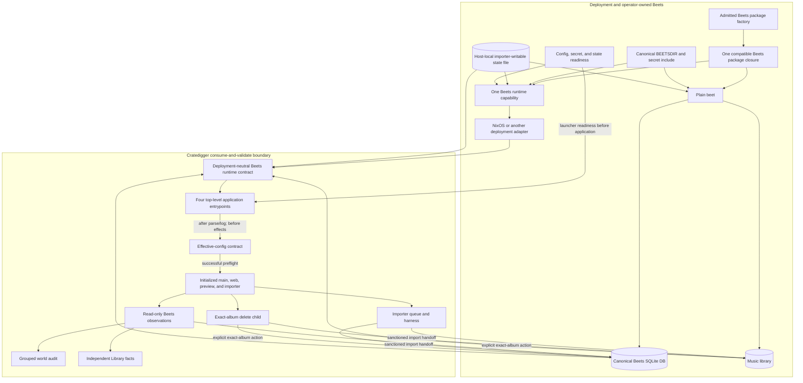
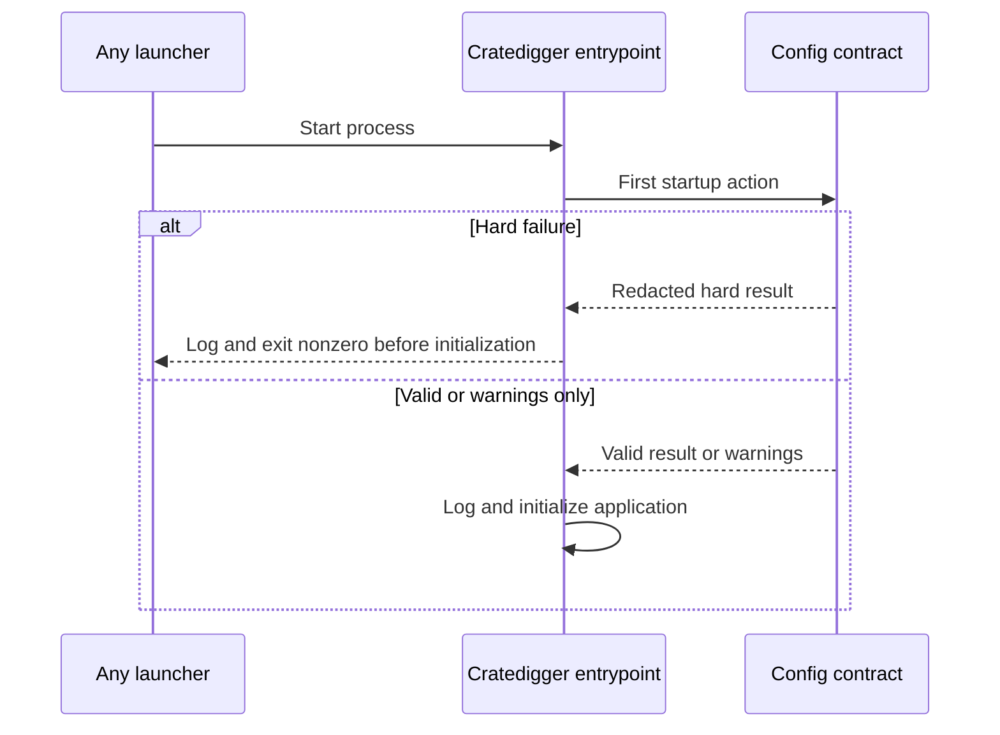
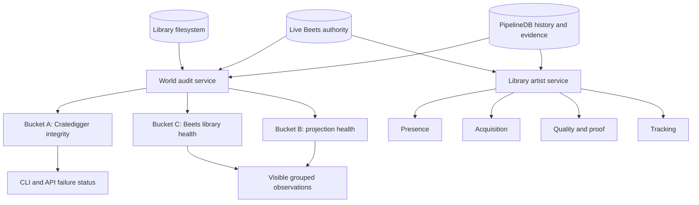

# Cratedigger-Beets Ownership Boundary - Plan

## Goal Capsule

- **Objective:** Close [issue #759](https://github.com/abl030/cratedigger/issues/759) by making external Beets ownership a portable enforced boundary, then finish the secondary audit and Library UI semantics that make that boundary observable.
- **Library authority:** Beets and the deployment own the package, effective configuration, canonical SQLite database, library files, current release identities, paths, tags, and operator maintenance.
- **Acquisition authority:** Cratedigger owns exact requested identity, acquisition lifecycle, durable witnessed capture history, quality proof, and the two sanctioned handoffs that may mutate Beets; KD10 records the accepted status-only legacy exception.
- **Shipped baseline:** PR #800 already removed `album_requests.imported_path`, established live exact-identity resolution, and implemented lazy content-addressed evidence refresh with carried acquisition proof; this plan preserves that model instead of adding another projection or schema.
- **Execution profile:** Deliver the portable contract and startup-only preflight first, land the breaking Nix module inversion with its documentation, land audit/UI behavior as a separate reviewable slice, then commit and deploy the matching nixosconfig cutover.
- **Stop conditions:** Stop if implementation requires moving or recreating the Beets database, adding a holdings table or scheduled reconciler, inferring sibling pressings, reopening imported requests automatically, adding a third Beets mutation lane, weakening strict release identity, or running `beet move`.
- **Tail ownership:** The implementation owns focused and generated proof, independent review, receipt-backed Cratedigger gates, signed downstream pinning, doc1 and doc2 cutover, exact active-source proof, a naturally timer-started successor pipeline cycle, and issue closure.

---

## Product Contract

### Summary

Cratedigger will consume an operator-owned Beets package and runtime authority instead of rendering and presenting Beets as Cratedigger-owned infrastructure.
A reusable deployment-neutral validator will inspect the effective active Beets configuration once inside each Beets-dependent application entrypoint, before any application work.
The validator will fail startup on known safety conflicts, write a useful explanation to the process log, and otherwise remain completely outside pipeline, job, request, audit, and child-process state; its owned fields never emit a valid token, but native parser diagnostics are not wrapped in a bespoke redactor. NixOS is one adapter for this application contract, not its enforcement owner.
The world audit will separately group Cratedigger integrity failures, stale or unavailable Beets projections, and Beets-owned library observations.
The Library UI will display presence, acquisition, quality, and tracking as independent facts.

### Problem Frame

The current NixOS module builds Beets, renders its configuration and secret include, provisions the database parent, and installs `cratedigger-beet`.
That wiring makes package consistency easy, but it encodes the wrong ownership statement: valid out-of-band Beets maintenance appears as Cratedigger drift, while an operator changing the configuration can invalidate import safety without a portable guard.

The existing `lib/beets_config_contract.py` only approximates include precedence with direct YAML reads.
Beets and Confuse own the effective configuration semantics, and Beets deliberately logs some include errors and continues.
A destructive safety boundary therefore needs both an explicit include-readability check and validation of the effective Confuse view from the exact package that will run the mutation.

The current world-audit report flattens all findings into one violation count and one failing exit status.
That makes an out-of-band retag, unavailable holding, or librarian-owned filesystem problem look equivalent to broken Cratedigger proof policy.
The current Library row also lacks the evidence fields needed to render the settled fact vocabulary without composite badges.

### Actors

- A1. **Operator or deployment owner:** Selects the Beets package, owns the active `BEETSDIR`, maintains the library with plain `beet`, and supplies the immutable runtime contract plus the canonical database, library root, and importer-writable Beets state-file paths to Cratedigger.
- A2. **Cratedigger services:** Read current Beets authority, validate the external contract, search and acquire exact pressings, and surface typed failures without taking library ownership.
- A3. **Importer harness:** Performs the only automatic Beets mutation after the exact automation owner and evidence gates authorize launch.
- A4. **Explicit destructive service:** Performs Bad Rip, Replace, or library-delete through the exact-album delete child after the canonical service authorizes the action.
- A5. **Librarian:** Interprets Bucket C observations and may retag, move, or delete with Beets without rewriting Cratedigger acquisition history.
- A6. **Audit and UI consumer:** Reads grouped ownership findings and independent album facts through the CLI, API, and Library view.

### Key Product Decisions

- KD1. **Beets owns the live library; Cratedigger owns acquisition history.** Current Beets state is external mutable authority, while exact request identity and successful capture proof are durable Cratedigger facts. Governs R1-R4 and R15.
- KD2. **The three-fact model has no persisted holdings projection.** Acquisition achievement lives on the request and evidence records, current holding resolves live by exact release identity, and installed quality refreshes lazily only at decision gates. Governs R15-R17.
- KD3. **Verified-lossless proof is a permanent acquisition achievement.** Path changes, tag edits, byte changes, retags, and deletions do not erase carried source-subject proof; only an explicit operator action reopens acquisition. Governs R15-R17.
- KD4. **A sibling retag is not inferred.** The old exact request becomes Captured plus Missing and the new held identity becomes Untracked; no release-group correlation, acknowledgement state, or identity-drift badge is added. Governs R15-R17.
- KD5. **World-audit ownership uses Buckets A, B, and C.** `(session-settled: user-directed — chosen over collapsing ambiguous identity and fingerprint observations into one failure class: each finding must be assigned to the system that owns it.)` The complete mapping is:

  | Bucket | Meaning | Codes |
  |---|---|---|
  | A | Cratedigger integrity; alarm and failing status | `proof_lock_broken`, `lossy_tier_widened`, `denylist_without_authority`, `current_evidence_dangling`, `evidence_release_mismatch`, `evidence_capture_path_missing`, `request_identity_missing` |
  | B | Current-holdings projection health; visible but informational | `current_beets_missing`, `current_beets_ambiguous`, `current_beets_authority_unavailable`, `evidence_fingerprint_mismatch`, `evidence_link_without_album`, `current_evidence_missing`, `album_fingerprint_unavailable` |
  | C | Beets/library health; visible for librarian judgment | `album_empty`, `item_outside_album_folder`, `folder_shared`, `album_folder_missing`, `album_item_missing`, `beets_identity_missing` |

  Governs R13-R14.
- KD6. **Library badges remain one family per fact.** `(session-settled: user-directed — chosen over a row-level “Holding unknown” state: a failed Beets read is a broken world that logs loudly and returns an HTTP/API error without changing album-request state.)` Presence, acquisition, quality/proof, and tracking are independent; no composite identity-drift or authority-error state is introduced. Governs R15-R17.
- KD7. **Reject only named harness conflicts.** `(session-settled: user-directed — chosen over a blanket ban on all automatic Beets plugin hooks: only automation proven to conflict with the harness is rejected.)` `convert.auto` and `convert.auto_keep` are the initial hard conflicts when the `convert` plugin is active, while metadata and artwork hooks such as fetchart, embedart, scrub, lyrics, and lastgenre remain supported. Governs R5-R8.
- KD8. **The runtime secret include is token-only.** `(session-settled: user-directed — chosen over allowing an arbitrary mutable Beets overlay: the secret file may contain exactly `discogs.user_token` and no other key.)` Deployments supply a scalar secret and encode it into that fixed schema without string interpolation, so YAML-shaped token content remains a token value. A token rotation restarts the guarded applications through the existing startup boundary; it does not create a live reload or another checker. Governs R5-R8 and R12.
- KD9. **Do not build a parser-diagnostic redaction layer.** `(session-settled: user-directed — malformed operator-supplied configuration may use the underlying YAML/Confuse diagnostic even if it includes source context; operators own their configuration and log handling.)` Cratedigger still never places a valid token in its typed report, fingerprint, or owned messages, and the supported Nix deployment always generates syntactically valid fixed-schema secret YAML. Governs R8-R10.
- KD10. **Do not preserve status-only legacy capture across an explicit reopen.** `(session-settled: user-directed — the two known imported rows without a durable success witness may show Captured while `status='imported'`; if the operator reopens one, reacquiring the files and producing ordinary evidence is acceptable.)` Witnessed captures remain durable, but this issue adds no migration, backfill, or special legacy witness solely for those rows. Governs R15-R17 and KTD7.

### Requirements

#### Ownership and authority

- R1. The public NixOS module must consume an external Beets package, `BEETSDIR`, canonical database path, library root, absolute importer-writable state-file path, and designated token-only secret-include path without rendering Beets configuration, materializing Beets secrets, provisioning Beets-owned storage, or installing an operator wrapper.
- R2. Cratedigger's deployment-neutral runtime configuration must be deployment-owned and immutable to every application identity. Its `[Beets]` contract must name six authorities: config directory, library database, library root, state file, Beets Python interpreter, and designated secret include; the application, harness, read-only Beets access, validator, and operator `beet` must resolve one admitted Beets Python runtime and one effective configuration authority. NixOS proves store-closure identity, while another packager must provide equivalent runtime identity without changing the application contract.
- R3. The canonical database must remain at `/mnt/virtio/cratedigger/beets-db/beets-library.db`, with no copy, reinitialization, compatibility database, path rewrite, or `beet move` during cutover.
- R4. Cratedigger may mutate Beets only through the importer harness and explicit operator-authorized exact-album deletion; every other Beets path remains read-only observation.

#### Portable Beets configuration contract

- R5. The public checker must reject an absent, unreadable, malformed, semantically invalid, or application-writable non-secret main config or declared include before Beets can suppress the failure and continue with defaults or the application can mutate its own admitted contract. Exactly one resolved Beets include must equal the contract's designated secret-include path; zero or multiple matches are hard failures, every other include must be immutable to the application identity, and the designated file must be a mapping containing exactly `discogs.user_token`. Any sibling, nested extra, duplicate, or alternate top-level key is a hard failure before effective-config loading.
- R6. The checker must validate the effective Beets/Confuse configuration from the exact active package rather than reproduce merge and precedence behavior with a custom YAML merger.
- R7. A hard contract failure must cover a missing or unavailable `musicbrainz` plugin; a missing, empty, or whitespace-only effective `discogs.user_token` when the `discogs` plugin is active; album duplicate keys other than exactly `mb_albumid` plus `discogs_albumid`; an unproved album-directory template; mismatched database, library, or state-file paths; a state-file path that is relative, inside `BEETSDIR`, absent, non-regular, writable by a non-importer application, or not writable by the importer; effective `import.autotag`, `import.move`, or `import.write` other than `true`; a missing `permissions` plugin or effective file/directory modes other than `0664`/`02775`; and every named import-time harness conflict from KD7.
- R8. MusicBrainz endpoint drift must produce a visible warning without blocking startup. Typed results, fingerprints, and Cratedigger-owned messages must omit token values and arbitrary effective configuration; syntax/load failures may preserve the underlying parser diagnostic and source context rather than adding a bespoke redaction layer.

#### Gate placement and failure behavior

- R9. The main pipeline, importer, preview worker, and web application entrypoints must each strictly load the required runtime configuration and invoke the same role-aware checker exactly once after argument parsing and logging setup but before the first application side effect: the main pipeline before its lock file, importer and preview worker before `PipelineDB` construction or recovery, and web before listener takeover, cache mutation, `PipelineDB`, or server construction. This placement is independent of NixOS, systemd, containers, or another launcher. Operator CLI invocations and processes spawned by an already-guarded application inherit the admitted package and configuration and do not revalidate.
- R10. A hard contract failure must log its reasons through the application's normal stderr/logger path and prevent that process from starting, with zero PipelineDB, import-job, request, Beets-database, state-file, or library-filesystem effects; systemd deployments naturally capture the same output in the journal. Owned contract failures use redacted typed fields, while an underlying parser/load failure may retain its native diagnostic under KD9.
- R11. Configuration validation must add no action-time check, child protocol, typed business outcome, audit row, retry counter, request transition, job terminalization, or other application state machine.
- R12. Startup is the complete enforcement boundary: after a successful start, Cratedigger relies on a deployment-owned runtime-configuration file and Beets configuration that are immutable to the application identity and does not revalidate until the next process start. Every deployment mechanism must restart or replace the affected top-level applications when either changes, including a token-only secret-file rotation.

#### Audit ownership reporting

- R13. The CLI and web API must return one typed report with separate A, B, and C counts and members, an explicit completeness signal, and a status whose failure semantics depend only on Bucket A.
- R14. Expected Beets authority unavailability must become a typed Bucket B observation instead of bypassing the grouped report, while unexpected programmer or protocol failures may retain transport-level errors.

#### Library fact vocabulary

- R15. Library and browse projections must carry `has_captured_history` from durable successful download/import witnesses plus the current `status='imported'` legacy fallback, together with the linked current-evidence facts needed to render carried Verified Lossless and provisional state without inferring acquisition from installed media. The witnessed subset remains durable across later status changes; the accepted status-only fallback expires if the operator explicitly reopens that legacy request under KD10.
- R16. The shared badge renderer must show Captured for durable imported history or a currently imported legacy fallback, Missing only after a successful Beets read proves such a captured request is not currently held, Untracked only after that read proves a held album has no request, and Replaced for superseded acquisition history.
- R17. Current quality band and Verified Lossless must remain separate from presence and acquisition, including when art or tag fingerprint drift requires installed-fact refresh; a failed Beets read must return an HTTP/API error and log loudly, without changing album-request state or manufacturing Missing, Untracked, installed-quality, or “Holding unknown” state.

#### Documentation and operational cutover

- R18. Public documentation, examples, comments, and shared agent instructions must describe consume-and-validate ownership, plain operator `beet`, the two mutation lanes, and the limits of validation under concurrent external maintenance.
- R19. The downstream nixosconfig Beets module must own package selection, immutable non-secret configuration, scalar runtime-token delivery plus fixed-schema secret-include rendering, one host-local writable `/var/lib/beets/state.pickle` on each host, and plain `beet` on both doc1 and doc2, while its Cratedigger wrapper passes those values into the public module and six-field `[Beets]` runtime contract. Doc2 alone must own the shared database-parent ownership and permissions; doc1 only consumes the catalog through the existing shared group.
- R20. Closure requires one Beets package store identity and matching contract fingerprints on doc1 and doc2, a successful deployment-only standalone check from the exact candidate closure against each host's exact candidate authority before any guarded application is released, unchanged database identity and representative rendered paths, exact deployed Cratedigger source, fresh guarded worker invocations, and one naturally timer-started successor `cratedigger.service` cycle.

### Key Flows

- F1. **Application startup validation**
  - **Trigger:** A top-level Cratedigger application that reads Beets or can initiate a Beets mutation starts under any deployment mechanism.
  - **Steps:** After side-effect-free argument parsing and logging setup, the application strictly loads the required deployment-neutral runtime configuration and invokes the shared checker with its role. The checker validates declared files, the role's permitted state-file access, and the exact active effective configuration, then emits a typed result whose owned fields are redacted; native parser failures may retain their normal diagnostic.
  - **Outcome:** Hard failures are logged and terminate the application before initialization; warnings are logged and startup continues. No application state is read or written to record the result.
  - **Covers:** R5-R12.
- F2. **Ordinary work after a valid start**
  - **Trigger:** A guarded process has passed startup validation.
  - **Steps:** Existing read, match, import, and exact-delete ownership and lifecycle behavior runs unchanged after obsolete child-side configuration checks and checker-specific child outcomes are removed.
  - **Outcome:** The configuration checker creates no new action boundary or business outcome.
  - **Covers:** R2, R4, and R9-R12.
- F3. **Startup failure and correction**
  - **Trigger:** A guarded process starts with an unsafe effective configuration.
  - **Steps:** The checker logs the hard failures and exits nonzero before application startup. Owned fields remain redacted, while parser/load failures may use their native diagnostic. The deployment owner corrects the external configuration and starts the process again.
  - **Outcome:** The next successful startup resumes normal work; no pipeline cleanup or recovery state is needed because no work began.
  - **Covers:** R9-R12.
- F4. **Grouped world audit**
  - **Trigger:** The operator, CLI, or API invokes the cross-engine audit.
  - **Steps:** Every finding is classified through the exhaustive KD5 map, expected authority outages become typed incomplete observations, and the report derives its status and exit contract from Bucket A.
  - **Outcome:** B/C-only worlds remain visible and exit successfully; any A finding alarms.
  - **Covers:** R13-R14.
- F5. **Library artist rendering**
  - **Trigger:** The Library artist endpoint merges live Beets albums with pipeline history.
  - **Steps:** After a successful Beets read, the service joins current evidence, preserves live presence and quality, and passes independent acquisition and tracking facts to the shared renderer. A failed Beets read returns an HTTP/API error and logs the broken world without changing album-request state.
  - **Outcome:** Retags, deletions, upgrades, carried proof, and untracked holdings display without a composite or unknown-authority state, and read failures never masquerade as absence.
  - **Covers:** R15-R17.
- F6. **Cross-repository cutover**
  - **Trigger:** All Cratedigger slices are merged and the downstream pin is ready to move.
  - **Steps:** nixosconfig introduces system-level Beets ownership, removes the Home Manager owner and `cratedigger-beet`, verifies unchanged paths and database identity, then deploys doc1 before doc2 while each host's guarded applications remain held. On each host, run the candidate closure's standalone checker once against its exact candidate runtime config, `BEETSDIR`, package, database/root, secret include, and state path, recording only redacted output.
  - **Outcome:** Release the applications only after the deployment-only check passes; otherwise keep them held and roll back or correct the composition. This adds no service, `ExecStartPre`, scheduled job, or second runtime enforcement path. Both hosts expose plain `beet` and the same redacted contract fingerprint; doc2 resumes on the exact reviewed source without moving the library.
  - **Covers:** R1-R3 and R18-R20.

### Acceptance Examples

- AE1. **Unreadable or malformed include:** Given a declared include that is absent, unreadable, or malformed, when a guarded process starts, then the checker identifies the file, preserves the underlying parser/load diagnostic where applicable, and prevents application startup before Beets can fall back. No custom source-line/token redactor is required. Covers R5-R6 and R8-R12.
- AE2. **Known conflict and supported hooks:** Given the production artwork and metadata hooks plus exact permissions and import settings, the checker passes; given active `convert.auto=true`, `convert.auto_keep=true`, disabled autotag/move/write, or unsafe permissions, startup fails with a redacted process-log entry. Covers R7-R8 and KD7.
- AE3. **No application state:** Given any hard startup failure, no request, job, audit, retry, pipeline, Beets, or library state changes, and correcting the external configuration is sufficient for a later start to succeed. Covers R9-R12.
- AE4. **Startup-only enforcement:** Given a successful process start, no action or child repeats the checker. The deployment-owned runtime contract and Beets configuration are immutable to the application identity, and the deployment restarts the top-level applications when either changes. Covers R9-R12 and R19.
- AE5. **One authority on two hosts:** Given the completed cutover, plain `beet version` and the redacted checker report identify the same package, `BEETSDIR`, database, library root, state-file path, and contract fingerprint on doc1 and doc2; the identical state-file path names separate host-local files. Covers R1-R3 and R19-R20.
- AE6. **Audit ownership:** Given only B and C findings, the CLI exits zero and the API returns a grouped report with those findings; adding one A finding changes the report and CLI to failure without hiding B or C. Covers R13-R14.
- AE7. **Authority outage:** Given an expected inability to open or query the canonical Beets authority, the audit returns an incomplete report with Bucket B authority-unavailable observations; an unrelated decoder or invariant bug remains a transport error. Covers R13-R14.
- AE8. **Independent album facts:** The UI pins held plus tracked Verified Lossless, Captured plus Missing, held plus Untracked, wanted while held for upgrade, Replaced history, and fingerprint drift that retains carried Verified Lossless. A failed Beets read returns an HTTP/API error and logs loudly instead of emitting presence or installed-quality badges or changing album-request state. Covers R15-R17.
- AE9. **Out-of-band retag or deletion:** A sibling retag renders the old request as Captured plus Missing and the new identity as Untracked; deletion renders Captured plus Missing and never changes the request back to `wanted`. Covers KD2-KD4 and R15-R17.
- AE10. **No data migration:** The shipped PostgreSQL schema and evidence lineage remain unchanged, and no new persisted product state is introduced. Covers R13-R17.
- AE11. **Deployment-neutral startup:** Given the same immutable runtime contract outside systemd/NixOS, direct startup of each of the four top-level applications performs the same single role-aware preflight and exits before initialization on a hard failure. A missing or malformed runtime-config file is itself a hard startup failure rather than the permissive defaults used by optional library callers. Covers R2 and R9-R12.
- AE12. **Importer-only state capability:** Given an immutable `BEETSDIR` and an absolute externally provisioned state file, a real incremental Beets import updates only that state file. The importer proves effective write access without changing its contents during preflight; the main pipeline, preview worker, and web process prove that the same file cannot be opened for writing. A relative, missing, non-regular, wrongly accessible, or config-contained state file prevents application startup without a Nix-store or config-directory write. Covers R1-R2 and R5-R12.
- AE13. **Token-only secret include:** Given exactly one resolved include matching the contract's designated secret path and containing exactly a nonempty `discogs.user_token`, startup passes without serializing the token. Zero or multiple matches, a mutable non-designated include, or adding `library`, `directory`, `statefile`, `import`, `paths`, another Discogs key, or any other YAML key hard-fails before Beets can apply the later include. A hostile scalar such as YAML-shaped multiline text is safely encoded as the token value rather than parsed as keys; replacing only the scalar token rerenders the fixed schema, restarts the guarded applications, and is admitted at their next startup. Covers KD8 and R5-R8, R12.
- AE14. **Accepted status-only legacy fallback:** Given an imported legacy request with no successful download/import-job witness, it renders Captured while imported. If the operator explicitly reopens it, Captured may disappear until the normal acquisition path succeeds and writes durable evidence; no migration or synthetic witness is created. Covers KD10 and R15-R17.

### Scope Boundaries

#### In scope

- Effective active Beets configuration validation and a packaged operator-runnable checker.
- One deployment-neutral startup-only hard preflight inside each Beets-dependent top-level application, with token-free owned result fields, ordinary native parser diagnostics, and no application state.
- The breaking public NixOS module interface that consumes external Beets ownership.
- Grouped world-audit CLI/API output and Bucket-A-only public status semantics.
- Library artist projection fields and independent badge rendering.
- Public documentation, examples, shared instructions, nixosconfig ownership, secret delivery, deployment, and live proof.

#### Out of scope

- The private doc1 daily service, its wrappers and summaries, its persisted audit-debt baseline, and all pause/deploy/compatibility/verification work for that service.
- Shipping or supporting a non-Nix installer, container image, service definition, or package in this issue; the application contract must nevertheless remain usable by those launchers.
- A PostgreSQL migration, holdings cache, acquisition backfill, path column, scheduled reconciler, or scheduled configuration audit.
- Sibling-release correlation, release-group inference, identity-drift badge, acknowledgement state, or automatic reacquisition after a Beets deletion.
- A general policy language for arbitrary Beets path templates or all future plugin automation.
- Action-time or child-time configuration checks, new checker outcomes in application protocols, and any checker-driven pipeline, job, request, retry, or audit state.
- Serializing or policing direct operator Beets commands beyond the existing filesystem/database permissions and documented safe-operation boundary.
- Moving the canonical SQLite database, rewriting paths, re-tagging the library, or running `beet move` as part of cutover.
- Adding any Beets mutation path outside the importer harness and exact-album delete child.

### Dependencies and Assumptions

- PR #800 and migration 061 are deployed and remain the state-model baseline.
- The currently admitted runtime is the Beets version built from the same package set as Cratedigger; current planning validation used pinned Beets 2.12 and Confuse 2.2. A future non-Nix packager must supply that admitted Python/plugin runtime until a separate compatibility qualification admits another build.
- Beets gives later include files higher priority, mapping keys merge, scalar and list leaves replace, and unreadable includes can be logged and suppressed.
- The mutable runtime secret include is deliberately not a general Beets overlay: its only admitted YAML shape is `discogs: {user_token: <nonempty scalar>}`.
- The current safe path contract uses `%aunique{albumartist album,path_disambig}` with a nonempty `path_disambig` fallback expression for both normal and compilation album directories.
- The operator may still mutate the shared Beets library concurrently with automation; startup validation does not create a cross-process transaction or police later library operations.
- Every supported deployment keeps non-secret `BEETSDIR` inputs immutable to the application identity and restarts or replaces the four top-level applications after a configuration revision; the NixOS adapter uses a store path and unit closure changes to satisfy that contract.
- Pinned Beets 2.12 resolves a relative or default `statefile` under `BEETSDIR` and writes it for incremental/resume history, so an immutable config directory requires a separately provisioned absolute writable state file.
- The existing advisory locks, exact owner fence, retry/self-heal semantics, and exact-album delete protocol remain authoritative after a config check passes.

### Sources and Research

- [Issue #759](https://github.com/abl030/cratedigger/issues/759) and its decision comments define the product boundary; the [2026-07-31 scope correction](https://github.com/abl030/cratedigger/issues/759#issuecomment-5143966014) makes enforcement startup-only and records the final scope boundary.
- `lib/beets_config_contract.py`, `lib/beets_delete.py`, `harness/beets_harness.py`, and `tests/test_harness_beets2_contract.py` show the current guard, real Beets load order, exact delete boundary, and path-collision proof.
- Pinned Beets 2.12 `beets/config_default.yaml`, `beets/importer/state.py`, and `test/ui/test_ui.py` establish that the default `state.pickle` resolves under `BEETSDIR` and is written for importer progress/history.
- `nix/module.nix`, `nix/package.nix`, `nix/beets.nix`, and `nix/tests/module-vm.nix` show the current ownership coupling and the public VM proof surface.
- `lib/world_invariants.py`, `lib/world_audit_service.py`, `scripts/pipeline_cli/audit.py`, and `web/routes/world_audit.py` own the flat public audit contract that must be grouped.
- `web/library_artist_service.py`, `web/library_album_row.py`, `web/routes/_overlay.py`, and `web/js/badges.js` show the missing evidence projection and the existing shared badge pattern.
- `docs/solutions/testing/idealized-destructive-tests-missed-the-beets-runtime-envelope.md` requires real-runtime guard qualification because Beets include/plugin failure can contaminate protocols and continue fail-open.
- `docs/solutions/runtime-errors/palo-santo-duplicate-keys-data-loss.md` makes exact album duplicate keys a hard safety boundary.
- `docs/solutions/runtime-errors/plex-asciify-paths-album-split.md` forbids path-affecting cutover drift and `beet move`.
- `docs/solutions/architecture/service-first-then-glue.md` supports one typed contract/audit service with thin CLI, web, systemd, and child adapters.
- `docs/solutions/ui-dev-server-screenshot-loop.md` requires live-data browser proof in addition to renderer unit tests.
- `docs/plans/2026-07-03-001-feat-tier2-packaging-plan.md` is the superseded ownership decision; its single-package, `BEETSDIR`, and path-equivalence safety goals remain useful under the inverted owner.

---

## Planning Contract

### Key Technical Decisions

- KTD1. **Build one effective-config contract service around Beets and Confuse.**
  - Add a required runtime-config loader for application startup. It must reject a missing, unreadable, or malformed file and accept the mutable runtime/state directory separately from the immutable config-file location; retain the existing permissive loader only for callers whose current optional/default behavior remains intentional.
  - Keep `lib/beets_config_contract.py` as the canonical typed service, but replace its hand-merged effective-plugin model.
  - First parse only enough declared-file structure to prove that `config.yaml` and every Beets-declared include are readable and valid according to Beets' accepted include shape. Resolve every include path, require exactly one occurrence equal to the contract's `secret_include`, require every other include to be immutable, and parse the designated file with duplicate-key rejection against the exact schema `discogs.user_token`; reject every other key before Confuse merge semantics can turn the secret into an override layer.
  - Then call the exact active Beets configuration loader and read hard-check values from its effective Confuse view.
  - Compare configured plugin names with names exposed by the package without instantiating plugin classes during standalone preflight; plugin initialization can perform network access, OAuth, input reads, or output writes.
  - Read the expected config directory, database, library root, state file, interpreter, and secret-include path from the deployment-neutral `[Beets]` runtime contract; require the effective Beets paths and resolved designated include to match after Beets resolution.
  - Return a redacted `msgspec.Struct` report with hard failures, warnings, resolved authority paths, package identity, and a contract fingerprint; never put tokens, secret-file content, or arbitrary effective config values in owned report fields. Fingerprint the admitted secret schema/path and token presence, never the token value. Do not intercept and rewrite native YAML/Confuse parser/load diagnostics solely to redact their source context.
  - Expose the service both as a standalone operator checker and as one role-aware startup function called by each top-level application in a fresh Beets-config context so global config state cannot leak across validation and application initialization. Validate the state path without changing its contents by opening it with the access expected for that role: writable for the importer, read-only and write-refusing for main, preview, and web.
  - Governs R5-R8 and R18.
- KTD2. **Accept the known-safe album path contract instead of pretending to prove arbitrary templates.**
  - Admit exact versioned literals for the effective `default` path, `comp` path, and `album_fields.path_disambig` expression, including the `inline` plugin that defines the field.
  - Continue to qualify that contract against real Beets with the Passenger collision corpus in `tests/test_harness_beets2_contract.py`.
  - Reject custom forms rather than partially interpreting Beets' template or inline-expression languages; extending the admitted literals is a future explicit contract change with its own real-Beets proof.
  - Governs R3 and R7.
- KTD3. **Keep enforcement at startup and out of application state.** `(session-settled: user-directed — chosen over action-time and in-child revalidation: block process startup, log the result, and add no other state machine.)`
  - After argument parsing and logging setup, strictly load the required runtime config and invoke the canonical service exactly once in `cratedigger.py`, `scripts/importer.py`, `scripts/import_preview_worker.py`, and `web/server.py`. In the current entrypoints this must occur before the pipeline lock file, any `PipelineDB` construction/recovery, the web listener takeover, cache invalidation, or server construction.
  - A hard result logs the redacted owned explanation or native parser/load diagnostic and terminates startup nonzero; a warning logs and permits initialization. The normal launcher captures that process output, including journald under systemd.
  - Do not call the checker from Bad Rip, Replace, library-delete, import launch, `import_one`, the nested harness, or the exact-delete child.
  - Do not add checker outcomes to CLI/API services, subprocess protocols, audit evidence, request transitions, job outcomes, retry counters, or cleanup bundles.
  - The checker makes no claim about configuration changed after process startup; every deployment must make non-secret configuration immutable to the application identity and restart the affected top-level processes when it changes.
  - Governs R9-R12.
- KTD4. **Invert the module without discarding the admitted package factory.**
  - Replace the module-owned `beets.package.*` and `beets.config.*` trees with one `services.cratedigger.beets.runtime` submodule carrying `.package`, `.configDir`, `.expectedLibrary`, `.expectedDirectory`, `.expectedStateFile`, `.expectedSecretInclude`, and `.readinessUnits`, while retaining `.validation` for staging and tracking behavior.
  - Treat effective config as runtime authority; expected database, root, and state-file values are equality assertions and sandbox declarations, never alternative selectors. Require `.configDir` to resolve to non-secret configuration that is immutable to the application identity, while `.expectedStateFile` is absolute, externally provisioned, persistent, host-local, outside `.configDir`, writable by the importer, and write-refusing for main, preview, and web.
  - Require the supplied package to use the same Python interpreter/package set as `cfg.packageSet`, and make every Cratedigger wrapper use that package and export that `BEETSDIR`.
  - Keep `nix/beets.nix` as a consumer-instantiated factory over Cratedigger's admitted package set, including opt-in Discogs and LRCLIB patches; remove language that makes the factory the owner of the library.
  - Make `nix/package.nix` require its Beets package input; the flake package output and downstream nixosconfig must each pass an explicit compatible instance from the admitted factory. This is the Nix adapter's stronger runtime-identity proof, not a field in the application-level contract.
  - Remove config/secrets rendering, Beets database tmpfiles ownership, and `cratedigger-beet` from the Cratedigger module.
  - Build every application and the standalone checker from the supplied package's module Python environment rather than allowing either to select a default Beets closure.
  - Wire `.readinessUnits` before application startup with explicit systemd dependency edges; the application entrypoint itself owns the single checker invocation. Bind the state file read-only into main, preview, and web, and grant its exact writable path only to the importer; qualify the effective denial/allowance in the VM instead of inferring it from Unix mode bits.
  - Render Cratedigger's complete non-secret runtime config, including the six `[Beets]` authority values, to an immutable Nix-store file and pass its explicit path plus the distinct mutable state directory to every application. Non-Nix launchers can supply the identical root-owned/read-only contract without importing Nix concepts; they still must package the admitted Beets Python/plugin runtime, render a scalar token safely into the designated fixed-schema include, and enforce equivalent role-based state-file access.
  - Governs R1-R3, R9, and R18-R19.
- KTD5. **Make audit classification exhaustive and transport-aware.**
  - Define one code-to-bucket registry beside the world-invariant vocabulary and derive report groups, totals, status, and CLI exit from it.
  - Every currently emitted code must appear exactly once; an unknown runtime code fails closed as Bucket A and a registry coverage test prevents deliberate additions from remaining unclassified.
  - Move Beets authority construction/query mediation into the audit service through an injected factory. Translate only the enumerated open/query availability failures at that adapter boundary into one closed typed `BeetsAuthorityUnavailable` result so the audit can emit Bucket B with `complete=false`; do not use a broad exception catch. Unexpected decoding, invariant, programming, and serialization defects remain transport failures.
  - Use report statuses that distinguish clean, observations-only, and integrity-failed worlds without reintroducing a flat all-findings alarm count.
  - Governs R13-R14.
- KTD6. **Project the facts at existing view-specific read seams, not the generic request projection.**
  - Join the request's `current_evidence_id` in the artist-view query and derive `has_captured_history` from current `status='imported'`, successful historical download outcomes (`success`, `force_import`, `manual_import`), and completed successful import jobs (`automation_import`, `force_import`, `manual_import`, `youtube_import`). Historical success witnesses are the durable subset. Current status is an accepted legacy fallback for the two known status-only rows and deliberately stops contributing if the operator reopens one; do not call the complete predicate monotonic or synthesize history for it.
  - Preserve pipeline-first then Beets read ordering and exact-identity merge behavior.
  - Extend the existing browse overlay with the same acquisition-history and evidence facts so every caller of `renderStatusBadges` receives one fact contract.
  - Derive Untracked from a held Beets row with no matching request, Missing from captured history with no held Beets row, Captured from a successful durable witness even after the request returns to `wanted` or from a current legacy `imported` fallback, and Replaced from the request status.
  - Require a successful Beets read before deriving presence or installed quality. On read failure, return an HTTP/API error and log the broken world without changing album-request state; do not produce a row-level unknown state or degrade the failure to an empty holdings set.
  - Keep the installed quality rank independent from proof and acquisition labels.
  - Governs R15-R17.
- KTD7. **Preserve the shipped three-fact storage model.**
  - Do not add a PostgreSQL migration, holdings cache, path field, sibling link, acknowledgement flag, or proactive evidence invalidator.
  - Current evidence remains the existing live-linked projection, acquisition evidence remains content-addressed history, and the lazy decision gates remain the only repair mechanism.
  - No persisted format changes in this plan.
  - Governs KD2-KD4 and R15-R17.
- KTD8. **Land reviewable Cratedigger slices before one downstream cutover.**
  - First land the portable contract and startup-only preflight so behavior is qualified while the current module still supplies the config.
  - Next land the breaking module inversion and ownership documentation; keep production pinned to the pre-inversion revision until the downstream module is ready.
  - Land grouped audit and UI semantics as a separate slice that can be reviewed without Nix cutover noise.
  - Then commit one signed nixosconfig change that pins the complete Cratedigger result, installs the new Beets owner, and removes Home Manager ownership.
  - Freeze the exact reviewed Cratedigger merge SHA and signed nixosconfig commit before cutover; abort rather than silently deploy a moving branch tip.
  - Place doc2's producers and importer under a durable deployment hold and prove there is no Beets process, claimed/running automation job, or attached `processing` owner before switching either side of the shared authority.
  - Deploy doc1 first to restore the operator CLI, then doc2 to switch automation. Roll back by phase to the exact prior signed downstream revision while writers remain held; an integrity failure stays held for the existing storage recovery/forward-repair procedure rather than a code-only rollback.
  - Governs R18-R20.
- KTD9. **Plain `beet` remains powerful operator authority, not a serialized Cratedigger tool.**
  - nixosconfig exports canonical `BEETSDIR` and the admitted Beets package through the normal `beet` command on both hosts.
  - Documentation must warn against raw imports, `remove -d`, path-affecting commands/config, and concurrent operator mutation while automation is active.
  - The validator proves the configuration envelope before Cratedigger acts; it does not lock or authorize unrelated operator commands.
  - Governs R2, R4, R18-R19.

### High-Level Technical Design

The component map shows ownership after cutover.
It is a boundary sketch, not exact Nix syntax or Python signatures.

The startup sequence has no application-state boundary at all.

The audit and UI share observations but answer different questions.

### System-Wide Impact

- **Public NixOS API:** Existing `services.cratedigger.beets.package.*` and `.config.*` consumers break intentionally; the module becomes a consumer of required external Beets authority with no compatibility shim.
- **Runtime composition:** Main, web, preview, importer, harness, and delete processes must receive the exact supplied package, `BEETSDIR`, database/root pair, and state-file authority; only the four top-level Beets-dependent application entrypoints run the startup guard.
- **Lifecycle failures:** The checker runs at application startup before the first application side effect, so it adds no lifecycle outcome at all; a hard result is only a failed process start with a useful owned or native-parser log entry.
- **Operator actions:** Existing pipeline CLI/API mutation services, importer, harness, and exact-delete behavior remain unchanged apart from removing obsolete child-side configuration checks; the operator Beets command intentionally changes from `cratedigger-beet` to deployment-owned plain `beet`, and configuration enforcement exists only at top-level application startup.
- **Filesystem and data:** Declarative Nix ownership and secret delivery change, while the canonical `BEETSDIR`, database and library paths, numeric permissions, and all persisted application formats remain unchanged. The existing Beets state files move to separate host-local `/var/lib/beets/state.pickle` paths; they never enter the Nix store or shared catalog storage.
- **Secrets:** The Discogs token leaves the ad hoc `/var/lib/cratedigger/secrets/` ownership and becomes one explicitly doc1/doc2-scoped sops-nix input materialized as `root:cratedigger-ops 0440`; only the operator and doc2 Beets/Cratedigger service identity join that group, and no valid supported configuration path writes cleartext into the Nix store or Cratedigger-owned report fields. A malformed operator-authored secret/config file may appear in its parser's native diagnostic under KD9.
- **Audit contract:** API JSON, CLI rendering/exit, and public docs change from flat findings to grouped ownership.
- **Web contract:** `LibraryAlbumRow` gains evidence flags and badge semantics; the route's typed required-field audit and JavaScript fixtures must move in lockstep.
- **Deployment:** The Cratedigger module inversion is not safe to deploy against the old nixosconfig wrapper, so the old source pin remains active until the downstream cutover commit is complete.

### Risks and Mitigations

| Risk | Consequence | Mitigation |
|---|---|---|
| Custom YAML merging differs from Beets/Confuse | Validator approves a config Beets interprets differently | KTD1 uses the exact active effective loader and limits pre-parsing to declared-file readability |
| Plugin loading performs OAuth, input, network, or protocol output | A startup checker that instantiates plugins could hang or cause side effects | Check configured and packaged plugin names without plugin instantiation, and qualify the package/config combination separately with fresh-process real-Beets tests |
| Path validation is too weak | Two intentional pressings collide in one folder | KTD2 admits only the known-safe production `%aunique` contract and keeps the real Passenger collision test |
| Path validation is too strict | A valid custom layout cannot start Cratedigger | Fail with an actionable contract explanation and extend the admitted contract only with proof in a future change |
| Config changes after startup | The running process does not see the new contract result | Require non-secret configuration to be immutable to the application identity and require every deployment adapter to restart or replace affected top-level applications after a revision |
| Runtime secret include overrides immutable safety settings | A token delivery channel silently changes database, paths, or import behavior | Put the designated path in the immutable contract, safely encode a scalar credential into exactly the `discogs.user_token` mapping, reject zero/multiple include matches and every other secret-file key, and restart applications after token rotation |
| Immutable config captures Beets' default relative state file | Imports log write failures and lose incremental/resume history | Require an explicit absolute external state file in the deployment-neutral contract, provision it before startup, grant only importer/operator write capability, and qualify role access plus real-Beets writes |
| Operator mutation races with automation | Cross-process library changes remain possible | Retain exact identity checks and existing ownership fences, document the trusted-operator boundary, and avoid claiming serialization |
| Supplied Beets package differs from Cratedigger's Python dependency | Validator and child inspect different semantics | KTD4 injects one package closure into every wrapper and proves its store identity in VM and live checks |
| Module inversion accidentally moves or initializes SQLite | Library authority forks or data is lost | Quiesce every writer, keep the exact database path, compare read-only pre/post identity and representative rows, forbid tmpfiles ownership changes that create a second DB, and never copy the catalog or run `beet move` |
| B/C findings continue to fail the public audit surface | CLI/API still present observations as Cratedigger breakage | KTD5 derives public status and exit behavior from the exhaustive bucket registry and tests B/C-only reports end to end |
| UI collapses historical capture into current presence | Retags and deletions mislead the archivist | KTD6 carries independent typed facts and validates them against live-data render scenarios |
| Cross-repository merge leaves an undeployable intermediate source | A routine pin update breaks evaluation | KTD8 holds the production pin until the matching signed nixosconfig composition is ready |
| The exact production composition differs from fixtures | The new hard startup gate rejects every application only after release | Keep all guarded applications held after the candidate switch, run the standalone checker from that exact closure against the exact candidate authority, and release nothing unless it passes |
| A producer or operator mutates Beets during cutover | Baseline proof becomes ambiguous or the two hosts observe different worlds | Prove no Beets process is running on either host, hold every doc2 automation producer/importer, and release those writers only after the exact two-host composition is verified |
| Branch movement changes the reviewed deployment input | Live evidence no longer proves the planned source | Freeze the signed nixosconfig commit and Cratedigger SHA before switching and verify both live fleet anchors against them |

### Sequencing and Landing Strategy

1. **Cratedigger slice 1 — portable enforcement:** U1 and U2 establish the real effective-config contract and application-owned startup-only logged preflight while the current module still owns the active config.
2. **Cratedigger slice 2 — ownership inversion:** U3 and U6 replace the public module interface and all current ownership language; production remains on its prior Cratedigger pin.
3. **Cratedigger slice 3 — observability:** U4, U5, and U9 land grouped audit behavior, independent Library facts, and their operator guidance without coupling review to the Nix cutover.
4. **Downstream cutover:** U7 pins the complete merged source and changes nixosconfig ownership, plain `beet`, and secrets in one signed commit.
5. **Deployment and closure:** U8 deploys doc1 then doc2 under an application hold, admits each exact candidate composition with the standalone checker before release, proves exact sources and unchanged library authority, observes a natural successor cycle, and closes #759.

Slices may be developed in parallel when their file sets do not overlap, but each Cratedigger PR must be independently green and use a merge commit.
Do not deploy slice 2 or later until U7 is ready.

---

## Implementation Units

### U1. Replace the YAML approximation with the effective-config contract

- **Goal:** Ship one deployment-neutral typed service and packaged checker that evaluates the real active Beets configuration without initializing plugins, keeps owned report fields token-free, and leaves native parser diagnostics alone.
- **Requirements:** R5-R8 and R18; KTD1-KTD2.
- **Files:** `lib/config.py`, `lib/beets_config_contract.py`, `scripts/check_beets_config.py` (new), `nix/wrappers.nix`, `tests/test_config.py`, `tests/test_beets_config_contract.py` (new), `tests/test_beets_config_contract_generated.py` (new), and `tests/test_harness_beets2_contract.py`.
- **Approach:** Add `[Beets] state_file` and `[Beets] secret_include` beside the existing config-dir/interpreter/database/root authority and pass those six deployment-neutral expected values into one service. Add a strict runtime-config loader for application startup that receives the config-file path and mutable runtime directory independently; it must not reuse the current missing/malformed-to-default behavior. Separate declared-file readability from effective-value validation, but expose them through one contract report. Resolve relative includes against `BEETSDIR`, enforce Beets' actual include type, and require exactly one resolved include equal to the designated runtime secret path while every other include is immutable. Parse the designated file with duplicate-key rejection and admit only the exact `discogs.user_token` mapping before calling the exact active config loader, so the later include cannot override non-secret authority. Compare database/root/state-file paths after Beets resolution, require both the runtime-contract file and non-secret Beets inputs to be immutable to the application identity, validate the externally provisioned state file with role-specific non-mutating open checks, validate configured versus packaged plugin names without loading plugin instances, and fingerprint only redacted contract-relevant fields plus secret schema/path/token-presence—not its value. Reuse the current real-Beets fresh-interpreter test pattern and the known Passenger collision corpus.
- **Test scenarios:** Runtime config missing, unreadable, malformed, mutable, or valid at a path distinct from the mutable runtime directory; Beets main config missing; include missing, unreadable, malformed, relative, absolute, or overridden by a later include; native parser diagnostics remain useful and are not copied into typed report fields; mapping merge and scalar/list replacement for immutable non-secret includes; scalar include rejected if Beets rejects it; mutable non-secret config source; designated secret path absent from includes, present twice, or matched exactly once; a mutable non-designated include; designated secret include missing, malformed, non-mapping, duplicate-keyed, empty, token-only, or carrying any extra top-level/nested key; scalar token values containing quotes, newlines, and YAML-shaped text remain one safely encoded value; planted `library`, `directory`, `statefile`, `import`, and `paths` secret overrides all fail before effective loading; `musicbrainz` absent from effective config or absent from the package; `discogs` active with a missing, empty, whitespace-only, or valid token without ever serializing or fingerprinting the token value in owned output; duplicate album keys missing, misplaced, extra, or duplicated, with either order of the exact two-key set accepted; safe and unsafe path templates; matching and mismatched database/root/state paths; state path relative, under `BEETSDIR`, absent, non-regular, importer-read-only, non-importer-writable, or valid with importer-only write access; active/inactive `convert.auto` and `convert.auto_keep`; `import.autotag`, `import.move`, and `import.write` each true or unsafe; `permissions` absent or modes other than `0664`/`02775`; supported metadata/art hooks; warning-only endpoint drift; token-free owned fields; planted permissive-runtime-loader, broad-secret-overlay, manual-merge, weak-path, broad-state-access, and implicit-statefile mutants detected by known-bad self-tests.
- **Verification:** The focused deterministic and generated modules pass under the admitted Beets package; the checker returns stable machine JSON plus human-readable stderr warnings without plugin, database, state-file, library, network, stdin, or stdout-protocol side effects; and a separate real-Beets fixture proves an incremental import can update the admitted external state file without writing under `BEETSDIR`.

### U2. Enforce the contract only at process startup

- **Goal:** Make startup enforcement intrinsic to each Beets-dependent application, independent of its packaging or supervisor, and explain unsafe configuration through the normal process log without creating application state.
- **Requirements:** R9-R12; KTD3.
- **Dependencies:** U1.
- **Files:** `cratedigger.py`, `scripts/importer.py`, `scripts/import_preview_worker.py`, `web/server.py`, `lib/beets_startup.py` (new), `lib/beets_delete.py`, `harness/beets_harness.py`, `tests/test_beets_config_startup.py` (new), `tests/test_beets_config_startup_generated.py` (new), `tests/test_importer_runtime_context.py`, `tests/test_import_preview.py`, affected web/main-entrypoint tests, `tests/test_harness_config_guard.py` (remove), `tests/test_beets_destructive_configs_generated.py`, and affected exact-delete tests.
- **Approach:** Add one thin startup adapter over the U1 service and invoke it synchronously in the main pipeline, importer, preview worker, and web entrypoints immediately after side-effect-free argument parsing and logging setup. Pass the entrypoint role and its strict runtime-config path/runtime-directory pair. Log the token-free typed report or native parser/load failure and terminate on a hard result before the main lock file, any runtime context or `PipelineDB`, importer/preview recovery, web listener takeover, cache invalidation, server construction, or other application state. Remove the web server's `--beets-db`/`--beets-directory` authority overrides so it cannot switch to an unvalidated database/root after admission; development and tests supply a complete alternate runtime contract instead. Keep the standalone command for operators and deployment smoke tests, but do not rely on any launcher to invoke it. Remove child-side config-contract and duplicate-key enforcement plus checker-specific child outcomes; retain exact database/root authorization fences and ordinary plugin-execution failure handling. Add no action/service/protocol outcome branches.
- **Test scenarios:** Directly invoking each top-level application under a non-Nix test environment performs exactly one role-aware checker call and refuses initialization on every hard result; missing/malformed runtime config never falls back to defaults; stderr/log capture names the violated contract and native parser failures remain actionable without a custom redaction wrapper; warnings permit startup; main creates no lock, importer/preview construct no `PipelineDB` or recovery state, and web takes no listener or cache/server action after a hard result; import jobs, requests, Beets SQLite/state file, and fixture files remain byte-for-byte unchanged; correcting the external config and restarting succeeds; generated startup worlds and known-bad permissive-loader, late-check, omitted-entrypoint, and post-check-web-override mutants prove all four entrypoints are guarded; destructive-config and delete tests retain authorization and runtime-failure coverage without checker-specific child outcomes; source searches prove there is no action-time or child-time checker call.
- **Verification:** Focused entrypoint tests prove direct deployment-neutral startup, loud useful logs, nonzero hard failure, zero application effects, exactly-once invocation, and successful later startup after correction; U3 separately proves the same behavior through the NixOS adapter.

### U3. Invert the public Cratedigger NixOS module

- **Goal:** Make package and configuration ownership external while retaining one admitted Beets closure and the public module's least-privilege sandbox.
- **Requirements:** R1-R3, R9, and R18-R19; KTD4.
- **Dependencies:** U1-U2.
- **Files:** `nix/module.nix`, `nix/package.nix`, `nix/beets.nix`, `nix/wrappers.nix`, `flake.nix`, `nix/tests/module-vm.nix`, `tests/test_nix_module.py`, and `examples/cratedigger.nix`.
- **Approach:** Replace module-owned Beets package/config options with the KTD4 runtime capability and retain validation/staging inputs. Assert that the supplied package belongs to the admitted Python package set, treat its effective config as authority, and use expected database/root/state/secret-include values only for equality and sandboxing. Render the complete deployment-neutral non-secret runtime config into the Nix store, pass that immutable file and the distinct mutable state directory explicitly to every application, build every application and the standalone checker from the supplied module environment, and wire readiness units before application startup. Do not add `ExecStartPre` enforcement: the application entrypoints already own the one portable check. Bind the externally provisioned state file read-only into main, preview, and web and whitelist it writable only for the importer service that launches Beets imports, without making `BEETSDIR` writable. Remove mutable runtime/Beets config renderers, Beets database parent tmpfiles, operator-group ownership logic, and `cratedigger-beet`. Keep the Beets factory as a documented package-set-aligned consumer tool with its opt-in mirror patches. Update module assertions so missing or inconsistent capability fields fail with actionable messages.
- **Test scenarios:** Required-option failures name each missing runtime capability field; an incompatible Python/Beets package is rejected; package closure identity matches Python, harness, checker, and child wrappers; the immutable runtime config renders `[Beets] state_file` and `[Beets] secret_include` exactly while mutable paths still resolve under the explicit state directory; the standalone checker names its own explicit factory package; safe external config boots the VM; hard-invalid external configs make the application itself exit before initialization; warnings permit startup and appear in journals; readiness-unit completion precedes application startup; database/root/state/secret-include mismatch fails; an absent state file or designated secret fails after readiness rather than being created by Cratedigger; actual write-open probes fail in main/preview/web and succeed in importer; a real incremental import updates the exact importer-whitelisted file without a Nix-store write; no `cratedigger-beet`, mutable config render, module-owned secret materialization, or Beets database/state tmpfiles rule remains.
- **Verification:** Static module tests pass and `nix build .#checks.x86_64-linux.moduleVm` boots the exported module against external Beets ownership, exercises safe/fail/warn application startup, proves a hard failure prevents application initialization, proves the state file remains writable while `BEETSDIR` remains immutable, and shows correction plus restart succeeds without changing the fixture library.

### U4. Group public world-audit findings by owner

- **Goal:** Make audit status answer “is Cratedigger internally broken?” while keeping projection and librarian observations visible.
- **Requirements:** R13-R14; KD5 and KTD5.
- **Files:** `lib/world_invariants.py`, `lib/world_audit_service.py`, `scripts/pipeline_cli/audit.py`, `web/routes/world_audit.py`, `tests/test_world_invariants.py`, `tests/test_world_invariants_generated.py`, `tests/test_world_audit_service.py`, `tests/test_pipeline_cli.py`, and `tests/web/test_routes_world_audit.py`.
- **Approach:** Add one exhaustive registry for KD5 and build one public presentation report with three typed groups, per-group counts/members, explicit completeness, and Bucket-A-derived status. Keep the raw audit engine separable from that presentation. Change the service boundary to construct/close Beets authority through an injected factory and catch only expected open/query availability failures before route/CLI mapping. Retain transport errors for unexpected defects.
- **Test scenarios:** Every current code maps once; an unknown code fails closed; A-only, B-only, C-only, mixed, and clean public reports sort deterministically; B/C-only CLI and API succeed; any A fails while B/C remain visible; each enumerated open/query availability failure becomes the closed typed incomplete-B result; an unlisted exception, decoder/invariant bug, or serialization defect retains exit 5 or HTTP 503; a planted broad-catch mutant fails; generated worlds vary group membership, order, and duplicates; known-bad flat-status and omitted-code mutants are detected.
- **Verification:** Service, CLI, API, and generated tests agree on identical public group membership and status for the same report, with no PostgreSQL migration or pipeline mutation.

### U5. Render independent Library presence, acquisition, proof, and tracking facts

- **Goal:** Complete the settled Library vocabulary without adding identity inference or a parallel holdings model.
- **Requirements:** R15-R17; KD2-KD4, KD6, and KTD6-KTD7.
- **Files:** `lib/pipeline_db/requests.py`, `lib/pipeline_db/rows.py`, `lib/artist_catalogue.py`, `web/library_album_row.py`, `web/library_artist_service.py`, `web/overlay.py`, `web/routes/_overlay.py`, `web/routes/browse.py`, `web/js/badges.js`, `web/js/library.js`, `web/js/discography.js`, `web/index.html`, `tests/test_pipeline_db.py`, `tests/test_library_album_row.py`, `tests/test_library_artist_service.py`, `tests/test_overlay.py`, `tests/test_web_overlay.py`, `tests/web/test_routes_browse.py`, affected server-composition tests, `tests/test_js_badges.mjs`, `tests/test_js_library.mjs`, `tests/test_js_discography.mjs`, `tests/test_current_library_display_boundaries.py`, and `tests/test_current_library_display_generated.py`.
- **Approach:** Extend the artist-specific request projection through the existing `current_evidence_id`, download-history, and completed-import-job patterns, and extend the browse overlay at its existing specialized seam. Add the KTD6 `has_captured_history` predicate—durable for witnessed success, with the explicit current-status legacy fallback from KD10—plus evidence booleans to both typed shapes, and keep every merge keyed only by exact MB/Discogs identity. Teach the shared badge renderer Captured, Missing, Untracked, and Replaced while retaining the independent quality band and verified/provisional badge. Do not reuse the broader catalogue Missing section's meaning or create identity-drift or unknown-authority labels. Replace any unavailable-Beets-to-empty fallback on these routes with an HTTP/API error plus loud log, leaving album-request state unchanged.
- **Test scenarios:** Held tracked Verified Lossless; Captured missing; witnessed capture explicitly returned to `wanted` remains Captured; held untracked; wanted while held for an upgrade; replaced history; legacy `imported` without a terminal witness renders Captured, then loses that fallback on explicit reopen until normal reacquisition writes a durable witness; successful historical download without job; successful completed job without download success; evidence without successful capture; art/tag fingerprint mismatch with carried proof; native lossy and provisional evidence; MB and Discogs identities; pipeline-only and Beets-only rows; same row rendered consistently across Library, discography, and browse overlays; failed Beets reads on Library artist, MB/Discogs artist catalogue, disambiguation, release-group/master, and direct release-detail paths return an HTTP/API error, log loudly, leave album-request state unchanged, and never emit Missing, Untracked, installed quality, or an unknown-authority badge; generated combinations never emit contradictory derived badges.
- **Verification:** Python route/service tests and JavaScript renderer tests pass, then the live-db dev server is inspected with browser automation against representative real albums and a before/after screenshot or DOM-label differential records only the intended badge changes.

### U6. Rewrite ownership documentation and examples

- **Goal:** Remove the obsolete “Cratedigger owns Beets end to end” doctrine and document the enforceable consumer contract.
- **Requirements:** R18; KD1-KD4 and KTD9.
- **Dependencies:** U3 for final module and checker names.
- **Files:** `CLAUDE.md`, `docs/beets-primer.md`, `docs/nixos-module.md`, `examples/cratedigger.nix`, relevant comments in `nix/`, and `docs/plans/2026-07-03-001-feat-tier2-packaging-plan.md` for a narrow supersession note.
- **Approach:** State the two authorities and two mutation lanes once, then cite them from operational docs. Replace module-rendered Beets config and `cratedigger-beet` instructions with the deployment-neutral immutable runtime contract, external immutable `BEETSDIR`, token-only runtime secret include, external importer/operator-writable state file, the standalone checker, intrinsic application-startup enforcement, and plain `beet`. Document how NixOS, a container, or a conventional service can satisfy the same config/database/root/state/interpreter, token-delivery, and per-role state-access contract without expanding this issue into new packaging. Document that the secret include may contain only `discogs.user_token` and that its rotation requires application restart. Document hard failures, warnings, supported hooks, and safe operator maintenance: forbid raw imports and `remove -d`; warn about path-affecting commands/configuration and concurrent mutation; and document the safe forms of retag, move, and catalog-only removal. Preserve the historical tier-2 plan but mark its Beets ownership conclusion superseded by #759.
- **Test scenarios:** Documentation search finds no live claim that Cratedigger owns the Beets library/config/operator CLI or that systemd/NixOS is the enforcement boundary; the non-Nix example uses a read-only config directory plus a distinct persistent state file; command examples use plain `beet` only in the operator-owned context; AI adapters still resolve from the canonical shared files; `CLAUDE.md` remains below its portability size limit.
- **Verification:** Documentation/link checks, module string assertions, adapter generation checks when shared AI sources change, and targeted `rg` audits prove the obsolete ownership vocabulary is gone from active guidance.

### U9. Document grouped audit and Library fact semantics

- **Goal:** Give operators and future implementers one durable explanation of observational audit ownership and the independent Library vocabulary.
- **Requirements:** R13-R18; KD5-KD6.
- **Dependencies:** U4-U6 for final report, badge names, and shared Beets-primer wording.
- **Files:** `docs/debugging-cli.md`, `docs/pipeline-db-schema.md`, `docs/generated-testing.md`, and the audit/UI sections of `docs/beets-primer.md` when cross-references belong there.
- **Approach:** Document Bucket A/B/C meanings, completeness, and CLI/API exit behavior. Document Captured, Missing, Untracked, Replaced, current quality, Verified Lossless, the accepted status-only legacy fallback/reopen behavior from KD10, and the deliberate absence of identity-drift/sibling inference or unknown-authority badges. State that a failed Beets read is a broken world: return an HTTP/API error, log loudly, leave album-request state unchanged, and never treat the failure as evidence of absence. Point evidence and current-holding explanations back to the existing three-fact authority instead of restating it as new schema.
- **Test scenarios:** Command/output examples match the typed grouped JSON; B/C-only examples do not claim failure; badge examples cover retag, deletion, carried proof, upgrade, and untracked holdings without composite terminology; failed-read examples show an error and log rather than badges; generated-test documentation names the new property modules and invariants.
- **Verification:** Documentation tests and targeted searches prove that active guidance has no flat all-findings alarm contract, composite identity-drift badge, or scheduled config-audit claim.

### U7. Move Beets ownership into nixosconfig

- **Goal:** Provide one system-level Beets owner and plain operator CLI on doc1/doc2, then wire Cratedigger to it without moving the library.
- **Requirements:** R2-R3 and R19; KTD4, KTD8, and KTD9.
- **Dependencies:** U1-U6 and U9 merged to Cratedigger main.
- **Files (nixosconfig repository):** `modules/nixos/services/beets.nix` (new), `modules/nixos/services/default.nix`, `modules/nixos/services/cratedigger.nix`, `modules/home-manager/services/beets.nix` (remove), `modules/home-manager/default.nix`, `hosts/proxmox-vm/configuration.nix`, `hosts/proxmox-vm/home.nix`, `hosts/doc2/configuration.nix`, `secrets/.sops.yaml`, a new multi-host Beets Discogs secret file, and `docs/wiki/services/cratedigger.md`.
- **Approach:** Add a system NixOS Beets module that instantiates the Cratedigger-provided package factory from the admitted package set and exports one runtime capability: the identical package object, immutable Nix-store `BEETSDIR`, effective database/library/state/secret assertions, and readiness units for its absolute runtime secret include and state file. Define `cratedigger-ops` on both hosts and grant it only to `abl030` and doc2's `cratedigger` service user. Deliver the Discogs credential from sops as a scalar secret, then have a root-owned readiness unit read it without argv/environment/log exposure and atomically encode a fixed-schema include containing exactly `discogs.user_token` as `root:cratedigger-ops 0440`; hostile quotes, newlines, or YAML-looking content remain escaped string data. Provision a host-local `/var/lib/beets/state.pickle` as `root:cratedigger-ops 0660`. Render the absolute state path and designated secret-include path into Beets config and Cratedigger's immutable runtime contract; neither mutable file is stored under the immutable config tree or on shared library storage. Ensure scalar-secret replacement reruns readiness and restarts the affected guarded applications so the next startup admits the fixed-schema file. On doc2, enforce per-unit mount access so main, preview, and web cannot open the pickle for writing despite shared Unix group membership, while importer alone receives the writable bind; this matters because Beets later unpickles the file. Keep doc2 as the sole declarative permission manager for the shared catalog (`963:100`, parent/root `2775`, database `0664`); doc1 consumes it through GID 100 and must not create a dummy UID or chown shared storage. Enable the module on doc1 and doc2, remove the Home Manager module/toggle, and pass its capability into `services.cratedigger` so the applications, standalone checker, harness/delete children, and plain CLI cannot select independent Beets closures or paths. Switch all active references away from the ad hoc token path immediately, retain the old untracked file only as an inert rollback artifact, and delete it operationally after U8 verification.
- **Test scenarios:** Both host configurations evaluate; plain `beet`, the checker, and Cratedigger children use the same package store identity/config/database/root/state/secret path; readiness ordering places the fixed-schema include and host-local state file before every application startup; the complete Cratedigger runtime config and effective non-secret Beets config are immutable and include only absolute runtime secret/state paths; the rendered include parses as exactly `discogs.user_token`, hostile scalar contents remain one value, an injected extra key fails startup, zero/multiple designated include matches fail, a mutable non-designated include fails, and scalar replacement rerenders then restarts each affected application without exposing either token; importer write-open succeeds while main/preview/web write-open fails; a real importer state update succeeds without gaining write access to `BEETSDIR`; sops recipient checks prove doc1/doc2 reachability and no unrelated host access; the fixed-schema include is numerically `root:cratedigger-ops 0440`, the state file is `root:cratedigger-ops 0660`, and neither raw nor rendered cleartext appears in either system closure or logs; numeric database-parent owner/group/mode remain unchanged; doc1 introduces no dummy shared-storage owner; Home Manager no longer owns, shadows, or installs Beets; the old `cratedigger-beet` is absent; no active reference uses the ad hoc token path; the rendered path templates and redacted contract fingerprint equal the pre-cutover values.
- **Verification:** `nix flake check` passes in nixosconfig, both affected system closures build, evaluation proves one Beets store identity and readiness dependencies, both host recipients can decrypt the new secret without printing content, closure inspection proves no cleartext secret leakage, PATH provenance contains no Home Manager shadow, a disposable real-Beets import updates the host-local state file without touching the store, and a dry comparison proves no change to the database path, numeric permissions, or representative rendered destinations.

### U8. Cut over, verify the live boundary, and close the issue

- **Goal:** Deploy the matched cross-repository composition without moving data and collect the evidence required to close #759.
- **Requirements:** R3 and R19-R20; KTD8.
- **Dependencies:** U1-U7 and U9 complete, all Cratedigger PRs merge-committed, and the signed nixosconfig cutover commit pushed to Forgejo.
- **Files:** No product files; this unit owns deployment and issue evidence.
- **Approach:** Freeze the exact reviewed Cratedigger merge SHA and signed nixosconfig commit, plus their prior known-good revisions. Establish a durable cutover hold that keeps every applicable guarded application stopped through candidate admission; on doc2 this explicitly covers the main timer/service, importer, preview worker, and web application. Then prove there is no running Beets process on either host, no claimed/running automation-import job, and no request with an attached `processing` owner. While writers remain held, record a read-only baseline: deployed source; Beets package store identity; `BEETSDIR` and redacted contract fingerprint; canonical database realpath plus same-host device/inode; numeric parent ownership/mode; each host's existing Beets state-file path/hash/mode without decoding its content; SQLite integrity, schema/table counts, and representative exact identities/paths; representative rendered destinations; and PostgreSQL migration head. Run the complete grouped audit read-only from the frozen candidate Cratedigger closure against those held authorities, because the active pre-cutover source still speaks the flat protocol. This is observation only: do not copy, snapshot, move, reinitialize, or checksum the database as a migration ceremony.

  Before enabling the new owner on each host, perform one explicit deployment-local copy of that host's existing state file—doc1's Home Manager file and doc2's active module file—into its own `/var/lib/beets/state.pickle`; verify the hash before activation, never merge the two histories, and retain the old file only as an inert rollback artifact until U8 succeeds. Deploy the frozen signed composition to doc1 first while its applicable applications remain held. Run the standalone checker from that exact candidate closure against doc1's exact candidate runtime config and Beets authority; only after a redacted pass may the applications/CLI be released and doc2 touched. Also prove that plain `beet` and PATH provenance match the baseline authority, the new secret is readable without outputting it, the state-file hash and permissions survived the copy, the shared catalog identity and permissions have not changed, and no Home Manager Beets shadows the system command.

  Deploy doc2 through the locked fleet trigger while all four guarded applications remain held. Verify the active fleet anchor, then run the standalone checker from that exact candidate closure against doc2's exact candidate runtime config and Beets authority. If it fails, release nothing and restore or correct the composition; if it passes, record the redacted result and release the applications. Prove readiness/config units preceded the candidate check and fresh application invocations; each application logs exactly one startup result; the applications, standalone checker, Python environment, harness/delete children, and both plain CLIs resolve the same Beets store identity, `BEETSDIR`, database/root, and configured host-local state path; the database integrity/identity, representative rows/paths, and PostgreSQL migration head remain unchanged; no second catalog exists; and a complete audit has Bucket A zero with every B/C observation documented. The standalone candidate check is deployment evidence only and must not be installed as a service, `ExecStartPre`, timer, or persistent wrapper.

  Release doc2 automation, let the timer start one natural `cratedigger.service` successor cycle under the new source, and verify no contract failure or catalog mutation anomaly before deleting the inert legacy secret and state-file rollback artifacts. Record only that the exact legacy paths are absent and no active configuration references them—never their content—then verify the new scalar secret, fixed-schema include, and per-host state paths remain active. If failure occurs after doc1 only, restore doc1's exact prior signed revision and reprove the untouched doc2 baseline. If failure occurs during doc2 cutover, keep writers held and restore doc2 then doc1 to their exact prior revisions. If any catalog identity or integrity check fails, keep the world held and use the existing storage recovery/forward-repair runbook; do not call a plain code rollback sufficient. Post the complete evidence to #759 and close only when every requirement is satisfied.
- **Test scenarios:** Successful frozen doc1-then-doc2 cutover with a candidate-check pass before each release; candidate-check failure leaves every guarded application held; refusal when a Beets process, claimed/running import job, or attached processing owner prevents quiescence; expected hard-fail smoke using only a disposable config copy; warnings-only checker smoke; exact store/config/PATH parity; per-host state-file preservation without merging or store writes; unchanged catalog identity, integrity, schema, rows, permissions, and representative paths; no second catalog; PostgreSQL migration head unchanged; complete A-zero audit with B/C observations visible without service failure; one natural successor pipeline cycle healthy; phase-specific rollback rehearsal names the exact prior signed revisions without data rollback, database copying, or `beet move`.
- **Test expectation:** No new automated test file; this is the operational acceptance unit for the already-tested artifacts.
- **Verification:** The closure record contains the frozen and active fleet anchors, quiescence proof, per-host state-file preservation, each exact candidate closure's redacted standalone pass before application release, fresh invocation IDs for guarded long-running services, readiness-before-candidate-before-application order, exactly-one startup-check log per application invocation, identical store/`BEETSDIR`/authority provenance, pre/post catalog and PostgreSQL evidence, a complete A-zero grouped report, one natural successor pipeline cycle, legacy-path absence plus no-active-reference evidence without secret content, and the final issue comment.

---

## Verification Contract

### Repository gates

| Gate | Command | Applies to | Required result |
|---|---|---|---|
| Config checker focused tests | `nix-shell --run "python3 -m unittest tests.test_config tests.test_beets_config_contract tests.test_harness_beets2_contract -v"` | U1 | The deployment-neutral authority, exact admitted Beets loader, state-file separation, safety contract, token-free owned fields, native parser diagnostics, and real-runtime path proof pass without application side effects |
| Config checker generated proof | `nix-shell --run "python3 -m unittest tests.test_beets_config_contract_generated -v"` | U1 | Generated effective-config worlds and known-bad mutants prove every hard check and warning boundary is load-bearing |
| Application-startup focused tests | `nix-shell --run "python3 -m unittest tests.test_beets_config_startup tests.test_beets_config_startup_generated tests.test_importer_runtime_context tests.test_import_preview -v"` | U2 | All four top-level entrypoints enforce the same exactly-once startup contract outside any supervisor and create no application state on failure |
| Static Nix module tests | `nix-shell --run "python3 -m unittest tests.test_nix_module -v"` | U3 | Required six-field runtime capability, token-only secret path, state-file sandboxing, closure wiring, removed ownership surfaces, and readiness edges fail cheaply before VM evaluation |
| Audit focused tests | `nix-shell --run "python3 -m unittest tests.test_world_invariants tests.test_world_invariants_generated tests.test_world_audit_service tests.test_pipeline_cli tests.web.test_routes_world_audit -v"` | U4 | Every code is grouped once and only Bucket A controls public CLI/API failure |
| Library Python tests | `nix-shell --run "python3 -m unittest tests.test_pipeline_db tests.test_library_album_row tests.test_library_artist_service tests.test_overlay tests.test_web_overlay tests.web.test_routes_browse tests.test_current_library_display_boundaries tests.test_current_library_display_generated -v"` | U5 | Independent captured-history, evidence, presence, and tracking facts survive every pinned and generated row world |
| Badge JavaScript tests | `nix-shell --run "node tests/test_js_badges.mjs"` | U5 | Shared badge output matches the settled vocabulary |
| Library JavaScript tests | `nix-shell --run "node tests/test_js_library.mjs"` | U5 | Library row composition carries the new badges without unsafe HTML |
| Discography JavaScript tests | `nix-shell --run "node tests/test_js_discography.mjs"` | U5 | Browse normalization carries the same fact contract into the shared badge renderer |
| Whole-tree type check | `nix-shell --run "pyright --threads 4"` | Every Cratedigger slice | Production and test typing remain clean |
| Randomized property burst | `nix-shell --run "bash scripts/fuzz_burst.sh"` | U1-U5 after generated changes | Randomized worlds add no unpinned counterexample |
| Public module VM | `nix build .#checks.x86_64-linux.moduleVm` | U3 | The NixOS adapter supplies external package/config/state authority; intrinsic application startup, hard failure, warnings, useful logs, zero application effects, importer-only state writes, and immutable config all work |
| Complete deterministic suite | `nix-shell --run "bash scripts/run_tests.sh"` | Every Cratedigger slice before review completion | JavaScript, Pyright, Ruff, Vulture, and complete Python scheduler all pass |
| Final exact-tree receipt | Invoke the repository `check` skill on each reviewed clean committed Cratedigger PR head before its first push | Every Cratedigger PR | Receipt-backed Pyright and full suite prove the unchanged committed tree |
| nixosconfig evaluation and checks | `nix flake check` | U7 | Both hosts, secrets scope checks, and repository checks pass |
| doc1 system closure | `nix build .#nixosConfigurations.proxmox-vm.config.system.build.toplevel --no-link` | U7 | The system-level Beets owner and plain CLI compose on doc1 |
| doc2 system closure | `nix build .#nixosConfigurations.doc2.config.system.build.toplevel --no-link` | U7 | The external Beets authority and Cratedigger consumer compose on doc2 |

### Specialized behavioral proof

- **Contract qualification:** Real-Beets tests must exercise the exact admitted package and effective loader, not mocks of Confuse merge behavior.
- **Known-bad qualification:** Fault injection must show that removing include readability, token-only secret-schema enforcement, effective plugin validation, import modes, permissions, path/state proof, any one of the four entrypoint guards, exhaustive bucket mapping, failed-read propagation, or independent badge derivation fails a named deterministic/generated test.
- **Module VM:** The VM must provide an external immutable `BEETSDIR`, immutable Cratedigger runtime config, and distinct importer-writable state file, then prove intrinsic safe startup, hard-fail startup with loud useful logs and zero application execution, warnings-only startup, denied main/preview/web writes, successful importer state updates without config/store writes, and successful restart after correction.
- **Live UI:** Run the documented live-db web development flow and use browser automation to inspect the AE8/AE9 album shapes; preserve a DOM-label or screenshot differential that shows only intended badge changes.
- **Owned-output boundary:** Typed checker reports, fingerprints, ordinary contract messages, VM assertions, issue comments, and successful deployment evidence may show paths, package identities, warning codes, and token presence but never effective token values or secret-file content. Raw parser/load diagnostics for malformed operator-authored configuration are intentionally outside this guarantee and must not be copied into issue or deployment evidence without operator judgment.
- **Candidate admission:** Keep all applicable guarded applications held after each candidate switch; run the standalone checker from the exact switched closure against that host's exact candidate authority, record only redacted output, and release nothing on failure. This is a one-time cutover command, not installed runtime machinery.
- **Cutover integrity:** Under a proven no-writer hold, capture doc2's database realpath/device/inode, numeric permissions, read-only SQLite integrity/schema/table counts/representative exact identities, PostgreSQL migration head, and representative destination paths before and after deployment; any recreation, second SQLite catalog, unexpected row/path difference, or `beet move` aborts closure. Do not add a backup/copy step that changes the issue's settled no-data-move cutover.
- **Deployment:** Use the repository deploy workflow for merge, signed nixosconfig pin, fleet switch, exact active source, and natural-successor verification; do not equate a green build with a completed cutover.

### Review focus

- Review the config reader against the pinned Beets/Confuse implementation and the fail-open include incident.
- Review the tree for exactly one enforcement shape: one call at the beginning of each of the four top-level application entrypoints. Missing entrypoint guards, launcher-only enforcement, repeated action/child checks, or checker-specific business outcomes are scope violations.
- Review the module diff for accidental Beets ownership remnants, package-set mismatches, new writable paths, or implicit database creation.
- Review the public audit report, CLI, and API as one protocol change.
- Review UI derivation against strict exact identity and the absence of sibling inference.
- Review deployment evidence for the exact committed source and unchanged database rather than service health alone.

---

## Definition of Done

- U1 is done when the checker consumes the immutable six-field deployment-neutral config/database/root/state/interpreter/secret authority through a strict startup loader, requires exactly one designated secret include while every other include is immutable, rejects any designated-file shape other than exactly `discogs.user_token` before effective loading, uses the exact active effective config, rejects every hard contract violation including wrong role access, keeps owned report/fingerprint fields token-free without wrapping native parser diagnostics, leaves the state file untouched, and passes deterministic, generated, real-runtime, and known-bad qualification.
- U2 is done when direct invocation of the main pipeline, importer, preview worker, and web entrypoints each performs exactly one role-aware check after parse/log setup and before its first side effect; missing/malformed runtime config hard-fails; hard failures produce loud useful process logs and prevent application execution; warnings continue; correction plus restart succeeds; web has no post-check Beets authority override; nested harness and delete-child processes inherit the admitted authority without revalidation; and no checker-driven application state or downstream guard exists.
- U3 is done when the public module consumes external Beets authority including the distinct importer-writable state file, supplies immutable Cratedigger runtime config separately from mutable state, no longer renders mutable Beets config/secrets/database/state ownership or `cratedigger-beet`, and its exported module VM proves the application-owned safe/fail/warn behavior, denied non-importer state writes, and successful importer state writes outside immutable `BEETSDIR`.
- U4 is done when all 20 current codes map exactly as KD5, B/C-only reports succeed visibly, Bucket A alone controls public CLI/API failure, only the closed enumerated authority-unavailable result becomes incomplete Bucket B, and every unexpected exception remains a transport failure.
- U5 is done when Library and browse rows render independent presence, acquisition, quality/proof, and tracking facts across AE8/AE9/AE14 with both automated and live-data browser proof, witnessed capture remains durable, the accepted legacy status-only fallback expires on explicit reopen without a synthetic backfill, and a failed Beets read returns an HTTP/API error, logs loudly, and leaves album-request state unchanged without fabricating any row-level state.
- U6 is done when active docs, examples, comments, and shared instructions consistently state consume-and-validate ownership, the token-only secret/restart contract, and no scheduled audit is described as configuration safety.
- U7 is done when nixosconfig owns one Beets runtime capability—package/config/database/root/host-local state/token-only secret/restart readiness/plain CLI—on doc1 and doc2, every consumer resolves its identical store identity and configured authority paths, Home Manager ownership is removed, and all checks/builds pass from a clean signed tree.
- U8 is done when the frozen signed composition is live on both hosts; each prior state file is preserved independently at the new host-local path; cutover quiescence is proven; the exact candidate checker passes on each host after readiness and before any guarded application is released; the database identity, integrity, permissions, schema, representative rows, and paths plus the PostgreSQL migration head are unchanged; the complete audit has Bucket A zero; one natural successor pipeline cycle succeeds under the exact merged Cratedigger source; and legacy secret/state rollback paths are then absent with no active references while the new authorities remain healthy.
- U9 is done when audit and Library documentation matches the shipped grouped report and independent badge semantics.
- Every Cratedigger PR is independently reviewed, receipt-verified on its clean committed head, pushed, and merged with a merge commit; the downstream nixosconfig commit is signed and pushed to Forgejo.
- Issue #759 contains the deployment and behavioral evidence and is closed only after the complete boundary, audit, UI, and downstream cutover are live.
- No PostgreSQL migration, projection cache, sibling inference, scheduled config audit, extra Beets mutation lane, compatibility shim, abandoned experiment, dead helper, or unrelated refactor remains in the final diffs.
